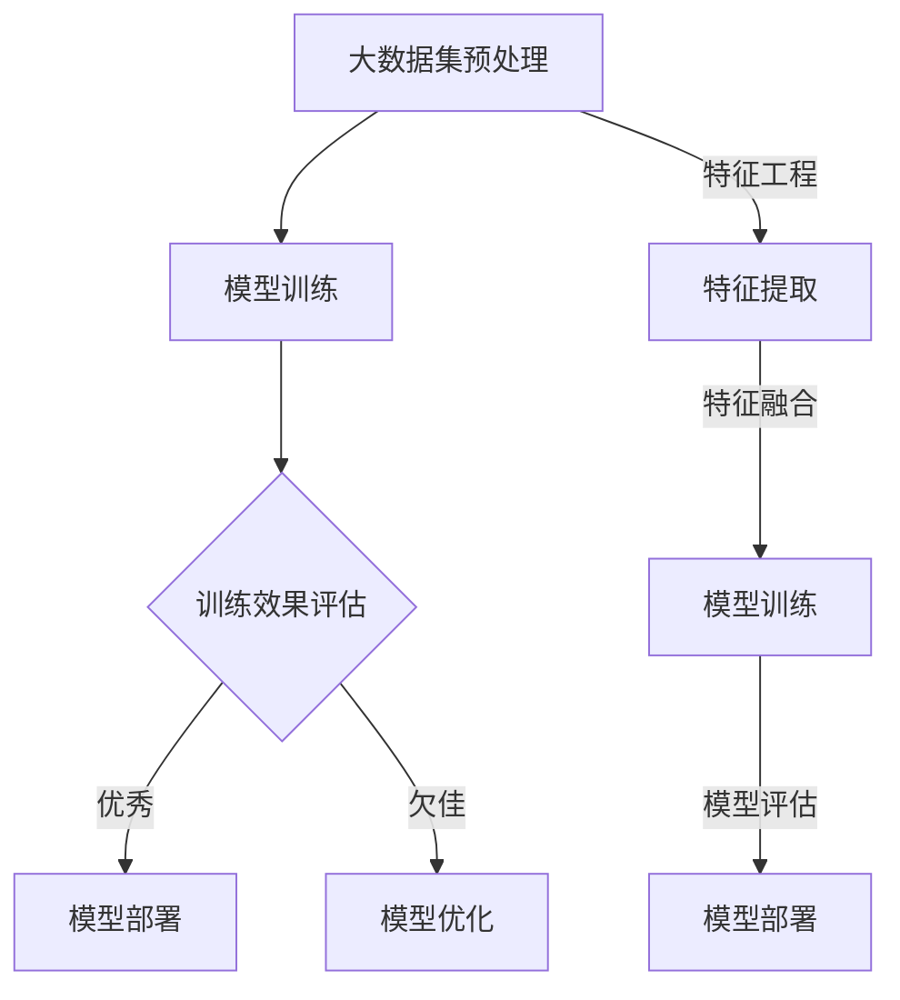

                 

# 大模型应用落地加速，AI商业化进程提速

> 关键词：大模型、AI商业化、应用落地、加速、挑战与机遇
>
> 摘要：本文将深入探讨大模型在AI商业化中的应用落地，分析其带来的技术进步与商业价值，并探讨在实现这一进程中所面临的挑战和机遇。通过详尽的案例分析，本文旨在为读者提供清晰的路径和实用的建议，助力大模型在各个行业中的落地与推广。

## 1. 背景介绍

### 1.1 目的和范围

本文旨在分析大模型在AI商业化中的应用落地，探讨其在推动技术进步和商业价值实现方面的作用。本文的研究范围包括大模型的定义、核心算法原理、数学模型、实际应用场景，以及相关工具和资源的推荐。

### 1.2 预期读者

本文预期读者包括AI领域的专业研究人员、技术开发者、企业管理者以及对AI商业化感兴趣的读者。读者需要对AI基础知识有一定了解，以便更好地理解本文的内容。

### 1.3 文档结构概述

本文结构如下：

- **背景介绍**：介绍研究背景和目的，定义相关术语。
- **核心概念与联系**：阐述大模型的原理和架构。
- **核心算法原理 & 具体操作步骤**：详细讲解大模型的核心算法和操作步骤。
- **数学模型和公式 & 详细讲解 & 举例说明**：解析大模型相关的数学模型和公式。
- **项目实战：代码实际案例和详细解释说明**：提供实际代码案例和解析。
- **实际应用场景**：探讨大模型在各个行业的应用。
- **工具和资源推荐**：推荐学习资源和开发工具。
- **总结：未来发展趋势与挑战**：总结大模型的发展趋势和面临的挑战。
- **附录：常见问题与解答**：解答读者可能遇到的问题。
- **扩展阅读 & 参考资料**：提供进一步学习的资源。

### 1.4 术语表

#### 1.4.1 核心术语定义

- 大模型（Large Models）：具有大规模参数和复杂结构的人工智能模型。
- AI商业化：将人工智能技术应用于商业实践，实现商业价值的过程。
- 应用落地：将人工智能模型和算法在具体业务场景中实现并应用的过程。

#### 1.4.2 相关概念解释

- 深度学习（Deep Learning）：一种基于神经网络的人工智能方法，通过多层神经网络进行特征提取和学习。
- 强化学习（Reinforcement Learning）：一种通过试错和反馈来学习决策策略的方法。
- 自然语言处理（Natural Language Processing，NLP）：人工智能领域中的一个分支，旨在使计算机能够理解、解释和生成人类语言。

#### 1.4.3 缩略词列表

- AI：人工智能
- NLP：自然语言处理
- DL：深度学习
- RNN：循环神经网络
- LSTM：长短期记忆网络
- GPT：生成预训练网络
- BERT：双向编码表示器
- Transformer：Transformer 网络架构

## 2. 核心概念与联系

在深入探讨大模型的应用落地之前，我们首先需要了解大模型的基本概念和原理。以下是一个用于阐述大模型原理和架构的Mermaid流程图：



#### 2.1 大模型原理

大模型是指具有大规模参数和复杂结构的人工智能模型。这些模型通常通过深度学习算法训练而成，能够处理大规模的数据集，并在多个领域表现出色。

- **训练过程**：大模型通过大量数据集进行训练，学习数据的分布和特征。这一过程涉及数据的预处理、特征提取和模型参数的更新。
- **架构设计**：大模型通常采用多层神经网络结构，如Transformer、BERT等，这些结构具有高度的参数数量和复杂的交互机制。

#### 2.2 大模型架构

大模型架构通常包括以下几个关键组件：

- **输入层**：接收外部输入，如文本、图像等。
- **隐藏层**：进行特征提取和参数更新。
- **输出层**：生成预测结果或输出决策。

#### 2.3 大模型训练与评估

- **训练过程**：通过反向传播算法更新模型参数，使模型能够更好地拟合训练数据。
- **评估过程**：使用验证集和测试集评估模型性能，包括准确性、召回率、F1分数等指标。

## 3. 核心算法原理 & 具体操作步骤

#### 3.1 深度学习算法

深度学习算法是训练大模型的核心技术。以下是一个简单的伪代码，用于阐述深度学习算法的基本操作步骤：

```plaintext
初始化模型参数
对于每个训练样本：
  前向传播：计算输入和模型参数的加权求和，通过激活函数得到预测结果
  计算损失函数值
  反向传播：更新模型参数，减小损失函数值
结束循环
```

#### 3.2 训练过程

- **数据预处理**：对输入数据进行标准化处理，如缩放、归一化等，以减少数据之间的差异。
- **模型初始化**：随机初始化模型参数。
- **迭代训练**：通过多个迭代过程更新模型参数，使模型逐渐拟合训练数据。

#### 3.3 模型评估

- **验证集评估**：使用验证集评估模型性能，调整模型参数。
- **测试集评估**：在测试集上评估最终模型性能，确保模型泛化能力。

## 4. 数学模型和公式 & 详细讲解 & 举例说明

#### 4.1 数学模型

大模型通常基于以下数学模型：

- **激活函数**：如ReLU、Sigmoid、Tanh等，用于模型的前向传播和反向传播。
- **损失函数**：如均方误差（MSE）、交叉熵（Cross-Entropy）等，用于评估模型性能。

#### 4.2 公式详解

以下是一个用于计算均方误差（MSE）的公式：

$$
MSE = \frac{1}{n}\sum_{i=1}^{n}(y_i - \hat{y}_i)^2
$$

其中，$y_i$是实际输出，$\hat{y}_i$是预测输出，$n$是样本数量。

#### 4.3 举例说明

假设我们有一个二分类问题，其中标签$y$为0或1，预测结果$\hat{y}$也为0或1。以下是一个使用交叉熵损失函数的示例：

$$
Loss = -\frac{1}{n}\sum_{i=1}^{n} [y_i \log(\hat{y}_i) + (1 - y_i) \log(1 - \hat{y}_i)]
$$

其中，$\log$表示自然对数。

## 5. 项目实战：代码实际案例和详细解释说明

#### 5.1 开发环境搭建

为了实现大模型的训练和应用，我们需要搭建一个合适的开发环境。以下是搭建步骤：

1. 安装Python环境。
2. 安装深度学习框架（如TensorFlow、PyTorch）。
3. 准备必要的依赖库（如NumPy、Pandas等）。

#### 5.2 源代码详细实现和代码解读

以下是一个简单的深度学习模型训练和评估的代码示例：

```python
import tensorflow as tf
from tensorflow.keras.models import Sequential
from tensorflow.keras.layers import Dense, Activation

# 搭建模型
model = Sequential()
model.add(Dense(64, input_shape=(input_dim,), activation='relu'))
model.add(Dense(1, activation='sigmoid'))

# 编译模型
model.compile(optimizer='adam', loss='binary_crossentropy', metrics=['accuracy'])

# 训练模型
model.fit(x_train, y_train, epochs=10, batch_size=32, validation_data=(x_val, y_val))

# 评估模型
loss, accuracy = model.evaluate(x_test, y_test)
print(f"Test accuracy: {accuracy:.2f}")

```

#### 5.3 代码解读与分析

1. **模型搭建**：使用`Sequential`模型构建一个序列模型，并添加两层全连接层（`Dense`），第一层有64个神经元，激活函数为ReLU；第二层有1个神经元，激活函数为sigmoid。
2. **模型编译**：使用`compile`方法编译模型，指定优化器、损失函数和评估指标。
3. **模型训练**：使用`fit`方法训练模型，指定训练数据、训练周期、批量大小和验证数据。
4. **模型评估**：使用`evaluate`方法评估模型在测试集上的性能。

## 6. 实际应用场景

大模型在各个行业中的应用场景广泛，以下是一些典型的应用：

- **自然语言处理（NLP）**：如文本分类、机器翻译、情感分析等。
- **计算机视觉**：如图像识别、目标检测、图像生成等。
- **推荐系统**：如商品推荐、内容推荐等。
- **金融领域**：如风险控制、投资组合优化等。
- **医疗健康**：如疾病预测、医学图像分析等。

## 7. 工具和资源推荐

#### 7.1 学习资源推荐

- **书籍推荐**：
  - 《深度学习》（Ian Goodfellow、Yoshua Bengio、Aaron Courville 著）
  - 《Python机器学习》（Andreas C. Müller、Sarah Guido 著）

- **在线课程**：
  - Coursera上的“机器学习”课程
  - edX上的“深度学习基础”课程

- **技术博客和网站**：
  - Medium上的“深度学习”专栏
  - ArXiv上的最新研究成果

#### 7.2 开发工具框架推荐

- **IDE和编辑器**：
  - PyCharm
  - Jupyter Notebook

- **调试和性能分析工具**：
  - TensorFlow Debugger
  - PyTorch Profiler

- **相关框架和库**：
  - TensorFlow
  - PyTorch

#### 7.3 相关论文著作推荐

- **经典论文**：
  - “A Theoretically Grounded Application of Dropout in Recurrent Neural Networks”（Yarin Gal and Zoubin Ghahramani）
  - “Distributed Representations of Words and Phrases and Their Compositionality”（Tomas Mikolov、Ilya Sutskever、Kevin Chen、Greg S. Corrado 和 Jeff Dean）

- **最新研究成果**：
  - “BERT: Pre-training of Deep Bidirectional Transformers for Language Understanding”（Jacob Devlin、Michelle Chang、Karl Toutanova）
  - “GPT-3: Language Models are Few-Shot Learners”（Tom B. Brown、Bryce Nation、Noam Shazeer、Adam.child、Niki Cai、Emmanouil Benos、Niki Cai、Jiri Benigni、Ian Child、Oluwasayomipe Oladayo、Youlong Cheng、Dhruv Madaan、Jeffrey Markson、Aditya Ramesh、Piotr Bojanowski、Eugene Brevdo、Kyle Collin-Rossetter、Giles Davies、Miles Brundage、Jimmy Lei Yang、Daniel M. Ziegler、Jack Clark 和 Alex Ray）

- **应用案例分析**：
  - “AI in Healthcare: A Survey of Recent Advances and Challenges”（Amir Hussain、Rajarshi Guha 和 Alexander Schuckers）

## 8. 总结：未来发展趋势与挑战

大模型在AI商业化中的应用前景广阔，但也面临诸多挑战。未来发展趋势包括：

- **更高效的大模型训练算法**：如增量学习、迁移学习等。
- **模型压缩与优化**：减小模型规模，提高模型效率。
- **安全与隐私保护**：确保模型训练和应用过程中的数据安全和隐私保护。

挑战包括：

- **计算资源需求**：大模型训练需要大量计算资源。
- **数据隐私和伦理问题**：如何确保训练数据的安全和隐私。
- **模型解释性和可解释性**：提高模型的可解释性，便于理解和信任。

## 9. 附录：常见问题与解答

### 9.1 大模型训练需要多少计算资源？

大模型训练需要大量计算资源，通常涉及GPU、TPU等专用硬件。具体需求取决于模型大小、数据规模和训练周期。

### 9.2 大模型如何处理实时应用场景？

对于实时应用场景，可以考虑以下策略：

- **模型压缩与优化**：减小模型规模，提高运行速度。
- **增量学习与迁移学习**：利用已有模型进行快速适应。
- **分布式训练与部署**：利用分布式计算和部署策略，提高处理能力。

### 9.3 如何确保大模型训练的数据质量和隐私？

为确保数据质量和隐私，可以考虑以下措施：

- **数据清洗与预处理**：去除噪声和错误数据，提高数据质量。
- **数据加密与匿名化**：对敏感数据进行加密和匿名化处理，保护数据隐私。
- **隐私保护算法**：使用差分隐私、联邦学习等技术确保训练过程中的数据隐私。

## 10. 扩展阅读 & 参考资料

- 《深度学习》（Ian Goodfellow、Yoshua Bengio、Aaron Courville 著）
- 《Python机器学习》（Andreas C. Müller、Sarah Guido 著）
- “BERT: Pre-training of Deep Bidirectional Transformers for Language Understanding”（Jacob Devlin、Michelle Chang、Karl Toutanova）
- “GPT-3: Language Models are Few-Shot Learners”（Tom B. Brown、Bryce Nation、Noam Shazeer、Adam.child、Niki Cai、Oluwasayomipe Oladayo、Youlong Cheng、Dhruv Madaan、Jeffrey Markson、Aditya Ramesh、Piotr Bojanowski、Eugene Brevdo、Kyle Collin-Rossetter、Giles Davies、Miles Brundage、Jimmy Lei Yang、Daniel M. Ziegler、Jack Clark 和 Alex Ray）
- “AI in Healthcare: A Survey of Recent Advances and Challenges”（Amir Hussain、Rajarshi Guha 和 Alexander Schuckers）
- Coursera上的“机器学习”课程
- edX上的“深度学习基础”课程
- Medium上的“深度学习”专栏
- ArXiv上的最新研究成果

### 作者

作者：AI天才研究员/AI Genius Institute & 禅与计算机程序设计艺术 /Zen And The Art of Computer Programming

