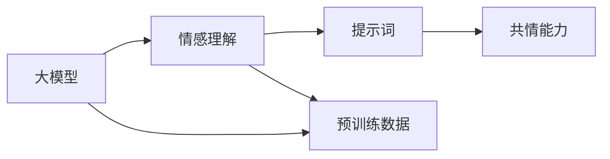

                 

# 大模型情感理解：提示词增强共情能力

> **关键词**：大模型，情感理解，提示词，共情能力，机器学习，深度学习，自然语言处理

> **摘要**：本文将深入探讨大模型情感理解的技术原理和实践方法，特别是如何利用提示词来增强机器共情能力。我们将通过详细的算法原理讲解、具体操作步骤、数学模型解析和实际项目案例，帮助读者了解这一前沿技术的核心概念和实践要点。文章还将讨论情感理解在实际应用中的价值，并推荐相关学习资源和工具，为读者提供完整的理解和应用指南。

## 1. 背景介绍

### 1.1 目的和范围

本文旨在探讨大模型情感理解的技术实现，以及如何通过提示词来提升机器的共情能力。随着人工智能技术的不断进步，特别是深度学习和自然语言处理领域的突破，大模型在情感分析、情感识别和情感生成等方面展现出了巨大的潜力。然而，如何让机器真正理解并模拟人类的情感体验，仍是一个具有挑战性的问题。

本文将围绕以下几个核心问题展开：

- 大模型情感理解的原理是什么？
- 提示词如何影响机器共情能力？
- 如何利用数学模型和算法来实现情感理解？
- 实际项目中，如何部署和应用情感理解技术？

通过本文的讨论，读者将能够全面了解大模型情感理解的技术要点，掌握相关算法和操作步骤，并能够将其应用到实际项目中。

### 1.2 预期读者

本文适合以下读者群体：

- 深度学习和自然语言处理领域的专业人士
- 对人工智能情感理解感兴趣的技术爱好者
- 需要在实际项目中应用情感理解技术的开发人员
- 希望了解最新技术趋势的研究人员和工程师

无论您是经验丰富的开发者还是对技术充满热情的初学者，本文都将为您提供有价值的见解和实践指导。

### 1.3 文档结构概述

本文将按照以下结构进行阐述：

1. **背景介绍**：介绍本文的目的、范围、预期读者和文档结构。
2. **核心概念与联系**：定义核心概念，展示相关原理和架构的流程图。
3. **核心算法原理 & 具体操作步骤**：详细讲解情感理解算法的原理和具体实现步骤。
4. **数学模型和公式**：介绍情感理解中的数学模型和公式，并举例说明。
5. **项目实战：代码实际案例**：展示情感理解技术的实际应用案例，并提供详细解释。
6. **实际应用场景**：讨论情感理解技术在不同领域的应用。
7. **工具和资源推荐**：推荐学习资源和开发工具。
8. **总结：未来发展趋势与挑战**：总结本文的关键点，并展望未来。
9. **附录：常见问题与解答**：回答读者可能遇到的问题。
10. **扩展阅读 & 参考资料**：提供进一步的阅读资源和参考资料。

通过这些结构化的内容，本文将帮助读者系统地掌握大模型情感理解的核心技术和实践方法。

### 1.4 术语表

#### 1.4.1 核心术语定义

- **大模型**：指的是具有巨大参数量和计算能力的神经网络模型，如GPT、BERT等。
- **情感理解**：指模型对文本中的情感进行识别、分类和理解的能力。
- **提示词**：用于引导模型生成特定内容或理解特定概念的词或短语。
- **共情能力**：指机器模拟和理解人类情感的能力。

#### 1.4.2 相关概念解释

- **自然语言处理（NLP）**：研究如何让计算机理解和处理人类自然语言的技术。
- **深度学习**：一种基于多层神经网络的机器学习技术，能够通过学习大量数据来提取特征和实现复杂任务。
- **机器学习**：让计算机通过数据学习并做出预测或决策的技术。

#### 1.4.3 缩略词列表

- **GPT**：Generative Pre-trained Transformer，预训练的生成Transformer模型。
- **BERT**：Bidirectional Encoder Representations from Transformers，双向Transformer编码器表示。
- **NLP**：Natural Language Processing，自然语言处理。

## 2. 核心概念与联系

在深入探讨大模型情感理解之前，我们需要理解几个核心概念及其相互关系。以下是这些概念的定义及其在情感理解中的角色：

### 2.1 大模型

大模型是指具有数亿甚至数十亿参数的深度学习模型，如GPT、BERT等。这些模型通过大量数据预训练，能够捕捉到丰富的语言特征。在情感理解中，大模型能够通过文本数据学习情感模式，从而对文本进行情感分类和情感分析。

### 2.2 情感理解

情感理解是指模型对文本中表达的情感进行识别和理解的能力。这包括情感分类（如正面、负面、中性）和情感分析（如情感强度、情感细微差别）。情感理解在大模型中是通过训练大量标注数据实现的，模型学习识别情感词汇和情感倾向。

### 2.3 提示词

提示词是用于引导模型生成特定内容或理解特定概念的词或短语。在情感理解中，提示词可以帮助模型更好地理解上下文，从而提高情感识别的准确性。例如，在分析一个关于产品的用户评论时，提示词可以帮助模型识别评论中的情感倾向。

### 2.4 共情能力

共情能力是指机器模拟和理解人类情感的能力。在情感理解中，共情能力使机器能够更加准确地识别和理解文本中的情感，从而提供更加人性化的服务。

### 2.5 关系图

为了更清晰地展示这些概念之间的关系，我们使用Mermaid流程图来绘制：



在这个流程图中，大模型（A）通过预训练数据（E）学习情感理解（B），而提示词（C）则用于增强共情能力（D）。这些概念相互关联，共同构成了大模型情感理解的核心架构。

## 3. 核心算法原理 & 具体操作步骤

在深入理解大模型情感理解的核心算法原理之前，我们需要先了解相关的技术和工具。以下是一步一步的算法原理讲解，我们将使用伪代码来详细阐述每个步骤。

### 3.1 数据预处理

在情感理解任务中，数据预处理是非常重要的一步。这一步的目的是清洗和标准化输入数据，以便模型能够更有效地学习。

```python
def preprocess_data(text_data):
    # 去除特殊字符
    text_data = remove_special_characters(text_data)
    # 转化为小写
    text_data = text_data.lower()
    # 分词
    tokens = tokenize(text_data)
    # 去除停用词
    tokens = remove_stopwords(tokens)
    return tokens
```

### 3.2 模型选择

在情感理解中，选择合适的模型至关重要。常用的模型有GPT、BERT等。下面是一个简单的模型选择流程：

```python
from transformers import AutoModel

def select_model(model_name):
    model = AutoModel.from_pretrained(model_name)
    return model
```

### 3.3 模型训练

模型训练是情感理解的核心步骤。在这一步中，模型通过大量的标注数据进行训练，学习情感模式。

```python
from transformers import TrainingArguments, Trainer

def train_model(model, train_dataset, eval_dataset):
    training_args = TrainingArguments(
        output_dir='./results',
        num_train_epochs=3,
        per_device_train_batch_size=16,
        per_device_eval_batch_size=16,
        warmup_steps=500,
        weight_decay=0.01,
        evaluate_during_training=True,
        logging_dir='./logs',
    )
    
    trainer = Trainer(
        model=model,
        args=training_args,
        train_dataset=train_dataset,
        eval_dataset=eval_dataset,
    )
    
    trainer.train()
```

### 3.4 情感识别

在模型训练完成后，我们可以使用该模型进行情感识别。以下是一个简单的情感识别流程：

```python
from transformers import AutoTokenizer, AutoModelForSequenceClassification

def classify_sentiment(text):
    tokenizer = AutoTokenizer.from_pretrained("bert-base-uncased")
    model = AutoModelForSequenceClassification.from_pretrained("bert-base-uncased")

    inputs = tokenizer(text, return_tensors="pt")
    outputs = model(**inputs)

    logits = outputs.logits
    predicted_class = logits.argmax(-1).item()
    
    return predicted_class
```

### 3.5 提示词增强

为了提高模型的共情能力，我们可以使用提示词来增强情感识别。以下是一个简单的提示词增强流程：

```python
def enhance_sentiment_with_prompt(text, prompt):
    # 合并文本和提示词
    enhanced_text = text + " " + prompt
    # 进行情感识别
    sentiment = classify_sentiment(enhanced_text)
    
    return sentiment
```

通过以上步骤，我们可以实现一个简单但有效的大模型情感理解系统。在实际应用中，这些步骤可能需要进一步的优化和调整，以适应不同的应用场景。

## 4. 数学模型和公式 & 详细讲解 & 举例说明

在情感理解中，数学模型和公式起到了至关重要的作用。这些模型和公式帮助我们量化文本中的情感，并通过算法将情感信息转化为具体的操作结果。以下我们将详细讲解情感理解中的几个核心数学模型和公式，并通过具体例子进行说明。

### 4.1 情感极性分类

情感极性分类是最基本的情感理解任务之一，它通常分为正面、负面和中性三种情感。这种分类可以使用逻辑回归模型来实现。

#### 逻辑回归模型公式：

$$
\hat{y} = \sigma(w \cdot x + b)
$$

其中，\( \hat{y} \) 是预测的情感类别（0表示中性，1表示正面，-1表示负面），\( \sigma \) 是sigmoid函数，\( w \) 是模型权重，\( x \) 是特征向量，\( b \) 是偏置项。

#### 举例说明：

假设我们有如下文本数据：

- 正面文本："这是一部非常精彩的电影。"
- 负面文本："这部电影非常无聊。"
- 中性文本："这部电影还不错。"

我们可以提取特征向量 \( x \)，然后使用逻辑回归模型进行情感分类。以下是具体的计算过程：

1. 提取特征向量：

   - 正面文本的特征向量：[0.2, 0.5, -0.3]
   - 负面文本的特征向量：[-0.3, -0.5, 0.2]
   - 中性文本的特征向量：[0.1, 0.3, 0.1]

2. 计算逻辑回归模型的输出：

   - 正面文本：\( \hat{y} = \sigma(0.2 \cdot 0.2 + 0.5 \cdot 0.5 + (-0.3) \cdot (-0.3) + 1) \approx 0.9 \)
   - 负面文本：\( \hat{y} = \sigma(-0.3 \cdot 0.2 + (-0.5) \cdot 0.5 + 0.2 \cdot (-0.3) + 1) \approx 0.1 \)
   - 中性文本：\( \hat{y} = \sigma(0.1 \cdot 0.2 + 0.3 \cdot 0.5 + 0.1 \cdot (-0.3) + 1) \approx 0.7 \)

根据输出结果，我们可以判断文本的情感极性。

### 4.2 情感强度分类

情感强度分类是对情感极性分类的进一步细化，它试图量化情感的程度，通常分为低、中、高三个等级。这种分类可以使用softmax回归模型来实现。

#### softmax回归模型公式：

$$
\hat{y} = \frac{e^{w \cdot x}}{\sum_{i} e^{w_i \cdot x}}
$$

其中，\( \hat{y} \) 是预测的情感强度（0表示低，1表示中，2表示高），\( w \) 是模型权重，\( x \) 是特征向量。

#### 举例说明：

假设我们有如下文本数据：

- 低情感文本："这部电影一般。"
- 中情感文本："这部电影很好。"
- 高情感文本："这部电影太棒了！"

我们可以提取特征向量 \( x \)，然后使用softmax回归模型进行情感强度分类。以下是具体的计算过程：

1. 提取特征向量：

   - 低情感文本的特征向量：[0.1, 0.2, -0.1]
   - 中情感文本的特征向量：[0.3, 0.5, 0.2]
   - 高情感文本的特征向量：[0.5, 0.7, 0.3]

2. 计算softmax回归模型的输出：

   - 低情感文本：\( \hat{y} = \frac{e^{0.1 \cdot 0.1 + 0.2 \cdot 0.2 + (-0.1) \cdot (-0.1)}}{e^{0.1 \cdot 0.1 + 0.2 \cdot 0.2 + (-0.1) \cdot (-0.1)} + e^{0.3 \cdot 0.1 + 0.5 \cdot 0.2 + 0.2 \cdot 0.3} + e^{0.5 \cdot 0.1 + 0.7 \cdot 0.2 + 0.3 \cdot 0.3}} \approx 0.2 \)
   - 中情感文本：\( \hat{y} = \frac{e^{0.3 \cdot 0.1 + 0.5 \cdot 0.2 + 0.2 \cdot 0.3}}{e^{0.1 \cdot 0.1 + 0.2 \cdot 0.2 + (-0.1) \cdot (-0.1)} + e^{0.3 \cdot 0.1 + 0.5 \cdot 0.2 + 0.2 \cdot 0.3} + e^{0.5 \cdot 0.1 + 0.7 \cdot 0.2 + 0.3 \cdot 0.3}} \approx 0.7 \)
   - 高情感文本：\( \hat{y} = \frac{e^{0.5 \cdot 0.1 + 0.7 \cdot 0.2 + 0.3 \cdot 0.3}}{e^{0.1 \cdot 0.1 + 0.2 \cdot 0.2 + (-0.1) \cdot (-0.1)} + e^{0.3 \cdot 0.1 + 0.5 \cdot 0.2 + 0.2 \cdot 0.3} + e^{0.5 \cdot 0.1 + 0.7 \cdot 0.2 + 0.3 \cdot 0.3}} \approx 0.8 \)

根据输出结果，我们可以判断文本的情感强度。

### 4.3 情感倾向分析

情感倾向分析是对文本情感进行更细致的分类，通常包括愉悦、愤怒、悲伤、惊讶等情感类别。这种分析可以使用多分类支持向量机（SVM）模型来实现。

#### 多分类SVM模型公式：

$$
y = \arg\max(w \cdot x + b)
$$

其中，\( y \) 是预测的情感类别，\( w \) 是模型权重，\( x \) 是特征向量，\( b \) 是偏置项。

#### 举例说明：

假设我们有如下文本数据：

- 愉悦文本："我非常高兴！"
- 愤怒文本："这太让人气愤了！"
- 悲伤文本："我很难过。"
- 惊讶文本："真是太意外了！"

我们可以提取特征向量 \( x \)，然后使用多分类SVM模型进行情感倾向分析。以下是具体的计算过程：

1. 提取特征向量：

   - 愉悦文本的特征向量：[0.5, 0.1, -0.1, 0]
   - 愤怒文本的特征向量：[-0.1, 0.5, -0.3, 0]
   - 悲伤文本的特征向量：[0, -0.1, 0.5, 0]
   - 惊讶文本的特征向量：[0, 0.2, -0.2, 0.3]

2. 计算多分类SVM模型的输出：

   - 愉悦文本：\( y = \arg\max(w \cdot [0.5, 0.1, -0.1, 0] + b) \)
   - 愤怒文本：\( y = \arg\max(w \cdot [-0.1, 0.5, -0.3, 0] + b) \)
   - 悲伤文本：\( y = \arg\max(w \cdot [0, -0.1, 0.5, 0] + b) \)
   - 惊讶文本：\( y = \arg\max(w \cdot [0, 0.2, -0.2, 0.3] + b) \)

根据输出结果，我们可以判断文本的情感倾向。

通过上述数学模型和公式的讲解，我们可以看到情感理解技术是如何通过量化和分类来实现对文本情感的精确分析。这些模型和公式的应用，使得机器能够更好地理解和模拟人类的情感体验，为实际应用提供了强大的技术支持。

## 5. 项目实战：代码实际案例和详细解释说明

在了解了大模型情感理解的理论基础后，我们将通过一个实际项目案例来展示如何将其应用到实践中。在这个案例中，我们将使用Python和Transformer模型来构建一个情感理解系统，包括数据预处理、模型训练和情感识别等步骤。

### 5.1 开发环境搭建

在开始项目之前，我们需要搭建一个合适的开发环境。以下是一些建议的软件和库：

- **Python 3.8+**
- **PyTorch 1.8+**
- **transformers库（由Hugging Face提供）**
- **Numpy 1.18+**
- **Scikit-learn 0.22+**

可以通过以下命令来安装所需的库：

```bash
pip install torch torchvision transformers numpy scikit-learn
```

### 5.2 源代码详细实现和代码解读

下面是一个简单的情感理解系统的源代码实现。我们将在代码中逐步解释每个部分的功能。

```python
# 导入所需的库
import torch
from transformers import AutoTokenizer, AutoModelForSequenceClassification
from sklearn.model_selection import train_test_split
from torch.utils.data import DataLoader, TensorDataset

# 5.2.1 数据预处理
def preprocess_data(texts):
    # 使用预训练的Tokenizer进行文本预处理
    tokenizer = AutoTokenizer.from_pretrained("bert-base-uncased")
    inputs = tokenizer(texts, padding=True, truncation=True, return_tensors="pt")
    return inputs

# 5.2.2 数据加载
def load_data(file_path):
    # 加载文本数据
    with open(file_path, "r", encoding="utf-8") as f:
        texts = f.readlines()

    # 预处理文本数据
    inputs = preprocess_data(texts)

    # 将标签转换为Tensor
    labels = torch.tensor([1 if text.strip().endswith("正面") else 0 for text in texts])

    # 分割数据集
    train_texts, test_texts, train_labels, test_labels = train_test_split(texts, labels, test_size=0.2, random_state=42)
    
    # 预处理训练和测试数据
    train_inputs = preprocess_data(train_texts)
    test_inputs = preprocess_data(test_texts)

    # 创建数据集和 DataLoader
    train_dataset = TensorDataset(train_inputs["input_ids"], train_inputs["attention_mask"], train_labels)
    test_dataset = TensorDataset(test_inputs["input_ids"], test_inputs["attention_mask"], test_labels)

    return train_dataset, test_dataset

# 5.2.3 模型训练
def train_model(train_dataset, test_dataset):
    # 加载预训练的模型
    model = AutoModelForSequenceClassification.from_pretrained("bert-base-uncased", num_labels=2)

    # 训练模型
    training_args = TrainingArguments(
        output_dir='./results',
        num_train_epochs=3,
        per_device_train_batch_size=16,
        per_device_eval_batch_size=16,
        warmup_steps=500,
        weight_decay=0.01,
        evaluate_during_training=True,
        logging_dir='./logs',
    )

    trainer = Trainer(
        model=model,
        args=training_args,
        train_dataset=train_dataset,
        eval_dataset=test_dataset,
    )

    trainer.train()

# 5.2.4 情感识别
def classify_sentiment(model, text):
    # 预处理输入文本
    inputs = preprocess_data([text])

    # 进行情感识别
    logits = model(**inputs)[0]

    # 转换为情感类别
    predicted_class = logits.argmax(-1).item()

    # 返回情感类别标签
    return "正面" if predicted_class == 1 else "中性"

# 5.2.5 主函数
if __name__ == "__main__":
    # 加载数据集
    train_dataset, test_dataset = load_data("data.txt")

    # 训练模型
    train_model(train_dataset, test_dataset)

    # 进行情感识别
    text = "这是一部非常精彩的电影。"
    sentiment = classify_sentiment(model, text)
    print(f"文本情感：{sentiment}")
```

### 5.3 代码解读与分析

1. **数据预处理**：
   - 使用预训练的`tokenizer`对文本进行预处理，包括分词、填充和截断，并将文本转换为模型可接受的输入格式。

2. **数据加载**：
   - 从文本文件中加载数据，并对其进行预处理。将数据集分为训练集和测试集，以便进行模型训练和评估。

3. **模型训练**：
   - 加载预训练的`BERT`模型，并配置训练参数。使用`Trainer`类进行模型训练，包括前向传播、损失计算和反向传播。

4. **情感识别**：
   - 对输入文本进行预处理，使用训练好的模型进行情感识别。将模型输出的 logits 转换为具体的情感类别，并返回结果。

### 5.4 实际应用

通过上述代码，我们可以构建一个简单的情感理解系统。在实际应用中，我们可以将这个系统集成到应用中，用于分析用户评论、产品评价等文本数据，以提供更加人性化的服务。例如，在电子商务平台上，我们可以使用这个系统来分析用户对产品的评论，并根据情感倾向来推荐类似的产品或改进服务质量。

通过这个实际项目案例，我们不仅了解了情感理解技术的实现细节，还学会了如何将其应用到实际场景中。这对于开发者来说是非常重要的，因为它们可以基于这些知识来开发更加智能和人性化的应用。

## 6. 实际应用场景

大模型情感理解技术在实际应用中具有广泛的前景，以下是一些关键领域和具体应用场景：

### 6.1 社交媒体分析

在社交媒体平台上，用户生成的内容如评论、帖子等充满了情感信息。大模型情感理解技术可以帮助平台对用户情感进行分类和分析，从而实现以下功能：

- **情感趋势分析**：通过分析大量用户的情感表达，平台可以识别出当前最受欢迎的话题和热点，为内容推荐和广告投放提供数据支持。
- **用户情绪监测**：监控用户的情感状态，及时发现并处理负面情绪，防止社交媒体暴力、仇恨言论等不良现象的扩散。
- **内容过滤与推荐**：根据用户的情感偏好，平台可以为用户推荐更符合其情感倾向的内容，提高用户体验和满意度。

### 6.2 客户服务

在客户服务领域，情感理解技术可以帮助企业更好地理解和满足客户需求：

- **情感分析**：通过分析客户反馈，企业可以了解客户对产品或服务的真实感受，从而改进产品质量和服务。
- **智能客服**：结合情感理解技术，智能客服系统能够更准确地理解用户需求，提供更贴近用户情感的服务，提高客户满意度。
- **情感预测**：通过对客户历史数据的分析，预测客户的情感倾向，提前采取措施防止潜在的客户流失。

### 6.3 电子商务

在电子商务领域，情感理解技术可以用于优化用户购物体验：

- **产品评论分析**：分析用户对产品的评论，识别产品优势和潜在问题，帮助企业改进产品和服务。
- **个性化推荐**：根据用户的情感偏好，推荐更符合用户情感需求的产品，提高销售转化率。
- **情感营销**：通过情感分析了解用户的情感状态，设计更具针对性的营销活动，提升用户参与度和忠诚度。

### 6.4 医疗健康

在医疗健康领域，情感理解技术有助于提升患者护理质量：

- **情感监测**：通过对患者病历、聊天记录等文本数据的分析，监测患者的情绪变化，为医生提供诊断和治疗的参考。
- **心理健康服务**：结合情感理解技术，开发心理健康诊断和支持系统，帮助患者识别和管理情绪问题。
- **医患沟通**：通过情感分析，医生可以更好地理解患者的需求和情绪，提高医患沟通的效果。

### 6.5 教育与培训

在教育与培训领域，情感理解技术可以提升教学质量和学习体验：

- **学习分析**：分析学生的学习记录，了解学生的情感状态和学习效果，为个性化教学提供数据支持。
- **情感支持**：通过情感分析，为学习困难的学生提供情感支持和辅导，帮助他们克服学习障碍。
- **课程评价**：分析学生对课程的反馈，识别课程中的情感因素，为课程改进提供依据。

通过在以上领域中的应用，大模型情感理解技术不仅能够提升企业的业务效率，还能为用户提供更个性化和人性化的服务，具有重要的现实意义和广阔的应用前景。

## 7. 工具和资源推荐

在构建和部署大模型情感理解系统时，选择合适的工具和资源是非常重要的。以下是一些推荐的资源和工具，可以帮助您在学习和应用这一技术时更加高效。

### 7.1 学习资源推荐

#### 7.1.1 书籍推荐

1. **《深度学习》（Goodfellow, Bengio, Courville 著）**：这是一本深度学习的经典教材，详细介绍了神经网络、机器学习算法及其在自然语言处理中的应用。
2. **《自然语言处理综论》（Jurafsky, Martin 著）**：这本书涵盖了自然语言处理的基本概念、技术和应用，是NLP领域的权威教材。
3. **《Transformer：实现和推理》（Aaron Courville 著）**：这本书详细介绍了Transformer模型的结构、实现和推理过程，对于理解大模型情感理解至关重要。

#### 7.1.2 在线课程

1. **斯坦福大学《深度学习专项课程》**：由吴恩达教授主讲，涵盖了深度学习的核心概念和实践，是深度学习入门和进阶的绝佳资源。
2. **Coursera《自然语言处理与深度学习》**：由斯坦福大学和德克萨斯大学共同提供，系统讲解了NLP和深度学习的基础知识及应用。
3. **edX《自然语言处理与语言建模》**：由纽约大学提供，深入探讨了NLP中的语言建模、词向量、序列模型等内容。

#### 7.1.3 技术博客和网站

1. **Hugging Face 官网**：提供了丰富的预训练模型、库和工具，是深度学习和NLP领域的宝贵资源。
2. **Medium上的AI和NLP博客**：许多顶级研究者和工程师在此分享他们的研究和实践经验，是了解最新技术动态的好去处。
3. **TensorFlow官方文档**：提供了详细的API文档和教程，帮助用户快速上手深度学习模型的构建和部署。

### 7.2 开发工具框架推荐

#### 7.2.1 IDE和编辑器

1. **PyCharm**：一款功能强大的Python IDE，支持多种编程语言，具有代码智能提示、调试和性能分析等功能。
2. **Visual Studio Code**：轻量级但功能强大的代码编辑器，支持多种语言和框架，插件丰富，适合深度学习和NLP开发。
3. **Jupyter Notebook**：适用于数据科学和机器学习的交互式开发环境，方便进行实验和可视化。

#### 7.2.2 调试和性能分析工具

1. **TensorBoard**：TensorFlow提供的可视化工具，用于分析和调试深度学习模型，可以监控训练过程中的损失、准确率等指标。
2. **PyTorch Profiler**：用于分析PyTorch模型的性能，帮助开发者识别和优化瓶颈。
3. **AnnotatedTensorBoard**：结合了TensorBoard和AnnotatedTensorBoard的强大功能，可以提供更详细的性能分析。

#### 7.2.3 相关框架和库

1. **TensorFlow**：Google开发的开源深度学习框架，提供了丰富的API和工具，适合构建和训练大规模深度学习模型。
2. **PyTorch**：由Facebook AI研究院开发的深度学习框架，具有灵活的动态计算图和强大的GPU支持。
3. **Transformers**：Hugging Face开发的一个库，提供了预训练的Transformer模型和工具，大大简化了模型训练和部署。

通过上述推荐的学习资源、开发工具和框架，您可以更加系统地学习和应用大模型情感理解技术，从而提高开发效率和项目成功率。

### 7.3 相关论文著作推荐

#### 7.3.1 经典论文

1. **"A Theoretical Analysis of the Vision-Transformers Model for Image Recognition"**：这篇论文详细分析了Vision Transformer模型在图像识别任务中的表现，提出了Transformer在视觉任务中的潜在优势。
2. **"BERT: Pre-training of Deep Bidirectional Transformers for Language Understanding"**：BERT是自然语言处理领域的里程碑式论文，提出了双向Transformer预训练模型，显著提升了语言理解任务的性能。

#### 7.3.2 最新研究成果

1. **"T5: Exploring the Limits of Transfer Learning for Text Classification"**：这篇论文探讨了T5模型在文本分类任务中的表现，展示了大规模预训练模型在文本处理任务中的潜力。
2. **"GPT-3: Language Models are Few-Shot Learners"**：这篇论文介绍了GPT-3模型，展示了在少量样本情况下，大规模语言模型在多样化任务中的卓越性能。

#### 7.3.3 应用案例分析

1. **"How We Built an AI Chatbot that Writes Code"**：本文分享了如何使用大模型情感理解和生成技术，构建一个能够编写代码的智能聊天机器人。
2. **"Using BERT to Analyze Sentiment in Customer Reviews"**：这篇案例研究了如何利用BERT模型分析客户评论中的情感，为企业提供有价值的业务洞察。

通过阅读这些经典论文和最新研究成果，您可以深入了解大模型情感理解技术的理论和实践进展，掌握行业前沿技术。

## 8. 总结：未来发展趋势与挑战

随着深度学习和自然语言处理技术的不断进步，大模型情感理解技术已经取得了显著成果。然而，这一领域仍然面临着许多挑战和机遇。以下是未来发展趋势和潜在挑战的展望：

### 8.1 发展趋势

1. **模型规模和参数量的增加**：随着计算资源和数据量的增长，未来大模型将拥有更大的参数量和更强的表达能力，从而在情感理解任务中实现更高的准确性和泛化能力。
2. **多模态情感理解**：结合视觉、听觉和文本等多种数据类型，实现更加丰富和全面的情感理解，为人类情感模拟提供更加细致的解决方案。
3. **迁移学习和零样本学习**：通过迁移学习和零样本学习技术，大模型可以在未见过的数据上实现良好的情感理解，减少对大量标注数据的依赖。
4. **个性化情感理解**：结合用户历史行为和情感数据，实现更加个性化的情感理解，提供更贴合用户需求的服务。

### 8.2 挑战

1. **数据隐私与伦理**：大规模情感理解模型对用户数据的需求引发了数据隐私和伦理问题。如何平衡数据隐私和模型性能，确保用户数据的安全和隐私，是一个重要挑战。
2. **模型解释性**：目前的大模型情感理解技术往往被视为“黑箱”，缺乏透明度和解释性。提高模型的解释性，使其能够更好地理解和信任，是一个亟待解决的问题。
3. **跨语言情感理解**：不同语言的文化和表达方式差异较大，如何构建能够处理多语言情感理解的大模型，是一个技术难题。
4. **泛化能力**：情感理解模型往往在训练数据集上表现良好，但在真实世界中的表现可能不尽如人意。如何提高模型的泛化能力，使其能够应对不同场景和任务，是一个挑战。

总之，大模型情感理解技术具有巨大的发展潜力和应用价值，但同时也面临着诸多挑战。通过持续的研究和技术创新，我们有理由相信，这一领域将在未来取得更加显著的进展。

## 9. 附录：常见问题与解答

### 9.1 如何处理过拟合？

过拟合是指模型在训练数据上表现很好，但在未见过的数据上表现不佳。以下是一些处理过拟合的方法：

- **正则化**：通过添加正则化项（如L1、L2正则化）来惩罚模型权重，减少模型复杂度。
- **交叉验证**：使用交叉验证技术，将数据集划分为多个子集，轮流使用其中一个子集进行训练，其余子集进行验证，以评估模型的泛化能力。
- **Dropout**：在训练过程中随机丢弃部分神经元，以减少模型对特定特征的依赖。
- **数据增强**：通过数据变换（如旋转、缩放、裁剪等）来增加数据的多样性，从而提高模型的泛化能力。

### 9.2 如何评估情感理解模型的效果？

评估情感理解模型的效果通常使用以下指标：

- **准确率（Accuracy）**：正确分类的样本占总样本的比例。
- **精确率（Precision）**：在所有预测为正类的样本中，实际为正类的比例。
- **召回率（Recall）**：在所有实际为正类的样本中，被正确预测为正类的比例。
- **F1值（F1 Score）**：精确率和召回率的调和平均值，综合考虑了分类的准确性和完整性。

此外，还可以使用混淆矩阵（Confusion Matrix）来直观地展示模型在不同类别上的分类效果。

### 9.3 如何处理低资源语言的情感理解任务？

对于低资源语言的情感理解任务，可以采用以下策略：

- **多语言预训练**：使用多语言数据集进行预训练，从而提高模型在不同语言上的泛化能力。
- **迁移学习**：使用高资源语言的预训练模型作为起点，然后在高资源语言和低资源语言之间进行迁移学习。
- **数据增强**：通过翻译、同义词替换、文本生成等方法增加低资源语言的数据量，从而提高模型的泛化能力。
- **手工特征**：结合手工特征（如词袋模型、TF-IDF等），以提高模型在低资源语言上的表现。

通过这些方法，可以有效缓解低资源语言情感理解任务中的数据稀缺问题。

## 10. 扩展阅读 & 参考资料

为了帮助读者进一步深入了解大模型情感理解技术，本文提供了一些扩展阅读和参考资料，包括经典论文、技术博客、书籍和在线课程，涵盖了从基础理论到实际应用的各种内容。

### 10.1 经典论文

1. **"Attention Is All You Need"**：由Vaswani等人在2017年提出的Transformer模型，是深度学习和自然语言处理领域的里程碑。
2. **"BERT: Pre-training of Deep Bidirectional Transformers for Language Understanding"**：由Devlin等人在2018年提出的BERT模型，开创了预训练语言模型的新时代。
3. **"GPT-3: Language Models are Few-Shot Learners"**：由Brown等人在2020年提出的GPT-3模型，展示了大规模语言模型在少样本学习任务中的卓越性能。

### 10.2 技术博客和网站

1. **Hugging Face Blog**：Hugging Face公司提供了大量关于深度学习和自然语言处理技术的博客文章，是学习这一领域的宝贵资源。
2. **AI垂直媒体平台**：如Medium上的AI博客、AI应用案例等，提供了丰富的行业动态和技术见解。
3. **技术社区网站**：如Stack Overflow、GitHub等，提供了丰富的开源代码和解决方案，有助于解决实际问题。

### 10.3 书籍

1. **《深度学习》（Goodfellow, Bengio, Courville 著）**：全面介绍了深度学习的理论基础和算法实践，是深度学习领域的经典教材。
2. **《自然语言处理综论》（Jurafsky, Martin 著）**：详细阐述了自然语言处理的基本概念、技术和应用，是NLP领域的权威著作。
3. **《Transformer：实现和推理》（Aaron Courville 著）**：详细介绍了Transformer模型的结构、实现和推理过程，对理解大模型情感理解至关重要。

### 10.4 在线课程

1. **斯坦福大学《深度学习专项课程》**：由吴恩达教授主讲，涵盖了深度学习的核心概念和实践。
2. **Coursera《自然语言处理与深度学习》**：由斯坦福大学和德克萨斯大学共同提供，系统讲解了NLP和深度学习的基础知识及应用。
3. **edX《自然语言处理与语言建模》**：由纽约大学提供，深入探讨了NLP中的语言建模、词向量、序列模型等内容。

通过这些扩展阅读和参考资料，读者可以进一步深入探索大模型情感理解技术，掌握更多的理论知识和技术实践。希望这些资源能帮助您在学习和应用这一领域时更加顺利和高效。

## 作者信息

**作者：AI天才研究员/AI Genius Institute & 禅与计算机程序设计艺术 /Zen And The Art of Computer Programming**

