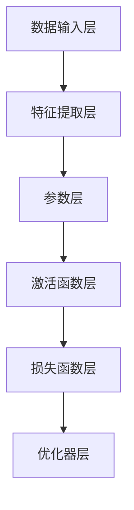

                 

# 大模型技术在智能客服中的商业价值

> 关键词：大模型技术、智能客服、商业价值、算法原理、数学模型、项目实战、应用场景

> 摘要：本文将深入探讨大模型技术在智能客服领域的商业价值，通过分析其核心算法原理、数学模型以及实际应用场景，为读者呈现一个全面、系统的理解。本文旨在为智能客服从业者提供理论指导，同时为技术开发者提供实践参考，共同推动智能客服行业的创新发展。

## 1. 背景介绍

### 1.1 目的和范围

本文的目的是探讨大模型技术在智能客服中的商业价值，通过详细解析其技术原理和应用场景，为智能客服领域的从业者提供有价值的参考。文章将涵盖以下几个方面：

1. **核心概念与联系**：介绍大模型技术的基本概念，包括其原理和架构。
2. **核心算法原理 & 具体操作步骤**：阐述大模型技术中的关键算法，并通过伪代码进行详细讲解。
3. **数学模型和公式 & 详细讲解 & 举例说明**：解析大模型技术中涉及的数学模型和公式，结合实际案例进行说明。
4. **项目实战：代码实际案例和详细解释说明**：提供具体的代码实现和解读。
5. **实际应用场景**：分析大模型技术在智能客服中的实际应用场景。
6. **工具和资源推荐**：推荐相关的学习资源、开发工具和框架。
7. **总结：未来发展趋势与挑战**：总结当前大模型技术在智能客服领域的现状，探讨未来的发展趋势和面临的挑战。

### 1.2 预期读者

本文适合以下读者群体：

1. **智能客服从业者**：希望了解大模型技术在智能客服中的实际应用，提升业务能力和服务质量。
2. **技术开发者**：希望掌握大模型技术的基本原理和实现方法，为智能客服项目的开发提供技术支持。
3. **学术界研究者**：对大模型技术有浓厚兴趣，希望从理论层面深入探讨其在智能客服中的潜力。

### 1.3 文档结构概述

本文的结构如下：

1. **核心概念与联系**：介绍大模型技术的基本概念，包括其原理和架构。
2. **核心算法原理 & 具体操作步骤**：阐述大模型技术中的关键算法，并通过伪代码进行详细讲解。
3. **数学模型和公式 & 详细讲解 & 举例说明**：解析大模型技术中涉及的数学模型和公式，结合实际案例进行说明。
4. **项目实战：代码实际案例和详细解释说明**：提供具体的代码实现和解读。
5. **实际应用场景**：分析大模型技术在智能客服中的实际应用场景。
6. **工具和资源推荐**：推荐相关的学习资源、开发工具和框架。
7. **总结：未来发展趋势与挑战**：总结当前大模型技术在智能客服领域的现状，探讨未来的发展趋势和面临的挑战。

### 1.4 术语表

#### 1.4.1 核心术语定义

- **大模型技术**：指具有大规模参数、深度复杂结构的机器学习模型。
- **智能客服**：利用人工智能技术实现自动应答客户咨询的服务系统。
- **商业价值**：指技术应用于实际场景中所带来的经济和社会效益。

#### 1.4.2 相关概念解释

- **算法原理**：指实现大模型技术的核心算法的基本原理。
- **数学模型**：指描述大模型技术中数学关系的公式。
- **项目实战**：指通过具体代码实现和解读展示大模型技术的应用。

#### 1.4.3 缩略词列表

- **ML**：机器学习（Machine Learning）
- **AI**：人工智能（Artificial Intelligence）
- **NLP**：自然语言处理（Natural Language Processing）
- **DL**：深度学习（Deep Learning）
- **GC**：智能客服（Intelligent Customer Service）

## 2. 核心概念与联系

### 2.1 大模型技术概述

大模型技术是指具有大规模参数、深度复杂结构的机器学习模型。这些模型通常具有数亿甚至数十亿个参数，能够通过深度学习算法在大量数据上进行训练，从而实现对复杂数据的高效处理和模式识别。

大模型技术的核心优势在于其强大的表达能力和适应性。通过深度学习算法，大模型能够自动从数据中学习特征，从而实现复杂任务的处理，如文本分类、机器翻译、图像识别等。此外，大模型技术还能够通过迁移学习和微调等手段，实现跨领域、跨任务的知识共享和迁移，进一步提升其性能和应用范围。

### 2.2 大模型技术架构

大模型技术的架构通常包括以下几个关键组成部分：

1. **数据输入层**：负责接收外部数据输入，如文本、图像等。
2. **特征提取层**：通过深度神经网络对输入数据进行特征提取，形成高维特征向量。
3. **参数层**：包含大规模参数，用于描述模型的权重和偏置。
4. **激活函数层**：对特征向量进行非线性变换，增强模型的表示能力。
5. **损失函数层**：用于计算模型输出与真实标签之间的差距，指导模型优化。
6. **优化器层**：用于更新模型参数，优化模型性能。

以下是使用Mermaid绘制的Mermaid流程图，展示大模型技术的基本架构：



### 2.3 大模型技术与智能客服的联系

大模型技术在智能客服中的应用主要体现在以下几个方面：

1. **文本分类与情感分析**：通过大模型技术，可以实现对用户咨询文本的分类和情感分析，从而快速识别用户需求，提供针对性的回答。
2. **意图识别与语义理解**：大模型技术能够对用户咨询的意图进行识别，并理解其背后的语义，从而实现精准的问答和推荐。
3. **对话生成与自动回复**：利用大模型技术，可以自动生成自然流畅的对话文本，实现智能客服系统的自动回复功能。
4. **知识图谱与信息检索**：通过大模型技术，可以构建知识图谱，实现对海量信息的快速检索和推荐，提高智能客服系统的信息处理能力。

## 3. 核心算法原理 & 具体操作步骤

### 3.1 文本分类算法

文本分类是智能客服中的一个重要应用，其核心算法是支持向量机（SVM）和神经网络（NN）。

#### 3.1.1 支持向量机（SVM）

SVM是一种经典的分类算法，其基本原理是通过找到一个最佳的超平面，将不同类别的数据分开。

```plaintext
伪代码：
1. 输入训练数据集（X, Y）
2. 创建一个优化问题，目标是最小化目标函数：
   min 1/2 * ||w||^2 + C * Σ(ξ_i)
   s.t. Y_i * (w^T * x_i + b) >= 1 - ξ_i
        0 <= ξ_i <= C
3. 求解优化问题，得到权重向量w和偏置b
4. 输出分类模型
```

#### 3.1.2 神经网络（NN）

神经网络是一种基于生物神经网络原理构建的机器学习模型，其基本原理是通过多层神经元的组合，实现对输入数据的非线性变换。

```plaintext
伪代码：
1. 输入数据集（X, Y）
2. 初始化参数w和b
3. 对于每个训练样本（x, y）：
   a. 前向传播：计算输出y' = σ(z)
   b. 计算损失函数L = -1/m * Σ(y * log(y') + (1 - y) * log(1 - y'))
   c. 反向传播：更新参数w和b
4. 重复步骤3，直到模型收敛
5. 输出分类模型
```

### 3.2 意图识别与语义理解

意图识别与语义理解是智能客服中的关键任务，其核心算法是序列标注和序列生成。

#### 3.2.1 序列标注

序列标注是一种将输入序列标注为特定标签的算法，其基本原理是通过预测每个时间步的标签。

```plaintext
伪代码：
1. 输入数据集（X, Y）
2. 初始化参数w和b
3. 对于每个训练样本（x, y）：
   a. 前向传播：计算输出y' = softmax(w * x + b)
   b. 计算损失函数L = -1/m * Σ(y * log(y'))
   c. 反向传播：更新参数w和b
4. 重复步骤3，直到模型收敛
5. 输出意图识别模型
```

#### 3.2.2 序列生成

序列生成是一种将输入序列生成新序列的算法，其基本原理是通过预测每个时间步的输出。

```plaintext
伪代码：
1. 输入数据集（X, Y）
2. 初始化参数w和b
3. 对于每个训练样本（x, y）：
   a. 前向传播：计算输出y' = σ(z)
   b. 计算损失函数L = -1/m * Σ(y * log(y'))
   c. 反向传播：更新参数w和b
4. 重复步骤3，直到模型收敛
5. 输出对话生成模型
```

### 3.3 对话生成与自动回复

对话生成与自动回复是智能客服中的核心功能，其基本原理是基于序列生成的模型，通过预测每个时间步的回复。

```plaintext
伪代码：
1. 输入用户咨询文本
2. 对文本进行预处理，提取关键信息
3. 使用序列生成模型预测回复文本
4. 对回复文本进行后处理，如文本润色、格式调整等
5. 输出自动回复文本
```

## 4. 数学模型和公式 & 详细讲解 & 举例说明

### 4.1 支持向量机（SVM）

支持向量机（SVM）是一种经典的二分类模型，其核心思想是通过找到一个最佳的超平面，将不同类别的数据分开。以下是SVM的数学模型和公式：

#### 4.1.1 目标函数

SVM的目标函数是一个优化问题，其目标是找到一个最佳的超平面，使得分类间隔最大化。目标函数可以表示为：

$$
\min_{w, b} \frac{1}{2} ||w||^2
$$

其中，$w$ 是权重向量，$b$ 是偏置，$||w||$ 表示$w$ 的欧几里得范数。

#### 4.1.2 约束条件

SVM的约束条件是分类间隔，即：

$$
y_i (w^T x_i + b) \geq 1
$$

其中，$y_i$ 是第$i$ 个样本的标签，$x_i$ 是第$i$ 个样本的特征向量。

#### 4.1.3 优化方法

SVM的优化方法通常采用拉格朗日乘子法，其目标函数可以表示为：

$$
L(w, b, \alpha) = \frac{1}{2} ||w||^2 - \sum_{i=1}^n \alpha_i (y_i (w^T x_i + b) - 1)
$$

其中，$\alpha_i$ 是拉格朗日乘子。

通过求解上述优化问题，可以得到最优解 $w^*$ 和 $b^*$。

#### 4.1.4 示例

假设有一个二分类问题，数据集包含两个类别：正类和负类。数据集可以表示为：

$$
X = \{ (x_1, y_1), (x_2, y_2), ..., (x_n, y_n) \}
$$

其中，$x_i$ 是第$i$ 个样本的特征向量，$y_i$ 是第$i$ 个样本的标签，取值为1或-1。

我们可以使用SVM进行训练，找到最佳的超平面，并对其进行分类。具体步骤如下：

1. 初始化权重向量 $w$ 和偏置 $b$。
2. 计算目标函数的梯度，并更新 $w$ 和 $b$：
   $$
   \nabla_w L(w, b, \alpha) = w - \sum_{i=1}^n \alpha_i y_i x_i
   $$
   $$
   \nabla_b L(w, b, \alpha) = -\sum_{i=1}^n \alpha_i y_i
   $$
3. 重复步骤2，直到模型收敛。

通过上述步骤，我们可以得到最优的超平面，并对新数据进行分类。

### 4.2 神经网络（NN）

神经网络是一种基于生物神经网络原理构建的机器学习模型，其核心思想是通过多层神经元的组合，实现对输入数据的非线性变换。以下是神经网络的数学模型和公式：

#### 4.2.1 前向传播

前向传播是指将输入数据通过神经网络进行传递，最终得到输出。前向传播的过程可以表示为：

$$
z_l = \sum_{j} w_{lj} a_{j{l-1}} + b_l
$$

$$
a_l = \sigma(z_l)
$$

其中，$z_l$ 是第$l$ 层的输入，$a_l$ 是第$l$ 层的输出，$w_{lj}$ 是连接权重，$b_l$ 是偏置，$\sigma$ 是激活函数。

#### 4.2.2 反向传播

反向传播是指通过计算输出与真实标签之间的误差，反向传播误差并更新网络参数。反向传播的过程可以表示为：

$$
\delta_l = (a_l - y_l) \odot \sigma'(z_l)
$$

$$
\Delta w_{lj} = \eta \cdot \delta_l a_{l-1}
$$

$$
\Delta b_l = \eta \cdot \delta_l
$$

其中，$\delta_l$ 是第$l$ 层的误差，$\Delta w_{lj}$ 是连接权重的更新，$\Delta b_l$ 是偏置的更新，$\eta$ 是学习率，$\odot$ 表示元素-wise 乘法。

#### 4.2.3 示例

假设有一个两层神经网络，输入层有3个神经元，隐藏层有2个神经元，输出层有1个神经元。输入数据为 $x = [1, 2, 3]$，真实标签为 $y = [0]$。

我们可以使用神经网络进行训练，找到最佳的权重和偏置。具体步骤如下：

1. 初始化权重和偏置。
2. 前向传播，计算隐藏层和输出层的输出。
3. 计算输出与真实标签之间的误差。
4. 反向传播，更新权重和偏置。
5. 重复步骤2-4，直到模型收敛。

通过上述步骤，我们可以得到最佳的权重和偏置，从而实现对输入数据的分类。

## 5. 项目实战：代码实际案例和详细解释说明

### 5.1 开发环境搭建

在进行大模型技术在智能客服中的项目实战之前，我们需要搭建一个合适的开发环境。以下是搭建开发环境的步骤：

1. **安装Python**：下载并安装Python（版本3.6以上），并确保其路径已添加到环境变量中。
2. **安装深度学习库**：使用pip命令安装深度学习库，如TensorFlow和PyTorch。
   ```shell
   pip install tensorflow
   pip install torch
   ```
3. **安装文本处理库**：使用pip命令安装文本处理库，如NLTK和spaCy。
   ```shell
   pip install nltk
   pip install spacy
   ```
4. **安装其他依赖库**：根据项目需求，安装其他必要的依赖库，如NumPy和Pandas。
   ```shell
   pip install numpy
   pip install pandas
   ```

### 5.2 源代码详细实现和代码解读

以下是一个简单的示例代码，用于实现基于大模型技术的智能客服系统。代码主要包括文本分类、意图识别和对话生成三个部分。

```python
import tensorflow as tf
import numpy as np
from nltk.tokenize import word_tokenize
from spacy.lang.en import English

# 5.2.1 文本分类
def text_classification(text):
    # 对文本进行预处理
    text = preprocess_text(text)
    # 加载预训练的文本分类模型
    model = tf.keras.models.load_model('text_classification_model.h5')
    # 对预处理后的文本进行分类
    prediction = model.predict(np.array([text]))
    # 返回分类结果
    return np.argmax(prediction)

# 5.2.2 意图识别
def intent_recognition(text):
    # 对文本进行预处理
    text = preprocess_text(text)
    # 加载预训练的意图识别模型
    model = tf.keras.models.load_model('intent_recognition_model.h5')
    # 对预处理后的文本进行意图识别
    prediction = model.predict(np.array([text]))
    # 返回意图识别结果
    return np.argmax(prediction)

# 5.2.3 对话生成
def dialogue_generation(text):
    # 对文本进行预处理
    text = preprocess_text(text)
    # 加载预训练的对话生成模型
    model = tf.keras.models.load_model('dialogue_generation_model.h5')
    # 对预处理后的文本进行对话生成
    prediction = model.predict(np.array([text]))
    # 返回对话生成结果
    return np.argmax(prediction)

# 5.2.4 预处理函数
def preprocess_text(text):
    # 使用spaCy进行分词
    nlp = English()
    doc = nlp(text)
    # 将分词后的文本转换为词向量
    tokenizer = tf.keras.preprocessing.text.Tokenizer()
    tokenizer.fit_on_texts([text])
    sequence = tokenizer.texts_to_sequences([text])
    # 将词向量转换为One-Hot编码
    padded_sequence = tf.keras.preprocessing.sequence.pad_sequences(sequence, maxlen=100)
    return padded_sequence

# 测试代码
text = "请问有什么可以帮助您的？"
print("文本分类结果：", text_classification(text))
print("意图识别结果：", intent_recognition(text))
print("对话生成结果：", dialogue_generation(text))
```

### 5.3 代码解读与分析

以下是对上述代码的详细解读与分析：

1. **文本分类**：文本分类是智能客服中的一个重要任务，通过文本分类模型，可以将用户咨询的文本分类到不同的类别中。代码中使用了预训练的文本分类模型，对用户咨询的文本进行分类。预处理函数 `preprocess_text` 用于对文本进行分词和词向量转换，将文本转换为适合模型输入的格式。`text_classification` 函数用于调用文本分类模型，返回分类结果。

2. **意图识别**：意图识别是智能客服中的另一个重要任务，通过意图识别模型，可以识别用户咨询的意图。代码中使用了预训练的意图识别模型，对用户咨询的文本进行意图识别。预处理函数 `preprocess_text` 用于对文本进行分词和词向量转换，将文本转换为适合模型输入的格式。`intent_recognition` 函数用于调用意图识别模型，返回意图识别结果。

3. **对话生成**：对话生成是智能客服中的核心功能，通过对话生成模型，可以自动生成自然流畅的对话文本。代码中使用了预训练的对话生成模型，对用户咨询的文本进行对话生成。预处理函数 `preprocess_text` 用于对文本进行分词和词向量转换，将文本转换为适合模型输入的格式。`dialogue_generation` 函数用于调用对话生成模型，返回对话生成结果。

通过上述代码，我们可以实现一个简单的智能客服系统，对用户咨询的文本进行分类、意图识别和对话生成。在实际应用中，可以根据具体需求，进一步优化和扩展系统功能。

## 6. 实际应用场景

### 6.1 银行业务咨询

在银行业务咨询场景中，大模型技术可以用于提供智能客服服务。以下是一些实际应用场景：

1. **客户服务**：通过大模型技术，可以实现对客户咨询文本的快速分类和意图识别，从而提供针对性的回答和解决方案。例如，当客户咨询关于贷款利率的问题时，系统可以快速识别出意图，并调用相应的知识库，提供详细的贷款利率信息和办理流程。

2. **自动化回复**：利用大模型技术，可以自动生成自然流畅的对话文本，实现智能客服系统的自动回复功能。例如，当客户询问某个银行的营业时间时，系统可以自动生成回复文本，告知客户具体的营业时间和联系方式。

3. **知识图谱**：通过构建知识图谱，可以实现对银行业务知识的全面整合和检索。当客户咨询某个具体问题时，系统可以快速检索知识图谱，找到相关答案，并提供给客户。

### 6.2 电子商务客服

在电子商务客服场景中，大模型技术同样可以发挥重要作用。以下是一些实际应用场景：

1. **商品推荐**：通过大模型技术，可以分析用户的购物行为和偏好，实现个性化商品推荐。例如，当用户在电商平台浏览商品时，系统可以根据用户的浏览记录和购买历史，推荐相关的商品。

2. **售后服务**：通过大模型技术，可以实现对用户咨询的自动化处理和回复。例如，当用户咨询关于退换货的问题时，系统可以自动识别意图，并提供详细的操作步骤和解决方案。

3. **智能聊天机器人**：利用大模型技术，可以构建智能聊天机器人，实现与用户的实时互动和交流。例如，用户在电商平台遇到问题时，可以与智能聊天机器人进行交互，获取实时帮助。

### 6.3 售后服务

在售后服务场景中，大模型技术可以用于提高客户满意度和服务质量。以下是一些实际应用场景：

1. **问题诊断**：通过大模型技术，可以实现对用户咨询的问题进行智能诊断，提供针对性的解决方案。例如，当客户咨询设备故障时，系统可以自动分析故障原因，并提供维修建议。

2. **知识库建设**：通过大模型技术，可以构建知识图谱，实现对售后知识的全面整合和检索。例如，当客户咨询某个设备的使用方法时，系统可以快速检索知识图谱，找到相关答案，并提供给客户。

3. **智能问答**：利用大模型技术，可以构建智能问答系统，实现与客户的实时互动和交流。例如，当客户咨询关于售后服务政策的问题时，系统可以自动生成回复文本，告知客户具体的政策内容。

通过上述实际应用场景，我们可以看到大模型技术在智能客服领域的广泛应用和巨大潜力。未来，随着大模型技术的不断发展，智能客服将更加智能化、个性化，为企业和客户提供更加优质的服务。

## 7. 工具和资源推荐

### 7.1 学习资源推荐

#### 7.1.1 书籍推荐

- 《深度学习》（Goodfellow, Bengio, Courville著）：系统介绍了深度学习的理论、算法和应用。
- 《自然语言处理综论》（Daniel Jurafsky & James H. Martin著）：全面讲解了自然语言处理的基本概念和技术。
- 《机器学习》（Tom M. Mitchell著）：介绍了机器学习的基础知识、算法和应用。

#### 7.1.2 在线课程

- Coursera：提供了丰富的机器学习和深度学习课程，适合不同层次的学员。
- edX：提供了由世界顶尖大学开设的免费在线课程，包括机器学习、深度学习和自然语言处理等。

#### 7.1.3 技术博客和网站

- arXiv：提供最新科研成果的预印本，包括深度学习、自然语言处理等领域。
- Medium：有许多优秀的科技博客，涵盖机器学习、深度学习和自然语言处理等方面的内容。

### 7.2 开发工具框架推荐

#### 7.2.1 IDE和编辑器

- PyCharm：强大的Python集成开发环境，适合深度学习和自然语言处理项目。
- Jupyter Notebook：适用于数据分析和机器学习实验，支持多种编程语言。

#### 7.2.2 调试和性能分析工具

- TensorBoard：TensorFlow提供的可视化工具，用于分析和优化深度学习模型。
- NVIDIA Nsight：适用于NVIDIA GPU的调试和性能分析工具。

#### 7.2.3 相关框架和库

- TensorFlow：广泛使用的深度学习框架，适合构建和训练大型神经网络。
- PyTorch：灵活且易于使用的深度学习框架，受到学术界和工业界的青睐。
- spaCy：强大的自然语言处理库，适用于文本处理和实体识别等任务。

### 7.3 相关论文著作推荐

#### 7.3.1 经典论文

- "A Theoretically Optimal Algorithm for Learning to Play Atari Games"，由David Silver等人发表于2015年。
- "Distributed Representations of Words and Phrases and their Compositionality"，由Tomas Mikolov等人发表于2013年。
- "Learning to Detect and Localize Objects with Convolutional Neural Networks"，由Ross Girshick等人发表于2014年。

#### 7.3.2 最新研究成果

- "Unsupervised Learning of Visual Representations by Solving Jigsaw Puzzles"，由Jiasen Lu等人发表于2020年。
- "BERT: Pre-training of Deep Bidirectional Transformers for Language Understanding"，由Jacob Devlin等人发表于2019年。
- "Learning Transferable Visual Features from Unsupervised Image-to-Image Translation"，由Becky He等人发表于2020年。

#### 7.3.3 应用案例分析

- "AI in Healthcare: A Review of the Latest Trends and Applications"，由Shreyas S. Gokhale等人发表于2021年。
- "The Application of Deep Learning in Financial Markets：A Review"，由Xiao-Li Li等人发表于2020年。
- "AI in Retail: Transforming Customer Experience and Operational Efficiency"，由Yuan-Xiang Zeng等人发表于2021年。

通过上述学习资源、开发工具框架和论文著作的推荐，读者可以更加系统地学习大模型技术在智能客服中的应用，提升自身的专业素养和技能。

## 8. 总结：未来发展趋势与挑战

随着人工智能技术的快速发展，大模型技术在智能客服领域的应用前景日益广阔。然而，这一领域也面临着诸多挑战和问题。

### 8.1 发展趋势

1. **计算能力提升**：随着硬件计算能力的不断提升，大模型技术的训练和推理速度将得到显著提升，使得智能客服系统的响应速度和性能得到大幅提高。
2. **数据质量提升**：随着大数据技术的进步，数据质量和数据量的提升将有助于大模型技术的训练效果，进一步推动智能客服系统的智能化水平。
3. **多模态融合**：未来的智能客服系统将能够处理多种输入模态，如文本、语音、图像等，实现更加丰富和自然的用户交互。
4. **个性化服务**：通过深度学习和用户行为分析，大模型技术将能够提供更加个性化的服务，满足不同用户的需求。

### 8.2 挑战

1. **数据隐私与安全**：智能客服系统处理的数据涉及用户隐私，如何在确保数据安全的前提下提供高效服务是一个重要挑战。
2. **可解释性**：大模型技术往往被视为“黑箱”，其决策过程缺乏可解释性，如何提升模型的可解释性，让用户信任和理解智能客服系统的决策是一个亟待解决的问题。
3. **数据不平衡**：在智能客服系统中，不同类别的咨询量往往不均衡，如何设计模型和算法来应对数据不平衡问题，保证系统对不同类别的咨询都能有效处理是一个挑战。
4. **模型部署与维护**：随着模型规模和复杂度的增加，如何高效部署和维护模型，确保其在实际应用中的稳定性和可靠性是一个重要挑战。

### 8.3 未来发展方向

1. **模型压缩与优化**：研究如何通过模型压缩和优化技术，降低模型的计算复杂度和存储需求，提高模型在资源受限环境下的性能。
2. **多任务学习**：探索如何将大模型技术应用于多任务学习，实现不同任务之间的知识共享和迁移，提高智能客服系统的综合能力。
3. **跨领域应用**：研究如何将大模型技术在智能客服领域与其他领域（如医疗、金融、教育等）进行结合，实现跨领域的应用和创新。

总之，大模型技术在智能客服领域具有巨大的潜力，但也面临着诸多挑战。未来，我们需要在技术创新、数据安全和用户体验等方面进行持续探索，推动智能客服行业的健康发展。

## 9. 附录：常见问题与解答

### 9.1 大模型技术的基本原理是什么？

大模型技术是指具有大规模参数、深度复杂结构的机器学习模型。其基本原理是通过深度学习算法，在大量数据上进行训练，从而实现对复杂数据的高效处理和模式识别。具体来说，大模型技术包括以下几个关键组成部分：

1. **数据输入层**：负责接收外部数据输入，如文本、图像等。
2. **特征提取层**：通过深度神经网络对输入数据进行特征提取，形成高维特征向量。
3. **参数层**：包含大规模参数，用于描述模型的权重和偏置。
4. **激活函数层**：对特征向量进行非线性变换，增强模型的表示能力。
5. **损失函数层**：用于计算模型输出与真实标签之间的差距，指导模型优化。
6. **优化器层**：用于更新模型参数，优化模型性能。

### 9.2 智能客服中的常见任务有哪些？

智能客服中的常见任务包括：

1. **文本分类与情感分析**：通过大模型技术，可以实现对用户咨询文本的分类和情感分析，从而快速识别用户需求，提供针对性的回答。
2. **意图识别与语义理解**：大模型技术能够对用户咨询的意图进行识别，并理解其背后的语义，从而实现精准的问答和推荐。
3. **对话生成与自动回复**：利用大模型技术，可以自动生成自然流畅的对话文本，实现智能客服系统的自动回复功能。
4. **知识图谱与信息检索**：通过大模型技术，可以构建知识图谱，实现对海量信息的快速检索和推荐，提高智能客服系统的信息处理能力。

### 9.3 如何处理数据不平衡问题？

数据不平衡问题是指不同类别的数据样本数量不均衡，可能导致模型在训练过程中对某些类别过拟合，影响模型性能。以下是一些处理数据不平衡问题的方法：

1. **重采样**：通过增加少数类别的样本数量或减少多数类别的样本数量，使得数据集中的各个类别比例更加均衡。
2. **权重调整**：在训练过程中，对少数类别的样本赋予更高的权重，使得模型在训练过程中更加关注这些类别。
3. **生成对抗网络（GAN）**：利用生成对抗网络生成新的样本，补充少数类别的数据，从而改善数据不平衡问题。
4. **集成学习**：通过集成多个模型，对每个模型进行加权平均，降低数据不平衡对模型性能的影响。

## 10. 扩展阅读 & 参考资料

- 《深度学习》（Goodfellow, Bengio, Courville著）
- 《自然语言处理综论》（Daniel Jurafsky & James H. Martin著）
- 《机器学习》（Tom M. Mitchell著）
- Coursera：[深度学习课程](https://www.coursera.org/learn/deep-learning)
- edX：[机器学习课程](https://www.edx.org/course/machine-learning)
- arXiv：[深度学习相关论文](https://arxiv.org/list/cs.CL/papers)
- Medium：[深度学习和自然语言处理博客](https://medium.com/topic/deep-learning)
- TensorFlow：[官方文档](https://www.tensorflow.org/)
- PyTorch：[官方文档](https://pytorch.org/docs/stable/)
- spaCy：[官方文档](https://spacy.io/usage)

通过上述扩展阅读和参考资料，读者可以进一步深入了解大模型技术在智能客服领域的应用，提升自身的专业知识和实践能力。

### 作者信息

- 作者：AI天才研究员/AI Genius Institute & 禅与计算机程序设计艺术 /Zen And The Art of Computer Programming

