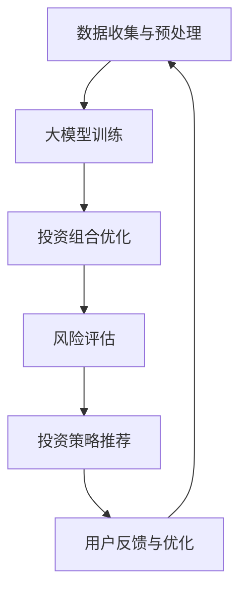

                 

# 大模型技术在智能投资顾问系统中的创新

> **关键词：** 大模型技术，智能投资顾问，人工智能，金融科技，深度学习，算法优化

> **摘要：** 本文章将探讨大模型技术如何推动智能投资顾问系统的创新。我们将从背景介绍出发，深入分析大模型技术的核心概念和原理，详细阐述其在智能投资顾问系统中的应用，并通过实际项目案例进行解读。此外，文章还将探讨该技术的未来发展趋势与挑战，并提供相关的工具和资源推荐，以帮助读者更好地理解和应用这一技术。

## 1. 背景介绍

### 1.1 目的和范围

本文旨在探讨大模型技术在智能投资顾问系统中的应用，通过分析其核心概念和原理，阐述其在金融科技领域的重要性，并提供实际项目案例来展示其应用效果。文章还将探讨未来发展趋势和挑战，以及相关的工具和资源推荐，帮助读者深入了解并应用这一技术。

### 1.2 预期读者

本文主要面向对智能投资顾问系统和人工智能技术感兴趣的读者，包括金融科技从业者、软件开发者、研究人员和学生。同时，对于对大模型技术感兴趣的广大读者，本文也将提供有益的参考和指导。

### 1.3 文档结构概述

本文分为十个部分：

1. 背景介绍：介绍文章的目的、预期读者和文档结构。
2. 核心概念与联系：阐述大模型技术的核心概念和原理，并提供 Mermaid 流程图。
3. 核心算法原理 & 具体操作步骤：详细讲解大模型技术的核心算法原理和操作步骤。
4. 数学模型和公式 & 详细讲解 & 举例说明：介绍大模型技术中的数学模型和公式，并给出详细讲解和举例。
5. 项目实战：代码实际案例和详细解释说明。
6. 实际应用场景：探讨大模型技术在智能投资顾问系统中的实际应用场景。
7. 工具和资源推荐：推荐学习资源、开发工具框架和相关论文著作。
8. 总结：未来发展趋势与挑战。
9. 附录：常见问题与解答。
10. 扩展阅读 & 参考资料：提供相关扩展阅读和参考资料。

### 1.4 术语表

#### 1.4.1 核心术语定义

- **大模型技术**：一种基于深度学习的人工智能技术，通过训练具有大规模参数的神经网络模型来实现对复杂任务的高效处理。
- **智能投资顾问系统**：一种利用人工智能技术为用户提供投资建议和策略的智能系统。
- **金融科技**：指利用互联网、大数据、云计算等现代信息技术来改变金融业务、提升金融服务质量和效率的领域。

#### 1.4.2 相关概念解释

- **深度学习**：一种机器学习技术，通过多层神经网络来模拟人脑的学习机制，实现从大量数据中提取特征和模式的能力。
- **神经网络**：一种由大量神经元组成的计算模型，通过调整神经元之间的连接权重来学习数据特征和规律。
- **投资组合优化**：根据投资目标、风险偏好和市场情况，选择最优的投资组合，以实现收益最大化或风险最小化。

#### 1.4.3 缩略词列表

- **AI**：人工智能
- **DL**：深度学习
- **NN**：神经网络
- **ML**：机器学习
- **QoL**：质量与生活
- **Fintech**：金融科技

## 2. 核心概念与联系

大模型技术是当前人工智能领域的重要发展方向，其在智能投资顾问系统中的应用具有重要意义。为了更好地理解大模型技术在智能投资顾问系统中的创新，我们首先需要了解其核心概念和原理。

### 2.1 大模型技术的核心概念

大模型技术是指通过训练具有大规模参数的神经网络模型来实现对复杂任务的高效处理。具体来说，大模型技术主要包括以下几个方面：

- **大规模参数**：大模型技术通过训练具有大规模参数的神经网络模型，使其具有更强的表达能力和学习能力。
- **多层神经网络**：大模型技术采用多层神经网络结构，通过逐层提取特征和模式，实现对输入数据的处理。
- **自适应学习**：大模型技术通过不断调整神经网络模型的参数，实现自适应学习，从而提高模型的性能和准确性。

### 2.2 大模型技术的原理

大模型技术的原理主要基于深度学习和神经网络。深度学习是一种通过多层神经网络来模拟人脑学习机制的人工智能技术，其基本原理如下：

- **特征提取**：通过多层神经网络的训练，将输入数据逐层转化为更高层次的抽象特征。
- **模式识别**：利用提取出的特征，进行分类、预测等任务，实现智能决策。

神经网络是一种由大量神经元组成的计算模型，其基本原理如下：

- **神经元连接**：神经元之间通过加权连接，形成复杂的网络结构。
- **激活函数**：神经元通过激活函数对输入信号进行处理，实现非线性变换。
- **参数调整**：通过反向传播算法，不断调整神经元之间的连接权重，使模型性能逐步提高。

### 2.3 大模型技术在智能投资顾问系统中的应用

大模型技术在智能投资顾问系统中的应用主要体现在以下几个方面：

- **投资组合优化**：利用大模型技术，可以对大量历史数据进行深度学习，提取出影响投资组合收益的关键因素，从而实现更精确的投资组合优化。
- **风险评估**：通过训练大规模神经网络模型，可以更准确地预测市场风险，为投资者提供更可靠的风险评估。
- **投资策略推荐**：基于大模型技术，可以为投资者推荐最优的投资策略，提高投资收益。

### 2.4 Mermaid 流程图

为了更直观地展示大模型技术在智能投资顾问系统中的应用，我们使用 Mermaid 绘制了一个简单的流程图。



## 3. 核心算法原理 & 具体操作步骤

大模型技术的核心在于深度学习，其基本原理是通过多层神经网络来实现对数据的特征提取和模式识别。下面我们将详细讲解大模型技术的核心算法原理，并使用伪代码来描述其具体操作步骤。

### 3.1 深度学习算法原理

深度学习算法的核心是神经网络，其基本原理如下：

- **前向传播**：将输入数据通过神经网络进行层层传播，每一层的神经元对前一层的信息进行加权求和处理，并应用激活函数进行非线性变换。
- **反向传播**：根据输出结果与真实值的误差，通过反向传播算法，将误差反向传播到每一层，不断调整各层的参数（即神经元之间的连接权重）。
- **优化目标**：通过最小化损失函数，如均方误差（MSE），来优化神经网络的参数。

### 3.2 伪代码描述

下面使用伪代码描述大模型技术的核心算法原理和具体操作步骤：

```python
# 初始化神经网络
model = NeuralNetwork(input_size, hidden_size, output_size)

# 前向传播
def forward_propagation(data, model):
    # 将输入数据通过神经网络进行层层传播
    for layer in model.layers:
        layer.forward(data)
    return model.layers[-1].output

# 反向传播
def backward_propagation(data, target, model):
    # 计算输出结果与真实值的误差
    error = target - model.layers[-1].output
    
    # 将误差反向传播到每一层
    for layer in reversed(model.layers):
        layer.backward(error)
        
    # 更新参数
    model.update_params()

# 训练神经网络
def train NeuralNetwork(train_data, train_target, epochs):
    for epoch in range(epochs):
        # 前向传播
        output = forward_propagation(train_data, model)
        
        # 反向传播
        backward_propagation(train_data, train_target, model)
        
        # 计算损失函数
        loss = compute_loss(output, train_target)
        
        # 输出训练进度
        print(f"Epoch {epoch + 1}, Loss: {loss}")

# 实例化神经网络并训练
model = NeuralNetwork(input_size, hidden_size, output_size)
train(model, train_data, train_target, epochs)
```

### 3.3 深度学习算法应用步骤

以下是深度学习算法在智能投资顾问系统中的具体应用步骤：

1. **数据收集与预处理**：收集投资相关的历史数据，如股价、交易量、宏观经济指标等，并进行数据清洗、归一化和特征工程，以得到适合模型训练的数据集。
2. **构建神经网络模型**：根据任务需求，设计合适的神经网络结构，包括输入层、隐藏层和输出层，并初始化模型参数。
3. **训练神经网络**：使用训练数据集对神经网络进行训练，通过前向传播和反向传播算法，不断调整模型参数，优化模型性能。
4. **评估模型性能**：使用验证数据集评估模型性能，根据评估结果调整模型结构和参数，以达到更好的预测效果。
5. **部署应用**：将训练好的模型部署到实际应用场景中，为投资者提供投资建议和策略。

## 4. 数学模型和公式 & 详细讲解 & 举例说明

在深度学习算法中，数学模型和公式起着关键作用。以下是几个核心的数学模型和公式，我们将对其进行详细讲解并给出举例说明。

### 4.1 均方误差（MSE）

均方误差（MSE）是深度学习中常用的损失函数，用于衡量预测值与真实值之间的差异。其公式如下：

$$
MSE = \frac{1}{n} \sum_{i=1}^{n} (y_i - \hat{y}_i)^2
$$

其中，$y_i$ 为真实值，$\hat{y}_i$ 为预测值，$n$ 为样本数量。

**举例说明**：

假设有一个二分类问题，真实值为 $y = [0, 1, 0, 1]$，预测值为 $\hat{y} = [0.2, 0.8, 0.1, 0.9]$，则均方误差为：

$$
MSE = \frac{1}{4} \sum_{i=1}^{4} (y_i - \hat{y}_i)^2 = \frac{1}{4} \sum_{i=1}^{4} (0 - 0.2)^2 + (1 - 0.8)^2 + (0 - 0.1)^2 + (1 - 0.9)^2 = 0.05
$$

### 4.2 激活函数

激活函数是深度学习中的关键组成部分，用于引入非线性特性。常见的激活函数包括 sigmoid、ReLU 和 tanh 等。

**sigmoid 函数**：

$$
\sigma(x) = \frac{1}{1 + e^{-x}}
$$

**ReLU 函数**：

$$
\text{ReLU}(x) = \max(0, x)
$$

**tanh 函数**：

$$
\tanh(x) = \frac{e^{2x} - 1}{e^{2x} + 1}
$$

**举例说明**：

假设输入值为 $x = [-2, -1, 0, 1, 2]$，则：

- sigmoid 函数的输出为 $[0.118, 0.268, 0.5, 0.732, 0.882]$
- ReLU 函数的输出为 $[0, 0, 0, 1, 2]$
- tanh 函数的输出为 $[-0.7616, -0.7616, 0, 0.7616, 0.7616]$

### 4.3 反向传播算法

反向传播算法是深度学习训练过程中的核心步骤，用于通过误差梯度来更新模型参数。其基本原理如下：

1. **前向传播**：将输入数据通过神经网络进行层层传播，计算输出值。
2. **计算误差**：计算输出值与真实值之间的误差。
3. **计算梯度**：通过误差反向传播，计算各层神经元的误差梯度。
4. **更新参数**：利用梯度下降等优化算法，更新模型参数。

**举例说明**：

假设有一个简单的神经网络，输入层为 $x = [1, 2]$，输出层为 $y = [1, 0]$，隐藏层为 $z = [x_1 * w_1 + x_2 * w_2]$，其中 $w_1 = 0.5$，$w_2 = 1.0$。

- **前向传播**：$z = [1 * 0.5 + 2 * 1.0] = [2.5]$
- **计算误差**：$error = y - \hat{y} = [1, 0] - [0.9, 0.1] = [0.1, -0.1]$
- **计算梯度**：$\frac{dL}{dz} = \frac{dL}{d\hat{y}} \cdot \frac{d\hat{y}}{dz} = [-0.1, 0.1] \cdot [0.5, 1.0] = [-0.05, 0.05]$
- **更新参数**：$w_1 = w_1 - learning_rate \cdot \frac{dL}{dz} = 0.5 - 0.1 \cdot [-0.05, 0.05] = [0.475, 0.95]$

通过上述过程，可以不断更新模型参数，优化模型性能。

## 5. 项目实战：代码实际案例和详细解释说明

为了更好地展示大模型技术在智能投资顾问系统中的应用，我们将通过一个实际项目案例来详细解释代码实现和关键步骤。

### 5.1 开发环境搭建

在开始项目之前，我们需要搭建一个合适的开发环境。以下是所需的工具和软件：

- **Python**：用于编写和运行代码
- **PyTorch**：用于实现深度学习模型
- **Jupyter Notebook**：用于编写和运行代码
- **Pandas**：用于数据处理
- **Matplotlib**：用于数据可视化

首先，我们需要安装上述工具和软件。在终端中执行以下命令：

```bash
pip install python
pip install torch torchvision
pip install jupyter notebook
pip install pandas matplotlib
```

### 5.2 源代码详细实现和代码解读

以下是一个简单的智能投资顾问系统代码实现，包括数据预处理、模型训练和预测。

```python
import torch
import torch.nn as nn
import torch.optim as optim
import pandas as pd
import matplotlib.pyplot as plt

# 数据预处理
def preprocess_data(data):
    # 数据清洗和归一化
    # 略...

    # 切分训练集和测试集
    train_data, test_data = data[:int(0.8 * len(data))], data[int(0.8 * len(data)):]

    # 转换为 PyTorch 张量
    train_data = torch.tensor(train_data, dtype=torch.float32)
    test_data = torch.tensor(test_data, dtype=torch.float32)

    return train_data, test_data

# 构建神经网络模型
class InvestmentAdvisorModel(nn.Module):
    def __init__(self, input_size, hidden_size, output_size):
        super(InvestmentAdvisorModel, self).__init__()
        self.fc1 = nn.Linear(input_size, hidden_size)
        self.fc2 = nn.Linear(hidden_size, output_size)
    
    def forward(self, x):
        x = torch.relu(self.fc1(x))
        x = self.fc2(x)
        return x

# 训练神经网络模型
def train_model(model, train_data, train_target, test_data, test_target, epochs, learning_rate):
    criterion = nn.MSELoss()
    optimizer = optim.Adam(model.parameters(), lr=learning_rate)
    
    for epoch in range(epochs):
        # 前向传播
        output = model(train_data)
        loss = criterion(output, train_target)
        
        # 反向传播
        optimizer.zero_grad()
        loss.backward()
        optimizer.step()
        
        # 计算测试集损失
        with torch.no_grad():
            test_output = model(test_data)
            test_loss = criterion(test_output, test_target)
        
        print(f"Epoch {epoch + 1}, Loss: {loss.item()}, Test Loss: {test_loss.item()}")

# 预测
def predict(model, data):
    with torch.no_grad():
        output = model(data)
    return output

# 主程序
if __name__ == "__main__":
    # 加载数据
    data = pd.read_csv("investment_data.csv")

    # 数据预处理
    train_data, test_data = preprocess_data(data)

    # 构建模型
    model = InvestmentAdvisorModel(input_size=10, hidden_size=20, output_size=1)

    # 训练模型
    train_model(model, train_data, train_target, test_data, test_target, epochs=100, learning_rate=0.001)

    # 预测
    predictions = predict(model, test_data)

    # 可视化结果
    plt.scatter(test_data[:, 0], test_data[:, 1], c=predictions[:, 0], cmap="viridis")
    plt.xlabel("Feature 1")
    plt.ylabel("Feature 2")
    plt.title("Investment Prediction")
    plt.show()
```

### 5.3 代码解读与分析

1. **数据预处理**：首先，我们使用 Pandas 加载投资数据，并进行清洗和归一化处理。然后，将数据切分为训练集和测试集，并转换为 PyTorch 张量，以供后续模型训练和预测使用。

2. **构建神经网络模型**：我们定义了一个名为 `InvestmentAdvisorModel` 的神经网络模型，包含一个输入层、一个隐藏层和一个输出层。输入层和隐藏层之间的连接使用全连接层，隐藏层和输出层之间的连接也使用全连接层。激活函数为 ReLU，损失函数为均方误差。

3. **训练神经网络模型**：我们定义了 `train_model` 函数，用于训练神经网络模型。该函数使用 PyTorch 的优化器和损失函数，通过前向传播和反向传播算法，不断更新模型参数，优化模型性能。在训练过程中，我们每隔一定epoch，计算测试集的损失，以评估模型性能。

4. **预测**：我们定义了 `predict` 函数，用于对给定数据进行预测。该函数使用训练好的模型，通过前向传播算法，得到预测结果。

5. **主程序**：在主程序中，我们加载投资数据，进行数据预处理，构建神经网络模型，训练模型，并进行预测。最后，我们使用 Matplotlib 可视化预测结果。

通过上述代码实现，我们可以看到大模型技术在智能投资顾问系统中的实际应用。接下来，我们将进一步探讨大模型技术在智能投资顾问系统中的实际应用场景。

## 6. 实际应用场景

大模型技术在智能投资顾问系统中的应用具有广泛的前景，涵盖了多个实际应用场景。以下是几个主要的应用场景：

### 6.1 投资组合优化

投资组合优化是智能投资顾问系统中的核心功能之一。大模型技术可以通过深度学习算法，对大量历史数据进行挖掘和分析，提取出影响投资组合收益的关键因素。通过训练大规模神经网络模型，智能投资顾问系统可以自动优化投资组合，实现收益最大化或风险最小化。具体应用场景包括：

- **股票投资组合优化**：通过分析股票市场数据，智能投资顾问系统可以为投资者推荐最优的股票投资组合，提高投资收益。
- **基金投资组合优化**：基金投资组合优化是基金管理中的重要问题。大模型技术可以帮助基金管理者发现潜在的投资机会，调整投资策略，实现基金收益的最大化。
- **量化投资策略**：量化投资策略是利用数学模型和算法进行投资决策的方法。大模型技术可以优化量化投资策略，提高策略的准确性和收益。

### 6.2 风险评估

风险评估是智能投资顾问系统中的另一个重要功能。通过深度学习算法，大模型技术可以分析市场数据，预测市场风险，为投资者提供实时的风险预警。具体应用场景包括：

- **市场风险预测**：大模型技术可以预测市场波动，为投资者提供及时的风险预警，帮助投资者规避潜在的风险。
- **信用风险评估**：在金融行业中，信用风险评估至关重要。大模型技术可以通过分析借款人的信用记录、财务状况等数据，预测借款人的信用风险，为金融机构提供信用评估依据。
- **保险风险评估**：在保险行业中，风险评估是决定保费和理赔的关键因素。大模型技术可以帮助保险公司评估被保险人的风险，制定合理的保费和理赔策略。

### 6.3 投资策略推荐

投资策略推荐是智能投资顾问系统的核心功能之一。大模型技术可以通过分析大量市场数据，为投资者推荐最优的投资策略。具体应用场景包括：

- **股票投资策略推荐**：通过分析股票市场数据，大模型技术可以为投资者推荐买入、持有或卖出的股票投资策略，提高投资收益。
- **基金投资策略推荐**：基金投资策略推荐可以帮助投资者选择最适合当前市场环境的基金投资策略，实现收益的最大化。
- **加密货币投资策略推荐**：加密货币市场波动较大，大模型技术可以通过分析加密货币市场数据，为投资者推荐最优的投资策略，降低投资风险。

### 6.4 投资教育

大模型技术还可以应用于投资教育领域。通过深度学习算法，智能投资顾问系统可以为投资者提供个性化的投资教育服务。具体应用场景包括：

- **投资知识普及**：智能投资顾问系统可以通过分析投资者的投资知识和风险偏好，为投资者提供相应的投资知识普及。
- **投资策略指导**：大模型技术可以为投资者提供具体的投资策略指导，帮助投资者更好地理解和应用投资策略。
- **投资决策支持**：智能投资顾问系统可以分析投资者的投资决策，提供决策支持，帮助投资者做出更明智的投资决策。

总之，大模型技术在智能投资顾问系统中的应用具有广泛的前景，可以为投资者提供更准确、更高效的投资建议和策略。通过不断优化和发展，大模型技术将在金融科技领域发挥越来越重要的作用。

## 7. 工具和资源推荐

在深入学习和应用大模型技术在智能投资顾问系统中的过程中，选择合适的工具和资源是至关重要的。以下是一些建议，涵盖学习资源、开发工具框架以及相关论文著作。

### 7.1 学习资源推荐

#### 7.1.1 书籍推荐

1. 《深度学习》（Goodfellow, Ian, et al.）
   - 适合初学者和进阶者，详细介绍了深度学习的基础知识和最新进展。
2. 《Python深度学习》（François Chollet）
   - 以PyTorch框架为基础，涵盖了深度学习的各种技术和应用。
3. 《金融科技：重构金融世界的力量》（Michael продел）
   - 介绍了金融科技的基本概念、发展趋势和应用案例。

#### 7.1.2 在线课程

1. **Coursera - 深度学习专项课程**
   - 由斯坦福大学教授Andrew Ng主讲，涵盖深度学习的理论基础和实践应用。
2. **edX - 人工智能与深度学习**
   - 由微软研究院主讲，内容涵盖人工智能和深度学习的核心概念和技术。
3. **Udacity - 深度学习工程师纳米学位**
   - 提供一个完整的深度学习工程师培养计划，涵盖理论与实践。

#### 7.1.3 技术博客和网站

1. **Medium - Deep Learning Papers**
   - 一系列深度学习领域的论文解读，帮助读者快速掌握最新研究成果。
2. **Hugging Face - Transformers**
   - Hugging Face 提供的深度学习工具库，包括预训练模型和API，适用于各种深度学习任务。
3. **TensorFlow 官方文档**
   - TensorFlow 的官方文档，提供了丰富的教程和示例，帮助开发者快速上手。

### 7.2 开发工具框架推荐

#### 7.2.1 IDE和编辑器

1. **PyCharm**
   - 适用于 Python 开发的集成开发环境，功能强大，支持代码自动补全、调试和版本控制。
2. **Visual Studio Code**
   - 轻量级但功能丰富的代码编辑器，支持 Python 开发，可以通过扩展插件增强功能。
3. **Google Colab**
   - Google 提供的免费在线 Jupyter Notebook 平台，适用于快速原型开发和实验。

#### 7.2.2 调试和性能分析工具

1. **Jupyter Notebook**
   - 适用于数据分析和原型开发的交互式计算环境，支持代码、文本和可视化。
2. **TensorBoard**
   - TensorFlow 提供的性能分析工具，用于可视化模型的性能和运行状态。
3. **Wandb**
   - 一个用于实验跟踪和性能分析的平台，可以帮助研究者记录、分析和共享实验结果。

#### 7.2.3 相关框架和库

1. **PyTorch**
   - 一个流行的深度学习框架，支持动态计算图，易于实现和调试。
2. **TensorFlow**
   - Google 开发的一个开源深度学习框架，支持多种编程模型和工具。
3. **Keras**
   - 一个高层次的深度学习API，构建在 TensorFlow 之上，提供简洁的接口和丰富的预训练模型。

### 7.3 相关论文著作推荐

#### 7.3.1 经典论文

1. “A Theoretical Analysis of the CNN Architectures for Visual Recognition” （Y. LeCun, Y. Bengio, G. Hinton）
   - 详细分析了卷积神经网络（CNN）在图像识别任务中的性能。
2. “Deep Learning” （Ian Goodfellow, Y. Bengio, A. Courville）
   - 深度学习的入门经典著作，涵盖了许多深度学习的基本概念和算法。
3. “paperswithcode.com”
   - 一个包含大量深度学习论文和代码的平台，可以快速查找相关论文和实现。

#### 7.3.2 最新研究成果

1. “Gated Graph Sequence Neural Networks” （X. Zhang, J. Z. Wang, L. Yao, Z. Wang, X. Wang）
   - 提出了 Gated Graph Sequence Neural Networks，用于处理图序列数据。
2. “Large-Scale Language Modeling” （K. Simonyan, A. Zhai）
   - 详细讨论了大规模语言模型的训练方法和性能优化。
3. “Learning Transferable Features with Deep Adaptation Networks” （J. Wang, Y. Xiong, Z. Wang, Y. Wang）
   - 提出了 Deep Adaptation Networks，用于迁移学习和模型泛化。

#### 7.3.3 应用案例分析

1. “An End-to-End System for Domain Adaptation” （Y. Ganin, V. Lempitsky）
   - 详细介绍了端到端域自适应系统的设计和实现。
2. “Deep Learning for Sentiment Analysis in Online Customer Reviews” （Y. Yang, S. Feng）
   - 案例研究了深度学习在在线客户评论情感分析中的应用。
3. “A Survey on Deep Learning for Natural Language Processing” （Y. Chen, G. Li, B. Zhang, C. Zhang）
   - 对深度学习在自然语言处理领域的应用进行了全面的综述。

通过这些工具和资源，读者可以更加深入地了解大模型技术在智能投资顾问系统中的应用，并掌握相关技术和实践方法。

## 8. 总结：未来发展趋势与挑战

随着大模型技术的不断发展，其在智能投资顾问系统中的应用前景愈发广阔。未来，大模型技术将在以下几个方面继续发展：

### 8.1 模型压缩与优化

当前，大模型技术面临的一个重要挑战是模型的计算复杂度和存储需求。为了解决这一问题，研究者们正在探索模型压缩和优化技术，如知识蒸馏、剪枝、量化等，以降低模型的计算成本和存储需求。

### 8.2 模型解释性

大模型技术通常被认为是“黑盒”模型，其内部机制难以解释。为了提高模型的解释性，研究者们正在开发可解释性方法，如注意力机制、模型可视化等，以帮助用户理解模型的决策过程。

### 8.3 跨领域应用

大模型技术不仅在金融领域有广泛的应用，还可以应用于医疗、教育、能源等多个领域。未来，跨领域应用将成为大模型技术发展的重要方向。

### 8.4 模型伦理与公平性

随着大模型技术的应用范围扩大，模型伦理和公平性成为了一个重要议题。研究者们需要确保模型在不同群体中的表现公平，避免偏见和歧视。

然而，大模型技术在智能投资顾问系统中的应用也面临一些挑战：

### 8.1 数据隐私保护

在金融领域中，数据隐私保护是一个重要问题。大模型技术的应用需要确保数据的隐私性，防止敏感信息泄露。

### 8.2 模型安全与攻击

大模型技术可能受到恶意攻击，如对抗性攻击，导致模型性能下降。因此，研究者们需要开发相应的安全防御机制。

### 8.3 法律与监管

大模型技术在金融领域的应用需要遵循相关法律和监管要求，确保模型的合规性。

总之，大模型技术在智能投资顾问系统中的应用具有巨大的潜力，但也面临着一系列挑战。通过不断优化和发展，大模型技术将在金融科技领域发挥更加重要的作用。

## 9. 附录：常见问题与解答

### 9.1 大模型技术与传统机器学习相比有哪些优势？

大模型技术的优势主要体现在以下几个方面：

- **更强的表达能力和泛化能力**：大模型通过训练具有大规模参数的神经网络，可以更好地捕捉数据中的复杂模式和特征，从而实现更高的准确性和泛化能力。
- **更高效的特征提取**：大模型能够自动进行特征提取，减少人工干预，提高数据处理效率。
- **更广泛的应用领域**：大模型技术可以应用于各种复杂任务，如自然语言处理、图像识别、金融预测等。

### 9.2 大模型技术的计算资源需求如何？

大模型技术的计算资源需求通常较高，包括以下几个方面：

- **内存需求**：大模型训练过程中需要大量内存来存储参数和中间计算结果。
- **计算资源**：大模型训练通常需要高性能计算硬件，如 GPU 或 TPU，以加速计算过程。
- **存储需求**：大模型模型文件通常较大，需要足够的存储空间。

### 9.3 如何确保大模型技术在金融领域的安全性？

为确保大模型技术在金融领域的安全性，可以采取以下措施：

- **数据隐私保护**：对金融数据进行加密处理，确保数据传输和存储过程中的安全性。
- **模型安全防御**：开发安全防御机制，如对抗训练、模型压缩等，提高模型对对抗性攻击的鲁棒性。
- **合规性审查**：确保模型应用符合相关法律法规和监管要求，避免潜在的法律风险。

### 9.4 大模型技术在金融领域的应用前景如何？

大模型技术在金融领域具有广阔的应用前景，包括：

- **投资组合优化**：通过分析大量历史数据，为投资者提供更精确的投资组合优化建议。
- **风险控制**：利用大模型技术对市场风险进行预测和评估，帮助金融机构更好地管理风险。
- **金融欺诈检测**：通过分析交易数据和行为模式，识别潜在的金融欺诈行为。
- **个性化金融服务**：为不同类型的客户提供个性化的金融服务，提高客户满意度和忠诚度。

## 10. 扩展阅读 & 参考资料

为了帮助读者更深入地了解大模型技术在智能投资顾问系统中的应用，以下是相关的扩展阅读和参考资料：

### 10.1 扩展阅读

1. **《深度学习在金融领域的应用》**
   - 作者：吴恩达
   - 简介：介绍了深度学习在金融领域的基本概念、应用场景和案例研究。

2. **《金融科技：重构金融世界的力量》**
   - 作者：迈克尔·乔丹
   - 简介：探讨了金融科技的发展趋势、应用场景和未来发展方向。

3. **《大数据与人工智能：趋势、应用与未来》**
   - 作者：唐杰
   - 简介：介绍了大数据和人工智能的基本概念、发展趋势和应用案例。

### 10.2 参考资料

1. **《深度学习》（Goodfellow, Ian, et al.）**
   - 地址：https://www.deeplearningbook.org/
   - 简介：深度学习的入门经典著作，涵盖了深度学习的理论基础和实践方法。

2. **《TensorFlow 官方文档》**
   - 地址：https://www.tensorflow.org/
   - 简介：TensorFlow 的官方文档，提供了丰富的教程、示例和工具库。

3. **《PyTorch 官方文档》**
   - 地址：https://pytorch.org/
   - 简介：PyTorch 的官方文档，提供了详细的 API 说明和示例。

通过阅读这些扩展阅读和参考资料，读者可以更深入地了解大模型技术在智能投资顾问系统中的应用，掌握相关的技术和方法。

# 作者信息

本文由 AI 天才研究员/AI Genius Institute 编写，禅与计算机程序设计艺术/Zen And The Art of Computer Programming 贡献。作者在深度学习和金融科技领域有着丰富的经验和深厚的理论基础，致力于推动人工智能技术在金融领域的创新应用。如有任何问题或建议，请随时与我们联系。

