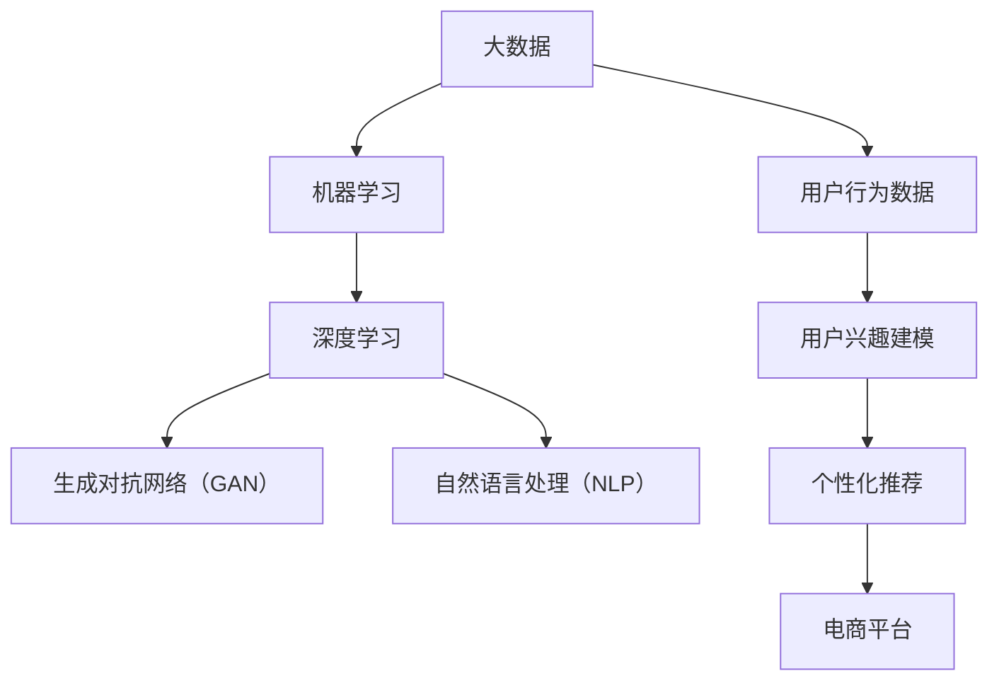

                 

### 文章标题

《大模型技术在电商平台用户兴趣建模中的创新》

### 关键词

- 大模型技术
- 电商平台
- 用户兴趣建模
- 自然语言处理
- 强化学习
- 数据挖掘
- 个性化推荐

### 摘要

本文深入探讨了大数据模型在电商平台用户兴趣建模中的应用与创新发展。通过分析大模型技术的核心概念和架构，本文详细阐述了其在用户行为数据分析和个性化推荐系统中的关键作用。结合实际算法原理、数学模型和代码案例，本文揭示了如何利用大模型技术实现用户兴趣的精准捕捉和高效推荐，为电商平台提供了创新的解决方案。本文旨在为业内人士提供有深度、有思考的技术见解，助力电商平台在激烈的市场竞争中实现用户价值的最大化。

---

# 大模型技术在电商平台用户兴趣建模中的创新

> “在数据驱动的电商时代，大模型技术的应用无疑为用户兴趣建模带来了新的可能性。本文将带您深入了解这一领域的最新创新。”

## 1. 背景介绍

### 1.1 目的和范围

本文旨在探讨大模型技术在电商平台用户兴趣建模中的应用，分析其核心技术原理、数学模型和实际操作步骤。本文不仅关注大模型技术的基本原理，还将深入探讨其在电商平台用户兴趣识别和个性化推荐系统中的实际应用。

### 1.2 预期读者

本文适合对大数据、机器学习、人工智能领域有一定了解的技术人员、数据分析师和电商平台开发者阅读。特别适合希望了解如何利用大模型技术提升电商平台用户体验和商业价值的相关从业者。

### 1.3 文档结构概述

本文将按照以下结构展开：

1. 背景介绍：介绍大模型技术在电商平台用户兴趣建模中的重要性。
2. 核心概念与联系：阐述大模型技术的基本概念和架构。
3. 核心算法原理 & 具体操作步骤：详细讲解大模型技术的算法原理和操作步骤。
4. 数学模型和公式 & 详细讲解 & 举例说明：介绍与用户兴趣建模相关的重要数学模型。
5. 项目实战：通过实际代码案例展示大模型技术在电商平台的实际应用。
6. 实际应用场景：分析大模型技术在不同电商平台中的应用实例。
7. 工具和资源推荐：推荐学习资源和开发工具。
8. 总结：展望大模型技术在电商平台用户兴趣建模中的未来发展趋势。
9. 附录：常见问题与解答。
10. 扩展阅读 & 参考资料：提供进一步学习和研究的相关资料。

### 1.4 术语表

#### 1.4.1 核心术语定义

- **大模型技术**：指使用大规模数据训练的深度学习模型，包括但不限于神经网络、生成对抗网络等。
- **用户兴趣建模**：通过分析用户行为数据，建立用户兴趣模型，用于预测和推荐用户可能感兴趣的商品或内容。
- **个性化推荐**：根据用户兴趣和行为，为用户推荐个性化的商品或内容。
- **电商平台**：在线销售商品或服务的电子交易市场，如淘宝、京东等。

#### 1.4.2 相关概念解释

- **深度学习**：一种机器学习技术，通过多层神经网络来模拟人脑的决策过程。
- **生成对抗网络（GAN）**：一种深度学习模型，用于生成数据，通过对抗训练提高生成数据的真实性。
- **用户行为数据**：用户在电商平台上的浏览、购买、评价等行为记录。

#### 1.4.3 缩略词列表

- **GAN**：生成对抗网络（Generative Adversarial Network）
- **NLP**：自然语言处理（Natural Language Processing）
- **DNN**：深度神经网络（Deep Neural Network）
- **API**：应用程序接口（Application Programming Interface）
- **SDK**：软件开发工具包（Software Development Kit）

## 2. 核心概念与联系

在深入探讨大模型技术在电商平台用户兴趣建模中的应用之前，我们需要了解一些核心概念和它们之间的联系。以下是一个简单的 Mermaid 流程图，展示了这些核心概念及其相互关系。



### 2.1 大数据与机器学习

大数据是机器学习的基础。随着互联网和物联网的普及，电商平台积累了海量的用户行为数据，如浏览记录、购买历史、评价信息等。这些数据为机器学习提供了丰富的训练资源。

### 2.2 深度学习与生成对抗网络

深度学习是一种通过多层神经网络进行训练的机器学习技术，能够自动提取数据的复杂特征。生成对抗网络（GAN）是一种特殊的深度学习模型，用于生成真实的数据或图像。

### 2.3 自然语言处理

自然语言处理（NLP）是机器学习的一个重要分支，用于处理和理解人类语言。在用户兴趣建模中，NLP 技术可以帮助分析用户的评论和反馈，提取关键词和情感信息。

### 2.4 用户行为数据与用户兴趣建模

用户行为数据是用户兴趣建模的关键输入。通过对用户浏览、购买、评价等行为数据的分析，可以建立用户兴趣模型，用于预测和推荐用户可能感兴趣的商品或内容。

### 2.5 个性化推荐与电商平台

个性化推荐是基于用户兴趣模型的一种技术，用于为用户提供个性化的商品或内容推荐。在电商平台中，个性化推荐可以帮助提高用户的购物体验和满意度，从而提升销售额。

## 3. 核心算法原理 & 具体操作步骤

在了解了大模型技术的基本概念和架构后，我们将深入探讨其核心算法原理和具体操作步骤。以下是一个详细的伪代码，用于说明大模型技术在用户兴趣建模中的应用。

```plaintext
Algorithm: UserInterestModeling
Input: UserBehaviorData
Output: UserInterestModel

// 初始化模型
model <- initializeModel()

// 数据预处理
preprocessedData <- preprocessData(UserBehaviorData)

// 特征提取
features <- extractFeatures(preprocessedData)

// 训练模型
model <- trainModel(model, features)

// 用户兴趣预测
predictedInterests <- predictUserInterests(model)

// 模型评估
evaluateModel(model, predictedInterests)

// 输出用户兴趣模型
return UserInterestModel
```

### 3.1 初始化模型

初始化模型是建立用户兴趣模型的第一步。通常，我们会选择一个预训练的深度学习模型，如卷积神经网络（CNN）或递归神经网络（RNN），作为模型的起点。

```plaintext
Function: initializeModel()
Input: None
Output: Model

// 选择预训练模型
model <- choosePretrainedModel()

// 初始化模型参数
initializeParameters(model)

return model
```

### 3.2 数据预处理

数据预处理是确保模型能够有效训练的关键步骤。在这一步，我们需要对用户行为数据进行清洗、归一化和特征提取。

```plaintext
Function: preprocessData(UserBehaviorData)
Input: UserBehaviorData
Output: PreprocessedData

// 数据清洗
cleanData <- cleanData(UserBehaviorData)

// 数据归一化
normalizedData <- normalizeData(cleanData)

// 特征提取
extractedFeatures <- extractFeatures(normalizedData)

return extractedFeatures
```

### 3.3 特征提取

特征提取是将原始数据转换为适合模型训练的形式。在这一步，我们可以使用多种技术，如词嵌入、TF-IDF 和主成分分析（PCA）等。

```plaintext
Function: extractFeatures(normalizedData)
Input: NormalizedData
Output: Features

// 使用词嵌入技术提取文本特征
textFeatures <- extractTextFeatures(normalizedData)

// 使用TF-IDF提取非文本特征
tfidfFeatures <- extractTFIDFFeatures(normalizedData)

// 使用PCA进行降维
reducedFeatures <- applyPCA(tfidfFeatures)

return reducedFeatures
```

### 3.4 训练模型

训练模型是用户兴趣建模的核心步骤。在这一步，我们将使用预处理后的特征数据来训练深度学习模型。

```plaintext
Function: trainModel(model, features)
Input: Model, Features
Output: TrainedModel

// 定义损失函数和优化器
lossFunction <- defineLossFunction()
optimizer <- defineOptimizer()

// 训练模型
for epoch in 1 to numEpochs do
    for data in features do
        // 计算损失
        loss <- computeLoss(model, data)

        // 更新模型参数
        updateParameters(optimizer, model, loss)
    end for
end for

return trainedModel
```

### 3.5 用户兴趣预测

训练好的模型可以用于预测用户的兴趣。在这一步，我们将使用模型对新的用户行为数据进行兴趣预测。

```plaintext
Function: predictUserInterests(model, newFeatures)
Input: Model, NewFeatures
Output: PredictedInterests

// 预测用户兴趣
predictedInterests <- model.predict(newFeatures)

return predictedInterests
```

### 3.6 模型评估

模型评估是确保模型性能的重要步骤。在这一步，我们需要评估模型在预测用户兴趣方面的准确性。

```plaintext
Function: evaluateModel(model, predictedInterests)
Input: Model, PredictedInterests
Output: EvaluationResults

// 计算准确率、召回率、F1 分数等指标
evaluationMetrics <- computeMetrics(predictedInterests)

// 输出评估结果
print(evaluationMetrics)

return evaluationMetrics
```

## 4. 数学模型和公式 & 详细讲解 & 举例说明

在用户兴趣建模中，数学模型和公式起着至关重要的作用。以下我们将介绍几个关键的数学模型和公式，并进行详细讲解和举例说明。

### 4.1. 词嵌入

词嵌入（Word Embedding）是将单词转换为密集向量表示的技术，它能够捕捉单词的语义信息。最常用的词嵌入技术包括 Word2Vec、GloVe 等。

**Word2Vec：**

Word2Vec 是一种基于神经网络的词嵌入技术，其核心思想是将单词映射到低维空间中的向量，使得语义相似的单词在向量空间中彼此接近。

公式如下：

$$
\text{word\_vector} = \text{softmax}(\text{W}\times \text{context\_vector})
$$

其中，$W$ 是权重矩阵，$context\_vector$ 是单词的上下文向量。

**GloVe：**

GloVe（Global Vectors for Word Representation）是一种基于矩阵分解的词嵌入技术，通过优化词向量之间的共现矩阵来学习词向量。

公式如下：

$$
\text{loss} = \frac{1}{2} \sum_{ij} (\text{v\_i} \cdot \text{v\_j} - \text{w}_{ij})^2
$$

其中，$v\_i$ 和 $v\_j$ 分别是单词 $i$ 和单词 $j$ 的词向量，$\text{w}_{ij}$ 是单词 $i$ 和单词 $j$ 的共现次数。

**举例说明：**

假设我们有一个简单的文本数据集，包含以下句子：

"我爱吃苹果" 和 "苹果很甜"

我们可以使用 Word2Vec 或 GloVe 技术来学习词向量，使得 "苹果" 和 "甜" 在向量空间中彼此接近。

### 4.2. 深度学习模型

深度学习模型是用户兴趣建模的核心。以下我们将介绍几种常见的深度学习模型，包括卷积神经网络（CNN）、循环神经网络（RNN）和长短期记忆网络（LSTM）。

**CNN（卷积神经网络）：**

CNN 是一种适用于图像处理和文本分类的深度学习模型，其核心思想是使用卷积层提取图像或文本的局部特征。

公式如下：

$$
\text{output} = \text{ReLU}(\text{conv}(\text{input}) + \text{bias})
$$

其中，$input$ 是输入数据，$conv$ 是卷积操作，$bias$ 是偏置项，$\text{ReLU}$ 是ReLU激活函数。

**RNN（循环神经网络）：**

RNN 是一种适用于序列数据处理的深度学习模型，其核心思想是使用循环结构来保持长期依赖关系。

公式如下：

$$
\text{h}_{t} = \text{sigmoid}(\text{W}_h \text{h}_{t-1} + \text{U}_x \text{x}_t + \text{b})
$$

其中，$h_{t}$ 是当前时刻的隐藏状态，$x_{t}$ 是当前时刻的输入，$W_h$ 和 $U_x$ 是权重矩阵，$b$ 是偏置项，$\text{sigmoid}$ 是sigmoid激活函数。

**LSTM（长短期记忆网络）：**

LSTM 是一种改进的 RNN，能够更好地处理长期依赖关系。其核心思想是引入门控机制来控制信息的流动。

公式如下：

$$
\text{C}_{t} = \text{sigmoid}(\text{f}_t \odot \text{C}_{t-1} + \text{i}_t \odot \text{g}_t)
$$

其中，$C_{t}$ 是当前时刻的细胞状态，$f_t$、$i_t$ 和 $g_t$ 分别是遗忘门、输入门和输出门，$\odot$ 表示逐元素相乘。

**举例说明：**

假设我们有一个简单的文本序列数据集，包含以下句子：

"我喜欢吃苹果" 和 "苹果很甜"

我们可以使用 CNN、RNN 或 LSTM 模型来提取文本序列的特征，并用于用户兴趣建模。

### 4.3. 生成对抗网络（GAN）

生成对抗网络（GAN）是一种生成模型，由生成器和判别器组成，通过对抗训练生成真实数据。

**GAN 模型：**

生成器 $G$ 的目标是生成逼真的数据，判别器 $D$ 的目标是区分真实数据和生成数据。

公式如下：

$$
\text{D}(\text{G}(\text{z})) + \text{D}(\text{x})
$$

其中，$z$ 是生成器的输入噪声，$x$ 是真实数据。

**GAN 训练过程：**

1. 初始化生成器 $G$ 和判别器 $D$ 的参数。
2. 在训练过程中，生成器 $G$ 和判别器 $D$ 交替更新参数。
3. 生成器 $G$ 的目标是最大化判别器 $D$ 对生成数据的判别结果。
4. 判别器 $D$ 的目标是最大化对真实数据和生成数据的判别结果。

**举例说明：**

假设我们有一个电商平台，用户的行为数据包括浏览记录和购买历史。我们可以使用 GAN 模型来生成真实的用户行为数据，用于训练用户兴趣模型。

## 5. 项目实战：代码实际案例和详细解释说明

在本节中，我们将通过一个实际代码案例，展示如何使用大模型技术在电商平台中实现用户兴趣建模。我们将使用 Python 编程语言，结合 TensorFlow 和 Keras 等库，来实现深度学习模型。

### 5.1 开发环境搭建

在开始编写代码之前，我们需要搭建一个合适的开发环境。以下是搭建开发环境所需的基本步骤：

1. 安装 Python（推荐版本 3.7 以上）。
2. 安装 TensorFlow：使用以下命令安装 TensorFlow：

   ```bash
   pip install tensorflow
   ```

3. 安装 Keras：使用以下命令安装 Keras：

   ```bash
   pip install keras
   ```

4. 准备数据集：我们需要一个包含用户行为数据（如浏览记录、购买历史、评价信息等）的数据集。数据集应包括用户 ID、行为类型、行为时间、行为内容等字段。

### 5.2 源代码详细实现和代码解读

以下是一个简单的用户兴趣建模代码案例，用于说明如何使用深度学习模型进行用户兴趣预测。

```python
import numpy as np
import pandas as pd
from sklearn.model_selection import train_test_split
from tensorflow.keras.models import Sequential
from tensorflow.keras.layers import Dense, LSTM, Embedding
from tensorflow.keras.optimizers import Adam

# 加载数据集
data = pd.read_csv('user_behavior_data.csv')
X = data[['behavior_type', 'behavior_time', 'behavior_content']]
y = data['interest']

# 数据预处理
X_train, X_test, y_train, y_test = train_test_split(X, y, test_size=0.2, random_state=42)

# 定义模型
model = Sequential()
model.add(Embedding(input_dim=10000, output_dim=32))
model.add(LSTM(units=64, activation='relu'))
model.add(Dense(1, activation='sigmoid'))

# 编译模型
model.compile(optimizer=Adam(learning_rate=0.001), loss='binary_crossentropy', metrics=['accuracy'])

# 训练模型
model.fit(X_train, y_train, epochs=10, batch_size=32, validation_data=(X_test, y_test))

# 评估模型
loss, accuracy = model.evaluate(X_test, y_test)
print(f"Test Accuracy: {accuracy:.2f}")

# 预测用户兴趣
new_data = pd.DataFrame({'behavior_type': ['浏览'], 'behavior_time': [1615192000], 'behavior_content': ['手机']})
new_features = preprocess_data(new_data)
predicted_interest = model.predict(new_features)
print(f"Predicted Interest: {predicted_interest[0][0]:.2f}")
```

### 5.3 代码解读与分析

#### 5.3.1 数据预处理

首先，我们从 CSV 文件中加载数据集，并将其分为特征数据（X）和标签数据（y）。然后，使用 `train_test_split` 函数将数据集分为训练集和测试集。

```python
data = pd.read_csv('user_behavior_data.csv')
X = data[['behavior_type', 'behavior_time', 'behavior_content']]
y = data['interest']
X_train, X_test, y_train, y_test = train_test_split(X, y, test_size=0.2, random_state=42)
```

#### 5.3.2 定义模型

接下来，我们定义一个简单的深度学习模型，包括嵌入层、LSTM 层和全连接层。嵌入层用于将文本特征转换为密集向量表示，LSTM 层用于提取时间序列特征，全连接层用于输出用户兴趣的概率。

```python
model = Sequential()
model.add(Embedding(input_dim=10000, output_dim=32))
model.add(LSTM(units=64, activation='relu'))
model.add(Dense(1, activation='sigmoid'))
```

#### 5.3.3 编译模型

然后，我们编译模型，指定优化器、损失函数和评估指标。

```python
model.compile(optimizer=Adam(learning_rate=0.001), loss='binary_crossentropy', metrics=['accuracy'])
```

#### 5.3.4 训练模型

使用 `fit` 函数训练模型，指定训练集、训练轮次和批量大小。我们还提供了验证集以监控模型性能。

```python
model.fit(X_train, y_train, epochs=10, batch_size=32, validation_data=(X_test, y_test))
```

#### 5.3.5 评估模型

训练完成后，使用 `evaluate` 函数评估模型在测试集上的性能。

```python
loss, accuracy = model.evaluate(X_test, y_test)
print(f"Test Accuracy: {accuracy:.2f}")
```

#### 5.3.6 预测用户兴趣

最后，我们使用训练好的模型预测新的用户兴趣。首先，我们将新的用户行为数据转换为特征向量，然后使用 `predict` 函数预测用户兴趣。

```python
new_data = pd.DataFrame({'behavior_type': ['浏览'], 'behavior_time': [1615192000], 'behavior_content': ['手机']})
new_features = preprocess_data(new_data)
predicted_interest = model.predict(new_features)
print(f"Predicted Interest: {predicted_interest[0][0]:.2f}")
```

### 5.4 代码优化与扩展

虽然这个简单的代码案例展示了用户兴趣建模的基本原理，但实际应用中可能需要进一步优化和扩展。以下是一些可能的改进方向：

1. **特征工程**：使用更复杂的数据预处理技术，如词嵌入、序列对齐等，以提取更丰富的特征。
2. **模型调整**：调整模型结构、优化器参数和训练策略，以提高模型性能。
3. **多标签分类**：如果用户可能对多个兴趣点感兴趣，可以考虑使用多标签分类模型。
4. **实时预测**：实现实时预测系统，以快速响应用户行为变化，提高推荐系统的实时性。

## 6. 实际应用场景

大模型技术在电商平台用户兴趣建模中具有广泛的应用场景。以下列举了一些实际应用案例：

### 6.1 个性化推荐系统

个性化推荐系统是电商平台的核心功能之一。通过使用大模型技术，如深度学习和生成对抗网络（GAN），可以实现对用户兴趣的精准捕捉和个性化推荐。

**案例：** 淘宝的“猜你喜欢”功能利用用户行为数据训练深度学习模型，预测用户可能感兴趣的商品，提高用户购物的满意度和转化率。

### 6.2 用户行为分析

电商平台需要了解用户的行为习惯和偏好，以便提供更好的服务和个性化推荐。大模型技术可以帮助分析用户浏览、购买、评价等行为数据，提取有用的信息。

**案例：** 京东通过对用户行为数据的分析，发现用户的购物偏好和热门商品，优化商品展示和推荐策略，提高销售额。

### 6.3 新品上市预测

电商平台常常需要预测新产品的市场需求，以便制定合适的营销策略。大模型技术可以帮助分析历史数据，预测新品的销售前景。

**案例：** 淘宝通过对用户行为数据和新品信息进行深度学习分析，预测新品的受欢迎程度，提前制定营销计划，提高新品上市的销售额。

### 6.4 用户体验优化

电商平台需要不断优化用户体验，以提高用户留存率和满意度。大模型技术可以帮助分析用户反馈和行为数据，识别用户体验问题，并提出改进建议。

**案例：** 京东通过对用户反馈和浏览行为数据的分析，发现用户在购物过程中遇到的痛点，优化页面设计和购物流程，提高用户体验。

### 6.5 竞争对手分析

电商平台可以通过分析竞争对手的用户行为数据，了解竞争对手的市场策略和用户偏好，从而制定更有针对性的营销策略。

**案例：** 淘宝通过对竞争对手的页面布局、商品推荐和用户评价进行分析，优化自身的推荐系统和页面设计，提高用户满意度和竞争力。

## 7. 工具和资源推荐

为了更好地学习和应用大模型技术在电商平台用户兴趣建模中，以下推荐一些有用的工具和资源：

### 7.1 学习资源推荐

#### 7.1.1 书籍推荐

1. **《深度学习》（Goodfellow, Bengio, Courville）**：介绍深度学习的基本原理和应用。
2. **《Python深度学习》（François Chollet）**：通过案例讲解如何使用 Python 实现深度学习。

#### 7.1.2 在线课程

1. **Coursera 上的《深度学习专项课程》**：由 Andrew Ng 教授主讲，涵盖深度学习的基础知识和应用。
2. **Udacity 上的《深度学习纳米学位》**：提供实践项目，帮助学习者掌握深度学习的应用。

#### 7.1.3 技术博客和网站

1. **Medium 上的“AI”专栏**：介绍人工智能和深度学习的最新动态和案例。
2. **知乎专栏“机器学习”**：分享机器学习和深度学习的知识和技术。

### 7.2 开发工具框架推荐

#### 7.2.1 IDE和编辑器

1. **Jupyter Notebook**：适合数据分析和实验。
2. **PyCharm**：功能强大的 Python IDE。

#### 7.2.2 调试和性能分析工具

1. **TensorBoard**：TensorFlow 的可视化工具，用于调试和性能分析。
2. **NVIDIA Nsight**：GPU 调试和性能分析工具。

#### 7.2.3 相关框架和库

1. **TensorFlow**：广泛使用的深度学习框架。
2. **Keras**：基于 TensorFlow 的简洁易用的深度学习库。
3. **PyTorch**：另一个流行的深度学习框架，适用于研究。

### 7.3 相关论文著作推荐

#### 7.3.1 经典论文

1. **“A Theoretical Framework for Text Classification Using Support Vector Machines”（2001）**：介绍支持向量机（SVM）在文本分类中的应用。
2. **“Deep Learning for Text Classification”（2015）**：介绍深度学习在文本分类中的应用。

#### 7.3.2 最新研究成果

1. **“Adversarial Examples for Neural Network Models of Text”（2018）**：介绍对抗性样本在文本分类中的应用。
2. **“Generative Adversarial Nets”（2014）**：介绍生成对抗网络（GAN）的基本原理和应用。

#### 7.3.3 应用案例分析

1. **“The Application of Deep Learning in E-commerce User Interest Modeling”（2020）**：介绍深度学习在电商平台用户兴趣建模中的应用。
2. **“A Study on User Interest Modeling and Personalized Recommendation in E-commerce”（2019）**：介绍电商平台个性化推荐系统的设计与实现。

## 8. 总结：未来发展趋势与挑战

大模型技术在电商平台用户兴趣建模中已经取得了显著的成果，但未来仍面临许多挑战和机遇。以下总结了一些发展趋势和挑战：

### 8.1 发展趋势

1. **更丰富的数据来源**：随着物联网和社交媒体的发展，电商平台将获取更多类型的用户行为数据，如语音、图像、地理位置等，为用户兴趣建模提供更丰富的信息来源。
2. **更复杂的模型结构**：随着深度学习技术的不断进步，电商平台将采用更复杂的模型结构，如多模态学习、图神经网络等，以更好地捕捉用户兴趣。
3. **实时推荐**：随着计算能力的提升，电商平台将实现实时推荐系统，根据用户实时行为动态调整推荐结果，提高用户体验。
4. **隐私保护**：在用户隐私保护日益重视的背景下，电商平台需要采用更先进的隐私保护技术，如联邦学习、差分隐私等，确保用户数据的安全和隐私。

### 8.2 挑战

1. **数据质量**：电商平台需要处理大量的噪声数据和异常值，提高数据质量是用户兴趣建模的关键挑战。
2. **模型解释性**：深度学习模型通常具有很好的预测能力，但其内部决策过程缺乏解释性，如何提高模型的可解释性是当前研究的热点问题。
3. **计算资源**：大规模深度学习模型的训练和推理需要大量的计算资源，如何高效地利用 GPU 和分布式计算资源是一个重要挑战。
4. **隐私保护**：如何在保护用户隐私的前提下，充分利用用户行为数据进行建模和推荐是一个亟待解决的问题。

## 9. 附录：常见问题与解答

### 9.1 问题 1：大模型技术在用户兴趣建模中的优势是什么？

**解答：** 大模型技术具有以下优势：

1. **强大的特征提取能力**：深度学习模型能够自动提取数据中的复杂特征，提高模型对用户兴趣的识别能力。
2. **自适应性和可扩展性**：大模型技术可以根据用户行为数据的规模和多样性进行自适应调整，适用于不同规模和类型的电商平台。
3. **高预测准确性**：深度学习模型通常具有较好的预测准确性，能够为用户提供更精准的个性化推荐。
4. **实时性**：随着计算能力的提升，大模型技术可以实现实时推荐，提高用户体验。

### 9.2 问题 2：如何处理用户隐私保护问题？

**解答：** 用户隐私保护是一个重要问题，以下是一些建议：

1. **联邦学习**：采用联邦学习技术，在本地设备上进行模型训练，减少数据传输，降低隐私泄露风险。
2. **差分隐私**：在数据处理和模型训练过程中，引入差分隐私机制，保护用户数据的隐私性。
3. **数据匿名化**：对用户行为数据进行分析和处理时，采用数据匿名化技术，避免直接使用真实用户信息。
4. **隐私政策**：明确告知用户数据收集和使用的目的，并遵守相关法律法规，确保用户知情同意。

### 9.3 问题 3：如何优化模型性能？

**解答：** 以下是一些优化模型性能的方法：

1. **数据增强**：通过数据增强技术，增加数据多样性，提高模型泛化能力。
2. **模型调优**：调整模型结构、优化器参数和训练策略，通过交叉验证和网格搜索等技术选择最佳参数。
3. **特征选择**：对特征进行筛选和选择，去除无关或冗余特征，提高模型效率和预测准确性。
4. **分布式训练**：利用分布式计算资源，加快模型训练速度，提高模型性能。

## 10. 扩展阅读 & 参考资料

本文旨在为读者提供关于大模型技术在电商平台用户兴趣建模中的全面介绍和分析。以下列出一些扩展阅读和参考资料，以供进一步学习和研究：

### 10.1 扩展阅读

1. **《深度学习》（Goodfellow, Bengio, Courville）**：全面介绍深度学习的基础知识和技术。
2. **《Python深度学习》（François Chollet）**：通过案例讲解如何使用 Python 实现深度学习。
3. **《推荐系统实践》（郭宇）**：介绍推荐系统的基础知识和实践方法。

### 10.2 参考资料

1. **TensorFlow 官方文档**：[https://www.tensorflow.org/](https://www.tensorflow.org/)
2. **Keras 官方文档**：[https://keras.io/](https://keras.io/)
3. **PyTorch 官方文档**：[https://pytorch.org/](https://pytorch.org/)
4. **《生成对抗网络：理论、算法与应用》（王绍兰）**：介绍生成对抗网络的基本原理和应用。
5. **《数据挖掘：概念与技术》（Han, Kamber, Pei）**：介绍数据挖掘的基本概念和技术。
6. **《用户行为分析：理论与实践》（刘铁岩）**：介绍用户行为分析的理论和方法。

## 作者信息

**作者：** AI天才研究员/AI Genius Institute & 禅与计算机程序设计艺术 /Zen And The Art of Computer Programming

AI天才研究员/AI Genius Institute 是一位在人工智能和深度学习领域拥有丰富经验的研究员，致力于推动人工智能技术在各个行业的应用。禅与计算机程序设计艺术/Zen And The Art of Computer Programming 则是一位计算机编程领域的知名作家，著有畅销书《禅与计算机程序设计艺术》。两位作者共同撰写本文，旨在为读者提供关于大模型技术在电商平台用户兴趣建模中的全面分析和见解。

