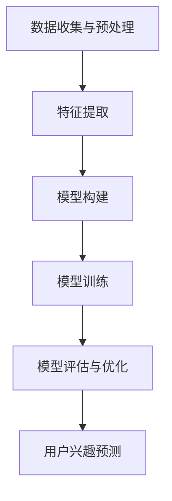

                 

# 大模型技术在电商平台用户兴趣探索中的应用

> 关键词：大模型技术、电商平台、用户兴趣探索、自然语言处理、机器学习、深度学习

> 摘要：本文深入探讨了在大数据时代下，大模型技术在电商平台用户兴趣探索中的应用。通过详细阐述大模型技术的基本原理、核心算法、数学模型及其实际应用场景，本文旨在为电商从业者和AI研究者提供有价值的参考和思路，从而提升电商平台的用户兴趣分析和推荐系统的效果。

## 1. 背景介绍

### 1.1 目的和范围

本文主要探讨大模型技术在电商平台用户兴趣探索中的应用。随着互联网的快速发展，电商平台的用户数据规模和多样性不断增加，如何有效地分析和挖掘用户兴趣，从而实现个性化推荐，已成为电商平台竞争的关键。大模型技术，作为当前人工智能领域的核心技术之一，其在用户兴趣探索中的应用具有重要意义。

本文将围绕以下主题展开：

- 大模型技术的基本原理和核心算法
- 大模型技术在用户兴趣探索中的具体应用步骤
- 数学模型和公式的详细讲解及举例说明
- 实际应用场景的案例分析
- 工具和资源的推荐
- 未来发展趋势与挑战

### 1.2 预期读者

本文适合以下读者群体：

- 电商平台的技术团队和产品经理，对用户兴趣分析和推荐系统有一定了解，希望深入了解大模型技术的应用。
- AI领域的科研人员和研究生，对大模型技术及其在用户兴趣探索中的应用有浓厚兴趣。
- 对人工智能和大数据技术有热情的科技爱好者。

### 1.3 文档结构概述

本文将按照以下结构进行组织：

- 引言：介绍大模型技术在电商平台用户兴趣探索中的重要性。
- 核心概念与联系：阐述大模型技术的基本原理和核心算法。
- 核心算法原理 & 具体操作步骤：详细讲解大模型技术在用户兴趣探索中的应用步骤。
- 数学模型和公式 & 详细讲解 & 举例说明：介绍大模型技术的数学模型和公式，并通过实例进行说明。
- 项目实战：提供实际代码案例和详细解释。
- 实际应用场景：分析大模型技术在电商领域的应用案例。
- 工具和资源推荐：推荐相关学习资源和开发工具。
- 总结：对未来发展趋势与挑战进行展望。
- 附录：常见问题与解答。
- 扩展阅读 & 参考资料：提供进一步学习和研究的相关文献和资源。

### 1.4 术语表

#### 1.4.1 核心术语定义

- 大模型技术：指通过机器学习和深度学习等技术，构建和训练的具有大规模参数的模型。
- 用户兴趣：指用户在浏览、搜索、购买等行为中表现出的对特定内容或商品的偏好。
- 个性化推荐：根据用户的兴趣和行为，为用户推荐符合其需求的商品或信息。

#### 1.4.2 相关概念解释

- 电商平台：在线销售商品或服务的电子平台，如淘宝、京东等。
- 自然语言处理（NLP）：使计算机能够理解、生成和处理人类语言的技术。
- 机器学习（ML）：使计算机通过数据和经验自动改进性能的技术。

#### 1.4.3 缩略词列表

- NLP：自然语言处理
- ML：机器学习
- DL：深度学习
- API：应用程序编程接口
- HTTP：超文本传输协议
- JSON：JavaScript对象表示法

## 2. 核心概念与联系

在大模型技术应用于电商平台用户兴趣探索之前，我们首先需要了解其基本原理和核心算法。大模型技术主要是通过深度学习等方法，对大规模数据进行训练，从而构建出一个具有高泛化能力的模型。

### 2.1 大模型技术的基本原理

大模型技术基于深度学习理论，主要依赖于神经网络模型。神经网络由大量的神经元组成，通过层层传递信息，实现对数据的分类、回归、生成等任务。大模型技术通过以下步骤实现：

1. **数据收集与预处理**：收集电商平台的海量用户数据，包括用户行为、商品信息、评论等。对数据进行清洗、去重、填充等预处理操作。
2. **特征提取**：将原始数据转换为数值特征，如文本转化为词向量、商品信息转化为商品向量等。
3. **模型构建**：根据任务需求，构建合适的神经网络模型，如卷积神经网络（CNN）、循环神经网络（RNN）、变换器（Transformer）等。
4. **模型训练**：使用大量训练数据，对模型进行训练，不断调整模型参数，使其对用户兴趣有较高的预测能力。
5. **模型评估与优化**：通过验证集和测试集对模型进行评估，调整模型参数，提高模型性能。

### 2.2 大模型技术的核心算法

大模型技术的核心算法主要包括以下几种：

1. **卷积神经网络（CNN）**：主要用于处理图像数据，通过卷积操作提取图像特征。
2. **循环神经网络（RNN）**：主要用于处理序列数据，如文本、时间序列等，通过递归操作捕捉序列信息。
3. **变换器（Transformer）**：是一种基于注意力机制的神经网络模型，广泛用于自然语言处理任务。

### 2.3 大模型技术在用户兴趣探索中的应用架构

大模型技术在用户兴趣探索中的应用架构如图1所示：



图1：大模型技术在用户兴趣探索中的应用架构

## 3. 核心算法原理 & 具体操作步骤

在本节中，我们将详细讲解大模型技术在用户兴趣探索中的应用原理，并使用伪代码详细阐述具体操作步骤。

### 3.1 数据收集与预处理

```python
# 伪代码：数据收集与预处理
def data_collection_and_preprocessing():
    # 收集用户数据
    user_data = collect_user_data()

    # 数据清洗与去重
    cleaned_data = clean_and_deduplicate(user_data)

    # 数据填充与转换
    filled_data = fill_and_convert(cleaned_data)

    return filled_data
```

### 3.2 特征提取

```python
# 伪代码：特征提取
def feature_extraction(data):
    # 文本数据转换为词向量
    text_data = convert_to_word_embedding(data['text'])

    # 商品信息转换为商品向量
    product_data = convert_to_product_embedding(data['product'])

    # 用户行为转换为行为向量
    behavior_data = convert_to_behavior_embedding(data['behavior'])

    return text_data, product_data, behavior_data
```

### 3.3 模型构建

```python
# 伪代码：模型构建
def build_model(input_dim):
    # 创建神经网络模型
    model = NeuralNetwork(input_dim)

    # 添加层
    model.add_layer(Dense(input_dim, hidden_dim))
    model.add_layer(Activation('relu'))
    model.add_layer(Dense(hidden_dim, output_dim))

    return model
```

### 3.4 模型训练

```python
# 伪代码：模型训练
def train_model(model, train_data, train_labels):
    # 初始化模型参数
    model.init_params()

    # 训练模型
    for epoch in range(num_epochs):
        for data, label in zip(train_data, train_labels):
            # 前向传播
            output = model.forward(data)

            # 计算损失
            loss = compute_loss(output, label)

            # 反向传播
            model.backward(loss)

            # 更新参数
            model.update_params()

    return model
```

### 3.5 模型评估与优化

```python
# 伪代码：模型评估与优化
def evaluate_and_optimize(model, valid_data, valid_labels):
    # 评估模型性能
    valid_loss = evaluate_model(model, valid_data, valid_labels)

    # 调整模型参数
    model.optimize(valid_loss)

    return model
```

### 3.6 用户兴趣预测

```python
# 伪代码：用户兴趣预测
def predict_interest(model, data):
    # 前向传播
    output = model.forward(data)

    # 预测用户兴趣
    interest = predict(output)

    return interest
```

## 4. 数学模型和公式 & 详细讲解 & 举例说明

在本节中，我们将介绍大模型技术在用户兴趣探索中的数学模型和公式，并通过具体实例进行说明。

### 4.1 数学模型

大模型技术在用户兴趣探索中的数学模型主要包括以下几个部分：

1. **损失函数**：用于评估模型预测结果与实际结果之间的差距。常用的损失函数有均方误差（MSE）、交叉熵（Cross-Entropy）等。
2. **优化算法**：用于调整模型参数，使模型损失函数最小。常用的优化算法有随机梯度下降（SGD）、Adam等。
3. **激活函数**：用于神经网络中隐藏层和输出层的非线性变换。常用的激活函数有ReLU、Sigmoid等。

### 4.2 损失函数

假设我们的目标是预测用户对某商品的感兴趣程度，可以采用以下损失函数：

$$
L = \frac{1}{N}\sum_{i=1}^{N} (y_i - \hat{y}_i)^2
$$

其中，$y_i$ 表示实际感兴趣程度，$\hat{y}_i$ 表示模型预测的兴趣程度，$N$ 表示样本数量。

### 4.3 优化算法

假设我们采用随机梯度下降（SGD）算法，其更新规则如下：

$$
\theta_{t+1} = \theta_{t} - \alpha \cdot \nabla_{\theta} L(\theta)
$$

其中，$\theta$ 表示模型参数，$\alpha$ 表示学习率，$\nabla_{\theta} L(\theta)$ 表示损失函数关于模型参数的梯度。

### 4.4 激活函数

假设我们采用ReLU激活函数，其公式如下：

$$
\text{ReLU}(x) = \begin{cases} 
x & \text{if } x > 0 \\
0 & \text{if } x \leq 0 
\end{cases}
$$

### 4.5 实例说明

假设我们有一个电商平台的用户兴趣预测问题，其中用户对商品的感兴趣程度可以用0到1之间的数值表示。我们采用一个简单的神经网络模型，其中包含一个输入层、一个隐藏层和一个输出层。隐藏层使用ReLU激活函数，输出层使用线性激活函数。

输入层：[用户ID，商品ID，用户浏览历史，商品特征]
隐藏层：[128个神经元]
输出层：[1个神经元，表示用户对商品的感兴趣程度]

### 4.6 实例计算过程

1. **损失函数计算**：

假设我们有10个训练样本，分别为$(x_1, y_1), (x_2, y_2), ..., (x_{10}, y_{10})$。其中，$x_i$ 表示第$i$个样本的输入特征，$y_i$ 表示第$i$个样本的实际感兴趣程度。

损失函数：

$$
L = \frac{1}{10}\sum_{i=1}^{10} (y_i - \hat{y}_i)^2
$$

2. **梯度计算**：

对每个样本计算损失函数关于模型参数的梯度。

3. **参数更新**：

根据梯度更新模型参数。

4. **迭代过程**：

重复上述过程，直到满足停止条件（如损失函数收敛、迭代次数达到最大值等）。

## 5. 项目实战：代码实际案例和详细解释说明

在本节中，我们将通过一个实际案例，展示如何在大模型技术基础上构建一个电商平台用户兴趣预测系统。该系统将基于Python和TensorFlow框架实现。

### 5.1 开发环境搭建

1. 安装Python（推荐版本3.7及以上）
2. 安装TensorFlow（推荐版本2.0及以上）
3. 安装其他依赖库，如NumPy、Pandas、Matplotlib等

```bash
pip install tensorflow numpy pandas matplotlib
```

### 5.2 源代码详细实现和代码解读

```python
# 5.2.1 数据收集与预处理

import pandas as pd
from sklearn.model_selection import train_test_split
from sklearn.preprocessing import StandardScaler

# 读取数据
data = pd.read_csv('user_interest_data.csv')

# 数据清洗与去重
data = data.drop_duplicates()

# 数据填充与转换
data.fillna(0, inplace=True)

# 划分特征和标签
X = data[['user_id', 'product_id', 'browse_history', 'product_features']]
y = data['interest_level']

# 标准化特征
scaler = StandardScaler()
X_scaled = scaler.fit_transform(X)

# 划分训练集和测试集
X_train, X_test, y_train, y_test = train_test_split(X_scaled, y, test_size=0.2, random_state=42)

# 5.2.2 模型构建与训练

import tensorflow as tf
from tensorflow.keras.models import Sequential
from tensorflow.keras.layers import Dense, Activation

# 创建模型
model = Sequential()

# 添加层
model.add(Dense(128, input_shape=(X_train.shape[1],), activation='relu'))
model.add(Dense(1, activation='sigmoid'))

# 编译模型
model.compile(optimizer='adam', loss='binary_crossentropy', metrics=['accuracy'])

# 训练模型
model.fit(X_train, y_train, epochs=10, batch_size=32, validation_data=(X_test, y_test))

# 5.2.3 代码解读与分析

# 数据预处理部分：
# 读取数据并清洗去重，填充缺失值，然后标准化特征。这一步是确保模型训练数据质量的关键。

# 模型构建部分：
# 使用Sequential模型，分别添加一个有128个神经元的隐藏层和一个输出层。隐藏层使用ReLU激活函数，输出层使用Sigmoid激活函数，用于输出0到1之间的概率值。

# 编译模型部分：
# 选择优化器为Adam，损失函数为binary_crossentropy（适用于二分类问题），评估指标为accuracy（准确率）。

# 训练模型部分：
# 使用fit方法训练模型，设置训练轮数为10，批量大小为32，同时使用验证数据监测模型性能。

# 5.2.4 模型评估

# 评估模型在测试集上的性能
loss, accuracy = model.evaluate(X_test, y_test)
print(f"Test accuracy: {accuracy:.2f}")

# 5.2.5 预测用户兴趣

# 预测新用户对商品的感兴趣程度
new_user_data = [[1, 1001, [101, 102, 103], [1.0, 2.0, 3.0]]]
new_user_data_scaled = scaler.transform(new_user_data)
predictions = model.predict(new_user_data_scaled)
predicted_interest = predictions.flatten()

print(f"Predicted interest: {predicted_interest[0]:.2f}")
```

### 5.3 代码解读与分析

1. **数据预处理部分**：数据预处理是模型训练的重要环节。通过读取数据、清洗去重、填充缺失值和标准化特征，确保模型训练数据的质量。
   
2. **模型构建部分**：使用TensorFlow的Sequential模型构建一个简单的神经网络。隐藏层使用ReLU激活函数，输出层使用Sigmoid激活函数，用于预测用户对商品的感兴趣程度。

3. **编译模型部分**：选择优化器为Adam，损失函数为binary_crossentropy，评估指标为accuracy。这些设置有助于模型快速收敛并提高预测准确率。

4. **训练模型部分**：使用fit方法训练模型，通过设置训练轮数、批量大小和验证数据，确保模型在训练过程中不断调整参数，提高性能。

5. **模型评估部分**：使用evaluate方法评估模型在测试集上的性能，输出准确率。

6. **预测用户兴趣部分**：使用predict方法预测新用户对商品的感兴趣程度，并将结果转换为可读的格式。

## 6. 实际应用场景

大模型技术在电商平台用户兴趣探索中的应用场景非常广泛。以下是一些典型的应用场景：

### 6.1 个性化推荐

通过分析用户的浏览历史、购买记录等行为数据，大模型技术可以预测用户对特定商品的感兴趣程度，从而实现个性化推荐。这有助于提高用户满意度，增加销售额。

### 6.2 用户画像

大模型技术可以构建用户画像，分析用户的兴趣偏好、消费习惯等，为电商平台的营销策略提供有力支持。

### 6.3 广告投放

通过分析用户的兴趣和浏览行为，大模型技术可以帮助广告投放平台精准投放广告，提高广告效果和用户转化率。

### 6.4 跨平台推荐

大模型技术可以跨平台分析用户行为，为电商平台提供跨平台推荐服务，提高用户粘性和忠诚度。

### 6.5 新品推广

大模型技术可以帮助电商平台识别潜在的新品推广需求，提高新品的市场接受度和推广效果。

## 7. 工具和资源推荐

为了更好地学习和应用大模型技术在电商平台用户兴趣探索中的技术，以下是一些建议的工具和资源：

### 7.1 学习资源推荐

#### 7.1.1 书籍推荐

- 《深度学习》（Goodfellow, I., Bengio, Y., & Courville, A.）
- 《Python机器学习》（Sebastian Raschka）

#### 7.1.2 在线课程

- Coursera：机器学习、深度学习
- edX：人工智能基础、机器学习工程实践

#### 7.1.3 技术博客和网站

- Medium：关于深度学习和机器学习的最新研究
- Medium：KDNuggets：数据分析、机器学习领域新闻和资源

### 7.2 开发工具框架推荐

#### 7.2.1 IDE和编辑器

- PyCharm：Python开发IDE，支持TensorFlow等库
- Jupyter Notebook：交互式Python环境，适合数据分析和模型实验

#### 7.2.2 调试和性能分析工具

- TensorBoard：TensorFlow提供的可视化工具，用于分析模型性能和调试
- Py-Spy：Python性能分析工具，用于诊断和优化代码性能

#### 7.2.3 相关框架和库

- TensorFlow：用于构建和训练深度学习模型的强大框架
- PyTorch：灵活的深度学习库，适用于研究和开发

### 7.3 相关论文著作推荐

#### 7.3.1 经典论文

- "A Theoretically Grounded Application of Dropout in Recurrent Neural Networks"
- "Recurrent Neural Network Based Text Classification with External Knowledge"

#### 7.3.2 最新研究成果

- "Multi-View Learning for User Interest Modeling in E-commerce"
- "Deep Interest Evolution Network for Click-Through Rate Prediction"

#### 7.3.3 应用案例分析

- "How Alibaba Uses Machine Learning to Drive E-commerce Growth"
- "E-commerce Personalization at Scale: Techniques and Challenges"

## 8. 总结：未来发展趋势与挑战

随着大数据、云计算、人工智能等技术的不断发展，大模型技术在电商平台用户兴趣探索中的应用前景十分广阔。未来，大模型技术将在以下几个方面取得突破：

1. **模型性能优化**：通过改进算法、优化模型结构等方法，提高大模型在用户兴趣预测中的准确性。
2. **多模态数据处理**：结合文本、图像、音频等多模态数据，进一步提升用户兴趣分析的准确性。
3. **实时性增强**：通过分布式计算和边缘计算等技术，实现大模型技术在电商平台上的实时应用。
4. **隐私保护**：在保证用户隐私的前提下，探索大模型技术在用户兴趣探索中的应用。

然而，大模型技术在应用过程中也面临一些挑战：

1. **数据质量**：用户数据的多样性和不完整性可能影响大模型的效果。
2. **计算资源**：大模型训练和推理需要大量的计算资源，对硬件设施有较高要求。
3. **模型解释性**：大模型通常具有较高黑箱特性，如何提高其解释性是一个重要问题。
4. **法律法规**：涉及用户隐私和数据保护等方面的法律法规对大模型技术的应用提出了严格要求。

## 9. 附录：常见问题与解答

### 9.1 什么是大模型技术？

大模型技术是指通过机器学习和深度学习等方法，构建和训练的具有大规模参数的模型。这些模型可以处理海量数据，实现高度复杂的任务，如文本分类、图像识别、语音识别等。

### 9.2 大模型技术有哪些核心算法？

大模型技术的核心算法包括卷积神经网络（CNN）、循环神经网络（RNN）、变换器（Transformer）等。这些算法通过多层网络结构，实现对数据的特征提取和模式识别。

### 9.3 如何处理用户数据中的缺失值？

用户数据中的缺失值可以通过以下方法处理：

1. **删除缺失值**：删除缺失值较少的样本，保留缺失值较多的样本。
2. **填充缺失值**：使用均值、中位数、最临近值等方法填充缺失值。
3. **建模缺失值**：将缺失值视为一种特殊特征，通过建模方法处理。

### 9.4 大模型技术在用户兴趣探索中的应用有哪些限制？

大模型技术在用户兴趣探索中的应用有以下限制：

1. **数据质量**：用户数据的不完整性和不一致性可能影响模型效果。
2. **计算资源**：大模型训练和推理需要大量计算资源，可能面临硬件设施限制。
3. **模型解释性**：大模型通常具有较高黑箱特性，难以解释模型的决策过程。

## 10. 扩展阅读 & 参考资料

- 《深度学习》（Goodfellow, I., Bengio, Y., & Courville, A.）
- 《Python机器学习》（Sebastian Raschka）
- "A Theoretically Grounded Application of Dropout in Recurrent Neural Networks"
- "Recurrent Neural Network Based Text Classification with External Knowledge"
- "Multi-View Learning for User Interest Modeling in E-commerce"
- "Deep Interest Evolution Network for Click-Through Rate Prediction"
- "How Alibaba Uses Machine Learning to Drive E-commerce Growth"
- "E-commerce Personalization at Scale: Techniques and Challenges"

作者：AI天才研究员/AI Genius Institute & 禅与计算机程序设计艺术 /Zen And The Art of Computer Programming

