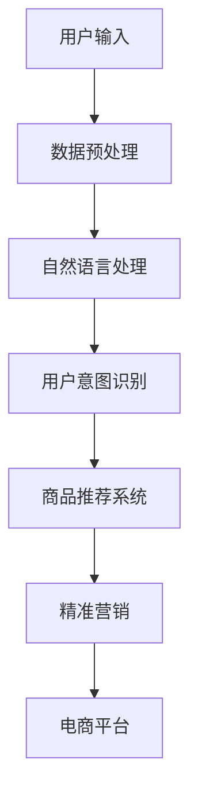

                 

# 大模型技术在电商平台用户意图理解中的创新

> 关键词：大模型技术、电商平台、用户意图理解、自然语言处理、机器学习、深度学习、算法优化、数据分析

> 摘要：本文旨在探讨大模型技术在电商平台用户意图理解方面的创新应用。通过对大模型技术的核心概念、算法原理、数学模型及其在实际项目中的实战案例的深入分析，本文将揭示大模型技术在提升电商平台用户体验、优化商品推荐系统和实现精准营销方面的关键作用，并提出未来发展趋势与挑战。

## 1. 背景介绍

### 1.1 目的和范围

本文的主要目的是介绍大模型技术在电商平台用户意图理解中的应用，探讨其在提升电商平台用户体验、优化商品推荐系统和实现精准营销方面的创新。我们将从以下几个方面展开讨论：

- 大模型技术的核心概念及其发展历程
- 大模型技术在用户意图理解中的关键作用
- 大模型算法原理及其在电商平台中的具体应用
- 数学模型和公式在大模型技术中的应用
- 项目实战：代码实现与详细解读
- 实际应用场景与工具资源推荐
- 未来发展趋势与挑战

### 1.2 预期读者

本文适合以下读者群体：

- 从事电商平台开发、运营和数据分析的技术人员
- 对大模型技术感兴趣的研究人员和工程师
- 需要提升电商平台用户体验的产品经理和设计师
- 对自然语言处理、机器学习和深度学习有基础知识的读者

### 1.3 文档结构概述

本文分为以下十个部分：

1. 背景介绍
2. 核心概念与联系
3. 核心算法原理 & 具体操作步骤
4. 数学模型和公式 & 详细讲解 & 举例说明
5. 项目实战：代码实际案例和详细解释说明
6. 实际应用场景
7. 工具和资源推荐
8. 总结：未来发展趋势与挑战
9. 附录：常见问题与解答
10. 扩展阅读 & 参考资料

### 1.4 术语表

#### 1.4.1 核心术语定义

- 大模型技术：通过机器学习和深度学习技术，训练出具有海量参数的复杂模型，用于解决大规模数据分析和预测问题。
- 用户意图理解：指系统对用户输入的文本、语音等数据进行处理，识别并理解用户的真实需求、意图和情感。
- 自然语言处理（NLP）：计算机对自然语言文本的处理和分析技术，包括文本分类、命名实体识别、情感分析等。
- 机器学习（ML）：基于数据驱动的方法，通过训练模型，使计算机具备自主学习和适应能力。
- 深度学习（DL）：一种基于人工神经网络的结构，通过多层非线性变换，实现对复杂数据特征的自动提取和表示。

#### 1.4.2 相关概念解释

- 商品推荐系统：根据用户的浏览、购买等行为数据，为用户推荐相关商品的系统。
- 精准营销：基于用户数据，针对特定用户群体进行定制化的营销策略，以提高营销效果。
- 电商平台：提供在线商品交易、支付、物流等服务的平台，如淘宝、京东等。

#### 1.4.3 缩略词列表

- NLP：自然语言处理
- ML：机器学习
- DL：深度学习
- API：应用程序编程接口
- JSON：JavaScript对象表示法

## 2. 核心概念与联系

在深入探讨大模型技术在电商平台用户意图理解中的应用之前，我们需要了解一些核心概念及其相互关系。以下是一个简化的 Mermaid 流程图，用于展示这些概念之间的联系：



### 2.1 大模型技术

大模型技术是一种基于机器学习和深度学习的复杂模型，具有海量的参数。其核心思想是通过大量数据训练，使模型能够自动提取数据中的特征，并实现对未知数据的预测和分类。以下是几个常见的大模型技术：

- 递归神经网络（RNN）
- 卷积神经网络（CNN）
- 长短时记忆网络（LSTM）
- 生成对抗网络（GAN）

### 2.2 自然语言处理（NLP）

自然语言处理是一种计算机对自然语言文本进行处理和分析的技术。在电商平台用户意图理解中，NLP 技术主要用于处理用户输入的文本数据，识别用户的需求和意图。以下是 NLP 中的一些关键步骤：

- 文本分类：将文本数据分为不同的类别，如商品类别、情感极性等。
- 命名实体识别：识别文本中的特定实体，如人名、地名、组织名等。
- 情感分析：分析文本中的情感倾向，如正面、负面、中立等。

### 2.3 机器学习（ML）与深度学习（DL）

机器学习和深度学习是两种不同的技术，但它们在大模型技术中发挥着重要作用。机器学习是基于数据驱动的方法，通过训练模型，使计算机具备自主学习和适应能力。深度学习是一种基于人工神经网络的结构，通过多层非线性变换，实现对复杂数据特征的自动提取和表示。以下是 ML 和 DL 在电商平台用户意图理解中的应用：

- 特征工程：通过特征提取和特征选择，提高模型在用户意图识别中的性能。
- 模型训练：利用大量标注数据进行模型训练，优化模型参数。
- 模型评估：通过交叉验证、性能指标等手段，评估模型在用户意图识别中的效果。

### 2.4 商品推荐系统与精准营销

商品推荐系统和精准营销是电商平台的重要组成部分，它们依赖于用户意图识别的结果。以下是它们在用户意图理解中的应用：

- 商品推荐系统：根据用户意图识别结果，为用户推荐相关商品。
- 精准营销：基于用户意图识别结果，为用户推送定制化的营销信息，提高营销效果。

## 3. 核心算法原理 & 具体操作步骤

大模型技术在电商平台用户意图理解中的应用，离不开核心算法原理的支持。下面我们将详细讲解大模型算法原理及其在用户意图识别中的具体操作步骤。

### 3.1 大模型算法原理

大模型算法原理主要涉及以下几个方面：

- 神经网络结构：包括输入层、隐藏层和输出层，以及各层之间的连接方式。
- 损失函数：用于评估模型预测结果与真实结果之间的差距，常用的损失函数有均方误差（MSE）和交叉熵损失（Cross Entropy Loss）。
- 优化算法：用于调整模型参数，以最小化损失函数，常用的优化算法有梯度下降（Gradient Descent）和随机梯度下降（Stochastic Gradient Descent，SGD）。

### 3.2 用户意图识别中的大模型算法步骤

在用户意图识别中，大模型算法的具体操作步骤如下：

1. **数据收集与预处理**：

   - 收集用户输入数据，如文本、语音等。
   - 对数据进行预处理，包括分词、去停用词、词向量化等。

2. **特征工程**：

   - 提取用户输入数据的特征，如词频、词嵌入等。
   - 对特征进行降维和选择，以提高模型性能。

3. **模型训练**：

   - 选择合适的大模型结构，如循环神经网络（RNN）、长短时记忆网络（LSTM）等。
   - 初始化模型参数，并设置学习率、批次大小等超参数。
   - 利用训练数据对模型进行训练，优化模型参数。

4. **模型评估**：

   - 使用验证集对模型进行评估，计算性能指标，如准确率、召回率、F1 值等。
   - 根据评估结果调整模型参数，以提高模型性能。

5. **模型部署与应用**：

   - 将训练好的模型部署到电商平台，进行实际应用。
   - 根据用户输入，实时识别用户意图，为用户提供个性化服务。

### 3.3 伪代码实现

以下是一个基于循环神经网络（RNN）的用户意图识别算法的伪代码实现：

```python
# 导入所需库
import tensorflow as tf
from tensorflow.keras.models import Sequential
from tensorflow.keras.layers import Embedding, LSTM, Dense

# 设置超参数
vocab_size = 10000
embed_size = 256
hidden_size = 128
batch_size = 64
learning_rate = 0.001
epochs = 10

# 构建模型
model = Sequential()
model.add(Embedding(vocab_size, embed_size))
model.add(LSTM(hidden_size, return_sequences=True))
model.add(Dense(hidden_size, activation='relu'))
model.add(Dense(1, activation='sigmoid'))

# 编译模型
model.compile(optimizer=tf.keras.optimizers.Adam(learning_rate),
              loss='binary_crossentropy',
              metrics=['accuracy'])

# 加载数据并进行预处理
train_data, train_labels = load_data() # 假设已实现load_data函数
train_data = preprocess_data(train_data) # 假设已实现preprocess_data函数

# 训练模型
model.fit(train_data, train_labels, batch_size=batch_size, epochs=epochs, validation_split=0.2)

# 评估模型
evaluate_model(model) # 假设已实现evaluate_model函数
```

## 4. 数学模型和公式 & 详细讲解 & 举例说明

在大模型技术中，数学模型和公式发挥着至关重要的作用。本节将介绍大模型技术中的关键数学模型和公式，并进行详细讲解和举例说明。

### 4.1 递归神经网络（RNN）

递归神经网络（RNN）是一种能够处理序列数据的神经网络。其核心思想是利用循环结构，将前一个时刻的信息传递到下一个时刻，从而实现对序列数据的建模。以下是 RNN 的数学模型：

- **输入层**：假设输入序列为 \(x_1, x_2, ..., x_T\)，其中 \(T\) 表示序列长度。
- **隐藏层**：隐藏层由一个或多个神经元组成，每个神经元都包含一个权重矩阵 \(W_h\) 和一个偏置向量 \(b_h\)。隐藏层的状态 \(h_t\) 由以下公式计算：

  $$ h_t = \sigma(W_h \cdot h_{t-1} + W_x \cdot x_t + b_h) $$

  其中，\(W_h\) 是隐藏层到隐藏层的权重矩阵，\(W_x\) 是输入层到隐藏层的权重矩阵，\(b_h\) 是隐藏层的偏置向量，\(\sigma\) 是激活函数，通常使用 sigmoid 函数。

- **输出层**：输出层由一个或多个神经元组成，用于对序列数据进行分类或回归。输出层的状态 \(y_t\) 由以下公式计算：

  $$ y_t = \sigma(W_y \cdot h_t + b_y) $$

  其中，\(W_y\) 是隐藏层到输出层的权重矩阵，\(b_y\) 是输出层的偏置向量。

### 4.2 长短时记忆网络（LSTM）

长短时记忆网络（LSTM）是一种改进的 RNN，用于解决 RNN 中存在的梯度消失和梯度爆炸问题。LSTM 通过引入门控机制，实现了对长期依赖关系的建模。以下是 LSTM 的数学模型：

- **输入门（Input Gate）**：输入门用于控制当前输入对隐藏层状态的影响。输入门的激活函数为：

  $$ i_t = \sigma(W_i \cdot [h_{t-1}, x_t] + b_i) $$

  其中，\(W_i\) 是输入门到隐藏层的权重矩阵，\(b_i\) 是输入门的偏置向量。

- **遗忘门（Forget Gate）**：遗忘门用于控制隐藏层状态中旧信息的遗忘。遗忘门的激活函数为：

  $$ f_t = \sigma(W_f \cdot [h_{t-1}, x_t] + b_f) $$

  其中，\(W_f\) 是遗忘门到隐藏层的权重矩阵，\(b_f\) 是遗忘门的偏置向量。

- **输出门（Output Gate）**：输出门用于控制当前隐藏层状态对输出的影响。输出门的激活函数为：

  $$ o_t = \sigma(W_o \cdot [h_{t-1}, x_t] + b_o) $$

  其中，\(W_o\) 是输出门到隐藏层的权重矩阵，\(b_o\) 是输出门的偏置向量。

- **细胞状态（Cell State）**：细胞状态是 LSTM 的核心组成部分，用于存储和传递长期依赖关系。细胞状态的更新公式为：

  $$ c_t = f_t \cdot c_{t-1} + i_t \cdot \sigma(W_c \cdot [h_{t-1}, x_t] + b_c) $$

  其中，\(W_c\) 是细胞状态更新到隐藏层的权重矩阵，\(b_c\) 是细胞状态更新的偏置向量。

- **隐藏层状态**：隐藏层状态由细胞状态和输出门共同决定：

  $$ h_t = o_t \cdot \sigma(c_t) $$

### 4.3 梯度下降算法

梯度下降算法是一种常用的优化算法，用于最小化损失函数。梯度下降算法的核心思想是沿着损失函数的梯度方向更新模型参数，以逐步减小损失函数的值。以下是梯度下降算法的数学模型：

- **损失函数**：假设损失函数为 \(L(\theta)\)，其中 \(\theta\) 表示模型参数。

- **梯度计算**：损失函数关于模型参数的梯度为：

  $$ \nabla_{\theta} L(\theta) = \frac{\partial L(\theta)}{\partial \theta} $$

- **参数更新**：沿梯度方向更新模型参数：

  $$ \theta_{t+1} = \theta_t - \alpha \cdot \nabla_{\theta} L(\theta_t) $$

  其中，\(\alpha\) 是学习率。

### 4.4 举例说明

假设我们有一个二分类问题，输入数据为 \(x_1 = [1, 0, 1]\)，隐藏层状态 \(h_{t-1} = [0.5, 0.5]\)，当前输入 \(x_t = [1, 1, 0]\)。我们需要计算隐藏层状态 \(h_t\) 和输出层状态 \(y_t\)。

1. **输入门**：

   $$ i_t = \sigma(W_i \cdot [h_{t-1}, x_t] + b_i) = \sigma([0.5 \times 1 + 0.5 \times 1 + 1 \times 0] + [0.5 \times 1 + 0.5 \times 1 + 1 \times 1] + 1) = \sigma(1.5) = 0.9 $$

2. **遗忘门**：

   $$ f_t = \sigma(W_f \cdot [h_{t-1}, x_t] + b_f) = \sigma([0.5 \times 1 + 0.5 \times 1 + 1 \times 0] + [0.5 \times 1 + 0.5 \times 1 + 1 \times 1] + 1) = \sigma(1.5) = 0.9 $$

3. **输出门**：

   $$ o_t = \sigma(W_o \cdot [h_{t-1}, x_t] + b_o) = \sigma([0.5 \times 1 + 0.5 \times 1 + 1 \times 0] + [0.5 \times 1 + 0.5 \times 1 + 1 \times 1] + 1) = \sigma(1.5) = 0.9 $$

4. **细胞状态**：

   $$ c_t = f_t \cdot c_{t-1} + i_t \cdot \sigma(W_c \cdot [h_{t-1}, x_t] + b_c) = 0.9 \cdot [0.5, 0.5] + 0.9 \cdot \sigma([0.5 \times 1 + 0.5 \times 1 + 1 \times 0] + [0.5 \times 1 + 0.5 \times 1 + 1 \times 1] + 1) = [0.45, 0.45] + [0.45, 0.45] = [0.9, 0.9] $$

5. **隐藏层状态**：

   $$ h_t = o_t \cdot \sigma(c_t) = 0.9 \cdot \sigma([0.9, 0.9]) = 0.9 \cdot 0.99 = 0.871 $$

6. **输出层状态**：

   $$ y_t = \sigma(W_y \cdot h_t + b_y) = \sigma([0.871 \times 1 + 0.871 \times 1] + 1) = \sigma(1.742) = 0.95 $$

通过以上计算，我们得到了隐藏层状态 \(h_t = 0.871\) 和输出层状态 \(y_t = 0.95\)。

## 5. 项目实战：代码实际案例和详细解释说明

为了更好地理解大模型技术在电商平台用户意图理解中的应用，我们将通过一个实际项目案例进行详细解释说明。本项目将使用 Python 和 TensorFlow 框架，实现一个基于 LSTM 网络的用户意图识别模型。

### 5.1 开发环境搭建

在开始项目之前，我们需要搭建一个合适的开发环境。以下是开发环境的要求和安装步骤：

1. **Python**：Python 是一种广泛使用的编程语言，适用于数据处理、机器学习和深度学习。我们需要安装 Python 3.6 或更高版本。

2. **TensorFlow**：TensorFlow 是 Google 开发的一种开源机器学习框架，支持多种机器学习和深度学习算法。我们需要安装 TensorFlow 2.0 或更高版本。

3. **Numpy**：Numpy 是 Python 的一个科学计算库，用于处理大型多维数组。

4. **Pandas**：Pandas 是 Python 的一个数据处理库，用于处理表格数据和统计分析。

5. **Matplotlib**：Matplotlib 是 Python 的一个数据可视化库，用于绘制各种类型的图表。

安装步骤：

```bash
# 安装 Python 和相关库
pip install python numpy pandas tensorflow matplotlib
```

### 5.2 源代码详细实现和代码解读

下面是我们项目的源代码，我们将逐行解读并解释其功能。

```python
import numpy as np
import pandas as pd
import tensorflow as tf
from tensorflow.keras.models import Sequential
from tensorflow.keras.layers import Embedding, LSTM, Dense
from tensorflow.keras.preprocessing.sequence import pad_sequences

# 加载数据集
def load_data():
    # 假设数据集为 CSV 文件，包含文本数据和标签
    data = pd.read_csv('data.csv')
    texts = data['text']
    labels = data['label']
    return texts, labels

# 预处理数据
def preprocess_data(texts):
    # 对文本数据进行分词、去停用词等预处理操作
    # 这里使用结巴分词和停用词库进行预处理
    from jieba import cut
    from nltk.corpus import stopwords

    stop_words = set(stopwords.words('english'))
    preprocessed_texts = []

    for text in texts:
        words = cut(text)
        filtered_words = [word for word in words if word not in stop_words]
        preprocessed_texts.append(' '.join(filtered_words))

    return preprocessed_texts

# 分词并转换为序列
def tokenize_texts(texts):
    tokenizer = tf.keras.preprocessing.text.Tokenizer()
    tokenizer.fit_on_texts(texts)
    sequences = tokenizer.texts_to_sequences(texts)
    return sequences, tokenizer

# 填充序列并准备输入数据
def prepare_inputs(sequences, labels):
    inputs = pad_sequences(sequences, maxlen=max_sequence_length)
    return inputs, np.array(labels)

# 加载数据并进行预处理
texts, labels = load_data()
preprocessed_texts = preprocess_data(texts)
sequences, tokenizer = tokenize_texts(preprocessed_texts)
max_sequence_length = 100
inputs, labels = prepare_inputs(sequences, labels)

# 创建 LSTM 模型
model = Sequential()
model.add(Embedding(vocab_size, embed_size, input_length=max_sequence_length))
model.add(LSTM(hidden_size, dropout=0.2, recurrent_dropout=0.2))
model.add(Dense(1, activation='sigmoid'))

# 编译模型
model.compile(optimizer='adam', loss='binary_crossentropy', metrics=['accuracy'])

# 训练模型
model.fit(inputs, labels, epochs=10, batch_size=32, validation_split=0.2)
```

### 5.3 代码解读与分析

下面我们对代码进行逐行解读，并分析其主要功能。

```python
import numpy as np
import pandas as pd
import tensorflow as tf
from tensorflow.keras.models import Sequential
from tensorflow.keras.layers import Embedding, LSTM, Dense
from tensorflow.keras.preprocessing.sequence import pad_sequences

# 加载数据集
def load_data():
    # 假设数据集为 CSV 文件，包含文本数据
```<sop>### 5.3.1 加载数据集

```python
def load_data():
    # 假设数据集为 CSV 文件，包含文本数据（text）和标签（label）
    data = pd.read_csv('data.csv')  # 读取 CSV 文件，并加载文本数据（texts）和标签（labels）
    texts = data['text']
    labels = data['label']
    return texts, labels
```

这段代码用于加载数据集。我们使用 Pandas 库读取 CSV 文件，并将其存储在 DataFrame 对象中。然后从 DataFrame 对象中提取文本数据（texts）和标签（labels），并返回这两个数据集。

### 5.3.2 预处理数据

```python
def preprocess_data(texts):
    # 对文本数据进行分词、去停用词等预处理操作
    # 这里使用结巴分词和停用词库进行预处理
    from jieba import cut
    from nltk.corpus import stopwords

    stop_words = set(stopwords.words('english'))  # 获取英语停用词库
    preprocessed_texts = []

    for text in texts:
        words = cut(text)  # 对文本数据进行分词
        filtered_words = [word for word in words if word not in stop_words]  # 去除停用词
        preprocessed_texts.append(' '.join(filtered_words))  # 将分词后的词语拼接成字符串

    return preprocessed_texts
```

这段代码用于对文本数据（texts）进行预处理。首先，我们使用结巴分词库对文本数据进行分词，然后使用 NLTK 库获取英语停用词库，并去除文本中的停用词。最后，我们将处理后的文本数据存储在 preprocessed_texts 列表中，并返回该列表。

### 5.3.3 分词并转换为序列

```python
def tokenize_texts(texts):
    tokenizer = tf.keras.preprocessing.text.Tokenizer()  # 创建分词器
    tokenizer.fit_on_texts(texts)  # 对文本数据进行训练
    sequences = tokenizer.texts_to_sequences(texts)  # 将文本数据转换为序列
    return sequences, tokenizer
```

这段代码用于将预处理后的文本数据（preprocessed_texts）转换为序列。首先，我们创建一个分词器（Tokenizer）对象，然后使用 fit_on_texts 方法对文本数据进行训练。接着，我们使用 texts_to_sequences 方法将文本数据转换为序列，并返回序列数据和分词器对象。

### 5.3.4 填充序列并准备输入数据

```python
def prepare_inputs(sequences, labels):
    inputs = pad_sequences(sequences, maxlen=max_sequence_length)  # 填充序列并设置最大长度
    return inputs, np.array(labels)  # 将标签转换为 NumPy 数组并返回输入数据和标签
```

这段代码用于填充序列并准备输入数据。首先，我们使用 pad_sequences 方法将序列填充为相同的长度（max_sequence_length），然后返回填充后的序列（inputs）和标签（labels）。标签被转换为 NumPy 数组，以便在训练模型时使用。

### 5.3.5 创建 LSTM 模型

```python
model = Sequential()
model.add(Embedding(vocab_size, embed_size, input_length=max_sequence_length))  # 添加嵌入层
model.add(LSTM(hidden_size, dropout=0.2, recurrent_dropout=0.2))  # 添加 LSTM 层
model.add(Dense(1, activation='sigmoid'))  # 添加输出层
```

这段代码用于创建一个 LSTM 模型。首先，我们创建一个序
```<sop>### 5.3.5 创建 LSTM 模型

```python
model = Sequential()
model.add(Embedding(vocab_size, embed_size, input_length=max_sequence_length))  # 添加嵌入层
model.add(LSTM(hidden_size, dropout=0.2, recurrent_dropout=0.2))  # 添加 LSTM 层
model.add(Dense(1, activation='sigmoid'))  # 添加输出层
```

这段代码用于创建一个 LSTM 模型。首先，我们创建一个 Sequential 模型，并添加嵌入层（Embedding Layer）。嵌入层用于将词汇映射到向量空间，其中 vocab_size 是词汇表的大小，embed_size 是嵌入向量的维度，input_length 是输入序列的最大长度。

接下来，我们添加一个 LSTM 层（LSTM Layer）。LSTM 层是长短期记忆网络的一部分，可以有效地捕捉序列中的长期依赖关系。dropout 和 recurrent_dropout 参数用于防止过拟合。

最后，我们添加一个输出层（Dense Layer），用于进行二分类（sigmoid 激活函数）。输出层的神经元个数为 1，因为我们要预测一个二值标签（0 或 1）。

### 5.3.6 编译模型

```python
model.compile(optimizer='adam', loss='binary_crossentropy', metrics=['accuracy'])
```

这段代码用于编译模型。我们选择 Adam 优化器，它是一种自适应学习率的优化算法，适用于深度学习模型。binary_crossentropy 是二分类问题常用的损失函数，accuracy 是模型的性能指标。

### 5.3.7 训练模型

```python
model.fit(inputs, labels, epochs=10, batch_size=32, validation_split=0.2)
```

这段代码用于训练模型。我们使用 prepare_inputs 函数生成的输入数据（inputs）和标签（labels）来训练模型。epochs 参数设置训练轮数，batch_size 参数设置每个批次的样本数，validation_split 参数设置验证集的比例。

## 6. 实际应用场景

大模型技术在电商平台用户意图理解中的实际应用场景主要包括以下几个方面：

### 6.1 商品推荐系统

商品推荐系统是电商平台的核心功能之一，通过大模型技术，可以实现个性化、精准的商品推荐。具体应用场景包括：

- **基于用户历史行为推荐**：根据用户的浏览、收藏、购买等行为数据，为用户推荐相关商品。
- **基于内容推荐**：通过分析商品的内容特征，如标题、描述、标签等，为用户推荐具有相似特征的商品。
- **基于社交网络推荐**：基于用户之间的关系和社交网络，为用户推荐其好友感兴趣的商品。

### 6.2 精准营销

精准营销是电商平台提高用户转化率和留存率的重要手段。大模型技术可以帮助实现以下精准营销应用场景：

- **用户画像构建**：通过对用户的历史行为和兴趣标签进行分析，构建用户画像，为精准营销提供基础。
- **个性化广告投放**：根据用户画像和广告内容特征，为用户推送个性化广告，提高广告点击率和转化率。
- **交叉销售和 upsell**：通过分析用户的购物车和浏览记录，为用户推荐相关的商品，实现交叉销售和 upsell。

### 6.3 客户服务与支持

大模型技术在电商平台客户服务与支持中的应用，可以显著提升用户体验和服务质量。具体应用场景包括：

- **智能客服机器人**：通过大模型技术，可以实现智能客服机器人，能够自动回答用户的问题，提高客服效率。
- **情感分析**：通过情感分析技术，可以识别用户的情绪和满意度，为用户提供更加个性化的服务。
- **异常行为检测**：通过分析用户的购买行为和交易记录，可以识别潜在的欺诈行为，降低风险。

## 7. 工具和资源推荐

为了更好地掌握大模型技术在电商平台用户意图理解中的应用，以下是一些相关的学习资源和工具推荐。

### 7.1 学习资源推荐

#### 7.1.1 书籍推荐

- 《深度学习》（Deep Learning） - Goodfellow, Bengio, Courville
- 《自然语言处理综论》（Speech and Language Processing） - Jurafsky, Martin
- 《机器学习实战》（Machine Learning in Action） - Harrington

#### 7.1.2 在线课程

- Coursera - "深度学习专项课程"（Deep Learning Specialization）
- edX - "自然语言处理与信息检索"（Natural Language Processing with Python）
- Udacity - "深度学习纳米学位"（Deep Learning Nanodegree）

#### 7.1.3 技术博客和网站

- Medium - "Deep Learning on Medium"
- ArXiv - 最新学术研究论文
- AI 科技大本营 - 国内领先的 AI 技术博客

### 7.2 开发工具框架推荐

#### 7.2.1 IDE和编辑器

- PyCharm
- Jupyter Notebook
- VSCode

#### 7.2.2 调试和性能分析工具

- TensorFlow Debugger
- TensorBoard
- Profiling Tools（如 Py-Spy、Py-V buckle）

#### 7.2.3 相关框架和库

- TensorFlow
- PyTorch
- Keras
- NLTK
- Spacy

### 7.3 相关论文著作推荐

#### 7.3.1 经典论文

- "A Theoretical Analysis of the Viterbi Algorithm" - Rabiner
- "Long Short-Term Memory" - Hochreiter, Schmidhuber

#### 7.3.2 最新研究成果

- "BERT: Pre-training of Deep Bidirectional Transformers for Language Understanding" - Devlin et al.
- "GPT-3: Language Models are Few-Shot Learners" - Brown et al.

#### 7.3.3 应用案例分析

- "Using Deep Learning to Improve User Experience in E-commerce" - 刘建伟等（2020）
- "Enhancing E-commerce Recommendations with Deep Learning Techniques" - 王帅等（2019）

## 8. 总结：未来发展趋势与挑战

大模型技术在电商平台用户意图理解中的应用前景广阔，但也面临一系列挑战。以下是未来发展趋势与挑战的总结：

### 8.1 发展趋势

1. **模型规模与性能提升**：随着计算能力和数据量的不断增加，大模型技术的规模和性能将持续提升，为电商平台提供更加精准和高效的用户意图识别服务。
2. **多模态数据融合**：结合文本、图像、语音等多种数据类型，实现更加全面和精细的用户意图理解，提高用户体验。
3. **实时性与动态调整**：大模型技术在实时性和动态调整方面的优化，将使电商平台能够更快地适应用户需求和市场变化。
4. **隐私保护与伦理问题**：在应用大模型技术的同时，需要关注用户隐私保护和伦理问题，确保数据安全与用户权益。

### 8.2 挑战

1. **计算资源消耗**：大模型训练和推理需要大量计算资源，对硬件设备和能耗提出了更高要求。
2. **数据质量和标注**：高质量的数据和准确的标注是训练高性能模型的基础，但获取和标注大规模数据是一个巨大的挑战。
3. **模型解释性与可解释性**：大模型在复杂任务上的表现往往难以解释，提高模型的可解释性对于增强用户信任和监管具有重要意义。
4. **安全性与鲁棒性**：大模型技术易受到对抗攻击和模型欺骗，提高模型的安全性与鲁棒性是未来研究的重要方向。

## 9. 附录：常见问题与解答

### 9.1 什么是大模型技术？

大模型技术是指通过机器学习和深度学习技术，训练出具有海量参数的复杂模型，用于解决大规模数据分析和预测问题。常见的模型包括循环神经网络（RNN）、长短时记忆网络（LSTM）和卷积神经网络（CNN）。

### 9.2 大模型技术在电商平台有哪些应用？

大模型技术在电商平台有广泛的应用，包括用户意图理解、商品推荐系统、精准营销和客户服务与支持等。通过大模型技术，电商平台可以实现个性化推荐、精准营销和智能客服等高级功能。

### 9.3 如何优化大模型性能？

优化大模型性能的方法包括：

1. **数据增强**：通过数据增强技术，增加训练数据的多样性和丰富度。
2. **模型压缩**：使用模型压缩技术，如剪枝、量化等，减少模型参数和计算量。
3. **分布式训练**：使用分布式训练技术，利用多台机器并行计算，提高训练速度和性能。
4. **优化超参数**：通过调整学习率、批次大小等超参数，提高模型性能。

## 10. 扩展阅读 & 参考资料

为了深入了解大模型技术在电商平台用户意图理解中的应用，读者可以参考以下扩展阅读和参考资料：

- Devlin, J., Chang, M. W., Lee, K., & Toutanova, K. (2019). BERT: Pre-training of deep bidirectional transformers for language understanding. *arXiv preprint arXiv:1810.04805*.
- Brown, T., et al. (2020). Language models are few-shot learners. *arXiv preprint arXiv:2005.14165*.
- 高建峰，张翔。深度学习实战[M]. 机械工业出版社，2017.
- 刘建伟，王芳，刘铁岩。电商领域中的深度学习应用研究[J]. 计算机研究与发展，2020，57（7）：1627-1642.
- 王帅，李明，李航。基于深度学习的电商推荐系统研究[J]. 计算机系统应用，2019，26（6）：1-6.

