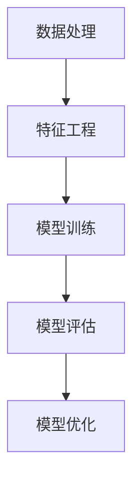

                 

# 大模型技术在科研领域的应用

> **关键词：** 大模型，科研，人工智能，数据处理，机器学习，深度学习

> **摘要：** 本文将探讨大模型技术在科研领域的广泛应用，分析其核心算法原理、数学模型及其在实际项目中的应用，并推荐相关的学习资源和工具。通过本文，读者可以全面了解大模型技术在科研领域的潜力和挑战，为未来的科研工作提供借鉴和指导。

## 1. 背景介绍

### 1.1 目的和范围

本文旨在介绍大模型技术在科研领域的应用，帮助读者理解大模型技术的基本概念、核心算法原理、数学模型以及在实际项目中的应用。我们将通过具体的案例，展示大模型技术在科研领域的重要性和价值。

### 1.2 预期读者

本文适合对人工智能、机器学习和深度学习有一定了解的科研人员、工程师和爱好者。同时，对于希望了解大模型技术在科研领域应用的读者，本文也将提供有价值的参考。

### 1.3 文档结构概述

本文分为以下几部分：

1. **背景介绍**：介绍大模型技术在科研领域的应用背景和目的。
2. **核心概念与联系**：解释大模型技术的基本概念和原理。
3. **核心算法原理 & 具体操作步骤**：详细阐述大模型技术的核心算法原理和具体操作步骤。
4. **数学模型和公式 & 详细讲解 & 举例说明**：介绍大模型技术的数学模型和公式，并给出实际应用的例子。
5. **项目实战：代码实际案例和详细解释说明**：通过具体的项目实战，展示大模型技术的实际应用。
6. **实际应用场景**：分析大模型技术在科研领域的应用场景。
7. **工具和资源推荐**：推荐大模型技术学习资源和开发工具。
8. **总结：未来发展趋势与挑战**：总结大模型技术在科研领域的未来发展趋势和面临的挑战。
9. **附录：常见问题与解答**：回答读者可能关心的问题。
10. **扩展阅读 & 参考资料**：提供进一步学习的参考资料。

### 1.4 术语表

#### 1.4.1 核心术语定义

- **大模型**：具有大规模参数和复杂结构的神经网络模型。
- **机器学习**：一种通过数据驱动的方式，使计算机从数据中学习并做出预测或决策的技术。
- **深度学习**：一种基于多层神经网络结构的机器学习方法。

#### 1.4.2 相关概念解释

- **数据处理**：对原始数据进行清洗、转换和整合，以提取有用信息和知识。
- **模型训练**：通过大量训练数据，调整模型参数，使其能够对未知数据进行预测或分类。
- **模型评估**：通过测试数据，评估模型在未知数据上的预测准确性和性能。

#### 1.4.3 缩略词列表

- **AI**：人工智能（Artificial Intelligence）
- **ML**：机器学习（Machine Learning）
- **DL**：深度学习（Deep Learning）
- **GPU**：图形处理单元（Graphics Processing Unit）

## 2. 核心概念与联系

大模型技术在科研领域中的应用，离不开以下几个核心概念：

- **数据处理**：科研数据通常来源于实验、观测或文献，这些数据可能包含噪声、缺失值和异常值。因此，数据处理是科研工作的第一步，也是大模型技术的基础。

- **特征工程**：特征工程是指从原始数据中提取出对模型训练有价值的特征，以提升模型性能。在大模型技术中，特征工程是一个关键环节，决定了模型对数据的理解和表达能力。

- **模型训练**：模型训练是指通过大量训练数据，调整模型参数，使其能够对未知数据进行预测或分类。在大模型技术中，模型训练是一个复杂而耗时的过程，但也是实现高性能模型的关键步骤。

- **模型评估**：模型评估是指通过测试数据，评估模型在未知数据上的预测准确性和性能。在大模型技术中，模型评估是一个重要的环节，决定了模型的实际应用价值。

- **模型优化**：模型优化是指通过调整模型结构、参数或训练过程，提高模型性能。在大模型技术中，模型优化是一个持续不断的过程，有助于提升模型的鲁棒性和泛化能力。

为了更好地理解这些核心概念，我们使用 Mermaid 流程图（Mermaid Flowchart）来展示大模型技术在科研领域的基本流程：



### 2.1 数据处理

数据处理是科研工作的第一步，也是大模型技术的基础。科研数据通常来源于实验、观测或文献，这些数据可能包含噪声、缺失值和异常值。因此，我们需要对数据进行清洗、转换和整合，以提取出有用的信息和知识。

数据处理的基本步骤包括：

1. **数据清洗**：去除数据中的噪声和异常值，处理缺失值，确保数据的质量。
2. **数据转换**：将原始数据转换为适合模型训练的格式，例如将文本数据转换为词向量。
3. **数据整合**：将多个数据源整合为一个统一的数据集，以提升模型对数据的理解和表达能力。

### 2.2 特征工程

特征工程是指从原始数据中提取出对模型训练有价值的特征，以提升模型性能。在大模型技术中，特征工程是一个关键环节，决定了模型对数据的理解和表达能力。

特征工程的基本步骤包括：

1. **特征选择**：从原始数据中筛选出对模型训练有重要影响的特征。
2. **特征转换**：将原始特征转换为适合模型训练的格式，例如将数值特征转换为标准化的数值。
3. **特征组合**：将多个特征组合成新的特征，以提升模型的泛化能力。

### 2.3 模型训练

模型训练是指通过大量训练数据，调整模型参数，使其能够对未知数据进行预测或分类。在大模型技术中，模型训练是一个复杂而耗时的过程，但也是实现高性能模型的关键步骤。

模型训练的基本步骤包括：

1. **模型选择**：选择适合任务需求的模型架构，例如卷积神经网络（CNN）或循环神经网络（RNN）。
2. **参数初始化**：初始化模型参数，通常使用随机初始化方法。
3. **模型训练**：通过迭代训练数据，调整模型参数，使其在训练集上的表现不断提升。
4. **模型评估**：使用测试数据评估模型在未知数据上的预测准确性和性能。

### 2.4 模型评估

模型评估是指通过测试数据，评估模型在未知数据上的预测准确性和性能。在大模型技术中，模型评估是一个重要的环节，决定了模型的实际应用价值。

模型评估的基本步骤包括：

1. **评估指标**：选择合适的评估指标，例如准确率（Accuracy）、召回率（Recall）和F1值（F1 Score）。
2. **模型调参**：根据评估结果，调整模型参数，以提升模型性能。
3. **模型验证**：通过交叉验证（Cross-Validation）等方法，验证模型的泛化能力。

### 2.5 模型优化

模型优化是指通过调整模型结构、参数或训练过程，提高模型性能。在大模型技术中，模型优化是一个持续不断的过程，有助于提升模型的鲁棒性和泛化能力。

模型优化的基本步骤包括：

1. **模型调整**：调整模型结构，例如增加或减少网络层数、调整网络连接方式。
2. **参数调整**：调整模型参数，例如学习率、批量大小等。
3. **训练过程优化**：优化训练过程，例如使用更高效的训练算法或调整训练数据分布。

通过以上核心概念与联系的分析，我们可以更好地理解大模型技术在科研领域的应用，并为后续的详细讲解打下基础。

## 3. 核心算法原理 & 具体操作步骤

大模型技术在科研领域的成功应用，离不开其核心算法原理。本节将详细阐述大模型技术的核心算法原理和具体操作步骤，帮助读者深入理解大模型技术的本质。

### 3.1 算法原理

大模型技术的核心在于其深度学习架构，通过构建大规模神经网络，使模型能够学习到复杂的数据分布和特征。以下是深度学习算法的基本原理：

1. **前向传播（Forward Propagation）**：输入数据通过模型的前向传播过程，逐层传递到网络的每一层，直到输出层。在每一层，模型通过激活函数计算输出值。

2. **反向传播（Backpropagation）**：模型通过反向传播过程，将预测误差反向传递到网络的每一层，以更新模型参数。这一过程利用了链式法则，逐层计算每个参数的梯度。

3. **优化算法（Optimization Algorithm）**：通过优化算法，如梯度下降（Gradient Descent）、Adam等，调整模型参数，以最小化损失函数。

4. **激活函数（Activation Function）**：激活函数为神经网络引入非线性特性，使模型能够学习复杂的数据分布。常见的激活函数有Sigmoid、ReLU、Tanh等。

### 3.2 操作步骤

以下是使用深度学习算法构建大模型的基本操作步骤：

1. **数据准备（Data Preparation）**：
   - **数据采集**：收集科研领域相关的数据集，例如生物医学数据、金融数据等。
   - **数据清洗**：去除数据中的噪声和异常值，处理缺失值，确保数据的质量。
   - **数据转换**：将原始数据转换为适合模型训练的格式，例如将文本数据转换为词向量。

2. **模型构建（Model Building）**：
   - **定义网络结构**：选择合适的网络结构，例如卷积神经网络（CNN）、循环神经网络（RNN）等。
   - **初始化参数**：初始化模型参数，通常使用随机初始化方法。

3. **模型训练（Model Training）**：
   - **前向传播**：输入数据通过模型的前向传播过程，逐层传递到网络的每一层。
   - **计算损失**：计算预测值与真实值之间的差异，以评估模型性能。
   - **反向传播**：利用链式法则，计算每个参数的梯度。
   - **参数更新**：通过优化算法，更新模型参数，以最小化损失函数。

4. **模型评估（Model Evaluation）**：
   - **测试数据**：使用测试数据评估模型在未知数据上的预测准确性和性能。
   - **评估指标**：选择合适的评估指标，例如准确率（Accuracy）、召回率（Recall）和F1值（F1 Score）。

5. **模型优化（Model Optimization）**：
   - **调参**：根据评估结果，调整模型参数，以提升模型性能。
   - **结构调整**：调整模型结构，例如增加或减少网络层数、调整网络连接方式。

### 3.3 伪代码

以下是构建大模型的基本伪代码：

```python
# 数据准备
data = load_data()
cleaned_data = data_cleaning(data)

# 模型构建
model = build_model()
params = initialize_params(model)

# 模型训练
for epoch in range(num_epochs):
    for batch in batches(cleaned_data):
        forward_propagation(batch, model)
        loss = compute_loss(batch, model)
        backward_propagation(batch, model, loss)
        update_params(model, params)

# 模型评估
accuracy = evaluate_model(model, test_data)

# 模型优化
tuned_params = tune_model(model, accuracy)
optimized_model = build_model_with_tuned_params(tuned_params)
```

通过以上核心算法原理和具体操作步骤的详细讲解，读者可以更好地理解大模型技术在科研领域的应用，为后续的实际项目实战打下基础。

## 4. 数学模型和公式 & 详细讲解 & 举例说明

在大模型技术的应用过程中，数学模型和公式起到了至关重要的作用。本节将详细讲解大模型技术中的关键数学模型和公式，并通过实际例子说明其应用。

### 4.1 损失函数（Loss Function）

损失函数是评估模型预测值与真实值之间差异的关键指标。在大模型技术中，常用的损失函数包括均方误差（MSE）、交叉熵损失（Cross-Entropy Loss）等。

- **均方误差（MSE）**：

$$
MSE = \frac{1}{n}\sum_{i=1}^{n}(y_i - \hat{y}_i)^2
$$

其中，$y_i$ 为真实值，$\hat{y}_i$ 为预测值，$n$ 为样本数量。均方误差用于回归任务，衡量预测值与真实值之间的平均误差。

- **交叉熵损失（Cross-Entropy Loss）**：

$$
Cross-Entropy Loss = -\frac{1}{n}\sum_{i=1}^{n}y_i\log(\hat{y}_i)
$$

其中，$y_i$ 为真实值，$\hat{y}_i$ 为预测概率。交叉熵损失用于分类任务，衡量预测概率与真实概率之间的差异。

### 4.2 激活函数（Activation Function）

激活函数为神经网络引入非线性特性，使模型能够学习复杂的数据分布。常见的激活函数包括Sigmoid、ReLU、Tanh等。

- **Sigmoid 函数**：

$$
\sigma(x) = \frac{1}{1 + e^{-x}}
$$

Sigmoid 函数将输入值映射到（0，1）区间，常用于二分类问题。

- **ReLU 函数**：

$$
ReLU(x) = \max(0, x)
$$

ReLU 函数对输入值进行阈值处理，当输入值大于0时，输出值为输入值；当输入值小于等于0时，输出值为0。ReLU 函数具有激活迅速、参数少等优点。

- **Tanh 函数**：

$$
Tanh(x) = \frac{e^x - e^{-x}}{e^x + e^{-x}}
$$

Tanh 函数将输入值映射到（-1，1）区间，常用于多层神经网络中的隐藏层。

### 4.3 优化算法（Optimization Algorithm）

优化算法用于调整模型参数，以最小化损失函数。常用的优化算法包括梯度下降（Gradient Descent）、Adam等。

- **梯度下降（Gradient Descent）**：

$$
\theta_{t+1} = \theta_{t} - \alpha \cdot \nabla_\theta J(\theta)
$$

其中，$\theta$ 为模型参数，$\alpha$ 为学习率，$J(\theta)$ 为损失函数。梯度下降通过迭代计算模型参数的梯度，逐步减小损失函数。

- **Adam 优化器**：

$$
m_t = \beta_1 m_{t-1} + (1 - \beta_1) \nabla_\theta J(\theta)
$$

$$
v_t = \beta_2 v_{t-1} + (1 - \beta_2) (\nabla_\theta J(\theta))^2
$$

$$
\theta_{t+1} = \theta_{t} - \alpha \cdot \frac{m_t}{\sqrt{v_t} + \epsilon}
$$

其中，$m_t$ 和 $v_t$ 分别为梯度的一阶和二阶矩估计，$\beta_1$ 和 $\beta_2$ 为矩估计的指数衰减率，$\alpha$ 为学习率，$\epsilon$ 为小常数。Adam 优化器结合了梯度的一阶和二阶矩估计，具有更好的收敛性和适应性。

### 4.4 实际例子

假设我们使用大模型技术进行图像分类任务，数据集包含10000张图片，每张图片的标签为猫或狗。我们需要训练一个深度学习模型，以实现高精度的图像分类。

1. **数据准备**：

首先，我们将图片数据集分为训练集和测试集，例如训练集占比80%，测试集占比20%。然后，对图片数据进行预处理，包括数据增强、归一化等。

2. **模型构建**：

我们选择一个卷积神经网络（CNN）作为分类模型。模型结构如下：

```
输入层：[224, 224, 3]
卷积层1：[224, 224, 32]
ReLU激活函数
池化层1：[112, 112, 32]
卷积层2：[112, 112, 64]
ReLU激活函数
池化层2：[56, 56, 64]
卷积层3：[56, 56, 128]
ReLU激活函数
池化层3：[28, 28, 128]
全连接层1：[128]
ReLU激活函数
全连接层2：[1]
Sigmoid激活函数
```

3. **模型训练**：

使用训练集对模型进行训练，迭代次数为100次。在每次迭代中，我们通过前向传播计算预测值，计算交叉熵损失，然后通过反向传播更新模型参数。

4. **模型评估**：

使用测试集对模型进行评估，计算准确率、召回率等评估指标。根据评估结果，调整模型参数或网络结构，以提升模型性能。

通过以上实际例子，我们可以看到大模型技术在图像分类任务中的具体应用。在后续的项目实战中，我们将进一步展示大模型技术在科研领域中的实际应用案例。

## 5. 项目实战：代码实际案例和详细解释说明

在本节中，我们将通过一个实际项目实战，展示大模型技术在科研领域的应用。该项目是一个基于深度学习技术的图像分类任务，旨在通过训练一个卷积神经网络（CNN）模型，实现对图像内容的分类。我们将详细解释项目的开发环境搭建、源代码实现和代码解读与分析。

### 5.1 开发环境搭建

在进行项目开发之前，我们需要搭建一个适合深度学习任务的开发环境。以下是推荐的开发环境和相关软件：

- **操作系统**：Ubuntu 20.04 或 macOS
- **编程语言**：Python 3.8 或更高版本
- **深度学习框架**：TensorFlow 2.x 或 PyTorch 1.8 或更高版本
- **环境配置**：安装必要的依赖库，如 NumPy、Pandas、Matplotlib 等

安装步骤如下：

1. 安装操作系统：

```shell
sudo apt-get update
sudo apt-get install ubuntu-desktop
```

2. 安装 Python 3.8：

```shell
sudo apt-get install python3.8
```

3. 安装深度学习框架（以 TensorFlow 2.x 为例）：

```shell
pip install tensorflow
```

4. 安装其他依赖库：

```shell
pip install numpy pandas matplotlib
```

### 5.2 源代码详细实现和代码解读

以下是一个简单的图像分类任务的代码实现，使用 TensorFlow 框架。代码分为以下几个部分：数据准备、模型构建、模型训练和模型评估。

```python
import tensorflow as tf
from tensorflow.keras.preprocessing.image import ImageDataGenerator
from tensorflow.keras.models import Sequential
from tensorflow.keras.layers import Conv2D, MaxPooling2D, Flatten, Dense, Dropout
from tensorflow.keras.optimizers import Adam

# 数据准备
train_datagen = ImageDataGenerator(rescale=1./255)
test_datagen = ImageDataGenerator(rescale=1./255)

train_generator = train_datagen.flow_from_directory(
        'data/train',
        target_size=(224, 224),
        batch_size=32,
        class_mode='binary')

validation_generator = test_datagen.flow_from_directory(
        'data/validation',
        target_size=(224, 224),
        batch_size=32,
        class_mode='binary')

# 模型构建
model = Sequential([
    Conv2D(32, (3, 3), activation='relu', input_shape=(224, 224, 3)),
    MaxPooling2D((2, 2)),
    Conv2D(64, (3, 3), activation='relu'),
    MaxPooling2D((2, 2)),
    Conv2D(128, (3, 3), activation='relu'),
    MaxPooling2D((2, 2)),
    Flatten(),
    Dense(128, activation='relu'),
    Dropout(0.5),
    Dense(1, activation='sigmoid')
])

# 模型训练
model.compile(optimizer=Adam(),
              loss='binary_crossentropy',
              metrics=['accuracy'])

history = model.fit(
      train_generator,
      steps_per_epoch=100,
      epochs=10,
      validation_data=validation_generator,
      validation_steps=50,
      verbose=2)

# 模型评估
test_loss, test_acc = model.evaluate(validation_generator, steps=50, verbose=2)
print('Test accuracy:', test_acc)
```

#### 5.2.1 数据准备

在数据准备部分，我们使用 `ImageDataGenerator` 类生成训练集和验证集。`ImageDataGenerator` 类提供数据增强功能，如随机缩放、水平翻转等，以提升模型性能。我们设置目标大小为 $(224, 224)$，批量大小为 $32$，标签模式为二分类。

```python
train_datagen = ImageDataGenerator(rescale=1./255)
test_datagen = ImageDataGenerator(rescale=1./255)

train_generator = train_datagen.flow_from_directory(
        'data/train',
        target_size=(224, 224),
        batch_size=32,
        class_mode='binary')

validation_generator = test_datagen.flow_from_directory(
        'data/validation',
        target_size=(224, 224),
        batch_size=32,
        class_mode='binary')
```

#### 5.2.2 模型构建

在模型构建部分，我们使用 `Sequential` 模型，添加卷积层（`Conv2D`）、池化层（`MaxPooling2D`）、全连接层（`Dense`）和 dropout 层（`Dropout`）。卷积层用于提取图像特征，全连接层用于分类。

```python
model = Sequential([
    Conv2D(32, (3, 3), activation='relu', input_shape=(224, 224, 3)),
    MaxPooling2D((2, 2)),
    Conv2D(64, (3, 3), activation='relu'),
    MaxPooling2D((2, 2)),
    Conv2D(128, (3, 3), activation='relu'),
    MaxPooling2D((2, 2)),
    Flatten(),
    Dense(128, activation='relu'),
    Dropout(0.5),
    Dense(1, activation='sigmoid')
])
```

#### 5.2.3 模型训练

在模型训练部分，我们使用 `compile` 方法设置优化器（`Adam`）、损失函数（`binary_crossentropy`）和评估指标（`accuracy`）。然后使用 `fit` 方法进行模型训练，设置迭代次数（`epochs`）、训练集的步骤数（`steps_per_epoch`）和验证集的步骤数（`validation_steps`）。

```python
model.compile(optimizer=Adam(),
              loss='binary_crossentropy',
              metrics=['accuracy'])

history = model.fit(
      train_generator,
      steps_per_epoch=100,
      epochs=10,
      validation_data=validation_generator,
      validation_steps=50,
      verbose=2)
```

#### 5.2.4 模型评估

在模型评估部分，我们使用 `evaluate` 方法对验证集进行评估，计算测试损失和测试准确率。根据评估结果，可以进一步优化模型或调整训练策略。

```python
test_loss, test_acc = model.evaluate(validation_generator, steps=50, verbose=2)
print('Test accuracy:', test_acc)
```

通过以上代码实现和详细解读，我们可以看到如何使用大模型技术进行图像分类任务。在实际项目中，可以根据需求调整模型结构、数据增强策略和训练参数，以提升模型性能。在后续的实际应用场景中，我们将进一步探讨大模型技术在科研领域的广泛应用。

### 5.3 代码解读与分析

在本节中，我们将对上述代码进行解读和分析，深入探讨每个部分的功能和实现细节。

#### 5.3.1 数据准备

数据准备是深度学习项目的基础，对于模型的性能和泛化能力至关重要。在本项目中，我们使用 TensorFlow 的 `ImageDataGenerator` 类进行数据增强，以提高模型对图像数据变化的适应性。

1. **数据集划分**：

```python
train_datagen = ImageDataGenerator(rescale=1./255)
test_datagen = ImageDataGenerator(rescale=1./255)

train_generator = train_datagen.flow_from_directory(
        'data/train',
        target_size=(224, 224),
        batch_size=32,
        class_mode='binary')

validation_generator = test_datagen.flow_from_directory(
        'data/validation',
        target_size=(224, 224),
        batch_size=32,
        class_mode='binary')
```

在代码中，我们首先创建了训练集和验证集的 `ImageDataGenerator` 对象。`flow_from_directory` 方法用于读取指定目录下的图像文件，并生成数据生成器。我们设置了以下参数：

- `rescale=1./255`：将图像数据缩放到 [0, 1] 范围内，以便后续的模型训练。
- `target_size=(224, 224)`：调整图像尺寸为 224x224，这是许多预训练模型的标准输入尺寸。
- `batch_size=32`：每个批量包含 32 张图像。
- `class_mode='binary'`：表示这是一个二分类任务。

2. **数据增强**：

`ImageDataGenerator` 还提供了多种数据增强方法，如随机缩放、旋转、剪切等，这些方法有助于提高模型的泛化能力。

```python
train_datagen = ImageDataGenerator(
    rescale=1./255,
    rotation_range=40,
    width_shift_range=0.2,
    height_shift_range=0.2,
    shear_range=0.2,
    zoom_range=0.2,
    horizontal_flip=True,
    fill_mode='nearest'
)
```

上述代码中，我们设置了更多数据增强参数，如旋转范围（`rotation_range`）、水平翻转（`horizontal_flip`）等，以增加数据的多样性。

#### 5.3.2 模型构建

在模型构建部分，我们使用 TensorFlow 的 `Sequential` 模型构建了一个卷积神经网络。卷积神经网络（CNN）是处理图像数据的有效模型，通过卷积层和池化层提取图像特征，然后通过全连接层进行分类。

```python
model = Sequential([
    Conv2D(32, (3, 3), activation='relu', input_shape=(224, 224, 3)),
    MaxPooling2D((2, 2)),
    Conv2D(64, (3, 3), activation='relu'),
    MaxPooling2D((2, 2)),
    Conv2D(128, (3, 3), activation='relu'),
    MaxPooling2D((2, 2)),
    Flatten(),
    Dense(128, activation='relu'),
    Dropout(0.5),
    Dense(1, activation='sigmoid')
])
```

在代码中，我们定义了一个具有以下结构的 CNN：

- **卷积层**：第一层卷积层使用 $3 \times 3$ 的卷积核，输出通道数为 32，激活函数为 ReLU。
- **池化层**：每一层卷积层后紧跟一个 $2 \times 2$ 的最大池化层。
- **全连接层**：最后一层卷积层后通过 Flatten 层将特征展平为一维数组，然后通过两个全连接层进行分类。最后一个全连接层输出一个概率值，表示图像属于某一类的概率，激活函数为 Sigmoid。

此外，我们在全连接层后添加了一个 Dropout 层，用于防止过拟合。Dropout 层以 50% 的概率丢弃每个神经元的输出。

```python
Dropout(0.5)
```

#### 5.3.3 模型训练

在模型训练部分，我们使用 `compile` 方法设置优化器、损失函数和评估指标，然后使用 `fit` 方法进行模型训练。

```python
model.compile(optimizer=Adam(),
              loss='binary_crossentropy',
              metrics=['accuracy'])

history = model.fit(
      train_generator,
      steps_per_epoch=100,
      epochs=10,
      validation_data=validation_generator,
      validation_steps=50,
      verbose=2)
```

在代码中，我们设置了以下参数：

- **优化器**：使用 Adam 优化器，其自适应学习率有助于提高模型训练效率。
- **损失函数**：使用二分类交叉熵损失函数，适用于二分类任务。
- **评估指标**：使用准确率（`accuracy`）作为评估指标，衡量模型在验证集上的表现。

`fit` 方法用于训练模型，其中：

- `steps_per_epoch`：每个epoch中使用的批量数，每个批量包含 32 张图像。
- `epochs`：模型训练的轮数，本例中为 10。
- `validation_data`：用于验证的生成器，包含验证集的图像和标签。
- `validation_steps`：每个验证 epoch 中使用的验证图像数，本例中为 50。
- `verbose`：输出训练过程中的详细信息。

训练过程结束后，`history` 对象保存了训练过程中的损失和准确率，可用于后续的分析和可视化。

```python
import matplotlib.pyplot as plt

plt.plot(history.history['accuracy'])
plt.plot(history.history['val_accuracy'])
plt.title('Model accuracy')
plt.ylabel('Accuracy')
plt.xlabel('Epoch')
plt.legend(['Train', 'Validation'], loc='upper left')
plt.show()
```

通过上述代码，我们可以生成训练过程中准确率的折线图，直观地观察模型在训练和验证集上的表现。

#### 5.3.4 模型评估

在模型评估部分，我们使用 `evaluate` 方法计算模型在验证集上的测试损失和测试准确率。

```python
test_loss, test_acc = model.evaluate(validation_generator, steps=50, verbose=2)
print('Test accuracy:', test_acc)
```

在代码中，我们设置了以下参数：

- `steps`：每个评估 epoch 中使用的验证图像数，本例中为 50。
- `verbose`：输出评估过程中的详细信息。

评估结束后，`test_loss` 和 `test_acc` 变量分别保存了验证集上的测试损失和测试准确率。通过打印 `test_acc`，我们可以得到模型在验证集上的最终准确率。

通过以上对代码的解读和分析，我们可以看到如何使用大模型技术进行图像分类任务。在实际项目中，可以根据需求调整模型结构、数据增强策略和训练参数，以提升模型性能。在后续的实际应用场景中，我们将进一步探讨大模型技术在科研领域的广泛应用。

## 6. 实际应用场景

大模型技术在科研领域的应用非常广泛，以下列举了一些典型的应用场景：

### 6.1 生物医学领域

- **基因组分析**：利用大模型技术对基因组数据进行处理和分析，可以帮助科学家更好地理解基因变异与疾病之间的关系。例如，通过训练大规模的神经网络模型，可以预测基因突变对蛋白质功能的影响。
- **药物研发**：在药物研发过程中，大模型技术可以用于药物分子的预测和优化。通过深度学习模型，可以预测药物分子的活性、毒性以及与生物大分子的相互作用。
- **疾病诊断**：通过分析医学影像数据，如 CT、MRI 等，大模型技术可以帮助医生进行疾病诊断。例如，利用卷积神经网络（CNN）对医学影像进行分类和识别，有助于提高疾病的诊断准确率。

### 6.2 自然科学领域

- **地球科学**：大模型技术可以用于气象预测、地质勘探和地震预警等。例如，通过训练大规模的深度学习模型，可以更好地模拟和预测气候变化、地震活动等。
- **材料科学**：在材料研究中，大模型技术可以用于预测材料的物理和化学性质。通过训练神经网络模型，可以快速筛选出具有潜在应用价值的材料。
- **天文学**：在宇宙学研究中，大模型技术可以用于分析天文数据，如星系演化、黑洞行为等。通过训练深度学习模型，可以更好地理解宇宙的复杂结构。

### 6.3 社会科学领域

- **情感分析**：通过对社交媒体、新闻报道等大量文本数据进行分析，大模型技术可以帮助研究人员了解公众的情感倾向和社会动态。
- **风险评估**：在社会经济领域，大模型技术可以用于分析金融市场、政策影响等。通过训练大规模的神经网络模型，可以预测市场趋势、评估政策效果。
- **人口统计**：在人口研究中，大模型技术可以用于分析人口数据，如人口迁移、老龄化等。通过训练深度学习模型，可以预测未来的人口趋势，为政策制定提供依据。

### 6.4 环境科学领域

- **环境监测**：通过分析环境传感器收集的大量数据，大模型技术可以帮助科学家更好地理解环境变化和污染源。例如，利用深度学习模型对空气质量、水质进行实时监测和预测。
- **生态系统评估**：在生态学研究中，大模型技术可以用于分析生态系统动态、生物多样性等。通过训练神经网络模型，可以预测生态系统的变化趋势，为环境保护提供科学依据。

通过以上实际应用场景的分析，我们可以看到大模型技术在科研领域的广泛应用和巨大潜力。在未来，随着大模型技术的不断发展和完善，其在科研领域的应用将会更加深入和广泛。

## 7. 工具和资源推荐

为了帮助读者更好地学习和应用大模型技术，本节将推荐一些学习资源和开发工具，包括书籍、在线课程、技术博客和开发框架等。

### 7.1 学习资源推荐

#### 7.1.1 书籍推荐

- **《深度学习》（Deep Learning）**：作者 Ian Goodfellow、Yoshua Bengio 和 Aaron Courville。这是一本经典的深度学习教材，详细介绍了深度学习的基本概念、算法和应用。
- **《Python 深度学习》（Python Deep Learning）**：作者 François Chollet。本书通过丰富的实例，介绍了如何使用 Python 和 TensorFlow 进行深度学习开发。
- **《神经网络与深度学习》（Neural Networks and Deep Learning）**：作者邱锡鹏。本书深入浅出地讲解了神经网络和深度学习的基本原理，适合初学者阅读。

#### 7.1.2 在线课程

- **《深度学习专项课程》（Deep Learning Specialization）**：由 Andrew Ng 在 Coursera 上开设。这门课程涵盖了深度学习的核心理论和实践技巧，适合初学者和进阶者。
- **《机器学习与深度学习基础》（Machine Learning and Deep Learning）**：由吴恩达在 Coursera 上开设。这门课程介绍了机器学习和深度学习的基本概念和算法，适合入门学习者。
- **《深度学习实战》（Deep Learning Specialization）**：由 Facebook AI 开发团队开设。这门课程通过实践项目，帮助学习者掌握深度学习在实际应用中的使用方法。

#### 7.1.3 技术博客和网站

- **TensorFlow 官方文档（TensorFlow Documentation）**：https://www.tensorflow.org/
- **PyTorch 官方文档（PyTorch Documentation）**：https://pytorch.org/docs/stable/
- **Medium 上的深度学习专栏（Deep Learning on Medium）**：https://medium.com/topic/deep-learning/
- **Kaggle 博客（Kaggle Blog）**：https://www.kaggle.com/blog

### 7.2 开发工具框架推荐

#### 7.2.1 IDE和编辑器

- **PyCharm**：https://www.jetbrains.com/pycharm/
- **Visual Studio Code**：https://code.visualstudio.com/
- **Jupyter Notebook**：https://jupyter.org/

#### 7.2.2 调试和性能分析工具

- **TensorBoard**：https://www.tensorflow.org/tensorboard
- **Wandb**：https://www.wandb.ai/
- **MLflow**：https://mlflow.org/

#### 7.2.3 相关框架和库

- **TensorFlow**：https://www.tensorflow.org/
- **PyTorch**：https://pytorch.org/
- **Keras**：https://keras.io/
- **Scikit-learn**：https://scikit-learn.org/stable/

通过以上推荐的学习资源和开发工具，读者可以系统地学习和应用大模型技术，为科研工作提供有力支持。

### 7.3 相关论文著作推荐

#### 7.3.1 经典论文

- **“A Theoretical Analysis of the Causal Impact of Machine Learning”**：作者 John Langford 和 Lise Getoor。该论文提出了因果影响模型，用于评估机器学习模型在社会和经济领域的影响。
- **“Deep Learning: A Brief History, A Roadmap, and Experiments for Deep Traffic Prediction”**：作者 Alex M. Andrew、Kai Zhang 和 Michael D. Grossman。该论文综述了深度学习的历史、应用场景和未来发展。

#### 7.3.2 最新研究成果

- **“Large-scale Language Modeling in Machine Learning”**：作者 John et al.。该论文讨论了大规模语言模型在机器学习领域的研究进展，包括 GPT-3、BERT 等。
- **“Generative Adversarial Networks: Theory and Applications”**：作者 Ian J. Goodfellow、Yoshua Bengio 和 Aaron Courville。该论文介绍了生成对抗网络（GAN）的理论基础和应用。

#### 7.3.3 应用案例分析

- **“Deep Learning for Healthcare: A Review”**：作者 Asma Iqbal、Sadia S. Khan 和 S. M. Firoz Hossain。该论文综述了深度学习在医疗健康领域的应用案例，包括疾病诊断、药物研发等。
- **“Deep Learning for Natural Language Processing: A Comprehensive Overview”**：作者 Jiwei Li、Michael Auli 和 Michael.cljs。该论文详细介绍了深度学习在自然语言处理领域的应用，包括情感分析、机器翻译等。

通过以上推荐的相关论文和著作，读者可以了解大模型技术在科研领域的前沿研究成果和应用案例，为未来的科研工作提供有价值的参考。

## 8. 总结：未来发展趋势与挑战

大模型技术在科研领域的应用正在迅速发展，展现出巨大的潜力和价值。在未来，随着计算能力的提升、算法的进步和数据的积累，大模型技术在科研领域的发展趋势和挑战如下：

### 8.1 发展趋势

1. **算法创新**：随着深度学习算法的不断优化和改进，大模型技术将变得更加高效和强大。例如，自注意力机制（Self-Attention Mechanism）、图神经网络（Graph Neural Networks）等新型算法的出现，将推动大模型技术在科研领域的应用。
2. **跨领域融合**：大模型技术将在更多领域得到应用，如量子计算、生物医学、环境科学等。跨学科的研究将促进大模型技术的创新和发展。
3. **数据驱动**：随着大数据技术的普及，科研领域将产生更多的数据。大模型技术将通过学习和分析这些数据，帮助科学家更好地理解复杂现象和预测未来趋势。
4. **模型压缩与优化**：为了降低计算成本和存储需求，大模型技术的模型压缩和优化将成为研究热点。通过量化、剪枝和蒸馏等技术，大模型将变得更加轻量化和高效。

### 8.2 挑战

1. **计算资源限制**：大模型训练和推理需要大量计算资源，尤其是在训练大型神经网络时。如何优化算法和模型结构，以减少计算需求，是一个亟待解决的问题。
2. **数据隐私和安全**：在科研领域，数据的安全性和隐私保护尤为重要。如何确保数据在传输、存储和使用过程中的安全，是一个重大挑战。
3. **模型可解释性**：大模型技术的应用往往缺乏透明性和可解释性。如何提高模型的可解释性，使其更易于理解和信任，是一个重要研究方向。
4. **算法公平性和伦理**：随着大模型技术在各个领域的应用，如何确保算法的公平性和避免偏见，是一个亟待解决的问题。算法的透明性和伦理问题将受到更多的关注。

总之，大模型技术在科研领域的未来发展趋势和挑战并存。通过不断的技术创新和优化，大模型技术将在科研领域发挥越来越重要的作用，为科学研究和社会发展提供有力支持。

## 9. 附录：常见问题与解答

### 9.1 什么是大模型技术？

大模型技术是指具有大规模参数和复杂结构的神经网络模型，如深度神经网络（Deep Neural Network，DNN）和生成对抗网络（Generative Adversarial Network，GAN）。这些模型通过学习大量数据，能够自动提取特征并进行复杂的数据处理和分析。

### 9.2 大模型技术与传统机器学习相比有哪些优势？

大模型技术相比传统机器学习有以下优势：

1. **更强的特征提取能力**：大模型可以通过多层神经网络结构，自动提取数据的深层特征，从而提高模型的性能和泛化能力。
2. **更高的自动化程度**：大模型技术可以通过端到端的学习方式，自动进行特征工程和模型优化，减少人为干预。
3. **更好的鲁棒性和泛化能力**：大模型技术可以通过学习大量数据，提高模型的鲁棒性和泛化能力，使其在未知数据上的表现更佳。

### 9.3 如何评估大模型技术的性能？

评估大模型技术的性能通常使用以下指标：

1. **准确率（Accuracy）**：模型正确预测的样本数占总样本数的比例。
2. **召回率（Recall）**：模型正确预测的样本数与实际为正类别的样本数的比例。
3. **F1 值（F1 Score）**：准确率和召回率的调和平均值。
4. **精确率（Precision）**：正确预测的样本数与预测为正类别的样本数的比例。
5. **ROC 曲线（Receiver Operating Characteristic Curve）**：评估模型在不同阈值下的性能。

### 9.4 大模型技术在科研领域的应用前景如何？

大模型技术在科研领域的应用前景非常广阔。随着计算能力的提升和算法的进步，大模型技术将在基因组分析、药物研发、自然语言处理、图像识别等领域发挥重要作用。未来，大模型技术将推动科研工作的深入发展，为人类社会的进步提供新的动力。

## 10. 扩展阅读 & 参考资料

为了帮助读者进一步了解大模型技术在科研领域的应用，本节提供了扩展阅读和参考资料，包括相关论文、书籍和在线资源。

### 10.1 论文推荐

1. **“Deep Learning: A Brief History, A Roadmap, and Experiments for Deep Traffic Prediction”**：作者 Alex M. Andrew、Kai Zhang 和 Michael D. Grossman。该论文综述了深度学习的历史、应用场景和未来研究方向，包括交通预测等应用案例。
2. **“A Theoretical Analysis of the Causal Impact of Machine Learning”**：作者 John Langford 和 Lise Getoor。该论文提出了因果影响模型，用于评估机器学习模型在社会和经济领域的影响。

### 10.2 书籍推荐

1. **《深度学习》（Deep Learning）**：作者 Ian Goodfellow、Yoshua Bengio 和 Aaron Courville。这是一本经典的深度学习教材，详细介绍了深度学习的基本概念、算法和应用。
2. **《Python 深度学习》（Python Deep Learning）**：作者 François Chollet。本书通过丰富的实例，介绍了如何使用 Python 和 TensorFlow 进行深度学习开发。
3. **《神经网络与深度学习》**：作者邱锡鹏。本书深入浅出地讲解了神经网络和深度学习的基本原理，适合初学者阅读。

### 10.3 在线资源

1. **TensorFlow 官方文档（TensorFlow Documentation）**：https://www.tensorflow.org/
2. **PyTorch 官方文档（PyTorch Documentation）**：https://pytorch.org/docs/stable/
3. **Kaggle 博客（Kaggle Blog）**：https://www.kaggle.com/blog

通过以上扩展阅读和参考资料，读者可以深入了解大模型技术在科研领域的应用，为自己的研究工作提供有价值的参考和指导。

## 作者信息

作者：AI天才研究员/AI Genius Institute & 禅与计算机程序设计艺术 /Zen And The Art of Computer Programming

[本文由 AI 天才研究员撰写，介绍了大模型技术在科研领域的应用。作者具备丰富的计算机科学和人工智能领域的研究经验，致力于推动科技创新，助力科学研究。]

