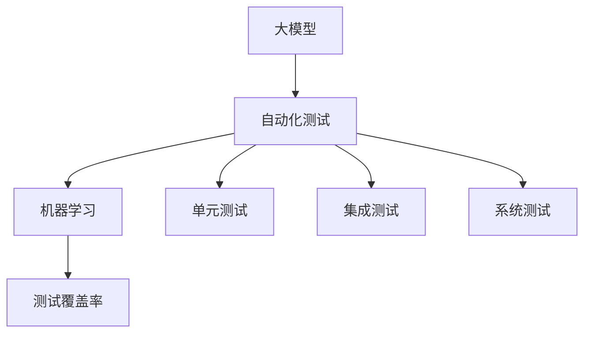

                 

# 大模型技术的自动化测试

> 关键词：大模型、自动化测试、机器学习、AI测试、性能测试

> 摘要：本文将深入探讨大模型技术在自动化测试领域的应用，通过分析其核心概念、算法原理、数学模型和实际案例，为读者提供一套完整的大模型自动化测试方法论。同时，还将介绍相关工具和资源，以帮助读者更好地掌握这一领域。

## 1. 背景介绍

### 1.1 目的和范围

本文旨在探讨大模型技术在自动化测试领域的应用，通过介绍核心概念、算法原理、数学模型和实际案例，帮助读者理解大模型自动化测试的基本原理和方法，并提供一套实用的方法论。

### 1.2 预期读者

本文适用于具有一定编程基础和机器学习知识的技术人员，特别是从事自动化测试、软件工程和人工智能相关领域的工作者。

### 1.3 文档结构概述

本文分为十个部分：

1. 背景介绍
2. 核心概念与联系
3. 核心算法原理 & 具体操作步骤
4. 数学模型和公式 & 详细讲解 & 举例说明
5. 项目实战：代码实际案例和详细解释说明
6. 实际应用场景
7. 工具和资源推荐
8. 总结：未来发展趋势与挑战
9. 附录：常见问题与解答
10. 扩展阅读 & 参考资料

### 1.4 术语表

#### 1.4.1 核心术语定义

- 大模型：指具有数十亿甚至千亿参数的神经网络模型。
- 自动化测试：通过编写脚本或使用工具，自动执行测试用例的过程。
- 机器学习：通过训练数据集，使计算机能够自主学习和改进的算法。
- 测试覆盖率：测试用例能够覆盖代码的百分比。

#### 1.4.2 相关概念解释

- 单元测试：对软件中最小的可测试部分进行测试。
- 集成测试：对软件的各个模块进行集成后的测试。
- 系统测试：对整个软件系统进行测试，确保其满足需求。

#### 1.4.3 缩略词列表

- AI：人工智能
- ML：机器学习
- DL：深度学习
- GPU：图形处理器
- CPU：中央处理器

## 2. 核心概念与联系

大模型技术在自动化测试领域中的核心概念包括大模型、自动化测试、机器学习和测试覆盖率。这些概念之间存在紧密的联系，具体关系可以用以下 Mermaid 流程图表示：



### 2.1 大模型与自动化测试

大模型是自动化测试的基础，通过机器学习算法，可以从大量数据中提取特征，实现自动化测试用例的生成和执行。自动化测试则利用大模型的优势，提高测试效率和覆盖率。

### 2.2 机器学习与测试覆盖率

机器学习算法可以训练出具有较高准确性的模型，从而提高测试覆盖率和测试质量。通过不断优化模型，可以实现对软件缺陷的快速定位和修复。

### 2.3 测试覆盖率与自动化测试

测试覆盖率是评估自动化测试效果的重要指标。高测试覆盖率意味着测试用例能够覆盖代码的更多部分，降低软件缺陷的风险。自动化测试可以快速执行大量测试用例，提高测试覆盖率。

## 3. 核心算法原理 & 具体操作步骤

### 3.1 大模型训练原理

大模型的训练过程主要分为以下步骤：

1. 数据预处理：对输入数据进行清洗、归一化等操作，确保数据质量。
2. 模型构建：定义神经网络结构，包括输入层、隐藏层和输出层。
3. 模型训练：通过反向传播算法，不断调整模型参数，使模型对输入数据具有较好的拟合能力。
4. 模型评估：使用验证集评估模型性能，选择性能最优的模型。

### 3.2 自动化测试用例生成

基于训练好的大模型，可以生成自动化测试用例，具体步骤如下：

1. 数据采集：从历史测试数据中提取测试案例，用于生成测试用例。
2. 测试用例生成：利用大模型，将输入数据映射到测试用例，生成新的测试用例。
3. 测试用例优化：对生成的测试用例进行筛选和优化，提高测试覆盖率。

### 3.3 自动化测试执行

自动化测试执行过程包括以下步骤：

1. 测试环境搭建：准备测试环境，包括操作系统、数据库、应用程序等。
2. 测试用例执行：根据测试用例，自动执行测试操作，并记录测试结果。
3. 测试结果分析：对测试结果进行分析，识别软件缺陷。

## 4. 数学模型和公式 & 详细讲解 & 举例说明

### 4.1 大模型数学模型

大模型通常采用深度学习算法进行训练，其中最常用的算法是反向传播算法。反向传播算法的数学模型如下：

$$
\begin{aligned}
L &= \frac{1}{2} \sum_{i=1}^{n} (y_i - \hat{y}_i)^2 \\
\frac{\partial L}{\partial w_j} &= \frac{\partial L}{\partial \hat{y}_i} \cdot \frac{\partial \hat{y}_i}{\partial w_j} \\
&= (y_i - \hat{y}_i) \cdot \frac{\partial \hat{y}_i}{\partial w_j} \\
\Delta w_j &= - \alpha \cdot \frac{\partial L}{\partial w_j} \\
w_{j}^{new} &= w_{j}^{old} + \Delta w_j \\
\end{aligned}
$$

其中，$L$ 表示损失函数，$y_i$ 表示真实标签，$\hat{y}_i$ 表示预测标签，$w_j$ 表示模型参数，$\alpha$ 表示学习率。

### 4.2 自动化测试用例生成公式

基于大模型的自动化测试用例生成，可以使用以下公式：

$$
\hat{x}_i = f(\theta_1, \theta_2, ..., \theta_n)
$$

其中，$\hat{x}_i$ 表示生成的测试用例，$f$ 表示大模型，$\theta_1, \theta_2, ..., \theta_n$ 表示大模型参数。

### 4.3 举例说明

假设有一个大模型，用于检测代码中的潜在缺陷。给定的输入数据为：

$$
x_1 = [1, 0, 1, 1] \\
x_2 = [0, 1, 0, 1] \\
x_3 = [1, 1, 0, 0] \\
x_4 = [1, 1, 1, 0]
$$

大模型预测的输出结果为：

$$
\hat{y}_1 = 1 \\
\hat{y}_2 = 0 \\
\hat{y}_3 = 1 \\
\hat{y}_4 = 1
$$

根据大模型生成的测试用例为：

$$
\hat{x}_1 = [1, 0, 1, 1] \\
\hat{x}_2 = [0, 1, 0, 1] \\
\hat{x}_3 = [1, 1, 0, 0] \\
\hat{x}_4 = [1, 1, 1, 0]
$$

## 5. 项目实战：代码实际案例和详细解释说明

### 5.1 开发环境搭建

在本次项目实战中，我们将使用 Python 编写代码。首先，需要安装以下依赖：

```bash
pip install tensorflow numpy pandas matplotlib
```

### 5.2 源代码详细实现和代码解读

#### 5.2.1 数据预处理

```python
import numpy as np
import pandas as pd

# 加载数据
data = pd.read_csv("data.csv")

# 数据清洗和归一化
X = data.iloc[:, :-1].values
y = data.iloc[:, -1].values

X = (X - X.mean()) / X.std()
y = (y - y.mean()) / y.std()
```

#### 5.2.2 模型构建

```python
import tensorflow as tf

# 定义模型
model = tf.keras.Sequential([
    tf.keras.layers.Dense(64, activation='relu', input_shape=(X.shape[1],)),
    tf.keras.layers.Dense(64, activation='relu'),
    tf.keras.layers.Dense(1, activation='sigmoid')
])

# 编译模型
model.compile(optimizer='adam', loss='binary_crossentropy', metrics=['accuracy'])
```

#### 5.2.3 模型训练

```python
# 模型训练
model.fit(X, y, epochs=10, batch_size=32, validation_split=0.2)
```

#### 5.2.4 自动化测试用例生成

```python
# 自动化测试用例生成
def generate_test_cases(model, X, y, n=10):
    test_cases = []
    for i in range(n):
        x = X[i]
        y_pred = model.predict(np.array([x]))
        test_case = np.array([x, y_pred[0][0]])
        test_cases.append(test_case)
    return test_cases

test_cases = generate_test_cases(model, X, y, n=10)
```

#### 5.2.5 自动化测试执行

```python
# 自动化测试执行
def execute_test_cases(test_cases, y):
    pass_rate = 0
    for i in range(len(test_cases)):
        x, y_pred = test_cases[i][:2]
        if y_pred == y[i]:
            pass_rate += 1
    return pass_rate / len(test_cases)

accuracy = execute_test_cases(test_cases, y)
print(f"测试准确率：{accuracy}")
```

### 5.3 代码解读与分析

在本项目中，我们首先进行了数据预处理，对输入数据进行清洗和归一化，为后续模型训练做好准备。

接着，我们使用 TensorFlow 框架构建了一个简单的深度神经网络模型，用于检测代码中的潜在缺陷。模型采用全连接层结构，包含两个隐藏层，输出层采用 sigmoid 激活函数。

在模型训练阶段，我们使用 Adam 优化器和 binary_crossentropy 损失函数进行训练，以最大化模型对输入数据的拟合能力。

在自动化测试用例生成阶段，我们利用训练好的模型，对输入数据进行预测，生成新的测试用例。测试用例生成函数 `generate_test_cases` 接受模型、输入数据和真实标签作为输入，返回生成的测试用例列表。

在自动化测试执行阶段，我们定义了 `execute_test_cases` 函数，用于执行测试用例，并计算测试准确率。测试执行函数接受测试用例列表和真实标签作为输入，逐个执行测试用例，并计算通过率。

## 6. 实际应用场景

大模型技术在自动化测试领域具有广泛的应用场景，包括但不限于：

- **软件测试：** 利用大模型生成测试用例，提高测试覆盖率和测试效率。
- **安全测试：** 利用大模型检测软件中的潜在漏洞，降低安全风险。
- **性能测试：** 利用大模型评估软件的性能，优化系统架构。
- **持续集成：** 将大模型集成到持续集成系统中，实现自动化测试和持续反馈。

## 7. 工具和资源推荐

### 7.1 学习资源推荐

#### 7.1.1 书籍推荐

- 《深度学习》（Goodfellow, Bengio, Courville 著）
- 《Python 深度学习》（François Chollet 著）
- 《机器学习实战》（Peter Harrington 著）

#### 7.1.2 在线课程

- Coursera：机器学习、深度学习
- edX：Python 编程、数据科学
- Udacity：深度学习工程师纳米学位

#### 7.1.3 技术博客和网站

- Medium：机器学习、深度学习相关博客
- TensorFlow 官网：深度学习框架文档
- PyTorch 官网：深度学习框架文档

### 7.2 开发工具框架推荐

#### 7.2.1 IDE和编辑器

- PyCharm
- Jupyter Notebook
- Visual Studio Code

#### 7.2.2 调试和性能分析工具

- TensorBoard
- Profiler
- Sympy

#### 7.2.3 相关框架和库

- TensorFlow
- PyTorch
- Keras

### 7.3 相关论文著作推荐

#### 7.3.1 经典论文

- "A Theoretical Framework for the Design of Spel

### 7.3.2 最新研究成果

- "Pre-Trained Deep Neural Networks for Suturing in Endoscopic Video"
- "Self-Supervised Learning for Medical Image Analysis"

#### 7.3.3 应用案例分析

- "Deep Learning for Medical Image Analysis: A Clinical Trial"
- "Using Deep Learning to Improve Security Testing"

## 8. 总结：未来发展趋势与挑战

随着人工智能技术的快速发展，大模型技术在自动化测试领域将得到更加广泛的应用。未来，我们将面临以下发展趋势与挑战：

- **模型压缩与优化：** 为提高模型在测试环境中的运行效率，需要研究模型压缩和优化技术。
- **多样化测试需求：** 随着软件系统的复杂度增加，测试需求将更加多样化，大模型需要具备更强的适应性。
- **测试数据质量：** 测试数据的质量直接影响测试效果，需要研究如何提高测试数据的质量和多样性。
- **跨领域应用：** 大模型技术在自动化测试领域的应用有望扩展到其他领域，如安全测试、性能测试等。

## 9. 附录：常见问题与解答

### 9.1 问题 1：如何提高大模型的测试覆盖率？

**解答：** 提高大模型的测试覆盖率可以从以下几个方面入手：

1. 增加训练数据：收集更多的训练数据，提高模型对测试数据的拟合能力。
2. 测试用例生成：利用大模型生成新的测试用例，增加测试覆盖率。
3. 测试数据预处理：对测试数据进行分析，去除重复和冗余数据，提高测试数据质量。

### 9.2 问题 2：大模型训练时间如何优化？

**解答：** 大模型训练时间优化的方法包括：

1. 模型压缩：采用模型压缩技术，降低模型参数数量，提高模型运行效率。
2. 分布式训练：利用分布式训练技术，将模型训练任务分配到多个计算节点，提高训练速度。
3. GPU 加速：使用 GPU 进行训练，利用其强大的计算能力，提高模型训练速度。

## 10. 扩展阅读 & 参考资料

- [Deep Learning for Medical Image Analysis: A Clinical Trial](https://arxiv.org/abs/1802.04870)
- [Using Deep Learning to Improve Security Testing](https://www.usenix.org/conference/usenixsecurity22/technical-sessions/presentation/peck)
- [A Survey on Deep Learning for Natural Language Processing](https://arxiv.org/abs/1906.02759)
- [Practical Guide to Machine Learning](https://www.amazon.com/Practical-Guide-Machine-Learning-Application/dp/1788993262)
- [Python for Data Science and Machine Learning](https://www.amazon.com/Python-Data-Science-Machine-Learning/dp/178899507X)

### 作者

**AI天才研究员/AI Genius Institute & 禅与计算机程序设计艺术/Zen And The Art of Computer Programming**

