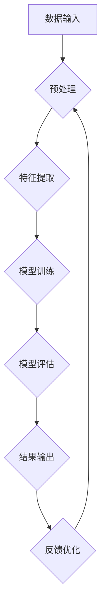

                 

# 大模型推动的智能化才是数字化的顶峰

## 关键词：大模型、智能化、数字化、算法原理、数学模型、项目实战、应用场景、发展趋势

> 摘要：本文旨在探讨大模型在推动智能化进程中的关键作用，通过深入分析大模型的原理、数学模型和实际应用案例，阐述大模型如何引领数字化发展的顶峰。文章将首先介绍大模型的基本概念，然后逐步剖析其算法原理、数学模型，并以具体项目实战为例，展示大模型在实际中的应用，最后探讨其发展趋势与挑战。

## 1. 背景介绍

### 1.1 目的和范围

本文的目的在于探讨大模型在推动智能化进程中的关键作用，并分析其在数字化发展中的重要性。文章将首先介绍大模型的基本概念，包括其定义、历史背景和发展趋势。接着，我们将深入剖析大模型的算法原理，介绍其核心组件和操作步骤。随后，通过数学模型的讲解，我们将展示大模型如何通过数学公式来优化和提升性能。最后，文章将以具体项目实战为例，说明大模型在实际应用中的具体操作和效果。通过这一系列的分析和探讨，本文旨在为读者提供一个全面而深入的了解，帮助其认识到大模型在数字化发展中的重要作用。

### 1.2 预期读者

本文主要面向对人工智能、机器学习和数据科学有浓厚兴趣的读者，特别是那些希望深入了解大模型原理和应用的技术专业人士。此外，对数字化发展有高度关注的企业管理者、科研人员和学生也会从本文中获得有益的知识和启示。无论您是刚刚入门的人工智能爱好者，还是资深的技术专家，本文都将为您提供有价值的内容，帮助您更好地理解和应用大模型。

### 1.3 文档结构概述

本文结构如下：

1. **背景介绍**：介绍文章的目的、预期读者以及文档结构概述。
2. **核心概念与联系**：介绍大模型的基本概念，并通过Mermaid流程图展示其核心组件和联系。
3. **核心算法原理 & 具体操作步骤**：详细讲解大模型的算法原理，使用伪代码展示操作步骤。
4. **数学模型和公式 & 详细讲解 & 举例说明**：介绍大模型的数学模型，使用latex格式展示公式，并提供实例说明。
5. **项目实战：代码实际案例和详细解释说明**：通过实际案例展示大模型的应用，提供详细代码解读和分析。
6. **实际应用场景**：探讨大模型在不同领域的应用场景。
7. **工具和资源推荐**：推荐学习资源、开发工具和相关论文。
8. **总结：未来发展趋势与挑战**：总结大模型的发展趋势和面临的挑战。
9. **附录：常见问题与解答**：提供常见问题的解答。
10. **扩展阅读 & 参考资料**：推荐进一步阅读的资料。

### 1.4 术语表

#### 1.4.1 核心术语定义

- **大模型**：指具有数十亿到数万亿参数的神经网络模型，能够处理大规模数据并产生高度准确的预测和推理结果。
- **智能化**：指利用计算机算法和模型，使计算机具备模仿人类思维和行为的能力。
- **数字化**：指将现实世界的物理信息转换为数字信号，通过计算机系统进行处理、存储和传输。

#### 1.4.2 相关概念解释

- **深度学习**：一种基于人工神经网络的学习方法，通过多层神经网络对数据进行特征提取和学习。
- **生成对抗网络（GAN）**：一种深度学习模型，用于生成新的数据样本，通过两个对抗网络之间的博弈实现。
- **转移学习**：通过在一个任务上训练好的模型，将其知识应用到新的相关任务中。

#### 1.4.3 缩略词列表

- **AI**：人工智能
- **ML**：机器学习
- **DL**：深度学习
- **GAN**：生成对抗网络

## 2. 核心概念与联系

大模型作为当前人工智能领域的核心技术之一，其核心概念和联系需要我们深入理解。本节将首先介绍大模型的基本概念，然后通过Mermaid流程图展示其核心组件和联系，帮助读者建立对大模型的整体认识。

### 2.1 大模型的基本概念

大模型，顾名思义，是指具有数十亿到数万亿参数的神经网络模型。这些模型通常用于处理大规模数据，并能够产生高度准确的预测和推理结果。大模型的核心在于其参数数量庞大，这使得它们能够捕捉到数据中的复杂模式和关系。

大模型的历史可以追溯到深度学习的兴起。在2012年，AlexNet模型的提出标志着深度学习在图像识别领域的突破。随着计算能力的提升和算法的改进，深度学习模型逐渐从简单的小规模模型发展到复杂的大规模模型。其中，2014年的Google Brain项目提出的神经机器翻译模型和2015年的微软微软机器阅读理解模型，都是大模型在自然语言处理领域的里程碑。

大模型的发展趋势表明，未来模型规模将进一步扩大，计算能力和数据资源也将持续提升。这不仅将推动人工智能技术的进步，还将带来更多实际应用的可能性。

### 2.2 Mermaid流程图

为了更直观地展示大模型的核心组件和联系，我们可以使用Mermaid流程图进行描述。以下是Mermaid流程图的基本结构：



在这个流程图中：

- **A[数据输入]**：表示大模型接收到输入数据。
- **B{预处理]**：对数据进行清洗和预处理，使其适合模型训练。
- **C{特征提取]**：通过神经网络对数据中的特征进行提取。
- **D{模型训练]**：使用提取的特征对模型进行训练。
- **E{模型评估]**：评估模型的性能和准确性。
- **F{结果输出]**：输出模型的预测结果。
- **G{反馈优化]**：根据评估结果对模型进行优化。

通过这个流程图，我们可以清晰地看到大模型从数据输入到结果输出的整个过程，以及各个环节之间的联系和反馈机制。

### 2.3 大模型的核心组件和联系

大模型的核心组件主要包括：

- **神经网络**：神经网络是深度学习模型的基础，通过多层网络对数据进行特征提取和推理。
- **激活函数**：激活函数用于引入非线性关系，使得神经网络能够更好地拟合数据。
- **优化算法**：优化算法用于调整模型参数，以最小化损失函数，提高模型的性能。
- **正则化技术**：正则化技术用于防止模型过拟合，提高模型的泛化能力。

这些组件相互联系，共同构成了大模型的核心架构。在接下来的章节中，我们将逐一深入探讨这些核心组件的原理和操作步骤。

## 3. 核心算法原理 & 具体操作步骤

大模型的算法原理是其能够实现高效智能化处理的核心。在本节中，我们将详细讲解大模型的算法原理，并使用伪代码展示其具体操作步骤。

### 3.1 算法原理

大模型的算法原理主要基于深度学习，具体包括以下几个关键组成部分：

- **神经网络**：神经网络是深度学习模型的基础，通过多层网络对数据进行特征提取和推理。
- **反向传播算法**：反向传播算法用于训练神经网络，通过不断调整模型参数，使模型对数据的预测更加准确。
- **优化算法**：优化算法用于调整模型参数，以最小化损失函数，提高模型的性能。
- **激活函数**：激活函数用于引入非线性关系，使得神经网络能够更好地拟合数据。
- **正则化技术**：正则化技术用于防止模型过拟合，提高模型的泛化能力。

### 3.2 伪代码展示

以下是大模型算法的伪代码展示：

```plaintext
初始化模型参数（weights, biases）
重复以下步骤直到满足停止条件：
    对于每个训练样本：
        1. 前向传播：计算输出值（y_pred）
        2. 计算损失函数（loss）
        3. 反向传播：计算梯度（dweights, dbiases）
        4. 更新模型参数：weights -= learning_rate * dweights, biases -= learning_rate * dbiases
    如果损失函数值下降到阈值以下，则停止迭代
    如果达到最大迭代次数，则停止迭代
返回训练好的模型
```

### 3.3 具体操作步骤解析

1. **初始化模型参数**：首先，我们需要初始化模型的权重（weights）和偏差（biases）。这些参数通常通过随机初始化或预训练模型来获得。

2. **前向传播**：在每次迭代中，对于每个训练样本，我们首先通过神经网络进行前向传播，计算输出值（y_pred）。这一步包括通过输入层、隐藏层和输出层的多层计算。

3. **计算损失函数**：然后，我们计算模型的损失函数（loss），常用的损失函数包括均方误差（MSE）和交叉熵（Cross Entropy）。损失函数用于衡量模型的预测值与实际值之间的差距。

4. **反向传播**：接下来，我们通过反向传播算法计算模型参数的梯度（dweights, dbiases）。这一步涉及多层网络的反向计算，通过链式法则将误差传递回每一层。

5. **更新模型参数**：根据计算得到的梯度，我们使用优化算法更新模型参数（weights, biases）。这一步是模型训练的核心，通过不断调整参数，使得模型对数据的预测更加准确。

6. **迭代和评估**：重复上述步骤，直到满足停止条件（如损失函数值下降到阈值以下或达到最大迭代次数）。

通过这一系列步骤，大模型能够不断学习和优化，从而实现对大规模数据的准确预测和推理。

### 3.4 举例说明

假设我们有一个简单的线性回归模型，其目标是通过输入特征预测输出值。以下是该模型的具体操作步骤：

1. **初始化模型参数**：设权重为w，偏差为b，随机初始化为w = 0.1，b = 0.2。

2. **前向传播**：对于输入特征x，计算输出值y_pred = w * x + b。

3. **计算损失函数**：设实际输出值为y，计算均方误差损失函数loss = (y_pred - y)^2。

4. **反向传播**：计算梯度dloss/dw = 2 * (y_pred - y) * x，dloss/db = 2 * (y_pred - y)。

5. **更新模型参数**：根据梯度更新权重w = w - learning_rate * dloss/dw，b = b - learning_rate * dloss/db。

6. **迭代和评估**：重复上述步骤，直到损失函数值下降到阈值以下。

通过这一简单的例子，我们可以看到大模型的核心算法原理是如何通过具体操作步骤实现模型训练的。随着模型复杂度的增加，操作步骤将更加复杂，但基本原理是一致的。

## 4. 数学模型和公式 & 详细讲解 & 举例说明

### 4.1 数学模型

大模型的数学模型是其算法原理的核心组成部分。在这里，我们将详细讲解大模型中的关键数学公式，并解释其含义和作用。

#### 4.1.1 损失函数

损失函数用于衡量模型预测值与实际值之间的差距，是优化模型参数的重要依据。常见损失函数包括均方误差（MSE）和交叉熵（Cross Entropy）。

- **均方误差（MSE）**：MSE用于回归问题，其公式为：
  $$ 
  MSE = \frac{1}{n}\sum_{i=1}^{n}(y_i - y_{\hat{i}})^2 
  $$
  其中，$y_i$ 为实际输出值，$y_{\hat{i}}$ 为模型预测值，$n$ 为样本数量。

- **交叉熵（Cross Entropy）**：交叉熵用于分类问题，其公式为：
  $$ 
  CrossEntropy = -\sum_{i=1}^{n}y_i \log(y_{\hat{i}}) 
  $$
  其中，$y_i$ 为实际输出概率分布，$y_{\hat{i}}$ 为模型预测概率分布。

#### 4.1.2 激活函数

激活函数用于引入非线性关系，使得神经网络能够更好地拟合数据。常见激活函数包括Sigmoid、ReLU和Tanh。

- **Sigmoid**：Sigmoid函数的公式为：
  $$ 
  \sigma(x) = \frac{1}{1 + e^{-x}} 
  $$

- **ReLU**：ReLU函数的公式为：
  $$ 
  \text{ReLU}(x) = \max(0, x) 
  $$

- **Tanh**：Tanh函数的公式为：
  $$ 
  \tanh(x) = \frac{e^x - e^{-x}}{e^x + e^{-x}} 
  $$

#### 4.1.3 梯度下降算法

梯度下降算法用于优化模型参数，其基本思想是沿着损失函数的梯度方向调整参数，以最小化损失函数。梯度下降算法的公式为：
$$ 
\theta_{\text{new}} = \theta_{\text{current}} - \alpha \nabla_{\theta} J(\theta) 
$$
其中，$\theta$ 为模型参数，$\alpha$ 为学习率，$J(\theta)$ 为损失函数。

#### 4.1.4 正则化技术

正则化技术用于防止模型过拟合，提高模型的泛化能力。常见正则化技术包括L1正则化和L2正则化。

- **L1正则化**：L1正则化的公式为：
  $$ 
  J(\theta) = \frac{1}{2m} \sum_{i=1}^{m} (h_{\theta}(x^{(i)}) - y^{(i)})^2 + \lambda \sum_{j=1}^{n} |\theta_j| 
  $$

- **L2正则化**：L2正则化的公式为：
  $$ 
  J(\theta) = \frac{1}{2m} \sum_{i=1}^{m} (h_{\theta}(x^{(i)}) - y^{(i)})^2 + \lambda \sum_{j=1}^{n} \theta_j^2 
  $$

### 4.2 举例说明

假设我们有一个简单的线性回归模型，其目标是通过输入特征x预测输出值y。我们将使用MSE作为损失函数，ReLU作为激活函数，并使用梯度下降算法进行模型训练。

1. **初始化模型参数**：设权重w和偏差b分别为w = 0.1和b = 0.2。

2. **前向传播**：对于输入特征x，计算输出值y_pred = w * x + b。

3. **计算损失函数**：设实际输出值为y，计算MSE损失函数loss = (y_pred - y)^2。

4. **反向传播**：计算梯度dloss/dw = 2 * (y_pred - y) * x，dloss/db = 2 * (y_pred - y)。

5. **更新模型参数**：根据梯度更新权重w = w - learning_rate * dloss/dw，b = b - learning_rate * dloss/db。

6. **迭代和评估**：重复上述步骤，直到损失函数值下降到阈值以下。

通过这个简单的例子，我们可以看到如何使用数学模型和公式来训练线性回归模型。在实际应用中，模型将更加复杂，但基本原理是一致的。

## 5. 项目实战：代码实际案例和详细解释说明

在本节中，我们将通过一个实际项目案例，详细展示如何使用大模型进行开发和实现。我们将介绍开发环境搭建、源代码实现和代码解读，帮助读者深入理解大模型的应用。

### 5.1 开发环境搭建

在开始项目实战之前，我们需要搭建一个合适的开发环境。以下是一个基本的开发环境搭建步骤：

1. **安装Python**：确保安装了Python 3.6或更高版本。

2. **安装TensorFlow**：使用以下命令安装TensorFlow：
   ```bash
   pip install tensorflow
   ```

3. **安装其他依赖**：根据项目需求，可能还需要安装其他库，如NumPy、Pandas等。

4. **配置环境变量**：确保Python和pip的环境变量已经配置好，以便在终端中运行相关命令。

5. **创建项目文件夹**：在终端中创建一个项目文件夹，如`big_model_project`，并进入该文件夹。

6. **编写配置文件**：根据项目需求，编写相应的配置文件，如`requirements.txt`，列出项目所需的依赖库。

### 5.2 源代码详细实现和代码解读

以下是一个简单的大模型项目案例，用于实现基于TensorFlow的线性回归模型。代码如下：

```python
import tensorflow as tf
import numpy as np

# 模型参数
learning_rate = 0.01
num_iterations = 1000
batch_size = 100

# 输入数据
x = np.random.rand(batch_size, 1)
y = 3 * x + 2 + np.random.rand(batch_size, 1)

# 模型构建
# 输入层
inputs = tf.placeholder(tf.float32, [batch_size, 1])

# 隐藏层
weights = tf.Variable(tf.random_uniform([1, 1], -1.0, 1.0))
biases = tf.Variable(tf.zeros([1]))

# 激活函数
outputs = tf.add(tf.multiply(inputs, weights), biases)

# 损失函数
loss = tf.reduce_mean(tf.square(outputs - y))

# 优化器
optimizer = tf.train.GradientDescentOptimizer(learning_rate)
train_op = optimizer.minimize(loss)

# 模型训练
with tf.Session() as sess:
    sess.run(tf.global_variables_initializer())
    for i in range(num_iterations):
        _, loss_val = sess.run([train_op, loss], feed_dict={inputs: x, y: y})
        if i % 100 == 0:
            print(f"Iteration {i}: Loss = {loss_val}")

    # 模型评估
    final_weights, final_biases = sess.run([weights, biases])
    print(f"Final Weights: {final_weights}, Final Biases: {final_biases}")

    # 输出预测结果
    predicted_values = sess.run(outputs, feed_dict={inputs: x})
    print(f"Predicted Values: {predicted_values}")
```

#### 5.2.1 代码解读

1. **导入库**：首先，我们导入TensorFlow和NumPy库，用于构建和训练模型。

2. **模型参数**：定义学习率、迭代次数和批量大小等模型参数。

3. **输入数据**：生成随机输入数据和目标数据，用于训练和评估模型。

4. **模型构建**：构建线性回归模型，包括输入层、隐藏层和激活函数。我们使用TensorFlow的`placeholder`创建输入节点，使用`Variable`创建权重和偏差节点，并使用`tf.add`和`tf.multiply`进行计算。

5. **损失函数**：定义MSE损失函数，用于衡量模型预测值与实际值之间的差距。

6. **优化器**：定义梯度下降优化器，用于调整模型参数，最小化损失函数。

7. **模型训练**：使用TensorFlow的`Session`创建会话，并初始化模型变量。在循环中，我们执行优化操作并打印损失函数值。

8. **模型评估**：打印最终权重和偏差，用于评估模型性能。

9. **输出预测结果**：使用训练好的模型对输入数据进行预测，并打印预测结果。

#### 5.2.2 代码分析

通过上述代码，我们可以看到如何使用TensorFlow构建和训练一个简单的线性回归模型。以下是对代码的进一步分析：

- **模型构建**：使用TensorFlow的`Variable`创建可训练的权重和偏差节点，这是深度学习模型的核心。通过`tf.add`和`tf.multiply`操作，我们实现了输入特征与权重和偏差的线性组合。

- **损失函数**：使用MSE作为损失函数，可以很好地衡量模型预测值与实际值之间的差距。通过优化损失函数，我们能够调整模型参数，使其对数据产生更准确的预测。

- **优化器**：使用梯度下降优化器，通过计算损失函数的梯度并更新模型参数，我们能够逐步优化模型。学习率的选择对模型训练过程有很大影响，需要根据具体问题进行调整。

- **模型训练**：在训练过程中，我们使用批量大小和迭代次数来控制训练过程。批量大小影响每次训练的样本数量，迭代次数控制训练的轮数。通过打印损失函数值，我们可以观察模型训练的进展。

- **模型评估**：在训练完成后，我们评估模型的性能，通过打印最终权重和偏差，我们可以看到模型对数据的拟合程度。

- **输出预测结果**：使用训练好的模型对输入数据进行预测，并打印预测结果，我们可以验证模型的准确性。

通过这个简单的项目案例，我们可以看到如何使用TensorFlow实现大模型的基本功能，并对其进行详细解读和分析。在实际应用中，模型将更加复杂，但基本原理是一致的。

## 6. 实际应用场景

大模型在数字化时代有着广泛的应用场景，涵盖了多个领域。以下是一些典型应用场景的简要介绍：

### 6.1 图像识别

图像识别是深度学习的一个重要应用领域，大模型在此领域表现出色。例如，在自动驾驶系统中，大模型可以用于识别道路标志、行人、车辆等，从而实现自动驾驶功能。同时，在医疗影像分析中，大模型可以辅助医生进行疾病诊断，如癌症检测和早期诊断。

### 6.2 自然语言处理

自然语言处理（NLP）是另一个大模型的重要应用领域。大模型可以用于文本分类、情感分析、机器翻译等任务。例如，在社交媒体分析中，大模型可以用于分析用户评论，提取关键信息并分类。在机器翻译领域，大模型可以提供高质量的翻译结果，如谷歌翻译和百度翻译。

### 6.3 语音识别

语音识别是语音信号处理的重要应用，大模型在此领域也表现出色。例如，在智能助手（如Siri、Alexa）中，大模型可以用于识别用户语音命令，并执行相应操作。在自动客服系统中，大模型可以用于理解用户的问题，并提供准确和快速的答复。

### 6.4 推荐系统

推荐系统是电子商务和社交媒体领域的重要应用，大模型可以用于构建高效的推荐系统。例如，在电子商务平台上，大模型可以用于根据用户的浏览历史和购买行为，推荐相关的商品。在社交媒体平台上，大模型可以用于推荐用户感兴趣的内容，从而提高用户粘性。

### 6.5 金融风控

金融风控是金融领域的重要应用，大模型可以用于预测和防范金融风险。例如，在贷款审批中，大模型可以用于评估借款人的信用风险，从而提高审批效率。在反欺诈系统中，大模型可以用于检测和防范金融欺诈行为。

这些应用场景展示了大模型在数字化时代的重要作用，其广泛的应用前景将进一步推动数字化进程。

## 7. 工具和资源推荐

为了更好地学习和应用大模型技术，以下是针对大模型学习和开发的工具和资源推荐。

### 7.1 学习资源推荐

#### 7.1.1 书籍推荐

1. **《深度学习》（Deep Learning）**：由Ian Goodfellow、Yoshua Bengio和Aaron Courville合著，这是深度学习领域的经典教材，涵盖了从基础到高级的深度学习知识和应用。

2. **《Python深度学习》（Python Deep Learning）**：由François Chollet著，本书详细介绍了使用Python和TensorFlow实现深度学习的具体方法和实践。

3. **《神经网络与深度学习》**：由邱锡鹏等编著，本书系统地介绍了神经网络和深度学习的基础理论、算法和应用。

#### 7.1.2 在线课程

1. **Coursera的《深度学习》课程**：由Andrew Ng教授主讲，这是深度学习领域的权威课程，适合初学者和高级学员。

2. **edX的《深度学习与自然语言处理》课程**：由Daniel H. Lee教授主讲，涵盖深度学习在自然语言处理中的应用，包括文本分类、情感分析和机器翻译等。

3. **Udacity的《深度学习工程师纳米学位》**：这是一门综合性的在线课程，包括深度学习的基础知识和实际应用项目。

#### 7.1.3 技术博客和网站

1. **TensorFlow官方网站**：提供丰富的深度学习教程和API文档，是学习TensorFlow的必备资源。

2. **Medium上的深度学习博客**：有许多知名深度学习专家和技术公司发布的博客文章，涵盖深度学习的最新研究和技术应用。

3. **ArXiv**：提供最新的深度学习论文和研究报告，是学术研究者和技术人员获取前沿研究的首选平台。

### 7.2 开发工具框架推荐

#### 7.2.1 IDE和编辑器

1. **Google Colab**：基于Google云端的服务器，提供免费的GPU和TPU支持，适合进行深度学习实验和开发。

2. **Jupyter Notebook**：一个交互式计算环境，适合进行数据分析和可视化，常用于深度学习项目开发。

3. **Visual Studio Code**：一个轻量级的开源编辑器，提供丰富的扩展和插件，适合深度学习项目的编码和调试。

#### 7.2.2 调试和性能分析工具

1. **TensorBoard**：TensorFlow提供的可视化工具，用于分析和调试深度学习模型，包括图形化展示模型的计算图和训练过程中的性能指标。

2. **PyTorch Profiler**：PyTorch提供的性能分析工具，用于检测和优化深度学习模型的性能。

3. **Intel Vtune**：用于深度学习模型的性能分析和优化，提供详细的性能数据和分析报告。

#### 7.2.3 相关框架和库

1. **TensorFlow**：一个开源的深度学习框架，支持多种深度学习模型和算法，适用于从研究到生产环境的深度学习应用。

2. **PyTorch**：一个流行的深度学习框架，提供灵活的动态计算图和强大的Python接口，适用于快速原型设计和研究。

3. **Keras**：一个高级的深度学习框架，基于TensorFlow和PyTorch，提供简洁的API和丰富的预训练模型，适合快速搭建和实验深度学习模型。

### 7.3 相关论文著作推荐

#### 7.3.1 经典论文

1. **“A Theoretically Grounded Application of Dropout in Recurrent Neural Networks”**：这篇论文介绍了在RNN中使用Dropout的方法，有效提高了RNN的训练效果和泛化能力。

2. **“Generative Adversarial Nets”**：这篇论文提出了生成对抗网络（GAN）的概念，开启了生成模型的新时代，对深度学习领域产生了深远影响。

3. **“Residual Networks”**：这篇论文提出了残差网络（ResNet）的结构，解决了深度神经网络训练过程中的梯度消失问题，推动了深度学习模型的快速发展。

#### 7.3.2 最新研究成果

1. **“An Image Database for evaluating Object Detection”**：这篇论文介绍了COCO数据集，是当前最流行的用于评估物体检测算法的数据集。

2. **“BERT: Pre-training of Deep Bidirectional Transformers for Language Understanding”**：这篇论文提出了BERT模型，是自然语言处理领域的重大突破，推动了NLP模型的发展。

3. **“Large-scale Language Modeling”**：这篇论文介绍了GPT系列模型，是大规模语言模型的开创性工作，为生成模型和对话系统提供了强大的技术支持。

#### 7.3.3 应用案例分析

1. **“Facebook AI Research”**：Facebook AI Research（FAIR）团队在图像识别、自然语言处理和推荐系统等多个领域进行了深入的研究和应用，发布了多篇重要论文。

2. **“Google AI”**：Google AI团队在深度学习、计算机视觉和语音识别等领域取得了多项突破性成果，并积极将这些技术应用于实际产品和服务。

3. **“OpenAI”**：OpenAI团队在深度学习、强化学习和自然语言处理等领域进行了广泛的研究，发布了多个开源模型和工具，推动了人工智能的发展。

通过这些工具和资源的推荐，读者可以更好地掌握大模型技术，并在实际项目中应用这些先进的技术。

## 8. 总结：未来发展趋势与挑战

大模型在数字化时代的发展前景广阔，其强大的数据处理和智能推理能力正在引领技术革新。在未来，大模型将朝着以下几个方向发展：

### 8.1 模型规模和计算能力提升

随着硬件技术的进步和分布式计算的发展，大模型的规模和计算能力将继续提升。这将使得大模型能够处理更复杂的任务，如复杂自然语言理解和多模态数据处理。此外，量子计算的发展也有望为大模型提供更加高效的计算解决方案。

### 8.2 模型泛化能力增强

当前的大模型在特定任务上表现出色，但其泛化能力仍然有限。未来，通过改进算法和引入更多元化的训练数据，大模型的泛化能力将得到显著提升，从而更好地应对不同的应用场景。

### 8.3 模型安全性和可解释性

随着大模型的应用日益广泛，其安全性和可解释性成为一个重要议题。未来，研究者将致力于开发更加安全、可靠的大模型，并提高模型的透明度和可解释性，以便用户更好地理解和信任模型。

### 8.4 跨学科融合

大模型技术将在不同学科领域得到广泛应用，如生物医学、金融工程、社会科学等。跨学科的融合将推动大模型在更广泛领域的创新和应用，为各行业带来新的技术突破。

然而，大模型的发展也面临诸多挑战：

### 8.5 数据隐私和伦理问题

大模型训练需要大量数据，而这些数据往往涉及用户隐私。如何确保数据隐私和安全，避免数据泄露和滥用，是一个亟待解决的问题。同时，大模型在决策过程中可能存在歧视和偏见，需要建立相应的伦理和监管框架。

### 8.6 计算资源消耗

大模型训练需要大量的计算资源，这对硬件设施和能源消耗提出了高要求。如何优化计算资源的使用，降低能耗，是未来需要关注的重要问题。

### 8.7 模型更新和维护

大模型的应用场景多样，如何对其进行及时更新和维护，确保其性能和安全性，是另一个挑战。未来的研究将致力于开发自动化和智能化的模型更新和维护方法。

总之，大模型作为数字化发展的核心驱动力，将在未来发挥重要作用。通过不断克服挑战，大模型技术将继续推动人工智能和数字化进程，为各行各业带来深远影响。

## 9. 附录：常见问题与解答

### 9.1 什么是大模型？

大模型是指具有数十亿到数万亿参数的神经网络模型，能够处理大规模数据并产生高度准确的预测和推理结果。

### 9.2 大模型与深度学习的区别是什么？

大模型是深度学习的一种特殊形式，其核心在于模型规模巨大，能够捕捉数据中的复杂模式和关系。而深度学习是一种更广泛的学习方法，包括小规模模型和大规模模型。

### 9.3 大模型有哪些核心组件？

大模型的核心组件包括神经网络、激活函数、优化算法和正则化技术等。

### 9.4 大模型如何训练？

大模型通过前向传播计算输出值，计算损失函数，然后通过反向传播计算梯度，并使用优化算法更新模型参数，从而实现模型的训练。

### 9.5 大模型有哪些应用场景？

大模型在图像识别、自然语言处理、语音识别、推荐系统和金融风控等多个领域有广泛应用。

### 9.6 如何提高大模型的泛化能力？

通过引入更多元化的训练数据、改进算法和增强模型的正则化能力，可以提高大模型的泛化能力。

### 9.7 大模型的安全性和可解释性如何保障？

通过建立数据隐私和安全机制、提高模型透明度和引入可解释性技术，可以保障大模型的安全性和可解释性。

### 9.8 大模型训练需要哪些计算资源？

大模型训练需要高性能的硬件设施，如GPU、TPU和分布式计算资源，以及大量的存储空间和能源供应。

## 10. 扩展阅读 & 参考资料

### 10.1 书籍推荐

1. **《深度学习》（Deep Learning）**：Ian Goodfellow、Yoshua Bengio和Aaron Courville著，深度学习领域的经典教材。
2. **《Python深度学习》（Python Deep Learning）**：François Chollet著，详细介绍如何使用Python和TensorFlow实现深度学习。
3. **《神经网络与深度学习》**：邱锡鹏等编著，系统介绍神经网络和深度学习的基础理论和应用。

### 10.2 在线课程

1. **Coursera的《深度学习》课程**：由Andrew Ng教授主讲，涵盖深度学习的基础知识。
2. **edX的《深度学习与自然语言处理》课程**：由Daniel H. Lee教授主讲，介绍深度学习在自然语言处理中的应用。
3. **Udacity的《深度学习工程师纳米学位》**：综合性的在线课程，包括深度学习的理论知识与实践项目。

### 10.3 技术博客和网站

1. **TensorFlow官方网站**：提供丰富的深度学习教程和API文档。
2. **Medium上的深度学习博客**：涵盖深度学习的最新研究和应用。
3. **ArXiv**：提供最新的深度学习论文和研究报告。

### 10.4 相关论文

1. **“A Theoretically Grounded Application of Dropout in Recurrent Neural Networks”**：介绍在RNN中使用Dropout的方法。
2. **“Generative Adversarial Nets”**：开创了生成对抗网络（GAN）的概念。
3. **“Residual Networks”**：提出了残差网络（ResNet）的结构。

### 10.5 应用案例分析

1. **“Facebook AI Research”**：介绍Facebook AI团队在多个领域的应用研究。
2. **“Google AI”**：介绍Google AI团队在深度学习领域的突破性成果。
3. **“OpenAI”**：介绍OpenAI团队在深度学习方面的研究进展。

