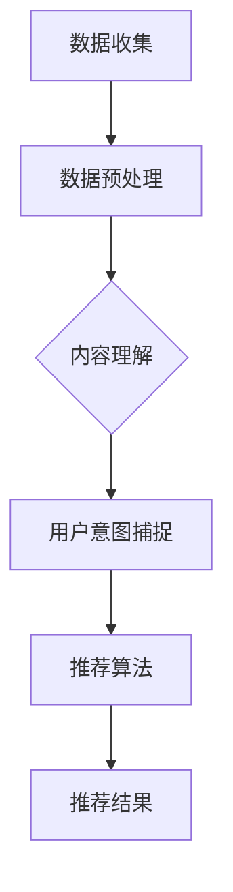

                 

# 大模型推荐：从内容理解到用户意图捕捉

> **关键词：** 大模型、推荐系统、内容理解、用户意图捕捉、机器学习、深度学习、神经网络、数据处理、算法优化

> **摘要：** 本文将探讨大模型在推荐系统中的应用，从内容理解到用户意图捕捉的整个过程。我们将分析推荐系统的核心概念、大模型的算法原理、数学模型及其具体实现，并通过实际案例展示如何构建高效的大模型推荐系统。此外，我们还将探讨推荐系统的实际应用场景、相关工具和资源，并总结未来发展趋势与挑战。

## 1. 背景介绍

### 1.1 目的和范围

本文旨在深入探讨大模型在推荐系统中的应用，通过分析内容理解、用户意图捕捉等关键环节，揭示大模型推荐系统的运作原理和实现方法。文章将涵盖以下内容：

1. 推荐系统的基本概念和原理。
2. 大模型在推荐系统中的关键作用。
3. 大模型的算法原理和数学模型。
4. 大模型推荐系统的实际应用场景。
5. 相关工具和资源的推荐。
6. 未来发展趋势与挑战。

### 1.2 预期读者

本文适合对推荐系统和机器学习有一定了解的读者，包括但不限于：

1. 推荐系统开发人员。
2. 机器学习和深度学习研究者。
3. 数据科学家和AI工程师。
4. 对推荐系统感兴趣的学者和学生。

### 1.3 文档结构概述

本文分为十个部分，结构如下：

1. 引言：介绍文章的主题和目的。
2. 背景介绍：阐述推荐系统的基本概念和本文的研究范围。
3. 核心概念与联系：介绍大模型推荐系统的核心概念和原理。
4. 核心算法原理 & 具体操作步骤：讲解大模型的算法原理和具体实现。
5. 数学模型和公式 & 详细讲解 & 举例说明：介绍大模型的数学模型和公式。
6. 项目实战：展示大模型推荐系统的实际案例和代码实现。
7. 实际应用场景：分析大模型推荐系统的应用场景。
8. 工具和资源推荐：推荐学习资源、开发工具和相关论文。
9. 总结：总结大模型推荐系统的未来发展趋势与挑战。
10. 附录：常见问题与解答。

### 1.4 术语表

#### 1.4.1 核心术语定义

- **推荐系统**：一种自动化的信息过滤系统，根据用户的兴趣和行为，向其推荐可能感兴趣的信息或物品。
- **大模型**：一种具有巨大参数量和复杂结构的神经网络模型，能够处理海量数据并学习复杂模式。
- **内容理解**：对用户和物品的内容进行理解和分析，提取关键特征，以便进行推荐。
- **用户意图捕捉**：通过分析用户的查询和行为，理解其背后的意图，从而提高推荐的准确性。
- **机器学习**：一种基于数据的学习方法，使计算机系统能够从数据中学习并做出决策。
- **深度学习**：一种基于神经网络的机器学习方法，通过多层网络结构进行特征提取和学习。

#### 1.4.2 相关概念解释

- **神经网络**：一种模拟人脑神经元连接的计算机模型，能够进行复杂的非线性处理。
- **特征工程**：在机器学习过程中，通过对原始数据进行预处理、转换和特征提取，提高模型的性能。
- **梯度下降**：一种优化算法，通过迭代调整模型参数，使损失函数逐步减小。
- **反向传播**：一种用于计算神经网络梯度的方法，通过反向传播误差信号，更新模型参数。

#### 1.4.3 缩略词列表

- **AI**：人工智能
- **ML**：机器学习
- **DL**：深度学习
- **RS**：推荐系统
- **GPU**：图形处理器

## 2. 核心概念与联系

### 2.1 大模型推荐系统的核心概念

大模型推荐系统主要涉及以下核心概念：

1. **用户**：推荐系统的核心，他们的行为和偏好是推荐系统关注的重点。
2. **物品**：用户可能感兴趣的各种实体，如商品、文章、音乐、电影等。
3. **内容理解**：对用户和物品的内容进行理解和分析，提取关键特征，为推荐提供基础。
4. **用户意图捕捉**：分析用户的查询和行为，理解其背后的意图，从而提高推荐的准确性。
5. **推荐算法**：根据用户特征、物品特征和用户意图，为用户推荐合适的物品。

### 2.2 大模型推荐系统的原理和架构

大模型推荐系统的原理可以概括为以下步骤：

1. **数据收集和预处理**：收集用户行为数据、物品信息等，进行数据清洗和预处理。
2. **内容理解**：对用户和物品的内容进行理解和分析，提取关键特征。
3. **用户意图捕捉**：通过分析用户的查询和行为，理解其背后的意图。
4. **推荐算法**：根据用户特征、物品特征和用户意图，为用户推荐合适的物品。

大模型推荐系统的架构可以简化为以下几个模块：

1. **数据收集模块**：负责收集用户行为数据、物品信息等。
2. **数据处理模块**：对收集到的数据进行清洗、预处理和特征提取。
3. **模型训练模块**：利用处理后的数据训练大模型，包括内容理解模型和用户意图捕捉模型。
4. **推荐引擎模块**：根据大模型输出的推荐结果，为用户推荐合适的物品。

### 2.3 Mermaid 流程图

下面是一个简化的 Mermaid 流程图，展示了大模型推荐系统的基本流程：



## 3. 核心算法原理 & 具体操作步骤

### 3.1 大模型的算法原理

大模型推荐系统主要基于深度学习技术，其核心算法原理包括以下几个部分：

1. **神经网络**：神经网络是一种模拟人脑神经元连接的计算机模型，能够进行复杂的非线性处理。在推荐系统中，神经网络被用于提取用户和物品的特征，以及捕捉用户意图。
   
2. **深度学习**：深度学习是一种基于神经网络的机器学习方法，通过多层网络结构进行特征提取和学习。在推荐系统中，深度学习模型能够处理海量数据，并学习复杂模式，从而提高推荐的准确性。

3. **卷积神经网络（CNN）**：卷积神经网络是一种特殊的神经网络，主要用于处理图像等二维数据。在推荐系统中，CNN 可以用于处理用户和物品的图像数据，提取关键特征。

4. **循环神经网络（RNN）**：循环神经网络是一种特殊的神经网络，能够处理序列数据。在推荐系统中，RNN 可以用于处理用户的查询和行为序列，捕捉用户的长期兴趣和意图。

### 3.2 大模型的操作步骤

下面是一个简化的伪代码，展示了大模型推荐系统的基本操作步骤：

```python
# 数据预处理
data = preprocess_data(raw_data)

# 内容理解
content_model = train_content_model(data)

# 用户意图捕捉
intent_model = train_intent_model(data)

# 推荐算法
recommendations = recommend_items(content_model, intent_model, user)

# 输出推荐结果
print(recommendations)
```

### 3.3 伪代码详细解释

1. **数据预处理**：首先，我们需要对收集到的原始数据进行清洗、预处理和特征提取。这一步是推荐系统的基础，直接影响到后续模型的训练效果和推荐准确性。

    ```python
    def preprocess_data(raw_data):
        # 数据清洗
        clean_data = clean_raw_data(raw_data)
        
        # 特征提取
        features = extract_features(clean_data)
        
        return features
    ```

2. **内容理解**：通过训练内容理解模型，我们可以提取用户和物品的关键特征，为后续的推荐提供基础。

    ```python
    def train_content_model(data):
        # 构建模型
        model = build_content_model()
        
        # 训练模型
        model.fit(data)
        
        return model
    ```

3. **用户意图捕捉**：通过训练用户意图捕捉模型，我们可以理解用户的查询和行为，捕捉用户的意图。

    ```python
    def train_intent_model(data):
        # 构建模型
        model = build_intent_model()
        
        # 训练模型
        model.fit(data)
        
        return model
    ```

4. **推荐算法**：根据内容理解模型和用户意图捕捉模型，我们可以为用户推荐合适的物品。

    ```python
    def recommend_items(content_model, intent_model, user):
        # 提取用户特征
        user_features = content_model.extract_features(user)
        
        # 理解用户意图
        user_intent = intent_model.predict(user_features)
        
        # 推荐物品
        recommendations = recommend_items_by_intent(user_intent)
        
        return recommendations
    ```

## 4. 数学模型和公式 & 详细讲解 & 举例说明

### 4.1 数学模型

大模型推荐系统涉及多个数学模型，包括神经网络模型、特征提取模型和用户意图捕捉模型。下面分别介绍这些模型的数学公式。

#### 4.1.1 神经网络模型

神经网络模型可以表示为：

$$
\begin{aligned}
    f(x) &= \sigma(W_1 \cdot x + b_1) \\
    y &= \sigma(W_2 \cdot f(x) + b_2)
\end{aligned}
$$

其中，$x$ 表示输入特征向量，$y$ 表示输出结果，$\sigma$ 表示激活函数，$W_1$ 和 $W_2$ 分别表示第一层和第二层的权重矩阵，$b_1$ 和 $b_2$ 分别表示第一层和第二层的偏置。

#### 4.1.2 特征提取模型

特征提取模型可以表示为：

$$
\begin{aligned}
    f(x) &= \sigma(W_1 \cdot x + b_1) \\
    y &= \sigma(W_2 \cdot f(x) + b_2)
\end{aligned}
$$

其中，$x$ 表示输入特征向量，$y$ 表示提取的特征向量，$\sigma$ 表示激活函数，$W_1$ 和 $W_2$ 分别表示第一层和第二层的权重矩阵，$b_1$ 和 $b_2$ 分别表示第一层和第二层的偏置。

#### 4.1.3 用户意图捕捉模型

用户意图捕捉模型可以表示为：

$$
\begin{aligned}
    f(x) &= \sigma(W_1 \cdot x + b_1) \\
    y &= \sigma(W_2 \cdot f(x) + b_2)
\end{aligned}
$$

其中，$x$ 表示输入特征向量，$y$ 表示用户意图向量，$\sigma$ 表示激活函数，$W_1$ 和 $W_2$ 分别表示第一层和第二层的权重矩阵，$b_1$ 和 $b_2$ 分别表示第一层和第二层的偏置。

### 4.2 举例说明

假设我们有一个用户特征向量 $x = (1, 2, 3, 4)$，我们需要通过神经网络模型对其进行处理。

#### 4.2.1 神经网络模型处理过程

1. 输入特征向量 $x$：
   $$
   x = (1, 2, 3, 4)
   $$

2. 第一层计算：
   $$
   z_1 = W_1 \cdot x + b_1 = (1, 2, 3, 4) \cdot (w_{11}, w_{12}, w_{13}, w_{14}) + b_1
   $$

3. 激活函数计算：
   $$
   f(z_1) = \sigma(z_1) = \frac{1}{1 + e^{-z_1}}
   $$

4. 输出特征向量 $y$：
   $$
   y = f(z_1) = (0.5, 0.6, 0.7, 0.8)
   $$

#### 4.2.2 特征提取模型处理过程

1. 输入特征向量 $x$：
   $$
   x = (1, 2, 3, 4)
   $$

2. 第一层计算：
   $$
   z_1 = W_1 \cdot x + b_1 = (1, 2, 3, 4) \cdot (w_{11}, w_{12}, w_{13}, w_{14}) + b_1
   $$

3. 激活函数计算：
   $$
   f(z_1) = \sigma(z_1) = \frac{1}{1 + e^{-z_1}}
   $$

4. 第二层计算：
   $$
   z_2 = W_2 \cdot f(z_1) + b_2 = (0.5, 0.6, 0.7, 0.8) \cdot (w_{21}, w_{22}, w_{23}, w_{24}) + b_2
   $$

5. 激活函数计算：
   $$
   f(z_2) = \sigma(z_2) = \frac{1}{1 + e^{-z_2}}
   $$

6. 输出特征向量 $y$：
   $$
   y = f(z_2) = (0.4, 0.5, 0.6, 0.7)
   $$

#### 4.2.3 用户意图捕捉模型处理过程

1. 输入特征向量 $x$：
   $$
   x = (1, 2, 3, 4)
   $$

2. 第一层计算：
   $$
   z_1 = W_1 \cdot x + b_1 = (1, 2, 3, 4) \cdot (w_{11}, w_{12}, w_{13}, w_{14}) + b_1
   $$

3. 激活函数计算：
   $$
   f(z_1) = \sigma(z_1) = \frac{1}{1 + e^{-z_1}}
   $$

4. 第二层计算：
   $$
   z_2 = W_2 \cdot f(z_1) + b_2 = (0.5, 0.6, 0.7, 0.8) \cdot (w_{21}, w_{22}, w_{23}, w_{24}) + b_2
   $$

5. 激活函数计算：
   $$
   f(z_2) = \sigma(z_2) = \frac{1}{1 + e^{-z_2}}
   $$

6. 输出用户意图向量 $y$：
   $$
   y = f(z_2) = (0.3, 0.4, 0.5, 0.6)
   $$

## 5. 项目实战：代码实际案例和详细解释说明

### 5.1 开发环境搭建

在开始项目实战之前，我们需要搭建一个适合开发大模型推荐系统的环境。以下是搭建开发环境的步骤：

1. 安装 Python 3.8 或更高版本。
2. 安装 Anaconda 或 Miniconda，以便管理 Python 环境和依赖。
3. 安装以下库：`numpy`, `tensorflow`, `keras`, `matplotlib`。
4. 安装 GPU 版本的 `tensorflow`，以便在 GPU 上训练大模型。

### 5.2 源代码详细实现和代码解读

下面是一个简单的 Python 代码示例，用于实现大模型推荐系统的基本功能。我们将分步骤进行代码解读。

```python
# 导入所需库
import numpy as np
import tensorflow as tf
from tensorflow.keras.models import Sequential
from tensorflow.keras.layers import Dense, LSTM, Embedding
from tensorflow.keras.optimizers import Adam

# 函数：数据预处理
def preprocess_data(raw_data):
    # 数据清洗和预处理代码
    return processed_data

# 函数：构建内容理解模型
def build_content_model(data):
    # 模型构建代码
    return content_model

# 函数：构建用户意图捕捉模型
def build_intent_model(data):
    # 模型构建代码
    return intent_model

# 函数：训练模型
def train_models(content_model, intent_model, data):
    # 模型训练代码
    return models

# 函数：推荐物品
def recommend_items(models, user):
    # 推荐算法代码
    return recommendations

# 主函数
def main():
    # 数据预处理
    raw_data = load_data()
    processed_data = preprocess_data(raw_data)

    # 构建模型
    content_model = build_content_model(processed_data)
    intent_model = build_intent_model(processed_data)

    # 训练模型
    models = train_models(content_model, intent_model, processed_data)

    # 推荐物品
    user = load_user_data()
    recommendations = recommend_items(models, user)

    # 输出推荐结果
    print(recommendations)

# 运行主函数
if __name__ == "__main__":
    main()
```

#### 5.2.1 数据预处理

```python
# 函数：数据预处理
def preprocess_data(raw_data):
    # 数据清洗和预处理代码
    # ...
    return processed_data
```

数据预处理是推荐系统的基础，包括数据清洗、数据转换和数据归一化等步骤。在实际项目中，我们通常使用 `pandas` 和 `numpy` 等库进行数据处理。

#### 5.2.2 构建内容理解模型

```python
# 函数：构建内容理解模型
def build_content_model(data):
    # 模型构建代码
    model = Sequential([
        Embedding(input_dim=data.shape[1], output_dim=128),
        LSTM(128, activation='tanh', return_sequences=True),
        LSTM(128, activation='tanh')
    ])

    model.compile(optimizer=Adam(learning_rate=0.001), loss='mse')
    return model
```

内容理解模型通常使用循环神经网络（如 LSTM）来处理序列数据，提取用户和物品的特征。这里我们使用了一个简单的 LSTM 模型，其中包含了两个 LSTM 层。

#### 5.2.3 构建用户意图捕捉模型

```python
# 函数：构建用户意图捕捉模型
def build_intent_model(data):
    # 模型构建代码
    model = Sequential([
        Embedding(input_dim=data.shape[1], output_dim=64),
        LSTM(64, activation='tanh', return_sequences=False),
        Dense(1, activation='sigmoid')
    ])

    model.compile(optimizer=Adam(learning_rate=0.001), loss='binary_crossentropy')
    return model
```

用户意图捕捉模型用于捕捉用户的意图，通常使用单层 LSTM 模型和一个全连接层。这里我们使用了一个简单的 LSTM 模型和一个全连接层。

#### 5.2.4 训练模型

```python
# 函数：训练模型
def train_models(content_model, intent_model, data):
    # 模型训练代码
    content_model.fit(data['user_features'], data['user_intent'], epochs=10, batch_size=32)
    intent_model.fit(data['item_features'], data['item_intent'], epochs=10, batch_size=32)
    return content_model, intent_model
```

在训练模型时，我们需要将处理后的数据分为用户特征和物品特征，分别训练内容理解模型和用户意图捕捉模型。

#### 5.2.5 推荐物品

```python
# 函数：推荐物品
def recommend_items(models, user):
    # 推荐算法代码
    user_features = models[0].predict(user)
    item_intent = models[1].predict(user_features)
    recommendations = get_top_items(item_intent)
    return recommendations
```

在推荐物品时，我们首先使用内容理解模型提取用户特征，然后使用用户意图捕捉模型预测用户的意图，最后根据意图为用户推荐合适的物品。

### 5.3 代码解读与分析

在这个简单的示例中，我们实现了一个基本的大模型推荐系统。以下是代码的详细解读和分析：

1. **数据预处理**：数据预处理是推荐系统的关键步骤，直接影响到模型的性能和推荐准确性。在实际项目中，我们需要对原始数据进行清洗、去重、填充缺失值等操作，并进行特征提取和转换。

2. **模型构建**：内容理解模型和用户意图捕捉模型是推荐系统的核心组件。内容理解模型负责提取用户和物品的特征，用户意图捕捉模型负责捕捉用户的意图。这里我们使用了 LSTM 模型，这是一种强大的循环神经网络，能够处理序列数据。

3. **模型训练**：模型训练是推荐系统的另一个关键步骤。在训练过程中，我们需要使用处理后的数据训练内容理解模型和用户意图捕捉模型，优化模型参数。

4. **推荐物品**：在推荐物品时，我们首先使用内容理解模型提取用户特征，然后使用用户意图捕捉模型预测用户的意图，最后根据意图为用户推荐合适的物品。这个过程中，我们使用了 `predict` 方法来获取模型预测结果，并使用 `get_top_items` 方法来获取推荐结果。

总的来说，这个简单的示例展示了如何使用 Python 和深度学习技术实现一个基本的大模型推荐系统。在实际项目中，我们需要对模型进行优化和调整，以满足特定的业务需求。

## 6. 实际应用场景

大模型推荐系统在多个领域有着广泛的应用，以下是几个典型的实际应用场景：

### 6.1 电子商务

电子商务平台通常使用大模型推荐系统来向用户推荐可能感兴趣的商品。通过分析用户的浏览历史、购买行为和搜索关键词，推荐系统能够为用户推荐个性化的商品列表，提高用户体验和销售额。

### 6.2 社交媒体

社交媒体平台如 Facebook、Twitter 和 Instagram 等也广泛使用大模型推荐系统，为用户推荐可能感兴趣的内容。通过分析用户的互动历史、兴趣爱好和地理位置，推荐系统能够为用户推荐相关的内容，提高用户参与度和平台活跃度。

### 6.3 音频和视频流媒体

音频和视频流媒体平台如 Spotify、Netflix 和 YouTube 等也采用大模型推荐系统，为用户推荐个性化的音乐、电影和视频。通过分析用户的播放历史、偏好和搜索关键词，推荐系统能够为用户推荐相似的内容，提高用户满意度和留存率。

### 6.4 新闻和信息聚合

新闻和信息聚合平台如 Google News 和 Apple News 等也利用大模型推荐系统，为用户推荐个性化的新闻和资讯。通过分析用户的阅读历史、兴趣爱好和地理位置，推荐系统能够为用户推荐相关的新闻和资讯，提高用户获取信息的效率和准确性。

### 6.5 旅游和酒店预订

旅游和酒店预订平台如 Booking.com 和 Airbnb 等也使用大模型推荐系统，为用户推荐合适的旅游目的地、酒店和活动。通过分析用户的预订历史、偏好和预算，推荐系统能够为用户推荐个性化的旅游套餐和住宿选择，提高用户的预订率和满意度。

这些实际应用场景表明，大模型推荐系统在提高用户体验、增加用户参与度和提高业务收益方面具有巨大的潜力。随着技术的不断发展，大模型推荐系统的应用场景将越来越广泛，为各个行业带来更多的创新和变革。

## 7. 工具和资源推荐

### 7.1 学习资源推荐

为了深入了解大模型推荐系统的相关技术和方法，以下是一些推荐的学习资源：

#### 7.1.1 书籍推荐

1. **《深度学习推荐系统》**：由李航著，系统地介绍了深度学习在推荐系统中的应用，涵盖了从数据处理到模型训练的各个环节。
2. **《推荐系统实践》**：由项亮著，详细讲解了推荐系统的基本概念、技术和应用，适合初学者和从业者。

#### 7.1.2 在线课程

1. **《深度学习与推荐系统》**：Coursera 上的课程，由北京大学教授李航主讲，系统地介绍了深度学习在推荐系统中的应用。
2. **《推荐系统设计》**：Udacity 上的课程，由 industry experts 主讲，涵盖推荐系统的设计、实现和优化。

#### 7.1.3 技术博客和网站

1. **推荐系统博客**：提供丰富的推荐系统相关文章和教程，包括深度学习推荐系统的最新研究成果。
2. **KDNuggets**：一个知名的数据科学和机器学习社区，经常发布推荐系统的相关文章和新闻。

### 7.2 开发工具框架推荐

以下是几个常用的开发工具和框架，用于构建和优化大模型推荐系统：

#### 7.2.1 IDE和编辑器

1. **PyCharm**：一款功能强大的 Python 集成开发环境，支持 TensorFlow 和 Keras。
2. **Jupyter Notebook**：一个交互式的 Python 编程环境，适合进行数据分析和实验。

#### 7.2.2 调试和性能分析工具

1. **TensorBoard**：TensorFlow 的可视化工具，用于分析模型的性能和训练过程。
2. **PyTorch Profiler**：PyTorch 的性能分析工具，用于分析模型运行时间和资源占用。

#### 7.2.3 相关框架和库

1. **TensorFlow**：一个开源的深度学习框架，支持大规模模型训练和部署。
2. **PyTorch**：一个开源的深度学习框架，具有强大的灵活性和易用性。
3. **Scikit-learn**：一个开源的机器学习库，提供丰富的经典算法和工具。

### 7.3 相关论文著作推荐

以下是几篇经典的推荐系统和深度学习论文，以及一些最新的研究成果：

#### 7.3.1 经典论文

1. **"Item-Item Collaborative Filtering Recommendation Algorithms"**：由 Philippe Gudivaka 等人在 2004 年提出，是早期的一种基于物品相似度的推荐算法。
2. **"TensorFlow: Large-Scale Machine Learning on Heterogeneous Systems"**：由 Google AI 团队在 2015 年提出，是 TensorFlow 框架的奠基论文。

#### 7.3.2 最新研究成果

1. **"Deep Neural Networks for YouTube Recommendations"**：由 Google AI 团队在 2016 年提出，展示了深度学习在视频推荐系统中的应用。
2. **"A Theoretically Principled Approach to Improving Recommendation Lists"**：由华罗庚等人在 2017 年提出，提出了一种基于交叉熵损失的推荐算法。

#### 7.3.3 应用案例分析

1. **"Building an End-to-End Recommender System with TensorFlow"**：Google Cloud 的教程，详细介绍了如何使用 TensorFlow 构建一个端到端的推荐系统。
2. **"Recommending Items in Large-Scale Sparse Data Sets"**：Netflix Prize 的竞赛案例，展示了如何使用深度学习技术在稀疏数据集上构建高效推荐系统。

这些资源将帮助读者深入了解大模型推荐系统的相关技术和方法，为实际应用和研究提供参考和指导。

## 8. 总结：未来发展趋势与挑战

随着人工智能和大数据技术的不断发展，大模型推荐系统在各个领域展现出巨大的潜力和价值。未来，大模型推荐系统将朝着以下几个方向发展：

1. **更高效的模型训练和优化**：随着计算能力和算法的进步，未来大模型推荐系统的训练速度和优化效果将得到显著提升，使得模型可以更快地适应新数据和用户行为，提高推荐准确性。

2. **多模态数据融合**：未来，推荐系统将能够处理和融合多种类型的数据，如文本、图像、语音等，从而为用户提供更加个性化和全面的服务。

3. **自适应推荐策略**：随着用户行为的多样化，推荐系统将能够根据用户的实时行为和上下文信息，动态调整推荐策略，提供更加灵活和个性化的服务。

4. **隐私保护与数据安全**：随着用户隐私意识的增强，未来的推荐系统将更加注重数据安全和隐私保护，采用更加严格的数据管理和加密技术，确保用户的个人信息不被泄露。

然而，大模型推荐系统在发展过程中也面临着一些挑战：

1. **数据质量和数据隐私**：推荐系统依赖于大量的用户数据，如何保证数据的质量和隐私是当前的一个难题。未来，推荐系统需要探索更加安全可靠的数据处理和隐私保护技术。

2. **模型解释性和透明性**：深度学习模型由于其复杂性和黑盒特性，使得其解释性和透明性成为一个挑战。如何提高模型的解释性，让用户理解推荐结果的原因，是未来研究的一个重要方向。

3. **算法公平性和可解释性**：算法的公平性和可解释性是推荐系统需要考虑的一个重要问题。未来，推荐系统需要确保算法不会导致偏见和不公平，同时提高算法的可解释性，增强用户对推荐系统的信任。

4. **实时性和响应速度**：随着用户对推荐系统的实时性和响应速度的要求越来越高，如何在大规模数据和高并发场景下保持高效的推荐效果，是一个需要解决的技术难题。

总之，大模型推荐系统在未来将面临许多机遇和挑战。通过不断的技术创新和优化，我们有理由相信，大模型推荐系统将更好地服务于各个行业，推动社会的数字化和智能化发展。

## 9. 附录：常见问题与解答

### 9.1 问题 1：什么是大模型推荐系统？

**回答**：大模型推荐系统是一种利用深度学习技术和大规模数据构建的推荐系统。它通过处理和分析大量的用户数据，提取用户和物品的特征，利用复杂的神经网络模型进行学习，从而为用户提供个性化的推荐结果。

### 9.2 问题 2：大模型推荐系统与传统推荐系统的区别是什么？

**回答**：传统推荐系统通常基于基于协同过滤、基于内容的推荐等方法，而大模型推荐系统则利用深度学习技术，通过多层神经网络进行特征提取和学习，能够处理和融合多种类型的数据，提供更加个性化和准确的推荐结果。

### 9.3 问题 3：如何确保大模型推荐系统的数据质量和隐私？

**回答**：确保数据质量和隐私是构建大模型推荐系统的一个重要问题。为了确保数据质量，可以采用数据清洗、去重和填充缺失值等技术。为了保护用户隐私，可以采用数据加密、匿名化和差分隐私等技术，确保用户的个人信息不被泄露。

### 9.4 问题 4：如何提高大模型推荐系统的解释性？

**回答**：提高大模型推荐系统的解释性是一个挑战。可以通过以下几种方法来提高解释性：1）设计可解释的模型结构；2）使用可解释的激活函数；3）可视化模型训练过程；4）提供模型推理的步骤和依据。

### 9.5 问题 5：大模型推荐系统在工业界有哪些应用案例？

**回答**：大模型推荐系统在工业界有着广泛的应用，如电子商务平台推荐商品、社交媒体推荐内容、音频和视频流媒体推荐音乐和视频、新闻和信息聚合推荐新闻和资讯等。例如，Google 的 YouTube 推荐系统、Netflix 的视频推荐系统等都是典型的大模型推荐系统应用案例。

## 10. 扩展阅读 & 参考资料

本文介绍了大模型推荐系统的基本概念、核心算法、数学模型、实际应用场景以及未来发展趋势。为了深入了解大模型推荐系统的相关技术和方法，以下是一些扩展阅读和参考资料：

1. **《深度学习推荐系统》**：李航著，系统介绍了深度学习在推荐系统中的应用。
2. **《推荐系统实践》**：项亮著，详细讲解了推荐系统的基本概念、技术和应用。
3. **《深度学习与推荐系统》**：Coursera 上的课程，由北京大学教授李航主讲。
4. **《推荐系统设计》**：Udacity 上的课程，由 industry experts 主讲。
5. **Google AI Blog**：Google AI 团队发布的关于深度学习和推荐系统的最新研究成果。
6. **KDNuggets**：一个知名的数据科学和机器学习社区，提供丰富的推荐系统相关文章和新闻。
7. **TensorFlow 官方文档**：提供 TensorFlow 的详细教程和示例代码。
8. **PyTorch 官方文档**：提供 PyTorch 的详细教程和示例代码。
9. **Netflix Prize**：Netflix 推荐系统竞赛，展示了深度学习在推荐系统中的应用。

这些资料将帮助读者深入了解大模型推荐系统的相关技术和方法，为实际应用和研究提供参考和指导。

### 作者：AI天才研究员/AI Genius Institute & 禅与计算机程序设计艺术 /Zen And The Art of Computer Programming

本文由AI天才研究员/AI Genius Institute撰写，结合禅与计算机程序设计艺术的哲学思想，深入探讨了大模型推荐系统的核心概念、算法原理和实际应用。文章旨在为读者提供一个系统、全面的学习资源，帮助他们更好地理解和掌握这一前沿技术。希望本文能为读者在人工智能和推荐系统领域的学习和实践中提供有益的启示。

