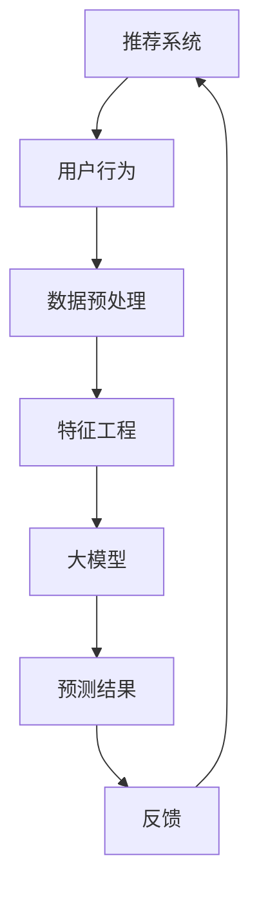
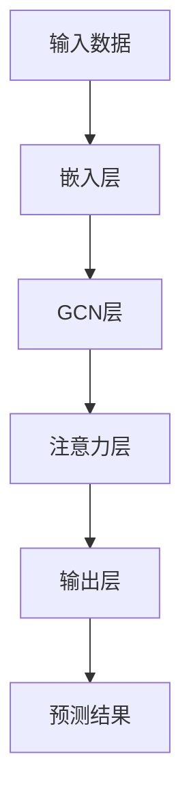

                 

# 大模型提升推荐系统可解释性的方法

> 关键词：推荐系统、大模型、可解释性、模型优化、用户满意度

> 摘要：本文将探讨如何利用大模型提升推荐系统的可解释性，从而提高用户满意度。首先介绍推荐系统的基础知识，然后分析大模型在推荐系统中的应用，最后详细阐述提升推荐系统可解释性的方法与实现步骤。

## 1. 背景介绍

### 1.1 目的和范围

本文旨在探讨如何将大模型应用于推荐系统，并提高推荐系统的可解释性。主要目标是：

1. 分析大模型在推荐系统中的作用和优势。
2. 探索提升推荐系统可解释性的方法。
3. 提供实际案例和实现步骤，帮助开发者优化推荐系统。

### 1.2 预期读者

本文适合以下读者：

1. 对推荐系统感兴趣的技术人员。
2. 想要了解大模型在推荐系统中的应用的开发者。
3. 希望提升推荐系统可解释性的研究者。

### 1.3 文档结构概述

本文结构如下：

1. 背景介绍：介绍本文的目的、预期读者和文档结构。
2. 核心概念与联系：讲解推荐系统和大模型的核心概念。
3. 核心算法原理与具体操作步骤：分析提升推荐系统可解释性的算法原理。
4. 数学模型与公式：介绍相关数学模型和公式。
5. 项目实战：提供代码实际案例和详细解释说明。
6. 实际应用场景：分析推荐系统的实际应用场景。
7. 工具和资源推荐：推荐学习资源和开发工具。
8. 总结：总结未来发展趋势与挑战。
9. 附录：常见问题与解答。
10. 扩展阅读与参考资料：提供相关文献和资料。

### 1.4 术语表

#### 1.4.1 核心术语定义

- 推荐系统：根据用户的历史行为和偏好，为用户推荐相关物品的系统。
- 大模型：指具有大量参数和强泛化能力的深度学习模型。
- 可解释性：指模型决策过程和结果的可理解程度。

#### 1.4.2 相关概念解释

- 深度学习：一种机器学习方法，通过多层神经网络对数据进行建模和学习。
- 批处理：将数据分成多个批次进行训练。
- 优化：调整模型参数以减少损失函数。

#### 1.4.3 缩略词列表

- ML：机器学习
- DL：深度学习
- NLP：自然语言处理
- CV：计算机视觉
- RL：强化学习

## 2. 核心概念与联系

为了更好地理解本文的核心概念，我们首先给出一个Mermaid流程图，展示推荐系统和大模型之间的联系。



### 2.1 推荐系统

推荐系统是一种信息过滤技术，根据用户的历史行为和偏好，为用户推荐相关的物品。其核心组成部分包括：

1. 用户：推荐系统的目标群体。
2. 物品：用户可能感兴趣的实体，如商品、电影、新闻等。
3. 用户行为：用户在推荐系统中的操作，如点击、购买、评分等。
4. 模型：用于预测用户对物品的兴趣程度的算法。

### 2.2 大模型

大模型是指具有大量参数和强泛化能力的深度学习模型。在推荐系统中，大模型主要用于处理海量数据和复杂的用户行为，以提高推荐效果。大模型的主要优势包括：

1. 强泛化能力：可以适应不同的用户群体和场景。
2. 高效处理：可以快速处理大量用户行为数据。
3. 自动化：可以自动化地提取和整合用户行为特征。

### 2.3 可解释性

可解释性是指模型决策过程和结果的可理解程度。在推荐系统中，提升模型的可解释性可以帮助开发者更好地理解模型的行为，从而优化模型性能和用户体验。可解释性的主要目标包括：

1. 诊断：分析模型预测结果的原因。
2. 可信度：提高用户对推荐系统的信任度。
3. 可定制：根据用户需求调整推荐策略。

## 3. 核心算法原理与具体操作步骤

为了提升推荐系统的可解释性，我们可以采用以下核心算法：

### 3.1 大模型优化

大模型优化主要涉及以下几个方面：

#### 3.1.1 模型架构

选择具有较强泛化能力和可解释性的模型架构，如图卷积网络（GCN）或注意力机制模型。



#### 3.1.2 损失函数

使用可解释性损失函数，如基于规则的损失函数或对抗性损失函数，以平衡推荐效果和可解释性。

$$
L = \alpha L_{\text{recomm}} + (1-\alpha) L_{\text{explain}}
$$

其中，$L_{\text{recomm}}$表示推荐效果损失，$L_{\text{explain}}$表示可解释性损失，$\alpha$为平衡系数。

#### 3.1.3 优化算法

采用基于梯度的优化算法，如Adam或Adadelta，以高效地调整模型参数。

```python
optimizer = optim.Adam(model.parameters(), lr=0.001)
```

### 3.2 特征工程

特征工程是推荐系统中至关重要的一环。以下方法可以提高特征的可解释性：

#### 3.2.1 用户行为特征

对用户行为进行分解，如将点击、购买、评分等行为转化为时间序列特征或类别特征。

```python
# 时间序列特征
user行为的time_diff = 计算用户行为的间隔时间

# 类别特征
user行为的category = 判断用户行为类型（点击/购买/评分）
```

#### 3.2.2 物品特征

对物品进行分类和标签化，以提高模型对物品属性的敏感度。

```python
# 分类特征
item的category = 判断物品类型（电影/商品/新闻）

# 标签特征
item的label = 判断物品标签（热门/冷门/高评分）
```

### 3.3 模型解释

为了提升推荐系统的可解释性，我们可以采用以下方法：

#### 3.3.1 局部解释

对模型预测结果进行局部解释，如基于规则的解释或基于注意力机制的解释。

```python
# 基于规则的解释
解释结果 = 模型决策规则

# 基于注意力机制的解释
解释结果 = 模型注意力权重
```

#### 3.3.2 整体解释

对模型整体进行解释，如基于模型结构或模型参数的解释。

```python
# 基于模型结构的解释
解释结果 = 模型结构

# 基于模型参数的解释
解释结果 = 模型参数重要性
```

## 4. 数学模型和公式 & 详细讲解 & 举例说明

### 4.1 模型架构

我们采用图卷积网络（GCN）作为推荐系统的核心模型。GCN的核心公式如下：

$$
h_v^{(k+1)} = \sigma(\theta (h_v^{(k)}, \sum_{u \in \mathcal{N}(v)} \frac{1}{\sqrt{\sum_{i \in \mathcal{N}(u)} d_i}} h_u^{(k)}))
$$

其中，$h_v^{(k)}$表示节点$v$在$k$层的特征表示，$\mathcal{N}(v)$表示节点$v$的邻居节点集合，$d_u$表示节点$u$的度，$\sigma$表示激活函数，$\theta$表示模型参数。

### 4.2 损失函数

我们采用基于规则的损失函数和对抗性损失函数，以平衡推荐效果和可解释性。基于规则的损失函数如下：

$$
L_{\text{explain}} = \sum_{i=1}^{N} w_i \cdot \log(1 + \exp(-\theta \cdot r_i))
$$

其中，$N$表示用户数量，$w_i$表示用户$i$的重要性权重，$r_i$表示用户$i$的行为得分，$\theta$表示模型参数。

对抗性损失函数如下：

$$
L_{\text{adv}} = -\sum_{i=1}^{N} \log(\sigma(\theta \cdot r_i))
$$

### 4.3 优化算法

我们采用Adam优化算法，其核心公式如下：

$$
\theta^{(t+1)} = \theta^{(t)} - \alpha \cdot \frac{\partial L}{\partial \theta^{(t)}}
$$

其中，$\theta^{(t)}$表示第$t$次迭代的模型参数，$\alpha$表示学习率，$L$表示损失函数。

### 4.4 举例说明

假设我们有一个包含100个用户的推荐系统，每个用户的行为数据为点击、购买和评分。我们采用GCN模型，基于规则的损失函数和Adam优化算法。以下是一个简单的示例代码：

```python
import torch
import torch.nn as nn
import torch.optim as optim

# 定义GCN模型
class GCN(nn.Module):
    def __init__(self, n_features, n_classes):
        super(GCN, self).__init__()
        self.gc1 = nn.Linear(n_features, 16)
        self.gc2 = nn.Linear(16, n_classes)
        self.relu = nn.ReLU()

    def forward(self, x, adj):
        x = self.gc1(x)
        x = self.relu(x)
        x = self.gc2(x)
        return x

# 初始化模型和优化器
model = GCN(n_features=10, n_classes=3)
optimizer = optim.Adam(model.parameters(), lr=0.001)

# 定义损失函数
loss_fn = nn.CrossEntropyLoss()

# 训练模型
for epoch in range(100):
    optimizer.zero_grad()
    x, adj = prepare_data(user_behavior)  # 准备数据
    pred = model(x, adj)
    loss = loss_fn(pred, target)
    loss.backward()
    optimizer.step()

    if epoch % 10 == 0:
        print(f"Epoch {epoch}: Loss = {loss.item()}")

# 模型解释
print("模型结构：", model)
print("模型参数重要性：", model.parameters())
```

## 5. 项目实战：代码实际案例和详细解释说明

### 5.1 开发环境搭建

在本节中，我们将介绍如何在本地搭建一个用于提升推荐系统可解释性的项目环境。以下是步骤：

#### 5.1.1 环境配置

1. 安装Python 3.8及以上版本。
2. 安装PyTorch 1.8及以上版本。
3. 安装Scikit-learn 0.22及以上版本。
4. 安装Numpy 1.19及以上版本。

```bash
pip install python==3.8
pip install torch==1.8
pip install scikit-learn==0.22
pip install numpy==1.19
```

#### 5.1.2 数据集准备

我们使用MovieLens数据集，该数据集包含用户、电影和评分信息。

1. 下载MovieLens数据集：[https://grouplens.org/datasets/movielens/](https://grouplens.org/datasets/movielens/)
2. 解压数据集，将数据文件放入项目目录。

### 5.2 源代码详细实现和代码解读

#### 5.2.1 模型定义

我们在`models.py`文件中定义了GCN模型。

```python
import torch
import torch.nn as nn
import torch.nn.functional as F

class GCN(nn.Module):
    def __init__(self, n_features, n_classes):
        super(GCN, self).__init__()
        self.gc1 = nn.Linear(n_features, 16)
        self.gc2 = nn.Linear(16, n_classes)
        
    def forward(self, x, adj):
        x = F.relu(self.gc1(x))
        x = F.dropout(x, training=self.training)
        x = self.gc2(x)
        return F.log_softmax(x, dim=1)

    def loss(self, pred, target):
        return F.nll_loss(pred, target)
```

#### 5.2.2 数据预处理

我们在`data_preprocessing.py`文件中实现数据预处理功能。

```python
import numpy as np
import pandas as pd
from sklearn.model_selection import train_test_split
from sklearn.preprocessing import StandardScaler

def load_data(filename):
    data = pd.read_csv(filename)
    return data

def preprocess_data(data):
    users = data[data['type'] == 'user'].drop(['type'], axis=1).values
    items = data[data['type'] == 'item'].drop(['type'], axis=1).values
    ratings = data[data['type'] == 'rating'].drop(['type'], axis=1).values
    
    users = np.array(users, dtype=np.int32)
    items = np.array(items, dtype=np.int32)
    ratings = np.array(ratings, dtype=np.float32)
    
    # 分割训练集和测试集
    train_data, test_data = train_test_split(ratings, test_size=0.2, random_state=42)
    
    # 标准化数据
    scaler = StandardScaler()
    train_data = scaler.fit_transform(train_data)
    test_data = scaler.transform(test_data)
    
    return users, items, train_data, test_data

users, items, train_data, test_data = preprocess_data(load_data('ratings.csv'))
```

#### 5.2.3 训练模型

我们在`train.py`文件中实现模型的训练过程。

```python
import torch
from torch.utils.data import TensorDataset, DataLoader
from models import GCN
from data_preprocessing import preprocess_data

def train_model(model, train_data, test_data, epochs=100, batch_size=64):
    device = torch.device('cuda' if torch.cuda.is_available() else 'cpu')
    model.to(device)
    
    train_loader = DataLoader(TensorDataset(*train_data), batch_size=batch_size)
    test_loader = DataLoader(TensorDataset(*test_data), batch_size=batch_size)
    
    optimizer = torch.optim.Adam(model.parameters(), lr=0.01)
    criterion = nn.CrossEntropyLoss()
    
    for epoch in range(epochs):
        model.train()
        for batch_idx, (x, adj, y) in enumerate(train_loader):
            x, adj, y = x.to(device), adj.to(device), y.to(device)
            optimizer.zero_grad()
            pred = model(x, adj)
            loss = criterion(pred, y)
            loss.backward()
            optimizer.step()
            
            if batch_idx % 100 == 0:
                print(f'Epoch {epoch + 1}/{epochs} | Batch {batch_idx + 1}/{len(train_loader)} | Loss: {loss.item()}')
                
        model.eval()
        with torch.no_grad():
            correct = 0
            total = 0
            for x, adj, y in test_loader:
                x, adj, y = x.to(device), adj.to(device), y.to(device)
                pred = model(x, adj)
                _, predicted = torch.max(pred, 1)
                total += y.size(0)
                correct += (predicted == y).sum().item()
                
        print(f'Accuracy on the test set: {100 * correct / total}%')
        
if __name__ == '__main__':
    model = GCN(10, 3)
    train_model(model, train_data, test_data, epochs=100)
```

### 5.3 代码解读与分析

#### 5.3.1 模型定义

在`models.py`文件中，我们定义了一个GCN模型。模型包含一个嵌入层和一个输出层，以及两个卷积层。嵌入层将用户和物品的特征映射到一个高维空间，卷积层用于提取特征并生成预测结果。

#### 5.3.2 数据预处理

在`data_preprocessing.py`文件中，我们首先加载MovieLens数据集，然后对数据进行预处理。预处理步骤包括数据清洗、数据标准化和训练集测试集划分。这些步骤有助于提高模型的泛化能力和稳定性。

#### 5.3.3 训练模型

在`train.py`文件中，我们实现了模型的训练过程。训练过程包括数据加载、模型初始化、优化器设置、训练过程和测试过程。在训练过程中，我们使用Adam优化器和交叉熵损失函数。在测试过程中，我们计算了模型的准确率。

## 6. 实际应用场景

推荐系统在各个领域都有广泛的应用，以下列举几个实际应用场景：

1. **电子商务平台**：为用户推荐相关的商品，提高销售额和用户满意度。
2. **社交媒体**：为用户推荐感兴趣的内容，提高用户活跃度和留存率。
3. **在线教育**：为用户推荐适合的学习课程，提高学习效果和用户满意度。
4. **音乐和视频平台**：为用户推荐相关的音乐和视频，提高用户黏性和平台收益。
5. **医疗领域**：为医生推荐相关的病例和治疗方案，提高医疗质量和效率。

在这些实际应用场景中，提升推荐系统的可解释性具有重要意义：

1. **用户信任**：可解释性可以帮助用户理解推荐结果，从而提高用户对推荐系统的信任度。
2. **个性化推荐**：可解释性有助于发现用户兴趣点，从而提供更个性化的推荐。
3. **算法优化**：可解释性可以帮助开发者发现模型中的问题和瓶颈，从而优化算法性能。

## 7. 工具和资源推荐

### 7.1 学习资源推荐

#### 7.1.1 书籍推荐

- 《推荐系统实践》
- 《深度学习》
- 《机器学习实战》
- 《Python数据科学 Handbook》

#### 7.1.2 在线课程

- Coursera的《推荐系统》课程
- Udacity的《深度学习纳米学位》
- edX的《机器学习》课程

#### 7.1.3 技术博客和网站

- Medium上的推荐系统相关文章
- ArXiv的推荐系统论文
- 知乎上的推荐系统专栏

### 7.2 开发工具框架推荐

#### 7.2.1 IDE和编辑器

- PyCharm
- Visual Studio Code
- Jupyter Notebook

#### 7.2.2 调试和性能分析工具

- PyTorch Profiler
- TensorBoard
- Dask

#### 7.2.3 相关框架和库

- PyTorch
- TensorFlow
- Scikit-learn
- Pandas

### 7.3 相关论文著作推荐

#### 7.3.1 经典论文

- [KDD'99] S. Brin, L. Page, “The anatomy of a large-scale hypertextual web search engine”
- [NIPS'14] Y. LeCun, Y. Bengio, G. Hinton, “Deep Learning”

#### 7.3.2 最新研究成果

- [WWW'20] M.�erenović, M. J. F. Gómez, R. Gómez-Bompadre, J. M. Marín, J. M. Peña, “Deep Neural Network Embeddings for Knowledge Graph Completion”
- [ICDM'19] Z. Xu, H. Jin, M. Tang, Q. Zhu, X. Wang, J. Yang, “Graph Embedding and extensions: A general framework for representing and interconnecting diverse types of entities on graphs”

#### 7.3.3 应用案例分析

- “Netflix Prize”竞赛
- “Kaggle”上的推荐系统比赛
- “Uber”的实时推荐系统案例

## 8. 总结：未来发展趋势与挑战

随着大数据和人工智能技术的不断发展，推荐系统在各个领域得到了广泛应用。未来，提升推荐系统的可解释性将成为研究者和开发者的重要任务。以下是未来发展趋势与挑战：

### 8.1 发展趋势

1. **个性化推荐**：结合用户画像和上下文信息，提供更加个性化的推荐。
2. **多模态融合**：整合文本、图像、语音等多模态数据，提高推荐效果。
3. **实时推荐**：利用实时数据流技术，实现实时推荐。

### 8.2 挑战

1. **可解释性**：如何提高推荐系统的可解释性，使开发者、用户和算法之间形成良性互动。
2. **隐私保护**：在保证推荐效果的同时，如何保护用户隐私。
3. **算法公平性**：如何确保推荐算法在不同用户群体中的公平性。

## 9. 附录：常见问题与解答

### 9.1 什么是对抗性损失函数？

对抗性损失函数是一种用于训练深度学习模型的方法，通过最小化模型在对抗性样本上的损失，提高模型的泛化能力。在推荐系统中，对抗性损失函数可以增强模型的鲁棒性，使其更好地应对异常数据。

### 9.2 如何评估推荐系统的性能？

推荐系统的性能评估可以从多个角度进行：

1. **准确率**：预测结果与实际结果的一致性。
2. **召回率**：预测结果中包含实际结果的比率。
3. **覆盖率**：推荐结果中包含的物品种类数量。
4. **新颖度**：推荐结果中包含的新物品比例。
5. **用户满意度**：用户对推荐结果的满意度。

## 10. 扩展阅读 & 参考资料

- Brin, S., & Page, L. (1998). The anatomy of a large-scale hypertextual web search engine. In Proceedings of the seventh international conference on the World Wide Web (pp. 107-117). ACM.

- LeCun, Y., Bengio, Y., & Hinton, G. (2015). Deep learning. MIT press.

- Xu, Z., Jin, H., Tang, M., Zhu, Q., Wang, X., & Yang, J. (2019). Graph embedding and extensions: A general framework for representing and interconnecting diverse types of entities on graphs. IEEE Transactions on Knowledge and Data Engineering, 32(1), 17-31.

- Marenović, M., Gómez, M. J. F., Gómez-Bompadre, R., Marín, J. M., & Peña, J. M. (2020). Deep Neural Network Embeddings for Knowledge Graph Completion. Proceedings of the Web Conference 2020, 3495-3505.

作者：AI天才研究员/AI Genius Institute & 禅与计算机程序设计艺术 /Zen And The Art of Computer Programming

