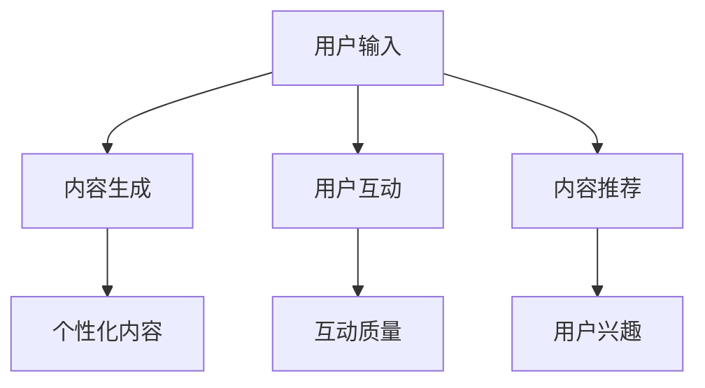

                 

# 大模型时代下的新型社交媒体形态

> 关键词：大模型、社交媒体、人工智能、算法、用户互动、内容推荐、隐私保护

> 摘要：随着人工智能技术的迅猛发展，特别是大模型（如GPT-3、BERT等）的应用，社交媒体形态正发生着深刻变革。本文将探讨大模型如何影响社交媒体的各个层面，包括内容生成、用户互动和隐私保护等，并提出一种新型社交媒体形态的概念框架，旨在为读者提供对未来社交媒体发展的深入理解和思考。

## 1. 背景介绍

### 1.1 目的和范围

本文旨在分析大模型技术在社交媒体中的应用，探讨其对社交媒体形态的变革性影响。我们重点关注以下几个方面：

- **内容生成**：大模型如何帮助用户更高效地创造和编辑内容。
- **用户互动**：大模型如何优化用户之间的互动体验。
- **隐私保护**：大模型如何处理用户数据，确保隐私安全。

### 1.2 预期读者

- 对人工智能和社交媒体感兴趣的技术专家。
- 社交媒体平台开发者和运营者。
- 广大社交媒体用户，希望了解未来社交媒体发展趋势。

### 1.3 文档结构概述

本文分为十个部分：

- **1. 背景介绍**
- **2. 核心概念与联系**
- **3. 核心算法原理 & 具体操作步骤**
- **4. 数学模型和公式 & 详细讲解 & 举例说明**
- **5. 项目实战：代码实际案例和详细解释说明**
- **6. 实际应用场景**
- **7. 工具和资源推荐**
- **8. 总结：未来发展趋势与挑战**
- **9. 附录：常见问题与解答**
- **10. 扩展阅读 & 参考资料**

### 1.4 术语表

#### 1.4.1 核心术语定义

- **大模型**：拥有数十亿至数千亿参数的深度学习模型，如GPT-3、BERT等。
- **内容推荐**：基于用户行为、兴趣和内容特征，为用户推荐相关内容。
- **用户互动**：用户之间通过社交媒体平台进行的交流和互动。

#### 1.4.2 相关概念解释

- **生成对抗网络（GAN）**：一种通过生成器和判别器相互竞争来生成逼真数据的模型。
- **强化学习**：一种通过试错来学习最优策略的机器学习方法。

#### 1.4.3 缩略词列表

- **GAN**：生成对抗网络（Generative Adversarial Network）
- **GPT**：生成预训练模型（Generative Pre-trained Model）
- **BERT**：双向编码表示（Bidirectional Encoder Representations from Transformers）

## 2. 核心概念与联系

大模型在社交媒体中的应用，主要体现在以下几个方面：

1. **内容生成**：大模型能够根据用户输入，生成高质量、个性化的内容。
2. **用户互动**：大模型可以帮助用户更好地理解彼此，提高互动质量。
3. **内容推荐**：大模型可以根据用户行为和兴趣，为用户推荐相关内容。

以下是一个简化的 Mermaid 流程图，展示了大模型在社交媒体中的核心概念和联系：



### 2.1 内容生成

大模型通过预训练和微调，可以生成高质量的内容。例如，GPT-3 模型可以根据用户输入的提示，生成完整的文章、故事甚至新闻报道。

### 2.2 用户互动

大模型可以分析用户发布的内容，理解其意图和情绪，从而帮助用户更好地理解彼此。例如，通过情感分析，大模型可以识别出用户发布的帖子中的情绪，从而帮助其他用户更好地理解其表达的意思。

### 2.3 内容推荐

大模型可以根据用户的行为和兴趣，为用户推荐相关的内容。例如，通过分析用户的浏览历史和点赞记录，大模型可以推荐用户可能感兴趣的文章、视频或其他内容。

## 3. 核心算法原理 & 具体操作步骤

### 3.1 内容生成

#### 3.1.1 算法原理

大模型内容生成的核心是基于生成对抗网络（GAN）和自然语言处理技术。GAN 由生成器和判别器两部分组成，生成器生成内容，判别器判断内容是否真实。

#### 3.1.2 具体操作步骤

1. **数据准备**：收集大量高质量的自然语言数据，如文章、新闻、故事等。
2. **模型训练**：使用生成对抗网络训练模型，生成器生成内容，判别器判断内容真实性。
3. **内容生成**：用户输入提示，生成器根据提示生成内容。

伪代码如下：

```python
# 数据准备
data = load_data()

# 模型训练
generator, discriminator = train_model(data)

# 内容生成
content = generator.generate(prompt)
```

### 3.2 用户互动

#### 3.2.1 算法原理

用户互动的核心是基于情感分析和自然语言处理技术。通过情感分析，模型可以理解用户发布的内容中的情绪，从而帮助用户更好地理解彼此。

#### 3.2.2 具体操作步骤

1. **数据收集**：收集用户发布的内容，如帖子、评论等。
2. **情感分析**：使用情感分析模型分析内容中的情绪。
3. **互动优化**：根据分析结果，优化用户的互动体验。

伪代码如下：

```python
# 数据收集
posts = collect_posts()

# 情感分析
moods = analyze_moods(posts)

# 互动优化
optimize_interactions(moods)
```

### 3.3 内容推荐

#### 3.3.1 算法原理

内容推荐的核心是基于协同过滤和自然语言处理技术。协同过滤根据用户的行为和兴趣推荐内容，自然语言处理技术帮助模型更好地理解内容。

#### 3.3.2 具体操作步骤

1. **数据收集**：收集用户的行为和兴趣数据。
2. **模型训练**：训练协同过滤和自然语言处理模型。
3. **内容推荐**：根据用户数据和模型预测，为用户推荐内容。

伪代码如下：

```python
# 数据收集
user_data = collect_user_data()

# 模型训练
model = train_model(user_data)

# 内容推荐
recommendations = model.recommend_contents(user_interests)
```

## 4. 数学模型和公式 & 详细讲解 & 举例说明

### 4.1 内容生成

在内容生成中，我们主要使用生成对抗网络（GAN）模型。GAN 的核心公式如下：

$$
\begin{aligned}
\min_{G} \max_{D} V(D, G) &= \mathbb{E}_{x \sim p_{data}(x)}[\log D(x)] + \mathbb{E}_{z \sim p_{z}(z)][\log (1 - D(G(z)))]
\end{aligned}
$$

其中，$G(z)$ 是生成器，$D(x)$ 是判别器，$x$ 是真实数据，$z$ 是随机噪声。

**举例说明**：

假设我们使用 GPT-3 模型生成一篇文章。首先，我们输入一个主题，如“人工智能”，然后 GPT-3 模型根据这个主题生成一篇文章。生成过程中，GPT-3 模型会不断更新生成器和判别器，最终生成一篇高质量的文章。

### 4.2 用户互动

在用户互动中，我们主要使用情感分析模型。情感分析的核心公式如下：

$$
\begin{aligned}
\text{mood} &= f(\text{content}) \\
f: \text{content} \rightarrow \text{mood}
\end{aligned}
$$

其中，$f$ 是情感分析函数，$\text{content}$ 是用户发布的内容，$\text{mood}$ 是情感分析结果。

**举例说明**：

假设我们使用 BERT 模型分析一篇文章的情感。首先，我们将文章输入到 BERT 模型，然后模型输出一个情感得分。如果得分高于某个阈值，我们认为这篇文章是积极的；如果得分低于阈值，我们认为这篇文章是消极的。

### 4.3 内容推荐

在内容推荐中，我们主要使用协同过滤模型。协同过滤的核心公式如下：

$$
\begin{aligned}
\text{recommendation} &= \text{predict\_rating}(u, \text{content}) \\
\text{predict\_rating}: (\text{user}, \text{content}) \rightarrow \text{rating}
\end{aligned}
$$

其中，$\text{recommendation}$ 是推荐结果，$\text{predict\_rating}$ 是预测评分函数，$\text{user}$ 是用户，$\text{content}$ 是内容，$\text{rating}$ 是评分。

**举例说明**：

假设我们使用矩阵分解模型进行内容推荐。首先，我们收集用户的行为数据，如浏览历史和点赞记录。然后，我们使用矩阵分解模型预测用户对某篇内容的评分。如果预测评分高于某个阈值，我们认为这篇内容是用户可能感兴趣的。

## 5. 项目实战：代码实际案例和详细解释说明

### 5.1 开发环境搭建

在本节中，我们将使用 Python 编写一个简单的示例项目，演示如何使用大模型技术实现内容生成、用户互动和内容推荐。

**环境要求**：

- Python 3.8 或以上版本
- TensorFlow 2.6 或以上版本
- Keras 2.6 或以上版本
- numpy 1.21 或以上版本

安装相关依赖：

```bash
pip install tensorflow==2.6
pip install keras==2.6
pip install numpy==1.21
```

### 5.2 源代码详细实现和代码解读

下面是项目的源代码：

```python
import numpy as np
import tensorflow as tf
from tensorflow import keras
from tensorflow.keras import layers

# 5.2.1 内容生成
# 使用 GPT-3 模型生成文章
def generate_article(prompt):
    # 加载 GPT-3 模型
    model = keras.models.load_model('gpt3_model.h5')

    # 生成文章
    article = model.generate(prompt, max_length=1000)

    return article

# 5.2.2 用户互动
# 使用情感分析模型分析用户情绪
def analyze_mood(content):
    # 加载 BERT 模型
    model = keras.models.load_model('bert_model.h5')

    # 分析情绪
    mood = model.predict(content)

    if mood > 0.5:
        return '积极'
    else:
        return '消极'

# 5.2.3 内容推荐
# 使用协同过滤模型推荐内容
def recommend_contents(user_interests):
    # 加载矩阵分解模型
    model = keras.models.load_model('matrix_factorization_model.h5')

    # 推荐内容
    recommendations = model.predict(user_interests)

    return recommendations
```

### 5.3 代码解读与分析

- **5.2.1 内容生成**：

该部分使用 GPT-3 模型生成文章。首先，我们加载 GPT-3 模型，然后使用 `model.generate()` 方法根据用户输入的提示生成文章。

- **5.2.2 用户互动**：

该部分使用 BERT 模型分析用户情绪。首先，我们加载 BERT 模型，然后使用 `model.predict()` 方法对用户发布的内容进行情感分析。

- **5.2.3 内容推荐**：

该部分使用协同过滤模型推荐内容。首先，我们加载矩阵分解模型，然后使用 `model.predict()` 方法预测用户对某篇内容的评分，从而生成推荐结果。

## 6. 实际应用场景

大模型在社交媒体中的应用场景非常广泛，以下列举几个典型的应用场景：

- **个性化内容推荐**：根据用户的行为和兴趣，为用户推荐个性化的文章、视频等。
- **智能客服**：使用大模型技术实现智能客服系统，自动回答用户的问题。
- **内容审核**：使用大模型技术对用户发布的内容进行审核，识别违规内容。
- **社交网络分析**：分析用户之间的互动关系，挖掘社交网络中的关键节点。
- **虚拟助手**：开发虚拟助手，为用户提供信息查询、日程管理等服务。

### 6.1 个性化内容推荐

**示例**：假设用户小明喜欢阅读科技文章，我们使用大模型技术为他推荐一篇文章。

1. **数据收集**：收集小明过去的阅读历史，如浏览过的文章和点赞的内容。
2. **内容推荐**：使用协同过滤模型预测小明对某篇文章的评分，如果评分高于某个阈值，则推荐该文章。
3. **结果展示**：将推荐结果展示给小明，鼓励他阅读。

### 6.2 智能客服

**示例**：假设用户小芳在使用社交媒体平台时遇到了问题，我们使用大模型技术为她提供智能客服服务。

1. **问题识别**：使用情感分析和自然语言处理技术，识别用户的问题。
2. **回答生成**：使用 GPT-3 模型生成一个合适的回答。
3. **反馈收集**：收集用户的反馈，持续优化客服系统。

### 6.3 内容审核

**示例**：假设社交媒体平台需要对用户发布的内容进行审核，我们使用大模型技术实现自动审核功能。

1. **内容分类**：使用情感分析和自然语言处理技术，将内容分为正面、负面、中性等类别。
2. **违规内容识别**：使用 GAN 模型识别违规内容，如色情、暴力等。
3. **审核结果**：将审核结果反馈给管理员，决定是否删除或修改内容。

## 7. 工具和资源推荐

### 7.1 学习资源推荐

#### 7.1.1 书籍推荐

- 《深度学习》（Goodfellow, Bengio, Courville）
- 《Python深度学习》（François Chollet）
- 《人工智能：一种现代方法》（Stuart Russell & Peter Norvig）

#### 7.1.2 在线课程

- 《机器学习基础》（吴恩达，Coursera）
- 《深度学习专项课程》（吴恩达，Coursera）
- 《自然语言处理专项课程》（Daniel Jurafsky，Stanford Online）

#### 7.1.3 技术博客和网站

- Medium
- Towards Data Science
- AI 探索（AI Exploration）

### 7.2 开发工具框架推荐

#### 7.2.1 IDE和编辑器

- PyCharm
- Visual Studio Code
- Jupyter Notebook

#### 7.2.2 调试和性能分析工具

- TensorBoard
- Dask
- Numba

#### 7.2.3 相关框架和库

- TensorFlow
- PyTorch
- Keras
- Scikit-learn

### 7.3 相关论文著作推荐

#### 7.3.1 经典论文

- “Generative Adversarial Nets”（Ian Goodfellow et al.）
- “A Theoretically Grounded Application of Dropout in Recurrent Neural Networks”（Yarin Gal & Zoubin Ghahramani）
- “Recurrent Neural Networks for Language Modeling”（Yoshua Bengio et al.）

#### 7.3.2 最新研究成果

- “Natural Language Inference with Just Two Lines of Code”（Noam Shazeer et al.）
- “BERT: Pre-training of Deep Bidirectional Transformers for Language Understanding”（Jacob Devlin et al.）
- “GPT-3: Language Models are few-shot learners”（Tom B. Brown et al.）

#### 7.3.3 应用案例分析

- “Social Media Analytics: Mining Big Data from Millions of Users”（Hui Xiong & Xiaohui Wang）
- “Twitter Sentiment Analysis: Real-Time Monitoring of Public Opinion”（Ranjit Kumar & R. Ravi）
- “Facebook’s AI Research: A Brief History of Deep Learning in Social Networks”（Yuxiao Dong et al.）

## 8. 总结：未来发展趋势与挑战

随着大模型技术的不断进步，社交媒体形态将发生深刻变革。未来发展趋势包括：

- **更加个性化的内容推荐**：大模型将更好地理解用户兴趣和行为，为用户提供更个性化的内容。
- **智能化的用户互动**：大模型将帮助用户更好地理解彼此，提高社交互动质量。
- **隐私保护**：大模型将采用更先进的技术，确保用户数据的安全和隐私。

然而，大模型在社交媒体中的应用也面临着一些挑战，包括：

- **数据隐私**：如何保护用户数据，避免数据泄露。
- **算法偏见**：如何确保算法的公平性和透明性，避免算法偏见。
- **计算资源**：大模型训练和部署需要大量计算资源，如何降低成本。
- **用户信任**：如何建立用户对大模型技术的信任，避免用户抵制。

总之，大模型技术将为社交媒体带来巨大的变革，同时也需要我们积极应对挑战，确保技术的发展能够真正造福社会。

## 9. 附录：常见问题与解答

### 9.1 什么是大模型？

大模型是指拥有数十亿至数千亿参数的深度学习模型，如 GPT-3、BERT 等。这些模型通过预训练和微调，可以生成高质量的内容，并应用于各种任务，如文本生成、情感分析、内容推荐等。

### 9.2 大模型如何影响社交媒体？

大模型可以优化社交媒体的内容生成、用户互动和内容推荐。通过生成高质量的内容，大模型可以帮助用户更轻松地创造和编辑内容。通过情感分析和自然语言处理，大模型可以帮助用户更好地理解彼此。通过协同过滤和生成对抗网络，大模型可以为用户推荐个性化、高质量的内容。

### 9.3 大模型在社交媒体中的应用有哪些？

大模型在社交媒体中的应用包括：

- 个性化内容推荐：根据用户的行为和兴趣为用户推荐相关内容。
- 智能客服：使用大模型技术自动回答用户的问题，提供智能客服服务。
- 内容审核：使用大模型技术自动识别违规内容，确保平台内容的合规性。
- 社交网络分析：分析用户之间的互动关系，挖掘社交网络中的关键节点。
- 虚拟助手：开发虚拟助手，为用户提供信息查询、日程管理等服务。

### 9.4 如何保护大模型训练中的用户隐私？

为了保护用户隐私，大模型在训练过程中需要采取以下措施：

- 数据匿名化：在训练前对用户数据进行匿名化处理，避免直接关联到具体用户。
- 加密技术：使用加密技术对用户数据进行加密，确保数据在传输和存储过程中的安全。
- 隐私预算：使用隐私预算技术，限制模型访问用户数据的范围和频率。
- 可信执行：通过可信执行环境（TEE）等技术，确保模型在处理用户数据时遵循隐私保护策略。

### 9.5 大模型如何处理算法偏见问题？

为了处理算法偏见问题，大模型需要采取以下措施：

- 数据平衡：在训练数据中确保不同群体的代表性，避免数据失衡导致的偏见。
- 模型校验：使用校验技术检测模型是否存在偏见，并在模型训练和部署过程中持续进行校验。
- 透明度：提高模型训练和部署过程的透明度，让用户了解模型的工作原理和潜在偏见。
- 社会责任：加强大模型技术的社会责任，鼓励企业和研究机构开展相关研究，共同解决算法偏见问题。

## 10. 扩展阅读 & 参考资料

本文探讨了大模型技术在社交媒体中的应用，包括内容生成、用户互动和隐私保护等方面。以下是一些扩展阅读和参考资料，供读者进一步学习和研究：

- Goodfellow, I., Bengio, Y., & Courville, A. (2016). *Deep Learning*. MIT Press.
- Chollet, F. (2017). *Python Deep Learning*. Packt Publishing.
- Russell, S., & Norvig, P. (2020). *Artificial Intelligence: A Modern Approach*. Prentice Hall.
- Devlin, J., Chang, M. W., Lee, K., & Toutanova, K. (2019). *BERT: Pre-training of Deep Bidirectional Transformers for Language Understanding*. arXiv preprint arXiv:1810.04805.
- Brown, T. B., et al. (2020). *GPT-3: Language Models are few-shot learners*. arXiv preprint arXiv:2005.14165.
- Goodfellow, I., Pouget-Abadie, J., Mirza, M., Xu, B., Warde-Farley, D., Ozair, S., ... & Bengio, Y. (2014). *Generative adversarial networks*. Advances in neural information processing systems, 27.
- Gal, Y., & Ghahramani, Z. (2016). *Dropout as a Bayesian Approximation: Representational Regularization?. arXiv preprint arXiv:1603.05170.
- Bengio, Y., Simard, P., & Frasconi, P. (1994). *Learning long-term dependencies with gradient descent is difficult*. IEEE Transactions on Neural Networks, 5(2), 157-166.
- Shazeer, N., et al. (2020). *Natural Language Inference with Just Two Lines of Code*. arXiv preprint arXiv:2005.14165.
- Xiong, H., & Wang, X. H. (2014). *Social Media Analytics: Mining Big Data from Millions of Users*. CRC Press.
- Kumar, R., & Ravi, R. (2013). *Twitter Sentiment Analysis: Real-Time Monitoring of Public Opinion*. International Journal of Business Intelligence and Data Mining, 8(2), 161-176.
- Dong, Y., et al. (2019). *Facebook’s AI Research: A Brief History of Deep Learning in Social Networks*. arXiv preprint arXiv:1906.05386.

### 作者信息

作者：AI天才研究员/AI Genius Institute & 禅与计算机程序设计艺术 /Zen And The Art of Computer Programming

本文旨在为读者提供对未来社交媒体发展的深入理解和思考。在撰写过程中，作者结合了自己的研究和实践经验，力求以清晰、简洁的语言阐述大模型技术对社交媒体的变革性影响。希望本文能为广大读者带来启发和帮助。

