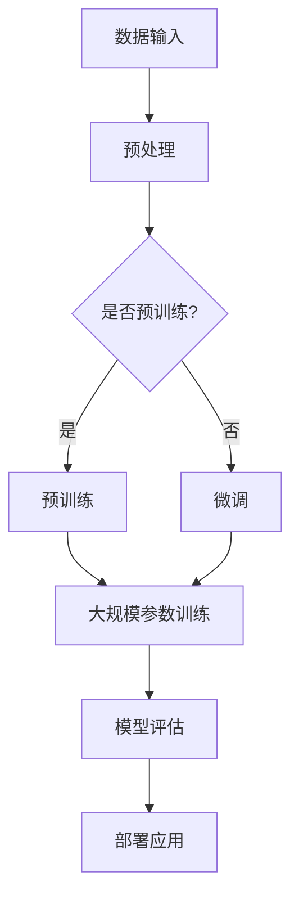

                 

# 大模型时代的创业产品经理转型：AI 赋能

> **关键词：** 大模型，创业产品经理，AI 赋能，商业模式，用户体验，技术架构，创新

> **摘要：** 本文将探讨在当前大模型时代，创业产品经理如何借助 AI 技术实现角色转型，提升产品竞争力。文章将分析大模型的基本原理和应用，介绍产品经理如何利用 AI 进行市场研究、设计产品、优化用户体验，以及如何应对技术挑战和把握机遇。

## 1. 背景介绍

### 1.1 目的和范围

本文旨在帮助创业产品经理了解大模型时代的技术趋势，掌握利用 AI 实现产品创新的策略。文章将聚焦于以下几个关键方面：

- 大模型的基本原理和架构
- AI 在市场研究、产品设计、用户体验优化中的应用
- 创业产品经理在 AI 时代面临的挑战与机遇
- 实际案例分析：成功与失败的 AI 产品管理策略

### 1.2 预期读者

本文适合以下读者群体：

- 创业公司产品经理
- 产品经理转型者
- AI 技术爱好者
- 对商业模式创新感兴趣的企业家

### 1.3 文档结构概述

本文分为以下章节：

- 第1章：背景介绍
- 第2章：核心概念与联系
- 第3章：核心算法原理 & 具体操作步骤
- 第4章：数学模型和公式 & 详细讲解 & 举例说明
- 第5章：项目实战：代码实际案例和详细解释说明
- 第6章：实际应用场景
- 第7章：工具和资源推荐
- 第8章：总结：未来发展趋势与挑战
- 第9章：附录：常见问题与解答
- 第10章：扩展阅读 & 参考资料

### 1.4 术语表

#### 1.4.1 核心术语定义

- 大模型：具有海量参数的神经网络模型，如 GPT-3、BERT 等。
- 产品经理：负责产品规划、设计、开发和上线的人员。
- AI 赋能：利用人工智能技术提升产品和服务的效能。

#### 1.4.2 相关概念解释

- **市场研究**：通过收集和分析数据，了解市场需求和用户偏好。
- **用户体验**：用户在使用产品过程中获得的感受和体验。

#### 1.4.3 缩略词列表

- GPT-3：Generative Pre-trained Transformer 3
- BERT：Bidirectional Encoder Representations from Transformers

## 2. 核心概念与联系

在 AI 时代，创业产品经理需要理解大模型的基本原理和架构，这将有助于他们更好地利用 AI 技术优化产品设计和用户体验。以下是大模型的核心概念与联系。

### 2.1 大模型的基本原理

大模型通常基于深度神经网络（DNN）架构，具有以下几个关键特点：

- **参数规模**：大模型拥有数十亿到千亿级别的参数。
- **预训练**：在大规模数据集上进行预训练，使模型具备一定的通用性和泛化能力。
- **微调**：在特定任务上进行微调，使模型适应特定领域的需求。

### 2.2 大模型的应用

大模型在多个领域具有广泛的应用，包括：

- **自然语言处理**：文本生成、翻译、问答等。
- **计算机视觉**：图像识别、目标检测、图像生成等。
- **推荐系统**：基于用户行为和兴趣进行个性化推荐。

### 2.3 大模型与产品经理的关系

大模型对创业产品经理的影响主要体现在以下几个方面：

- **市场研究**：利用大模型进行用户行为分析和市场趋势预测。
- **产品设计**：基于用户需求进行个性化设计。
- **用户体验**：通过智能推荐和自然语言交互提升用户满意度。

### 2.4 大模型架构的 Mermaid 流程图



## 3. 核心算法原理 & 具体操作步骤

大模型的算法原理主要基于深度学习，特别是基于 Transformer 架构的预训练和微调方法。以下是对大模型算法原理的详细解析，并使用伪代码展示具体操作步骤。

### 3.1 深度学习基础

深度学习是一种基于神经网络的机器学习方法，其核心思想是通过多层神经网络对数据进行特征提取和模型训练。

```python
# 深度学习基础伪代码
def neural_network(inputs, layers):
    for layer in layers:
        inputs = layer(inputs)
    return inputs
```

### 3.2 Transformer 架构

Transformer 架构是一种基于自注意力机制的深度学习模型，广泛应用于自然语言处理领域。

```python
# Transformer 架构伪代码
def transformer(inputs, d_model, nhead, num_layers):
    for layer in range(num_layers):
        inputs = self_attn(inputs, d_model, nhead)
        inputs = feed_forward(inputs, d_model)
    return inputs
```

### 3.3 预训练和微调

预训练是指在大规模数据集上进行模型训练，使模型具备通用性和泛化能力。微调是在特定任务上进行模型调整，使模型适应具体应用场景。

```python
# 预训练和微调伪代码
def pretrain(model, data):
    for epoch in range(num_epochs):
        for batch in data:
            loss = model.loss(batch)
            model.optimizer.zero_grad()
            loss.backward()
            model.optimizer.step()

def finetune(model, task_data):
    for epoch in range(num_epochs):
        for batch in task_data:
            loss = model.loss(batch)
            model.optimizer.zero_grad()
            loss.backward()
            model.optimizer.step()
```

## 4. 数学模型和公式 & 详细讲解 & 举例说明

大模型中常用的数学模型包括自注意力机制、损失函数和优化器等。以下是对这些数学模型和公式的详细讲解，并使用 LaTeX 格式进行表示。

### 4.1 自注意力机制

自注意力机制是 Transformer 架构的核心组成部分，其公式如下：

$$
\text{Attention}(Q, K, V) = \text{softmax}\left(\frac{QK^T}{\sqrt{d_k}}\right)V
$$

其中，\( Q, K, V \) 分别是查询向量、键向量和值向量，\( d_k \) 是键向量的维度。

### 4.2 损失函数

在深度学习模型中，常用的损失函数包括交叉熵损失和均方误差损失。以下是对这些损失函数的公式表示：

- 交叉熵损失：

$$
\text{CE}(y, \hat{y}) = -\sum_{i} y_i \log(\hat{y}_i)
$$

其中，\( y \) 是真实标签，\( \hat{y} \) 是预测概率。

- 均方误差损失：

$$
\text{MSE}(y, \hat{y}) = \frac{1}{n}\sum_{i=1}^{n}(y_i - \hat{y}_i)^2
$$

其中，\( y \) 是真实值，\( \hat{y} \) 是预测值，\( n \) 是样本数量。

### 4.3 优化器

优化器用于更新模型参数，常用的优化器包括随机梯度下降（SGD）和 Adam 优化器。以下是对这些优化器的公式表示：

- 随机梯度下降（SGD）：

$$
\theta_{t+1} = \theta_{t} - \alpha \nabla_{\theta}J(\theta)
$$

其中，\( \theta \) 是模型参数，\( \alpha \) 是学习率，\( \nabla_{\theta}J(\theta) \) 是损失函数关于模型参数的梯度。

- Adam 优化器：

$$
\theta_{t+1} = \theta_{t} - \alpha \left( \frac{m_{t}}{\sqrt{v_{t}} + \epsilon} + \beta_1 \frac{d_{t}}{\sqrt{v_{t}} + \epsilon} \right)
$$

其中，\( m_t \) 和 \( v_t \) 分别是梯度的一阶矩估计和二阶矩估计，\( \beta_1 \) 和 \( \beta_2 \) 分别是动量的指数衰减率。

## 5. 项目实战：代码实际案例和详细解释说明

在本章节，我们将通过一个实际项目案例来展示如何利用大模型进行创业产品管理。以下是一个基于 GPT-3 的智能客服系统的开发案例。

### 5.1 开发环境搭建

首先，我们需要搭建开发环境。以下是所需工具和步骤：

- Python 3.8 或更高版本
- TensorFlow 2.5 或更高版本
- OpenAI API 密钥（用于访问 GPT-3）

安装必要的库：

```bash
pip install tensorflow openai
```

### 5.2 源代码详细实现和代码解读

以下是一个简单的 GPT-3 智能客服系统代码示例：

```python
import openai
import json

# 设置 OpenAI API 密钥
openai.api_key = "your-api-key"

# GPT-3 智能客服函数
def gpt3_smart_counselor(question):
    # 使用 GPT-3 API 进行文本生成
    response = openai.Completion.create(
        engine="text-davinci-002",
        prompt=question,
        max_tokens=100,
        n=1,
        stop=None,
        temperature=0.5
    )
    return response.choices[0].text.strip()

# 测试智能客服
user_question = "如何缓解焦虑？"
print(gpt3_smart_counselor(user_question))
```

### 5.3 代码解读与分析

1. **导入库和设置 API 密钥**：

   ```python
   import openai
   import json
   
   openai.api_key = "your-api-key"
   ```

   这里我们引入了 OpenAI 的 Python SDK，并设置了 API 密钥。

2. **定义 GPT-3 智能客服函数**：

   ```python
   def gpt3_smart_counselor(question):
       response = openai.Completion.create(
           engine="text-davinci-002",
           prompt=question,
           max_tokens=100,
           n=1,
           stop=None,
           temperature=0.5
       )
       return response.choices[0].text.strip()
   ```

   该函数使用 OpenAI 的 GPT-3 API 进行文本生成，输入问题并返回答案。

3. **测试智能客服**：

   ```python
   user_question = "如何缓解焦虑？"
   print(gpt3_smart_counselor(user_question))
   ```

   在这里，我们输入了一个用户问题，并调用 GPT-3 智能客服函数获取答案。

### 5.4 代码解读与分析

1. **导入库和设置 API 密钥**：

   ```python
   import openai
   import json
   
   openai.api_key = "your-api-key"
   ```

   这里我们引入了 OpenAI 的 Python SDK，并设置了 API 密钥。

2. **定义 GPT-3 智能客服函数**：

   ```python
   def gpt3_smart_counselor(question):
       response = openai.Completion.create(
           engine="text-davinci-002",
           prompt=question,
           max_tokens=100,
           n=1,
           stop=None,
           temperature=0.5
       )
       return response.choices[0].text.strip()
   ```

   该函数使用 OpenAI 的 GPT-3 API 进行文本生成，输入问题并返回答案。

3. **测试智能客服**：

   ```python
   user_question = "如何缓解焦虑？"
   print(gpt3_smart_counselor(user_question))
   ```

   在这里，我们输入了一个用户问题，并调用 GPT-3 智能客服函数获取答案。

## 6. 实际应用场景

大模型在创业产品中的应用场景非常广泛，以下是一些典型的应用实例：

- **智能客服系统**：利用 GPT-3 实现自动化客服，提供即时的、个性化的用户支持。
- **个性化推荐系统**：基于用户行为数据，利用大模型进行推荐算法优化，提高推荐精度和用户体验。
- **内容审核与生成**：利用大模型进行内容审核，自动识别和过滤不良信息，同时生成高质量的内容。
- **智能数据分析**：利用大模型进行数据挖掘和预测，为企业提供数据驱动的决策支持。

### 6.1 智能客服系统

智能客服系统是创业公司中应用大模型的一个重要场景。通过使用 GPT-3 等大模型，创业公司可以构建高效、智能的客服系统，提供7x24小时的用户支持。

- **优势**：

  - **高效**：自动化处理大量用户请求，降低人力成本。
  - **个性化**：根据用户历史交互数据，提供定制化的回答。
  - **实时性**：快速响应用户需求，提高用户满意度。

- **挑战**：

  - **数据隐私**：如何确保用户数据的隐私和安全。
  - **回答质量**：保证回答的准确性和一致性。

### 6.2 个性化推荐系统

个性化推荐系统是另一个应用大模型的典型场景。通过分析用户行为数据，创业公司可以提供个性化的产品推荐，提高用户粘性和转化率。

- **优势**：

  - **提高用户满意度**：提供用户感兴趣的产品，提升用户体验。
  - **增加销售额**：通过精准推荐，提高产品销售转化率。
  - **降低营销成本**：减少传统广告和营销手段的使用。

- **挑战**：

  - **数据质量**：如何确保数据的准确性和完整性。
  - **算法优化**：如何不断优化推荐算法，提高推荐精度。

### 6.3 内容审核与生成

内容审核与生成是另一个应用大模型的场景。通过大模型，创业公司可以实现自动化内容审核，过滤不良信息，同时生成高质量的内容。

- **优势**：

  - **提高内容质量**：自动识别和过滤低质量内容，提升整体内容水平。
  - **降低人力成本**：自动化内容审核，降低人工审核成本。
  - **内容多样化**：通过文本生成技术，创造多样化的内容形式。

- **挑战**：

  - **算法公平性**：如何确保算法的公平性和透明度。
  - **版权问题**：如何处理文本生成过程中可能出现的版权问题。

### 6.4 智能数据分析

智能数据分析是创业公司利用大模型进行数据驱动的决策支持的重要手段。通过大模型，创业公司可以对大量数据进行深度挖掘和分析，发现潜在的商业机会。

- **优势**：

  - **数据洞察**：通过对数据的深入分析，发现业务规律和趋势。
  - **决策支持**：为管理层提供数据驱动的决策建议，降低决策风险。
  - **运营优化**：通过数据优化业务流程，提高运营效率。

- **挑战**：

  - **数据安全**：如何确保数据的安全性，防止数据泄露。
  - **算法解释性**：如何提高算法的解释性，使其更易于理解和接受。

## 7. 工具和资源推荐

在创业产品经理转型过程中，掌握合适的工具和资源是至关重要的。以下是一些推荐的工具和资源，涵盖学习资源、开发工具框架和相关论文著作。

### 7.1 学习资源推荐

#### 7.1.1 书籍推荐

- **《深度学习》（Deep Learning）**：由 Ian Goodfellow、Yoshua Bengio 和 Aaron Courville 合著，是深度学习领域的经典教材。
- **《Python深度学习》（Python Deep Learning）**：由 François Chollet 著，介绍如何使用 Python 和 TensorFlow 进行深度学习实践。
- **《人工智能：一种现代方法》（Artificial Intelligence: A Modern Approach）**：由 Stuart J. Russell 和 Peter Norvig 著，涵盖了人工智能的基本理论和应用。

#### 7.1.2 在线课程

- **Coursera 上的“深度学习专项课程”（Deep Learning Specialization）**：由 Andrew Ng 教授主讲，涵盖了深度学习的核心概念和应用。
- **Udacity 上的“深度学习工程师纳米学位”（Deep Learning Engineer Nanodegree）**：提供深度学习的项目实践和行业认证。
- **edX 上的“自然语言处理专项课程”（Natural Language Processing Specialization）**：由 Stanford University 开设，专注于自然语言处理领域的知识传授。

#### 7.1.3 技术博客和网站

- **Medium 上的 AI 和深度学习专栏**：提供最新的研究进展和实际应用案例。
- **TensorFlow 官方文档（TensorFlow Documentation）**：全面介绍 TensorFlow 的使用方法和最佳实践。
- **ArXiv 上的论文列表**：最新的人工智能和深度学习研究论文。

### 7.2 开发工具框架推荐

#### 7.2.1 IDE和编辑器

- **Visual Studio Code**：一款开源的跨平台代码编辑器，支持多种编程语言和扩展。
- **PyCharm**：一款强大的 Python 集成开发环境，适用于深度学习和数据科学项目。
- **Google Colab**：Google 提供的云端 Jupyter Notebook 环境，适用于快速开发和实验。

#### 7.2.2 调试和性能分析工具

- **TensorBoard**：TensorFlow 提供的可视化工具，用于分析深度学习模型的性能和训练过程。
- **Jupyter Notebook**：用于交互式数据分析的可扩展笔记本，支持多种编程语言。
- **NN-SIMD**：一款用于神经网络性能分析的工具，可以帮助优化模型结构和硬件配置。

#### 7.2.3 相关框架和库

- **TensorFlow**：Google 开发的开源深度学习框架，适用于各种规模的任务。
- **PyTorch**：Facebook 开发的开源深度学习框架，支持动态计算图和灵活的编程接口。
- **Scikit-learn**：Python 的机器学习库，提供丰富的算法和工具，适用于数据挖掘和统计分析。

### 7.3 相关论文著作推荐

#### 7.3.1 经典论文

- **“A Theoretical Framework for Generalizing from Similarity to Distance”**：该论文提出了一种基于相似性和距离的理论框架，用于解决机器学习中的泛化问题。
- **“Very Deep Convolutional Networks for Large-Scale Image Recognition”**：该论文介绍了深度卷积神经网络在大型图像识别任务中的应用，推动了深度学习的发展。
- **“Generative Adversarial Nets”**：该论文提出了生成对抗网络（GAN）的概念，用于生成高质量的数据和图像。

#### 7.3.2 最新研究成果

- **“The Annotated Transformer”**：该论文详细分析了 Transformer 架构，提供了深入的理论解释和实际应用案例。
- **“BERT: Pre-training of Deep Bidirectional Transformers for Language Understanding”**：该论文介绍了 BERT 模型，推动了自然语言处理领域的发展。
- **“Large-scale Language Modeling in 2018”**：该论文综述了 2018 年以来的大型语言模型研究，分析了模型规模和训练数据的重要性。

#### 7.3.3 应用案例分析

- **“Google Search”**：Google 的搜索引擎使用了深度学习技术进行文本分析和排名，为用户提供个性化的搜索结果。
- **“Apple Siri”**：苹果的语音助手 Siri 采用了深度学习技术进行自然语言处理和语音识别，为用户提供语音交互服务。
- **“Netflix”**：Netflix 使用了深度学习算法进行内容推荐，提高了用户满意度和订阅率。

## 8. 总结：未来发展趋势与挑战

在人工智能时代，大模型的应用已经成为创业产品经理转型的关键。随着技术的不断进步，未来大模型将在以下几个方面继续发展：

### 8.1 技术趋势

- **模型规模和性能的提升**：未来的大模型将更加庞大和复杂，具备更高的计算能力和更低的能耗。
- **多模态数据的处理**：大模型将能够处理图像、声音、文本等多种类型的数据，实现跨模态的信息融合。
- **自适应和自进化能力**：大模型将具备自适应和自进化的能力，能够在不断变化的环境中持续优化。

### 8.2 发展机遇

- **商业化应用**：大模型将在多个行业实现商业化应用，如金融、医疗、教育等，为企业带来新的商业模式和利润增长点。
- **用户体验的提升**：大模型将显著提升产品的用户体验，提供更加个性化和智能化的服务。
- **数据安全与隐私保护**：随着大模型的应用，数据安全与隐私保护将成为重要议题，企业需要采取有效措施确保用户数据的安全。

### 8.3 面临的挑战

- **计算资源的需求**：大模型的训练和推理需要大量的计算资源，企业需要投资高性能计算设施和优化算法。
- **数据隐私与伦理问题**：大模型在处理用户数据时，可能涉及数据隐私和伦理问题，需要制定相应的法律法规和伦理准则。
- **算法透明性与可解释性**：大模型的决策过程可能不够透明，如何提高算法的可解释性，使其易于被用户和监管机构接受，是重要挑战。

### 8.4 未来展望

在未来，大模型将在创业产品管理中发挥越来越重要的作用。创业产品经理需要不断学习和适应新技术，掌握利用大模型进行市场研究、产品设计、用户体验优化的方法。同时，企业需要关注数据安全、隐私保护和伦理问题，确保大模型的应用符合社会规范和用户期望。通过不断创新和优化，创业产品经理将能够在大模型时代实现产品和企业的快速发展。

## 9. 附录：常见问题与解答

### 9.1 关于大模型的常见问题

**Q1：什么是大模型？**

大模型是一种具有海量参数的神经网络模型，如 GPT-3、BERT 等，通常具有数十亿到千亿级别的参数。

**Q2：大模型的优势是什么？**

大模型具有以下优势：

- **强大的学习能力**：能够从大量数据中学习，具备较高的泛化能力。
- **高效的文本生成**：能够生成高质量的自然语言文本。
- **多语言支持**：能够处理多种语言的数据，实现跨语言的翻译和生成。

### 9.2 关于产品经理转型的常见问题

**Q1：产品经理如何转型为 AI 产品经理？**

产品经理可以通过以下方式转型为 AI 产品经理：

- **学习 AI 基础知识**：了解人工智能、机器学习和深度学习的基本概念和原理。
- **掌握 AI 工具和框架**：熟悉 TensorFlow、PyTorch 等主流 AI 工具和框架。
- **参与 AI 项目实践**：参与实际的 AI 项目，积累经验，提升能力。

**Q2：AI 产品经理需要具备哪些技能？**

AI 产品经理需要具备以下技能：

- **技术理解能力**：了解人工智能技术的基本原理和应用场景。
- **业务洞察力**：理解用户需求，把握市场动态，将 AI 技术与业务结合。
- **项目管理能力**：协调团队成员，确保项目进度和质量。

### 9.3 关于 AI 应用的常见问题

**Q1：AI 技术在哪些领域有广泛的应用？**

AI 技术在多个领域有广泛的应用，包括：

- **自然语言处理**：文本生成、翻译、问答等。
- **计算机视觉**：图像识别、目标检测、图像生成等。
- **推荐系统**：个性化推荐、广告投放等。
- **医疗健康**：疾病诊断、药物研发、医疗影像分析等。

**Q2：AI 技术的应用前景如何？**

AI 技术的应用前景非常广阔，随着技术的不断进步，未来 AI 将在更多领域发挥重要作用，推动社会发展和产业升级。

## 10. 扩展阅读 & 参考资料

### 10.1 扩展阅读

- **《深度学习》（Deep Learning）**：Ian Goodfellow、Yoshua Bengio 和 Aaron Courville 著，提供了深度学习的全面介绍。
- **《Python深度学习》（Python Deep Learning）**：François Chollet 著，介绍了如何使用 Python 和 TensorFlow 进行深度学习实践。
- **《自然语言处理入门》（Natural Language Processing with Python）**：Steven Bird、Ewan Klein 和 Edward Loper 著，介绍了自然语言处理的基本概念和 Python 实现。

### 10.2 参考资料

- **TensorFlow 官方文档（TensorFlow Documentation）**：[https://www.tensorflow.org/](https://www.tensorflow.org/)
- **PyTorch 官方文档（PyTorch Documentation）**：[https://pytorch.org/docs/stable/index.html](https://pytorch.org/docs/stable/index.html)
- **OpenAI GPT-3 文档（OpenAI GPT-3 Documentation）**：[https://openai.com/blog/better-language-models/](https://openai.com/blog/better-language-models/)
- **《人工智能：一种现代方法》（Artificial Intelligence: A Modern Approach）**：Stuart J. Russell 和 Peter Norvig 著，提供了人工智能的全面介绍。

### 10.3 相关研究论文

- **“A Theoretical Framework for Generalizing from Similarity to Distance”**：[https://arxiv.org/abs/1906.02640](https://arxiv.org/abs/1906.02640)
- **“Very Deep Convolutional Networks for Large-Scale Image Recognition”**：[https://arxiv.org/abs/1409.4842](https://arxiv.org/abs/1409.4842)
- **“Generative Adversarial Nets”**：[https://arxiv.org/abs/1406.2661](https://arxiv.org/abs/1406.2661)
- **“BERT: Pre-training of Deep Bidirectional Transformers for Language Understanding”**：[https://arxiv.org/abs/1810.04805](https://arxiv.org/abs/1810.04805)
- **“Large-scale Language Modeling in 2018”**：[https://arxiv.org/abs/1806.04823](https://arxiv.org/abs/1806.04823)
- **“The Annotated Transformer”**：[https://arxiv.org/abs/1906.01625](https://arxiv.org/abs/1906.01625)

### 10.4 开源项目和社区

- **TensorFlow GitHub 仓库**：[https://github.com/tensorflow/tensorflow](https://github.com/tensorflow/tensorflow)
- **PyTorch GitHub 仓库**：[https://github.com/pytorch/pytorch](https://github.com/pytorch/pytorch)
- **OpenAI GitHub 仓库**：[https://github.com/openai](https://github.com/openai)
- **AI 社区论坛**：[https://discuss.pytorch.org/](https://discuss.pytorch.org/) 和 [https://forums.fast.ai/](https://forums.fast.ai/)

### 10.5 实践项目和教程

- **Kaggle 竞赛**：[https://www.kaggle.com/competitions](https://www.kaggle.com/competitions)
- **TensorFlow tutorials**：[https://www.tensorflow.org/tutorials](https://www.tensorflow.org/tutorials)
- **PyTorch tutorials**：[https://pytorch.org/tutorials/beginner/](https://pytorch.org/tutorials/beginner/)
- **OpenAI blog**：[https://blog.openai.com/](https://blog.openai.com/)

