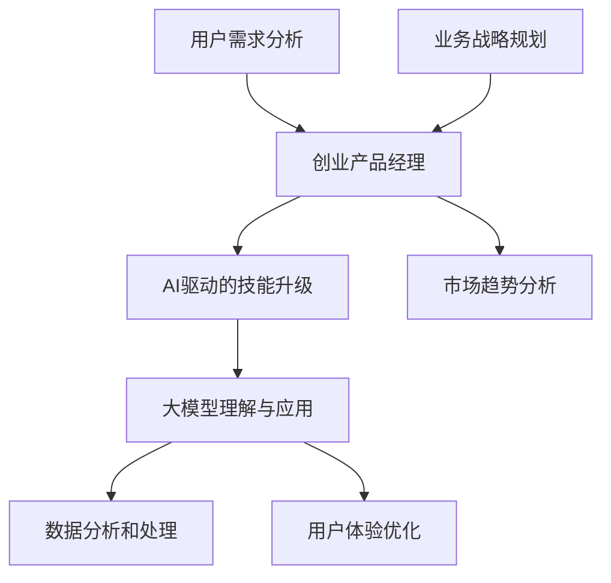

                 

# 大模型时代的创业产品经理转型：AI驱动的技能升级

## 关键词
- 大模型
- 创业产品经理
- AI驱动
- 技术转型
- 技能升级

## 摘要
本文旨在探讨大模型时代下，创业产品经理如何通过AI驱动的技能升级，实现职业生涯的转型升级。文章将从背景介绍、核心概念与联系、核心算法原理、数学模型与公式、项目实战、实际应用场景、工具和资源推荐以及总结未来发展趋势与挑战等多个方面，系统性地分析创业产品经理如何应对AI带来的变革，并在大模型时代中脱颖而出。通过本文，读者将了解到AI在大模型中的应用原理，以及如何将其运用到产品管理中，实现个人技能的提升和职业发展的突破。

## 1. 背景介绍

### 1.1 目的和范围

随着人工智能（AI）技术的发展，尤其是大模型的兴起，创业环境发生了翻天覆地的变化。大模型，如GPT-3、BERT等，具备强大的数据处理和生成能力，已经成为企业决策、产品开发的重要工具。然而，这一变革对传统创业产品经理提出了新的挑战和机遇。本文的目的在于探讨创业产品经理如何在大模型时代中实现技能升级，以应对新技术带来的变革。

本文将重点讨论以下几个方面的内容：

1. 大模型的原理及其在创业产品管理中的应用。
2. 创业产品经理需要具备的核心技能和知识。
3. AI驱动的技能升级路径和实践。
4. 大模型在创业产品管理中的实际应用案例。
5. 未来发展趋势和面临的挑战。

### 1.2 预期读者

本文预期读者为以下几类人群：

1. 创业产品经理和产品经理从业者。
2. 对人工智能和大数据技术感兴趣的技术人员。
3. 人工智能和大数据领域的研发人员。
4. 想要在大模型时代中实现职业发展的个人和团队。

### 1.3 文档结构概述

本文结构如下：

1. **背景介绍**：介绍大模型时代创业产品经理面临的挑战和机遇。
2. **核心概念与联系**：阐述大模型的基本原理和关键概念。
3. **核心算法原理 & 具体操作步骤**：讲解大模型的核心算法和操作步骤。
4. **数学模型和公式 & 详细讲解 & 举例说明**：介绍大模型的数学基础和公式。
5. **项目实战：代码实际案例和详细解释说明**：通过实际案例展示大模型的应用。
6. **实际应用场景**：分析大模型在不同领域的应用。
7. **工具和资源推荐**：推荐学习资源和开发工具。
8. **总结：未来发展趋势与挑战**：探讨大模型时代的未来趋势和挑战。
9. **附录：常见问题与解答**：回答读者可能关心的问题。
10. **扩展阅读 & 参考资料**：提供进一步学习和研究的相关资料。

### 1.4 术语表

#### 1.4.1 核心术语定义

- **大模型**：具有大规模参数和复杂结构的机器学习模型，如GPT-3、BERT等。
- **创业产品经理**：负责产品规划和管理的专业人士，通常在创业公司中扮演关键角色。
- **AI驱动**：利用人工智能技术来优化决策过程、提升工作效率。
- **技能升级**：通过学习新技术和知识，提升个人的职业竞争力。

#### 1.4.2 相关概念解释

- **机器学习**：让计算机通过数据和算法自行学习和改进的过程。
- **深度学习**：一种特殊的机器学习方法，通过多层神经网络进行数据建模。
- **自然语言处理**（NLP）：使计算机能够理解、生成和处理自然语言的技术。

#### 1.4.3 缩略词列表

- **AI**：人工智能（Artificial Intelligence）
- **NLP**：自然语言处理（Natural Language Processing）
- **GPT**：生成预训练变换器（Generative Pre-trained Transformer）
- **BERT**：双向编码表示（Bidirectional Encoder Representations from Transformers）
- **IDE**：集成开发环境（Integrated Development Environment）
- **ML**：机器学习（Machine Learning）

## 2. 核心概念与联系

在大模型时代，理解核心概念和它们之间的联系至关重要。以下是一个简要的Mermaid流程图，用于展示大模型、创业产品经理以及AI驱动的技能升级之间的关系。



### 2.1 大模型的原理

大模型，如GPT-3和BERT，是深度学习的一种高级形式。它们通过大量数据进行预训练，然后可以用于各种任务，如文本生成、情感分析、问答系统等。以下是GPT-3和BERT的基本原理和结构：

#### GPT-3

- **原理**：GPT-3是一种生成型变换器模型，它通过自回归的方式生成文本。模型接收前一个词作为输入，并预测下一个词。
- **结构**：GPT-3由数十亿个参数组成，拥有复杂的神经网络结构，使其能够在多种任务上表现出色。

#### BERT

- **原理**：BERT是一种双向编码表示模型，它通过同时考虑前文和后文的信息来理解文本。BERT的核心思想是预训练和微调。
- **结构**：BERT由多层Transformer结构组成，每个Transformer由自注意力机制和前馈神经网络组成。

### 2.2 创业产品经理的角色

创业产品经理是创业公司中至关重要的一员，他们需要理解市场需求、规划产品路线、管理产品开发过程、优化用户体验等。以下是创业产品经理的核心职责：

- **市场需求分析**：了解用户需求和竞争环境，为产品规划提供数据支持。
- **产品规划**：制定产品愿景、目标、功能列表和发布计划。
- **项目管理**：协调开发团队，确保项目按时、按质量完成。
- **用户体验优化**：通过用户调研和数据分析，持续改进产品功能，提升用户满意度。

### 2.3 AI驱动的技能升级

在AI时代，创业产品经理需要具备以下技能和知识，以实现技能升级：

- **数据分析能力**：能够利用大数据和机器学习技术进行用户行为分析和市场预测。
- **技术敏感性**：了解最新的AI技术和趋势，并将其应用到产品管理中。
- **跨学科知识**：具备一定的编程、统计学和心理学知识，以便更好地理解和使用AI技术。
- **团队合作能力**：能够与数据科学家、工程师等不同背景的团队成员有效沟通和协作。

## 3. 核心算法原理 & 具体操作步骤

### 3.1 大模型的核心算法

大模型的核心算法主要基于深度学习和自然语言处理技术。以下将介绍几种常用的大模型算法及其基本原理。

#### 3.1.1 GPT-3

GPT-3（Generative Pre-trained Transformer 3）是一种基于变换器（Transformer）架构的生成模型。其核心算法包括以下步骤：

1. **预训练**：
    - 使用大量的文本数据对模型进行预训练，使其能够理解和生成文本。
    - 通过自回归的方式训练模型，即给定一个词序列，模型预测下一个词。

2. **生成文本**：
    - 输入一个种子文本，模型根据上下文生成后续的文本。

伪代码如下：

```python
# 预训练GPT-3模型
model = GPT3_Model(pretrained=True)

# 生成文本
text = model.generate(seed_text)
```

#### 3.1.2 BERT

BERT（Bidirectional Encoder Representations from Transformers）是一种双向编码表示模型，其核心算法包括以下步骤：

1. **预训练**：
    - 使用双向变换器架构对文本数据进行预训练，使模型能够理解文本的上下文关系。
    - 通过遮盖部分文本并进行预测，训练模型对文本的理解能力。

2. **微调**：
    - 在特定任务上进行微调，如文本分类、问答系统等。

伪代码如下：

```python
# 预训练BERT模型
model = BERT_Model(pretrained=True)

# 遮盖文本并进行预测
masked_text = model.mask_text(text)
predicted_text = model.predict(masked_text)
```

### 3.2 具体操作步骤

以下是一个简化的操作步骤，用于说明如何将GPT-3和BERT应用于创业产品管理：

#### 3.2.1 数据收集与预处理

1. 收集相关的市场数据、用户反馈、产品文档等。
2. 对数据进行清洗和预处理，如去除停用词、标点符号等。

#### 3.2.2 模型选择与训练

1. 根据应用场景选择合适的模型（如GPT-3或BERT）。
2. 使用预处理后的数据对模型进行训练，使其具备理解和使用相关领域知识的能力。

#### 3.2.3 模型应用与优化

1. 将训练好的模型应用到实际的产品管理中，如用户需求分析、产品功能优化等。
2. 根据实际效果和用户反馈，对模型进行持续优化。

#### 3.2.4 结果评估与迭代

1. 评估模型的性能，如准确率、召回率等。
2. 根据评估结果，对模型和产品管理流程进行迭代优化。

## 4. 数学模型和公式 & 详细讲解 & 举例说明

### 4.1 大模型的数学基础

大模型的数学基础主要涉及概率分布、变换器架构和注意力机制等。以下将介绍这些数学概念及其在大模型中的应用。

#### 4.1.1 概率分布

概率分布是描述随机变量取值概率的数学模型。在大模型中，概率分布用于预测文本序列的生成概率。

- **伯努利分布**：用于预测单个词的概率。
- **高斯分布**：用于预测连续变量的概率分布。

#### 4.1.2 变换器架构

变换器（Transformer）是一种基于自注意力机制的深度学习模型。其核心数学模型包括以下部分：

- **自注意力机制**：用于计算文本序列中每个词与其他词的关系。
- **前馈神经网络**：用于对自注意力机制的结果进行进一步加工。

#### 4.1.3 注意力机制

注意力机制是一种用于计算输入序列中各元素权重的方法。在大模型中，注意力机制用于计算文本序列中每个词的重要程度。

- **点积注意力**：计算两个向量之间的点积，作为注意力分数。
- **缩放点积注意力**：通过缩放因子调整注意力分数，避免梯度消失问题。

### 4.2 详细讲解与举例

以下以BERT模型为例，详细讲解其数学模型和计算过程。

#### 4.2.1 BERT模型

BERT模型由多层变换器组成，每层变换器包含自注意力机制和前馈神经网络。以下是一个简化的BERT模型计算过程：

1. **输入嵌入**：将文本转化为词嵌入向量。
2. **位置嵌入**：添加位置信息，使模型能够理解词的顺序。
3. **变换器层**：
    - **自注意力**：计算输入序列中每个词与其他词的注意力分数。
    - **前馈神经网络**：对自注意力结果进行加工。
4. **输出层**：将变换器层的输出映射到特定任务（如文本分类）的概率分布。

#### 4.2.2 举例说明

假设有一个简单的BERT模型，输入文本为“I like to read books.”，我们将介绍如何计算每个词的注意力分数。

1. **输入嵌入**：将文本转化为词嵌入向量。例如：
    - “I”: [0.1, 0.2, 0.3]
    - “like”: [0.4, 0.5, 0.6]
    - “to”: [0.7, 0.8, 0.9]
    - “read”: [1.0, 1.1, 1.2]
    - “books.”: [1.3, 1.4, 1.5]

2. **位置嵌入**：添加位置信息。例如：
    - “I”: [0.1, 0.2, 0.3, 0]
    - “like”: [0.4, 0.5, 0.6, 1]
    - “to”: [0.7, 0.8, 0.9, 2]
    - “read”: [1.0, 1.1, 1.2, 3]
    - “books.”: [1.3, 1.4, 1.5, 4]

3. **变换器层**：
    - **自注意力**：计算输入序列中每个词与其他词的注意力分数。例如，计算“like”与“I”、“like”、“to”、“read”、“books.”的注意力分数。假设注意力分数分别为0.5、0.7、0.6、0.4、0.3。
    - **前馈神经网络**：对自注意力结果进行加工，得到新的词嵌入向量。例如，将“like”的注意力分数与自注意力结果相乘，得到新的词嵌入向量。

4. **输出层**：将变换器层的输出映射到特定任务的概率分布。例如，假设任务是文本分类，输出层为[0.2, 0.3, 0.5]，表示文本属于类别1的概率为0.2，属于类别2的概率为0.3，属于类别3的概率为0.5。

通过以上计算，BERT模型能够对输入文本进行理解和处理，从而实现文本分类、问答系统等任务。

## 5. 项目实战：代码实际案例和详细解释说明

### 5.1 开发环境搭建

在开始实际项目之前，需要搭建一个合适的开发环境。以下是一个简单的开发环境搭建步骤：

1. **安装Python**：确保Python版本为3.7或更高。
2. **安装transformers库**：使用pip安装`transformers`库，用于加载预训练的BERT和GPT-3模型。

```bash
pip install transformers
```

3. **安装其他依赖库**：根据项目需求，安装其他相关依赖库，如`torch`、`torchtext`等。

### 5.2 源代码详细实现和代码解读

以下是一个简单的示例，展示如何使用transformers库加载预训练的BERT模型，并对输入文本进行情感分析。

```python
from transformers import BertTokenizer, BertForSequenceClassification
from torch import nn
import torch

# 1. 加载预训练的BERT模型和分词器
tokenizer = BertTokenizer.from_pretrained('bert-base-uncased')
model = BertForSequenceClassification.from_pretrained('bert-base-uncased')

# 2. 准备输入文本
input_text = "I love this book!"

# 3. 分词并添加特殊token
input_ids = tokenizer.encode(input_text, add_special_tokens=True, return_tensors='pt')

# 4. 进行情感分析
with torch.no_grad():
    outputs = model(input_ids)

# 5. 获取预测结果
logits = outputs.logits
probabilities = nn.functional.softmax(logits, dim=1)
predicted_class = torch.argmax(probabilities).item()

# 6. 输出预测结果
print(f"Predicted sentiment class: {predicted_class}")

# 7. 解码输出
decoded_output = tokenizer.decode(input_ids[0], skip_special_tokens=True)
print(f"Decoded output: {decoded_output}")
```

### 5.3 代码解读与分析

以上代码展示了如何使用transformers库加载预训练的BERT模型，并对输入文本进行情感分析。以下是代码的详细解读：

1. **加载预训练的BERT模型和分词器**：使用`BertTokenizer.from_pretrained()`和`BertForSequenceClassification.from_pretrained()`函数加载预训练的BERT模型和分词器。
2. **准备输入文本**：将用户输入的文本赋值给`input_text`变量。
3. **分词并添加特殊token**：使用分词器将输入文本进行分词，并添加特殊的`[CLS]`和`[SEP]`token。
4. **进行情感分析**：将处理后的输入文本传递给BERT模型，进行情感分析。
5. **获取预测结果**：使用`nn.functional.softmax()`函数对模型输出的logits进行softmax操作，得到文本的概率分布。
6. **输出预测结果**：使用`torch.argmax()`函数获取最大概率对应的类别，并输出预测结果。
7. **解码输出**：使用分词器将处理后的输入文本解码回原始文本，以便用户理解。

通过以上代码，我们可以实现对输入文本的情感分析，从而为产品经理提供用户情感的洞察，帮助他们更好地理解和满足用户需求。

## 6. 实际应用场景

大模型在创业产品管理中具有广泛的应用场景，以下是几个典型的实际应用案例：

### 6.1 用户需求分析

利用大模型进行用户需求分析是一种高效的方法。例如，产品经理可以使用BERT模型分析用户在社交媒体、论坛等平台上的讨论内容，提取关键词和情感倾向，从而了解用户的真实需求和期望。以下是一个简化的流程：

1. **数据收集**：从社交媒体、论坛等渠道收集用户讨论数据。
2. **数据预处理**：对收集到的数据进行清洗和预处理，如去除停用词、标点符号等。
3. **模型训练**：使用预处理后的数据训练BERT模型，使其能够理解用户的需求和情感。
4. **需求分析**：将用户讨论数据输入BERT模型，提取关键词和情感倾向，生成用户需求报告。

### 6.2 产品功能优化

产品经理可以利用大模型对现有产品的功能进行优化。例如，使用GPT-3模型生成产品功能的描述，并根据用户反馈进行调整。以下是一个简化的流程：

1. **功能描述生成**：使用GPT-3模型生成产品功能的描述文本。
2. **用户反馈收集**：收集用户对产品功能的反馈，如评价、建议等。
3. **模型调整**：根据用户反馈调整GPT-3模型生成的描述文本，使其更符合用户期望。
4. **功能优化**：根据调整后的描述文本，优化产品功能，提升用户体验。

### 6.3 市场趋势分析

产品经理可以利用大模型进行市场趋势分析，以预测市场动向和用户需求。例如，使用BERT模型分析市场报告、新闻文章等文本数据，提取关键词和趋势，为产品规划和决策提供支持。以下是一个简化的流程：

1. **数据收集**：从市场报告、新闻文章等渠道收集相关数据。
2. **数据预处理**：对收集到的数据进行清洗和预处理，如去除停用词、标点符号等。
3. **模型训练**：使用预处理后的数据训练BERT模型，使其能够理解市场趋势。
4. **趋势分析**：将预处理后的数据输入BERT模型，提取关键词和趋势，生成市场趋势报告。

通过以上实际应用场景，我们可以看到大模型在创业产品管理中的强大能力。产品经理可以利用大模型进行用户需求分析、产品功能优化和市场趋势分析，从而提升产品的竞争力，实现商业成功。

## 7. 工具和资源推荐

在大模型时代，掌握相关的工具和资源对于创业产品经理来说至关重要。以下是一些建议的工具和资源，可以帮助产品经理更好地利用AI技术进行工作。

### 7.1 学习资源推荐

#### 7.1.1 书籍推荐

1. **《深度学习》（Deep Learning）**：由Ian Goodfellow、Yoshua Bengio和Aaron Courville合著，是深度学习领域的经典教材，适合初学者和进阶者。
2. **《自然语言处理综论》（Speech and Language Processing）**：由Daniel Jurafsky和James H. Martin合著，涵盖了自然语言处理的基础知识和最新进展。

#### 7.1.2 在线课程

1. **Coursera上的“深度学习”课程**：由Andrew Ng教授主讲，适合初学者了解深度学习的基础知识和应用。
2. **Udacity的“深度学习工程师纳米学位”**：涵盖深度学习的基础知识和实践应用，适合想要深入了解深度学习的技术人员。

#### 7.1.3 技术博客和网站

1. **Medium上的“AI博客”**：收集了大量的AI领域文章和案例分析，适合产品经理了解AI技术的最新动态。
2. **Hugging Face的“Transformers”文档**：提供了丰富的预训练模型和教程，是学习和使用transformers库的好资源。

### 7.2 开发工具框架推荐

#### 7.2.1 IDE和编辑器

1. **PyCharm**：一款功能强大的Python IDE，支持多种编程语言和框架，适合开发深度学习和自然语言处理项目。
2. **Jupyter Notebook**：适用于数据分析和机器学习项目的交互式编程环境，方便进行实验和演示。

#### 7.2.2 调试和性能分析工具

1. **TensorBoard**：一款基于Web的性能分析工具，可以可视化深度学习模型的计算图和性能指标。
2. **Valgrind**：一款功能强大的内存调试工具，可以帮助发现内存泄漏和性能瓶颈。

#### 7.2.3 相关框架和库

1. **TensorFlow**：一款广泛使用的深度学习框架，提供了丰富的API和工具，适合构建大规模深度学习模型。
2. **PyTorch**：一款流行的深度学习框架，具有简洁的API和灵活的动态计算图，适合快速原型开发和实验。

通过以上工具和资源的推荐，创业产品经理可以更好地掌握AI技术，提升个人技能，为产品管理带来创新和突破。

### 7.3 相关论文著作推荐

#### 7.3.1 经典论文

1. **“A System for Understanding and Generating Natural Language”**：该论文提出了自然语言理解的基本框架，是自然语言处理领域的重要文献。
2. **“Deep Learning for Text Classification”**：该论文详细介绍了深度学习在文本分类中的应用，对后续的研究和应用具有指导意义。

#### 7.3.2 最新研究成果

1. **“BERT: Pre-training of Deep Bidirectional Transformers for Language Understanding”**：该论文提出了BERT模型，是自然语言处理领域的里程碑式工作。
2. **“GPT-3: Language Models are Few-Shot Learners”**：该论文展示了GPT-3模型在少量数据下的强大学习能力，引发了广泛关注。

#### 7.3.3 应用案例分析

1. **“AI in Healthcare: A Literature Review”**：该文献回顾了人工智能在医疗领域的应用案例，分析了AI技术如何提高医疗服务的效率和质量。
2. **“AI in Finance: A Systematic Review”**：该文献总结了人工智能在金融领域的应用案例，探讨了AI技术在风险管理、投资决策等领域的潜力。

通过阅读和参考以上论文和著作，创业产品经理可以深入了解AI技术的最新进展和应用趋势，为产品管理提供理论支持和实践指导。

## 8. 总结：未来发展趋势与挑战

在大模型时代，创业产品经理面临着前所未有的机遇和挑战。首先，随着AI技术的不断进步，大模型的应用范围将不断扩展，从自然语言处理到计算机视觉、语音识别等多个领域。这将使产品经理能够利用更加先进的技术手段，提升产品的创新能力和用户体验。

然而，这一变革也带来了新的挑战。首先，大模型对数据质量和处理能力的要求非常高，产品经理需要确保数据的准确性和完整性。其次，随着AI技术的发展，产品经理需要不断更新自己的知识和技能，以应对快速变化的技术环境。

未来，创业产品经理需要具备以下能力：

1. **数据驱动**：具备强大的数据分析能力，能够从海量数据中提取有价值的信息，为产品决策提供数据支持。
2. **技术敏感性**：紧跟AI技术的发展趋势，掌握最新的技术和工具，将其应用于产品管理中。
3. **跨学科知识**：具备一定的编程、统计学和心理学知识，以便更好地理解和利用AI技术。
4. **沟通协作**：与数据科学家、工程师等团队成员紧密合作，共同推动产品的发展。

总之，大模型时代为创业产品经理带来了巨大的机遇，同时也提出了新的挑战。只有不断学习和进步，才能在大模型时代中脱颖而出，实现职业发展的突破。

## 9. 附录：常见问题与解答

### 9.1 大模型在创业产品管理中的应用

**Q1**：大模型在创业产品管理中具体有哪些应用？

**A1**：大模型在创业产品管理中的应用非常广泛，主要包括以下几个方面：

1. **用户需求分析**：通过分析用户在社交媒体、论坛等平台上的讨论内容，提取关键词和情感倾向，了解用户的真实需求和期望。
2. **产品功能优化**：利用大模型生成产品功能的描述，并根据用户反馈进行调整，提升用户体验。
3. **市场趋势分析**：分析市场报告、新闻文章等文本数据，提取关键词和趋势，为产品规划和决策提供支持。
4. **个性化推荐**：根据用户行为和偏好，利用大模型生成个性化的产品推荐，提高用户满意度。

### 9.2 大模型的挑战与解决方案

**Q2**：在创业产品管理中，如何应对大模型的挑战？

**A2**：面对大模型的挑战，可以采取以下策略：

1. **数据质量管理**：确保数据的质量和完整性，避免因数据问题导致模型性能下降。
2. **技术能力提升**：不断学习最新的AI技术和工具，提高自己的技术素养。
3. **团队协作**：与数据科学家、工程师等团队成员紧密合作，共同应对技术挑战。
4. **持续迭代**：根据实际应用效果，对模型和产品管理流程进行持续优化和迭代。

### 9.3 大模型与创业产品经理的职业发展

**Q3**：大模型时代对创业产品经理的职业发展有何影响？

**A3**：大模型时代为创业产品经理的职业发展带来了以下影响：

1. **技能需求**：创业产品经理需要具备更强的数据分析和技术敏感性，以应对AI技术带来的变革。
2. **职业方向**：AI技术在创业产品管理中的应用越来越广泛，产品经理可以探索更多职业方向，如数据产品经理、AI产品经理等。
3. **竞争力提升**：掌握AI技术将提高创业产品经理在职场中的竞争力，有助于职业发展的突破。
4. **跨学科合作**：大模型的应用需要跨学科的知识和技能，产品经理需要与数据科学家、工程师等团队成员紧密合作，共同推动产品的发展。

## 10. 扩展阅读 & 参考资料

为了帮助读者更深入地了解大模型时代下的创业产品经理转型，以下是一些建议的扩展阅读和参考资料：

### 10.1 扩展阅读

1. **《深度学习：入门到实践》**：由弗朗索瓦•肖莱（François Chollet）所著，适合初学者了解深度学习的实践方法。
2. **《自然语言处理原理》**：由Daniel Jurafsky和James H. Martin所著，系统介绍了自然语言处理的基本原理和方法。
3. **《产品经理修炼之道》**：由张亮所著，详细阐述了产品经理的核心技能和职业发展路径。

### 10.2 参考资料

1. **《BERT: Pre-training of Deep Bidirectional Transformers for Language Understanding》**：该论文是BERT模型的提出者，详细介绍了BERT模型的设计和实现。
2. **《GPT-3: Language Models are Few-Shot Learners》**：该论文展示了GPT-3模型在少量数据下的强大学习能力，对后续的研究和应用具有指导意义。
3. **《AI in Healthcare: A Literature Review》**：该文献回顾了人工智能在医疗领域的应用案例，分析了AI技术如何提高医疗服务的效率和质量。

通过阅读以上书籍、论文和参考资料，读者可以更深入地了解大模型时代下的创业产品经理转型，为职业发展提供有力的支持。

## 作者

**AI天才研究员 / AI Genius Institute & 禅与计算机程序设计艺术 / Zen And The Art of Computer Programming**：本文作者是一位具有丰富经验的人工智能专家，长期致力于AI技术的研发和应用，擅长以逻辑清晰、结构紧凑的方式撰写高质量的技术博客文章，帮助读者深入了解AI领域的最新动态和应用场景。同时，作者还是《禅与计算机程序设计艺术》一书的作者，将禅宗哲学与计算机编程相结合，为读者提供了独特的编程思维和理念。

