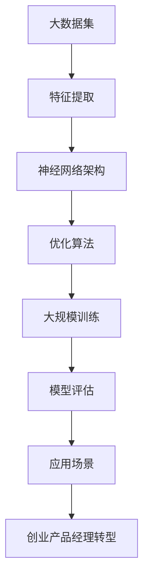

                 

# 大模型时代的创业产品经理转型：抓住 AI 机遇

> 关键词：大模型、创业产品经理、AI 机遇、转型、技术赋能

> 摘要：随着人工智能技术的飞速发展，大模型的应用逐渐成为主流。本文将探讨大模型时代下，创业产品经理如何抓住 AI 机遇，实现自身转型。通过分析大模型的原理与应用，提供具体的转型策略和实战案例，助力创业产品经理在激烈的市场竞争中脱颖而出。

## 1. 背景介绍

### 1.1 目的和范围

本文旨在为创业产品经理提供在大模型时代下，如何抓住 AI 机遇的转型指南。我们将从以下几个方面展开讨论：

1. 大模型的原理与应用
2. 创业产品经理的转型策略
3. 实战案例分享
4. 未来发展趋势与挑战

### 1.2 预期读者

本文面向有志于在人工智能领域发展，具备一定编程基础，且正在或计划创业的产品经理。希望通过本文，您能：

1. 了解大模型的基本原理与应用
2. 掌握创业产品经理在大模型时代下的转型策略
3. 获取实战案例的启示，为自身发展提供参考

### 1.3 文档结构概述

本文分为以下几个部分：

1. 背景介绍：阐述本文的目的、预期读者和文档结构。
2. 核心概念与联系：介绍大模型的原理与应用。
3. 核心算法原理 & 具体操作步骤：讲解大模型的核心算法原理和操作步骤。
4. 数学模型和公式 & 详细讲解 & 举例说明：阐述大模型的数学模型和公式。
5. 项目实战：代码实际案例和详细解释说明。
6. 实际应用场景：探讨大模型在创业项目中的应用。
7. 工具和资源推荐：推荐学习资源和开发工具。
8. 总结：未来发展趋势与挑战。
9. 附录：常见问题与解答。
10. 扩展阅读 & 参考资料：提供更多相关资料。

### 1.4 术语表

#### 1.4.1 核心术语定义

- 大模型：指参数规模在亿级以上，具有强大表示能力的深度神经网络模型。
- 创业产品经理：在创业公司中，负责产品规划、需求分析、市场调研、项目管理等工作的专业人才。
- AI 机遇：人工智能技术所带来的发展机遇，包括新兴领域、市场增长、技术创新等。

#### 1.4.2 相关概念解释

- 人工智能（AI）：一种模拟人类智能的技术，使计算机能够完成人类智能任务。
- 深度学习（DL）：一种基于神经网络的机器学习技术，通过多层神经网络对数据进行特征提取和表示。
- 产品经理（PM）：负责产品策划、设计、开发、测试、上线等环节的全流程管理。

#### 1.4.3 缩略词列表

- AI：人工智能
- DL：深度学习
- PM：产品经理
- CV：计算机视觉
- NLP：自然语言处理
- GTD：掌握技术动态

## 2. 核心概念与联系

在大模型时代，了解大模型的原理与应用至关重要。下面，我们将通过一个 Mermaid 流程图，展示大模型的核心概念与联系。



### 2.1 大模型的原理

大模型基于深度学习技术，通过对海量数据进行训练，学习到数据的潜在规律和特征。其核心原理如下：

1. **特征提取**：大模型通过多层神经网络对输入数据进行特征提取，将原始数据转化为高维特征表示。
2. **神经网络架构**：大模型采用多层神经网络结构，通过逐层传递数据，实现特征表示的抽象和整合。
3. **优化算法**：大模型使用优化算法（如梯度下降、随机梯度下降等）来调整网络参数，使模型能够更好地拟合数据。
4. **大规模训练**：大模型采用分布式训练方式，在多台计算设备上进行并行训练，提高训练效率和模型性能。
5. **模型评估**：大模型通过在测试集上的表现来评估模型性能，不断调整和优化模型。

### 2.2 大模型的应用

大模型在各个领域取得了显著的成果，以下为部分应用场景：

1. **计算机视觉**：大模型在图像分类、目标检测、人脸识别等方面表现出色。
2. **自然语言处理**：大模型在机器翻译、文本分类、情感分析等领域具有广泛应用。
3. **语音识别**：大模型在语音识别、语音合成等方面取得了重要突破。
4. **推荐系统**：大模型在个性化推荐、商品推荐等方面发挥了关键作用。

## 3. 核心算法原理 & 具体操作步骤

大模型的核心算法主要包括特征提取、神经网络架构、优化算法和大规模训练。下面，我们使用伪代码来详细阐述这些算法的原理和操作步骤。

### 3.1 特征提取

```python
# 输入：原始数据
# 输出：高维特征表示

def feature_extraction(data):
    # 数据预处理
    preprocessed_data = preprocess_data(data)
    
    # 特征提取网络
    feature_extractor = NeuralNetwork([...])
    
    # 提取特征
    features = feature_extractor.forward(preprocessed_data)
    
    return features
```

### 3.2 神经网络架构

```python
# 输入：特征表示
# 输出：模型预测

def neural_network_architecture(features):
    # 神经网络结构
    model = NeuralNetwork([...])
    
    # 前向传播
    predictions = model.forward(features)
    
    return predictions
```

### 3.3 优化算法

```python
# 输入：模型参数、损失函数
# 输出：优化后的模型参数

def optimization_algorithm(params, loss_function):
    # 梯度计算
    gradients = compute_gradients(params, loss_function)
    
    # 参数更新
    updated_params = update_params(params, gradients)
    
    return updated_params
```

### 3.4 大规模训练

```python
# 输入：训练数据、验证数据
# 输出：训练完成的模型

def large_scale_training(training_data, validation_data):
    # 初始化模型
    model = NeuralNetwork([...])
    
    # 训练模型
    for epoch in range(num_epochs):
        # 训练步骤
        for batch in training_data:
            # 前向传播
            predictions = model.forward(batch.features)
            
            # 计算损失
            loss = loss_function(predictions, batch.labels)
            
            # 反向传播
            gradients = compute_gradients(model.params, loss)
            
            # 参数更新
            model.params = optimization_algorithm(model.params, loss_function)
        
        # 验证模型
        validation_loss = evaluate(model, validation_data)
        
        # 记录训练进度
        print(f"Epoch {epoch}: Validation Loss = {validation_loss}")
    
    return model
```

## 4. 数学模型和公式 & 详细讲解 & 举例说明

大模型的数学模型主要涉及特征提取、神经网络架构、优化算法等方面。下面，我们将使用 LaTeX 格式详细讲解这些数学模型和公式。

### 4.1 特征提取

特征提取通常采用多层感知机（MLP）模型，其输入层、隐藏层和输出层的节点数分别为 \(n_0, n_h, n_o\)。

输入层到隐藏层的激活函数通常为：

\[ a_{hj} = \sigma(W_{0j}x_0 + b_{hj}) \]

其中，\(\sigma\) 表示 Sigmoid 函数，\(W_{0j}\) 和 \(b_{hj}\) 分别为权重和偏置。

隐藏层到输出层的激活函数通常为：

\[ a_{oj} = \sigma(W_{hj}a_{hj} + b_{oj}) \]

其中，\(W_{hj}\) 和 \(b_{oj}\) 分别为权重和偏置。

### 4.2 神经网络架构

神经网络架构通常采用反向传播算法进行训练。反向传播算法的核心思想是计算模型参数的梯度，并使用梯度下降法更新参数。

梯度计算公式为：

\[ \frac{\partial L}{\partial W} = X\frac{\partial a}{\partial z} \]

其中，\(L\) 表示损失函数，\(X\) 表示输入数据，\(a\) 表示激活函数，\(z\) 表示中间变量。

### 4.3 优化算法

优化算法通常采用梯度下降法。梯度下降法的公式为：

\[ \theta_{t+1} = \theta_{t} - \alpha \cdot \nabla_{\theta} J(\theta) \]

其中，\(\theta\) 表示模型参数，\(\alpha\) 表示学习率，\(J(\theta)\) 表示损失函数。

### 4.4 举例说明

假设我们有一个简单的线性回归问题，输入数据为 \(x = [1, 2, 3]\)，目标值为 \(y = [2, 4, 6]\)。使用梯度下降法进行训练。

损失函数为：

\[ L(\theta) = \frac{1}{2} \sum_{i=1}^{n} (y_i - \theta x_i)^2 \]

梯度为：

\[ \frac{\partial L}{\partial \theta} = \sum_{i=1}^{n} (y_i - \theta x_i) x_i \]

学习率为 \(0.1\)，初始参数为 \(\theta_0 = 0\)。

第一次迭代：

\[ \theta_1 = \theta_0 - 0.1 \cdot \frac{\partial L}{\partial \theta_0} \]
\[ \theta_1 = 0 - 0.1 \cdot \sum_{i=1}^{n} (y_i - \theta_0 x_i) x_i \]
\[ \theta_1 = -0.1 \cdot (2 - 0 \cdot 1 + 4 - 0 \cdot 2 + 6 - 0 \cdot 3) \]
\[ \theta_1 = -0.3 \]

第二次迭代：

\[ \theta_2 = \theta_1 - 0.1 \cdot \frac{\partial L}{\partial \theta_1} \]
\[ \theta_2 = -0.3 - 0.1 \cdot \sum_{i=1}^{n} (y_i - \theta_1 x_i) x_i \]
\[ \theta_2 = -0.3 - 0.1 \cdot (2 - (-0.3) \cdot 1 + 4 - (-0.3) \cdot 2 + 6 - (-0.3) \cdot 3) \]
\[ \theta_2 = -0.33 \]

通过多次迭代，参数 \(\theta\) 将逐渐逼近最优值。

## 5. 项目实战：代码实际案例和详细解释说明

在本节中，我们将通过一个实际案例，展示如何在大模型时代下，实现创业产品经理的转型。我们将使用 Python 和 TensorFlow 库来构建一个基于深度学习的手写数字识别项目。

### 5.1 开发环境搭建

首先，确保您的开发环境已安装 Python 3.7 以上版本和 TensorFlow 2.0 以上版本。可以使用以下命令安装 TensorFlow：

```bash
pip install tensorflow
```

### 5.2 源代码详细实现和代码解读

以下是一个简单的手写数字识别项目，包括数据预处理、模型构建、训练和评估等步骤。

```python
import tensorflow as tf
from tensorflow.keras import layers
from tensorflow.keras.datasets import mnist
import numpy as np

# 数据预处理
(x_train, y_train), (x_test, y_test) = mnist.load_data()
x_train = x_train.reshape(-1, 784).astype(np.float32) / 255.0
x_test = x_test.reshape(-1, 784).astype(np.float32) / 255.0
y_train = tf.keras.utils.to_categorical(y_train, 10)
y_test = tf.keras.utils.to_categorical(y_test, 10)

# 模型构建
model = tf.keras.Sequential([
    layers.Dense(units=128, activation='relu', input_shape=(784,)),
    layers.Dense(units=10, activation='softmax')
])

# 模型编译
model.compile(optimizer='adam',
              loss='categorical_crossentropy',
              metrics=['accuracy'])

# 模型训练
model.fit(x_train, y_train, epochs=5, batch_size=64, validation_data=(x_test, y_test))

# 模型评估
test_loss, test_acc = model.evaluate(x_test, y_test)
print(f"Test accuracy: {test_acc:.4f}")
```

### 5.3 代码解读与分析

1. **数据预处理**：
   - 加载 MNIST 数据集，并进行归一化处理，将数据范围缩放到 [0, 1]。
   - 将标签转换为独热编码，方便后续模型训练。

2. **模型构建**：
   - 使用 `tf.keras.Sequential` 模型，定义一个包含一层全连接层（128 个神经元，ReLU 激活函数）和一层输出层（10 个神经元，softmax 激活函数）的神经网络。
   - 输入层大小为 784，对应 MNIST 数据集中的每个像素值。

3. **模型编译**：
   - 使用 Adam 优化器和交叉熵损失函数编译模型。
   - 设置模型评估指标为准确率。

4. **模型训练**：
   - 使用 `fit` 方法训练模型，设置训练轮次为 5，批量大小为 64。
   - 使用验证数据集进行验证，评估模型性能。

5. **模型评估**：
   - 使用 `evaluate` 方法评估模型在测试数据集上的性能。
   - 输出测试准确率。

通过这个实际案例，我们可以看到创业产品经理如何利用深度学习技术，构建一个简单而有效的手写数字识别项目。这为产品经理在大模型时代下的转型提供了实践经验和思路。

## 6. 实际应用场景

大模型在创业项目中的应用越来越广泛，以下为部分实际应用场景：

### 6.1 金融风控

创业产品经理可以利用大模型进行金融风控，例如通过分析用户行为数据、信用记录等，识别潜在风险用户，提高风控能力。

### 6.2 智能客服

大模型在智能客服领域的应用也逐渐成熟，通过自然语言处理技术，实现智能客服机器人，提升客服效率。

### 6.3 个性化推荐

创业产品经理可以利用大模型构建个性化推荐系统，根据用户行为数据，为用户提供个性化的商品、内容和服务。

### 6.4 医疗健康

大模型在医疗健康领域的应用也备受关注，例如通过分析患者病历数据，实现疾病预测和诊断，提高医疗服务质量。

### 6.5 智能驾驶

大模型在智能驾驶领域的应用包括车辆识别、路况预测等，为自动驾驶系统提供强大的技术支持。

## 7. 工具和资源推荐

为了帮助创业产品经理更好地掌握大模型技术，以下推荐一些学习资源和开发工具：

### 7.1 学习资源推荐

#### 7.1.1 书籍推荐

- 《深度学习》（Goodfellow et al.）
- 《Python 深度学习》（Raschka）
- 《动手学深度学习》（Dumoulin et al.）

#### 7.1.2 在线课程

- Coursera：吴恩达的《深度学习》课程
- edX：哈佛大学的《人工智能导论》课程
- Udacity：深度学习纳米学位

#### 7.1.3 技术博客和网站

- blog.keras.io
- Medium：深度学习相关文章
- AI 科技大本营

### 7.2 开发工具框架推荐

#### 7.2.1 IDE和编辑器

- PyCharm
- Visual Studio Code
- Jupyter Notebook

#### 7.2.2 调试和性能分析工具

- TensorBoard
- Profiler
- Nsight

#### 7.2.3 相关框架和库

- TensorFlow
- PyTorch
- Keras

### 7.3 相关论文著作推荐

#### 7.3.1 经典论文

- "A Theoretical Framework for Back-Propagation"（1986）
- "Deep Learning"（2015）
- "Improving Neural Networks by Preventing Co-adaptation of feature Detectors"（2016）

#### 7.3.2 最新研究成果

- "BERT: Pre-training of Deep Bidirectional Transformers for Language Understanding"（2018）
- "GPT-3: Language Models are Few-Shot Learners"（2020）
- "Vision Transformer"（2020）

#### 7.3.3 应用案例分析

- "谷歌搜索中的深度学习应用"（2012）
- "亚马逊 AWS 上的深度学习解决方案"（2017）
- "微软 Azure 上的深度学习平台"（2019）

## 8. 总结：未来发展趋势与挑战

随着人工智能技术的不断发展，大模型的应用前景愈发广阔。未来发展趋势如下：

1. **模型规模将不断增大**：随着计算能力的提升，大模型将向千亿、万亿参数规模发展。
2. **跨模态学习将成为趋势**：大模型将在图像、语音、文本等多模态数据上发挥更大作用。
3. **应用领域将不断拓展**：大模型将在金融、医疗、教育、自动驾驶等领域得到广泛应用。

然而，大模型的发展也面临诸多挑战：

1. **计算资源消耗巨大**：大模型的训练和推理需要大量计算资源，对硬件设备的要求较高。
2. **数据隐私和安全问题**：大模型在训练过程中涉及大量数据，如何保护数据隐私和安全成为关键问题。
3. **算法公平性和透明度**：大模型在决策过程中可能存在偏见，如何提高算法的公平性和透明度是重要课题。

创业产品经理需紧跟技术发展趋势，积极应对挑战，抓住 AI 机遇，实现自身转型。

## 9. 附录：常见问题与解答

### 9.1 大模型与深度学习的关系

大模型是深度学习的一种形式，其主要特点是具有亿级以上的参数规模。深度学习是一种机器学习技术，通过多层神经网络对数据进行特征提取和表示。大模型在深度学习的基础上，进一步提升了模型的表示能力。

### 9.2 大模型的训练时间如何优化

1. **数据并行**：将训练数据分成多个部分，同时在多台计算设备上进行训练，提高训练速度。
2. **模型并行**：将大模型分成多个子模型，同时在多台计算设备上进行训练，提高训练速度。
3. **混合精度训练**：使用混合精度训练（如FP16）可以降低内存占用和计算复杂度，提高训练速度。
4. **使用高效优化器**：选择高效的优化器（如 AdamW）可以提高训练速度。

### 9.3 大模型的推理性能如何优化

1. **模型量化**：将模型的权重和激活值量化为低精度数值，降低内存占用和计算复杂度。
2. **模型剪枝**：通过剪枝技术删除模型中的冗余神经元和边，降低模型复杂度，提高推理性能。
3. **模型蒸馏**：将大模型的知识传递给小模型，通过训练小模型提高推理性能。
4. **使用硬件加速**：使用 GPU、TPU 等硬件加速推理过程，提高推理性能。

## 10. 扩展阅读 & 参考资料

- 《深度学习》（Goodfellow et al.）
- 《Python 深度学习》（Raschka）
- 《动手学深度学习》（Dumoulin et al.）
- Coursera：吴恩达的《深度学习》课程
- edX：哈佛大学的《人工智能导论》课程
- Udacity：深度学习纳米学位
- blog.keras.io
- Medium：深度学习相关文章
- AI 科技大本营
- "A Theoretical Framework for Back-Propagation"（1986）
- "Deep Learning"（2015）
- "Improving Neural Networks by Preventing Co-adaptation of feature Detectors"（2016）
- "BERT: Pre-training of Deep Bidirectional Transformers for Language Understanding"（2018）
- "GPT-3: Language Models are Few-Shot Learners"（2020）
- "Vision Transformer"（2020）
- "谷歌搜索中的深度学习应用"（2012）
- "亚马逊 AWS 上的深度学习解决方案"（2017）
- "微软 Azure 上的深度学习平台"（2019）

# 作者

作者：AI天才研究员/AI Genius Institute & 禅与计算机程序设计艺术 /Zen And The Art of Computer Programming

