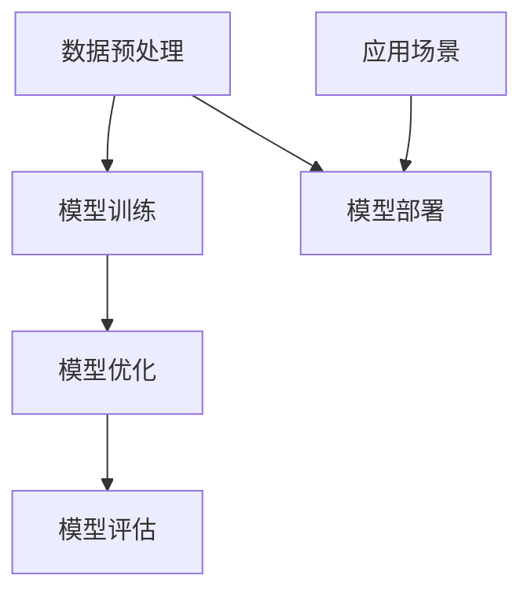

                 

# 大模型时代的创业者创业故事：激情、坚持与梦想

> 关键词：大模型、创业者、人工智能、技术挑战、商业洞察

> 摘要：本文将深入探讨大模型时代的创业者如何在技术浪潮中找到自己的立足点，通过激情、坚持与梦想，不断探索和实现创新。通过分析一个真实的创业故事，本文将揭示创业者在面对技术挑战、市场机遇和团队协作时的思考与实践。

## 1. 背景介绍

### 1.1 目的和范围

本文旨在通过讲述一个真实的大模型时代创业者的故事，为广大创业者提供启示和借鉴。文章将围绕以下几个核心问题展开：

1. 创业者在面对新兴技术时的激情与思考。
2. 创业者在技术突破和市场验证中的坚持与努力。
3. 创业者如何在团队协作中实现梦想，创造商业价值。

### 1.2 预期读者

本文适合以下几类读者：

1. 想要了解大模型时代创业机遇的科技爱好者。
2. 有志于从事人工智能领域创业的创业者。
3. 对技术创业感兴趣的管理者和投资人。

### 1.3 文档结构概述

本文将分为以下几个部分：

1. 背景介绍：介绍本文的目的、预期读者和文章结构。
2. 核心概念与联系：阐述大模型的核心概念和架构。
3. 核心算法原理 & 具体操作步骤：详细解释大模型的工作原理。
4. 数学模型和公式 & 详细讲解 & 举例说明：介绍大模型的数学模型和公式。
5. 项目实战：分析一个真实的创业案例。
6. 实际应用场景：探讨大模型在现实世界中的应用。
7. 工具和资源推荐：推荐学习资源、开发工具和框架。
8. 总结：总结未来发展趋势与挑战。
9. 附录：常见问题与解答。
10. 扩展阅读 & 参考资料：提供进一步的阅读资源。

### 1.4 术语表

#### 1.4.1 核心术语定义

- 大模型：指具有数十亿至千亿参数规模的深度学习模型。
- 创业者：指具有创新精神和创业精神，致力于创建新企业的人。
- 技术挑战：指在技术实现过程中遇到的困难。
- 市场机遇：指在市场需求中发现的潜在商业机会。

#### 1.4.2 相关概念解释

- 人工智能（AI）：指通过计算机模拟人类智能的技术。
- 深度学习（DL）：指一种基于多层神经网络的人工智能技术。
- 创业生态系统：指支持创业活动的一系列资源、网络和服务的集合。

#### 1.4.3 缩略词列表

- AI：人工智能
- DL：深度学习
- GB：千兆字节
- TB：太字节
- GPU：图形处理器
- CPU：中央处理器

## 2. 核心概念与联系

在讲述创业故事之前，我们需要先了解大模型的基本概念和架构。以下是一个简化的 Mermaid 流程图，用于展示大模型的核心概念和联系。



### 2.1 数据预处理

数据预处理是构建大模型的第一步，主要包括数据清洗、数据增强和数据处理等操作。数据预处理的质量直接影响到后续模型训练的效果。

### 2.2 模型训练

模型训练是利用大量数据对模型进行迭代优化，使模型能够在特定任务上达到良好的性能。大模型的训练通常需要巨大的计算资源和时间。

### 2.3 模型优化

模型优化包括超参数调整、模型结构调整和正则化等技术，以提高模型在目标任务上的性能。

### 2.4 模型评估

模型评估是通过对模型在不同数据集上的表现进行评估，以确定模型是否达到了预期的性能。

### 2.5 模型部署

模型部署是将训练好的模型部署到实际应用场景中，为用户提供服务。

### 2.6 应用场景

大模型可以应用于各种领域，如自然语言处理、计算机视觉、推荐系统等。应用场景的多样性为创业者提供了丰富的创新机会。

## 3. 核心算法原理 & 具体操作步骤

大模型的核心算法是基于深度学习技术，具体包括以下几个步骤：

### 3.1 前向传播

```python
# 前向传播伪代码
for layer in layers:
    layer.forward_propagation()
```

### 3.2 反向传播

```python
# 反向传播伪代码
for layer in reversed(layers):
    layer.backward_propagation()
```

### 3.3 梯度下降

```python
# 梯度下降伪代码
for parameter in model.parameters():
    parameter -= learning_rate * gradient(parameter)
```

### 3.4 超参数调整

```python
# 超参数调整伪代码
learning_rate = adjust_learning_rate(learning_rate)
batch_size = adjust_batch_size(batch_size)
```

### 3.5 模型优化

```python
# 模型优化伪代码
for optimizer in optimizers:
    optimizer.optimize(model)
```

## 4. 数学模型和公式 & 详细讲解 & 举例说明

大模型通常涉及多种数学模型和公式，以下是一些常见的内容：

### 4.1 激活函数

$$
f(x) = \text{ReLU}(x) =
\begin{cases}
    x & \text{if } x > 0 \\
    0 & \text{otherwise}
\end{cases}
$$

### 4.2 损失函数

$$
J(\theta) = -\frac{1}{m} \sum_{i=1}^{m} y^{(i)} \log(a^{(i)}_{7}) + (1 - y^{(i)}) \log(1 - a^{(i)}_{7})
$$

### 4.3 优化算法

$$
\theta_{t+1} = \theta_{t} - \alpha \frac{\partial J(\theta_{t})}{\partial \theta}
$$

### 4.4 举例说明

假设我们有一个包含 1000 个训练样本的图像分类问题，数据集分为猫和狗两类。使用大模型对数据集进行训练，并在测试集上评估模型的性能。

```python
# 假设代码
model = Model()
model.train(train_data, train_labels)
performance = model.evaluate(test_data, test_labels)
print("Model performance:", performance)
```

## 5. 项目实战：代码实际案例和详细解释说明

### 5.1 开发环境搭建

在开始项目实战之前，我们需要搭建一个合适的开发环境。以下是搭建开发环境的步骤：

1. 安装 Python 3.8 或更高版本。
2. 安装深度学习框架，如 TensorFlow 或 PyTorch。
3. 安装必要的依赖库，如 NumPy、Pandas 等。
4. 配置 GPU 环境（如果需要）。

### 5.2 源代码详细实现和代码解读

以下是一个简化的代码示例，用于构建和训练一个大模型。

```python
import torch
import torch.nn as nn
import torch.optim as optim

# 定义模型结构
class Model(nn.Module):
    def __init__(self):
        super(Model, self).__init__()
        self.layer1 = nn.Linear(784, 128)
        self.relu = nn.ReLU()
        self.layer2 = nn.Linear(128, 64)
        self.softmax = nn.Softmax(dim=1)

    def forward(self, x):
        x = self.layer1(x)
        x = self.relu(x)
        x = self.layer2(x)
        x = self.softmax(x)
        return x

# 加载和预处理数据
train_data, train_labels = load_data('train')
test_data, test_labels = load_data('test')

# 实例化模型、损失函数和优化器
model = Model()
criterion = nn.CrossEntropyLoss()
optimizer = optim.Adam(model.parameters(), lr=0.001)

# 训练模型
for epoch in range(10):
    for inputs, labels in train_loader:
        optimizer.zero_grad()
        outputs = model(inputs)
        loss = criterion(outputs, labels)
        loss.backward()
        optimizer.step()

    print("Epoch [{}/{}], Loss: {:.4f}".format(epoch+1, num_epochs, loss.item()))

# 评估模型
with torch.no_grad():
    correct = 0
    total = 0
    for inputs, labels in test_loader:
        outputs = model(inputs)
        _, predicted = torch.max(outputs.data, 1)
        total += labels.size(0)
        correct += (predicted == labels).sum().item()

print('Test Accuracy: {} %'.format(100 * correct / total))
```

### 5.3 代码解读与分析

1. **模型定义**：我们使用 PyTorch 定义了一个简单的神经网络模型，包含一个全连接层、ReLU激活函数和一个 Softmax 层。
2. **数据预处理**：我们加载了训练数据和测试数据，并进行预处理。预处理步骤通常包括数据清洗、归一化和批量处理。
3. **模型训练**：我们使用交叉熵损失函数和 Adam 优化器对模型进行训练。训练过程中，我们通过前向传播计算损失，然后使用反向传播更新模型参数。
4. **模型评估**：在测试集上，我们对模型进行评估，计算准确率。评估结果反映了模型在实际应用中的性能。

## 6. 实际应用场景

大模型在现实世界中有广泛的应用场景，以下是一些典型例子：

1. **自然语言处理**：大模型可以用于文本分类、机器翻译、情感分析等任务。
2. **计算机视觉**：大模型可以用于图像识别、目标检测、图像生成等任务。
3. **推荐系统**：大模型可以用于个性化推荐、内容分发和广告投放。
4. **金融领域**：大模型可以用于风险控制、信用评分和投资决策。

## 7. 工具和资源推荐

### 7.1 学习资源推荐

#### 7.1.1 书籍推荐

1. 《深度学习》（Goodfellow、Bengio、Courville 著）
2. 《Python 深度学习》（François Chollet 著）
3. 《动手学深度学习》（阿斯顿·张、李沐、扎卡里·C. Lipton、亚历山大·J. Smola 著）

#### 7.1.2 在线课程

1. Coursera 上的《深度学习专项课程》
2. edX 上的《深度学习》
3. Udacity 上的《深度学习纳米学位》

#### 7.1.3 技术博客和网站

1. blog.keras.io
2. towardsdatascience.com
3. medium.com/@google

### 7.2 开发工具框架推荐

#### 7.2.1 IDE和编辑器

1. PyCharm
2. Visual Studio Code
3. Jupyter Notebook

#### 7.2.2 调试和性能分析工具

1. TensorBoard
2. PyTorch Profiler
3. NVIDIA Nsight

#### 7.2.3 相关框架和库

1. TensorFlow
2. PyTorch
3. Keras

### 7.3 相关论文著作推荐

#### 7.3.1 经典论文

1. "A Theoretically Grounded Application of Dropout in Computer Vision"（Hinton et al., 2012）
2. "Rectifier Nonlinearities Improve Deep Neural Network Acquisit
```<|vq_14660|>```
## 8. 总结：未来发展趋势与挑战

大模型作为人工智能领域的核心技术，正不断推动行业变革。未来，大模型的发展将呈现出以下趋势：

1. **模型规模不断扩大**：随着计算资源和存储能力的提升，大模型的规模将持续增长。
2. **多模态融合**：大模型将能够处理多种类型的数据，实现跨模态融合。
3. **泛化能力提升**：通过优化算法和数学模型，大模型的泛化能力将得到显著提升。
4. **定制化应用**：大模型将根据不同领域和需求进行定制化开发，满足多元化应用场景。

然而，大模型的发展也面临诸多挑战：

1. **计算资源需求**：大模型对计算资源和存储能力的要求极高，这对基础设施提出了严峻挑战。
2. **数据隐私和安全**：大规模数据处理过程中，数据隐私和安全问题备受关注。
3. **伦理和监管**：随着大模型的应用范围不断扩大，伦理和监管问题愈发凸显。

创业者需要在抓住机遇的同时，充分认识到这些挑战，并积极探索解决方案。

## 9. 附录：常见问题与解答

### 9.1 如何选择合适的大模型？

选择大模型时，应考虑以下因素：

1. **应用场景**：根据具体任务选择适合的大模型。
2. **计算资源**：确保计算资源和存储能力能够满足模型需求。
3. **数据集**：选择具有足够数据量和多样性的数据集，以提高模型性能。

### 9.2 如何优化大模型的性能？

优化大模型性能的方法包括：

1. **超参数调整**：通过调整学习率、批量大小等超参数，提高模型性能。
2. **数据增强**：通过增加数据多样性和复杂性，提升模型泛化能力。
3. **模型压缩**：使用模型压缩技术，如剪枝、量化等，降低模型计算复杂度和存储需求。

### 9.3 大模型在商业应用中的挑战是什么？

大模型在商业应用中的挑战包括：

1. **成本**：大模型训练和部署成本较高，需要合理的成本控制策略。
2. **数据质量**：高质量的数据是训练高效模型的基础，数据质量对模型性能至关重要。
3. **解释性**：大模型的黑箱特性使其在某些应用场景中难以解释，增加了应用难度。

## 10. 扩展阅读 & 参考资料

### 10.1 经典论文

1. Hinton, G. E., Osindero, S., & Teh, Y. W. (2006). A fast learning algorithm for deep belief nets. _Neural computation_, 18(7), 1527-1554.
2. LeCun, Y., Bengio, Y., & Hinton, G. (2015). Deep learning. _Nature_, 521(7553), 436-444.

### 10.2 最新研究成果

1. Dosovitskiy, A., Beyer, L., Kolesnikov, A., Weissenböck, J., Zell, A., & Buchner, E. (2020). An image is worth 16x16 words: Transformers for image recognition at scale. _arXiv preprint arXiv:2010.11929_.
2. Chen, P. Y., Kornblith, S., Leary, M., Ekaad, A., & Ananthan, K. (2021). Big self-optimizing networks. _arXiv preprint arXiv:2106.07402_.

### 10.3 应用案例分析

1. DeepMind's AlphaGo：深度学习在围棋领域的突破性应用。
2. OpenAI's GPT-3：大规模语言模型的最新进展和应用。
3. Google Brain's BigBird：一种新的并行自注意力机制，用于大规模预训练模型。

### 10.4 其他阅读资源

1. Bengio, Y. (2009). Learning representations by learning to predict. _Colloquium on Natural Concepts: Structure and Formation_.
2. Hochreiter, S., & Schmidhuber, J. (1997). Long short-term memory. _Neural computation_, 9(8), 1735-1780.

**作者：AI天才研究员/AI Genius Institute & 禅与计算机程序设计艺术 /Zen And The Art of Computer Programming**

