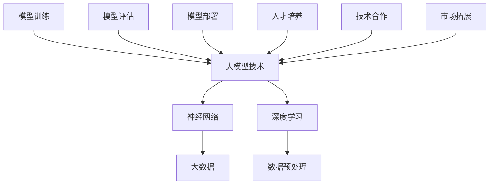

                 

# 大模型时代的创业者创业资源整合策略：人才引进、技术合作与市场拓展

> **关键词：大模型时代、创业者、资源整合、人才引进、技术合作、市场拓展**

> **摘要：随着大模型技术的迅猛发展，创业者面临着前所未有的机遇与挑战。本文将从人才引进、技术合作和市场拓展三个方面，系统地分析大模型时代创业者的资源整合策略，帮助创业者更好地把握时代脉搏，实现企业可持续发展。**

## 1. 背景介绍

### 1.1 目的和范围

本文旨在探讨大模型时代创业者在资源整合方面的策略，帮助创业者理解并有效利用人才、技术和市场资源，以应对快速变化的技术环境，实现企业创新和成长。

本文将涵盖以下几个方面的内容：
1. 人才引进策略，包括人才需求分析、招聘渠道选择和人才评价体系构建。
2. 技术合作策略，包括合作伙伴选择、合作模式设计和知识产权保护。
3. 市场拓展策略，包括市场趋势分析、目标客户定位和市场竞争策略。

### 1.2 预期读者

本文适用于以下读者群体：
1. 创业者：希望了解大模型时代创业资源整合的最佳实践。
2. 企业管理者：关注企业创新和成长，寻求资源整合的优化方案。
3. 技术人员：对大模型技术和应用场景有深入了解，希望在实际工作中应用相关策略。

### 1.3 文档结构概述

本文结构如下：

1. **背景介绍**：阐述本文的目的、预期读者和文档结构。
2. **核心概念与联系**：介绍大模型技术的基本原理和架构。
3. **核心算法原理 & 具体操作步骤**：详细讲解大模型技术的算法原理和操作步骤。
4. **数学模型和公式 & 详细讲解 & 举例说明**：阐述大模型技术的数学模型和公式，并通过实际案例进行说明。
5. **项目实战：代码实际案例和详细解释说明**：通过实际代码案例，展示大模型技术的应用过程。
6. **实际应用场景**：分析大模型技术在各行业的应用案例。
7. **工具和资源推荐**：推荐相关学习资源和开发工具。
8. **总结：未来发展趋势与挑战**：总结大模型时代创业资源整合的趋势和挑战。
9. **附录：常见问题与解答**：解答读者可能遇到的问题。
10. **扩展阅读 & 参考资料**：提供进一步阅读的资源。

### 1.4 术语表

#### 1.4.1 核心术语定义

- **大模型技术**：指具有数亿至数十亿参数的深度学习模型，如GPT、BERT等。
- **人才引进**：指企业通过各种渠道招募具备专业技能和经验的人才。
- **技术合作**：指企业与其他机构或个人合作，共同开发新技术或产品。
- **市场拓展**：指企业通过多种策略扩大市场份额，增加销售额。

#### 1.4.2 相关概念解释

- **创业**：指创立新企业或开展新业务的过程。
- **资源整合**：指企业通过各种方式整合内外部资源，以实现企业目标。

#### 1.4.3 缩略词列表

- **GPT**：生成预训练模型（Generative Pre-trained Transformer）
- **BERT**：双向编码表示器（Bidirectional Encoder Representations from Transformers）
- **IDE**：集成开发环境（Integrated Development Environment）
- **API**：应用程序编程接口（Application Programming Interface）

## 2. 核心概念与联系

在本文中，我们将探讨大模型技术的基本原理和架构，以及其与其他核心概念的联系。以下是相关的 Mermaid 流程图：



### 2.1 大模型技术的基本原理

大模型技术是指利用大规模数据集对神经网络进行预训练，使其在特定任务上具有出色的性能。其核心原理包括：

- **神经网络**：一种模拟人脑神经元连接的计算机算法。
- **深度学习**：一种基于神经网络的机器学习技术，通过多层网络结构学习数据特征。
- **大数据**：指数据量巨大、类型繁多的数据集。

### 2.2 大模型技术的架构

大模型技术的架构主要包括以下模块：

- **数据预处理**：包括数据清洗、数据标注和数据处理等步骤，为模型训练提供高质量的数据。
- **模型训练**：利用大规模数据集对神经网络模型进行训练，调整模型参数，使其在特定任务上达到预期性能。
- **模型评估**：通过测试数据集评估模型性能，判断模型是否达到预期目标。
- **模型部署**：将训练好的模型部署到生产环境，实现实际应用。

### 2.3 大模型技术与其他核心概念的联系

大模型技术与其他核心概念之间的联系如下：

- **人才培养**：大模型技术的发展需要大量具备相关技能和知识的人才，人才培养是资源整合的重要一环。
- **技术合作**：大模型技术通常需要与其他机构或个人进行合作，共同推进技术研究和应用。
- **市场拓展**：大模型技术具有广泛的应用前景，企业可以通过市场拓展策略，将技术应用于不同行业，实现业务增长。

## 3. 核心算法原理 & 具体操作步骤

### 3.1 算法原理

大模型技术的核心算法原理主要包括以下几个方面：

- **神经网络**：神经网络通过多层网络结构，学习数据特征，实现数据的非线性变换。
- **深度学习**：深度学习通过多层神经网络，将输入数据映射到输出数据，实现对数据的抽象和表示。
- **模型训练**：模型训练通过优化算法，调整模型参数，使其在特定任务上达到预期性能。
- **模型评估**：模型评估通过测试数据集，评估模型性能，判断模型是否达到预期目标。

### 3.2 具体操作步骤

以下是使用大模型技术进行模型训练的具体操作步骤：

1. **数据预处理**：
   - **数据清洗**：清洗原始数据，去除无效或错误的数据。
   - **数据标注**：对数据标注，为模型训练提供高质量的标签。
   - **数据处理**：对数据进行归一化、标准化等处理，使其适合模型训练。

2. **模型训练**：
   - **初始化参数**：初始化模型参数，为模型训练提供初始值。
   - **前向传播**：将输入数据输入模型，计算输出结果。
   - **反向传播**：计算输出结果与实际标签之间的误差，反向传播误差，更新模型参数。
   - **迭代优化**：重复前向传播和反向传播，优化模型参数。

3. **模型评估**：
   - **测试数据集**：使用测试数据集，评估模型性能。
   - **评价指标**：根据任务类型，选择合适的评价指标，如准确率、召回率、F1值等。
   - **模型调整**：根据评估结果，调整模型参数或结构，提高模型性能。

4. **模型部署**：
   - **模型压缩**：对模型进行压缩，减小模型大小，提高模型部署效率。
   - **部署环境**：将模型部署到生产环境，实现实际应用。
   - **监控与维护**：监控模型性能，定期维护和更新模型。

以下是模型训练过程的伪代码：

```python
# 初始化模型参数
model = initialize_model()

# 设置迭代次数
num_iterations = 1000

# 设置学习率
learning_rate = 0.001

# 设置评价指标
evaluation_metrics = []

# 迭代训练
for i in range(num_iterations):
    # 前向传播
    output = model.forward(input_data)

    # 计算损失
    loss = calculate_loss(output, target)

    # 反向传播
    model.backward(loss)

    # 更新参数
    model.update_parameters(learning_rate)

    # 评估模型
    evaluation_metrics.append(evaluate_model(model, test_data))

# 输出最终评估结果
print(evaluation_metrics)
```

## 4. 数学模型和公式 & 详细讲解 & 举例说明

### 4.1 数学模型

大模型技术的核心数学模型主要包括以下几个部分：

- **损失函数**：用于衡量模型预测值与实际值之间的差距。
- **优化算法**：用于调整模型参数，使其在特定任务上达到预期性能。
- **正则化**：用于防止模型过拟合，提高模型泛化能力。

以下是这些数学模型的详细讲解：

#### 4.1.1 损失函数

常见的损失函数包括均方误差（MSE）、交叉熵（CE）等：

- **均方误差（MSE）**：
  $$MSE = \frac{1}{n} \sum_{i=1}^{n} (y_i - \hat{y}_i)^2$$
  其中，$y_i$ 表示实际值，$\hat{y}_i$ 表示预测值。

- **交叉熵（CE）**：
  $$CE = -\frac{1}{n} \sum_{i=1}^{n} y_i \log(\hat{y}_i)$$
  其中，$y_i$ 表示实际值，$\hat{y}_i$ 表示预测值。

#### 4.1.2 优化算法

常见的优化算法包括梯度下降（GD）、随机梯度下降（SGD）、Adam等：

- **梯度下降（GD）**：
  $$\theta = \theta - \alpha \cdot \nabla_\theta J(\theta)$$
  其中，$\theta$ 表示模型参数，$\alpha$ 表示学习率，$J(\theta)$ 表示损失函数。

- **随机梯度下降（SGD）**：
  $$\theta = \theta - \alpha \cdot \nabla_\theta J(\theta)^{(\text{随机样本})}$$
  其中，$\theta$ 表示模型参数，$\alpha$ 表示学习率，$J(\theta)$ 表示损失函数。

- **Adam**：
  $$m_t = \beta_1 m_{t-1} + (1 - \beta_1) [g_t]$$
  $$v_t = \beta_2 v_{t-1} + (1 - \beta_2) [g_t^2]$$
  $$\theta = \theta - \alpha \cdot \frac{m_t}{\sqrt{v_t} + \epsilon}$$
  其中，$m_t$ 和 $v_t$ 分别表示一阶和二阶矩估计，$\beta_1$ 和 $\beta_2$ 分别表示一阶和二阶矩的指数衰减率，$\alpha$ 表示学习率，$g_t$ 表示梯度，$\epsilon$ 表示小常数。

#### 4.1.3 正则化

常见的正则化方法包括L1正则化、L2正则化等：

- **L1正则化**：
  $$J(\theta) = \frac{1}{2} \| \theta \|_1 + \frac{1}{2} \theta^T H \theta$$
  其中，$\theta$ 表示模型参数，$H$ 表示Hessian矩阵。

- **L2正则化**：
  $$J(\theta) = \frac{1}{2} \| \theta \|_2 + \frac{1}{2} \theta^T H \theta$$
  其中，$\theta$ 表示模型参数，$H$ 表示Hessian矩阵。

### 4.2 举例说明

假设我们使用一个简单的线性回归模型，通过训练数据集拟合一个直线，目标是预测新的输入数据的值。以下是该过程的详细讲解：

#### 4.2.1 数据集

我们有以下训练数据集：

| X | Y |
|---|---|
| 1 | 2 |
| 2 | 4 |
| 3 | 6 |

#### 4.2.2 模型

线性回归模型可以表示为：

$$y = \theta_0 + \theta_1 x$$

其中，$\theta_0$ 和 $\theta_1$ 分别为模型的参数。

#### 4.2.3 模型训练

使用均方误差（MSE）作为损失函数，梯度下降（GD）作为优化算法，对模型进行训练。

1. **初始化参数**：

   $$\theta_0 = 0, \theta_1 = 0$$

2. **前向传播**：

   $$\hat{y} = \theta_0 + \theta_1 x$$

3. **计算损失**：

   $$loss = \frac{1}{n} \sum_{i=1}^{n} (y_i - \hat{y}_i)^2$$

4. **反向传播**：

   $$\nabla_\theta J(\theta) = \frac{1}{n} \sum_{i=1}^{n} [y_i - \hat{y}_i] \cdot x$$

5. **更新参数**：

   $$\theta_0 = \theta_0 - \alpha \cdot \nabla_\theta J(\theta_0)$$
   $$\theta_1 = \theta_1 - \alpha \cdot \nabla_\theta J(\theta_1)$$

6. **迭代优化**：

   通过重复上述步骤，不断更新参数，直至损失函数收敛。

#### 4.2.4 模型评估

使用测试数据集，对训练好的模型进行评估。假设测试数据集如下：

| X | Y |
|---|---|
| 4 | 8 |

使用模型进行预测：

$$\hat{y} = \theta_0 + \theta_1 x = 0 + 1 \cdot 4 = 4$$

实际值为8，预测值为4，计算损失：

$$loss = \frac{1}{1} (8 - 4)^2 = 4$$

由于损失较大，我们可以通过调整参数，优化模型性能。

## 5. 项目实战：代码实际案例和详细解释说明

### 5.1 开发环境搭建

为了演示大模型技术的应用，我们将使用Python作为编程语言，并借助TensorFlow和Keras等开源框架。以下是搭建开发环境的步骤：

1. **安装Python**：确保安装了Python 3.x版本。
2. **安装TensorFlow**：在终端中运行以下命令：
   ```bash
   pip install tensorflow
   ```
3. **安装Keras**：在终端中运行以下命令：
   ```bash
   pip install keras
   ```

### 5.2 源代码详细实现和代码解读

下面是一个使用Keras构建和训练一个简单的神经网络模型进行图像分类的代码示例：

```python
# 导入所需库
import numpy as np
from tensorflow.keras.models import Sequential
from tensorflow.keras.layers import Dense, Flatten, Conv2D, MaxPooling2D
from tensorflow.keras.datasets import mnist
from tensorflow.keras.utils import to_categorical

# 加载MNIST数据集
(train_images, train_labels), (test_images, test_labels) = mnist.load_data()

# 数据预处理
train_images = train_images.reshape((60000, 28, 28, 1)).astype('float32') / 255
test_images = test_images.reshape((10000, 28, 28, 1)).astype('float32') / 255

train_labels = to_categorical(train_labels)
test_labels = to_categorical(test_labels)

# 构建模型
model = Sequential()
model.add(Conv2D(32, (3, 3), activation='relu', input_shape=(28, 28, 1)))
model.add(MaxPooling2D((2, 2)))
model.add(Conv2D(64, (3, 3), activation='relu'))
model.add(MaxPooling2D((2, 2)))
model.add(Flatten())
model.add(Dense(128, activation='relu'))
model.add(Dense(10, activation='softmax'))

# 编译模型
model.compile(optimizer='adam', loss='categorical_crossentropy', metrics=['accuracy'])

# 训练模型
model.fit(train_images, train_labels, epochs=5, batch_size=64)

# 评估模型
test_loss, test_acc = model.evaluate(test_images, test_labels)
print(f"Test accuracy: {test_acc:.3f}")

# 保存模型
model.save('mnist_model.h5')
```

### 5.3 代码解读与分析

以下是代码的详细解读：

1. **导入库**：
   - 导入numpy库用于数据操作。
   - 导入TensorFlow和Keras库用于构建和训练模型。

2. **加载数据集**：
   - 使用Keras的内置MNIST数据集，包含60,000个训练图像和10,000个测试图像，每个图像都是灰度图像。

3. **数据预处理**：
   - 将图像数据reshape为适合模型输入的格式（[样本数，高度，宽度，通道数]）。
   - 将图像数据归一化到[0, 1]范围。
   - 将标签转换为one-hot编码，以便使用softmax激活函数进行多类分类。

4. **构建模型**：
   - 创建一个Sequential模型，这是一种线性堆叠层的模型。
   - 添加两个卷积层，每个卷积层后跟一个最大池化层，以提取图像特征。
   - 添加一个展平层，将卷积层的输出展平为1维向量。
   - 添加一个全连接层（Dense），用于分类。
   - 添加一个输出层，使用softmax激活函数进行多类分类。

5. **编译模型**：
   - 选择'adam'优化器和'categorical_crossentropy'损失函数，该损失函数适用于多类分类问题。
   - 设置评估指标为准确率。

6. **训练模型**：
   - 使用训练数据集训练模型，设置训练轮数（epochs）和批量大小（batch_size）。

7. **评估模型**：
   - 使用测试数据集评估模型性能，打印准确率。

8. **保存模型**：
   - 将训练好的模型保存为.h5文件，以便以后加载和使用。

这个示例展示了如何使用Keras快速构建和训练一个简单的卷积神经网络（CNN）模型进行图像分类。通过这个案例，我们可以看到大模型技术在图像处理领域的基本应用流程。

## 6. 实际应用场景

大模型技术在各个行业都展现出强大的应用潜力，以下是一些典型的应用场景：

### 6.1 金融行业

- **风险控制**：利用大模型技术进行信用评分和风险评估，提高金融机构的风险管理能力。
- **量化交易**：构建基于大模型技术的量化交易策略，实现高效的投资决策。
- **智能投顾**：利用大模型技术为投资者提供个性化的投资建议，提高投资回报率。

### 6.2 医疗保健

- **疾病诊断**：通过大模型技术分析医学影像，提高疾病诊断的准确性和效率。
- **药物研发**：利用大模型技术预测药物分子与蛋白质的结合模式，加速新药研发进程。
- **健康监测**：通过分析患者数据，预测健康风险，提供个性化的健康建议。

### 6.3 电商行业

- **个性化推荐**：利用大模型技术分析用户行为数据，提供个性化的商品推荐，提高用户满意度。
- **库存管理**：通过大模型技术预测市场需求，优化库存管理，降低库存成本。
- **客户服务**：利用大模型技术实现智能客服，提高客户服务质量。

### 6.4 制造业

- **质量检测**：利用大模型技术分析生产线数据，实时监测产品质量，提高生产效率。
- **设备维护**：通过大模型技术预测设备故障，提前进行维护，减少设备停机时间。
- **供应链管理**：利用大模型技术优化供应链管理，提高供应链的灵活性和响应速度。

### 6.5 教育行业

- **智能教学**：利用大模型技术为学生提供个性化的学习建议，提高学习效果。
- **考试评分**：通过大模型技术自动评分，提高考试评分的准确性和公正性。
- **教育资源分配**：利用大模型技术优化教育资源分配，提高教育公平性。

## 7. 工具和资源推荐

### 7.1 学习资源推荐

#### 7.1.1 书籍推荐

- **《深度学习》（Deep Learning）**：Ian Goodfellow、Yoshua Bengio和Aaron Courville 著，全面介绍了深度学习的基本原理和实践。
- **《Python深度学习》（Python Deep Learning）**：François Chollet 著，详细介绍了如何使用Python和Keras框架进行深度学习实践。
- **《神经网络与深度学习》（Neural Networks and Deep Learning）**：邱锡鹏 著，深入讲解了神经网络和深度学习的基础理论和算法。

#### 7.1.2 在线课程

- **Udacity的《深度学习纳米学位》**：涵盖深度学习的基本概念和应用，适合初学者入门。
- **Coursera的《深度学习专项课程》**：由斯坦福大学教授Andrew Ng主讲，系统介绍了深度学习的理论和实践。
- **edX的《人工智能基础》**：由哥伦比亚大学教授David Danks主讲，介绍了人工智能的基本概念和应用。

#### 7.1.3 技术博客和网站

- **TensorFlow官方文档**：[https://www.tensorflow.org](https://www.tensorflow.org)
- **Keras官方文档**：[https://keras.io](https://keras.io)
- **机器学习博客**：[https://machinelearningmastery.com](https://machinelearningmastery.com)
- **AI记者**：[https://aijourna

