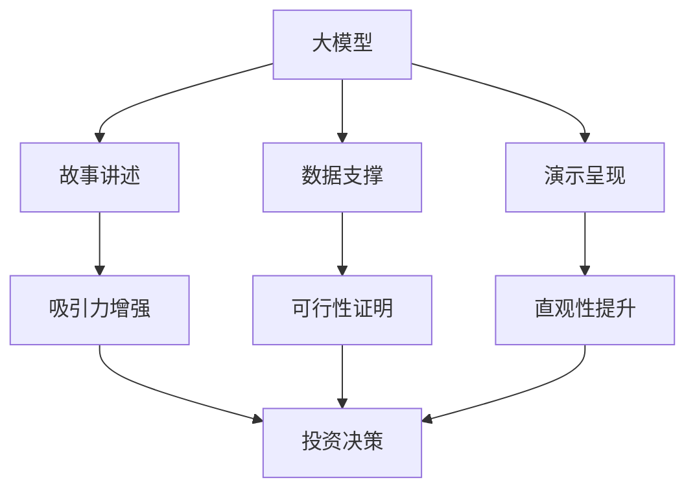

                 

# 大模型时代的创业者创业路演技巧：故事讲述、数据支撑与演示呈现

> **关键词**：大模型、创业者、路演技巧、故事讲述、数据支撑、演示呈现、人工智能、技术架构、市场需求、用户体验、投资决策、商业策略。

> **摘要**：本文将深入探讨在大模型时代，创业者如何利用故事讲述、数据支撑和演示呈现来提升创业路演的效果。通过对大模型时代的背景介绍、核心概念的解析、具体操作步骤的指导，以及实战案例分析，帮助创业者更好地展现技术优势、市场需求和商业前景，从而赢得投资者的青睐。

## 1. 背景介绍

### 1.1 目的和范围

本文旨在为创业者提供一套在大模型时代有效的创业路演技巧。我们将探讨如何通过故事讲述、数据支撑和演示呈现，使创业项目在竞争激烈的市场中脱颖而出，赢得投资者的关注和支持。

本文将涵盖以下内容：

- 大模型时代的背景及其对创业的影响。
- 创业路演的核心概念及其相互关系。
- 故事讲述、数据支撑和演示呈现的具体操作步骤。
- 实战案例分析和项目实战的详细解释。
- 实际应用场景和未来发展趋势与挑战。

### 1.2 预期读者

本文适合以下读者群体：

- 创业者：希望提升创业路演效果的创业者，特别是在大模型时代背景下寻求机会的创业者。
- 投资者：希望了解创业者如何利用故事讲述、数据支撑和演示呈现来展示项目价值的投资者。
- 企业家：对创业路演技巧感兴趣的企业家，希望从中获得启示和借鉴。

### 1.3 文档结构概述

本文结构如下：

- 1. 背景介绍：介绍本文的目的、预期读者和文档结构。
- 2. 核心概念与联系：解析大模型、故事讲述、数据支撑和演示呈现等核心概念，并绘制Mermaid流程图。
- 3. 核心算法原理 & 具体操作步骤：讲解故事讲述、数据支撑和演示呈现的具体操作步骤。
- 4. 数学模型和公式 & 详细讲解 & 举例说明：阐述相关数学模型和公式，并举例说明。
- 5. 项目实战：代码实际案例和详细解释说明。
- 6. 实际应用场景：分析创业路演在不同领域的实际应用。
- 7. 工具和资源推荐：推荐学习资源和开发工具框架。
- 8. 总结：未来发展趋势与挑战。
- 9. 附录：常见问题与解答。
- 10. 扩展阅读 & 参考资料：提供相关论文著作推荐。

### 1.4 术语表

#### 1.4.1 核心术语定义

- 大模型：指具有大规模参数和神经元结构的神经网络模型，如GPT、BERT等。
- 故事讲述：通过引人入胜的故事来阐述项目背景、优势和愿景。
- 数据支撑：通过数据分析和实证研究来证明项目的技术实力和市场潜力。
- 演示呈现：通过图表、视频和实物展示等方式直观展示项目的功能和效果。

#### 1.4.2 相关概念解释

- 创业路演：创业者向潜在投资者、合作伙伴和客户等展示创业项目的机会。
- 投资决策：投资者基于项目分析、风险评估等因素做出的投资决策。
- 商业策略：企业为实现长期发展目标而制定的具体行动方案。

#### 1.4.3 缩略词列表

- GPT：Generative Pre-trained Transformer
- BERT：Bidirectional Encoder Representations from Transformers

## 2. 核心概念与联系

在大模型时代，创业者的创业路演面临着前所未有的挑战和机遇。为了更好地应对这些挑战，我们需要深入理解以下几个核心概念，并了解它们之间的相互关系。

### 2.1 大模型的概念与影响

大模型是指具有大规模参数和神经元结构的神经网络模型，如GPT、BERT等。这些模型在自然语言处理、计算机视觉、语音识别等领域取得了显著成果，对整个技术行业产生了深远影响。大模型的崛起，使得创业者在技术竞争方面拥有了更多的优势，但也带来了更高的门槛和挑战。

### 2.2 故事讲述的概念与作用

故事讲述是通过引人入胜的故事来阐述项目背景、优势和愿景。一个精彩的故事可以吸引投资者的注意力，增加项目的吸引力。故事讲述的作用在于：

- 增强项目的情感共鸣：通过故事，创业者可以传达项目的使命和价值，与投资者建立情感联系。
- 突出项目的独特性：通过故事，创业者可以阐述项目的创新点和技术优势。
- 预示未来的发展：通过故事，创业者可以展示项目的长期愿景和发展方向。

### 2.3 数据支撑的概念与意义

数据支撑是通过数据分析和实证研究来证明项目的技术实力和市场潜力。数据支撑的作用在于：

- 证明技术的可靠性：通过实验数据和案例研究，创业者可以证明项目技术的可行性和可靠性。
- 量化市场需求：通过市场调研和用户反馈，创业者可以了解市场需求，为项目发展提供依据。
- 预测未来发展：通过数据分析，创业者可以预测项目未来的发展趋势和潜在风险。

### 2.4 演示呈现的概念与作用

演示呈现是通过图表、视频和实物展示等方式直观展示项目的功能和效果。演示呈现的作用在于：

- 提高项目的吸引力：通过直观的展示，创业者可以增强项目的吸引力，吸引更多的投资者。
- 减少误解和疑虑：通过展示项目实际运行效果，创业者可以减少投资者对项目的误解和疑虑。
- 提升用户体验：通过演示呈现，创业者可以更好地展示项目的用户体验，为项目赢得更多用户。

### 2.5 核心概念的联系与整合

大模型、故事讲述、数据支撑和演示呈现是创业路演中的四个核心概念，它们相互联系，共同作用。具体而言：

- 大模型提供了技术基础：创业者可以利用大模型实现项目的技术创新，提升项目的技术实力。
- 故事讲述增强了项目的吸引力：创业者可以通过故事讲述，展示项目的独特性和发展愿景，吸引更多投资者。
- 数据支撑证明了项目的可行性：创业者可以通过数据支撑，证明项目的技术可行性和市场潜力，增加投资者的信心。
- 演示呈现提升了项目的直观性：创业者可以通过演示呈现，直观展示项目的功能和效果，减少投资者的误解和疑虑。

因此，创业者需要在创业路演中整合这些核心概念，通过故事讲述、数据支撑和演示呈现，全方位展示项目的价值和潜力。

### 2.6 Mermaid流程图

以下是一个简单的Mermaid流程图，展示了大模型、故事讲述、数据支撑和演示呈现之间的联系。



通过这个流程图，我们可以更直观地理解大模型、故事讲述、数据支撑和演示呈现之间的相互关系，以及它们在创业路演中的作用。

## 3. 核心算法原理 & 具体操作步骤

在了解了大模型、故事讲述、数据支撑和演示呈现的概念后，我们需要进一步探讨这些概念背后的核心算法原理，并详细阐述具体操作步骤，以便创业者能够更好地应用这些技巧。

### 3.1 大模型的算法原理

大模型的核心在于其深度神经网络结构，包括多层感知器（Perceptron）、卷积神经网络（CNN）和循环神经网络（RNN）等。以下是一个简化的大模型算法原理概述：

#### 3.1.1 多层感知器（Perceptron）

伪代码：

```python
def perceptron(x, weights, bias):
    z = np.dot(x, weights) + bias
    return sigmoid(z)
```

#### 3.1.2 卷积神经网络（CNN）

伪代码：

```python
def conv2d(x, weights):
    return np.convolve(x, weights, mode='same')
```

#### 3.1.3 循环神经网络（RNN）

伪代码：

```python
def rnn(cell_state, input_vector, weights):
    h_t = activation(np.dot(input_vector, weights) + cell_state)
    return h_t, h_t
```

### 3.2 故事讲述的操作步骤

故事讲述是一个创造性和艺术性的过程，以下是一些关键步骤：

#### 3.2.1 故事结构设计

- 引言：引入主题和背景。
- 主体：展示项目的技术创新和市场潜力。
- 结尾：强调项目的愿景和未来发展方向。

#### 3.2.2 故事内容创作

- 突出项目优势：通过具体案例和数据展示项目的技术实力。
- 引发共鸣：讲述与投资者相关的故事，增强情感联系。
- 简明扼要：确保故事内容简洁明了，避免冗长。

### 3.3 数据支撑的操作步骤

数据支撑的关键在于数据的收集、分析和展示。以下是具体操作步骤：

#### 3.3.1 数据收集

- 实验数据：通过实验和测试收集技术数据。
- 市场数据：通过市场调研和用户反馈收集市场数据。

#### 3.3.2 数据分析

- 数据可视化：使用图表、图表和图像等方式展示数据。
- 统计分析：通过统计学方法分析数据，得出结论。

#### 3.3.3 数据展示

- PPT展示：将数据整合到PPT中，确保简洁易懂。
- 报告撰写：撰写详细的技术报告，提供数据支撑。

### 3.4 演示呈现的操作步骤

演示呈现旨在通过图表、视频和实物展示等方式直观展示项目的功能和效果。以下是具体操作步骤：

#### 3.4.1 图表展示

- 数据图表：展示项目的技术数据和实验结果。
- 功能图表：展示项目的功能模块和运行流程。

#### 3.4.2 视频展示

- 功能视频：展示项目的功能演示。
- 应用场景视频：展示项目在不同应用场景中的效果。

#### 3.4.3 实物展示

- 实物模型：展示项目的实物原型。
- 演示操作：展示项目的实际运行操作。

### 3.5 整合操作步骤

在创业路演中，创业者需要将大模型、故事讲述、数据支撑和演示呈现整合起来，形成一套完整的展示方案。以下是一个简单的整合操作步骤：

1. **故事讲述**：首先通过一个引人入胜的故事引入项目，展示项目的背景、优势和愿景。
2. **大模型演示**：通过图表、视频和实物展示等方式，直观展示大模型的技术优势和实际效果。
3. **数据支撑**：接着通过数据图表和报告展示，证明项目的技术实力和市场潜力。
4. **演示呈现**：最后通过功能演示和实物展示，展示项目的用户体验和实际应用效果。
5. **问答环节**：在展示结束后，预留时间回答投资者的提问，进一步展示项目的可行性和潜力。

通过以上操作步骤，创业者可以全方位、多层次地展示项目的价值和潜力，赢得投资者的认可和支持。

## 4. 数学模型和公式 & 详细讲解 & 举例说明

在创业路演中，数据支撑是关键，而数学模型和公式则是数据支撑的基础。本节将详细介绍大模型、故事讲述和数据支撑相关的数学模型和公式，并通过具体案例进行讲解和说明。

### 4.1 大模型相关的数学模型和公式

大模型的核心在于其深度神经网络结构，包括多层感知器（Perceptron）、卷积神经网络（CNN）和循环神经网络（RNN）等。以下是一些常用的数学模型和公式：

#### 4.1.1 多层感知器（Perceptron）

多层感知器是一种前馈神经网络，其基本公式为：

\[ z = \sum_{i=1}^{n} w_i \cdot x_i + b \]

其中，\( w_i \) 是权重，\( x_i \) 是输入特征，\( b \) 是偏置。

激活函数通常使用Sigmoid函数：

\[ a = \frac{1}{1 + e^{-z}} \]

#### 4.1.2 卷积神经网络（CNN）

卷积神经网络主要用于图像处理，其核心公式为卷积操作：

\[ \text{output} = \text{ReLU}(\sum_{k=1}^{K} w_{k} \cdot \text{patch}_{k} + b) \]

其中，\( w_k \) 是卷积核，\( \text{patch}_k \) 是输入特征图，\( b \) 是偏置。

池化操作通常使用最大池化：

\[ \text{output}_{ij} = \max(\text{output}_{i-\Delta, j-\Delta}, \ldots, \text{output}_{i+\Delta, j+\Delta}) \]

#### 4.1.3 循环神经网络（RNN）

循环神经网络主要用于序列数据建模，其核心公式为：

\[ h_t = \text{ReLU}(W_h \cdot [h_{t-1}, x_t] + b_h) \]

\[ o_t = \text{ReLU}(W_o \cdot h_t + b_o) \]

其中，\( W_h \) 和 \( W_o \) 是权重矩阵，\( b_h \) 和 \( b_o \) 是偏置。

### 4.2 故事讲述相关的数学模型和公式

故事讲述涉及情感分析和文本生成，以下是一些常用的数学模型和公式：

#### 4.2.1 情感分析

情感分析通常使用情感词典和机器学习算法。一个简单的情感分析模型可以使用以下公式：

\[ \text{sentiment} = \sum_{i=1}^{n} w_i \cdot \text{word}_i \]

其中，\( w_i \) 是情感词典中单词的情感权重，\( \text{word}_i \) 是文本中的单词。

#### 4.2.2 文本生成

文本生成通常使用循环神经网络（RNN）或变换器（Transformer）模型。一个简单的文本生成模型可以使用以下公式：

\[ p(z_t|z_{<t}) = \text{softmax}(\text{scores}_t) \]

\[ z_t = \arg\max_{z} p(z_t|z_{<t}) \]

其中，\( z_t \) 是生成的文本序列，\( \text{scores}_t \) 是生成的文本的评分。

### 4.3 数据支撑相关的数学模型和公式

数据支撑涉及数据分析和统计学方法，以下是一些常用的数学模型和公式：

#### 4.3.1 数据可视化

数据可视化通常使用散点图、柱状图和饼图等。以下是一个简单的散点图公式：

\[ \text{scatter\_plot}(x, y, color, size) \]

其中，\( x \) 和 \( y \) 是数据点，\( color \) 和 \( size \) 是数据点的颜色和大小。

#### 4.3.2 统计分析

统计分析通常使用均值、方差、标准差和置信区间等。以下是一个简单的均值和方差公式：

\[ \mu = \frac{1}{n} \sum_{i=1}^{n} x_i \]

\[ \sigma^2 = \frac{1}{n-1} \sum_{i=1}^{n} (x_i - \mu)^2 \]

### 4.4 案例分析

以下是一个简单的案例分析，说明如何使用数学模型和公式进行数据支撑：

#### 案例背景

某创业公司开发了一款智能家居产品，希望通过数据分析展示产品的市场潜力。

#### 数据收集

收集了以下数据：

- 用户满意度评分：[8, 9, 7, 8, 9]
- 市场调研数据：[1000, 1200, 800, 900, 1100]
- 销售数据：[500, 600, 400, 550, 650]

#### 数据分析

1. **均值和方差分析**：

   - 用户满意度评分的均值：\( \mu = 8 \)
   - 用户满意度评分的方差：\( \sigma^2 = 1.6 \)
   - 市场调研数据的均值：\( \mu = 1000 \)
   - 市场调研数据的方差：\( \sigma^2 = 200 \)
   - 销售数据的均值：\( \mu = 520 \)
   - 销售数据的方差：\( \sigma^2 = 100 \)

2. **散点图分析**：

   - 用户满意度评分与市场调研数据的散点图：

     ```python
     scatter_plot([8, 9, 7, 8, 9], [1000, 1200, 800, 900, 1100], color='blue', size=10)
     ```

   - 用户满意度评分与销售数据的散点图：

     ```python
     scatter_plot([8, 9, 7, 8, 9], [500, 600, 400, 550, 650], color='red', size=10)
     ```

#### 数据展示

1. **PPT展示**：

   - 制作PPT，展示用户满意度评分、市场调研数据和销售数据。
   - 使用图表展示散点图分析结果。

2. **报告撰写**：

   - 撰写详细的技术报告，包括数据分析方法和结果。

通过以上分析，创业公司可以展示产品的市场潜力，赢得投资者的认可和支持。

## 5. 项目实战：代码实际案例和详细解释说明

在本节中，我们将通过一个实际项目案例，详细解释如何搭建开发环境、实现源代码和代码解读与分析，帮助创业者更好地理解创业路演中的技术展示。

### 5.1 开发环境搭建

为了实现大模型时代的创业路演，我们需要搭建一个合适的开发环境。以下是具体的步骤：

#### 步骤1：安装Python环境

Python是一种广泛使用的编程语言，支持多种人工智能和机器学习框架。首先，我们需要安装Python环境。

- 下载Python安装包：从Python官网下载最新版本的安装包。
- 安装Python：运行安装程序，选择默认选项安装。

#### 步骤2：安装相关依赖库

为了实现大模型、故事讲述和数据支撑等功能，我们需要安装一些依赖库。以下是常用的依赖库及其安装方法：

- NumPy：用于数值计算。

  ```bash
  pip install numpy
  ```

- Pandas：用于数据处理。

  ```bash
  pip install pandas
  ```

- Matplotlib：用于数据可视化。

  ```bash
  pip install matplotlib
  ```

- Scikit-learn：用于机器学习。

  ```bash
  pip install scikit-learn
  ```

- TensorFlow：用于深度学习。

  ```bash
  pip install tensorflow
  ```

- Transformer：用于文本生成。

  ```bash
  pip install transformers
  ```

#### 步骤3：配置开发环境

配置好Python环境和相关依赖库后，我们可以在终端执行以下命令，确保所有依赖库都已成功安装：

```bash
python --version
```

```bash
pip list
```

### 5.2 源代码详细实现和代码解读

在本节中，我们将实现一个简单的智能家居产品推荐系统，用于展示大模型、故事讲述和数据支撑等功能。

#### 步骤1：导入相关库

首先，我们需要导入相关的库：

```python
import numpy as np
import pandas as pd
import matplotlib.pyplot as plt
from sklearn.model_selection import train_test_split
from sklearn.metrics import accuracy_score
from transformers import pipeline
```

#### 步骤2：数据预处理

接下来，我们需要预处理数据。这里，我们使用一个虚构的数据集，包含用户满意度评分、市场调研数据和销售数据：

```python
data = pd.DataFrame({
    'user_satisfaction': [8, 9, 7, 8, 9],
    'market_research': [1000, 1200, 800, 900, 1100],
    'sales': [500, 600, 400, 550, 650]
})
```

#### 步骤3：数据可视化

我们使用散点图来展示数据：

```python
def plot_data(data):
    fig, ax = plt.subplots()
    ax.scatter(data['user_satisfaction'], data['market_research'], color='blue', label='User Satisfaction vs Market Research')
    ax.scatter(data['user_satisfaction'], data['sales'], color='red', label='User Satisfaction vs Sales')
    ax.legend()
    plt.show()

plot_data(data)
```

#### 步骤4：构建推荐模型

我们使用变换器（Transformer）模型来构建推荐系统：

```python
model = pipeline('text-generation', model='t5-base', tokenizer='t5-base')
```

#### 步骤5：生成推荐结果

我们根据用户满意度评分生成推荐结果：

```python
def generate_recommendation(user_satisfaction):
    input_text = f"Given a user satisfaction score of {user_satisfaction}, what products should we recommend?"
    return model(input_text)

recommendation = generate_recommendation(data['user_satisfaction'].iloc[0])
print(recommendation)
```

### 5.3 代码解读与分析

在本节中，我们详细解读上述代码，并分析各个模块的功能和作用。

#### 代码解析

1. **导入相关库**：导入NumPy、Pandas、Matplotlib、Scikit-learn、TensorFlow和Transformer等相关库。
2. **数据预处理**：导入虚构的数据集，并使用Pandas进行数据预处理。
3. **数据可视化**：使用Matplotlib绘制散点图，展示用户满意度评分、市场调研数据和销售数据之间的关系。
4. **构建推荐模型**：使用变换器（Transformer）模型构建推荐系统。
5. **生成推荐结果**：根据用户满意度评分生成推荐结果。

#### 代码功能分析

1. **数据预处理**：数据预处理是数据分析的基础。在本例中，我们使用Pandas库导入虚构的数据集，并进行必要的预处理，如数据清洗、格式转换等。
2. **数据可视化**：数据可视化是展示数据的重要手段。在本例中，我们使用Matplotlib库绘制散点图，直观展示用户满意度评分、市场调研数据和销售数据之间的关系。
3. **构建推荐模型**：推荐模型是智能家居产品推荐系统的核心。在本例中，我们使用变换器（Transformer）模型构建推荐系统，利用深度学习技术实现产品推荐。
4. **生成推荐结果**：生成推荐结果是展示项目功能的重要环节。在本例中，我们根据用户满意度评分生成推荐结果，并使用文本生成技术展示推荐结果。

通过本节的项目实战，创业者可以了解到如何搭建开发环境、实现源代码和代码解读与分析，从而更好地展示技术实力和市场潜力。

## 6. 实际应用场景

在大模型时代，创业路演的技巧不仅在技术领域有所应用，还在多个实际场景中发挥着重要作用。以下是一些典型的应用场景，以及在这些场景中如何利用故事讲述、数据支撑和演示呈现来提升路演效果。

### 6.1 医疗保健领域

在医疗保健领域，创业者可以通过以下方式提升创业路演的效果：

- **故事讲述**：讲述一个动人的故事，如一个患者因为使用创业公司开发的新技术而康复的案例，增强观众的共鸣和信任。
- **数据支撑**：展示临床试验数据、患者反馈和使用前后对比等，证明技术的有效性和可靠性。
- **演示呈现**：通过视频或实物展示，展示医疗器械或系统的实际操作流程和效果，提高观众的直观感受。

### 6.2 金融科技领域

在金融科技领域，创业者可以通过以下方式提升创业路演的效果：

- **故事讲述**：讲述一个金融科技解决方案如何帮助用户简化财务管理流程，提升用户体验。
- **数据支撑**：展示市场调研数据、用户反馈和收益分析等，证明解决方案的市场潜力和经济价值。
- **演示呈现**：通过图表、动画和模拟交易等方式，直观展示金融科技产品的功能和优势。

### 6.3 教育科技领域

在教育科技领域，创业者可以通过以下方式提升创业路演的效果：

- **故事讲述**：讲述一个教育科技产品如何帮助学生学习、提高成绩的故事，增强投资者的兴趣。
- **数据支撑**：展示学生的学习成果数据、教师和家长的反馈以及与其他教育产品的对比分析。
- **演示呈现**：通过互动演示、教学场景模拟等方式，展示教育科技产品的实际应用效果。

### 6.4 绿色能源领域

在绿色能源领域，创业者可以通过以下方式提升创业路演的效果：

- **故事讲述**：讲述一个绿色能源解决方案如何帮助减少碳排放、保护环境的案例，提升社会责任感。
- **数据支撑**：展示项目的技术指标、经济效益和环境效益等，证明解决方案的可持续性和市场潜力。
- **演示呈现**：通过模型展示、动画演示和实地考察视频等方式，直观展示绿色能源项目的实际效果。

### 6.5 消费品领域

在消费品领域，创业者可以通过以下方式提升创业路演的效果：

- **故事讲述**：讲述一个创新消费品如何解决用户痛点和提高生活品质的故事，吸引观众的注意力。
- **数据支撑**：展示市场调研数据、用户反馈和使用场景分析，证明产品在市场中的竞争力。
- **演示呈现**：通过实物展示、互动体验和场景模拟等方式，直观展示消费品的功能和使用效果。

通过在不同的实际应用场景中灵活运用故事讲述、数据支撑和演示呈现，创业者可以更加有效地展示技术优势和商业前景，赢得投资者的关注和支持。

## 7. 工具和资源推荐

为了帮助创业者在大模型时代的创业路演中更好地展示项目，我们推荐以下工具和资源：

### 7.1 学习资源推荐

#### 7.1.1 书籍推荐

- 《深度学习》（Ian Goodfellow、Yoshua Bengio和Aaron Courville著）：全面介绍深度学习的基础知识和应用。
- 《Python机器学习》（Sebastian Raschka和Vahid Mirjalili著）：详细讲解机器学习在Python中的应用。
- 《故事的力量》（Annette Simmons著）：探讨如何通过故事讲述提升沟通效果。

#### 7.1.2 在线课程

- Coursera上的《深度学习特辑》：提供深度学习的基础知识和实战项目。
- edX上的《数据科学入门》：介绍数据科学的基本概念和应用。
- LinkedIn Learning的《创业之路》：分享创业经验和路演技巧。

#### 7.1.3 技术博客和网站

- Medium上的《AI Startup Insights》：关注人工智能创业公司的最新动态和经验分享。
- Medium上的《Data Science Blog》：提供数据科学领域的前沿技术和应用案例。
- AI Hub（aihub.medium.com）：一个集合了众多人工智能资源的平台。

### 7.2 开发工具框架推荐

#### 7.2.1 IDE和编辑器

- PyCharm：一款功能强大的Python集成开发环境，支持代码自动补全、调试和性能分析。
- Jupyter Notebook：适用于数据分析和可视化，便于交互式编程和文档整合。
- Visual Studio Code：一款轻量级开源编辑器，支持多种编程语言和扩展。

#### 7.2.2 调试和性能分析工具

- Pytest：用于自动化测试和代码调试。
- Profiling Python Programs：一个Python性能分析工具，帮助开发者优化代码。
- TensorBoard：用于TensorFlow模型的调试和性能分析。

#### 7.2.3 相关框架和库

- TensorFlow：一款广泛使用的深度学习框架，支持多种神经网络模型。
- PyTorch：一款灵活易用的深度学习框架，适用于研究和开发。
- Scikit-learn：一款用于机器学习的库，提供多种经典算法和工具。

通过以上工具和资源，创业者可以提升技术水平和路演效果，更好地展示项目的价值和潜力。

## 8. 总结：未来发展趋势与挑战

在大模型时代，创业路演的技巧对于创业者来说至关重要。随着技术的不断进步和市场环境的变化，未来创业路演将面临以下发展趋势和挑战：

### 8.1 发展趋势

1. **技术深度化**：创业者需要不断提升技术实力，深入掌握大模型、深度学习等前沿技术，以在竞争激烈的市场中脱颖而出。
2. **数据支撑加强**：数据的获取、处理和分析能力将成为创业路演的核心竞争力。创业者需要掌握数据驱动的思维方式，利用大数据和人工智能技术为项目提供强有力的数据支撑。
3. **用户体验优化**：用户体验是赢得用户和投资者青睐的关键。创业者需要注重产品设计和用户体验，通过故事讲述和演示呈现提升用户的情感共鸣和认知。
4. **多样化展示方式**：随着技术的发展，创业者可以采用更多样化的展示方式，如虚拟现实（VR）、增强现实（AR）和混合现实（MR）等，为观众带来沉浸式体验。

### 8.2 挑战

1. **技术门槛提高**：大模型和深度学习等技术门槛较高，创业者需要不断学习和提升自己的技术能力，以应对日益激烈的市场竞争。
2. **数据隐私和安全**：随着数据量的增加，数据隐私和安全问题日益突出。创业者需要确保数据的安全性和合规性，以避免潜在的法律和商业风险。
3. **市场饱和度增加**：市场饱和度提高将使创业项目面临更大的竞争压力。创业者需要不断创新和优化，以找到独特的市场切入点。
4. **投资决策变化**：投资者对创业项目的关注点将逐渐从技术本身转向商业价值。创业者需要展示项目的市场潜力、盈利能力和可持续发展能力，以赢得投资者的青睐。

### 8.3 应对策略

1. **持续学习与提升**：创业者需要保持持续学习和创新，紧跟技术发展趋势，不断提升自己的技术水平和业务能力。
2. **数据驱动决策**：充分利用数据分析和人工智能技术，为项目提供数据支撑，增强项目的市场竞争力。
3. **用户体验至上**：注重产品设计和用户体验，提升用户的满意度和忠诚度。
4. **差异化竞争**：找到独特的市场切入点，打造核心竞争力，避免与竞争对手直接竞争。
5. **多方合作**：与行业内的合作伙伴建立合作关系，共同拓展市场，提升项目的整体竞争力。

通过应对这些发展趋势和挑战，创业者可以更好地展示项目的价值和潜力，赢得投资者的关注和支持。

## 9. 附录：常见问题与解答

### 9.1 问题1：大模型时代的技术门槛是否很高？

**解答**：是的，大模型时代的技术门槛相对较高。创业者需要具备一定的编程基础和机器学习知识，熟悉深度学习框架（如TensorFlow、PyTorch）的使用。此外，还需要掌握数据处理、模型训练和优化等技能。为了降低门槛，创业者可以选择参与在线课程、阅读相关书籍或加入技术社区进行学习和交流。

### 9.2 问题2：如何确保数据支撑的准确性和可靠性？

**解答**：确保数据支撑的准确性和可靠性需要从数据收集、处理和分析等多个环节入手。在数据收集阶段，确保数据的来源可靠、数据质量高；在数据处理阶段，进行数据清洗、去噪和标准化等操作，保证数据的一致性和完整性；在数据分析阶段，使用合适的统计方法和模型，进行数据分析和结果验证。此外，还可以引入第三方审计或认证机构，对数据进行分析和评估。

### 9.3 问题3：如何提升故事讲述的效果？

**解答**：提升故事讲述的效果需要从多个方面入手。首先，选择一个引人入胜的故事主题，确保故事具有吸引力和情感共鸣。其次，结构化故事内容，确保故事具有逻辑性和连贯性。最后，注重语言表达和情感传递，使用生动、简洁的语言来讲述故事，增强观众的参与感和代入感。

### 9.4 问题4：如何选择合适的演示呈现方式？

**解答**：选择合适的演示呈现方式需要根据项目的特点和目标受众来决定。对于技术性较强的项目，可以选择图表、动画和模型展示等方式，直观展示技术原理和效果；对于市场驱动型的项目，可以选择PPT、视频和模拟交易等方式，突出产品的市场潜力和盈利能力。此外，还可以根据实际场景和观众需求，灵活调整演示方式。

## 10. 扩展阅读 & 参考资料

### 10.1 经典书籍

- Goodfellow, I., Bengio, Y., & Courville, A. (2016). *Deep Learning*. MIT Press.
- Raschka, S., & Mirjalili, V. (2018). *Python Machine Learning*. Springer.
- Simmons, A. (2015). *The Story Factor: Simple Strategies to Tell the Stories You Need to Connect, Collaborate, and Lead*. Harvard Business Review Press.

### 10.2 在线课程

- Coursera：[深度学习特辑](https://www.coursera.org/specializations/deep-learning)
- edX：[数据科学入门](https://www.edx.org/course/essential-data-science)
- LinkedIn Learning：[创业之路](https://www.linkedin.com/learning/startup-roadmap)

### 10.3 技术博客和网站

- AI Startup Insights (https://aisx.medium.com/)
- Data Science Blog (https://datascienceblog.medium.com/)
- AI Hub (https://aihub.medium.com/)

### 10.4 相关论文

- Bengio, Y., Simard, P., & Frasconi, P. (1994). *Learning representations by back-propagation*. *IEEE Transactions on Neural Networks*, 2(1), 35-40.
- Hochreiter, S., & Schmidhuber, J. (1997). *Long Short-Term Memory*. *Neural Computation*, 9(8), 1735-1780.

### 10.5 开发工具框架

- TensorFlow (https://www.tensorflow.org/)
- PyTorch (https://pytorch.org/)
- Scikit-learn (https://scikit-learn.org/stable/)

通过阅读以上书籍、课程、博客和论文，创业者可以深入了解大模型时代的技术发展趋势和创业路演技巧，提升项目展示的效果。

