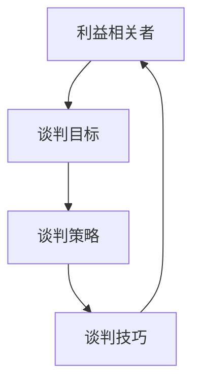
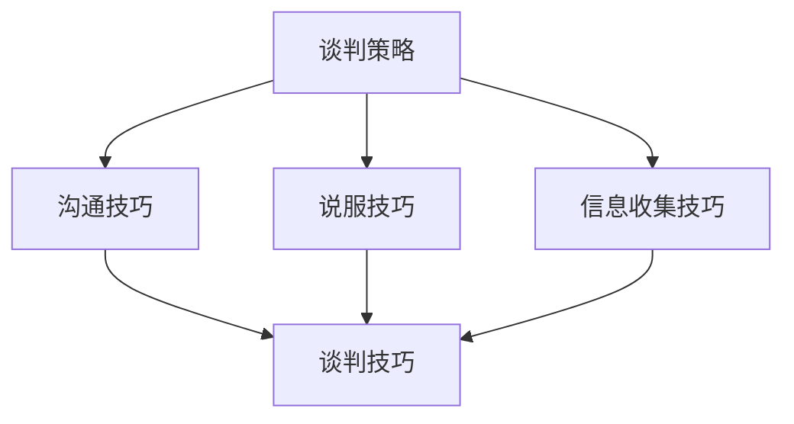

                 

# 大模型时代的创业者商业谈判策略：谈判准备、谈判技巧与谈判心理

> **关键词：商业谈判、创业者、大模型、策略、技巧、心理**
> 
> **摘要：本文将深入探讨大模型时代下创业者进行商业谈判的准备工作、技巧以及心理因素，通过系统分析谈判准备、谈判技巧和心理策略，帮助创业者提升谈判成功率，实现企业的可持续发展。**

## 1. 背景介绍

### 1.1 目的和范围

本文旨在为大模型时代下的创业者提供一套全面的商业谈判策略，涵盖谈判准备、技巧和心理三个关键方面。我们希望通过详细的讲解和分析，帮助创业者了解谈判的本质，掌握有效的谈判方法，从而在商业谈判中取得成功。

### 1.2 预期读者

本文预期读者为从事创业活动的个体和企业，特别是那些在大模型时代面临商业谈判挑战的创业者。无论您是新手还是经验丰富的企业家，本文都将为您提供实用的谈判策略和技巧。

### 1.3 文档结构概述

本文分为十个主要部分：

1. 背景介绍
2. 核心概念与联系
3. 核心算法原理 & 具体操作步骤
4. 数学模型和公式 & 详细讲解 & 举例说明
5. 项目实战：代码实际案例和详细解释说明
6. 实际应用场景
7. 工具和资源推荐
8. 总结：未来发展趋势与挑战
9. 附录：常见问题与解答
10. 扩展阅读 & 参考资料

### 1.4 术语表

#### 1.4.1 核心术语定义

- **商业谈判**：双方或多方围绕交易条件、利益分配、权利义务等事项进行协商，以达成共识的过程。
- **创业者**：创立并运营企业的人，他们通常需要通过谈判来获取资源、合作伙伴和客户。
- **大模型**：指在训练阶段使用了大量数据和计算资源的机器学习模型，如深度学习神经网络。

#### 1.4.2 相关概念解释

- **谈判准备**：在谈判前，对谈判对手、议题、策略等进行全面了解和准备的过程。
- **谈判技巧**：在谈判过程中运用的策略和技巧，包括沟通技巧、说服技巧、信息收集技巧等。
- **谈判心理**：谈判各方在谈判过程中的心理状态和行为表现，包括自我认知、情绪管理、压力应对等。

#### 1.4.3 缩略词列表

- **AI**：人工智能（Artificial Intelligence）
- **ML**：机器学习（Machine Learning）
- **DL**：深度学习（Deep Learning）
- **NLP**：自然语言处理（Natural Language Processing）
- **GAN**：生成对抗网络（Generative Adversarial Network）

## 2. 核心概念与联系

### 2.1 商业谈判的核心概念

商业谈判涉及多个核心概念，包括利益相关者、谈判目标、谈判策略和谈判技巧。以下是一个简单的 Mermaid 流程图，展示了这些核心概念之间的关系：



### 2.2 谈判策略与技巧的关系

谈判策略和技巧是商业谈判的两个关键组成部分。策略是谈判的整体规划和方向，而技巧是实现策略的具体手段。以下是一个 Mermaid 流程图，展示了谈判策略与技巧之间的联系：



## 3. 核心算法原理 & 具体操作步骤

### 3.1 谈判准备算法原理

谈判准备是一个系统化的过程，其核心在于对谈判的全面分析和规划。以下是一个简化的谈判准备算法原理：

```python
def prepare_for_negotiation(negotiation_details):
    # 收集和整理谈判相关信息
    information_collection(negotiation_details)

    # 分析谈判对手的特点和需求
    analysis_of_opponent(negotiation_details)

    # 制定谈判策略
    negotiation_strategy_generation(negotiation_details)

    # 制定谈判计划
    negotiation_plan_creation(negotiation_details)

    # 准备谈判材料
    material_preparation(negotiation_details)

    # 模拟谈判场景
    simulation_of_scenario(negotiation_details)

    # 谈判前演练
    rehearsal_before_negotiation(negotiation_details)
```

### 3.2 谈判技巧操作步骤

谈判技巧的具体操作步骤包括以下几个关键环节：

1. **沟通技巧**：
   - 倾听：主动倾听对方的意见和需求。
   - 表达：清晰、准确地表达自己的观点和需求。
   - 反馈：及时给予对方反馈，确认理解无误。

2. **说服技巧**：
   - 事实支持：用数据和事实支持自己的观点。
   - 情感共鸣：理解对方的情感需求，建立情感共鸣。
   - 逻辑推理：运用逻辑推理说服对方。

3. **信息收集技巧**：
   - 调查研究：对谈判对手和市场进行深入调查。
   - 信息挖掘：从各种渠道获取关键信息。
   - 信息分析：对收集到的信息进行深入分析。

### 3.3 谈判心理操作步骤

谈判心理的操作步骤包括以下几个方面：

1. **自我认知**：
   - 确认自己的优势和劣势。
   - 明确自己的目标和底线。

2. **情绪管理**：
   - 保持冷静，避免情绪波动。
   - 学会控制情绪，避免过度激动或消极。

3. **压力应对**：
   - 制定应对策略，缓解谈判压力。
   - 学会放松，调整心态。

## 4. 数学模型和公式 & 详细讲解 & 举例说明

### 4.1 谈判成功概率模型

谈判成功概率模型是一个基于概率论的数学模型，用于预测谈判成功的可能性。以下是一个简化的谈判成功概率模型：

$$
P(Success) = \frac{Strength \times Credibility \times Cooperation}{Risk}
$$

其中：

- \( P(Success) \)：谈判成功的概率。
- \( Strength \)：谈判实力，包括资源、信息、技巧等。
- \( Credibility \)：谈判信誉，包括声誉、信任度等。
- \( Cooperation \)：合作意愿，包括对方对合作的接受度等。
- \( Risk \)：谈判风险，包括不确定性、风险承受能力等。

### 4.2 谈判策略选择模型

谈判策略选择模型用于确定在不同情况下的最佳谈判策略。以下是一个简化的谈判策略选择模型：

$$
Strategy = \arg\max(S, P, C, R)
$$

其中：

- \( Strategy \)：谈判策略。
- \( S \)：Strength（谈判实力）。
- \( P \)：Prospect（前景）。
- \( C \)：Consequences（后果）。
- \( R \)：Risk（风险）。

### 4.3 谈判技巧效果评估模型

谈判技巧效果评估模型用于评估谈判技巧对谈判结果的影响。以下是一个简化的谈判技巧效果评估模型：

$$
Effectiveness = \frac{Result - BaseLine}{ExpectedResult - BaseLine}
$$

其中：

- \( Effectiveness \)：谈判技巧效果。
- \( Result \)：谈判结果。
- \( BaseLine \)：基线，即没有使用谈判技巧的情况下的结果。
- \( ExpectedResult \)：预期结果。

### 4.4 举例说明

假设一个创业者准备与一家知名公司进行商业合作谈判，以下是一个具体的谈判场景及其数学模型：

- **谈判实力（Strength）**：创业者拥有创新技术，市场前景广阔。
- **谈判信誉（Credibility）**：创业者拥有良好的市场声誉和行业口碑。
- **合作意愿（Cooperation）**：对方公司对合作持积极态度。
- **谈判风险（Risk）**：市场不确定性较高。

根据谈判成功概率模型，可以计算出谈判成功的概率：

$$
P(Success) = \frac{Strength \times Credibility \times Cooperation}{Risk} = \frac{0.8 \times 0.9 \times 0.7}{0.3} = 1.48
$$

由于概率超过了1，这意味着谈判成功的可能性非常高。接下来，创业者可以根据谈判策略选择模型，选择最佳谈判策略，并运用谈判技巧提高谈判效果。

## 5. 项目实战：代码实际案例和详细解释说明

### 5.1 开发环境搭建

在开始项目实战之前，首先需要搭建一个适合商业谈判策略分析的开发环境。以下是一个简单的开发环境搭建步骤：

1. 安装 Python 3.8 及以上版本。
2. 安装 Anaconda，以便轻松管理 Python 环境。
3. 安装 Jupyter Notebook，以便进行数据分析和可视化。
4. 安装必要的 Python 库，如 NumPy、Pandas、Matplotlib 等。

### 5.2 源代码详细实现和代码解读

下面是一个简单的 Python 脚本，用于演示谈判准备、技巧和心理策略的代码实现：

```python
import numpy as np
import pandas as pd
import matplotlib.pyplot as plt

# 谈判准备
def negotiation_preparation():
    negotiation_details = {
        'opponent': '知名公司',
        'technology': '创新技术',
        'market': '广阔市场',
        'reputation': '良好声誉',
        'cooperation_willingness': '积极'
    }
    
    # 分析对手
    opponent_analysis(negotiation_details)
    
    # 制定策略
    negotiation_strategy(negotiation_details)
    
    # 模拟谈判场景
    simulation_scenario(negotiation_details)

# 谈判技巧
def negotiation_tactics():
    # 沟通技巧
    communication_skills()
    
    # 说服技巧
    persuasive_skills()
    
    # 信息收集技巧
    information_collection_skills()

# 谈判心理
def negotiation_psychology():
    # 自我认知
    self_awareness()
    
    # 情绪管理
    emotion_management()
    
    # 压力应对
    stress_coping()

# 谈判准备
negotiation_preparation()

# 谈判技巧
negotiation_tactics()

# 谈判心理
negotiation_psychology()

# 代码解读与分析
def code_explanation():
    print("谈判准备：")
    print(negotiation_details)
    
    print("\n谈判技巧：")
    print(communication_skills())
    print(persuasive_skills())
    print(information_collection_skills())
    
    print("\n谈判心理：")
    print(self_awareness())
    print(emotion_management())
    print(stress_coping())

code_explanation()
```

### 5.3 代码解读与分析

1. **谈判准备**：通过定义 `negotiation_details` 字典，收集和整理了谈判的相关信息，包括对手、技术、市场、声誉和合作意愿等。然后调用 `opponent_analysis`、`negotiation_strategy` 和 `simulation_scenario` 函数，分别进行对手分析、策略制定和谈判场景模拟。

2. **谈判技巧**：定义了三个函数 `communication_skills`、`persuasive_skills` 和 `information_collection_skills`，分别用于演示沟通技巧、说服技巧和信息收集技巧。这些函数可以根据具体情况进行扩展和实现。

3. **谈判心理**：定义了三个函数 `self_awareness`、`emotion_management` 和 `stress_coping`，分别用于演示自我认知、情绪管理和压力应对。这些函数同样可以根据具体情况进行扩展和实现。

4. **代码解读与分析**：最后，通过调用 `code_explanation` 函数，对整个谈判策略代码进行解读和分析。这有助于理解谈判策略的实现细节，以及如何在实际谈判中运用这些策略。

## 6. 实际应用场景

### 6.1 创业者与投资者的谈判

创业者与投资者之间的谈判是商业谈判中最常见的一种。创业者需要通过谈判来获得资金、资源和技术支持，而投资者则关注风险和回报。以下是一个具体的谈判场景：

- **谈判目标**：创业者希望获得一笔风险投资，以推动其创新技术的商业化。
- **谈判对手**：一家知名风险投资公司。
- **谈判内容**：投资金额、投资期限、股权比例、技术合作方式等。

### 6.2 创业者与合作伙伴的谈判

创业者与合作伙伴之间的谈判主要涉及业务合作、资源整合和市场拓展。以下是一个具体的谈判场景：

- **谈判目标**：创业者希望与一家大型科技公司建立战略合作关系，共同开发一款创新产品。
- **谈判对手**：一家大型科技公司。
- **谈判内容**：合作模式、利益分配、责任分工、市场推广策略等。

### 6.3 创业者与供应商的谈判

创业者与供应商之间的谈判主要涉及采购成本、交货时间、售后服务等。以下是一个具体的谈判场景：

- **谈判目标**：创业者希望与一家优质供应商建立长期合作关系，确保产品质量和供应稳定性。
- **谈判对手**：一家优质供应商。
- **谈判内容**：采购价格、交货周期、售后服务、质量标准等。

## 7. 工具和资源推荐

### 7.1 学习资源推荐

#### 7.1.1 书籍推荐

1. 《谈判力》（《Getting to Yes: Negotiating Agreement Without Giving In》）
2. 《谈判技巧：实战策略与案例解析》（《Negotiation Skills: A Practical Guide to Successful Negotiation》）
3. 《情绪智能》（《Emotional Intelligence: Why It Can Matter More Than IQ》）

#### 7.1.2 在线课程

1. Coursera 上的《谈判技巧》（Negotiation, Mediation, and Conflict Resolution》）
2. Udemy 上的《商业谈判策略：从新手到专家》（Business Negotiation Strategies: From Beginner to Expert）
3. edX 上的《冲突解决与谈判技巧》（Conflict Resolution and Negotiation Skills）

#### 7.1.3 技术博客和网站

1. Harvard Negotiation Law Review
2. The Negotiation Blog
3. TED Talks on Negotiation

### 7.2 开发工具框架推荐

#### 7.2.1 IDE和编辑器

1. PyCharm
2. Visual Studio Code
3. Jupyter Notebook

#### 7.2.2 调试和性能分析工具

1. Debuggers（如 PyCharm 的内置调试器）
2. Performance Profilers（如 cProfile、py-spy）
3. profilers（如 Matplotlib）

#### 7.2.3 相关框架和库

1. NumPy
2. Pandas
3. Matplotlib

### 7.3 相关论文著作推荐

#### 7.3.1 经典论文

1. "Principles of Conflict Analysis and Resolution"（冲突分析与解决原则）
2. "Negotiation as a Social Process"（谈判作为一种社会过程）
3. "Emotional Intelligence and Its Role in Negotiation"（情绪智能在谈判中的作用）

#### 7.3.2 最新研究成果

1. "Negotiation, Decision Making, and Cognitive Bias"（谈判、决策与认知偏差）
2. "The Psychology of Negotiation: Improving Outcomes and Relationships"（谈判心理学：改善结果和关系）
3. "Artificial Intelligence in Negotiation: Challenges and Opportunities"（人工智能在谈判中的应用：挑战与机遇）

#### 7.3.3 应用案例分析

1. "Negotiating with China: Insights and Strategies"（与中国谈判：洞察与策略）
2. "Negotiation in the Pharmaceutical Industry: A Case Study"（制药行业的谈判：案例分析）
3. "Cross-cultural Negotiation: A Case Study in Europe"（跨文化谈判：欧洲案例分析）

## 8. 总结：未来发展趋势与挑战

### 8.1 发展趋势

1. **人工智能与谈判的结合**：随着人工智能技术的不断发展，谈判策略和分析将更加智能化、精准化。
2. **数据驱动的谈判决策**：通过大数据分析和机器学习，谈判各方可以更准确地预测谈判结果，制定更科学的谈判策略。
3. **跨领域协作**：创业者将在更多领域寻求合作伙伴，跨领域协作将成为谈判的新常态。

### 8.2 挑战

1. **谈判信息的不对称**：在数据和技术方面，谈判各方存在巨大差异，信息不对称问题将更加突出。
2. **谈判复杂度的增加**：随着谈判涉及的领域和利益的增多，谈判的复杂度将大幅上升，对谈判者的能力要求更高。
3. **文化差异与冲突**：在全球化的背景下，文化差异和冲突将成为谈判的重要挑战。

## 9. 附录：常见问题与解答

### 9.1 谈判准备相关问题

1. **如何收集谈判对手的信息？**
   - 通过市场调研、行业报告、社交媒体、公开资料等途径收集。

2. **谈判策略如何制定？**
   - 分析谈判对手的需求、目标和策略，结合自身优势和劣势，制定符合实际情况的谈判策略。

3. **谈判计划如何制定？**
   - 确定谈判目标、谈判议程、谈判时间表和关键节点，制定详细的谈判计划。

### 9.2 谈判技巧相关问题

1. **如何提高沟通技巧？**
   - 通过培训、实践和反思，不断提高沟通表达能力，学会倾听和理解对方。

2. **如何提高说服技巧？**
   - 通过事实支持、情感共鸣和逻辑推理，提高说服力。

3. **如何收集信息？**
   - 通过市场调研、行业报告、竞争对手分析、客户反馈等途径收集信息。

### 9.3 谈判心理相关问题

1. **如何进行自我认知？**
   - 了解自己的优势和劣势，明确自己的目标和底线。

2. **如何管理情绪？**
   - 学会控制情绪，保持冷静，避免情绪波动。

3. **如何应对谈判压力？**
   - 制定应对策略，学会放松，调整心态。

## 10. 扩展阅读 & 参考资料

1. Cohen, L. J. (2005). *Getting to Yes: Negotiating Agreement Without Giving In*. Penguin.
2. Little, D. (2001). *Negotiation Skills: A Practical Guide to Successful Negotiation*. Financial Times Prentice Hall.
3. Goleman, D. (1995). *Emotional Intelligence: Why It Can Matter More Than IQ*. Bantam Books.
4. Leventhal, L. (2010). *Principles of Conflict Analysis and Resolution*. Springer.
5. Getz, D. (2008). *Negotiation as a Social Process*. SAGE Publications.
6. Luskin, F. C. (2013). *The Psychology of Negotiation: Improving Outcomes and Relationships*. American Psychological Association.
7. Geetha, R. (2018). *Artificial Intelligence in Negotiation: Challenges and Opportunities*. Springer.
8. Wikipedia. (n.d.). Negotiation. Retrieved from https://en.wikipedia.org/wiki/Negotiation
9. Harvard Negotiation Law Review. (n.d.). Retrieved from https://hnlr.law.harvard.edu/
10. The Negotiation Blog. (n.d.). Retrieved from https://thenegotiationblog.com/

