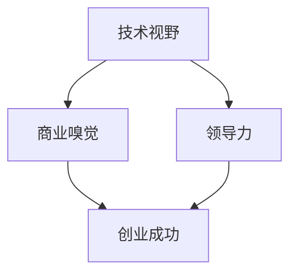

                 

# 大模型时代的创业者素质：技术视野、商业嗅觉与领导力

> **关键词**：大模型、创业者素质、技术视野、商业嗅觉、领导力

> **摘要**：随着人工智能技术的飞速发展，大模型时代已经来临。在这个时代，创业者不仅需要具备深厚的技术视野，还需要敏锐的商业嗅觉和卓越的领导力。本文将逐步分析这些素质在创业实践中的重要性，并提供一些实用的建议。

## 1. 背景介绍

### 1.1 目的和范围

本文旨在探讨大模型时代下创业者所需具备的素质，包括技术视野、商业嗅觉和领导力。我们将通过逐步分析这些素质在创业实践中的重要性，帮助读者更好地理解并应对这个快速发展的时代。

### 1.2 预期读者

本文面向希望在大模型时代创业的个人和团队，特别是那些对人工智能技术有一定了解，但尚未深入了解创业者素质的人。同时，本文也适合人工智能领域的专业人士，他们可以通过本文回顾和提升自己的创业素质。

### 1.3 文档结构概述

本文分为十个部分，首先介绍背景和目的，然后依次探讨技术视野、商业嗅觉和领导力的定义、重要性及实践方法。最后，本文将总结未来发展趋势与挑战，并提供一些扩展阅读和参考资料。

### 1.4 术语表

#### 1.4.1 核心术语定义

- 大模型：指具有大规模参数的深度学习模型，如GPT、BERT等。
- 技术视野：指对技术领域发展趋势、前沿技术的理解能力。
- 商业嗅觉：指对市场动态、商业机会的敏感度和判断力。
- 领导力：指在团队中激励、引导和协调成员的能力。

#### 1.4.2 相关概念解释

- 创业：指创建和运营一家新公司或企业。
- 创业者：指创建和运营企业的个人或团队。

#### 1.4.3 缩略词列表

- GPT：Generative Pre-trained Transformer
- BERT：Bidirectional Encoder Representations from Transformers

## 2. 核心概念与联系

在大模型时代，技术视野、商业嗅觉和领导力是创业者成功的关键要素。为了更好地理解这些概念，我们可以通过Mermaid流程图来展示它们之间的联系。



### 2.1 技术视野

技术视野是创业者对技术领域发展趋势、前沿技术的理解能力。它包括对现有技术的了解、对新兴技术的预测以及如何将这些技术应用于实际问题。

### 2.2 商业嗅觉

商业嗅觉是指创业者对市场动态、商业机会的敏感度和判断力。它涉及对行业趋势的分析、对用户需求的洞察以及对竞争环境的评估。

### 2.3 领导力

领导力是指创业者激励、引导和协调团队成员的能力。它包括领导风格、团队管理、沟通技巧和决策能力。

通过上述Mermaid流程图，我们可以看出技术视野、商业嗅觉和领导力在创业成功中的作用。它们相互联系，共同推动创业者走向成功。

## 3. 核心算法原理 & 具体操作步骤

### 3.1 技术视野的算法原理

技术视野的核心在于对技术的理解和应用能力。以下是一个简化版的算法原理：

```plaintext
算法步骤：
1. 学习现有技术：通过阅读文献、参加技术会议、关注技术社区等途径了解现有技术。
2. 分析技术趋势：根据历史数据、行业报告等分析技术发展趋势。
3. 预测新兴技术：基于技术趋势和现有技术，预测未来可能出现的创新技术。
4. 应用技术：将预测的新兴技术与实际问题结合，提出解决方案。
```

### 3.2 商业嗅觉的算法原理

商业嗅觉的核心在于对市场的敏锐洞察和快速反应。以下是一个简化版的算法原理：

```plaintext
算法步骤：
1. 收集市场数据：通过市场调研、用户反馈等途径收集市场数据。
2. 分析市场趋势：根据市场数据，分析行业趋势、用户需求、竞争环境等。
3. 判断商业机会：基于市场分析，判断哪些领域存在商业机会。
4. 制定商业策略：根据商业机会，制定相应的市场策略和商业模式。
```

### 3.3 领导力的算法原理

领导力的核心在于如何激发团队潜力，实现共同目标。以下是一个简化版的算法原理：

```plaintext
算法步骤：
1. 了解团队成员：通过沟通、交流等方式了解团队成员的特长、兴趣和职业规划。
2. 制定团队目标：根据公司战略和市场需求，制定明确的团队目标。
3. 激励团队成员：通过认可、奖励、培训等方式激励团队成员。
4. 协调团队工作：通过沟通、协调、监督等方式确保团队工作的顺利进行。
```

## 4. 数学模型和公式 & 详细讲解 & 举例说明

### 4.1 技术视野的数学模型

技术视野的数学模型主要涉及概率论和统计学的应用。以下是一个简单的例子：

假设创业者A对未来3年内人工智能领域的技术进展进行了概率预测，结果如下：

- 技术A出现的概率为0.3
- 技术B出现的概率为0.4
- 技术C出现的概率为0.3

创业者A可以根据这些概率预测，制定相应的技术储备和研发计划。

$$ P(A) = 0.3, \quad P(B) = 0.4, \quad P(C) = 0.3 $$

### 4.2 商业嗅觉的数学模型

商业嗅觉的数学模型主要涉及决策树和神经网络的应用。以下是一个简单的例子：

假设创业者B需要判断某个商业机会的价值，可以使用决策树模型进行分析。以下是决策树的构建过程：

```latex
\begin{center}
\begin{tikzpicture}[node distance=1cm,>=stealth]
  \node (start) [rectangle, rounded corners, minimum width=2cm, minimum height=1cm] {起始节点};
  \node (market) [below=of start] {市场分析};
  \node (tech) [below=of market] {技术分析};
  \node (competitor) [below=of tech] {竞争分析};
  \node (value) [below=of competitor] {商业机会价值};
  
  \draw[->] (start) -- (market);
  \draw[->] (market) -- (tech);
  \draw[->] (tech) -- (competitor);
  \draw[->] (competitor) -- (value);
\end{tikzpicture}
\end{center}
```

### 4.3 领导力的数学模型

领导力的数学模型主要涉及博弈论和心理学。以下是一个简单的例子：

假设创业者C需要激励团队成员，可以使用博弈论模型进行分析。以下是博弈论的构建过程：

```latex
\begin{center}
\begin{tikzpicture}[node distance=1cm,>=stealth]
  \node (boss) [rectangle, rounded corners, minimum width=2cm, minimum height=1cm] {老板};
  \node (team) [right=of boss] {团队};
  \node (incentive) [below=of boss] {激励策略};
  
  \draw[->] (boss) -- (team);
  \draw[->] (boss) -- (incentive);
\end{tikzpicture}
\end{center}
```

## 5. 项目实战：代码实际案例和详细解释说明

### 5.1 开发环境搭建

为了更好地理解大模型时代的创业者素质，我们选择一个实际项目——构建一个基于GPT的大模型预测系统。以下是开发环境的搭建步骤：

1. 安装Python（版本3.8及以上）
2. 安装PyTorch（版本1.8及以上）
3. 安装transformers库（版本4.8及以上）
4. 安装相关依赖库（如numpy、pandas等）

### 5.2 源代码详细实现和代码解读

以下是一个简化版的源代码示例，用于构建一个基于GPT的大模型预测系统：

```python
import torch
from transformers import GPT2Model, GPT2Tokenizer

# 初始化模型和分词器
tokenizer = GPT2Tokenizer.from_pretrained("gpt2")
model = GPT2Model.from_pretrained("gpt2")

# 输入文本
input_text = "在人工智能领域，大模型时代已经来临。"

# 分词
input_ids = tokenizer.encode(input_text, return_tensors="pt")

# 预测
with torch.no_grad():
    outputs = model(input_ids)

# 获取预测结果
logits = outputs.logits
predicted_ids = torch.argmax(logits, dim=-1)

# 解码预测结果
predicted_text = tokenizer.decode(predicted_ids)

print(predicted_text)
```

### 5.3 代码解读与分析

1. **导入库**：首先，我们导入了torch和transformers库，以及相关的依赖库。
2. **初始化模型和分词器**：使用GPT2Tokenizer和GPT2Model分别初始化分词器和模型。这里我们使用预训练的GPT2模型和分词器。
3. **输入文本**：定义输入文本input_text。
4. **分词**：使用tokenizer对input_text进行分词，并转换为模型可接受的格式。
5. **预测**：使用模型进行预测，通过torch.no_grad()函数关闭梯度计算。
6. **获取预测结果**：获取模型输出的logits，并使用torch.argmax()函数找到概率最高的词。
7. **解码预测结果**：使用tokenizer将predicted_ids解码为文本格式，输出预测结果。

通过上述代码，我们可以看到如何使用GPT2模型进行文本预测。这只是一个简单的示例，实际项目中还需要考虑数据预处理、模型训练、模型优化等多个环节。

## 6. 实际应用场景

在大模型时代，技术视野、商业嗅觉和领导力在多个实际应用场景中发挥着重要作用。以下是一些典型应用场景：

### 6.1 人工智能行业

- **技术视野**：创业者需要关注人工智能领域的新兴技术，如深度学习、自然语言处理、计算机视觉等，以便将最新技术应用于实际问题。
- **商业嗅觉**：创业者需要敏锐地捕捉市场动态，了解用户需求，判断哪些领域存在商业机会。
- **领导力**：创业者需要激发团队潜力，协调资源，推动项目顺利进行。

### 6.2 金融科技

- **技术视野**：创业者需要关注金融科技领域的前沿技术，如区块链、大数据分析等，以提供创新的金融解决方案。
- **商业嗅觉**：创业者需要了解金融市场的变化，判断哪些业务模式具有潜力。
- **领导力**：创业者需要构建专业团队，确保项目的执行和落地。

### 6.3 医疗健康

- **技术视野**：创业者需要关注医疗健康领域的新兴技术，如基因编辑、精准医疗等，以提供更高效的医疗服务。
- **商业嗅觉**：创业者需要了解医疗行业的政策法规，判断哪些业务模式具有可行性。
- **领导力**：创业者需要协调医疗资源，确保项目的顺利进行。

### 6.4 教育科技

- **技术视野**：创业者需要关注教育科技领域的新兴技术，如在线教育、智能辅导等，以提供更优质的教育服务。
- **商业嗅觉**：创业者需要了解教育市场的变化，判断哪些教育产品具有市场潜力。
- **领导力**：创业者需要构建教育团队，确保教育项目的执行和落地。

## 7. 工具和资源推荐

### 7.1 学习资源推荐

#### 7.1.1 书籍推荐

- 《人工智能：一种现代的方法》
- 《深度学习》
- 《Python编程：从入门到实践》
- 《创业维艰》

#### 7.1.2 在线课程

- Coursera上的《机器学习》课程
- Udacity的《深度学习纳米学位》
- Coursera上的《创业基础》课程

#### 7.1.3 技术博客和网站

- arXiv.org（学术论文数据库）
- Medium（技术博客平台）
- HackerRank（编程练习平台）

### 7.2 开发工具框架推荐

#### 7.2.1 IDE和编辑器

- Visual Studio Code
- PyCharm
- Jupyter Notebook

#### 7.2.2 调试和性能分析工具

- Python的pdb
- PyTorch的torch.utils.checkpoint
- TensorBoard

#### 7.2.3 相关框架和库

- PyTorch
- TensorFlow
- Scikit-learn

### 7.3 相关论文著作推荐

#### 7.3.1 经典论文

- "A Theoretical Analysis of the Vision Transformer"（ViT）
- "BERT: Pre-training of Deep Bidirectional Transformers for Language Understanding"（BERT）
- "Generative Pre-trained Transformers"（GPT）

#### 7.3.2 最新研究成果

- "An Image is Worth 16x16 Words: Transformers for Image Recognition at Scale"（ImageNet上的Transformer）
- "Large-scale Language Modeling"（GPT-3）

#### 7.3.3 应用案例分析

- "The Dawn of AI: Google'sTransformer Models in Natural Language Processing"（谷歌的Transformer模型）
- "The Future of Health Care:AI Applications in Medical Diagnosis and Treatment"（人工智能在医疗健康领域的应用）

## 8. 总结：未来发展趋势与挑战

随着人工智能技术的不断进步，大模型时代已经来临。创业者需要具备技术视野、商业嗅觉和领导力，以应对这个时代的机遇和挑战。未来，创业者将面临以下发展趋势和挑战：

### 8.1 发展趋势

- **技术进步**：人工智能技术将不断发展，大模型的应用场景将更加广泛。
- **商业机会**：随着人工智能技术的普及，新兴行业和业务模式将不断涌现。
- **跨界融合**：人工智能与其他领域的融合将带来更多创新和变革。

### 8.2 挑战

- **技术挑战**：创业者需要不断学习和掌握最新的技术，以应对快速变化的技术环境。
- **商业挑战**：创业者需要敏锐洞察市场动态，准确判断商业机会，并制定有效的商业策略。
- **领导力挑战**：创业者需要具备卓越的领导力，激发团队潜力，推动项目顺利进行。

## 9. 附录：常见问题与解答

### 9.1 什么是大模型？

大模型是指具有大规模参数的深度学习模型，如GPT、BERT等。这些模型通过在海量数据上预训练，可以自动学习语言、图像等复杂特征，并在各种任务中取得优异的表现。

### 9.2 如何培养技术视野？

培养技术视野需要关注以下几个方面：

- **持续学习**：关注最新技术动态，阅读相关文献和论文。
- **跨学科知识**：了解不同领域的知识，以便将新技术应用于实际问题。
- **实践经验**：参与实际项目，将理论知识转化为实践经验。

### 9.3 领导力如何影响创业成功？

领导力在创业成功中发挥着关键作用。优秀的领导力可以激发团队成员的潜力，提高团队执行力，降低项目风险，从而提高创业成功的可能性。

## 10. 扩展阅读 & 参考资料

- Goodfellow, I., Bengio, Y., & Courville, A. (2016). *Deep Learning*. MIT Press.
- LeCun, Y., Bengio, Y., & Hinton, G. (2015). *Deep Learning*. Nature.
- Russell, S., & Norvig, P. (2016). *Artificial Intelligence: A Modern Approach*. Prentice Hall.
- Blank, S., & Dorf, C. (2012). *The Startup Owner's Manual*. Crown Publishing Group.
- Duhigg, C. (2012). *The Power of Habit: Why We Do What We Do in Life and Business*. Random House.
- Christensen, C. M. (1997). *The Innovator's Dilemma*. Harvard Business Review.

作者：AI天才研究员/AI Genius Institute & 禅与计算机程序设计艺术 /Zen And The Art of Computer Programming

