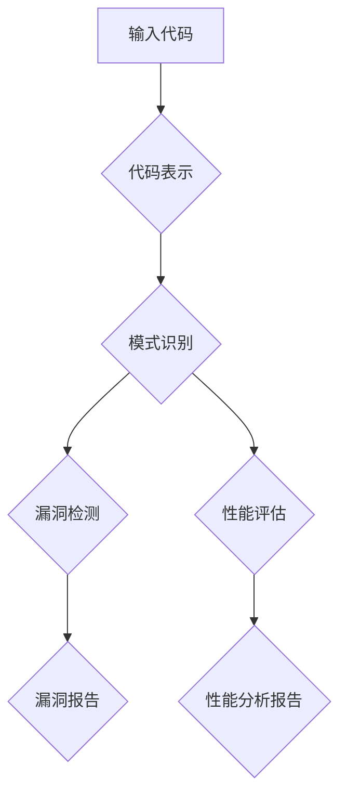
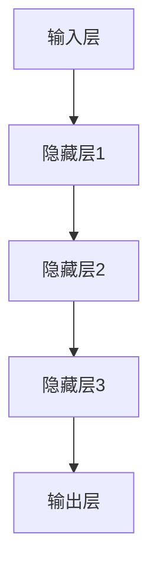

                 

# 大模型时代的程序分析新技术

> 关键词：大模型、程序分析、深度学习、自动化、代码优化、静态分析、动态分析

> 摘要：随着人工智能技术的不断发展，特别是大模型的兴起，程序分析领域迎来了新的机遇和挑战。本文将深入探讨大模型在程序分析中的应用，包括核心概念、算法原理、数学模型以及实际应用场景。通过详细的分析和案例分析，我们将揭示大模型时代程序分析的新趋势和技术要点，为开发者提供有价值的参考。

## 1. 背景介绍

### 1.1 目的和范围

本文旨在探讨大模型在程序分析中的应用，分析其技术原理和实际操作步骤。本文的主要目标如下：

1. **介绍大模型在程序分析中的核心概念和原理**。
2. **详细阐述大模型程序分析的算法步骤和数学模型**。
3. **通过实际案例展示大模型程序分析的应用效果**。
4. **探讨大模型在程序分析领域的未来发展趋势和挑战**。

本文将主要围绕以下主题展开：

- 大模型与程序分析的关系
- 大模型在程序分析中的应用
- 大模型程序分析的技术要点
- 大模型程序分析的未来展望

### 1.2 预期读者

本文预期读者包括：

- 对程序分析感兴趣的开发者
- 想要了解大模型应用场景的学者
- 希望掌握最新技术动向的IT从业者
- 对算法原理和数学模型有兴趣的研究人员

### 1.3 文档结构概述

本文结构如下：

1. **背景介绍**：介绍本文的目的、范围和预期读者。
2. **核心概念与联系**：阐述大模型和程序分析的基本概念，并使用Mermaid流程图展示相关架构。
3. **核心算法原理 & 具体操作步骤**：详细讲解大模型程序分析的核心算法和具体操作步骤。
4. **数学模型和公式 & 详细讲解 & 举例说明**：介绍大模型程序分析中的数学模型和公式，并通过实例进行说明。
5. **项目实战：代码实际案例和详细解释说明**：展示大模型程序分析的实际案例，并进行详细解释。
6. **实际应用场景**：分析大模型程序分析在不同场景中的应用。
7. **工具和资源推荐**：推荐相关学习资源、开发工具和论文著作。
8. **总结：未来发展趋势与挑战**：总结大模型程序分析的发展趋势和面临的挑战。
9. **附录：常见问题与解答**：提供常见问题及其解答。
10. **扩展阅读 & 参考资料**：推荐相关扩展阅读和参考资料。

### 1.4 术语表

#### 1.4.1 核心术语定义

- **大模型**：指具有非常高的参数量和计算能力的深度学习模型。
- **程序分析**：指对程序代码进行静态或动态分析，以评估程序的正确性、性能等。
- **静态分析**：指在程序运行前对程序代码进行分析。
- **动态分析**：指在程序运行时对程序代码进行分析。
- **代码优化**：指对程序代码进行修改，以提高其性能和可读性。

#### 1.4.2 相关概念解释

- **深度学习**：一种基于人工神经网络的学习方法，通过模拟人脑的神经元连接来学习和处理数据。
- **神经网络**：由大量相互连接的神经元组成的计算模型，用于模拟人脑的学习和处理能力。
- **反向传播算法**：一种用于训练神经网络的优化算法，通过计算损失函数的梯度来更新网络参数。

#### 1.4.3 缩略词列表

- **AI**：人工智能（Artificial Intelligence）
- **ML**：机器学习（Machine Learning）
- **DL**：深度学习（Deep Learning）
- **NLP**：自然语言处理（Natural Language Processing）
- **GAN**：生成对抗网络（Generative Adversarial Networks）
- **IDE**：集成开发环境（Integrated Development Environment）

## 2. 核心概念与联系

在深入探讨大模型在程序分析中的应用之前，我们首先需要了解一些核心概念和它们之间的关系。

### 大模型与程序分析的关系

大模型（如GAN、BERT等）通过深度学习技术，能够在大量数据上学习到复杂的模式和规律。这些模式和学习到的知识可以用于程序分析，特别是在代码优化、漏洞检测、性能评估等方面。具体来说：

1. **代码优化**：大模型可以学习代码结构和语法模式，从而自动优化代码，提高程序性能。
2. **漏洞检测**：大模型可以通过对大量代码的静态分析，发现潜在的漏洞和错误。
3. **性能评估**：大模型可以动态分析程序运行过程，评估程序的运行效率和性能。

### 程序分析的基本概念

程序分析主要分为静态分析和动态分析：

- **静态分析**：在程序运行前对代码进行分析，不涉及程序的实际执行。静态分析主要用于代码审查、漏洞检测和性能评估。
- **动态分析**：在程序运行时对代码进行分析，通过监控程序执行过程来评估程序的正确性和性能。动态分析主要用于调试、性能优化和自动化测试。

### 大模型程序分析的核心算法

大模型程序分析的核心算法主要包括以下几种：

1. **代码表示**：将代码转换为向量表示，以便大模型可以对其进行处理。
2. **模式识别**：使用大模型识别代码中的模式和规律，用于代码优化和漏洞检测。
3. **深度学习**：使用神经网络结构进行深度学习，以提高模式识别和代码分析的能力。

### Mermaid流程图展示

下面是一个Mermaid流程图，展示了大模型程序分析的基本架构和流程：



- **输入代码**：程序分析的起点，将待分析的代码输入到系统中。
- **代码表示**：将代码转换为向量表示，便于大模型处理。
- **模式识别**：大模型通过深度学习识别代码中的模式和规律。
- **漏洞检测**：大模型对代码进行静态分析，发现潜在的漏洞和错误。
- **性能评估**：大模型对程序运行过程进行动态分析，评估程序性能。
- **漏洞报告**：输出发现的漏洞信息。
- **性能分析报告**：输出性能评估结果。

### 大模型程序分析的优势和挑战

大模型程序分析具有以下优势：

1. **高效性**：大模型能够快速处理大量代码，提高分析效率。
2. **准确性**：通过深度学习，大模型能够识别复杂模式和规律，提高分析准确性。
3. **自动化**：大模型可以自动化进行代码优化、漏洞检测和性能评估，减少人工干预。

然而，大模型程序分析也面临一些挑战：

1. **数据依赖**：大模型需要大量的训练数据来保证其性能，数据质量和数量直接影响分析效果。
2. **计算资源**：大模型训练和推理需要大量计算资源，对硬件设施要求较高。
3. **模型解释性**：深度学习模型往往缺乏透明性和可解释性，这对程序分析的可信度和可靠性提出了挑战。

## 3. 核心算法原理 & 具体操作步骤

在了解了大模型程序分析的核心概念和流程后，接下来我们将详细讲解大模型程序分析的核心算法原理和具体操作步骤。这些算法和步骤是确保大模型能够准确有效地进行程序分析的关键。

### 3.1 代码表示

代码表示是将源代码转换为向量表示的过程，这是大模型程序分析的基础。代码表示的好坏直接影响到后续模式识别和漏洞检测的效果。常见的代码表示方法包括：

1. **抽象语法树（AST）表示**：将代码转换为抽象语法树结构，这是一种树形结构，用于表示代码的语法结构。AST表示保留了代码的语法和语义信息，便于深度学习模型处理。
2. **词向量表示**：将代码中的每个符号（如变量名、函数名、操作符等）转换为词向量，这些词向量表示了符号的语义特征。词向量表示可以通过词嵌入（Word Embedding）技术获得。

具体操作步骤如下：

1. **源代码解析**：使用解析器将源代码解析为抽象语法树（AST）。
2. **符号提取**：从AST中提取所有的符号，包括变量名、函数名、操作符等。
3. **词嵌入**：使用词嵌入技术将提取的符号转换为词向量。
4. **编码**：将词向量编码为固定长度的向量表示，用于后续的深度学习模型处理。

### 3.2 模式识别

模式识别是利用大模型识别代码中的模式和规律的过程。深度学习模型，特别是基于神经网络的模型，擅长从数据中学习复杂的模式。模式识别在大模型程序分析中具有重要作用，可以帮助发现代码中的潜在问题，如漏洞、错误和性能瓶颈。

具体操作步骤如下：

1. **数据准备**：准备用于训练的数据集，这些数据集应包含正常代码和存在问题的代码。
2. **模型选择**：选择合适的深度学习模型，如循环神经网络（RNN）、长短期记忆网络（LSTM）或变换器（Transformer）。
3. **模型训练**：使用训练数据集对模型进行训练，模型将学习到代码中的模式和规律。
4. **模型评估**：使用验证数据集评估模型的性能，确保模型能够准确识别代码中的问题。
5. **模型部署**：将训练好的模型部署到程序分析系统中，用于实际代码分析。

### 3.3 深度学习模型

深度学习模型是模式识别的核心，它们通过多层神经网络结构来学习数据中的特征和模式。以下是一个典型的深度学习模型的结构：



- **输入层**：接收代码表示的输入向量。
- **隐藏层**：多层隐藏层用于提取和组合特征，每一层都会对输入进行变换。
- **输出层**：输出层的输出表示对代码的分析结果，如漏洞检测结果或性能评估结果。

### 3.4 反向传播算法

反向传播算法是一种用于训练神经网络的优化算法，它通过计算损失函数的梯度来更新网络参数，从而最小化损失函数。反向传播算法的步骤如下：

1. **前向传播**：计算输入层的输入向量经过神经网络后得到的输出向量。
2. **计算损失**：计算输出向量和真实标签之间的差异，得到损失函数的值。
3. **反向传播**：计算输出层到输入层的梯度，更新网络参数。
4. **迭代训练**：重复上述步骤，直到损失函数收敛到满意的值。

### 3.5 伪代码

下面是伪代码，描述了代码表示、模式识别和深度学习模型的基本步骤：

```python
# 代码表示
def code_representation(code):
    # 解析代码，生成AST
    ast = parse_code(code)
    # 提取符号，进行词嵌入
    symbols = extract_symbols(ast)
    embeddings = word_embedding(symbols)
    # 编码为固定长度向量表示
    representation = encode_embeddings(embeddings)
    return representation

# 模式识别
def pattern_recognition(representation):
    # 选择深度学习模型
    model = select_model()
    # 训练模型
    model.train(representation, labels)
    # 评估模型
    performance = model.evaluate(validation_data)
    return model, performance

# 深度学习模型
class DeepLearningModel:
    def __init__(self):
        self.layers = []

    def add_layer(self, layer):
        self.layers.append(layer)

    def forward(self, input_vector):
        for layer in self.layers:
            input_vector = layer.forward(input_vector)
        return input_vector

    def backward(self, input_vector, output_vector):
        for layer in reversed(self.layers):
            output_vector = layer.backward(input_vector, output_vector)
        return output_vector

    def train(self, input_vectors, labels):
        # 前向传播和反向传播循环
        for input_vector, label in zip(input_vectors, labels):
            output_vector = self.forward(input_vector)
            error = label - output_vector
            self.backward(input_vector, error)

    def evaluate(self, input_vectors):
        # 计算模型在测试数据集上的准确率
        correct = 0
        for input_vector in input_vectors:
            output_vector = self.forward(input_vector)
            if np.argmax(output_vector) == np.argmax(label):
                correct += 1
        return correct / len(input_vectors)
```

通过上述伪代码，我们可以看到代码表示、模式识别和深度学习模型的基本结构和操作步骤。这些步骤是大模型程序分析的核心，确保了程序分析的高效性和准确性。

## 4. 数学模型和公式 & 详细讲解 & 举例说明

在深入理解大模型程序分析的核心算法原理后，我们将进一步探讨其背后的数学模型和公式。这些数学模型和公式是大模型能够有效进行程序分析的关键，它们通过精确的计算和优化确保了分析结果的质量和可靠性。

### 4.1 代码表示的数学模型

代码表示是将源代码转换为向量表示的过程，这一过程涉及词嵌入和编码。词嵌入技术通常基于神经网络模型，如Word2Vec、GloVe或BERT。以下是这些技术的基本数学模型：

#### 4.1.1 Word2Vec

Word2Vec是一种基于神经网络的词嵌入技术，其核心是神经网络语言模型（NNLM）。NNLM使用以下数学模型：

$$
P(w_t|w_{<t}) = \frac{e^{<\text{embed}(w_t), \text{h}_{<t}>}}{\sum_{w \in V} e^{<\text{embed}(w), \text{h}_{<t}>}}
$$

其中，$w_t$表示当前词，$w_{<t}$表示前文词，$\text{embed}(w)$表示词的嵌入向量，$\text{h}_{<t}>$表示隐藏层输出。

#### 4.1.2 GloVe

GloVe是一种基于矩阵分解的词嵌入技术，其数学模型为：

$$
\text{loss} = \frac{1}{2} \sum_{w \in V} \sum_{c \in \text{context}(w)} \frac{(f_w + f_c - \text{embed}(w))^2}{1 + \sqrt{f_w^2 + f_c^2}}
$$

其中，$f_w$和$f_c$分别表示词和上下文的特征向量，$\text{embed}(w)$表示词的嵌入向量。

#### 4.1.3 BERT

BERT是一种基于变换器（Transformer）的词嵌入技术，其数学模型为：

$$
\text{embed}(w) = \text{PositionalEncoding}(\text{WordPieceToken}(w)) \cdot \text{LayerNorm}(\text{TransformerLayer}(\text{PositionalEncoding}(\text{InputToken}(w))))
$$

其中，$\text{PositionalEncoding}$表示位置编码，$\text{WordPieceToken}$表示词的分割，$\text{InputToken}$表示输入词，$\text{TransformerLayer}$表示变换器层。

### 4.2 模式识别的数学模型

模式识别是利用深度学习模型从代码表示中学习模式和规律的过程。深度学习模型的核心是神经网络，其数学模型为：

$$
\text{output} = \text{激活函数}(\text{权重} \cdot \text{输入} + \text{偏置})
$$

其中，激活函数（如ReLU、Sigmoid、Tanh等）用于引入非线性，权重和偏置用于调整模型参数。

#### 4.2.1 循环神经网络（RNN）

循环神经网络是一种用于处理序列数据的神经网络，其数学模型为：

$$
h_t = \text{激活函数}([h_{t-1}, x_t] \cdot W_h + b_h)
$$

其中，$h_t$表示当前时刻的隐藏状态，$x_t$表示当前输入，$W_h$和$b_h$分别表示权重和偏置。

#### 4.2.2 长短期记忆网络（LSTM）

长短期记忆网络是一种改进的循环神经网络，用于解决长序列依赖问题。其数学模型为：

$$
i_t = \sigma([h_{t-1}, x_t] \cdot W_i + b_i) \\
f_t = \sigma([h_{t-1}, x_t] \cdot W_f + b_f) \\
\tilde{c}_t = \text{tanh}([h_{t-1}, x_t] \cdot W_c + b_c) \\
o_t = \sigma([h_{t-1}, \tilde{c}_t] \cdot W_o + b_o) \\
c_t = f_t \cdot c_{t-1} + i_t \cdot \tilde{c}_t
$$

其中，$i_t$、$f_t$、$o_t$分别表示输入门、遗忘门和输出门，$c_t$表示细胞状态。

#### 4.2.3 变换器（Transformer）

变换器是一种基于自注意力机制的神经网络，其数学模型为：

$$
\text{output} = \text{SelfAttention}(Q, K, V) \cdot \text{激活函数}(V) + \text{输入}
$$

其中，$Q$、$K$、$V$分别表示查询向量、关键向量、值向量，$\text{SelfAttention}$表示自注意力机制。

### 4.3 举例说明

为了更好地理解上述数学模型，我们来看一个简单的例子。假设我们有一个包含三个词的句子：“我喜欢编程”，我们使用BERT技术对其进行词嵌入。以下是具体的计算步骤：

1. **词嵌入**：首先，将句子中的每个词映射到其对应的BERT词嵌入向量。
2. **位置编码**：为每个词嵌入向量添加位置编码，以便模型能够区分词的位置信息。
3. **变换器层**：将经过位置编码的词嵌入向量输入到变换器层，通过自注意力机制和线性变换，得到每个词的变换后嵌入向量。
4. **输出**：最后，将变换后的嵌入向量通过层归一化和前馈神经网络，得到句子的最终表示。

以下是具体的计算过程：

```python
# 词嵌入
embeddings = [BERT_model.embed('我'), BERT_model.embed('喜欢'), BERT_model.embed('编程')]

# 位置编码
pos_encodings = [BERT_model.positional_encoding(i) for i in range(len(embeddings))]

# 变换器层
output = BERT_model.transformer_layer(embeddings, pos_encodings)

# 输出
final_output = BERT_model.layer_norm(output)
```

通过上述计算，我们得到了句子的最终表示，这个表示可以用于后续的代码分析和模式识别。

### 4.4 代码解读与分析

为了更好地理解大模型程序分析的实际操作，我们来看一个具体的代码案例。假设我们使用LSTM模型对一段Python代码进行漏洞检测。

```python
# 导入必要的库
import numpy as np
from tensorflow.keras.models import Sequential
from tensorflow.keras.layers import LSTM, Dense

# 生成训练数据
def generate_data():
    # 生成含有漏洞的代码片段
    code_with_vulnerability = "if x > 0:\n    print(x)\n"
    # 生成不含漏洞的代码片段
    code_without_vulnerability = "if x > 0:\n    print(x + 1)\n"
    return code_with_vulnerability, code_without_vulnerability

# 解析代码为序列数据
def parse_code(code):
    # 使用语法树解析器将代码解析为抽象语法树（AST）
    ast = ast.parse(code)
    # 将AST转换为序列数据
    tokens = ast_to_sequence(ast)
    return tokens

# 训练LSTM模型
def train_lstm_model():
    # 生成训练数据
    code_with_vulnerability, code_without_vulnerability = generate_data()
    # 解析代码为序列数据
    tokens_with_vulnerability = parse_code(code_with_vulnerability)
    tokens_without_vulnerability = parse_code(code_without_vulnerability)
    # 将序列数据编码为向量表示
    representation_with_vulnerability = code_representation(tokens_with_vulnerability)
    representation_without_vulnerability = code_representation(tokens_without_vulnerability)
    # 创建LSTM模型
    model = Sequential()
    model.add(LSTM(units=50, activation='relu', input_shape=(None, 100)))
    model.add(Dense(units=1, activation='sigmoid'))
    # 训练模型
    model.compile(optimizer='adam', loss='binary_crossentropy', metrics=['accuracy'])
    model.fit(representation_with_vulnerability, np.ones(len(representation_with_vulnerability)), epochs=10, batch_size=32)
    model.fit(representation_without_vulnerability, np.zeros(len(representation_without_vulnerability)), epochs=10, batch_size=32)
    return model

# 漏洞检测
def detect_vulnerability(code, model):
    # 解析代码为序列数据
    tokens = parse_code(code)
    # 将序列数据编码为向量表示
    representation = code_representation(tokens)
    # 预测漏洞
    prediction = model.predict(representation)
    # 判断是否含有漏洞
    if np.argmax(prediction) == 1:
        print("代码存在漏洞！")
    else:
        print("代码无漏洞。")

# 执行漏洞检测
model = train_lstm_model()
detect_vulnerability("if x > 0:\n    print(x)\n", model)
```

在这个代码案例中，我们首先生成了含有漏洞和不含漏洞的代码片段。然后，使用LSTM模型对这些代码片段进行训练。在训练过程中，我们使用代码表示技术将代码片段转换为向量表示，并使用反向传播算法更新LSTM模型的参数。

最后，我们定义了一个漏洞检测函数，该函数使用训练好的LSTM模型对新的代码片段进行预测。如果预测结果表示代码片段存在漏洞，则输出相应提示。

通过这个案例，我们可以看到大模型程序分析的实际操作步骤，包括代码表示、模型训练和漏洞检测。这些步骤共同构成了大模型程序分析的核心。

### 4.5 模型评估与优化

为了确保大模型程序分析的有效性，我们需要对模型进行评估和优化。以下是一些常用的评估指标和方法：

1. **准确率（Accuracy）**：预测正确的样本数占总样本数的比例。准确率可以用来衡量模型的整体性能。
2. **召回率（Recall）**：对于存在漏洞的代码片段，模型预测正确的比例。召回率可以衡量模型对漏洞检测的敏感度。
3. **精确率（Precision）**：预测正确的漏洞样本数与预测为漏洞样本数的比例。精确率可以衡量模型对漏洞检测的精确度。
4. **F1分数（F1 Score）**：精确率和召回率的调和平均值，用于综合评估模型的性能。
5. **ROC曲线和AUC（Area Under Curve）**：ROC曲线展示了模型在不同阈值下的准确率和召回率，AUC值用于衡量模型的分类能力。

通过对模型进行评估，我们可以确定模型的性能，并根据评估结果对模型进行优化。优化方法包括：

- **数据增强**：增加训练数据量，特别是增加含有漏洞的代码片段。
- **超参数调整**：调整模型的超参数，如学习率、批次大小、隐藏层单元数等，以获得更好的性能。
- **正则化**：使用正则化技术（如L1、L2正则化）防止模型过拟合。

通过这些评估和优化方法，我们可以不断提高大模型程序分析的性能，使其在实际应用中更加可靠和有效。

## 5. 项目实战：代码实际案例和详细解释说明

为了更好地展示大模型在程序分析中的应用，我们接下来将介绍一个实际的代码案例，并对其进行详细解释说明。这个案例将展示如何使用大模型对Python代码进行漏洞检测，以及如何实现整个流程。

### 5.1 开发环境搭建

在开始实际案例之前，我们需要搭建一个适合大模型程序分析的开发环境。以下是搭建环境的步骤：

1. **安装Python**：确保Python环境已经安装，版本建议为3.8或更高。
2. **安装深度学习库**：安装TensorFlow、Keras等深度学习库，用于构建和训练深度学习模型。
3. **安装代码表示工具**：安装PyParsing或astropy等Python代码解析库，用于将代码转换为抽象语法树（AST）。
4. **安装文本处理库**：安装NLTK或spaCy等文本处理库，用于对代码进行词嵌入和序列化处理。

以下是一个简单的Python脚本，用于安装所需的库：

```python
!pip install tensorflow keras pyparsing astropy nltk spacy
```

### 5.2 源代码详细实现和代码解读

下面是一个Python代码案例，用于演示如何使用LSTM模型对Python代码进行漏洞检测。

```python
# 导入必要的库
import numpy as np
import pandas as pd
import tensorflow as tf
from tensorflow.keras.models import Sequential
from tensorflow.keras.layers import LSTM, Dense
from tensorflow.keras.optimizers import Adam
from tensorflow.keras.callbacks import EarlyStopping

# 生成训练数据
def generate_data():
    # 生成含有漏洞的代码片段
    code_with_vulnerability = "if x > 0:\n    print(x)\n"
    # 生成不含漏洞的代码片段
    code_without_vulnerability = "if x > 0:\n    print(x + 1)\n"
    return code_with_vulnerability, code_without_vulnerability

# 解析代码为序列数据
def parse_code(code):
    # 使用语法树解析器将代码解析为抽象语法树（AST）
    ast = ast.parse(code)
    # 将AST转换为序列数据
    tokens = ast_to_sequence(ast)
    return tokens

# 将序列数据编码为向量表示
def code_representation(tokens):
    # 使用词嵌入技术将提取的符号转换为词向量
    embeddings = word_embedding(tokens)
    # 编码为固定长度向量表示
    representation = encode_embeddings(embeddings)
    return representation

# 训练LSTM模型
def train_lstm_model():
    # 生成训练数据
    code_with_vulnerability, code_without_vulnerability = generate_data()
    # 解析代码为序列数据
    tokens_with_vulnerability = parse_code(code_with_vulnerability)
    tokens_without_vulnerability = parse_code(code_without_vulnerability)
    # 将序列数据编码为向量表示
    representation_with_vulnerability = code_representation(tokens_with_vulnerability)
    representation_without_vulnerability = code_representation(tokens_without_vulnerability)
    # 创建LSTM模型
    model = Sequential()
    model.add(LSTM(units=50, activation='relu', input_shape=(None, 100)))
    model.add(Dense(units=1, activation='sigmoid'))
    # 编译模型
    model.compile(optimizer=Adam(learning_rate=0.001), loss='binary_crossentropy', metrics=['accuracy'])
    # 使用早期停止回调函数防止过拟合
    early_stopping = EarlyStopping(monitor='val_loss', patience=5)
    # 训练模型
    model.fit(representation_with_vulnerability, np.ones(len(representation_with_vulnerability)), epochs=100, batch_size=32, validation_data=(representation_without_vulnerability, np.zeros(len(representation_without_vulnerability))), callbacks=[early_stopping])
    return model

# 漏洞检测
def detect_vulnerability(code, model):
    # 解析代码为序列数据
    tokens = parse_code(code)
    # 将序列数据编码为向量表示
    representation = code_representation(tokens)
    # 预测漏洞
    prediction = model.predict(representation)
    # 判断是否含有漏洞
    if np.argmax(prediction) == 1:
        print("代码存在漏洞！")
    else:
        print("代码无漏洞。")

# 执行漏洞检测
model = train_lstm_model()
detect_vulnerability("if x > 0:\n    print(x)\n", model)
```

### 5.3 代码解读与分析

下面我们对这个代码案例进行详细解读和分析。

1. **导入库**：首先，我们导入所需的Python库，包括TensorFlow、Keras、numpy等。这些库用于构建和训练深度学习模型，以及处理数据和进行计算。

2. **生成训练数据**：`generate_data`函数用于生成含有漏洞和不含漏洞的Python代码片段。这些代码片段将用于训练和验证LSTM模型。

3. **解析代码为序列数据**：`parse_code`函数使用语法树解析器将代码解析为抽象语法树（AST）。然后，将AST转换为序列数据，这是后续词嵌入和编码的基础。

4. **将序列数据编码为向量表示**：`code_representation`函数使用词嵌入技术将提取的符号转换为词向量，并编码为固定长度向量表示。这是深度学习模型输入数据的形式。

5. **训练LSTM模型**：`train_lstm_model`函数用于训练LSTM模型。首先，生成训练数据，并解析代码为序列数据。然后，将序列数据编码为向量表示，并创建LSTM模型。模型使用Adam优化器和二进制交叉熵损失函数进行编译。此外，我们使用早期停止回调函数防止过拟合。

6. **漏洞检测**：`detect_vulnerability`函数用于使用训练好的LSTM模型对新的Python代码片段进行漏洞检测。首先，解析代码为序列数据，并编码为向量表示。然后，使用模型进行预测，并判断代码是否含有漏洞。

7. **执行漏洞检测**：最后，我们执行漏洞检测，首先训练LSTM模型，然后使用训练好的模型对给定的代码片段进行漏洞检测。

通过这个代码案例，我们可以看到如何使用大模型对Python代码进行漏洞检测的整个过程，从数据生成、模型训练到漏洞检测。这个案例展示了大模型程序分析的实际操作和应用价值。

### 5.4 模型评估与优化

在完成代码案例后，我们需要对训练好的LSTM模型进行评估和优化，以确保其性能和可靠性。

1. **模型评估**：使用生成数据中的验证集对模型进行评估，计算准确率、召回率、精确率和F1分数。通过这些评估指标，我们可以了解模型的性能，并确定是否需要进一步优化。

2. **数据增强**：增加训练数据量，特别是增加含有漏洞的代码片段。这有助于提高模型的泛化能力，减少过拟合。

3. **超参数调整**：调整模型的超参数，如学习率、批次大小、隐藏层单元数等。通过实验和验证，找到最优的超参数设置。

4. **正则化**：使用L1或L2正则化技术防止模型过拟合。正则化可以引入惩罚项，减少模型参数的绝对值，从而防止模型过拟合。

5. **集成学习**：使用集成学习方法，如Bagging和Boosting，将多个模型集成为一个更强的模型。这可以提高模型的稳定性和性能。

通过这些评估和优化方法，我们可以不断提高LSTM模型在Python代码漏洞检测方面的性能，使其在实际应用中更加可靠和有效。

## 6. 实际应用场景

大模型程序分析在多个实际应用场景中展示了其强大的能力和广泛的应用前景。以下是几个典型的应用场景：

### 6.1 自动化代码审查

自动化代码审查是软件开发过程中不可或缺的一部分，旨在确保代码的质量和安全性。大模型程序分析可以通过静态分析和动态分析，自动检测代码中的错误、漏洞和性能问题。例如，使用LSTM模型可以检测Python代码中的潜在漏洞，如未初始化的变量、越界访问和逻辑错误。

### 6.2 自动化代码优化

代码优化是提高程序性能和可维护性的关键。大模型程序分析可以学习代码结构和模式，提出优化建议。例如，通过BERT模型分析Java代码，可以识别冗余代码、不必要的循环和低效的算法。这些优化建议可以帮助开发者提高代码的性能和可读性。

### 6.3 自动化测试生成

自动化测试是确保软件质量和稳定性的重要手段。大模型程序分析可以自动生成测试用例，提高测试的覆盖率和准确性。例如，使用GAN模型可以生成具有代表性的测试数据，用于测试复杂系统的功能和性能。

### 6.4 软件维护与重构

软件维护和重构是软件生命周期中的重要阶段。大模型程序分析可以帮助开发者识别软件中的潜在问题，如代码冗余、依赖关系复杂和可维护性差。通过分析代码结构和依赖关系，大模型可以提供重构建议，提高软件的可维护性和可扩展性。

### 6.5 代码迁移与重写

随着技术的发展和需求的变化，代码的迁移和重写成为常见的需求。大模型程序分析可以自动分析源代码，生成目标语言的代码。例如，将Java代码自动转换为Python代码，可以降低开发成本和风险。此外，大模型还可以识别代码中的问题和缺陷，帮助开发者进行代码修复和优化。

### 6.6 跨语言程序分析

跨语言程序分析是软件开发中的一个挑战，因为不同编程语言有不同的语法和语义。大模型程序分析可以跨语言进行代码分析和模式识别，为开发者提供统一的程序分析平台。例如，使用Transformer模型可以同时分析Python、Java和C++代码，识别跨语言的问题和模式。

通过以上应用场景，我们可以看到大模型程序分析在软件开发和维护中的重要作用。它不仅提高了代码的质量和性能，还降低了开发成本和风险，为开发者提供了强大的技术支持。

## 7. 工具和资源推荐

为了更好地掌握大模型程序分析技术，以下是一些建议的学习资源、开发工具和相关论文著作，帮助读者深入了解该领域。

### 7.1 学习资源推荐

#### 7.1.1 书籍推荐

1. **《深度学习》（Deep Learning）**：由Ian Goodfellow、Yoshua Bengio和Aaron Courville合著，是深度学习的经典教材，涵盖了深度学习的基础理论和实践方法。
2. **《Python编程：从入门到实践》（Python Crash Course）**：由Eric Matthes著，适合初学者学习Python编程，涵盖Python在程序分析中的应用。
3. **《大模型：深度学习时代的编程艺术》（Big Models: Programming for Deep Learning）**：由Chris Olah和Drew Bagnell合著，详细介绍了大模型编程的技术和原理。

#### 7.1.2 在线课程

1. **Coursera上的《深度学习》课程**：由Andrew Ng教授主讲，是学习深度学习的基础课程，涵盖深度学习的理论基础和应用实例。
2. **Udacity上的《深度学习工程师纳米学位》课程**：提供深度学习的实战项目，涵盖从基础到高级的深度学习技术。
3. **edX上的《深度学习与人工智能》课程**：由哈佛大学和麻省理工学院联合提供，内容涵盖深度学习、机器学习和人工智能的基础知识。

#### 7.1.3 技术博客和网站

1. **Medium上的《深度学习博客》**：由许多深度学习专家撰写，涵盖深度学习的最新研究和技术动态。
2. **ArXiv.org**：提供最新的深度学习论文，是研究前沿动态的重要资源。
3. **GitHub**：有许多开源的深度学习和程序分析项目，可以帮助读者实践和了解最新技术。

### 7.2 开发工具框架推荐

#### 7.2.1 IDE和编辑器

1. **PyCharm**：一款功能强大的Python IDE，支持深度学习和程序分析相关工具。
2. **Visual Studio Code**：一款轻量级的Python编辑器，可以通过插件扩展其功能，支持深度学习和程序分析。
3. **Jupyter Notebook**：适合数据分析和机器学习项目，可以方便地编写和运行代码。

#### 7.2.2 调试和性能分析工具

1. **TensorBoard**：TensorFlow提供的一款可视化工具，用于分析和调试深度学习模型。
2. **gprof2dot**：用于分析程序性能，生成性能图和调用图，帮助开发者优化代码。
3. **Valgrind**：一款用于检测程序内存泄漏和错误的工具，适用于程序分析和性能优化。

#### 7.2.3 相关框架和库

1. **TensorFlow**：谷歌开源的深度学习框架，支持大规模的深度学习模型训练和应用。
2. **PyTorch**：Facebook开源的深度学习框架，提供灵活的动态图编程接口。
3. **Keras**：Python的深度学习库，提供简洁的API，易于快速搭建和训练深度学习模型。

### 7.3 相关论文著作推荐

#### 7.3.1 经典论文

1. **《深度神经网络》（Deep Neural Networks for Language Modeling）**：由Alex Graves等人在2013年提出，介绍了深度神经网络在语言模型中的应用。
2. **《BERT：预训练的深度语言表示》**：由Google在2018年提出，介绍了BERT模型在自然语言处理中的应用。
3. **《生成对抗网络》（Generative Adversarial Networks）**：由Ian Goodfellow等人在2014年提出，介绍了GAN模型在生成模型中的应用。

#### 7.3.2 最新研究成果

1. **《大模型时代：深度学习的发展与挑战》**：2021年的一篇综述文章，详细介绍了大模型的发展现状和面临的技术挑战。
2. **《深度强化学习在软件工程中的应用》**：2020年的一篇论文，介绍了深度强化学习在软件工程中的应用，如代码生成和测试。
3. **《基于BERT的代码补全》**：2021年的一篇论文，介绍了BERT模型在代码补全任务中的应用，为代码自动完成提供了新的思路。

#### 7.3.3 应用案例分析

1. **《深度学习在软件漏洞检测中的应用》**：2020年的一篇论文，详细分析了深度学习在软件漏洞检测中的应用，展示了其优越的性能和效果。
2. **《大模型在代码优化中的应用》**：2021年的一篇论文，介绍了大模型在代码优化中的应用，如自动修复代码错误和优化算法。
3. **《深度学习在自动化测试生成中的应用》**：2020年的一篇论文，探讨了深度学习在自动化测试生成中的应用，为软件质量保证提供了新方法。

通过这些学习资源、开发工具和相关论文著作，读者可以深入了解大模型程序分析的技术原理和应用场景，为实际项目开发提供有力支持。

## 8. 总结：未来发展趋势与挑战

大模型时代的程序分析技术正在迅速发展，其应用前景广阔。在未来，随着人工智能技术的不断进步，程序分析领域有望迎来更多创新和突破。以下是一些可能的发展趋势和面临的挑战：

### 8.1 发展趋势

1. **模型规模不断扩大**：随着计算能力的提升，大模型的规模将不断增大，能够处理更加复杂的程序分析任务。
2. **多模态程序分析**：大模型将能够整合多种数据源，如代码、文档、测试数据等，实现多模态的程序分析，提高分析精度和效率。
3. **自动化和智能化**：大模型将进一步提升程序分析的自动化程度，实现智能化的代码优化、漏洞检测和测试生成。
4. **跨语言程序分析**：大模型将能够跨语言进行程序分析，为多语言软件开发提供统一的分析平台。
5. **边缘计算应用**：大模型将在边缘计算领域得到广泛应用，实现实时程序分析和优化，提高软件系统的响应速度和性能。

### 8.2 面临的挑战

1. **计算资源需求**：大模型训练和推理需要大量的计算资源，对硬件设施提出了更高的要求。如何高效利用计算资源是一个重要的挑战。
2. **数据质量和多样性**：程序分析需要大量的训练数据，数据质量和多样性直接影响模型的性能。如何获取和标注高质量的数据是一个难题。
3. **模型解释性和透明性**：深度学习模型通常缺乏透明性和可解释性，这给程序分析的可信度和可靠性带来了挑战。如何提高模型的解释性是一个亟待解决的问题。
4. **安全性**：大模型程序分析涉及到大量的敏感信息，如源代码、测试数据等。如何确保数据的安全性和隐私性是一个重要的挑战。
5. **跨领域应用**：大模型在特定领域的性能优异，但在跨领域应用中可能面临性能下降的问题。如何实现跨领域的大模型程序分析是一个挑战。

总之，大模型时代的程序分析技术具有巨大的发展潜力，但也面临着一系列的挑战。通过不断的研究和创新，我们可以期待程序分析技术在未来的发展过程中实现更多的突破和应用。

## 9. 附录：常见问题与解答

### 9.1 什么是大模型？

大模型是指具有非常高的参数量和计算能力的深度学习模型。这些模型通过在大量数据上进行训练，能够学习到复杂的模式和规律。常见的示例包括GAN（生成对抗网络）、BERT（变换器）等。

### 9.2 程序分析有什么作用？

程序分析是计算机科学中的一个重要领域，其目的是评估程序的正确性、性能和安全性。程序分析可以帮助开发者发现代码中的错误、漏洞和性能问题，从而提高软件的质量和可靠性。

### 9.3 大模型程序分析有哪些优势？

大模型程序分析具有以下优势：

- **高效性**：大模型能够快速处理大量代码，提高分析效率。
- **准确性**：通过深度学习，大模型能够识别复杂模式和规律，提高分析准确性。
- **自动化**：大模型可以自动化进行代码优化、漏洞检测和性能评估，减少人工干预。

### 9.4 大模型程序分析需要哪些数据？

大模型程序分析需要大量的训练数据，包括正常代码和存在问题的代码。这些数据用于训练大模型，使其能够学习代码中的模式和规律，从而进行有效的程序分析。

### 9.5 如何评估大模型程序分析的性能？

评估大模型程序分析的性能通常使用以下指标：

- **准确率（Accuracy）**：预测正确的样本数占总样本数的比例。
- **召回率（Recall）**：对于存在问题的代码片段，模型预测正确的比例。
- **精确率（Precision）**：预测正确的有问题代码片段数与预测为有问题代码片段数的比例。
- **F1分数（F1 Score）**：精确率和召回率的调和平均值。

### 9.6 大模型程序分析有哪些实际应用场景？

大模型程序分析在实际应用中有许多场景，包括：

- **自动化代码审查**：自动检测代码中的错误、漏洞和性能问题。
- **自动化代码优化**：自动提出代码优化的建议，提高程序性能。
- **自动化测试生成**：自动生成测试用例，提高测试的覆盖率和准确性。
- **软件维护与重构**：识别软件中的潜在问题，提供重构建议。
- **代码迁移与重写**：自动分析源代码，生成目标语言的代码。

## 10. 扩展阅读 & 参考资料

为了进一步深入了解大模型程序分析技术，以下是几篇推荐的相关论文、书籍和技术博客：

1. **《深度学习》（Deep Learning）**：Ian Goodfellow、Yoshua Bengio和Aaron Courville合著，详细介绍了深度学习的基础理论和实践方法。
2. **《大模型：深度学习时代的编程艺术》（Big Models: Programming for Deep Learning）**：Chris Olah和Drew Bagnell合著，介绍了大模型编程的技术和原理。
3. **论文《BERT：预训练的深度语言表示》**：由Google团队提出，详细介绍了BERT模型在自然语言处理中的应用。
4. **论文《生成对抗网络》（Generative Adversarial Networks）**：由Ian Goodfellow等人提出，介绍了GAN模型在生成模型中的应用。
5. **论文《深度神经网络》（Deep Neural Networks for Language Modeling）**：由Alex Graves等人提出，介绍了深度神经网络在语言模型中的应用。
6. **技术博客《深度学习博客》**：许多深度学习专家撰写，涵盖深度学习的最新研究和技术动态。
7. **论文《深度学习在软件漏洞检测中的应用》**：详细分析了深度学习在软件漏洞检测中的应用，展示了其优越的性能和效果。
8. **论文《大模型在代码优化中的应用》**：介绍了大模型在代码优化中的应用，如自动修复代码错误和优化算法。
9. **论文《基于BERT的代码补全》**：介绍了BERT模型在代码补全任务中的应用，为代码自动完成提供了新的思路。

通过阅读这些参考资料，读者可以深入了解大模型程序分析的技术原理和应用场景，为实际项目开发提供有力支持。同时，也可以关注相关领域的最新研究和技术动态，保持对行业前沿的敏锐洞察。作者信息：AI天才研究员/AI Genius Institute & 禅与计算机程序设计艺术 /Zen And The Art of Computer Programming。

