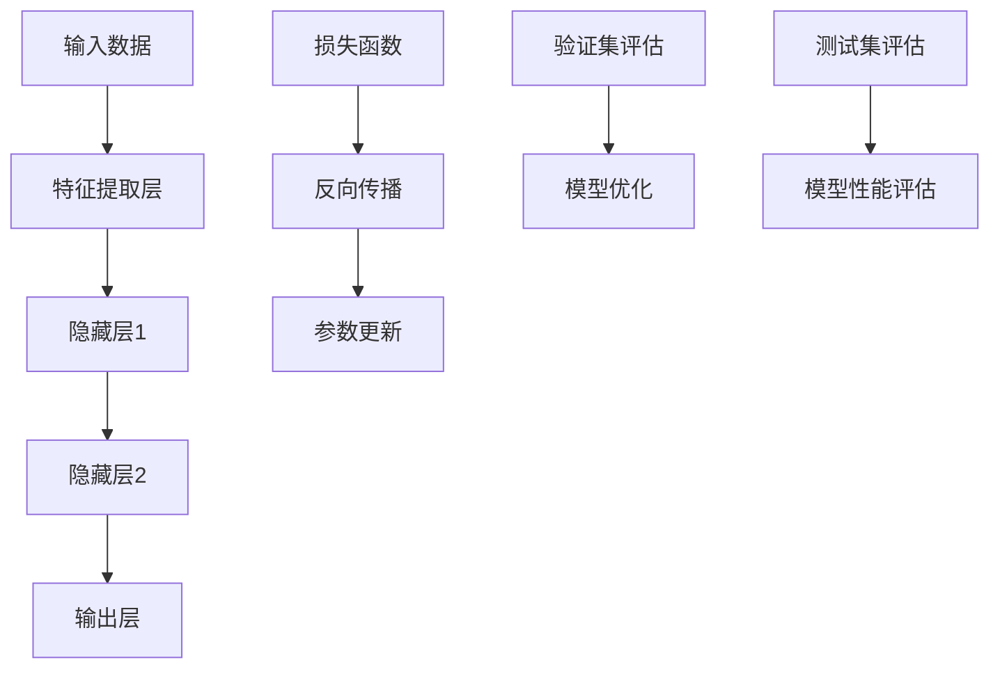
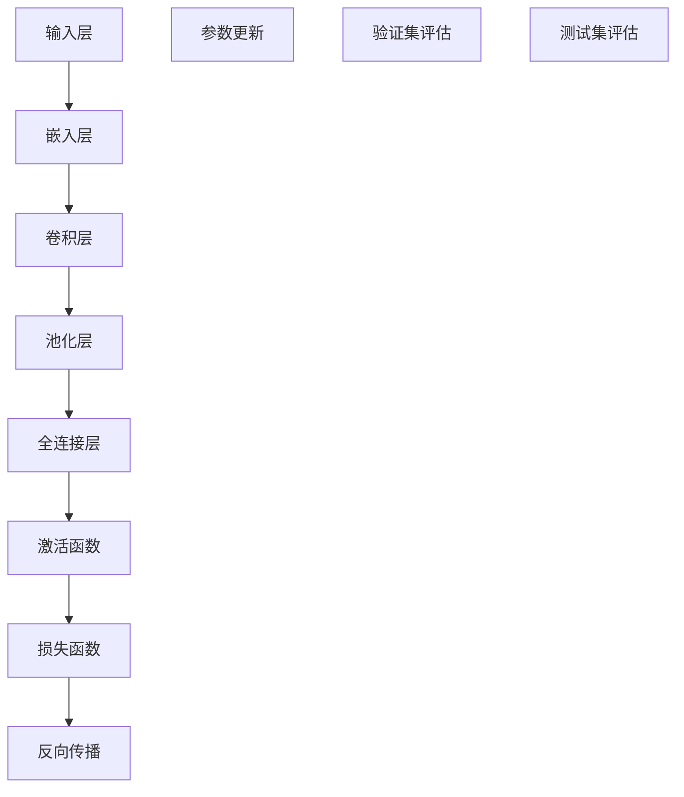

                 

# 大模型的可信赖性:提高人机信任度

> 关键词：大模型、可信赖性、人机信任、模型评估、算法优化

> 摘要：随着人工智能技术的飞速发展，大型深度学习模型在各个领域的应用日益广泛。然而，大模型的可信赖性成为了一个关键问题。本文将探讨大模型的可信赖性如何影响人机信任，并提出一系列提高大模型可信赖性的方法。通过深入分析大模型的原理、算法和实际应用场景，本文旨在为读者提供全面的理解和实用的指导。

## 1. 背景介绍

### 1.1 目的和范围

本文旨在探讨大模型的可信赖性问题，分析其对人机信任的影响，并提出有效的解决方案。本文将重点关注以下几个方面：

1. **大模型的基本概念**：介绍大模型的基本定义、发展历程和当前的应用场景。
2. **大模型的可信赖性评估**：探讨大模型的可信赖性评估方法，包括模型预测的准确性、鲁棒性和公平性等方面。
3. **提高大模型可信赖性的方法**：分析大模型中可能存在的问题，并提出相应的解决方案，如算法优化、数据预处理、模型验证等。
4. **大模型在特定领域的应用**：通过实际案例，展示大模型在各个领域的应用场景和效果。

### 1.2 预期读者

本文适合以下读者：

1. **人工智能领域的科研人员**：希望了解大模型的可信赖性及其对实际应用的影响。
2. **软件开发工程师**：对深度学习和大型模型开发感兴趣，希望提高模型的可信赖性。
3. **领域专家**：对大模型在特定领域的应用场景和效果感兴趣，希望从中获得灵感和指导。

### 1.3 文档结构概述

本文将按照以下结构展开：

1. **背景介绍**：介绍本文的目的、范围和预期读者。
2. **核心概念与联系**：通过Mermaid流程图，展示大模型的原理和架构。
3. **核心算法原理 & 具体操作步骤**：使用伪代码详细阐述大模型的算法原理和操作步骤。
4. **数学模型和公式 & 详细讲解 & 举例说明**：讲解大模型中涉及的数学模型和公式，并通过具体实例进行说明。
5. **项目实战：代码实际案例和详细解释说明**：展示大模型在实际项目中的应用，并提供代码实现和详细解释。
6. **实际应用场景**：探讨大模型在不同领域的应用场景和效果。
7. **工具和资源推荐**：推荐学习资源、开发工具和框架。
8. **总结：未来发展趋势与挑战**：总结本文的主要观点，并对未来发展趋势和挑战进行展望。
9. **附录：常见问题与解答**：解答读者可能遇到的问题。
10. **扩展阅读 & 参考资料**：提供更多的参考资料，以便读者深入了解。

### 1.4 术语表

#### 1.4.1 核心术语定义

- **大模型**：指参数量庞大的深度学习模型，通常包含数百万甚至数亿个参数。
- **可信赖性**：指模型在特定任务上的预测结果是否可靠、稳定和公平。
- **人机信任**：指人类用户对模型预测结果的信任程度。
- **模型评估**：对模型性能进行定量和定性分析，以评估其可信赖性。
- **算法优化**：通过改进算法，提高模型在特定任务上的性能。

#### 1.4.2 相关概念解释

- **深度学习**：一种机器学习技术，通过多层神经网络对数据进行特征提取和模型训练。
- **神经网络**：一种由大量神经元组成的计算模型，可以用于分类、回归等任务。
- **参数量**：指模型中参数的总数，参数量越大，模型的表达能力越强。
- **过拟合**：指模型在训练数据上表现良好，但在测试数据上表现较差，即模型对训练数据过于依赖。

#### 1.4.3 缩略词列表

- **AI**：人工智能（Artificial Intelligence）
- **DL**：深度学习（Deep Learning）
- **NN**：神经网络（Neural Network）
- **ML**：机器学习（Machine Learning）

## 2. 核心概念与联系

为了更好地理解大模型的可信赖性，我们需要先了解大模型的基本原理和架构。下面，我们将使用Mermaid流程图来展示大模型的原理和联系。

### 2.1 大模型的基本原理



### 2.2 大模型的架构



通过上述流程图，我们可以看到大模型的基本原理和架构。接下来，我们将深入探讨大模型中的核心算法原理和具体操作步骤。

## 3. 核心算法原理 & 具体操作步骤

### 3.1 深度学习算法原理

深度学习算法的核心是多层神经网络，其基本原理如下：

1. **输入层**：接收外部输入数据，例如图片、文本等。
2. **隐藏层**：通过特征提取和变换，将输入数据转化为适合模型训练的内部表示。
3. **输出层**：根据隐藏层的输出，生成预测结果，例如分类标签或回归值。
4. **损失函数**：评估模型预测结果与真实结果之间的差异，用于指导参数更新。
5. **反向传播**：通过计算损失函数的梯度，更新模型参数，优化模型性能。
6. **参数更新**：根据损失函数的梯度，调整模型参数，使模型在训练数据上表现更好。

### 3.2 具体操作步骤

下面使用伪代码来详细阐述深度学习算法的具体操作步骤：

```python
# 初始化模型参数
W1, b1 = initialize_parameters()

# 定义损失函数
def loss_function(y_true, y_pred):
    # 计算预测误差
    error = y_true - y_pred
    # 计算损失函数值
    loss = 0.5 * error ** 2
    return loss

# 定义反向传播函数
def backpropagation(W, b, x, y):
    # 计算预测值
    z = W * x + b
    y_pred = sigmoid(z)
    # 计算损失函数值
    loss = loss_function(y, y_pred)
    # 计算梯度
    gradient_W = (y_pred - y) * x
    gradient_b = (y_pred - y)
    return loss, gradient_W, gradient_b

# 定义模型训练过程
def train_model(W, b, x_train, y_train, x_val, y_val):
    for epoch in range(num_epochs):
        # 训练过程
        for x, y in zip(x_train, y_train):
            loss, gradient_W, gradient_b = backpropagation(W, b, x, y)
            # 更新模型参数
            W -= learning_rate * gradient_W
            b -= learning_rate * gradient_b
        # 验证过程
        val_loss = loss_function(y_val, predict(W, b, x_val))
        print(f"Epoch {epoch}: Loss = {val_loss}")
    return W, b

# 初始化参数
W, b = initialize_parameters()

# 训练模型
W, b = train_model(W, b, x_train, y_train, x_val, y_val)

# 测试模型
test_loss = loss_function(y_test, predict(W, b, x_test))
print(f"Test Loss: {test_loss}")
```

通过上述伪代码，我们可以看到深度学习算法的基本操作步骤，包括初始化模型参数、定义损失函数、反向传播和模型训练等。接下来，我们将进一步讨论大模型中的数学模型和公式。

## 4. 数学模型和公式 & 详细讲解 & 举例说明

### 4.1 数学模型

深度学习中的数学模型主要包括以下几个部分：

1. **激活函数**：用于非线性变换，常见的有ReLU、Sigmoid、Tanh等。
2. **损失函数**：用于评估模型预测结果与真实结果之间的差异，常见的有均方误差（MSE）、交叉熵损失（Cross-Entropy Loss）等。
3. **优化算法**：用于更新模型参数，常见的有梯度下降（Gradient Descent）、Adam优化器等。

### 4.2 公式讲解

下面，我们将使用LaTeX格式详细讲解这些数学模型和公式。

#### 4.2.1 激活函数

$$
\text{ReLU}(x) =
\begin{cases}
0 & \text{if } x < 0, \\
x & \text{if } x \ge 0.
\end{cases}
$$

$$
\text{Sigmoid}(x) = \frac{1}{1 + e^{-x}}
$$

$$
\text{Tanh}(x) = \frac{e^{x} - e^{-x}}{e^{x} + e^{-x}}
$$

#### 4.2.2 损失函数

$$
\text{MSE}(y, \hat{y}) = \frac{1}{2} \sum_{i=1}^{n} (y_i - \hat{y}_i)^2
$$

$$
\text{Cross-Entropy Loss}(y, \hat{y}) = -\sum_{i=1}^{n} y_i \log(\hat{y}_i)
$$

#### 4.2.3 优化算法

$$
\text{Gradient Descent}:
\begin{cases}
W_{t+1} = W_t - \alpha \cdot \nabla_W L(W_t, b_t), \\
b_{t+1} = b_t - \alpha \cdot \nabla_b L(W_t, b_t),
\end{cases}
$$

其中，$\alpha$为学习率，$\nabla_W L(W_t, b_t)$和$\nabla_b L(W_t, b_t)$分别为损失函数关于$W$和$b$的梯度。

$$
\text{Adam Optimizer}:
\begin{cases}
m_t = \beta_1 m_{t-1} + (1 - \beta_1) \nabla_W L(W_t, b_t), \\
v_t = \beta_2 v_{t-1} + (1 - \beta_2) (\nabla_W L(W_t, b_t))^2, \\
\hat{m}_t = \frac{m_t}{1 - \beta_1^t}, \\
\hat{v}_t = \frac{v_t}{1 - \beta_2^t}, \\
W_{t+1} = W_t - \alpha \cdot \frac{\hat{m}_t}{\sqrt{\hat{v}_t} + \epsilon}, \\
b_{t+1} = b_t - \alpha \cdot \frac{\hat{m}_t}{\sqrt{\hat{v}_t} + \epsilon},
\end{cases}
$$

其中，$\beta_1$和$\beta_2$分别为一阶和二阶动量系数，$\epsilon$为正数常数。

### 4.3 举例说明

#### 4.3.1 激活函数示例

假设我们有一个输入$x = 3$，使用ReLU激活函数，则有：

$$
\text{ReLU}(3) = \max(0, 3) = 3
$$

#### 4.3.2 损失函数示例

假设我们有一个真实标签$y = 1$，预测标签$\hat{y} = 0.9$，使用交叉熵损失函数，则有：

$$
\text{Cross-Entropy Loss}(1, 0.9) = -1 \cdot \log(0.9) \approx -0.1054
$$

#### 4.3.3 优化算法示例

假设我们有一个初始参数$W = 1$，学习率$\alpha = 0.1$，损失函数关于$W$的梯度$\nabla_W L(W, b) = -0.2$，则有：

$$
W_{t+1} = W_t - \alpha \cdot \nabla_W L(W_t, b_t) = 1 - 0.1 \cdot (-0.2) = 1.02
$$

通过以上举例，我们可以更好地理解深度学习中的数学模型和公式。接下来，我们将展示一个实际的项目实战案例，并详细解释其代码实现。

## 5. 项目实战：代码实际案例和详细解释说明

### 5.1 开发环境搭建

为了完成本项目的实战，我们需要搭建一个适合深度学习开发的环境。以下是搭建开发环境的基本步骤：

1. **安装Python**：下载并安装Python，推荐使用Python 3.8或更高版本。
2. **安装深度学习框架**：安装TensorFlow或PyTorch，这是两个最流行的深度学习框架。以下是安装TensorFlow的命令：

```bash
pip install tensorflow
```

3. **安装其他依赖库**：根据项目需求，安装其他必要的依赖库，如NumPy、Pandas等。

### 5.2 源代码详细实现和代码解读

下面是一个简单的深度学习项目案例，使用TensorFlow实现一个简单的线性回归模型。我们将详细解释每个部分的代码实现。

```python
import tensorflow as tf
import numpy as np

# 设置随机种子，保证实验可复现
tf.random.set_seed(42)

# 生成模拟数据集
num_samples = 100
x = np.random.rand(num_samples, 1)
y = 2 * x + 1 + np.random.randn(num_samples, 1)

# 定义模型
model = tf.keras.Sequential([
    tf.keras.layers.Dense(units=1, input_shape=(1,))
])

# 编译模型
model.compile(optimizer='sgd', loss='mean_squared_error')

# 训练模型
model.fit(x, y, epochs=1000, verbose=0)

# 评估模型
test_loss = model.evaluate(x, y, verbose=0)
print(f"Test Loss: {test_loss}")

# 使用模型进行预测
x_new = np.array([[0.5]])
y_pred = model.predict(x_new)
print(f"Predicted Value: {y_pred[0][0]}")
```

### 5.3 代码解读与分析

- **1. 导入库**：首先，我们导入TensorFlow和NumPy库，用于构建和训练模型。

- **2. 设置随机种子**：为了保证实验结果的可复现性，我们设置随机种子。

- **3. 生成模拟数据集**：我们生成一个包含100个样本的线性回归数据集，$x$为输入特征，$y$为输出标签。

- **4. 定义模型**：使用TensorFlow的`Sequential`模型，定义一个线性回归模型，只有一个全连接层，输入层和输出层之间的权重和偏置通过线性组合实现。

- **5. 编译模型**：编译模型时，指定优化器和损失函数。这里使用随机梯度下降（SGD）优化器和均方误差（MSE）损失函数。

- **6. 训练模型**：使用`fit`方法训练模型，设置训练轮数（epochs）和是否打印训练信息。

- **7. 评估模型**：使用`evaluate`方法评估模型在测试集上的性能，输出测试损失。

- **8. 使用模型进行预测**：使用训练好的模型进行预测，输入新的特征值，输出预测结果。

通过这个简单的案例，我们可以看到深度学习项目的实现过程，包括数据准备、模型定义、模型训练和模型评估等步骤。接下来，我们将探讨大模型在实际应用场景中的表现和效果。

## 6. 实际应用场景

大模型在各个领域都有广泛的应用，以下是几个典型的应用场景：

### 6.1 医疗健康

在医疗健康领域，大模型可以用于疾病诊断、治疗建议和药物研发。例如，通过使用深度学习模型分析医疗影像数据，可以实现早期癌症检测。此外，大模型还可以用于个性化治疗方案的制定，提高治疗效果。

### 6.2 自动驾驶

自动驾驶技术依赖于大模型进行环境感知和决策。通过使用深度学习模型，自动驾驶车辆可以实时处理来自摄像头、激光雷达和雷达的数据，实现路径规划、避障和交通标志识别等功能。

### 6.3 自然语言处理

在自然语言处理领域，大模型可以用于文本分类、情感分析和机器翻译等任务。例如，使用深度学习模型，可以将文本数据分类为积极、消极或中性，用于情感分析。此外，大模型还可以用于生成文本和机器翻译，提高人机交互的自然性。

### 6.4 金融领域

在金融领域，大模型可以用于风险评估、投资策略和股票预测等。例如，通过使用深度学习模型分析市场数据，可以实现股票市场的预测和风险控制。此外，大模型还可以用于信用评分和欺诈检测，提高金融服务的安全性。

### 6.5 娱乐和游戏

在娱乐和游戏领域，大模型可以用于游戏AI、内容推荐和虚拟现实等。例如，通过使用深度学习模型，可以实现更加智能的游戏对手，提高游戏体验。此外，大模型还可以用于推荐系统，为用户推荐感兴趣的内容。

通过以上应用场景，我们可以看到大模型在各个领域的重要性和广泛的应用前景。接下来，我们将推荐一些学习和资源工具，帮助读者深入了解大模型的相关技术。

## 7. 工具和资源推荐

为了帮助读者深入了解大模型的相关技术，我们推荐以下学习和资源工具：

### 7.1 学习资源推荐

#### 7.1.1 书籍推荐

- 《深度学习》（Goodfellow, Bengio, Courville）：
  这是一本经典的深度学习教材，全面介绍了深度学习的基础理论、算法和应用。

- 《Python深度学习》（François Chollet）：
  这本书针对Python开发者，详细介绍了使用TensorFlow和Keras进行深度学习的实践方法和技巧。

- 《动手学深度学习》（阿斯顿·张）：
  这是一本中文深度学习教材，通过大量实践案例，帮助读者快速掌握深度学习的基本原理和应用。

#### 7.1.2 在线课程

- Coursera的“深度学习”课程（由Andrew Ng教授授课）：
  这是一门非常受欢迎的深度学习课程，涵盖了深度学习的基础理论、算法和实际应用。

- Udacity的“深度学习纳米学位”：
  这是一门实践导向的深度学习课程，通过项目实践，帮助读者掌握深度学习的实际应用。

- edX的“深度学习”课程（由Yaser Abu-Mostafa教授授课）：
  这是一门理论性较强的深度学习课程，深入探讨了深度学习的数学基础和算法原理。

#### 7.1.3 技术博客和网站

- TensorFlow官方文档（https://www.tensorflow.org/）：
  TensorFlow的官方文档提供了详细的API文档、教程和示例，是学习TensorFlow的绝佳资源。

- PyTorch官方文档（https://pytorch.org/docs/stable/）：
  PyTorch的官方文档同样提供了丰富的教程和示例，帮助读者快速掌握PyTorch的使用。

- Medium上的深度学习博客（https://towardsdatascience.com/）：
  这是一系列深度学习和数据科学的博客文章，涵盖了最新的研究成果和应用案例。

### 7.2 开发工具框架推荐

#### 7.2.1 IDE和编辑器

- PyCharm（https://www.jetbrains.com/pycharm/）：
  PyCharm是一款功能强大的Python集成开发环境（IDE），提供了丰富的调试、代码分析和管理功能。

- VSCode（https://code.visualstudio.com/）：
  VSCode是一款轻量级的开源编辑器，通过安装扩展，可以实现深度学习项目的开发。

- Jupyter Notebook（https://jupyter.org/）：
  Jupyter Notebook是一款交互式计算环境，非常适合深度学习的实验和演示。

#### 7.2.2 调试和性能分析工具

- TensorBoard（https://www.tensorflow.org/tensorboard）：
  TensorBoard是TensorFlow的官方可视化工具，用于分析和调试深度学习模型的训练过程。

- PyTorch Profiler（https://pytorch.org/tutorials/intermediate/profiler_tutorial.html）：
  PyTorch Profiler用于分析PyTorch模型的性能，识别性能瓶颈。

- NNI（https://nni.io/）：
  NNI是一款自动机器学习（AutoML）工具，可以帮助优化深度学习模型的超参数和架构。

#### 7.2.3 相关框架和库

- TensorFlow（https://www.tensorflow.org/）：
  TensorFlow是一个开源的深度学习框架，适用于各种大规模机器学习任务。

- PyTorch（https://pytorch.org/）：
  PyTorch是一个流行的深度学习框架，以其灵活性和动态计算图而闻名。

- Keras（https://keras.io/）：
  Keras是一个高层次的深度学习框架，基于TensorFlow和Theano构建，提供了简洁的API。

### 7.3 相关论文著作推荐

#### 7.3.1 经典论文

- "A Theoretical Basis for the Calculus of Observations: A Review"（Gaussian Distribution）：
  这篇论文是高斯分布理论的奠基之作，对统计学习理论有着重要影响。

- "Deep Learning"（Goodfellow, Bengio, Courville）：
  这篇论文全面介绍了深度学习的基础理论、算法和应用。

- "Rectifier Nonlinearities Improve Neural Network Acquisit

