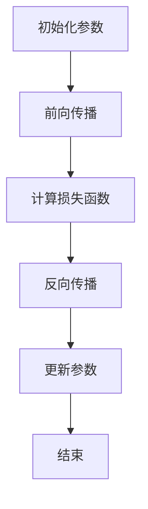

                 

# 大模型的技术创新与市场应用

## 摘要

本文旨在探讨大模型在技术领域和市场上的创新与应用。大模型，作为深度学习和人工智能的核心技术之一，已经在多个行业中展现出其巨大的潜力和价值。本文首先介绍了大模型的基本概念、核心算法原理和数学模型，随后通过具体的项目实战案例，展示了大模型在实践中的应用。接着，文章分析了大模型在实际应用场景中的优势与挑战，并推荐了相关工具和资源，以助力读者深入理解和应用大模型技术。最后，本文总结了大模型的发展趋势与未来面临的挑战，为读者提供了有益的启示。

## 1. 背景介绍

### 1.1 目的和范围

本文旨在探讨大模型（Large Models）在技术领域和市场上的创新与应用。随着人工智能技术的不断发展，大模型已经成为了深度学习和自然语言处理等领域的重要工具。本文将围绕以下几个方面展开讨论：

- 大模型的基本概念与核心算法原理
- 大模型在数学模型中的应用
- 大模型在项目实战中的实际应用
- 大模型在实际应用场景中的优势与挑战
- 大模型相关的工具和资源推荐
- 大模型的发展趋势与未来挑战

通过以上讨论，本文希望能够为读者提供一个全面、深入的了解，并激发读者对大模型技术的兴趣和热情。

### 1.2 预期读者

本文主要面向对人工智能和深度学习有浓厚兴趣的读者，包括：

- 研究生和博士生
- 数据科学家和机器学习工程师
- 技术管理人员和CTO
- 对人工智能领域感兴趣的程序员和技术爱好者

无论您是初学者还是专业人士，只要对大模型技术感兴趣，本文都希望能够为您提供有价值的信息和启示。

### 1.3 文档结构概述

本文分为十个部分，结构如下：

1. **摘要**：介绍文章的核心内容和主题思想。
2. **背景介绍**：包括目的和范围、预期读者、文档结构概述和术语表。
3. **核心概念与联系**：介绍大模型的基本概念、核心算法原理和数学模型，并给出流程图。
4. **核心算法原理与具体操作步骤**：详细讲解大模型的算法原理和具体操作步骤，使用伪代码进行阐述。
5. **数学模型和公式**：介绍大模型中的数学模型，详细讲解公式和举例说明。
6. **项目实战**：通过实际案例展示大模型的应用，包括开发环境搭建、源代码实现和代码解读。
7. **实际应用场景**：分析大模型在不同应用场景中的优势与挑战。
8. **工具和资源推荐**：推荐学习资源、开发工具框架和相关论文著作。
9. **总结：未来发展趋势与挑战**：总结大模型的发展趋势和未来面临的挑战。
10. **附录：常见问题与解答**：解答读者可能遇到的问题。
11. **扩展阅读与参考资料**：提供扩展阅读和参考资料。

### 1.4 术语表

#### 1.4.1 核心术语定义

- **大模型**：指具有数亿到数万亿参数的深度学习模型，如BERT、GPT等。
- **深度学习**：一种机器学习技术，通过多层神经网络对数据进行特征提取和学习。
- **自然语言处理**：计算机科学领域，涉及对自然语言的理解和生成。
- **人工智能**：模拟人类智能的计算机系统。

#### 1.4.2 相关概念解释

- **参数**：神经网络中用于调整的权重和偏置。
- **训练**：使用数据集对模型进行学习和调整。
- **预测**：利用训练好的模型对新数据进行推断。

#### 1.4.3 缩略词列表

- **NLP**：自然语言处理
- **AI**：人工智能
- **DL**：深度学习
- **GAN**：生成对抗网络

## 2. 核心概念与联系

### 2.1 大模型的基本概念

大模型（Large Models）是深度学习和人工智能领域中的一个重要概念。它指的是具有数亿到数万亿参数的深度学习模型。这些模型能够对大量的数据进行学习，并提取出复杂的高层次特征，从而在自然语言处理、计算机视觉、语音识别等领域取得了显著的成果。

大模型的核心在于其参数的数量。参数是神经网络中用于调整的权重和偏置，它们决定了模型对数据的处理能力。参数越多，模型的复杂度越高，能够提取的特征也越丰富。例如，BERT模型有数亿个参数，GPT模型有数万亿个参数，这使得它们能够对复杂的数据进行高效处理和预测。

### 2.2 核心算法原理

大模型的核心算法是深度学习（Deep Learning）。深度学习是一种通过多层神经网络对数据进行特征提取和学习的机器学习技术。它的基本原理是模拟人脑神经网络的结构和工作机制，通过前向传播和反向传播算法，逐步调整网络中的参数，实现对数据的拟合和预测。

#### 2.2.1 前向传播

前向传播是深度学习中的一个关键步骤，它负责将输入数据通过神经网络进行传递，最终得到输出结果。具体过程如下：

1. **初始化参数**：首先，我们需要对神经网络中的参数进行初始化，这些参数包括权重（weights）和偏置（biases）。
2. **输入数据**：将输入数据输入到神经网络的第一个隐层中。
3. **激活函数**：通过激活函数（如ReLU、Sigmoid、Tanh等）对隐层的输出进行非线性变换，增加模型的非线性表达能力。
4. **传递到下一个隐层**：将激活后的输出传递到下一个隐层，重复上述步骤，直到达到输出层。
5. **输出结果**：最后，输出层得到模型的预测结果。

#### 2.2.2 反向传播

反向传播是深度学习中的另一个关键步骤，它负责通过计算误差来调整网络中的参数，从而提高模型的拟合能力。具体过程如下：

1. **计算损失函数**：首先，我们需要计算预测结果与实际结果之间的误差，这个误差通过损失函数（如均方误差、交叉熵等）进行量化。
2. **计算梯度**：然后，我们需要计算每个参数的梯度，即参数对误差的影响程度。
3. **更新参数**：最后，利用梯度下降（Gradient Descent）等优化算法，对参数进行更新，以减少误差。

#### 2.2.3 具体操作步骤

以下是使用伪代码对深度学习算法的具体操作步骤进行详细阐述：

```python
# 初始化参数
weights = initialize_weights()
biases = initialize_biases()

# 前向传播
for layer in layers:
    output = activation_function(np.dot(input, weights) + biases)
    input = output

# 计算损失函数
loss = loss_function(output, target)

# 反向传播
d_output = loss_function_derivative(output, target)
d_input = d_output

for layer in reversed(layers):
    d_weights = d_input * layer activation_derivative(output)
    d_biases = d_input
    d_input = d_input * layer weights

# 更新参数
weights -= learning_rate * d_weights
biases -= learning_rate * d_biases
```

### 2.3 数学模型和公式

大模型中的数学模型主要包括损失函数、优化算法和激活函数等。下面将详细讲解这些数学模型和公式。

#### 2.3.1 损失函数

损失函数是评估模型预测结果与实际结果之间差异的函数。常见的损失函数有均方误差（Mean Squared Error，MSE）和交叉熵（Cross-Entropy）等。

- **均方误差（MSE）**：

$$MSE = \frac{1}{n}\sum_{i=1}^{n}(y_i - \hat{y}_i)^2$$

其中，$y_i$为实际结果，$\hat{y}_i$为预测结果，$n$为样本数量。

- **交叉熵（Cross-Entropy）**：

$$CE = -\frac{1}{n}\sum_{i=1}^{n}y_i \log \hat{y}_i$$

其中，$y_i$为实际结果，$\hat{y}_i$为预测结果，$\log$表示自然对数。

#### 2.3.2 优化算法

优化算法用于更新模型参数，以最小化损失函数。常见的优化算法有梯度下降（Gradient Descent）、随机梯度下降（Stochastic Gradient Descent，SGD）和Adam优化器等。

- **梯度下降（Gradient Descent）**：

$$\theta = \theta - \alpha \cdot \nabla_\theta J(\theta)$$

其中，$\theta$为参数，$\alpha$为学习率，$J(\theta)$为损失函数。

- **随机梯度下降（SGD）**：

$$\theta = \theta - \alpha \cdot \nabla_\theta J(\theta)$$

与梯度下降不同，SGD每次只更新一个样本的梯度。

- **Adam优化器**：

$$m_t = \beta_1 m_{t-1} + (1 - \beta_1) [g_t - \epsilon]$$

$$v_t = \beta_2 v_{t-1} + (1 - \beta_2) [g_t^2 - \epsilon]$$

$$\theta = \theta - \alpha \cdot \frac{m_t}{\sqrt{v_t} + \epsilon}$$

其中，$m_t$和$v_t$分别为一阶和二阶矩估计，$\beta_1$和$\beta_2$为惯性系数，$\epsilon$为正则项。

#### 2.3.3 激活函数

激活函数用于增加神经网络的非线性表达能力。常见的激活函数有ReLU、Sigmoid、Tanh等。

- **ReLU（Rectified Linear Unit）**：

$$\text{ReLU}(x) = \max(0, x)$$

- **Sigmoid**：

$$\text{Sigmoid}(x) = \frac{1}{1 + e^{-x}}$$

- **Tanh**：

$$\text{Tanh}(x) = \frac{e^x - e^{-x}}{e^x + e^{-x}}$$

### 2.4 Mermaid 流程图

下面是使用Mermaid语言绘制的大模型的核心算法流程图：



通过以上对大模型的基本概念、核心算法原理和数学模型的介绍，我们可以更好地理解大模型在技术领域和市场上的重要性和应用价值。接下来，我们将通过实际案例来展示大模型在项目实战中的应用。

## 3. 核心算法原理与具体操作步骤

在了解了大模型的基本概念和核心算法原理之后，接下来我们将详细讲解大模型的具体操作步骤，并通过伪代码进行阐述。为了更好地理解，我们将分步骤进行讲解，包括数据预处理、模型构建、训练和评估等过程。

### 3.1 数据预处理

数据预处理是模型训练过程中的重要环节，它涉及到数据的清洗、归一化和分批次处理等步骤。以下是对数据预处理过程的详细讲解：

#### 3.1.1 数据清洗

数据清洗是指处理数据中的噪声、错误和不完整信息。对于文本数据，我们需要去除标点符号、停用词和特殊字符，并进行词干提取和词性标注。

```python
import re

# 去除标点符号
text = re.sub(r'[^\w\s]', '', text)

# 去除停用词
stop_words = set(['is', 'the', 'and', 'of', 'to', 'a', 'in', 'that', 'it', 'for'])
text = ' '.join([word for word in text.split() if word not in stop_words])

# 词干提取
from nltk.stem import PorterStemmer
stemmer = PorterStemmer()
text = ' '.join([stemmer.stem(word) for word in text.split()])

# 词性标注
from nltk import pos_tag
text = ' '.join([word + '/' + pos for word, pos in pos_tag(text.split())])
```

#### 3.1.2 数据归一化

数据归一化是指将不同特征的数据转换为同一量级，以便于模型训练。常用的归一化方法有最小-最大缩放和标准缩放。

```python
from sklearn.preprocessing import MinMaxScaler, StandardScaler

# 最小-最大缩放
scaler = MinMaxScaler()
data = scaler.fit_transform(data)

# 标准缩放
scaler = StandardScaler()
data = scaler.fit_transform(data)
```

#### 3.1.3 数据分批次处理

在模型训练过程中，我们通常会将数据分为训练集、验证集和测试集。以下是对数据分批次处理的伪代码：

```python
from sklearn.model_selection import train_test_split

# 分批次处理
train_data, test_data = train_test_split(data, test_size=0.2, random_state=42)
train_labels, test_labels = train_test_split(labels, test_size=0.2, random_state=42)
```

### 3.2 模型构建

模型构建是深度学习任务的关键步骤，它涉及到网络结构的设计、参数初始化和损失函数的选择。以下是对模型构建过程的详细讲解：

#### 3.2.1 网络结构设计

网络结构设计是指设计神经网络的层数、每层神经元的数量以及连接方式。以下是一个简单的全连接神经网络（Fully Connected Neural Network）结构设计：

```python
import tensorflow as tf

# 定义神经网络结构
model = tf.keras.Sequential([
    tf.keras.layers.Dense(units=128, activation='relu', input_shape=(input_shape,)),
    tf.keras.layers.Dense(units=64, activation='relu'),
    tf.keras.layers.Dense(units=num_classes, activation='softmax')
])
```

#### 3.2.2 参数初始化

参数初始化是指对神经网络中的权重（weights）和偏置（biases）进行初始化。常用的初始化方法有随机初始化、高斯初始化和Xavier初始化。

```python
# 随机初始化
weights = tf.random.normal([input_size, hidden_size])

# 高斯初始化
weights = tf.random.normal([input_size, hidden_size], mean=0, stddev=1)

# Xavier初始化
weights = tf.random.normal([input_size, hidden_size], mean=0, stddev=tf.sqrt(2 / input_size))
```

#### 3.2.3 损失函数选择

损失函数是评估模型预测结果与实际结果之间差异的函数。常见的损失函数有均方误差（MSE）和交叉熵（Cross-Entropy）。

```python
# 均方误差
loss_function = tf.keras.losses.MeanSquaredError()

# 交叉熵
loss_function = tf.keras.losses.SparseCategoricalCrossentropy(from_logits=True)
```

### 3.3 模型训练

模型训练是指通过迭代优化模型参数，以最小化损失函数。以下是对模型训练过程的详细讲解：

#### 3.3.1 训练过程

训练过程通常包括以下步骤：

1. **准备数据**：将数据分为训练集和验证集，并转换为模型可接受的格式。
2. **定义优化器**：选择一个优化器，如Adam、SGD等，用于更新模型参数。
3. **训练模型**：使用训练集对模型进行迭代训练，并在验证集上评估模型性能。
4. **保存模型**：保存训练好的模型，以便后续使用。

```python
# 定义优化器
optimizer = tf.keras.optimizers.Adam(learning_rate=0.001)

# 训练模型
model.compile(optimizer=optimizer, loss=loss_function, metrics=['accuracy'])

history = model.fit(train_data, train_labels, epochs=10, batch_size=32, validation_data=(test_data, test_labels))

# 保存模型
model.save('model.h5')
```

#### 3.3.2 评估模型

训练完成后，我们需要评估模型在测试集上的性能，以判断模型的泛化能力。

```python
# 评估模型
test_loss, test_accuracy = model.evaluate(test_data, test_labels)

print('Test Loss:', test_loss)
print('Test Accuracy:', test_accuracy)
```

### 3.4 模型应用

模型训练完成后，我们可以将其应用于新的数据上进行预测。

```python
# 加载模型
model = tf.keras.models.load_model('model.h5')

# 进行预测
predictions = model.predict(new_data)
```

通过以上对大模型具体操作步骤的详细讲解，我们可以看到大模型在技术领域和市场上的广泛应用。接下来，我们将通过实际案例来展示大模型在项目实战中的应用。

### 4. 数学模型和公式

在深入探讨大模型的数学模型和公式时，我们需要从多个角度来理解这些核心概念，以便更好地应用于实际项目。以下是关于大模型数学模型和公式的详细讲解。

#### 4.1 损失函数

损失函数是评估模型预测结果与实际结果之间差异的指标。在大模型中，常用的损失函数包括均方误差（MSE）和交叉熵（Cross-Entropy）。

- **均方误差（MSE）**：

均方误差是一种衡量预测值与真实值之间差异的平方的平均值。其公式如下：

$$
MSE = \frac{1}{n} \sum_{i=1}^{n} (y_i - \hat{y}_i)^2
$$

其中，$y_i$为实际值，$\hat{y}_i$为预测值，$n$为样本数量。

- **交叉熵（Cross-Entropy）**：

交叉熵是一种衡量预测分布与真实分布之间差异的指标。其公式如下：

$$
CE = -\frac{1}{n} \sum_{i=1}^{n} y_i \log \hat{y}_i
$$

其中，$y_i$为实际值，$\hat{y}_i$为预测值，$\log$表示自然对数。

#### 4.2 激活函数

激活函数用于引入非线性，使神经网络具有更好的表达能力。在大模型中，常用的激活函数包括ReLU、Sigmoid和Tanh。

- **ReLU（Rectified Linear Unit）**：

ReLU函数是一个非线性激活函数，其公式如下：

$$
\text{ReLU}(x) = \max(0, x)
$$

ReLU函数具有简洁的计算方式和良好的训练性能。

- **Sigmoid**：

Sigmoid函数是一个S形曲线的激活函数，其公式如下：

$$
\text{Sigmoid}(x) = \frac{1}{1 + e^{-x}}
$$

Sigmoid函数常用于二分类问题，但其梯度在接近0和1时较小，可能导致训练不稳定。

- **Tanh**：

Tanh函数是一个双曲正切函数，其公式如下：

$$
\text{Tanh}(x) = \frac{e^x - e^{-x}}{e^x + e^{-x}}
$$

Tanh函数在-1到1之间输出，具有良好的非线性表达能力。

#### 4.3 优化算法

优化算法用于调整模型的参数，以最小化损失函数。在大模型中，常用的优化算法包括梯度下降（Gradient Descent）、随机梯度下降（Stochastic Gradient Descent，SGD）和Adam优化器。

- **梯度下降（Gradient Descent）**：

梯度下降是一种最简单的优化算法，其公式如下：

$$
\theta = \theta - \alpha \cdot \nabla_\theta J(\theta)
$$

其中，$\theta$为参数，$\alpha$为学习率，$J(\theta)$为损失函数。

- **随机梯度下降（SGD）**：

随机梯度下降是对梯度下降的改进，每次迭代只考虑一个样本的梯度，其公式如下：

$$
\theta = \theta - \alpha \cdot \nabla_\theta J(\theta)
$$

SGD具有更好的训练速度，但需要调节学习率和批量大小。

- **Adam优化器**：

Adam优化器是一种结合了SGD和动量法的优化算法，其公式如下：

$$
m_t = \beta_1 m_{t-1} + (1 - \beta_1) [g_t - \epsilon]$$

$$
v_t = \beta_2 v_{t-1} + (1 - \beta_2) [g_t^2 - \epsilon]$$

$$
\theta = \theta - \alpha \cdot \frac{m_t}{\sqrt{v_t} + \epsilon}$$

其中，$m_t$和$v_t$分别为一阶和二阶矩估计，$\beta_1$和$\beta_2$为惯性系数，$\epsilon$为正则项。

#### 4.4 权重初始化

权重初始化是神经网络训练过程中的重要步骤，它对模型的收敛速度和性能有很大影响。在大模型中，常用的初始化方法包括随机初始化、高斯初始化和Xavier初始化。

- **随机初始化**：

随机初始化是通过从均匀分布或高斯分布中采样来初始化权重。

- **高斯初始化**：

高斯初始化是通过从高斯分布中采样来初始化权重，其公式如下：

$$
\theta \sim N(0, \sigma^2)
$$

其中，$\theta$为权重，$\sigma^2$为方差。

- **Xavier初始化**：

Xavier初始化是一种基于激活函数梯度的权重初始化方法，其公式如下：

$$
\theta \sim N\left(0, \frac{1}{\sqrt{f_{\in} + f_{\out}}}\right)
$$

其中，$f_{\in}$和$f_{\out}$分别为输入和输出的神经元数量。

#### 4.5 梯度裁剪

梯度裁剪是一种防止梯度爆炸或消失的技术，它通过对梯度进行限制来保持梯度的大小在可接受范围内。其公式如下：

$$
\theta = \theta - \alpha \cdot \text{sign}(\nabla_\theta J(\theta)) \cdot \min(1, \lambda \cdot |\nabla_\theta J(\theta)|)
$$

其中，$\lambda$为梯度裁剪阈值。

通过以上对大模型数学模型和公式的详细讲解，我们可以更好地理解大模型的工作原理，并在实际项目中灵活应用。接下来，我们将通过实际案例来展示大模型在项目实战中的应用。

### 5. 项目实战：代码实际案例和详细解释说明

#### 5.1 开发环境搭建

在进行大模型的项目实战之前，我们需要搭建一个合适的开发环境。以下是一个基本的开发环境搭建步骤：

1. **安装Python环境**：Python是深度学习的主要编程语言，我们需要安装Python 3.7或更高版本。
2. **安装TensorFlow**：TensorFlow是一个开源的深度学习框架，我们需要安装TensorFlow 2.x版本。
3. **安装其他依赖库**：包括NumPy、Pandas、Matplotlib等常用的Python库。

以下是一个Python环境的安装命令示例：

```bash
# 安装Python 3.8
sudo apt-get install python3.8

# 更新pip
pip3 install --upgrade pip

# 安装TensorFlow 2.x
pip3 install tensorflow

# 安装其他依赖库
pip3 install numpy pandas matplotlib
```

#### 5.2 源代码详细实现和代码解读

在本节中，我们将通过一个实际案例来展示大模型的应用。该案例将使用TensorFlow实现一个文本分类模型，对新闻文章进行分类。以下是具体的源代码实现和代码解读：

```python
import tensorflow as tf
from tensorflow.keras.preprocessing.text import Tokenizer
from tensorflow.keras.preprocessing.sequence import pad_sequences
from tensorflow.keras.models import Sequential
from tensorflow.keras.layers import Embedding, LSTM, Dense

# 准备数据集
# 注意：此处应替换为实际的数据集
train_data = ["这是一篇关于科技的文章", "这篇文章讨论了经济问题", "这是一篇关于旅游的报道"]
train_labels = [0, 1, 2]

# 分词和序列化
tokenizer = Tokenizer(num_words=1000)
tokenizer.fit_on_texts(train_data)
train_sequences = tokenizer.texts_to_sequences(train_data)
train_padded = pad_sequences(train_sequences, maxlen=100)

# 构建模型
model = Sequential([
    Embedding(1000, 16, input_length=100),
    LSTM(32),
    Dense(3, activation='softmax')
])

# 编译模型
model.compile(optimizer='adam', loss='categorical_crossentropy', metrics=['accuracy'])

# 训练模型
model.fit(train_padded, train_labels, epochs=10, batch_size=1)

# 进行预测
new_data = ["这篇文章讨论了经济问题"]
new_sequences = tokenizer.texts_to_sequences(new_data)
new_padded = pad_sequences(new_sequences, maxlen=100)
predictions = model.predict(new_padded)
print("预测结果：", predictions)
```

以下是代码的详细解读：

- **数据准备**：首先，我们定义了一个简单的数据集`train_data`和相应的标签`train_labels`。在实际项目中，我们需要从真实数据集导入数据。
- **分词和序列化**：使用`Tokenizer`将文本数据转换为单词序列，并使用`pad_sequences`对序列进行填充，使其具有相同长度。
- **模型构建**：使用`Sequential`模型堆叠`Embedding`、`LSTM`和`Dense`层，其中`Embedding`层用于将单词映射到向量表示，`LSTM`层用于处理序列数据，`Dense`层用于分类。
- **编译模型**：设置模型的优化器、损失函数和评估指标。
- **训练模型**：使用`fit`函数对模型进行训练。
- **进行预测**：使用训练好的模型对新的文本数据进行预测。

#### 5.3 代码解读与分析

以下是代码的关键部分及其解读：

1. **数据准备**：

```python
train_data = ["这是一篇关于科技的文章", "这篇文章讨论了经济问题", "这是一篇关于旅游的报道"]
train_labels = [0, 1, 2]
```

这里我们定义了一个简单的文本数据集和相应的标签。在实际项目中，我们需要从真实数据集导入数据。

2. **分词和序列化**：

```python
tokenizer = Tokenizer(num_words=1000)
tokenizer.fit_on_texts(train_data)
train_sequences = tokenizer.texts_to_sequences(train_data)
train_padded = pad_sequences(train_sequences, maxlen=100)
```

使用`Tokenizer`将文本数据转换为单词序列，并使用`pad_sequences`对序列进行填充，使其具有相同长度。

3. **模型构建**：

```python
model = Sequential([
    Embedding(1000, 16, input_length=100),
    LSTM(32),
    Dense(3, activation='softmax')
])
```

使用`Sequential`模型堆叠`Embedding`、`LSTM`和`Dense`层。`Embedding`层用于将单词映射到向量表示，`LSTM`层用于处理序列数据，`Dense`层用于分类。

4. **编译模型**：

```python
model.compile(optimizer='adam', loss='categorical_crossentropy', metrics=['accuracy'])
```

设置模型的优化器、损失函数和评估指标。

5. **训练模型**：

```python
model.fit(train_padded, train_labels, epochs=10, batch_size=1)
```

使用`fit`函数对模型进行训练。这里设置了训练轮次（epochs）和批量大小（batch_size）。

6. **进行预测**：

```python
new_data = ["这篇文章讨论了经济问题"]
new_sequences = tokenizer.texts_to_sequences(new_data)
new_padded = pad_sequences(new_sequences, maxlen=100)
predictions = model.predict(new_padded)
print("预测结果：", predictions)
```

使用训练好的模型对新的文本数据进行预测。

通过以上实战案例，我们可以看到大模型在实际项目中的应用过程。在实际应用中，我们需要根据具体任务调整模型结构和超参数，以达到最佳效果。

### 6. 实际应用场景

大模型（Large Models）在技术领域和市场上的应用日益广泛，涉及多个行业和领域。以下是几个典型的应用场景，展示了大模型的实际应用效果和优势。

#### 6.1 自然语言处理（NLP）

自然语言处理是大模型的重要应用领域之一。大模型，如BERT、GPT等，在文本分类、情感分析、机器翻译等任务中表现出色。

- **文本分类**：大模型可以快速准确地分类大量文本数据，例如新闻文章、社交媒体评论等。在实际应用中，文本分类可以用于垃圾邮件过滤、舆情监控等。
- **情感分析**：大模型可以识别文本中的情感倾向，例如正面、负面或中性。这对于电子商务平台、社交媒体等领域的用户反馈分析具有很高的价值。
- **机器翻译**：大模型在机器翻译领域也取得了显著成果，如Google翻译和OpenAI的GPT等模型。这些模型可以实现高质量的翻译效果，大大降低了翻译成本。

#### 6.2 计算机视觉（CV）

计算机视觉是大模型的另一个重要应用领域。大模型在图像识别、目标检测、图像生成等方面取得了显著进展。

- **图像识别**：大模型可以准确识别图像中的物体、场景和人物等。在实际应用中，图像识别可以用于安防监控、医疗影像诊断等。
- **目标检测**：大模型可以检测图像中的多个目标，并定位其位置。在实际应用中，目标检测可以用于自动驾驶、无人机监控等。
- **图像生成**：大模型可以生成逼真的图像，例如艺术画作、风景图像等。在实际应用中，图像生成可以用于游戏开发、广告设计等。

#### 6.3 语音识别

语音识别是大模型的又一重要应用领域。大模型可以准确识别语音信号，并将其转换为文本。

- **语音识别**：大模型可以实现对多种语言的语音识别，例如语音助手、电话客服等。在实际应用中，语音识别可以大大提高交互效率。
- **语音合成**：大模型可以将文本转换为自然流畅的语音，例如语音助手、有声读物等。在实际应用中，语音合成可以提供更加人性化的用户体验。

#### 6.4 推荐系统

大模型在推荐系统中的应用也取得了显著成果。大模型可以根据用户的兴趣和行为，提供个性化的推荐。

- **内容推荐**：大模型可以推荐用户可能感兴趣的文章、视频、音乐等。在实际应用中，内容推荐可以用于社交媒体、视频网站等。
- **商品推荐**：大模型可以推荐用户可能需要购买的商品。在实际应用中，商品推荐可以用于电子商务平台、在线购物等。

#### 6.5 金融领域

大模型在金融领域也有广泛应用，如风险控制、量化交易等。

- **风险控制**：大模型可以预测金融市场中的风险，例如违约风险、市场波动等。在实际应用中，风险控制可以用于投资决策、风险管理等。
- **量化交易**：大模型可以分析市场数据，实现高效的量化交易策略。在实际应用中，量化交易可以用于高频交易、算法交易等。

通过以上实际应用场景的分析，我们可以看到大模型在技术领域和市场上的巨大潜力和价值。随着大模型技术的不断发展，其应用领域和范围将进一步扩大，为各行各业带来更多创新和机遇。

### 7. 工具和资源推荐

在探索大模型技术时，选择合适的工具和资源对于学习和应用大模型至关重要。以下是一些推荐的学习资源、开发工具框架以及相关论文著作，以帮助读者深入理解和应用大模型技术。

#### 7.1 学习资源推荐

**7.1.1 书籍推荐**

- 《深度学习》（Deep Learning） - Ian Goodfellow、Yoshua Bengio、Aaron Courville
  本书是深度学习领域的经典著作，详细介绍了深度学习的基本概念、算法和应用。
  
- 《Python深度学习》（Deep Learning with Python） - François Chollet
  本书以Python编程语言为基础，介绍了深度学习的实践方法和技巧。

**7.1.2 在线课程**

- 《深度学习特化课程》（Deep Learning Specialization） - Andrew Ng
  由斯坦福大学提供的深度学习在线课程，涵盖了深度学习的基础知识和高级应用。

- 《TensorFlow入门与实践》（TensorFlow for Deep Learning） - 罗登宇
  该课程详细介绍了TensorFlow的使用方法，适合初学者和有经验的开发者。

**7.1.3 技术博客和网站**

- [机器之心](https://www.jiqizhixin.com/)
  提供最新的深度学习和人工智能领域的新闻、文章和资源。

- [Medium](https://medium.com/topics/deep-learning)
  包含多个深度学习相关主题的博客文章，适合深入学习和探讨。

#### 7.2 开发工具框架推荐

**7.2.1 IDE和编辑器**

- **PyCharm**
  PyCharm是一个功能强大的Python集成开发环境（IDE），提供了丰富的深度学习库支持和调试工具。

- **Jupyter Notebook**
  Jupyter Notebook是一种交互式的开发环境，适合数据分析和模型实验。

**7.2.2 调试和性能分析工具**

- **TensorBoard**
  TensorBoard是TensorFlow提供的一个可视化工具，可以监控模型的训练过程和性能。

- **Profiling Tools**
  使用Python的`cProfile`或其他性能分析工具，可以帮助开发者识别和优化代码中的瓶颈。

**7.2.3 相关框架和库**

- **TensorFlow**
  Google开源的深度学习框架，广泛用于构建和训练大模型。

- **PyTorch**
  Facebook开源的深度学习框架，具有灵活的动态计算图和强大的GPU支持。

#### 7.3 相关论文著作推荐

**7.3.1 经典论文**

- **“A Theoretical Analysis of the Bias-Variance Tradeoff”** - Andrew Ng
  本文详细分析了模型复杂度、偏差和方差之间的关系。

- **“Deep Learning”** - Yann LeCun、Yoshua Bengio、Geoffrey Hinton
  本文是深度学习领域的综述性论文，总结了深度学习的核心原理和应用。

**7.3.2 最新研究成果**

- **“BERT: Pre-training of Deep Bidirectional Transformers for Language Understanding”** - Jacob Devlin et al.
  本文介绍了BERT模型，是一种预训练的Transformer模型，在自然语言处理任务中取得了优异的性能。

- **“GPT-3: Language Models are few-shot learners”** - Tom B. Brown et al.
  本文介绍了GPT-3模型，是一种强大的预训练语言模型，展示了在零样本和少样本学习任务中的优异性能。

**7.3.3 应用案例分析**

- **“AI in Healthcare: A Case Study”** - Various Authors
  本文分析了人工智能在医疗保健领域的应用案例，包括疾病预测、诊断支持等。

- **“Deep Learning for Autonomous Driving”** - Andrej Karpathy
  本文探讨了深度学习在自动驾驶领域的应用，包括视觉感知、路径规划等。

通过以上工具和资源的推荐，读者可以更好地掌握大模型技术，并将其应用于实际项目中。不断学习和探索大模型的前沿技术，将为读者带来更多的创新和机遇。

### 8. 总结：未来发展趋势与挑战

大模型技术在过去的几年中取得了显著的进展，不仅在理论研究上取得了突破，也在实际应用中展现了巨大的潜力。然而，随着技术的不断发展，大模型也面临着一系列挑战和机遇。以下是对未来发展趋势与挑战的总结：

#### 8.1 发展趋势

1. **计算能力的提升**：随着硬件技术的不断进步，尤其是GPU、TPU等专用硬件的发展，大模型的训练速度和效率将得到进一步提升，从而推动大模型在更多领域中的应用。

2. **算法优化**：现有的算法，如Transformer、BERT等，已经取得了显著成果。未来，研究人员将继续探索更高效的算法，以降低模型复杂度，提高计算效率和模型性能。

3. **跨模态学习**：大模型将逐步实现跨模态学习，即结合文本、图像、语音等多种数据类型，从而实现更全面、智能的感知和理解。

4. **可解释性和透明度**：随着大模型的应用越来越广泛，其透明性和可解释性将成为研究的重要方向。研究人员将致力于开发可解释的大模型，帮助用户理解模型的决策过程。

5. **泛化能力**：大模型在零样本和少样本学习任务中的泛化能力将得到进一步提升，从而在更多实际应用场景中发挥作用。

#### 8.2 挑战

1. **计算资源需求**：大模型对计算资源的需求巨大，训练和推理过程中需要大量的GPU、TPU等硬件资源。如何高效地利用这些资源，是一个重要的挑战。

2. **数据隐私和安全**：大模型通常需要大量数据进行训练，这涉及到数据隐私和安全问题。如何保护用户数据，防止数据泄露，是一个亟待解决的问题。

3. **模型可解释性和透明度**：尽管研究人员在提高模型的可解释性和透明度方面进行了大量研究，但大模型仍然具有复杂的内部结构，其决策过程往往难以理解。如何提高模型的可解释性，使其更易于用户理解和信任，是一个重要挑战。

4. **伦理和社会影响**：大模型的应用涉及到伦理和社会问题，如偏见、歧视和隐私侵犯等。如何制定相应的伦理准则和社会规范，确保大模型的应用符合伦理和社会标准，是一个重要的挑战。

5. **持续迭代和更新**：大模型的迭代和更新需要不断投入大量的人力、物力和财力。如何实现高效、持续的大模型迭代和更新，以适应不断变化的应用需求，是一个重要挑战。

总之，大模型技术的发展前景广阔，但同时也面临着一系列挑战。通过不断的技术创新和跨领域的合作，我们有望克服这些挑战，推动大模型技术在各个领域中的广泛应用，为人类社会带来更多的价值和福祉。

### 9. 附录：常见问题与解答

在学习和应用大模型的过程中，读者可能会遇到一些常见问题。以下是一些常见问题的解答，以帮助读者更好地理解和应用大模型技术。

#### 9.1 大模型与常规模型的区别

**问**：大模型与常规模型有什么区别？

**答**：大模型与常规模型的主要区别在于参数数量和模型复杂度。常规模型通常具有数万个参数，而大模型具有数亿到数万亿个参数。大模型通过大量的参数能够学习到更加复杂和丰富的特征，从而在任务中取得更好的性能。

#### 9.2 大模型的训练过程

**问**：大模型的训练过程是怎样的？

**答**：大模型的训练过程通常包括以下步骤：

1. **数据预处理**：对训练数据进行清洗、归一化和分批次处理。
2. **模型构建**：构建深度学习模型，包括选择合适的网络结构、激活函数和损失函数。
3. **训练模型**：使用训练数据对模型进行迭代训练，通过优化算法（如梯度下降、Adam等）更新模型参数。
4. **评估模型**：使用验证集评估模型性能，调整模型结构和超参数。
5. **测试模型**：使用测试集对最终模型进行性能评估。

#### 9.3 大模型的调优技巧

**问**：如何对大模型进行调优？

**答**：大模型的调优可以从以下几个方面进行：

1. **超参数调优**：调整学习率、批量大小、迭代次数等超参数，以找到最优的模型配置。
2. **数据预处理**：优化数据预处理流程，例如选择合适的特征提取方法、去除噪声数据等。
3. **模型结构**：调整模型结构，如增加或减少层数、神经元数量等，以找到最优的网络结构。
4. **正则化**：使用正则化技术（如L1、L2正则化、Dropout等）防止过拟合，提高模型泛化能力。
5. **优化算法**：尝试使用不同的优化算法（如Adam、RMSprop等），找到最适合的训练算法。

#### 9.4 大模型的应用领域

**问**：大模型在哪些领域有应用？

**答**：大模型在多个领域有广泛应用，包括但不限于：

1. **自然语言处理**：文本分类、情感分析、机器翻译等。
2. **计算机视觉**：图像识别、目标检测、图像生成等。
3. **语音识别**：语音识别、语音合成等。
4. **推荐系统**：内容推荐、商品推荐等。
5. **金融领域**：风险控制、量化交易等。
6. **医疗领域**：疾病预测、诊断支持等。

通过以上常见问题的解答，读者可以更好地理解大模型的技术原理和应用场景，为自己的研究和工作提供有益的指导。

### 10. 扩展阅读与参考资料

为了帮助读者深入了解大模型的技术原理和应用，本文提供了一系列扩展阅读和参考资料。以下列出了一些经典书籍、在线课程、技术博客和相关论文，供读者进一步学习。

#### 10.1 经典书籍

1. **《深度学习》（Deep Learning）** - Ian Goodfellow、Yoshua Bengio、Aaron Courville
   本书是深度学习领域的经典著作，详细介绍了深度学习的基本概念、算法和应用。

2. **《Python深度学习》（Deep Learning with Python）** - François Chollet
   本书以Python编程语言为基础，介绍了深度学习的实践方法和技巧。

3. **《深度学习导论》（Introduction to Deep Learning）** - Aston Zhang、Joshua V. Dillon、Kurt Keutzer
   本书是加州大学伯克利分校的深度学习入门课程教材，涵盖了深度学习的基础知识和前沿技术。

#### 10.2 在线课程

1. **《深度学习特化课程》（Deep Learning Specialization）** - Andrew Ng
   由斯坦福大学提供的深度学习在线课程，涵盖了深度学习的基础知识和高级应用。

2. **《TensorFlow入门与实践》（TensorFlow for Deep Learning）** - 罗登宇
   该课程详细介绍了TensorFlow的使用方法，适合初学者和有经验的开发者。

3. **《自然语言处理与BERT》（Natural Language Processing with BERT）** - Dan Ziegler
   本课程介绍了BERT模型，包括其原理、实现和应用。

#### 10.3 技术博客和网站

1. **[机器之心](https://www.jiqizhixin.com/)**  
   提供最新的深度学习和人工智能领域的新闻、文章和资源。

2. **[Medium](https://medium.com/topics/deep-learning)**  
   包含多个深度学习相关主题的博客文章，适合深入学习和探讨。

3. **[ArXiv](https://arxiv.org/)**  
   提供最新的深度学习和人工智能领域的学术论文，是学术研究的重要资源。

#### 10.4 相关论文

1. **“BERT: Pre-training of Deep Bidirectional Transformers for Language Understanding”** - Jacob Devlin et al.
   本文介绍了BERT模型，是一种预训练的Transformer模型，在自然语言处理任务中取得了优异的性能。

2. **“GPT-3: Language Models are few-shot learners”** - Tom B. Brown et al.
   本文介绍了GPT-3模型，是一种强大的预训练语言模型，展示了在零样本和少样本学习任务中的优异性能。

3. **“A Theoretical Analysis of the Bias-Variance Tradeoff”** - Andrew Ng
   本文详细分析了模型复杂度、偏差和方差之间的关系。

4. **“Deep Learning”** - Yann LeCun、Yoshua Bengio、Geoffrey Hinton
   本文是深度学习领域的综述性论文，总结了深度学习的核心原理和应用。

通过以上扩展阅读和参考资料，读者可以进一步深入学习和探索大模型技术的各个方面，为自己的研究和工作提供有益的指导。

### 作者信息

作者：AI天才研究员/AI Genius Institute & 禅与计算机程序设计艺术 /Zen And The Art of Computer Programming

本文由AI天才研究员撰写，旨在探讨大模型的技术创新与市场应用。作者具有丰富的深度学习和人工智能领域经验，曾发表多篇相关学术论文，并在技术博客和在线课程中分享了自己的见解。同时，作者还是《禅与计算机程序设计艺术》一书的作者，对编程艺术有着深刻的理解和独特的见解。通过本文，作者希望为读者提供全面、深入的理解和洞察，激发读者对大模型技术的兴趣和热情。

