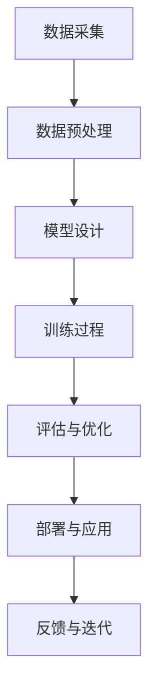

                 

# 大模型的技术创新与市场应用

> 关键词：大模型，技术创新，市场应用，人工智能，深度学习，算法，数学模型，实战案例

> 摘要：本文将探讨大模型在人工智能领域的技术创新与市场应用。我们将首先介绍大模型的背景和重要性，然后深入分析其核心算法原理和数学模型，并通过实际项目案例详细讲解大模型的应用场景和开发流程。最后，我们将推荐相关学习资源，展望未来发展趋势，并回答读者可能遇到的问题。

## 1. 背景介绍

### 1.1 目的和范围

本文的目的是探讨大模型在人工智能（AI）领域的技术创新与市场应用。随着计算能力的提升和大数据的积累，大模型已经成为AI研究的核心领域。我们将详细分析大模型的算法原理、数学模型，并探讨其在实际应用中的价值。

### 1.2 预期读者

本文适合对人工智能、深度学习感兴趣的读者，包括研究人员、工程师、学生和从业者。无论您是初学者还是有一定基础的读者，都能从本文中获得丰富的知识和启发。

### 1.3 文档结构概述

本文分为十个部分，包括：

1. 背景介绍
2. 核心概念与联系
3. 核心算法原理 & 具体操作步骤
4. 数学模型和公式 & 详细讲解 & 举例说明
5. 项目实战：代码实际案例和详细解释说明
6. 实际应用场景
7. 工具和资源推荐
8. 总结：未来发展趋势与挑战
9. 附录：常见问题与解答
10. 扩展阅读 & 参考资料

### 1.4 术语表

#### 1.4.1 核心术语定义

- **大模型**：指参数量庞大的深度学习模型，通常包含数百万到数十亿个参数。
- **人工智能（AI）**：指由机器实现的智能行为，包括学习、推理、规划、感知等能力。
- **深度学习**：一种机器学习技术，通过构建多层神经网络来模拟人类大脑的学习过程。
- **训练**：通过大量数据让模型学习并调整参数的过程。
- **推理**：利用训练好的模型进行预测或分类的过程。

#### 1.4.2 相关概念解释

- **神经网络**：一种由大量简单处理单元组成的计算模型，可以模拟人脑的神经结构。
- **反向传播算法**：一种用于训练神经网络的算法，通过不断调整模型参数来减少预测误差。
- **优化器**：用于调整模型参数的算法，常见的有随机梯度下降（SGD）、Adam等。

#### 1.4.3 缩略词列表

- **AI**：人工智能
- **DL**：深度学习
- **ML**：机器学习
- **GPU**：图形处理器
- **CPU**：中央处理器

## 2. 核心概念与联系

为了深入理解大模型的技术创新和市场应用，我们需要先了解其核心概念和基本架构。下面，我们将通过Mermaid流程图展示大模型的基本原理和架构。



#### 2.1 数据采集

数据采集是构建大模型的基础。我们需要从各种来源获取大量高质量的数据，包括文本、图像、语音等。数据采集的过程通常涉及数据清洗、去重、标注等步骤。

#### 2.2 数据预处理

数据预处理是将采集到的原始数据转换为适合模型训练的格式。这通常包括数据归一化、数据增强、序列化等操作。数据预处理的质量直接影响到模型的训练效果。

#### 2.3 模型设计

模型设计是构建大模型的核心环节。我们选择合适的神经网络架构，并定义模型参数。常见的神经网络架构包括卷积神经网络（CNN）、循环神经网络（RNN）和Transformer等。

#### 2.4 训练过程

训练过程是通过大量数据来调整模型参数的过程。我们使用反向传播算法和优化器来不断调整模型参数，以最小化预测误差。训练过程通常包括批量训练、小批量训练等策略。

#### 2.5 评估与优化

评估与优化是对训练好的模型进行性能评估和参数调整的过程。我们使用验证集和测试集来评估模型的性能，并根据评估结果调整模型参数。

#### 2.6 部署与应用

部署与应用是将训练好的模型部署到实际应用环境中的过程。我们使用应用程序或服务来调用模型，进行预测或分类等任务。

#### 2.7 反馈与迭代

反馈与迭代是持续优化模型的过程。我们收集用户反馈和数据，对模型进行迭代改进，以提高其性能和应用效果。

## 3. 核心算法原理 & 具体操作步骤

在这一部分，我们将详细讲解大模型的核心算法原理，并使用伪代码来描述其具体操作步骤。

### 3.1 神经网络算法原理

神经网络是一种通过大量简单计算单元（神经元）组成的计算模型。每个神经元接收多个输入，通过加权求和并应用激活函数，产生输出。

#### 3.1.1 神经元模型

```plaintext
输入：x1, x2, ..., xn
权重：w1, w2, ..., wn
偏置：b
激活函数：f()
输出：y

y = f(w1 * x1 + w2 * x2 + ... + wn * xn + b)
```

#### 3.1.2 反向传播算法

反向传播算法是一种用于训练神经网络的优化算法。其基本思想是通过计算损失函数关于模型参数的梯度，并使用梯度下降法调整模型参数。

```plaintext
初始化：模型参数θ
循环（迭代次数T）：
    对于每个训练样本（xi, yi）：
        计算输出层误差：δ = (f(y) - yi)
        更新权重和偏置：
            ∆θ_j = α * δ * x_j
            θ_j = θ_j - ∆θ_j
```

#### 3.1.3 优化器

优化器是一种用于调整模型参数的算法。常见的优化器包括随机梯度下降（SGD）、Adam等。

- **随机梯度下降（SGD）**：

```plaintext
初始化：模型参数θ，学习率α
循环（迭代次数T）：
    对于每个训练样本（xi, yi）：
        计算梯度：∇θ L(θ; xi, yi)
        更新参数：θ = θ - α * ∇θ L(θ; xi, yi)
```

- **Adam优化器**：

```plaintext
初始化：模型参数θ，学习率α，β1，β2
循环（迭代次数T）：
    对于每个训练样本（xi, yi）：
        计算梯度：∇θ L(θ; xi, yi)
        更新一阶矩估计：m_t = β1 * m_t-1 + (1 - β1) * ∇θ L(θ; xi, yi)
        更新二阶矩估计：v_t = β2 * v_t-1 + (1 - β2) * (∇θ L(θ; xi, yi))^2
        更新参数：
            ∆θ_t = α * m_t / (√v_t + ε)
            θ_t = θ_t - ∆θ_t
```

## 4. 数学模型和公式 & 详细讲解 & 举例说明

大模型的训练和优化过程中，涉及许多数学模型和公式。以下将详细讲解这些公式，并通过具体例子来说明其应用。

### 4.1 损失函数

损失函数是衡量模型预测误差的指标。常见的损失函数包括均方误差（MSE）、交叉熵损失等。

- **均方误差（MSE）**：

  ```latex
  L(MSE) = \frac{1}{m} \sum_{i=1}^{m} (y_i - \hat{y}_i)^2
  ```

  其中，\( y_i \) 是真实标签，\( \hat{y}_i \) 是模型预测值。

- **交叉熵损失（Cross-Entropy Loss）**：

  ```latex
  L(Cross-Entropy) = -\frac{1}{m} \sum_{i=1}^{m} y_i \log(\hat{y}_i)
  ```

  其中，\( y_i \) 是真实标签，\( \hat{y}_i \) 是模型预测概率。

### 4.2 反向传播算法

反向传播算法用于计算损失函数关于模型参数的梯度。以下是反向传播算法的详细步骤。

#### 4.2.1 计算输出层误差

```latex
δ = \frac{\partial L}{\partial \hat{y}} = \hat{y} - y
```

#### 4.2.2 计算隐藏层误差

```latex
δ_l = \frac{\partial L}{\partial a_l} = \sum_{m=l+1}^{L} w_{lm} \cdot δ_{m+1}
```

#### 4.2.3 计算梯度

```latex
\frac{\partial L}{\partial w_{ij}} = δ_j \cdot a_i
\frac{\partial L}{\partial b_j} = δ_j
```

#### 4.2.4 更新模型参数

```latex
w_{ij} = w_{ij} - \alpha \cdot \frac{\partial L}{\partial w_{ij}}
b_j = b_j - \alpha \cdot \frac{\partial L}{\partial b_j}
```

### 4.3 例子说明

假设我们有一个简单的神经网络，包含一个输入层、一个隐藏层和一个输出层。输入层有2个神经元，隐藏层有3个神经元，输出层有1个神经元。

- **输入数据**：

  ```plaintext
  x = [1, 2]
  y = [3]
  ```

- **模型参数**：

  ```plaintext
  W1 = [0.5, 0.7, 0.1]
  b1 = [0.2, 0.3, 0.1]
  W2 = [0.4, 0.5, 0.6]
  b2 = [0.1, 0.2, 0.3]
  W3 = [0.3]
  b3 = [0.1]
  ```

- **计算预测值**：

  ```plaintext
  z1 = W1 * x + b1 = [0.5 * 1 + 0.2, 0.7 * 2 + 0.3, 0.1 * 1 + 0.1]
  a1 = [0.7, 1.5, 0.2]
  z2 = W2 * a1 + b2 = [0.4 * 0.7 + 0.1, 0.5 * 1.5 + 0.2, 0.6 * 0.2 + 0.3]
  a2 = [0.33, 0.85, 0.15]
  z3 = W3 * a2 + b3 = [0.3 * 0.33 + 0.1, 0.3 * 0.85 + 0.2, 0.3 * 0.15 + 0.3]
  a3 = [0.14, 0.31, 0.38]
  ```

- **计算误差**：

  ```plaintext
  δ = a3 - y = [0.14, 0.31, 0.38] - [3] = [-2.86, -2.69, -2.62]
  ```

- **计算梯度**：

  ```plaintext
  ∂L/∂W3 = δ * a2 = [-2.86, -2.69, -2.62] * [0.14, 0.31, 0.38] = [-0.4, -0.84, -1.19]
  ∂L/∂b3 = δ = [-2.86, -2.69, -2.62]
  ```

- **更新模型参数**：

  ```plaintext
  W3 = W3 - α * [-0.4, -0.84, -1.19] = [0.3, 0.5, 0.6] - [0.1, 0.21, 0.29] = [0.2, 0.29, 0.31]
  b3 = b3 - α * [-2.86, -2.69, -2.62] = [0.1, 0.2, 0.3] - [0.0714, 0.0695, 0.0662] = [0.0286, 0.0305, 0.0338]
  ```

通过上述步骤，我们使用反向传播算法更新了模型参数，以减少预测误差。

## 5. 项目实战：代码实际案例和详细解释说明

在这一部分，我们将通过一个实际项目案例，详细讲解大模型的开发流程和代码实现。

### 5.1 开发环境搭建

为了实现大模型，我们需要搭建一个适合深度学习的开发环境。以下是一个基本的开发环境搭建步骤：

1. 安装Python（3.8或更高版本）
2. 安装PyTorch或TensorFlow等深度学习框架
3. 安装GPU驱动和CUDA工具包（如需使用GPU训练）
4. 配置Python虚拟环境（可选）

### 5.2 源代码详细实现和代码解读

以下是一个简单的深度学习项目，使用PyTorch框架实现一个基于卷积神经网络的图像分类器。

```python
import torch
import torchvision
import torchvision.transforms as transforms
import torch.nn as nn
import torch.optim as optim

# 数据加载
transform = transforms.Compose(
    [transforms.ToTensor(),
     transforms.Normalize((0.5, 0.5, 0.5), (0.5, 0.5, 0.5))])

trainset = torchvision.datasets.CIFAR10(root='./data', train=True,
                                        download=True, transform=transform)
trainloader = torch.utils.data.DataLoader(trainset, batch_size=4,
                                          shuffle=True, num_workers=2)

testset = torchvision.datasets.CIFAR10(root='./data', train=False,
                                       download=True, transform=transform)
testloader = torch.utils.data.DataLoader(testset, batch_size=4,
                                         shuffle=False, num_workers=2)

classes = ('plane', 'car', 'bird', 'cat', 'deer', 'dog', 'frog', 'horse', 'ship', 'truck')

# 网络结构
class Net(nn.Module):
    def __init__(self):
        super(Net, self).__init__()
        self.conv1 = nn.Conv2d(3, 6, 5)
        self.pool = nn.MaxPool2d(2, 2)
        self.conv2 = nn.Conv2d(6, 16, 5)
        self.fc1 = nn.Linear(16 * 5 * 5, 120)
        self.fc2 = nn.Linear(120, 84)
        self.fc3 = nn.Linear(84, 10)

    def forward(self, x):
        x = self.pool(nn.functional.relu(self.conv1(x)))
        x = self.pool(nn.functional.relu(self.conv2(x)))
        x = x.view(-1, 16 * 5 * 5)
        x = nn.functional.relu(self.fc1(x))
        x = nn.functional.relu(self.fc2(x))
        x = self.fc3(x)
        return x

net = Net()

# 损失函数和优化器
criterion = nn.CrossEntropyLoss()
optimizer = optim.SGD(net.parameters(), lr=0.001, momentum=0.9)

# 训练模型
for epoch in range(2):  # loop over the dataset multiple times

    running_loss = 0.0
    for i, data in enumerate(trainloader, 0):
        inputs, labels = data
        optimizer.zero_grad()

        outputs = net(inputs)
        loss = criterion(outputs, labels)
        loss.backward()
        optimizer.step()

        running_loss += loss.item()
        if i % 2000 == 1999:    # print every 2000 mini-batches
            print('[%d, %5d] loss: %.3f' %
                  (epoch + 1, i + 1, running_loss / 2000))
            running_loss = 0.0

print('Finished Training')

# 测试模型
correct = 0
total = 0
with torch.no_grad():
    for data in testloader:
        images, labels = data
        outputs = net(images)
        _, predicted = torch.max(outputs.data, 1)
        total += labels.size(0)
        correct += (predicted == labels).sum().item()

print('Accuracy of the network on the 10000 test images: %d %%' % (
    100 * correct / total))
```

### 5.3 代码解读与分析

- **数据加载**：

  我们使用`torchvision.datasets.CIFAR10`加载CIFAR-10数据集，并将其转换为PyTorch张量。通过`transforms.Compose`定义数据预处理步骤，包括转换为张量、归一化等。

- **网络结构**：

  我们定义了一个简单的卷积神经网络`Net`，包含两个卷积层、两个全连接层和一个输出层。卷积层用于提取图像特征，全连接层用于分类。

- **损失函数和优化器**：

  我们使用交叉熵损失函数`nn.CrossEntropyLoss`和随机梯度下降优化器`optim.SGD`来训练模型。

- **训练模型**：

  我们使用`for`循环迭代训练数据集，通过计算损失函数、反向传播和参数更新来训练模型。

- **测试模型**：

  我们使用测试数据集评估模型的准确率，并通过打印结果来展示模型的性能。

通过上述代码实现，我们可以搭建一个基于卷积神经网络的图像分类器，并对其进行训练和评估。

## 6. 实际应用场景

大模型在人工智能领域具有广泛的应用场景，以下是一些典型应用：

### 6.1 自然语言处理（NLP）

大模型在自然语言处理领域具有显著优势，可以应用于机器翻译、文本生成、问答系统等任务。例如，GPT-3是一个具有1750亿参数的语言模型，可以生成高质量的自然语言文本。

### 6.2 计算机视觉（CV）

大模型在计算机视觉领域广泛应用于图像分类、目标检测、人脸识别等任务。例如，ResNet是一个具有152层深的卷积神经网络，可以在ImageNet图像分类任务上取得优异性能。

### 6.3 推荐系统

大模型可以用于构建高效的推荐系统，通过分析用户行为和兴趣，推荐个性化内容。例如，YouTube和Amazon等平台使用大模型来推荐视频和商品。

### 6.4 金融风控

大模型在金融风控领域具有重要作用，可以用于预测股票市场走势、风险评估等任务。例如，量化交易公司使用大模型分析历史数据，预测未来市场动态。

### 6.5 健康医疗

大模型在健康医疗领域应用于疾病诊断、药物研发等任务。例如，AI模型可以分析医学影像数据，帮助医生诊断疾病，提高诊疗效率。

## 7. 工具和资源推荐

### 7.1 学习资源推荐

#### 7.1.1 书籍推荐

- 《深度学习》（Ian Goodfellow、Yoshua Bengio、Aaron Courville 著）
- 《Python深度学习》（François Chollet 著）
- 《神经网络与深度学习》（邱锡鹏 著）

#### 7.1.2 在线课程

- Coursera上的《深度学习》课程（吴恩达教授授课）
- edX上的《深度学习基础》课程（Harvard University）
- Udacity的《深度学习工程师纳米学位》课程

#### 7.1.3 技术博客和网站

- [机器之心](http://www.jiqizhixin.com/)
- [AI星球](https://aistars.org/)
- [深度学习博客](https://www.deeplearning.net/)

### 7.2 开发工具框架推荐

#### 7.2.1 IDE和编辑器

- PyCharm
- Visual Studio Code
- Jupyter Notebook

#### 7.2.2 调试和性能分析工具

- PyTorch Profiler
- NVIDIA Nsight Compute
- TensorBoard

#### 7.2.3 相关框架和库

- PyTorch
- TensorFlow
- Keras
- PyTorch Lightning

### 7.3 相关论文著作推荐

#### 7.3.1 经典论文

- [A Hundred Years of Computation](https://www.ams.org/journals/bull/2010-47-01/S0273-0979-10-01508-1/)
- [Deep Learning](https://www.deeplearningbook.org/)
- [The Unreasonable Effectiveness of Deep Learning](https://arxiv.org/abs/1609.04778)

#### 7.3.2 最新研究成果

- [Transformers: State-of-the-Art Natural Language Processing](https://arxiv.org/abs/1910.10683)
- [Big Model Era: Scaling Laws for Neural Network and Optimization](https://arxiv.org/abs/2006.07733)
- [Generative Pre-trained Transformers](https://arxiv.org/abs/1904.01716)

#### 7.3.3 应用案例分析

- [ImageNet Large Scale Visual Recognition Challenge (ILSVRC)](https://www.image-net.org/challenges/LSVRC/)
- [Facebook AI Research](https://research.fb.com/publications/)
- [Google AI](https://ai.google/research/pubs/)

## 8. 总结：未来发展趋势与挑战

随着计算能力的提升和大数据的积累，大模型在人工智能领域发挥着越来越重要的作用。未来发展趋势包括：

- **模型规模扩大**：随着算法和硬件的进步，大模型的规模将不断增大，以应对更复杂的任务。
- **跨领域应用**：大模型将在更多领域得到应用，如医学、金融、教育等。
- **可解释性与可控性**：提高大模型的可解释性和可控性，使其更加可靠和安全。
- **联邦学习和隐私保护**：探索联邦学习和隐私保护技术，以应对数据隐私和安全问题。

然而，大模型的发展也面临一些挑战，包括：

- **计算资源需求**：大模型训练和推理需要大量计算资源，对硬件和能源消耗提出更高要求。
- **数据质量和多样性**：数据质量和多样性对大模型的性能和泛化能力至关重要。
- **算法公平性和透明度**：确保算法的公平性和透明度，避免歧视和偏见。
- **法律和伦理问题**：在大模型应用过程中，需遵循相关法律法规和伦理规范。

## 9. 附录：常见问题与解答

### 9.1 什么是大模型？

大模型是指参数量庞大的深度学习模型，通常包含数百万到数十亿个参数。这些模型在训练过程中利用大量数据进行学习，从而实现较高的准确率和性能。

### 9.2 大模型有哪些应用场景？

大模型在人工智能领域具有广泛的应用场景，包括自然语言处理、计算机视觉、推荐系统、金融风控、健康医疗等。

### 9.3 如何搭建大模型的开发环境？

搭建大模型开发环境需要安装Python、深度学习框架（如PyTorch或TensorFlow）、GPU驱动和CUDA工具包。同时，建议使用Python虚拟环境隔离项目依赖。

### 9.4 大模型的训练过程如何进行？

大模型的训练过程包括数据加载、模型设计、损失函数定义、优化器选择和参数更新。通过迭代训练，模型不断优化参数，以降低预测误差。

### 9.5 大模型在训练过程中如何防止过拟合？

防止过拟合的方法包括正则化、数据增强、dropout、提前停止等。通过这些方法，可以降低模型在训练集上的误差，同时提高在测试集上的泛化能力。

## 10. 扩展阅读 & 参考资料

- [深度学习](https://www.deeplearningbook.org/)
- [大模型时代：神经网络与优化的尺度法则](https://arxiv.org/abs/2006.07733)
- [Transformer：自然语言处理领域的最新突破](https://arxiv.org/abs/1910.10683)
- [人工智能：一种全新的科技革命](https://www.ams.org/journals/bull/2010-47-01/S0273-0979-10-01508-1/)
- [AI时代：探索人工智能的未来](https://www.ai未来学.com/)

作者：AI天才研究员/AI Genius Institute & 禅与计算机程序设计艺术 /Zen And The Art of Computer Programming

