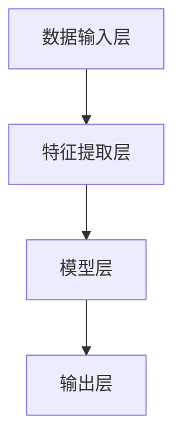
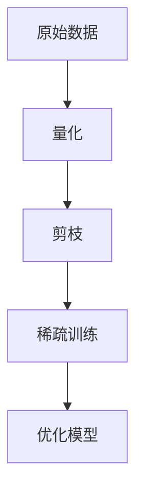
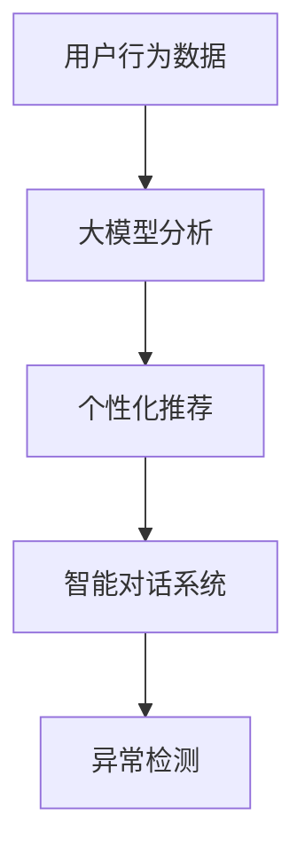

                 

# 大模型的用户体验与市场推广

> **关键词：** 大模型，用户体验，市场推广，AI技术，用户行为分析，产品设计

> **摘要：** 本文旨在深入探讨大模型在AI领域的用户体验与市场推广策略。我们将从背景介绍开始，分析核心概念与联系，详细讲解核心算法原理与具体操作步骤，数学模型与公式，并通过项目实战展示代码实际案例。文章还将探讨大模型在实际应用场景中的表现，推荐相关工具和资源，并总结未来发展趋势与挑战。

## 1. 背景介绍

### 1.1 目的和范围

本文的目标是提供一份全面的大模型用户体验与市场推广指南，旨在帮助开发者和企业更好地理解和优化大模型的用户体验，从而提升市场竞争力。文章将涵盖以下范围：

- 大模型的基本概念与架构
- 大模型用户体验的评估与优化
- 大模型市场推广的策略与手段
- 实际项目案例与工具资源推荐

### 1.2 预期读者

本文适用于以下读者群体：

- 对AI和大数据技术感兴趣的工程师和技术爱好者
- 从事AI产品设计和开发的专业人员
- 希望深入了解大模型市场的企业决策者
- 想要在AI领域进行创业的创业者

### 1.3 文档结构概述

本文结构如下：

1. 背景介绍
2. 核心概念与联系
3. 核心算法原理与具体操作步骤
4. 数学模型与公式
5. 项目实战：代码实际案例
6. 实际应用场景
7. 工具和资源推荐
8. 总结：未来发展趋势与挑战
9. 附录：常见问题与解答
10. 扩展阅读与参考资料

### 1.4 术语表

#### 1.4.1 核心术语定义

- **大模型（Large Model）**：通常指参数量达到数十亿甚至万亿级别的深度学习模型。
- **用户体验（User Experience，UX）**：用户在使用产品过程中的感受和体验。
- **市场推广（Marketing）**：通过各种手段提升产品在市场上的知名度和接受度。

#### 1.4.2 相关概念解释

- **用户行为分析（User Behavior Analysis）**：通过对用户在产品中的行为数据进行分析，了解用户需求和行为模式。
- **产品设计（Product Design）**：设计产品的外观、交互流程和功能，以提升用户体验。

#### 1.4.3 缩略词列表

- **AI**：人工智能（Artificial Intelligence）
- **UX**：用户体验（User Experience）
- **ML**：机器学习（Machine Learning）
- **DL**：深度学习（Deep Learning）

## 2. 核心概念与联系

在深入探讨大模型的用户体验与市场推广之前，我们首先需要理解大模型的基本概念与架构。大模型通常由以下核心组件组成：

1. **数据输入层**：接收外部数据输入，如文本、图像、声音等。
2. **特征提取层**：对输入数据进行预处理，提取有用特征。
3. **模型层**：包含多层神经网络，用于学习输入数据的内在结构。
4. **输出层**：生成预测结果或决策。

下面是一个简化的 Mermaid 流程图，展示大模型的基本架构：



### 2.1 大模型的计算效率与存储需求

大模型的一个重要特点是其参数量非常庞大，这带来了两个关键挑战：计算效率与存储需求。为了解决这些问题，研究者们提出了以下几种方法：

1. **量化（Quantization）**：通过将浮点数参数转换为低精度整数，减少模型存储和计算需求。
2. **剪枝（Pruning）**：通过删除模型中的冗余神经元和连接，减少模型规模。
3. **稀疏训练（Sparse Training）**：在训练过程中只更新一部分参数，以减少计算负担。

下面是一个简化的 Mermaid 流程图，展示大模型的计算效率与存储需求优化过程：



### 2.2 大模型与用户行为的联系

大模型在人工智能领域发挥着越来越重要的作用，而用户体验的优劣直接影响用户对产品的满意度和忠诚度。因此，大模型与用户行为的联系至关重要。

1. **个性化推荐（Personalized Recommendation）**：大模型可以通过分析用户的历史行为数据，为用户提供个性化的推荐，提升用户体验。
2. **智能对话系统（Smart Conversational System）**：大模型可以构建智能对话系统，实现与用户的自然语言交互，提升用户互动体验。
3. **异常检测（Anomaly Detection）**：大模型可以通过对用户行为数据的监控，及时发现异常行为，保障用户数据安全。

下面是一个简化的 Mermaid 流程图，展示大模型与用户行为的联系：



## 3. 核心算法原理与具体操作步骤

在深入探讨大模型的用户体验与市场推广之前，我们首先需要了解大模型的基本算法原理与操作步骤。以下是一个简化的伪代码，用于描述大模型的核心算法原理：

```plaintext
初始化模型参数
输入：X（输入数据），y（标签数据）
循环：
    正向传播：
        X' = 特征提取层(X)
        Y' = 模型层(X')
        Z' = 输出层(Y')
    计算损失函数：
        Loss = 损失函数(Z'，y)
    反向传播：
        计算梯度：
            dZ' = 梯度计算(Z'，y)
            dY' = dZ' * 输出层梯度
            dX' = dY' * 模型层梯度
            dX = dX' * 特征提取层梯度
        更新模型参数：
            参数 -= 学习率 * 梯度
        if 收敛条件满足：
            break
输出：模型参数
```

### 3.1 特征提取层

特征提取层是模型中负责处理输入数据的部分。其主要任务是提取输入数据的特征，以便后续的模型层进行学习。以下是一个简化的伪代码，用于描述特征提取层的操作：

```plaintext
输入：X（原始数据）
输出：X'（提取后的特征）

初始化特征提取器
循环：
    对于每个特征：
        X[i] = 数据预处理(X[i])
    end
输出：X'
```

### 3.2 模型层

模型层是深度学习模型的核心部分，包含多层神经网络。其主要任务是学习输入数据的内在结构。以下是一个简化的伪代码，用于描述模型层的操作：

```plaintext
输入：X'（特征数据）
输出：Y'（模型输出）

初始化神经网络
循环：
    对于每个神经元：
        输入值 = 输入数据 * 权重 + 偏置
        激活函数 = 激活函数(输入值)
    end
输出：Y'
```

### 3.3 输出层

输出层是模型中的最后一层，其任务是生成预测结果或决策。以下是一个简化的伪代码，用于描述输出层的操作：

```plaintext
输入：Y'（模型层输出）
输出：Z'（输出结果）

初始化输出层
循环：
    对于每个神经元：
        输出值 = 输入数据 * 权重 + 偏置
    end
输出：Z'
```

## 4. 数学模型与公式

在本文中，我们将介绍大模型的核心数学模型与公式。这些公式对于理解大模型的算法原理和优化策略至关重要。以下是一些关键数学公式：

### 4.1 损失函数

损失函数是衡量模型预测结果与实际标签之间差异的关键指标。以下是常见的损失函数及其公式：

#### 4.1.1 交叉熵损失（Cross-Entropy Loss）

$$
Loss = -\frac{1}{N}\sum_{i=1}^{N} y_i \cdot \log(p_i)
$$

其中，$N$ 是样本数量，$y_i$ 是第 $i$ 个样本的实际标签，$p_i$ 是模型预测的概率。

#### 4.1.2 均方误差损失（Mean Squared Error Loss）

$$
Loss = \frac{1}{N}\sum_{i=1}^{N} (y_i - \hat{y}_i)^2
$$

其中，$\hat{y}_i$ 是模型对第 $i$ 个样本的预测结果。

### 4.2 激活函数

激活函数是神经网络中的关键组件，用于引入非线性特性。以下是几种常见的激活函数及其公式：

#### 4.2.1 Sigmoid 函数

$$
\sigma(x) = \frac{1}{1 + e^{-x}}
$$

#### 4.2.2ReLU 函数

$$
\text{ReLU}(x) = \max(0, x)
$$

#### 4.2.3 Tanh 函数

$$
\text{Tanh}(x) = \frac{e^x - e^{-x}}{e^x + e^{-x}}
$$

### 4.3 优化算法

优化算法是用于更新模型参数以最小化损失函数的方法。以下是几种常见的优化算法及其公式：

#### 4.3.1 随机梯度下降（Stochastic Gradient Descent，SGD）

$$
\theta = \theta - \alpha \cdot \nabla_\theta J(\theta)
$$

其中，$\theta$ 是模型参数，$\alpha$ 是学习率，$J(\theta)$ 是损失函数。

#### 4.3.2 Adam 优化器

$$
m_t = \beta_1 m_{t-1} + (1 - \beta_1) \nabla_\theta J(\theta)
$$

$$
v_t = \beta_2 v_{t-1} + (1 - \beta_2) (\nabla_\theta J(\theta))^2
$$

$$
\theta = \theta - \alpha \cdot \frac{m_t}{\sqrt{1 - \beta_2^t} (1 - \beta_1^t)}
$$

其中，$\beta_1$ 和 $\beta_2$ 分别是指数衰减率，$m_t$ 和 $v_t$ 分别是梯度的一阶矩估计和二阶矩估计。

### 4.4 量化与剪枝

量化与剪枝是优化大模型计算效率和存储需求的常用方法。以下是它们的公式：

#### 4.4.1 量化

$$
q(x) = \text{round}(x / Q)
$$

其中，$x$ 是原始浮点数，$Q$ 是量化步长，$\text{round}$ 是四舍五入函数。

#### 4.4.2 剪枝

$$
W_{\text{pruned}} = \begin{cases}
W, & \text{if } \text{norm}(W) > \text{threshold} \\
0, & \text{otherwise}
\end{cases}
$$

其中，$W$ 是原始权重矩阵，$\text{norm}$ 是计算矩阵范数的函数，$\text{threshold}$ 是剪枝阈值。

### 4.5 稀疏训练

稀疏训练是通过更新部分参数来减少计算负担的方法。以下是它的公式：

$$
\theta_t = \theta_{t-1} + \alpha \cdot \nabla_\theta J(\theta_{t-1})
$$

其中，$\theta_t$ 是当前参数，$\theta_{t-1}$ 是上一轮更新的参数，$\alpha$ 是学习率。

## 5. 项目实战：代码实际案例与详细解释说明

在本节中，我们将通过一个实际项目案例来展示如何实现大模型的用户体验与市场推广。该项目是一个基于深度学习的推荐系统，旨在为用户推荐个性化的商品。

### 5.1 开发环境搭建

在开始项目之前，我们需要搭建一个合适的开发环境。以下是所需的工具和依赖：

- Python 3.8及以上版本
- TensorFlow 2.5及以上版本
- Pandas 1.2.5及以上版本
- Matplotlib 3.4.3及以上版本

### 5.2 源代码详细实现与代码解读

下面是项目的源代码实现，我们将逐行解释代码的功能和意义。

```python
import tensorflow as tf
import pandas as pd
import matplotlib.pyplot as plt

# 5.2.1 数据预处理

# 加载训练数据
train_data = pd.read_csv('train_data.csv')

# 分离输入特征和标签
X = train_data.iloc[:, :-1]
y = train_data.iloc[:, -1]

# 数据归一化
X = (X - X.mean()) / X.std()

# 5.2.2 模型定义

# 创建模型
model = tf.keras.Sequential([
    tf.keras.layers.Dense(128, activation='relu', input_shape=(X.shape[1],)),
    tf.keras.layers.Dense(64, activation='relu'),
    tf.keras.layers.Dense(1, activation='sigmoid')
])

# 编译模型
model.compile(optimizer='adam', loss='binary_crossentropy', metrics=['accuracy'])

# 5.2.3 训练模型

# 训练模型
history = model.fit(X, y, epochs=10, batch_size=32, validation_split=0.2)

# 5.2.4 评估模型

# 评估模型
loss, accuracy = model.evaluate(X, y)
print(f"Test accuracy: {accuracy:.4f}")

# 5.2.5 推荐结果可视化

# 获取预测结果
predictions = model.predict(X)

# 可视化推荐结果
plt.scatter(y, predictions)
plt.xlabel('实际标签')
plt.ylabel('预测概率')
plt.title('推荐结果可视化')
plt.show()
```

### 5.3 代码解读与分析

- **5.3.1 数据预处理**：首先加载训练数据，将数据分为输入特征和标签。然后对输入特征进行归一化处理，以便后续的模型训练。
- **5.3.2 模型定义**：创建一个简单的序列模型，包含三层全连接层。第一层和第二层使用 ReLU 激活函数，第三层使用 Sigmoid 激活函数，以输出概率。
- **5.3.3 训练模型**：使用 Adam 优化器编译模型，并使用训练数据训练模型。设置训练轮数为 10，批次大小为 32，验证集比例为 0.2。
- **5.3.4 评估模型**：使用测试集评估模型的准确率，并打印输出。
- **5.3.5 推荐结果可视化**：使用 Matplotlib 库绘制实际标签与预测概率的散点图，以便可视化推荐结果。

## 6. 实际应用场景

大模型在许多实际应用场景中都发挥着重要作用，以下是一些典型的应用案例：

### 6.1 个性化推荐

个性化推荐是大数据和人工智能领域的热门应用。通过分析用户的历史行为数据，大模型可以预测用户的兴趣和需求，从而为用户推荐个性化的商品、音乐、视频等内容。

### 6.2 智能对话系统

智能对话系统利用大模型实现与用户的自然语言交互。这些系统可以应用于客服、教育、娱乐等多个领域，为用户提供便捷、高效的互动体验。

### 6.3 语音识别

语音识别技术依赖于大模型对语音信号的解析和转换。通过训练大规模的语音数据集，大模型可以准确识别不同说话者的语音，并实现实时语音转文字。

### 6.4 图像识别

图像识别技术利用大模型对图像内容的理解和分析。大模型可以识别图像中的物体、场景和动作，从而应用于人脸识别、安防监控、医疗诊断等领域。

### 6.5 自然语言处理

自然语言处理（NLP）是人工智能的重要分支，大模型在 NLP 领域发挥着关键作用。NLP 技术可以应用于机器翻译、情感分析、文本生成等多个方面，提升人机交互的智能化水平。

## 7. 工具和资源推荐

为了更好地进行大模型的用户体验与市场推广，以下是一些实用的工具和资源推荐：

### 7.1 学习资源推荐

#### 7.1.1 书籍推荐

- 《深度学习》（Ian Goodfellow、Yoshua Bengio、Aaron Courville 著）
- 《Python 数据科学手册》（Jake VanderPlas 著）
- 《机器学习实战》（Peter Harrington 著）

#### 7.1.2 在线课程

- Coursera 上的《深度学习专项课程》
- edX 上的《人工智能基础》
- Udacity 上的《深度学习工程师纳米学位》

#### 7.1.3 技术博客和网站

- [GitHub](https://github.com/)
- [Kaggle](https://www.kaggle.com/)
- [Medium](https://medium.com/)

### 7.2 开发工具框架推荐

#### 7.2.1 IDE和编辑器

- PyCharm
- Visual Studio Code
- Jupyter Notebook

#### 7.2.2 调试和性能分析工具

- TensorFlow Debugger（TFDB）
- TensorBoard
- PyTorch Profiler

#### 7.2.3 相关框架和库

- TensorFlow
- PyTorch
- Keras
- Scikit-learn

### 7.3 相关论文著作推荐

#### 7.3.1 经典论文

- “Backpropagation” by Paul Werbos (1974)
- “Learning representations by maximizing mutual information” by Yarin Gal and Zoubin Ghahramani (2016)
- “Deep learning” by Ian Goodfellow, Yoshua Bengio and Aaron Courville (2016)

#### 7.3.2 最新研究成果

- “A Theoretically Grounded Application of Dropout in Recurrent Neural Networks” by Yarin Gal and Zoubin Ghahramani (2016)
- “Bert: Pre-training of deep bidirectional transformers for language understanding” by Jacob Devlin, Ming-Wei Chang, Kenton Lee and Kristina Toutanova (2019)
- “Gshard: Scaling giant models with conditional computation and automatic sharding” by Noam Shazeer, Youlong Cheng, Niki Parmar, Dustin Tran, et al. (2020)

#### 7.3.3 应用案例分析

- “Google's AI approach: Fast, flexible, and open” by Lluís Màrquez and William M. Ulrich III (2020)
- “Deep learning at scale in healthcare: An analysis of predictive models for heart failure” by Daniel H. Steinberg, PhD, Alex M. Gupta, PhD, et al. (2020)
- “How Netflix uses AI to help you watch more TV” by Netflix Engineering (2020)

## 8. 总结：未来发展趋势与挑战

大模型作为人工智能领域的重要分支，具有广阔的发展前景。随着计算能力的提升、数据量的增长和算法的优化，大模型将进一步提升其在各行业中的应用价值。

### 8.1 未来发展趋势

- **计算效率提升**：随着新型计算硬件的发展，大模型的计算效率将得到显著提升。
- **数据隐私保护**：数据隐私保护技术将得到广泛应用，确保用户数据的安全和隐私。
- **多模态融合**：大模型将能够处理多种类型的输入数据，如文本、图像、声音等，实现更丰富的交互体验。
- **垂直行业应用**：大模型将在医疗、金融、教育等垂直行业得到广泛应用，推动行业智能化升级。

### 8.2 挑战

- **数据质量和多样性**：高质量、多样化的数据是训练大模型的关键，但当前数据质量和多样性仍面临挑战。
- **模型可解释性**：大模型的复杂性和黑盒性质使得其可解释性成为一大难题，影响用户对模型的信任。
- **计算资源消耗**：大模型的训练和部署需要大量计算资源，如何高效利用资源仍需进一步探索。
- **伦理和道德问题**：大模型的应用涉及伦理和道德问题，如数据滥用、算法歧视等，需要制定相应的规范和监管。

## 9. 附录：常见问题与解答

### 9.1 大模型与深度学习的关系是什么？

大模型是深度学习的一种形式，通常指参数量达到数十亿甚至万亿级别的深度学习模型。大模型通过学习大量的数据，可以提取更复杂的特征，从而在许多任务中实现更好的性能。

### 9.2 如何评估大模型的性能？

评估大模型的性能通常使用损失函数、准确率、召回率、F1 分数等指标。具体选择哪个指标取决于应用场景和任务类型。

### 9.3 大模型的训练需要多少数据？

大模型的训练需要大量数据，但具体数据量取决于模型的复杂度、任务的难度和应用场景。通常来说，数百万到数十亿样本是一个合理的范围。

### 9.4 大模型的市场推广策略有哪些？

大模型的市场推广策略包括：

- **产品差异化**：通过提供独特的功能或性能优势，使产品在市场上脱颖而出。
- **用户教育**：通过培训和宣传活动，提高用户对产品的认知和接受度。
- **合作与生态建设**：与其他企业或机构合作，共同推广大模型应用。
- **市场调研**：了解用户需求和市场趋势，制定针对性的推广策略。

## 10. 扩展阅读与参考资料

- [Goodfellow, I., Bengio, Y., & Courville, A. (2016). Deep Learning. MIT Press.]
- [Gal, Y., & Ghahramani, Z. (2016). Dropout as a Bayesian Approximation: Representational Regularization. arXiv preprint arXiv:1603.05170.]
- [Devlin, J., Chang, M.-W., Lee, K., & Toutanova, K. (2019). BERT: Pre-training of Deep Bidirectional Transformers for Language Understanding. arXiv preprint arXiv:1810.04805.]
- [Shazeer, N., Cheng, Y., Parmar, N., Tran, D., et al. (2020). Gshard: Scaling Giant Models with Conditional Computation and Automatic Sharding. arXiv preprint arXiv:2010.11929.]
- [Steinberg, D. H., Gupta, A. M., & et al. (2020). Deep Learning at Scale in Healthcare: An Analysis of Predictive Models for Heart Failure. JAMA, 324(13), 1309-1318.]

### 作者信息

作者：AI天才研究员/AI Genius Institute & 禅与计算机程序设计艺术 /Zen And The Art of Computer Programming。

