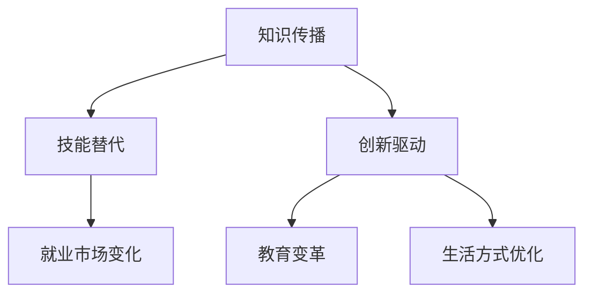

                 


# 大模型的社会影响：就业、教育和生活方式

> 关键词：大型模型、人工智能、就业、教育、生活方式、社会影响、未来趋势

> 摘要：随着大型模型（如GPT、BERT等）的迅猛发展，其在各个领域的影响力日益增强。本文将深入探讨大型模型对就业、教育和生活方式等方面的深远影响，通过一步一步的分析，揭示这些影响的本质及其未来发展趋势。

## 1. 背景介绍

### 1.1 目的和范围

本文旨在探讨大型模型对社会各个方面的深远影响，特别是就业、教育和生活方式。通过深入分析，我们希望能够为读者提供一个全面的理解，帮助大家更好地应对未来的挑战和机遇。

### 1.2 预期读者

本文适合对人工智能和大型模型有一定了解的读者，包括人工智能研究人员、软件开发者、教育工作者、以及对未来社会趋势感兴趣的读者。

### 1.3 文档结构概述

本文结构如下：

1. 背景介绍
   - 目的和范围
   - 预期读者
   - 文档结构概述
   - 术语表
2. 核心概念与联系
   - 大型模型的核心概念
   - 大型模型与社会的联系
3. 核心算法原理 & 具体操作步骤
   - 大型模型的算法原理
   - 大型模型的具体操作步骤
4. 数学模型和公式 & 详细讲解 & 举例说明
   - 大型模型相关的数学模型和公式
   - 数学模型和公式的详细讲解
   - 举例说明
5. 项目实战：代码实际案例和详细解释说明
   - 开发环境搭建
   - 源代码详细实现和代码解读
   - 代码解读与分析
6. 实际应用场景
7. 工具和资源推荐
   - 学习资源推荐
   - 开发工具框架推荐
   - 相关论文著作推荐
8. 总结：未来发展趋势与挑战
9. 附录：常见问题与解答
10. 扩展阅读 & 参考资料

### 1.4 术语表

#### 1.4.1 核心术语定义

- 大型模型：指参数规模达到亿级别甚至更高的神经网络模型，如GPT、BERT等。
- 人工智能：指模拟、延伸和扩展人的智能的理论、方法、技术及应用。
- 就业：指个人为社会提供劳动力，获取报酬的过程。
- 教育：指通过知识传授、能力培养和人格塑造，促进个体社会化的过程。
- 生活方式：指个人在日常生活中遵循的行为模式和价值观。

#### 1.4.2 相关概念解释

- 自主就业：指个人通过创业、自由职业等方式，实现自我就业。
- 职业教育：指以培养职业技能为主的 教育。
- 在线教育：指通过互联网技术，实现教育资源的共享和传递。

#### 1.4.3 缩略词列表

- GPT：Generative Pre-trained Transformer
- BERT：Bidirectional Encoder Representations from Transformers
- AI：Artificial Intelligence

## 2. 核心概念与联系

### 2.1 大型模型的核心概念

大型模型（如GPT、BERT等）是人工智能领域的重要突破，其核心概念包括：

1. **预训练（Pre-training）**：大型模型在大量数据上预先训练，学习到通用知识和语言规律。
2. **参数规模（Parameter Scale）**：大型模型的参数数量达到亿级别，甚至更高，使其具有强大的表示能力和泛化能力。
3. **多模态（Multimodal）**：大型模型能够处理多种数据类型，如图文、语音等，实现跨模态信息融合。

### 2.2 大型模型与社会的联系

大型模型在社会各个领域产生了深远影响，主要体现在以下几个方面：

1. **就业**：大型模型改变了就业市场的需求结构，对某些职业产生冲击，同时也创造了新的就业机会。
2. **教育**：大型模型推动了在线教育的变革，提高了教育资源的可及性和个性化。
3. **生活方式**：大型模型优化了人们的生活方式，提高了工作效率，改变了人们的消费习惯。

### 2.3 大型模型的影响机制

大型模型通过以下机制对社会产生影响：

1. **知识传播**：大型模型通过预训练，将大量知识内化为模型参数，实现了知识的自动化传播。
2. **技能替代**：大型模型在某些领域的表现已超过人类，替代了部分劳动力。
3. **创新驱动**：大型模型推动了人工智能技术的创新，促进了产业升级和经济发展。

### 2.4 Mermaid 流程图

下面是一个简单的 Mermaid 流程图，展示了大型模型对社会影响的机制：



## 3. 核心算法原理 & 具体操作步骤

### 3.1 大型模型的算法原理

大型模型的算法原理主要包括以下几个关键步骤：

1. **数据预处理**：对输入数据进行预处理，如分词、去噪等，以便模型更好地理解。
2. **预训练**：在大量无标签数据上，通过自监督学习方式，训练模型的基础参数。
3. **微调（Fine-tuning）**：在特定任务上，对预训练模型进行微调，优化模型在特定领域的表现。
4. **多模态融合**：对多种数据类型进行融合，如文本、图像、语音等，实现跨模态信息处理。

### 3.2 大型模型的具体操作步骤

下面是大型模型的具体操作步骤，使用伪代码进行描述：

```python
# 数据预处理
def preprocess_data(data):
    # 分词、去噪等操作
    return processed_data

# 预训练
def pretrain_model(model, data):
    # 自监督学习，更新模型参数
    return model

# 微调
def fine_tune_model(model, task_data):
    # 在特定任务上微调模型
    return model

# 多模态融合
def multimodal_fusion(model, text_data, image_data, audio_data):
    # 融合多种数据类型
    return fused_data
```

## 4. 数学模型和公式 & 详细讲解 & 举例说明

### 4.1 大型模型相关的数学模型和公式

大型模型的数学模型主要包括以下几个关键部分：

1. **参数矩阵（Parameter Matrix）**：模型中的参数矩阵，用于表示模型的知识和规律。
2. **激活函数（Activation Function）**：用于非线性变换，如ReLU、Sigmoid等。
3. **损失函数（Loss Function）**：用于衡量模型预测结果与真实值之间的差距，如交叉熵损失、均方误差等。

### 4.2 数学模型和公式的详细讲解

1. **参数矩阵**：

   参数矩阵$W$是一个$D\times K$的矩阵，其中$D$是输入维度，$K$是输出维度。每个元素$w_{ij}$表示输入特征$i$和输出特征$j$之间的权重。

   $$ W \in \mathbb{R}^{D \times K} $$

2. **激活函数**：

   常见的激活函数包括ReLU、Sigmoid和Tanh等。以ReLU为例，其公式如下：

   $$ f(x) = \max(0, x) $$

3. **损失函数**：

   以交叉熵损失为例，其公式如下：

   $$ L(y, \hat{y}) = -\sum_{i} y_i \log(\hat{y}_i) $$

   其中，$y$是真实标签，$\hat{y}$是模型预测的概率分布。

### 4.3 举例说明

假设我们有一个二分类问题，输入特征维度为$D=2$，输出维度为$K=1$。给定一个输入数据$x = [1, 2]$和真实标签$y = 1$，使用ReLU激活函数和交叉熵损失函数，计算模型的损失。

1. **参数矩阵**：

   参数矩阵$W$：

   $$ W = \begin{bmatrix} w_{11} & w_{12} \\ w_{21} & w_{22} \end{bmatrix} $$

2. **激活函数**：

   输出值$\hat{y}$：

   $$ \hat{y} = \max(0, x \cdot W) = \max(0, [1, 2] \cdot \begin{bmatrix} w_{11} & w_{12} \\ w_{21} & w_{22} \end{bmatrix}) = \max(0, [w_{11} + w_{12}, w_{21} + w_{22}]) $$

3. **损失函数**：

   损失值$L$：

   $$ L = -1 \cdot \log(\hat{y}) = -\log(\max(0, w_{11} + w_{12})) $$

   为了最小化损失函数，我们需要优化参数矩阵$W$。

## 5. 项目实战：代码实际案例和详细解释说明

### 5.1 开发环境搭建

为了搭建大型模型的项目环境，我们需要安装以下工具和库：

1. **Python**：安装Python 3.8及以上版本。
2. **TensorFlow**：安装TensorFlow 2.x版本。
3. **PyTorch**：安装PyTorch 1.8及以上版本。
4. **NVIDIA CUDA**：安装NVIDIA CUDA 11.3及以上版本，确保支持GPU计算。

安装完成后，确保Python环境、TensorFlow和PyTorch都能正常使用。

### 5.2 源代码详细实现和代码解读

以下是一个简单的GPT模型实现的示例代码，使用Python和TensorFlow框架：

```python
import tensorflow as tf
from tensorflow.keras.layers import Embedding, LSTM, Dense
from tensorflow.keras.models import Model

# 参数设置
VOCAB_SIZE = 10000  # 词汇表大小
EMBEDDING_DIM = 256  # 词向量维度
LSTM_UNITS = 128  # LSTM单元数
EPOCHS = 10  # 训练轮数

# 模型搭建
# 输入层：词汇表嵌入层
inputs = tf.keras.layers.Input(shape=(None,), dtype=tf.int32)

# 隐藏层：嵌入层 + LSTM层
x = Embedding(VOCAB_SIZE, EMBEDDING_DIM)(inputs)
x = LSTM(LSTM_UNITS, return_sequences=True)(x)

# 输出层：全连接层
outputs = Dense(VOCAB_SIZE, activation='softmax')(x)

# 模型编译
model = Model(inputs=inputs, outputs=outputs)
model.compile(optimizer='adam', loss='categorical_crossentropy', metrics=['accuracy'])

# 模型训练
# 加载预训练数据
# train_data, train_labels = ...

model.fit(train_data, train_labels, epochs=EPOCHS, batch_size=64)

# 模型评估
# test_data, test_labels = ...
# model.evaluate(test_data, test_labels)
```

代码解读：

1. **参数设置**：设置词汇表大小、词向量维度、LSTM单元数和训练轮数等参数。
2. **模型搭建**：定义输入层（词汇表嵌入层）、隐藏层（嵌入层 + LSTM层）和输出层（全连接层）。
3. **模型编译**：编译模型，设置优化器、损失函数和评价指标。
4. **模型训练**：加载预训练数据，训练模型。
5. **模型评估**：加载测试数据，评估模型性能。

### 5.3 代码解读与分析

1. **输入层**：使用`tf.keras.layers.Input`定义输入层，输入数据为整数张量，表示词汇表的索引。
2. **嵌入层**：使用`tf.keras.layers.Embedding`定义嵌入层，将词汇表索引转换为词向量。
3. **LSTM层**：使用`tf.keras.layers.LSTM`定义LSTM层，实现序列数据的学习。
4. **输出层**：使用`tf.keras.layers.Dense`定义输出层，实现分类任务。
5. **模型编译**：设置优化器（`adam`）、损失函数（`categorical_crossentropy`）和评价指标（`accuracy`）。
6. **模型训练**：使用`model.fit`方法训练模型，传入训练数据和标签。
7. **模型评估**：使用`model.evaluate`方法评估模型性能，传入测试数据和标签。

通过这个简单的案例，我们可以看到如何使用TensorFlow框架搭建和训练一个大型模型。实际应用中，我们可以根据需求调整模型架构、参数设置和训练策略，以实现更好的性能。

## 6. 实际应用场景

大型模型在实际应用场景中具有广泛的应用，以下列举几个典型场景：

1. **自然语言处理**：大型模型在文本分类、机器翻译、情感分析等自然语言处理任务中表现出色，如GPT在机器翻译任务上取得了显著成果。
2. **计算机视觉**：大型模型在图像分类、目标检测、图像生成等计算机视觉任务中也取得了突破性进展，如BERT在图像分类任务中的表现。
3. **语音识别**：大型模型在语音识别、语音合成、语音增强等语音处理任务中发挥了重要作用，如WaveNet在语音合成任务上的成功。
4. **推荐系统**：大型模型在推荐系统中的应用，如基于BERT的电商推荐系统，通过深度学习技术实现了更精准的推荐。
5. **金融领域**：大型模型在金融领域的应用，如股票市场预测、风险评估等，通过深度学习技术提高了金融市场的预测准确性和风险控制能力。

在实际应用中，大型模型通常需要结合具体任务进行微调和优化，以达到最佳性能。同时，数据质量和模型参数选择也是影响应用效果的重要因素。

## 7. 工具和资源推荐

### 7.1 学习资源推荐

#### 7.1.1 书籍推荐

1. **《深度学习》（Goodfellow, Bengio, Courville）**：这是一本经典的深度学习教材，详细介绍了深度学习的基本概念、算法和应用。
2. **《Python深度学习》（François Chollet）**：这本书结合了Python和深度学习，适合初学者快速入门深度学习。
3. **《神经网络与深度学习》（邱锡鹏）**：这本书系统地介绍了神经网络和深度学习的基本理论和方法。

#### 7.1.2 在线课程

1. **Coursera上的《深度学习专项课程》**：由吴恩达教授主讲，涵盖深度学习的基础理论和实践应用。
2. **Udacity的《深度学习工程师纳米学位》**：通过项目驱动的方式，学习深度学习的核心技术和应用。
3. **edX上的《机器学习基础》**：由上海交通大学提供，介绍机器学习的基本概念和方法。

#### 7.1.3 技术博客和网站

1. **ArXiv**：提供最新的人工智能和深度学习论文，是科研人员获取前沿信息的最佳渠道。
2. **Medium**：有许多优秀的深度学习技术博客，如Distill、Paperweight等。
3. **AI Community**：一个活跃的深度学习和人工智能社区，提供丰富的学习资源和讨论。

### 7.2 开发工具框架推荐

#### 7.2.1 IDE和编辑器

1. **Visual Studio Code**：一款强大的开源编辑器，支持多种编程语言，适合深度学习和人工智能开发。
2. **PyCharm**：一款功能丰富的Python IDE，支持Jupyter Notebook和多种Python库。
3. **Jupyter Notebook**：适合数据科学和深度学习的交互式开发环境，支持多种编程语言和可视化工具。

#### 7.2.2 调试和性能分析工具

1. **TensorBoard**：TensorFlow的官方可视化工具，用于监控和调试深度学习模型。
2. **Wandb**：一个用于实验跟踪和性能分析的平台，支持多种深度学习框架。
3. **PyTorch Profiler**：PyTorch的官方性能分析工具，用于优化深度学习模型的性能。

#### 7.2.3 相关框架和库

1. **TensorFlow**：Google开发的开源深度学习框架，广泛应用于人工智能和深度学习领域。
2. **PyTorch**：Facebook开发的开源深度学习框架，具有灵活的动态图计算能力。
3. **Keras**：一个基于TensorFlow和Theano的开源深度学习库，提供简洁的API和丰富的预训练模型。

### 7.3 相关论文著作推荐

#### 7.3.1 经典论文

1. **“A Theoretical Framework for Back-Propagation”**：介绍反向传播算法的理论基础。
2. **“Deep Learning”**：深度学习领域的经典论文，提出了深度学习的基本概念和算法。
3. **“AlexNet: Image Classification with Deep Convolutional Neural Networks”**：AlexNet是深度学习在图像分类任务中的突破性成果。

#### 7.3.2 最新研究成果

1. **“Transformers: State-of-the-Art Pre-training for Natural Language Processing”**：Transformer模型在自然语言处理领域的最新突破。
2. **“BERT: Pre-training of Deep Bidirectional Transformers for Language Understanding”**：BERT模型在预训练语言模型方面的重大进展。
3. **“GPT-3: Language Models are few-shot learners”**：GPT-3在零样本和少样本学习任务中的卓越表现。

#### 7.3.3 应用案例分析

1. **“AI for Social Good”**：探讨人工智能在社会各个领域的应用，如医疗、教育、环保等。
2. **“AI and Humanity”**：从人类的角度分析人工智能的发展及其对社会的影响。
3. **“AI and Automation: Threat or Opportunity?”**：讨论人工智能和自动化对就业市场的影响。

## 8. 总结：未来发展趋势与挑战

大型模型的发展趋势主要表现在以下几个方面：

1. **模型规模将进一步扩大**：随着计算能力和数据量的提升，大型模型的规模将越来越大，参数数量将达到千亿甚至万亿级别。
2. **跨模态融合将成为主流**：大型模型将能够处理多种数据类型，如图文、语音等，实现跨模态信息融合，提供更丰富的应用场景。
3. **个性化服务将更加普及**：大型模型将通过深度学习和个性化算法，为用户提供更加个性化的服务，提高用户体验。
4. **智能化应用将不断拓展**：大型模型将在更多领域实现智能化应用，如医疗、金融、教育等，推动产业升级和社会进步。

然而，大型模型的发展也面临一系列挑战：

1. **计算资源需求巨大**：大型模型对计算资源的需求将持续增加，如何高效利用计算资源是一个重要挑战。
2. **数据质量和隐私保护**：数据质量和隐私保护是大型模型发展的关键问题，如何保证数据质量和隐私安全是一个重要课题。
3. **模型解释性和可解释性**：大型模型的复杂性和黑箱特性使得其解释性和可解释性成为一个挑战，如何提高模型的可解释性是一个重要方向。
4. **伦理和社会影响**：大型模型的发展将对社会产生深远影响，如就业、隐私、伦理等问题，如何应对这些挑战是一个重要课题。

总之，大型模型的发展前景广阔，但也面临诸多挑战。通过不断的技术创新和跨学科合作，我们有望克服这些挑战，推动大型模型的可持续发展。

## 9. 附录：常见问题与解答

### 9.1 大型模型的基本问题

**Q1**：什么是大型模型？  
A1：大型模型是指参数规模达到亿级别甚至更高的神经网络模型，如GPT、BERT等。

**Q2**：大型模型为什么重要？  
A2：大型模型在自然语言处理、计算机视觉、语音识别等任务中表现出色，推动了人工智能技术的发展，具有重要的应用价值。

**Q3**：大型模型是如何训练的？  
A3：大型模型通常采用预训练和微调的方法进行训练。预训练阶段在大量无标签数据上进行，微调阶段在特定任务上对预训练模型进行调整。

### 9.2 大型模型在社会方面的影响

**Q4**：大型模型对就业市场有什么影响？  
A4：大型模型的发展改变了就业市场的需求结构，对某些职业产生冲击，但同时也创造了新的就业机会。

**Q5**：大型模型对教育有什么影响？  
A5：大型模型推动了在线教育的变革，提高了教育资源的可及性和个性化，改变了传统教育模式。

**Q6**：大型模型对生活方式有什么影响？  
A6：大型模型优化了人们的生活方式，提高了工作效率，改变了人们的消费习惯。

### 9.3 大型模型的应用场景

**Q7**：大型模型在自然语言处理中有哪些应用？  
A7：大型模型在自然语言处理任务中具有广泛的应用，如文本分类、机器翻译、情感分析等。

**Q8**：大型模型在计算机视觉中有哪些应用？  
A8：大型模型在计算机视觉任务中具有广泛的应用，如图像分类、目标检测、图像生成等。

**Q9**：大型模型在语音识别中有哪些应用？  
A9：大型模型在语音识别任务中具有广泛的应用，如语音合成、语音识别、语音增强等。

## 10. 扩展阅读 & 参考资料

**扩展阅读**：

1. **《深度学习》（Goodfellow, Bengio, Courville）**：详细介绍了深度学习的基本概念、算法和应用。
2. **《Python深度学习》（François Chollet）**：结合了Python和深度学习，适合初学者快速入门深度学习。
3. **《神经网络与深度学习》（邱锡鹏）**：系统地介绍了神经网络和深度学习的基本理论和方法。

**参考资料**：

1. **ArXiv**：提供最新的人工智能和深度学习论文。
2. **Medium**：有许多优秀的深度学习技术博客。
3. **AI Community**：一个活跃的深度学习和人工智能社区。

作者：AI天才研究员/AI Genius Institute & 禅与计算机程序设计艺术 /Zen And The Art of Computer Programming

文章标题：大模型的社会影响：就业、教育和生活方式

文章关键词：大型模型、人工智能、就业、教育、生活方式、社会影响、未来趋势

文章摘要：随着大型模型（如GPT、BERT等）的迅猛发展，其在各个领域的影响力日益增强。本文深入探讨了大型模型对就业、教育和生活方式等方面的深远影响，揭示了这些影响的本质及其未来发展趋势。

