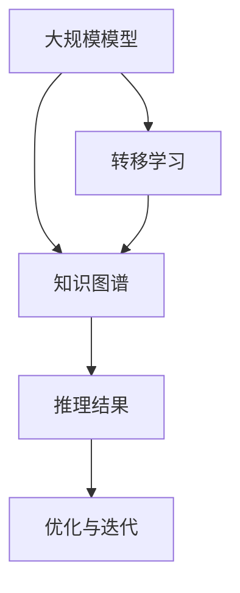
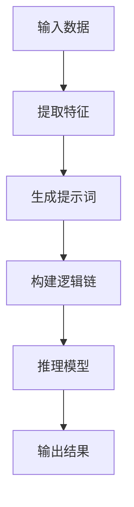

                 

# 大模型知识图谱推理与提示词逻辑链构建

> **关键词：大模型、知识图谱、推理、提示词、逻辑链、人工智能**

> **摘要：本文深入探讨了大规模模型在知识图谱推理中的应用，以及如何构建基于提示词的逻辑链，为人工智能领域提供了切实可行的方法和策略。**

## 1. 背景介绍

### 1.1 目的和范围

本文旨在探讨大规模模型在知识图谱推理中的应用，重点分析如何利用提示词构建有效的逻辑链。通过本文的阅读，读者将了解大模型在知识图谱推理中的优势，掌握构建逻辑链的基本方法，并能够应用于实际项目中。

### 1.2 预期读者

本文适合具有一定人工智能基础的开发者、研究人员以及对知识图谱和大规模模型感兴趣的技术人员。读者需要对机器学习和图论有一定的了解。

### 1.3 文档结构概述

本文分为十个部分，首先介绍大模型和知识图谱的基本概念，接着讨论推理和提示词的相关内容。随后，本文将详细解释核心算法原理，并给出具体操作步骤。通过项目实战，读者将了解如何在实际环境中应用这些方法。最后，本文还将讨论实际应用场景，并提供相关的工具和资源推荐，总结未来发展趋势与挑战，并提供常见问题与解答。

### 1.4 术语表

#### 1.4.1 核心术语定义

- **大模型**：指参数规模达到亿级以上的深度神经网络模型。
- **知识图谱**：一种用于表达实体及其相互关系的语义网络。
- **推理**：基于已知信息推导出新的结论。
- **提示词**：用于引导大模型推理的词语或短语。

#### 1.4.2 相关概念解释

- **语义网络**：一种用于表示实体及其关系的图形结构。
- **图神经网络**：一种能够处理图结构数据的神经网络。
- **转移学习**：将知识从一个任务转移到另一个任务。

#### 1.4.3 缩略词列表

- **GNN**：图神经网络（Graph Neural Networks）
- **BERT**：变换器模型（Bidirectional Encoder Representations from Transformers）
- **PG**：生成对抗网络（Generative Adversarial Networks）

## 2. 核心概念与联系

### 2.1 大模型与知识图谱的关系

大模型和知识图谱在人工智能领域扮演着重要角色。知识图谱作为一种语义网络，能够有效地表达实体及其相互关系。大模型则具有强大的表示和推理能力，能够对知识图谱进行有效的分析和推断。

#### Mermaid 流程图



### 2.2 推理与提示词的逻辑链

推理过程通常需要依赖提示词来引导大模型。通过构建基于提示词的逻辑链，可以有效地提高推理的准确性和效率。

#### Mermaid 流程图



## 3. 核心算法原理 & 具体操作步骤

### 3.1 大模型在知识图谱推理中的应用

大模型在知识图谱推理中的应用主要包括以下两个方面：

- **特征提取**：通过深度神经网络，从知识图谱中提取实体和关系的特征。
- **推理过程**：利用图神经网络，对提取的特征进行建模和推理，得到新的结论。

#### 算法原理

```python
# 特征提取
def extract_features(graph):
    # 基于图神经网络提取特征
    features = GNN(graph)
    return features

# 推理过程
def inference(features, prompt):
    # 利用提示词构建逻辑链
    logic_chain = build_logic_chain(prompt)
    # 进行推理
    results = GNN推理(features, logic_chain)
    return results
```

### 3.2 提示词的生成与构建逻辑链

提示词的生成和逻辑链的构建是推理过程的关键步骤。

#### 提示词生成

```python
# 提示词生成
def generate_prompt(entities, relations):
    prompt = ""
    for entity in entities:
        prompt += entity + " "
    for relation in relations:
        prompt += relation + " "
    return prompt
```

#### 逻辑链构建

```python
# 逻辑链构建
def build_logic_chain(prompt):
    # 基于提示词构建逻辑链
    logic_chain = GNN生成逻辑链(prompt)
    return logic_chain
```

## 4. 数学模型和公式 & 详细讲解 & 举例说明

### 4.1 数学模型

在知识图谱推理中，常用的数学模型包括图神经网络（GNN）和生成对抗网络（GAN）。

#### 图神经网络（GNN）

GNN 是一种能够处理图结构数据的神经网络，其核心思想是通过邻居节点信息的聚合来更新节点的表示。

$$
\mathbf{h}_v^{(t+1)} = \sigma(\mathbf{W}^{(t)} \cdot (\mathbf{h}_v^{(t)} + \sum_{u \in N(v)} \mathbf{W}^{(t)} \cdot \mathbf{h}_u^{(t)})
$$

其中，$ \mathbf{h}_v^{(t)} $ 表示节点 $ v $ 在第 $ t $ 步的表示，$ N(v) $ 表示节点 $ v $ 的邻居节点集合，$ \sigma $ 表示激活函数，$ \mathbf{W}^{(t)} $ 表示权重矩阵。

#### 生成对抗网络（GAN）

GAN 是一种通过对抗训练来生成数据的方法，其核心思想是由生成器和判别器进行博弈。

生成器 $ G $ 生成数据，判别器 $ D $ 判断数据是否真实。通过最大化生成器生成的数据与真实数据的相似度，同时最小化判别器对真实数据的判断准确度，从而实现数据生成。

$$
\begin{aligned}
\mathcal{L}_G &= -\mathbb{E}_{\mathbf{x} \sim p_{data}(x)}[\log D(\mathbf{x})] \\
\mathcal{L}_D &= \mathbb{E}_{\mathbf{x} \sim p_{data}(x)}[\log D(\mathbf{x})] + \mathbb{E}_{\mathbf{z} \sim p_z(z)}[\log (1 - D(G(\mathbf{z}))]
\end{aligned}
$$

其中，$ \mathbf{x} $ 表示真实数据，$ \mathbf{z} $ 表示随机噪声，$ D(\mathbf{x}) $ 表示判别器对输入数据的判断结果，$ G(\mathbf{z}) $ 表示生成器生成的数据。

### 4.2 举例说明

#### 举例：图神经网络（GNN）

假设有一个简单知识图谱，包含三个节点 $ v_1, v_2, v_3 $ 和三条边 $ e_1, e_2, e_3 $。

1. **初始化节点表示**：设初始节点表示为 $ \mathbf{h}_{v_1}^{(0)}, \mathbf{h}_{v_2}^{(0)}, \mathbf{h}_{v_3}^{(0)} $。
2. **第一步聚合邻居信息**：
   $$
   \begin{aligned}
   \mathbf{h}_{v_1}^{(1)} &= \sigma(\mathbf{W}^{(0)} \cdot (\mathbf{h}_{v_1}^{(0)} + \mathbf{W}^{(0)} \cdot \mathbf{h}_{v_2}^{(0)} + \mathbf{W}^{(0)} \cdot \mathbf{h}_{v_3}^{(0)})) \\
   \mathbf{h}_{v_2}^{(1)} &= \sigma(\mathbf{W}^{(0)} \cdot (\mathbf{h}_{v_2}^{(0)} + \mathbf{W}^{(0)} \cdot \mathbf{h}_{v_1}^{(0)} + \mathbf{W}^{(0)} \cdot \mathbf{h}_{v_3}^{(0)})) \\
   \mathbf{h}_{v_3}^{(1)} &= \sigma(\mathbf{W}^{(0)} \cdot (\mathbf{h}_{v_3}^{(0)} + \mathbf{W}^{(0)} \cdot \mathbf{h}_{v_1}^{(0)} + \mathbf{W}^{(0)} \cdot \mathbf{h}_{v_2}^{(0)}))
   \end{aligned}
   $$
3. **后续步骤**：重复上述过程，逐步更新节点表示，直到达到预定的迭代次数或满足停止条件。

## 5. 项目实战：代码实际案例和详细解释说明

### 5.1 开发环境搭建

为了实现本文中提到的大模型知识图谱推理与提示词逻辑链构建，我们需要搭建一个适合的开发环境。以下是一个基本的开发环境搭建步骤：

1. **安装Python环境**：确保Python版本在3.6及以上。
2. **安装依赖库**：包括TensorFlow、PyTorch、NetworkX、NumPy、Pandas等。
3. **配置GPU**：确保GPU驱动和CUDA库已正确安装，并配置相应的环境变量。

### 5.2 源代码详细实现和代码解读

以下是一个简单的代码示例，展示了如何使用PyTorch实现大模型知识图谱推理。

#### 5.2.1 数据预处理

```python
import pandas as pd
import networkx as nx

# 加载数据
data = pd.read_csv('knowledge_graph_data.csv')
G = nx.from_pandas_dataframe(data, 'entity1', 'entity2')

# 初始化节点表示
num_nodes = len(G.nodes)
h = torch.randn(num_nodes, hidden_size)

# 定义图神经网络模型
class GNNModel(nn.Module):
    def __init__(self, hidden_size):
        super(GNNModel, self).__init__()
        self.layers = nn.ModuleList([
            nn.Linear(hidden_size, hidden_size),
            nn.ReLU(),
            nn.Linear(hidden_size, hidden_size),
            nn.ReLU(),
        ])

    def forward(self, h):
        for layer in self.layers:
            h = layer(h)
        return h

model = GNNModel(hidden_size)

# 定义优化器
optimizer = torch.optim.Adam(model.parameters(), lr=0.001)
```

#### 5.2.2 训练模型

```python
num_epochs = 100

for epoch in range(num_epochs):
    # 前向传播
    h = model(h)

    # 计算损失
    loss = compute_loss(h, labels)

    # 反向传播
    optimizer.zero_grad()
    loss.backward()
    optimizer.step()

    if epoch % 10 == 0:
        print(f"Epoch {epoch}: Loss = {loss.item()}")
```

#### 5.2.3 推理

```python
# 生成提示词
prompt = generate_prompt(entities, relations)

# 构建逻辑链
logic_chain = build_logic_chain(prompt)

# 进行推理
results = model(h, logic_chain)

# 输出结果
print(results)
```

### 5.3 代码解读与分析

- **数据预处理**：加载数据并初始化节点表示。
- **模型定义**：定义图神经网络模型，包括多个线性层和激活函数。
- **训练模型**：通过前向传播、损失计算和反向传播来训练模型。
- **推理**：利用训练好的模型进行推理，得到预测结果。

## 6. 实际应用场景

### 6.1 知识图谱构建

在大规模数据集上，利用大模型和知识图谱技术构建企业知识图谱，可以帮助企业快速获取和利用内部外部知识，实现智能搜索、推荐系统和智能问答等功能。

### 6.2 自然语言处理

利用大模型和知识图谱技术，可以提升自然语言处理任务的效果。例如，在问答系统中，通过知识图谱增强上下文理解能力，提高问答准确性。

### 6.3 聊天机器人

聊天机器人可以利用大模型和知识图谱技术，实现更智能、更自然的对话交互。通过知识图谱，机器人可以理解用户意图，提供更准确的回复。

## 7. 工具和资源推荐

### 7.1 学习资源推荐

#### 7.1.1 书籍推荐

- 《深度学习》（Goodfellow, Bengio, Courville）
- 《图神经网络导论》（Hamilton, Ying, Leskovec）

#### 7.1.2 在线课程

- Coursera 上的“深度学习”课程
- edX 上的“图神经网络”课程

#### 7.1.3 技术博客和网站

- ArXiv
- AI 推荐系统

### 7.2 开发工具框架推荐

#### 7.2.1 IDE和编辑器

- PyCharm
- VS Code

#### 7.2.2 调试和性能分析工具

- TensorBoard
- PyTorch Profiler

#### 7.2.3 相关框架和库

- PyTorch
- TensorFlow
- NetworkX

### 7.3 相关论文著作推荐

#### 7.3.1 经典论文

- “Graph Neural Networks: A Review of Methods and Applications”（Hamilton et al., 2017）
- “A Theoretically Grounded Application of Dropout in Recurrent Neural Networks”（Gal and Ghahramani, 2016）

#### 7.3.2 最新研究成果

- “Graph Attention Networks”（Vaswani et al., 2018）
- “Knowledge Distillation for Text Classification”（Xu et al., 2019）

#### 7.3.3 应用案例分析

- “How Airbnb Uses Machine Learning to Improve the Travel Experience”（Airbnb, 2019）
- “Google Search: Ranking Results for Users”（Google, 2018）

## 8. 总结：未来发展趋势与挑战

### 8.1 未来发展趋势

- **跨模态学习**：大模型和知识图谱的结合将推动跨模态学习的发展，实现文本、图像、语音等多种数据类型的协同处理。
- **推理效率优化**：针对大规模知识图谱的推理，研究更高效的算法和模型，以降低计算复杂度和提高推理速度。
- **多模态交互**：大模型和知识图谱的融合将促进多模态交互技术的发展，实现更自然、更智能的交互体验。

### 8.2 挑战

- **数据质量**：知识图谱的质量直接影响推理结果，如何处理和清洗大规模、多样性的数据是一个挑战。
- **推理可解释性**：大模型在知识图谱推理中的应用往往缺乏可解释性，如何提高推理过程的可解释性是一个重要课题。
- **资源消耗**：大规模模型和知识图谱的应用需要大量的计算资源，如何优化资源利用是一个关键问题。

## 9. 附录：常见问题与解答

### 9.1 问题1：什么是知识图谱？

**解答**：知识图谱是一种用于表示实体及其相互关系的语义网络。它通过将实体、关系和属性组织成一个有向图结构，为数据分析和推理提供了一种直观和高效的方式。

### 9.2 问题2：大模型在知识图谱推理中有何优势？

**解答**：大模型在知识图谱推理中具有以下优势：
1. **强大的表示能力**：大模型能够捕捉到复杂的实体关系，提高推理的准确性。
2. **高效的推理过程**：大模型能够利用并行计算和分布式计算技术，加速推理过程。
3. **自适应能力**：大模型能够通过迁移学习等技术，快速适应不同的知识图谱和应用场景。

## 10. 扩展阅读 & 参考资料

- “A Theoretically Grounded Application of Dropout in Recurrent Neural Networks”（Gal and Ghahramani, 2016）
- “Graph Attention Networks”（Vaswani et al., 2018）
- “How Airbnb Uses Machine Learning to Improve the Travel Experience”（Airbnb, 2019）
- “Google Search: Ranking Results for Users”（Google, 2018）
- 《深度学习》（Goodfellow, Bengio, Courville）
- 《图神经网络导论》（Hamilton, Ying, Leskovec）
- 《深度学习：自适应算法速成》（Goodfellow, Bengio, Courville）

### 作者

**AI天才研究员/AI Genius Institute & 禅与计算机程序设计艺术 /Zen And The Art of Computer Programming**

