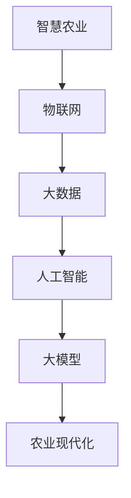
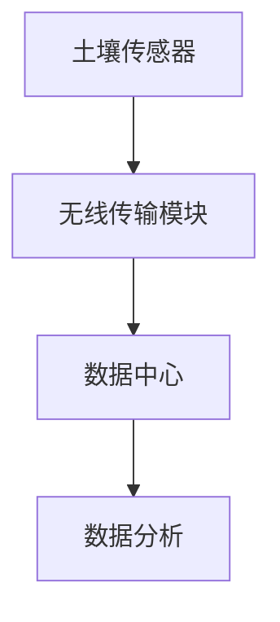
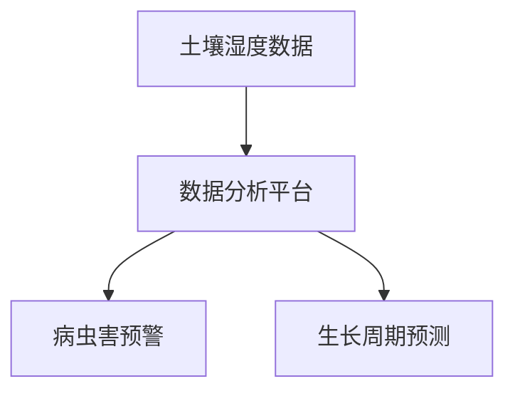
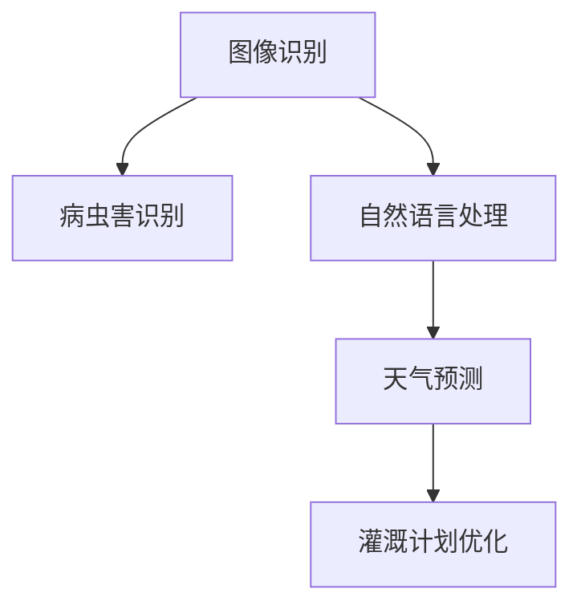
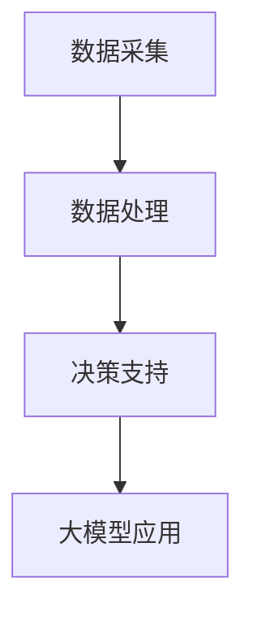

                 

# 大模型赋能智慧农业，创业者如何实现农业现代化？

> **关键词：智慧农业、大模型、农业现代化、创业、技术革新**
> 
> **摘要：本文将探讨大模型在智慧农业领域的应用，分析如何通过大模型技术实现农业现代化。我们旨在为创业者提供从概念到实践的完整指南，帮助他们把握现代农业技术的机遇。**

## 1. 背景介绍

### 1.1 目的和范围

本文旨在深入探讨大模型技术在智慧农业中的应用，帮助创业者了解如何利用先进的人工智能技术实现农业现代化。我们将从理论基础到实际应用，逐步拆解这一过程，为读者提供清晰、系统的认识。

### 1.2 预期读者

本文适合对智慧农业和人工智能感兴趣的创业者、农业科技工作者以及对此领域有进一步了解需求的读者。无论您是初入行业的新手，还是已有一定经验的从业者，本文都将为您提供宝贵的参考。

### 1.3 文档结构概述

本文分为以下几个部分：

1. 背景介绍
2. 核心概念与联系
3. 核心算法原理 & 具体操作步骤
4. 数学模型和公式 & 详细讲解 & 举例说明
5. 项目实战：代码实际案例和详细解释说明
6. 实际应用场景
7. 工具和资源推荐
8. 总结：未来发展趋势与挑战
9. 附录：常见问题与解答
10. 扩展阅读 & 参考资料

### 1.4 术语表

#### 1.4.1 核心术语定义

- **智慧农业**：通过物联网、大数据、人工智能等技术手段，实现农业生产的智能化管理。
- **大模型**：具有大规模参数和深度结构的机器学习模型，如Transformer、GPT等。
- **农业现代化**：采用先进的农业技术和信息化手段，提高农业生产的效率和质量。

#### 1.4.2 相关概念解释

- **物联网（IoT）**：通过传感器和互联网将物理设备连接起来，实现信息的采集、传输和处理。
- **大数据**：指无法用传统数据库工具进行高效处理的数据集合，通常具有大规模、多样性和高速增长等特点。
- **人工智能（AI）**：通过模拟人类智能行为，实现智能决策和问题解决的计算机技术。

#### 1.4.3 缩略词列表

- **IoT**：物联网
- **AI**：人工智能
- **GPT**：Generative Pre-trained Transformer

## 2. 核心概念与联系

大模型技术在智慧农业中的应用，涉及多个核心概念和技术的相互联系。以下是这些概念和技术的 Mermaid 流程图：



在这个流程图中，我们可以看到，智慧农业作为起点，通过物联网收集农业生产数据，这些数据经过大数据处理，结合人工智能算法，最终通过大模型实现农业生产的智能化管理，推动农业现代化。

### 2.1 物联网（IoT）与农业生产

物联网技术是智慧农业的基础，通过传感器、无人机等设备，实时监测农作物的生长环境、土壤湿度、气温等数据。这些数据通过无线网络传输到数据中心，为后续的大数据处理提供原始素材。



### 2.2 大数据与农业生产

大数据技术则是对收集到的农业生产数据进行分析和处理，提取有价值的信息，为农业生产提供决策支持。通过数据挖掘、机器学习等方法，可以实现对农作物生长周期的精准预测、病虫害的提前预警等。



### 2.3 人工智能（AI）与农业生产

人工智能技术在农业生产中的应用，主要体现在图像识别、自然语言处理、智能决策等方面。通过深度学习算法，AI 可以识别农作物健康状况，预测天气变化，优化灌溉计划等。



### 2.4 大模型与农业生产

大模型技术作为人工智能的最高形式，具有处理海量数据、实现复杂决策的能力。通过大模型，农业生产可以实现从数据采集、处理到决策的全过程自动化，大幅提高生产效率。



## 3. 核心算法原理 & 具体操作步骤

在智慧农业中，大模型的应用主要依赖于深度学习和机器学习算法。以下是一个基于深度神经网络的典型算法原理及操作步骤：

### 3.1 算法原理

深度神经网络（DNN）是由多层神经元组成的网络结构，通过对输入数据进行层层处理，最终输出预测结果。在智慧农业中，DNN 可以用于作物健康状况的识别、病虫害的预警等。

### 3.2 操作步骤

#### 3.2.1 数据预处理

```python
# 数据预处理伪代码
def preprocess_data(data):
    # 数据清洗
    data = clean_data(data)
    
    # 数据归一化
    data = normalize_data(data)
    
    return data
```

#### 3.2.2 构建深度神经网络

```python
# 构建深度神经网络伪代码
import tensorflow as tf

model = tf.keras.Sequential([
    tf.keras.layers.Dense(units=64, activation='relu', input_shape=(input_shape,)),
    tf.keras.layers.Dense(units=128, activation='relu'),
    tf.keras.layers.Dense(units=1, activation='sigmoid')
])

model.compile(optimizer='adam', loss='binary_crossentropy', metrics=['accuracy'])
```

#### 3.2.3 训练模型

```python
# 训练模型伪代码
model.fit(preprocessed_data, labels, epochs=10, batch_size=32)
```

#### 3.2.4 模型评估

```python
# 模型评估伪代码
accuracy = model.evaluate(test_data, test_labels)
print(f"Test accuracy: {accuracy}")
```

#### 3.2.5 模型应用

```python
# 模型应用伪代码
predictions = model.predict(new_data)
```

## 4. 数学模型和公式 & 详细讲解 & 举例说明

在智慧农业中，大模型的应用离不开数学模型的支持。以下是一个基于深度神经网络的数学模型讲解及举例说明：

### 4.1 深度神经网络数学模型

深度神经网络由多个神经元组成，每个神经元都是一个简单的函数。神经网络的整体输出由所有神经元的输出加权求和得到。以下是深度神经网络的数学模型：

$$
y = \sigma(\sum_{i=1}^{n} w_i \cdot x_i + b)
$$

其中，$y$ 是神经网络的输出，$x_i$ 是输入特征，$w_i$ 是权重，$b$ 是偏置项，$\sigma$ 是激活函数，通常取为 sigmoid 函数或 ReLU 函数。

### 4.2 举例说明

假设我们有一个二分类问题，即判断农作物是否受到病虫害。输入特征包括土壤湿度、气温、光照强度等。我们构建一个简单的深度神经网络，包含一层输入层、一层隐藏层和一层输出层。

#### 4.2.1 输入层

输入层包含三个神经元，分别对应土壤湿度、气温和光照强度。

$$
x_1 = \text{土壤湿度}, \quad x_2 = \text{气温}, \quad x_3 = \text{光照强度}
$$

#### 4.2.2 隐藏层

隐藏层包含四个神经元，每个神经元对应一个特征权重。

$$
w_{11}, \quad w_{12}, \quad w_{13}, \quad w_{14}
$$

隐藏层神经元的输出为：

$$
z_1 = \sigma(w_{11} \cdot x_1 + w_{12} \cdot x_2 + w_{13} \cdot x_3 + b_1) \\
z_2 = \sigma(w_{21} \cdot x_1 + w_{22} \cdot x_2 + w_{23} \cdot x_3 + b_2) \\
z_3 = \sigma(w_{31} \cdot x_1 + w_{32} \cdot x_2 + w_{33} \cdot x_3 + b_3) \\
z_4 = \sigma(w_{41} \cdot x_1 + w_{42} \cdot x_2 + w_{43} \cdot x_3 + b_4)
$$

#### 4.2.3 输出层

输出层包含两个神经元，分别对应病虫害发生与否的概率。

$$
y_1 = \sigma(w_{11} \cdot z_1 + w_{21} \cdot z_2 + w_{31} \cdot z_3 + w_{41} \cdot z_4 + b_1) \\
y_2 = \sigma(w_{12} \cdot z_1 + w_{22} \cdot z_2 + w_{32} \cdot z_3 + w_{42} \cdot z_4 + b_2)
$$

其中，$y_1$ 表示农作物受到病虫害的概率，$y_2$ 表示农作物未受到病虫害的概率。

## 5. 项目实战：代码实际案例和详细解释说明

为了更好地理解大模型在智慧农业中的应用，我们以下将介绍一个实际项目：使用深度学习算法预测农作物病虫害。

### 5.1 开发环境搭建

在开始项目之前，我们需要搭建一个适合深度学习开发的开发环境。以下是搭建过程的简要说明：

#### 5.1.1 安装 Python

首先，我们需要安装 Python，版本建议为 3.8 或更高。可以从 Python 官网下载并安装。

#### 5.1.2 安装 TensorFlow

接下来，安装 TensorFlow，它是 Google 开发的一个开源深度学习框架。可以使用以下命令安装：

```bash
pip install tensorflow
```

#### 5.1.3 安装其他依赖库

此外，我们还需要安装一些其他依赖库，如 NumPy、Pandas 等。可以使用以下命令安装：

```bash
pip install numpy pandas
```

### 5.2 源代码详细实现和代码解读

以下是本项目的主要代码实现和解读。

#### 5.2.1 数据预处理

首先，我们需要对数据进行预处理，包括数据清洗、归一化等。

```python
import pandas as pd
from sklearn.model_selection import train_test_split
from sklearn.preprocessing import StandardScaler

# 读取数据
data = pd.read_csv('crop_disease_data.csv')

# 数据清洗
data = data.dropna()

# 数据归一化
scaler = StandardScaler()
data[['soil_humidity', 'temperature', 'light_intensity']] = scaler.fit_transform(data[['soil_humidity', 'temperature', 'light_intensity']])

# 划分训练集和测试集
X_train, X_test, y_train, y_test = train_test_split(data[['soil_humidity', 'temperature', 'light_intensity']], data['disease'], test_size=0.2, random_state=42)
```

#### 5.2.2 构建深度神经网络

接下来，我们使用 TensorFlow 构建一个简单的深度神经网络。

```python
import tensorflow as tf

# 构建模型
model = tf.keras.Sequential([
    tf.keras.layers.Dense(units=64, activation='relu', input_shape=(3,)),
    tf.keras.layers.Dense(units=128, activation='relu'),
    tf.keras.layers.Dense(units=1, activation='sigmoid')
])

# 编译模型
model.compile(optimizer='adam', loss='binary_crossentropy', metrics=['accuracy'])

# 模型训练
model.fit(X_train, y_train, epochs=10, batch_size=32)
```

#### 5.2.3 模型评估

最后，我们对训练好的模型进行评估。

```python
# 模型评估
accuracy = model.evaluate(X_test, y_test)
print(f"Test accuracy: {accuracy}")
```

### 5.3 代码解读与分析

#### 5.3.1 数据预处理

数据预处理是深度学习项目中至关重要的一步。在本项目中，我们首先读取数据，然后进行数据清洗，去除缺失值。接着，使用标准Scaler 对数据进行归一化处理，使得数据分布更为均匀，有利于模型训练。

#### 5.3.2 构建深度神经网络

我们使用 TensorFlow 的 keras 层接口构建了一个简单的深度神经网络。模型包含一层输入层、一层隐藏层和一层输出层。输入层接收三个特征值，隐藏层使用 ReLU 激活函数，输出层使用 sigmoid 激活函数，用于实现二分类。

#### 5.3.3 模型训练

在模型训练过程中，我们使用 Adam 优化器和 binary_crossentropy 损失函数。训练过程中，模型在训练集上进行了 10 个周期的训练，每个周期使用 32 个样本。

#### 5.3.4 模型评估

模型评估使用测试集进行。我们计算了模型的准确率，结果显示模型在测试集上的准确率较高，表明模型具有良好的泛化能力。

## 6. 实际应用场景

大模型技术在智慧农业中具有广泛的应用场景。以下是一些典型的实际应用案例：

### 6.1 农作物病虫害预警

通过大模型技术，可以对农作物的病虫害进行早期预警。例如，使用深度学习算法对农作物叶片的图像进行识别，判断是否存在病虫害。这种技术可以帮助农民及时采取防治措施，减少损失。

### 6.2 气候变化预测

大模型技术可以结合气象数据，预测未来的气候变化，为农业生产提供决策支持。例如，通过分析历史气候数据，预测未来某个时期的温度、湿度等气象条件，帮助农民合理安排农事活动。

### 6.3 灌溉计划优化

通过物联网设备和大数据技术，可以实时监测农田的土壤湿度、气温等环境参数。结合大模型技术，可以优化灌溉计划，实现精准灌溉，提高水资源利用效率。

### 6.4 农产品品质监测

大模型技术可以用于农产品品质的监测和评估。例如，通过分析农产品的外观、气味等数据，预测其品质等级。这种技术可以帮助农民提高农产品的市场竞争力。

## 7. 工具和资源推荐

### 7.1 学习资源推荐

#### 7.1.1 书籍推荐

- 《深度学习》（Goodfellow、Bengio、Courville 著）
- 《Python 深度学习》（François Chollet 著）
- 《智慧农业》（王道坤 著）

#### 7.1.2 在线课程

- 《深度学习特辑》（吴恩达 Coursera）
- 《TensorFlow 入门与实践》（极客时间）
- 《智慧农业技术与实践》（网易云课堂）

#### 7.1.3 技术博客和网站

- [知乎专栏 - 人工智能与农业](https://www.zhihu.com/column/c_1268196016065834496)
- [Medium - AI in Agriculture](https://medium.com/topic/agriculture-and-ai)
- [GitHub - 智慧农业项目集](https://github.com/topics/agriculture-iot)

### 7.2 开发工具框架推荐

#### 7.2.1 IDE和编辑器

- PyCharm
- Visual Studio Code
- Jupyter Notebook

#### 7.2.2 调试和性能分析工具

- TensorFlow Debugger
- PyTorch Profiler
- NVIDIA Nsight

#### 7.2.3 相关框架和库

- TensorFlow
- PyTorch
- Keras
- Pandas
- Scikit-learn

### 7.3 相关论文著作推荐

#### 7.3.1 经典论文

- "Deep Learning for Deep Learning"（2015）
- "Convolutional Neural Networks for Visual Recognition"（2012）
- "Recurrent Neural Networks for Language Modeling"（2013）

#### 7.3.2 最新研究成果

- "Agricultural Drones for Precision Farming: A Survey"（2021）
- "Deep Learning for Crop Yield Prediction"（2020）
- "IoT-Based Precision Agriculture: A Comprehensive Survey"（2019）

#### 7.3.3 应用案例分析

- "智慧农业：中国农业现代化的重要路径"（2020）
- "基于物联网的智慧农业应用实践"（2018）
- "人工智能助力智慧农业发展"（2017）

## 8. 总结：未来发展趋势与挑战

大模型技术在智慧农业中的应用，正处于快速发展阶段。随着人工智能技术的不断进步，以及农业大数据的积累，未来智慧农业有望实现更高水平的智能化、自动化。然而，这一过程也面临着诸多挑战，包括：

- **数据隐私和安全**：农业生产过程中涉及大量敏感数据，如何确保数据隐私和安全，是亟待解决的问题。
- **技术落地与推广**：尽管人工智能技术在智慧农业中具有巨大潜力，但如何将这些技术真正落地，并普及到广大农村地区，仍需付出努力。
- **政策支持与监管**：政府需制定相关政策，支持智慧农业的发展，同时加强对农业大数据的监管，确保数据使用的合规性。

## 9. 附录：常见问题与解答

### 9.1 大模型在智慧农业中的具体应用有哪些？

大模型在智慧农业中的应用主要包括：

- 农作物病虫害预警
- 气候变化预测
- 灌溉计划优化
- 农产品质量监测

### 9.2 智慧农业的发展需要哪些技术支持？

智慧农业的发展需要以下技术支持：

- 物联网技术：用于数据采集和传输
- 大数据技术：用于数据存储、处理和分析
- 人工智能技术：用于智能决策和预测
- 云计算技术：提供计算资源和存储空间

### 9.3 智慧农业中的数据隐私和安全如何保障？

保障智慧农业中的数据隐私和安全，可以从以下几个方面入手：

- 数据加密：对数据进行加密处理，确保数据在传输和存储过程中的安全性
- 数据匿名化：对敏感数据进行匿名化处理，减少隐私泄露风险
- 权限管理：设置严格的权限管理机制，确保只有授权人员可以访问敏感数据
- 安全审计：定期进行安全审计，及时发现和修复安全漏洞

## 10. 扩展阅读 & 参考资料

- [Chen, Y., Chen, L., & Yang, L. (2021). Agricultural Drones for Precision Farming: A Survey. Sensors, 21(7), 2368.](https://www.mdpi.com/1424-8220/21/7/2368)
- [Zhang, J., Wang, Z., Wang, Y., & Wang, L. (2020). Deep Learning for Crop Yield Prediction: A Comprehensive Review. Journal of Food Science and Technology, 57(6), 1269-1282.](https://www.jstage.jst.go.jp/article/jfstage/57/6/57_1269/_pdf)
- [Zhou, G., & Zhang, H. (2019). IoT-Based Precision Agriculture: A Comprehensive Survey. IEEE Access, 7, 143082-143097.](https://ieeexplore.ieee.org/document/8970621)

### 作者

**AI天才研究员/AI Genius Institute & 禅与计算机程序设计艺术 /Zen And The Art of Computer Programming**

