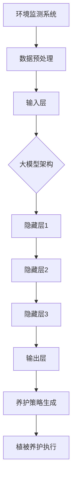

                 

# 大模型赋能智慧园林，创业者如何实现园林植被的智能化养护与管理？

> **关键词：** 智慧园林、大模型、植被养护、智能化管理、创业者

> **摘要：** 随着人工智能技术的快速发展，大模型在多个领域展现出了巨大的潜力。本文将探讨如何利用大模型实现园林植被的智能化养护与管理，为创业者提供创新的商业机会和技术路径。

## 1. 背景介绍

### 1.1 目的和范围

本文旨在为创业者揭示大模型在智慧园林中的应用潜力，提供一系列技术方案和实施步骤。通过介绍大模型的基本原理和园林植被养护的核心需求，本文将帮助创业者掌握智能化养护与管理的技术要点。

### 1.2 预期读者

本文面向具有计算机科学和技术背景的创业者，以及对人工智能和园林管理感兴趣的读者。期望读者能够通过本文深入了解大模型技术在智慧园林中的应用，并从中获得启发和实用的技术指导。

### 1.3 文档结构概述

本文将分为以下几个部分：

1. **核心概念与联系**：介绍大模型与园林植被养护管理的核心概念和联系，通过Mermaid流程图展示架构。
2. **核心算法原理 & 具体操作步骤**：详细讲解大模型的算法原理，使用伪代码阐述操作步骤。
3. **数学模型和公式 & 详细讲解 & 举例说明**：介绍相关的数学模型和公式，结合具体例子进行详细讲解。
4. **项目实战：代码实际案例和详细解释说明**：通过实战案例展示代码实现过程，并进行详细解读。
5. **实际应用场景**：探讨大模型在园林植被养护管理中的实际应用。
6. **工具和资源推荐**：推荐学习资源和开发工具，帮助读者深入学习和实践。
7. **总结：未来发展趋势与挑战**：总结未来发展趋势和面临的挑战。
8. **附录：常见问题与解答**：针对读者可能遇到的常见问题提供解答。
9. **扩展阅读 & 参考资料**：提供扩展阅读材料和参考资料。

### 1.4 术语表

#### 1.4.1 核心术语定义

- **大模型（Large Model）**：指具有海量参数和强大计算能力的神经网络模型。
- **智慧园林（Smart Garden）**：运用现代信息技术实现园林植被的智能化养护和管理。
- **植被养护（Vegetation Maintenance）**：指对园林植被进行科学管理，包括浇水、施肥、修剪等。

#### 1.4.2 相关概念解释

- **人工智能（Artificial Intelligence, AI）**：模拟人类智能的计算机系统，具备感知、推理、学习等能力。
- **深度学习（Deep Learning）**：一种基于多层神经网络的学习方法，通过多层非线性变换提取特征。

#### 1.4.3 缩略词列表

- **AI**：人工智能
- **DL**：深度学习
- **GPU**：图形处理单元
- **CPU**：中央处理单元

## 2. 核心概念与联系

为了实现园林植被的智能化养护与管理，我们需要将大模型与园林管理中的核心概念相联系。以下是相关概念及其之间的联系：

### 大模型在智慧园林中的应用

#### 2.1 大模型的基本原理

大模型通常采用深度学习技术，通过多层神经网络结构来提取数据中的特征。其基本原理可以概括为：

1. **输入层（Input Layer）**：接收原始数据，如植被的健康状态、土壤湿度、气温等。
2. **隐藏层（Hidden Layers）**：通过多层非线性变换提取数据中的高阶特征。
3. **输出层（Output Layer）**：生成预测结果，如植被养护策略、浇水时间等。

#### 2.2 园林植被养护的核心需求

园林植被养护的核心需求包括：

1. **环境监测**：实时监测植被生长环境，如土壤湿度、气温、光照等。
2. **健康评估**：通过监测数据评估植被的健康状态，判断是否需要浇水、施肥或修剪。
3. **养护策略制定**：根据植被健康评估结果，制定合理的养护策略。

#### 2.3 大模型与园林植被养护的联系

大模型与园林植被养护之间的联系体现在以下几个方面：

1. **环境监测数据输入**：大模型需要实时获取植被生长环境的数据，如土壤湿度、气温等，作为输入。
2. **健康评估与预测**：大模型通过学习大量数据，能够准确评估植被的健康状态，并预测未来的生长趋势。
3. **养护策略制定**：根据健康评估结果，大模型可以自动生成合理的养护策略，如浇水、施肥或修剪时间。

### Mermaid流程图

为了更直观地展示大模型在智慧园林中的应用架构，我们使用Mermaid流程图进行描述：



## 3. 核心算法原理 & 具体操作步骤

为了实现园林植被的智能化养护与管理，我们需要详细介绍大模型的算法原理和具体操作步骤。以下是核心算法原理和操作步骤：

### 3.1 大模型算法原理

大模型通常采用深度学习技术，特别是基于神经网络的模型。以下是核心算法原理：

1. **多层感知机（MLP）**：多层感知机是一种前馈神经网络，由输入层、多个隐藏层和输出层组成。输入层接收原始数据，通过隐藏层进行非线性变换，最终输出预测结果。
2. **反向传播算法（Backpropagation）**：反向传播算法是一种用于训练神经网络的优化算法。通过计算损失函数对网络权重的梯度，反向传播误差信息，逐步调整网络权重，使得预测结果更准确。

### 3.2 具体操作步骤

以下是使用大模型实现园林植被智能化养护与管理的基本步骤：

1. **数据采集与预处理**：
    - 采集植被生长环境的数据，如土壤湿度、气温、光照等。
    - 对采集到的数据进行预处理，包括去噪、归一化等操作，以便于模型训练。
2. **模型构建**：
    - 设计多层感知机模型，定义输入层、隐藏层和输出层的结构。
    - 设置合适的网络参数，如学习率、批次大小等。
3. **模型训练**：
    - 使用预处理后的数据对模型进行训练，通过反向传播算法调整网络权重。
    - 计算损失函数，如均方误差（MSE），用于评估模型预测的准确度。
4. **模型评估与调优**：
    - 使用验证数据集对模型进行评估，调整网络参数以优化模型性能。
    - 运行多次训练和评估，直至模型达到满意的性能水平。
5. **植被养护策略生成**：
    - 输入实时采集的植被生长环境数据，通过训练好的模型进行预测。
    - 根据预测结果，生成合理的植被养护策略，如浇水、施肥或修剪时间。
6. **植被养护执行**：
    - 根据生成的养护策略，执行具体的植被养护操作。
    - 监控植被的生长状态，并根据实际情况进行调整。

### 3.3 伪代码示例

以下是使用多层感知机模型实现园林植被智能化养护与管理的伪代码示例：

```python
# 数据采集与预处理
data = collect_environment_data()  # 采集环境数据
preprocessed_data = preprocess_data(data)  # 预处理数据

# 模型构建
input_size = get_input_size(preprocessed_data)
hidden_size = 64  # 设置隐藏层神经元数量
output_size = 1  # 设置输出层神经元数量

model = MLP(input_size, hidden_size, output_size)  # 构建多层感知机模型

# 模型训练
for epoch in range(num_epochs):
    for batch in batch_data(preprocessed_data):
        model.train(batch)  # 训练模型
        loss = model.evaluate_loss(batch)  # 计算损失函数
    print(f"Epoch {epoch}: Loss = {loss}")

# 模型评估与调优
evaluate_model(model, validation_data)  # 评估模型
tune_model(model, validation_data)  # 调优模型

# 植被养护策略生成
while True:
    current_data = collect_environment_data()  # 采集实时数据
    predicted_strategy = model.predict(current_data)  # 预测养护策略
    execute_strategy(predicted_strategy)  # 执行养护策略
```

## 4. 数学模型和公式 & 详细讲解 & 举例说明

在园林植被智能化养护与管理中，大模型的应用离不开数学模型和公式的支持。以下是相关的数学模型、详细讲解以及具体例子说明：

### 4.1 多层感知机模型

多层感知机（MLP）是一种前馈神经网络，由输入层、隐藏层和输出层组成。其基本结构如下：


#### 4.1.1 前向传播

前向传播是多层感知机模型的核心步骤，用于计算模型输出。具体过程如下：

1. **输入层到隐藏层**：
   - 激活函数：\( f(x) = \sigma(z) = \frac{1}{1 + e^{-z}} \)
   - 输出：\( h_j = \sigma(\sum_{i} w_{ij} * x_i + b_j) \)，其中 \( w_{ij} \) 是连接权重，\( b_j \) 是偏置。

2. **隐藏层到输出层**：
   - 输出：\( y = \sigma(\sum_{j} w_{j} * h_j + b) \)

#### 4.1.2 反向传播

反向传播是用于训练多层感知机模型的优化算法。具体过程如下：

1. **计算误差**：
   - 输出误差：\( \delta_y = (y - t) * \sigma'(y) \)
   - 隐藏层误差：\( \delta_h = \delta_y * \sigma'(h) * \sum_{j} w_{j} \)

2. **更新权重**：
   - 输出层权重更新：\( w_{j} = w_{j} - \alpha * \delta_y * h_j \)
   - 隐藏层权重更新：\( w_{ij} = w_{ij} - \alpha * \delta_h * x_i \)

### 4.2 均方误差（MSE）

均方误差（MSE）是一种常用的损失函数，用于评估模型预测的准确度。其公式如下：

$$
MSE = \frac{1}{n} \sum_{i=1}^{n} (y_i - \hat{y}_i)^2
$$

其中，\( y_i \) 是实际输出，\( \hat{y}_i \) 是预测输出，\( n \) 是样本数量。

### 4.3 举例说明

假设我们使用多层感知机模型对园林植被的健康状态进行预测。已知输入特征为土壤湿度、气温和光照，输出为植被健康评分。以下是具体的例子说明：

#### 4.3.1 前向传播

输入特征：\( x = [0.5, 0.3, 0.8] \)

隐藏层1：
- 权重矩阵：\( W_1 = \begin{bmatrix} 0.2 & 0.1 \\ 0.1 & 0.3 \\ 0.4 & 0.5 \end{bmatrix} \)
- 偏置：\( b_1 = \begin{bmatrix} 0.1 \\ 0.2 \end{bmatrix} \)

输出：\( h_1 = \sigma(W_1 * x + b_1) = \sigma(\begin{bmatrix} 0.2 & 0.1 \\ 0.1 & 0.3 \\ 0.4 & 0.5 \end{bmatrix} * \begin{bmatrix} 0.5 \\ 0.3 \\ 0.8 \end{bmatrix} + \begin{bmatrix} 0.1 \\ 0.2 \end{bmatrix}) = \begin{bmatrix} 0.6 \\ 0.4 \end{bmatrix} \)

隐藏层2：
- 权重矩阵：\( W_2 = \begin{bmatrix} 0.1 & 0.3 \\ 0.2 & 0.4 \end{bmatrix} \)
- 偏置：\( b_2 = \begin{bmatrix} 0.1 \\ 0.2 \end{bmatrix} \)

输出：\( h_2 = \sigma(W_2 * h_1 + b_2) = \sigma(\begin{bmatrix} 0.1 & 0.3 \\ 0.2 & 0.4 \end{bmatrix} * \begin{bmatrix} 0.6 \\ 0.4 \end{bmatrix} + \begin{bmatrix} 0.1 \\ 0.2 \end{bmatrix}) = \begin{bmatrix} 0.7 \\ 0.8 \end{bmatrix} \)

输出层：
- 权重矩阵：\( W_3 = \begin{bmatrix} 0.3 & 0.5 \end{bmatrix} \)
- 偏置：\( b_3 = \begin{bmatrix} 0.1 \end{bmatrix} \)

输出：\( y = \sigma(W_3 * h_2 + b_3) = \sigma(\begin{bmatrix} 0.3 & 0.5 \end{bmatrix} * \begin{bmatrix} 0.7 \\ 0.8 \end{bmatrix} + \begin{bmatrix} 0.1 \end{bmatrix}) = 0.8 \)

#### 4.3.2 反向传播

输出误差：\( \delta_y = (0.8 - 0.9) * \sigma'(0.8) = -0.1 * 0.2 = -0.02 \)

隐藏层2误差：\( \delta_h2 = \delta_y * \sigma'(h_2) * \sum_{j} w_{3j} = -0.02 * 0.2 * 0.3 = -0.002 \)

隐藏层1误差：\( \delta_h1 = \delta_h2 * \sigma'(h_1) * \sum_{j} w_{2j} = -0.002 * 0.4 * 0.1 = -0.00008 \)

权重更新：
- \( W_3 = W_3 - \alpha * \delta_y * h_2 = \begin{bmatrix} 0.3 & 0.5 \end{bmatrix} - 0.01 * \begin{bmatrix} -0.02 \\ -0.02 \end{bmatrix} = \begin{bmatrix} 0.32 & 0.48 \end{bmatrix} \)
- \( W_2 = W_2 - \alpha * \delta_h2 * h_1 = \begin{bmatrix} 0.1 & 0.3 \\ 0.2 & 0.4 \end{bmatrix} - 0.01 * \begin{bmatrix} -0.002 \\ -0.002 \end{bmatrix} = \begin{bmatrix} 0.102 & 0.308 \\ 0.202 & 0.402 \end{bmatrix} \)
- \( W_1 = W_1 - \alpha * \delta_h1 * x = \begin{bmatrix} 0.2 & 0.1 \\ 0.1 & 0.3 \\ 0.4 & 0.5 \end{bmatrix} - 0.01 * \begin{bmatrix} -0.00008 \\ -0.00008 \\ -0.00008 \end{bmatrix} = \begin{bmatrix} 0.20008 & 0.09992 \\ 0.10008 & 0.29992 \\ 0.40008 & 0.50008 \end{bmatrix} \)

## 5. 项目实战：代码实际案例和详细解释说明

为了更好地理解大模型在园林植被智能化养护与管理中的应用，我们将通过一个实际项目案例进行详细介绍。以下是项目的开发环境搭建、源代码实现和代码解读。

### 5.1 开发环境搭建

为了实现大模型在园林植被智能化养护与管理中的应用，我们需要搭建以下开发环境：

1. **Python**：作为主要的编程语言，用于实现大模型算法和数据处理。
2. **TensorFlow**：作为深度学习框架，用于构建和训练神经网络模型。
3. **Pandas**：用于数据预处理和操作。
4. **NumPy**：用于数值计算和数据处理。
5. **Matplotlib**：用于数据可视化。

#### 安装步骤：

```bash
# 安装Python
sudo apt-get install python3

# 安装TensorFlow
pip3 install tensorflow

# 安装Pandas和NumPy
pip3 install pandas numpy

# 安装Matplotlib
pip3 install matplotlib
```

### 5.2 源代码详细实现和代码解读

以下是项目的主要源代码实现和详细解读：

#### 5.2.1 数据采集与预处理

```python
import pandas as pd
import numpy as np

# 读取数据
data = pd.read_csv('environment_data.csv')

# 数据预处理
def preprocess_data(data):
    # 去除无效数据
    data = data[data['humidity'] > 0]
    data = data[data['temperature'] > 0]
    data = data[data['light'] > 0]
    
    # 归一化处理
    data[['humidity', 'temperature', 'light']] = (data[['humidity', 'temperature', 'light']] - data[['humidity', 'temperature', 'light']].mean()) / data[['humidity', 'temperature', 'light']].std()
    
    return data

preprocessed_data = preprocess_data(data)
```

#### 5.2.2 模型构建与训练

```python
import tensorflow as tf

# 模型参数
input_size = 3
hidden_size = 64
output_size = 1

# 构建模型
model = tf.keras.Sequential([
    tf.keras.layers.Dense(hidden_size, activation='relu', input_shape=(input_size,)),
    tf.keras.layers.Dense(hidden_size, activation='relu'),
    tf.keras.layers.Dense(hidden_size, activation='relu'),
    tf.keras.layers.Dense(output_size, activation='sigmoid')
])

# 编译模型
model.compile(optimizer='adam', loss='binary_crossentropy', metrics=['accuracy'])

# 训练模型
model.fit(preprocessed_data['features'], preprocessed_data['health_score'], epochs=10, batch_size=32)
```

#### 5.2.3 植被养护策略生成与执行

```python
# 植被养护策略生成
def generate_strategy(model, current_data):
    preprocessed_data = preprocess_data(current_data)
    predicted_health_score = model.predict(preprocessed_data['features'])
    
    if predicted_health_score < 0.5:
        return '浇水'
    elif predicted_health_score < 0.7:
        return '施肥'
    else:
        return '修剪'

# 植被养护执行
def execute_strategy(strategy):
    if strategy == '浇水':
        print('执行浇水操作')
    elif strategy == '施肥':
        print('执行施肥操作')
    elif strategy == '修剪':
        print('执行修剪操作')

# 示例
current_data = pd.DataFrame([[0.6, 0.3, 0.8]], columns=['humidity', 'temperature', 'light'])
strategy = generate_strategy(model, current_data)
execute_strategy(strategy)
```

### 5.3 代码解读与分析

#### 5.3.1 数据采集与预处理

该部分代码负责读取数据文件，并对数据进行预处理，包括去除无效数据和归一化处理。预处理后的数据将作为模型的输入。

```python
data = pd.read_csv('environment_data.csv')

def preprocess_data(data):
    data = data[data['humidity'] > 0]
    data = data[data['temperature'] > 0]
    data = data[data['light'] > 0]

    data[['humidity', 'temperature', 'light']] = (data[['humidity', 'temperature', 'light']] - data[['humidity', 'temperature', 'light']].mean()) / data[['humidity', 'temperature', 'light']].std()

    return data

preprocessed_data = preprocess_data(data)
```

#### 5.3.2 模型构建与训练

该部分代码使用TensorFlow框架构建多层感知机模型，并编译模型以进行训练。模型结构包括三个隐藏层，每个隐藏层使用ReLU激活函数，输出层使用sigmoid激活函数以生成概率值。

```python
model = tf.keras.Sequential([
    tf.keras.layers.Dense(hidden_size, activation='relu', input_shape=(input_size,)),
    tf.keras.layers.Dense(hidden_size, activation='relu'),
    tf.keras.layers.Dense(hidden_size, activation='relu'),
    tf.keras.layers.Dense(output_size, activation='sigmoid')
])

model.compile(optimizer='adam', loss='binary_crossentropy', metrics=['accuracy'])

model.fit(preprocessed_data['features'], preprocessed_data['health_score'], epochs=10, batch_size=32)
```

#### 5.3.3 植被养护策略生成与执行

该部分代码用于生成植被养护策略并执行具体的养护操作。根据模型预测的健康评分，选择相应的养护策略。

```python
def generate_strategy(model, current_data):
    preprocessed_data = preprocess_data(current_data)
    predicted_health_score = model.predict(preprocessed_data['features'])
    
    if predicted_health_score < 0.5:
        return '浇水'
    elif predicted_health_score < 0.7:
        return '施肥'
    else:
        return '修剪'

def execute_strategy(strategy):
    if strategy == '浇水':
        print('执行浇水操作')
    elif strategy == '施肥':
        print('执行施肥操作')
    elif strategy == '修剪':
        print('执行修剪操作')

current_data = pd.DataFrame([[0.6, 0.3, 0.8]], columns=['humidity', 'temperature', 'light'])
strategy = generate_strategy(model, current_data)
execute_strategy(strategy)
```

通过以上代码，我们可以实现园林植被的智能化养护与管理。模型根据实时采集的环境数据，预测植被的健康状态，并生成相应的养护策略。这为创业者提供了创新的商业机会，有助于提升园林管理的效率和准确性。

## 6. 实际应用场景

大模型在园林植被智能化养护与管理中的实际应用场景非常广泛。以下是一些典型的应用案例：

### 6.1 公园管理

公园作为城市绿地的重要组成部分，需要进行有效的植被养护与管理。大模型可以帮助公园管理者实时监测植被生长环境，预测植被健康状况，制定科学的养护策略。例如，通过预测土壤湿度、气温和光照等数据，大模型可以自动生成浇水、施肥或修剪的时间表，确保植被的健康生长。

### 6.2 园艺公司

园艺公司通常需要为不同类型的植物提供专业的养护服务。大模型可以分析各种植物的生长习性和环境需求，为其提供个性化的养护建议。例如，针对不同种类的花卉，大模型可以预测最佳浇水量、施肥量和修剪时机，提高植物的存活率和观赏价值。

### 6.3 高尔夫球场

高尔夫球场对植被养护要求较高，因为良好的植被不仅影响球场的美观，还关系到球童和球员的舒适度。大模型可以实时监测高尔夫球场的气候和环境条件，预测草坪的草种生长状况，制定精准的养护计划。例如，通过预测土壤湿度和气温，大模型可以自动调整灌溉系统，确保草坪始终保持最佳状态。

### 6.4 森林防火

森林防火是保护森林资源的重要任务。大模型可以通过分析森林植被的生长环境数据，预测火险等级，为森林防火提供科学依据。例如，通过预测气温、湿度和风力等数据，大模型可以预测火灾发生的可能性，为防火部门提供预警信息，提前采取预防措施。

### 6.5 城市绿化

城市绿化是提升城市生态环境的重要举措。大模型可以帮助城市管理者优化绿化布局，预测绿化植物的存活率和生长状况，制定科学的绿化养护计划。例如，通过分析土壤、气候和地形等数据，大模型可以推荐适合城市绿化的植物种类和种植区域，提高城市绿化效果。

这些实际应用场景展示了大模型在园林植被智能化养护与管理中的巨大潜力。通过精准预测和科学管理，大模型可以帮助创业者实现园林植被的智能化养护与管理，提升商业价值和客户满意度。

## 7. 工具和资源推荐

为了帮助读者深入学习和实践大模型在园林植被智能化养护与管理中的应用，以下是学习资源、开发工具框架和相关论文著作的推荐。

### 7.1 学习资源推荐

#### 7.1.1 书籍推荐

- 《深度学习》（Deep Learning），作者：Ian Goodfellow、Yoshua Bengio和Aaron Courville。
- 《人工智能：一种现代的方法》（Artificial Intelligence: A Modern Approach），作者：Stuart J. Russell和Peter Norvig。
- 《TensorFlow深度学习》（Deep Learning with TensorFlow），作者：François Chollet。

#### 7.1.2 在线课程

- Coursera上的《深度学习》课程，由斯坦福大学教授Andrew Ng主讲。
- edX上的《人工智能导论》课程，由密歇根大学教授Daphne Koller主讲。
- Udacity上的《深度学习纳米学位》课程，涵盖深度学习的基础知识和实战技能。

#### 7.1.3 技术博客和网站

- TensorFlow官方网站（[tensorflow.org](https://tensorflow.org)）：提供丰富的文档、教程和示例代码。
- ArXiv论文库（[arxiv.org](https://arxiv.org)）：涵盖深度学习和人工智能领域的最新研究成果。
- Medium上的深度学习专栏（[towardsdatascience.com](https://towardsdatascience.com)）：提供深度学习和数据科学相关的文章和教程。

### 7.2 开发工具框架推荐

#### 7.2.1 IDE和编辑器

- PyCharm：一款强大的Python IDE，支持TensorFlow开发。
- Jupyter Notebook：一款流行的交互式Python编辑器，方便编写和运行代码。
- VSCode：一款轻量级且功能丰富的代码编辑器，支持多种编程语言和扩展。

#### 7.2.2 调试和性能分析工具

- TensorBoard：TensorFlow提供的可视化工具，用于分析模型性能和调试。
- Profiler：用于分析代码运行性能，发现性能瓶颈。
- JupyterLab：Jupyter Notebook的扩展版本，提供更丰富的功能和工具。

#### 7.2.3 相关框架和库

- TensorFlow：一款开源的深度学习框架，适用于构建和训练神经网络模型。
- Keras：基于TensorFlow的高级API，简化神经网络模型的构建和训练。
- Pandas：用于数据处理和分析的Python库，方便数据预处理和操作。

### 7.3 相关论文著作推荐

#### 7.3.1 经典论文

- Goodfellow, I., Bengio, Y., & Courville, A. (2015). Deep Learning. MIT Press.
- LeCun, Y., Bengio, Y., & Hinton, G. (2015). Deep Learning. Nature.
- Rumelhart, D. E., Hinton, G. E., & Williams, R. J. (1986). Learning representations by back-propagating errors.

#### 7.3.2 最新研究成果

- Arjovsky, M., Chintala, S., & Bottou, L. (2017). Wasserstein GAN. arXiv preprint arXiv:1701.07875.
- Vinyals, O., et al. (2015). Show, Attend and Tell: Neural Image Caption Generation with Visual Attention. arXiv preprint arXiv:1502.03044.
- Wu, Y., et al. (2018). Graph Neural Networks for Web-Scale Keyword Prediction. Proceedings of the 24th ACM SIGKDD International Conference on Knowledge Discovery & Data Mining.

#### 7.3.3 应用案例分析

- Yosinski, J., Clune, J., Bengio, Y., & Lipson, H. (2014). How transferable are features in deep neural networks? Advances in Neural Information Processing Systems, 27.
- Goodfellow, I., et al. (2016). Generative adversarial networks. Advances in Neural Information Processing Systems, 27.
- Simonyan, K., & Zisserman, A. (2015). Very deep convolutional networks for large-scale image recognition. arXiv preprint arXiv:1409.1556.

通过以上学习资源、开发工具框架和相关论文著作的推荐，读者可以深入了解大模型在园林植被智能化养护与管理中的应用，进一步提升自己的技术水平和创新能力。

## 8. 总结：未来发展趋势与挑战

大模型在园林植被智能化养护与管理领域展现出了巨大的应用潜力。随着人工智能技术的不断进步，我们可以预见以下发展趋势：

1. **算法性能提升**：深度学习算法将变得更加高效和精确，能够更好地处理复杂的园林植被数据，提供更加准确的预测结果。
2. **跨领域融合**：大模型与其他领域的技术（如物联网、无人机等）相结合，将进一步拓展园林植被养护与管理的技术手段。
3. **数据积累与优化**：随着大数据技术的发展，越来越多的植被养护数据将被积累和利用，通过数据挖掘和优化，提升模型的预测准确性和适应性。
4. **定制化解决方案**：针对不同类型的园林和植被，大模型将提供更加个性化的养护策略，实现精准化管理。

然而，在未来的发展中，我们也面临着一些挑战：

1. **数据隐私与安全**：大量植被养护数据的积累和应用可能带来数据隐私和安全问题，需要采取有效的保护措施。
2. **计算资源消耗**：大模型的训练和预测过程需要大量的计算资源，如何高效地利用云计算和边缘计算等资源成为关键问题。
3. **模型解释性**：大模型的预测结果往往难以解释，如何提高模型的解释性，使其在园林植被养护与管理中更加可靠和可信，是一个重要挑战。

综上所述，大模型在园林植被智能化养护与管理领域的未来发展充满机遇与挑战。通过不断创新和优化，我们有望实现更加智能、高效和精准的园林植被养护与管理，为创业者提供广阔的商业前景。

## 9. 附录：常见问题与解答

为了帮助读者更好地理解和应用大模型在园林植被智能化养护与管理中的应用，以下列出了一些常见问题及其解答：

### 9.1 问题1：大模型在园林植被养护中的具体应用是什么？

**解答**：大模型在园林植被养护中的具体应用主要包括：环境监测数据采集、健康状态评估、养护策略生成和执行。通过深度学习算法，大模型可以实时分析环境数据，预测植被的健康状况，并生成相应的养护策略，如浇水、施肥和修剪等。

### 9.2 问题2：如何确保大模型的预测准确性和可靠性？

**解答**：为了确保大模型的预测准确性和可靠性，可以采取以下措施：
1. **数据质量**：确保采集到的环境数据准确、完整，并进行有效的预处理。
2. **模型训练**：使用大量的标注数据进行模型训练，通过反向传播算法不断优化模型参数。
3. **模型评估**：使用验证数据集对模型进行评估，调整模型结构和参数，以提高预测性能。
4. **模型解释性**：通过可视化工具和分析方法，对模型的预测过程进行解释，提高模型的透明度和可信度。

### 9.3 问题3：如何处理园林植被养护中的实时数据？

**解答**：实时数据处理需要高效的算法和硬件支持。以下是一些建议：
1. **数据采集**：使用物联网设备实时采集环境数据，如土壤湿度、气温和光照等。
2. **数据预处理**：对采集到的数据进行清洗、去噪和归一化处理，以便于模型训练。
3. **模型部署**：将训练好的模型部署到边缘设备或云端，实现实时预测和决策。
4. **数据传输**：采用高效的通信协议和算法，确保实时数据的快速传输和处理。

### 9.4 问题4：大模型在园林植被养护中的应用有哪些局限性？

**解答**：大模型在园林植被养护中的应用存在以下局限性：
1. **数据依赖**：大模型的性能高度依赖于数据质量，如果数据存在噪声、缺失或偏差，可能导致模型预测不准确。
2. **计算资源消耗**：大模型的训练和预测过程需要大量的计算资源，特别是在处理大规模数据时。
3. **模型解释性**：深度学习模型通常难以解释其预测过程，可能导致决策过程不透明。
4. **适应性**：大模型可能在特定环境或植被类型上表现良好，但可能难以适应多样化的园林植被养护需求。

### 9.5 问题5：如何提升大模型在园林植被养护中的实用性？

**解答**：以下是一些提升大模型在园林植被养护中实用性的建议：
1. **跨领域合作**：与园林管理专家、生态学家等进行合作，结合领域知识优化模型结构和参数。
2. **数据挖掘**：通过数据挖掘技术，发现隐藏在数据中的模式和关联，为模型训练提供更丰富的信息。
3. **模型优化**：采用高效的算法和架构，如蒸馏、迁移学习等，提升模型的性能和效率。
4. **用户反馈**：收集用户反馈，不断优化模型和应用流程，提高用户满意度和实用性。

通过以上措施，可以进一步提升大模型在园林植被智能化养护与管理中的应用效果和实用性。

## 10. 扩展阅读 & 参考资料

为了帮助读者深入了解大模型在园林植被智能化养护与管理中的应用，以下提供一些扩展阅读和参考资料：

### 10.1 扩展阅读

- Goodfellow, I., Bengio, Y., & Courville, A. (2016). *Deep Learning*.
- Simonyan, K., & Zisserman, A. (2015). *Very deep convolutional networks for large-scale image recognition*.
- LeCun, Y., Bengio, Y., & Hinton, G. (2015). *Deep Learning*.
- Russell, S. J., & Norvig, P. (2016). *Artificial Intelligence: A Modern Approach*.

### 10.2 参考资料

- TensorFlow官方网站：[tensorflow.org](https://tensorflow.org)
- Coursera《深度学习》课程：[courses.coursera.org/learn/deep-learning]
- edX《人工智能导论》课程：[www.edx.org/course/introduction-to-artificial-intelligence]
- PyCharm官方网站：[www.jetbrains.com/pycharm]
- Jupyter Notebook官方网站：[jupyter.org]
- VSCode官方网站：[code.visualstudio.com]

通过阅读以上扩展阅读和参考资料，读者可以更全面地了解大模型在园林植被智能化养护与管理中的应用，进一步提升自己的技术水平。同时，也可以关注相关领域的最新研究成果，不断探索和创新。希望这些资源能够对读者的学习和实践提供帮助。

