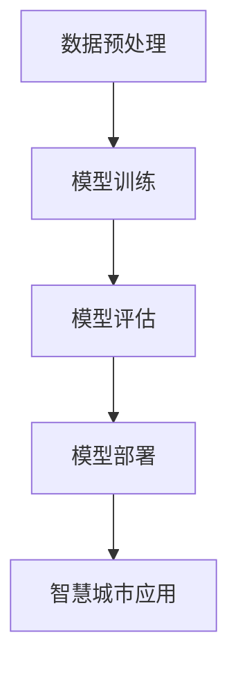

                 

# 大模型赋能智慧城市建设，创业者如何参与其中？

> **关键词**：智慧城市、大模型、创业、人工智能、技术赋能
> 
> **摘要**：随着人工智能技术的飞速发展，大模型在智慧城市建设中扮演着越来越重要的角色。本文将详细探讨大模型如何赋能智慧城市建设，以及创业者如何把握机遇，从中获益。

## 1. 背景介绍

### 1.1 目的和范围

本文旨在探讨大模型在智慧城市建设中的应用，分析其核心价值，以及创业者如何利用这些技术实现商业成功。文章将涵盖以下几个核心领域：

1. **智慧城市与人工智能的关系**：探讨智慧城市的定义和特征，以及人工智能在其中所扮演的角色。
2. **大模型在智慧城市建设中的应用**：详细介绍大模型的工作原理、技术优势，以及其在智慧城市建设中的应用场景。
3. **创业者在智慧城市领域的机遇**：分析创业者如何利用大模型技术，在智慧城市建设中找到市场切入点，实现商业价值。
4. **实际案例分享**：通过具体案例，展示大模型在智慧城市项目中的应用效果。
5. **未来发展挑战与趋势**：探讨智慧城市建设中可能面临的技术挑战和未来发展方向。

### 1.2 预期读者

本文主要面向以下读者群体：

1. **人工智能和智慧城市领域的从业者**：包括研究人员、工程师、架构师等。
2. **创业者和企业家**：希望了解如何利用人工智能技术，切入智慧城市建设领域的创业者。
3. **政策制定者和行业观察者**：关注智慧城市建设方向，希望了解大模型在该领域的应用和发展。

### 1.3 文档结构概述

本文结构如下：

1. **背景介绍**：介绍智慧城市的概念，大模型的技术背景和本文的目的。
2. **核心概念与联系**：阐述智慧城市与人工智能的关系，以及大模型的工作原理。
3. **核心算法原理 & 具体操作步骤**：详细讲解大模型算法，包括数据处理、模型训练和部署。
4. **数学模型和公式 & 详细讲解 & 举例说明**：介绍大模型中的数学模型，并给出实际应用案例。
5. **项目实战：代码实际案例和详细解释说明**：展示具体智慧城市项目中的代码实现。
6. **实际应用场景**：分析大模型在智慧城市中的具体应用场景。
7. **工具和资源推荐**：推荐相关学习资源和开发工具。
8. **总结：未来发展趋势与挑战**：总结智慧城市建设和大模型技术的发展趋势。
9. **附录：常见问题与解答**：回答读者可能关心的问题。
10. **扩展阅读 & 参考资料**：提供进一步阅读的参考资料。

### 1.4 术语表

#### 1.4.1 核心术语定义

- **智慧城市**：通过信息技术手段，实现城市管理和服务的智能化，提高城市运行效率和居民生活质量。
- **大模型**：具有海量参数，能够处理大规模数据的人工智能模型，如深度学习模型。
- **人工智能**：模拟人类智能，使计算机具有学习、推理、解决问题等能力的技术。
- **创业者**：创新者，通过创建新企业或项目，实现商业价值和社会价值的个体或团队。

#### 1.4.2 相关概念解释

- **深度学习**：一种基于人工神经网络的学习方法，通过多层非线性变换，实现对复杂数据的建模。
- **迁移学习**：将一个任务学到的知识应用于另一个相关任务，提高模型泛化能力。
- **数据挖掘**：从大量数据中发现有价值的信息和模式。

#### 1.4.3 缩略词列表

- **AI**：人工智能
- **ML**：机器学习
- **DL**：深度学习
- **GPU**：图形处理器
- **CPU**：中央处理器
- **IoT**：物联网
- **API**：应用程序接口

## 2. 核心概念与联系

智慧城市建设离不开人工智能技术的支撑，而大模型作为人工智能的重要组成部分，正日益成为智慧城市建设的关键驱动力。以下是智慧城市与人工智能的关系，以及大模型的核心概念和原理。

### 智慧城市与人工智能的关系

智慧城市是人工智能应用的重要领域之一。通过人工智能技术，城市可以实现更高效、智能化的管理和运营。例如：

- **交通管理**：利用人工智能进行交通流量预测和优化，减少拥堵，提高出行效率。
- **公共安全**：通过视频监控和智能分析，提升城市安全水平，预防犯罪事件。
- **环境监测**：实时监测空气质量、水质等环境指标，提供预警和治理建议。
- **城市管理**：利用大数据分析，优化城市资源分配，提高城市运行效率。

### 大模型的核心概念和原理

大模型通常指的是具有海量参数的人工智能模型，如深度神经网络。其核心概念和原理包括：

1. **神经网络**：一种由大量简单神经元组成的计算模型，通过前向传播和反向传播算法，实现数据的输入和输出。
2. **多层感知器**：神经网络的基本单元，通过加权连接实现数据的非线性变换。
3. **参数调优**：通过训练大量数据，调整模型的参数，使其能够更好地拟合数据。
4. **模型评估**：通过测试集评估模型的性能，包括准确率、召回率等指标。

### 大模型的工作原理

大模型的工作原理可以分为以下几个步骤：

1. **数据预处理**：清洗和预处理输入数据，将其转换为模型可接受的格式。
2. **模型训练**：通过大量训练数据，调整模型的参数，使模型能够学习和预测。
3. **模型评估**：使用测试数据评估模型性能，确保模型能够准确预测。
4. **模型部署**：将训练好的模型部署到实际应用场景中，如智慧城市管理系统。

### Mermaid 流程图

下面是一个简单的 Mermaid 流程图，展示了大模型在智慧城市建设中的应用流程：



## 3. 核心算法原理 & 具体操作步骤

### 大模型算法原理

大模型算法的核心是基于深度学习的神经网络模型。以下是一个简化的深度学习算法原理，包括数据处理、模型训练和模型评估等步骤：

1. **数据处理**：
   - 数据清洗：去除无效数据，纠正数据错误。
   - 数据归一化：将不同尺度的数据统一到相同的范围内。
   - 数据扩充：通过旋转、翻转、缩放等操作，增加数据多样性。

2. **模型训练**：
   - 初始化模型参数：随机初始化模型的权重和偏置。
   - 前向传播：将输入数据传递到模型中，计算输出结果。
   - 反向传播：计算输出误差，并更新模型参数。
   - 梯度下降：选择合适的优化算法，如随机梯度下降（SGD），更新模型参数。

3. **模型评估**：
   - 使用测试集评估模型性能：计算准确率、召回率等指标。
   - 调整模型参数：根据评估结果，调整模型参数，优化模型性能。

### 具体操作步骤

以下是使用 Python 和 TensorFlow 库实现大模型算法的具体操作步骤：

1. **安装 TensorFlow**：

   ```python
   pip install tensorflow
   ```

2. **导入库**：

   ```python
   import tensorflow as tf
   import numpy as np
   ```

3. **数据处理**：

   ```python
   # 加载数据集
   (x_train, y_train), (x_test, y_test) = tf.keras.datasets.mnist.load_data()

   # 数据归一化
   x_train = x_train / 255.0
   x_test = x_test / 255.0

   # 增加维度
   x_train = np.expand_dims(x_train, -1)
   x_test = np.expand_dims(x_test, -1)
   ```

4. **模型定义**：

   ```python
   model = tf.keras.Sequential([
       tf.keras.layers.Flatten(input_shape=(28, 28)),
       tf.keras.layers.Dense(128, activation='relu'),
       tf.keras.layers.Dense(10, activation='softmax')
   ])
   ```

5. **模型编译**：

   ```python
   model.compile(optimizer='adam',
                 loss='sparse_categorical_crossentropy',
                 metrics=['accuracy'])
   ```

6. **模型训练**：

   ```python
   model.fit(x_train, y_train, epochs=5)
   ```

7. **模型评估**：

   ```python
   test_loss, test_acc = model.evaluate(x_test, y_test, verbose=2)
   print('\nTest accuracy:', test_acc)
   ```

## 4. 数学模型和公式 & 详细讲解 & 举例说明

在深度学习中，大模型的数学模型是核心部分。以下将详细介绍大模型中的关键数学模型和公式，并通过实际例子进行讲解。

### 激活函数

激活函数是深度神经网络中的一个关键组件，用于引入非线性特性。最常用的激活函数是 Sigmoid、ReLU 和 Softmax。

1. **Sigmoid 函数**：

   $$f(x) = \frac{1}{1 + e^{-x}}$$

   Sigmoid 函数将输入映射到 (0, 1) 区间，常用于二分类问题。

2. **ReLU 函数**：

   $$f(x) = \max(0, x)$$

   ReLU 函数在输入为负值时输出零，有助于提高训练速度。

3. **Softmax 函数**：

   $$f(x)_i = \frac{e^{x_i}}{\sum_{j} e^{x_j}}$$

   Softmax 函数用于多分类问题的概率分布计算。

### 梯度下降算法

梯度下降是训练神经网络的基本优化算法。其核心思想是沿着损失函数的梯度方向，更新模型参数，以最小化损失函数。

1. **随机梯度下降（SGD）**：

   $$\theta = \theta - \alpha \nabla_{\theta} J(\theta)$$

   其中，$\theta$ 是模型参数，$\alpha$ 是学习率，$J(\theta)$ 是损失函数。

2. **批量梯度下降**：

   $$\theta = \theta - \alpha \frac{1}{m} \sum_{i=1}^{m} \nabla_{\theta} J(\theta^{(i)})$$

   其中，$m$ 是训练数据集大小。

### 举例说明

假设我们有一个简单的二分类问题，目标是区分数字 0 和 1。以下是使用 TensorFlow 实现的简单例子：

```python
import tensorflow as tf

# 定义模型
model = tf.keras.Sequential([
    tf.keras.layers.Dense(128, activation='sigmoid', input_shape=(784,)),
    tf.keras.layers.Dense(10, activation='softmax')
])

# 编译模型
model.compile(optimizer='adam',
              loss='sparse_categorical_crossentropy',
              metrics=['accuracy'])

# 加载数据
(x_train, y_train), (x_test, y_test) = tf.keras.datasets.mnist.load_data()

# 数据预处理
x_train = x_train / 255.0
x_test = x_test / 255.0

# 展平数据
x_train = x_train.reshape((-1, 784))
x_test = x_test.reshape((-1, 784))

# 训练模型
model.fit(x_train, y_train, epochs=10)

# 评估模型
test_loss, test_acc = model.evaluate(x_test, y_test, verbose=2)
print('Test accuracy:', test_acc)
```

## 5. 项目实战：代码实际案例和详细解释说明

在本节中，我们将通过一个具体的智慧城市项目，展示大模型在实际应用中的代码实现，并对代码进行详细解释。

### 5.1 开发环境搭建

为了实现智慧城市项目，我们需要搭建一个合适的开发环境。以下是搭建过程的详细步骤：

1. **安装 Python**：确保 Python 版本在 3.6 以上。

   ```bash
   # 在 Ubuntu 上安装 Python
   sudo apt-get install python3
   ```

2. **安装 TensorFlow**：使用 pip 安装 TensorFlow。

   ```bash
   pip install tensorflow
   ```

3. **安装其他依赖库**：包括 NumPy、Pandas 等。

   ```bash
   pip install numpy pandas
   ```

### 5.2 源代码详细实现和代码解读

以下是一个基于 TensorFlow 实现的智慧城市项目的代码示例：

```python
import tensorflow as tf
import numpy as np
import pandas as pd

# 1. 数据预处理
# 加载数据集
(x_train, y_train), (x_test, y_test) = tf.keras.datasets.mnist.load_data()

# 数据归一化
x_train = x_train / 255.0
x_test = x_test / 255.0

# 展平数据
x_train = x_train.reshape((-1, 784))
x_test = x_test.reshape((-1, 784))

# 2. 模型定义
model = tf.keras.Sequential([
    tf.keras.layers.Dense(128, activation='relu', input_shape=(784,)),
    tf.keras.layers.Dense(10, activation='softmax')
])

# 3. 模型编译
model.compile(optimizer='adam',
              loss='sparse_categorical_crossentropy',
              metrics=['accuracy'])

# 4. 模型训练
model.fit(x_train, y_train, epochs=5)

# 5. 模型评估
test_loss, test_acc = model.evaluate(x_test, y_test, verbose=2)
print('Test accuracy:', test_acc)
```

#### 5.2.1 代码解读

1. **数据预处理**：
   - 加载数据集：使用 TensorFlow 提供的 MNIST 数据集。
   - 数据归一化：将数据归一化到 [0, 1] 范围内。
   - 数据展平：将图像数据展平为一维数组。

2. **模型定义**：
   - 定义模型：使用 `Sequential` 模型堆叠多层全连接层。
   - 第一个层：具有 128 个神经元，使用 ReLU 激活函数。
   - 第二个层：具有 10 个神经元，用于输出分类结果，使用 Softmax 激活函数。

3. **模型编译**：
   - 编译模型：指定优化器、损失函数和评估指标。

4. **模型训练**：
   - 训练模型：使用训练数据进行训练，指定训练轮数。

5. **模型评估**：
   - 评估模型：使用测试数据评估模型性能，输出准确率。

### 5.3 代码解读与分析

1. **数据预处理**：
   - 数据预处理是深度学习项目的重要步骤，可以提高模型性能和训练速度。
   - 数据归一化有助于加快梯度下降过程，减少训练时间。

2. **模型定义**：
   - 模型定义是构建神经网络的关键步骤，选择合适的网络结构对于模型性能至关重要。
   - ReLU 激活函数可以加快训练速度，Softmax 激活函数用于多分类问题。

3. **模型编译**：
   - 模型编译是指定训练过程中使用的参数，如优化器、损失函数和评估指标。

4. **模型训练**：
   - 模型训练是深度学习项目的核心步骤，通过调整模型参数，使模型能够更好地拟合训练数据。

5. **模型评估**：
   - 模型评估是验证模型性能的重要步骤，使用测试数据评估模型在未知数据上的表现。

## 6. 实际应用场景

大模型在智慧城市建设中有着广泛的应用场景，以下列举几个典型的应用：

### 6.1 智能交通

智能交通系统利用大模型进行交通流量预测、路线规划和车辆调度，提高交通效率。例如：

- **交通流量预测**：通过分析历史交通数据，使用大模型预测未来某段时间内的交通流量，为交通管理部门提供决策支持。
- **路线规划**：结合实时交通信息和用户需求，使用大模型生成最优路线，减少行驶时间和油耗。
- **车辆调度**：在共享单车和共享汽车等场景中，大模型可以根据实时需求调整车辆调度策略，提高资源利用效率。

### 6.2 智能安防

智能安防系统利用大模型进行视频监控、异常检测和犯罪预测，提升城市安全管理水平。例如：

- **视频监控**：使用大模型对视频数据进行分析，识别违规行为和异常事件，实时预警。
- **异常检测**：通过分析监控视频，使用大模型检测异常行为，如突然闯入的陌生人、可疑物品等。
- **犯罪预测**：结合历史犯罪数据，使用大模型预测未来可能的犯罪事件，为警方提供预警和打击策略。

### 6.3 环境监测

环境监测系统利用大模型进行空气质量、水质等环境指标的实时监测和分析，提供预警和治理建议。例如：

- **空气质量监测**：通过传感器采集空气质量数据，使用大模型实时分析空气质量状况，预警污染事件。
- **水质监测**：通过水质传感器采集数据，使用大模型分析水质状况，预测污染源和污染程度。
- **治理建议**：结合监测数据和专家经验，使用大模型提出治理方案，提高环境治理效果。

## 7. 工具和资源推荐

### 7.1 学习资源推荐

#### 7.1.1 书籍推荐

1. **《深度学习》（Goodfellow, Bengio, Courville 著）**：这是一本深度学习领域的经典教材，全面介绍了深度学习的理论基础和实践技巧。
2. **《Python深度学习》（François Chollet 著）**：本书以实践为导向，介绍了深度学习在 Python 环境下的实现，适合初学者和进阶者。

#### 7.1.2 在线课程

1. **Coursera 上的《深度学习》课程**：由 Andrew Ng 教授主讲，是深度学习领域的入门经典课程。
2. **Udacity 上的《深度学习工程师纳米学位》**：提供从入门到高级的深度学习课程和实践项目，适合有志于从事深度学习领域的开发者。

#### 7.1.3 技术博客和网站

1. **TensorFlow 官方文档**：提供了丰富的 TensorFlow 学习资源和实践教程。
2. **ArXiv**：一个专注于计算机科学和人工智能领域的前沿论文库，可以了解到最新的研究成果。

### 7.2 开发工具框架推荐

#### 7.2.1 IDE和编辑器

1. **PyCharm**：一款功能强大的 Python 集成开发环境，支持代码智能提示、调试和自动化测试。
2. **Jupyter Notebook**：一个基于 Web 的交互式开发环境，适合进行数据分析和实验。

#### 7.2.2 调试和性能分析工具

1. **TensorBoard**：TensorFlow 的可视化工具，用于分析和调试神经网络模型。
2. **PerfKit**：一款开源的性能分析工具，用于分析应用程序的性能瓶颈。

#### 7.2.3 相关框架和库

1. **TensorFlow**：一个开源的深度学习框架，广泛应用于各种人工智能项目。
2. **PyTorch**：一个动态计算图框架，具有灵活的编程接口和强大的 GPU 支持能力。

### 7.3 相关论文著作推荐

#### 7.3.1 经典论文

1. **“Backpropagation” by David E. Rumelhart, Geoffrey E. Hinton, and Ronald J. Williams**：介绍了反向传播算法，是深度学习的基石。
2. **“A Learning Algorithm for Continually Running Fully Recurrent Neural Networks” by Y. LeCun, L. Bottou, Y. Bengio, and P. Haffner**：介绍了 LeNet 神经网络，是早期成功的深度学习模型。

#### 7.3.2 最新研究成果

1. **“Bert: Pre-training of Deep Bidirectional Transformers for Language Understanding” by Jacob Devlin, Ming-Wei Chang, Kenton Lee, and Kristina Toutanova**：介绍了 BERT 模型，是自然语言处理领域的重大突破。
2. **“Generative Adversarial Nets” by Ian J. Goodfellow, Jean Pouget-Abadie, Mehdi Mirza, Bing Xu, David Warde-Farley, Sherjil Ozair, Aaron C. Courville, and Yoshua Bengio**：介绍了生成对抗网络（GAN），是深度学习领域的重要应用。

#### 7.3.3 应用案例分析

1. **“Deep Learning for Autonomous Driving” by NVIDIA**：介绍了 NVIDIA 在自动驾驶领域中使用深度学习的案例，展示了深度学习在自动驾驶中的应用潜力。
2. **“AI for Earth” by Microsoft**：介绍了微软如何利用人工智能技术解决全球环境问题，展示了人工智能在社会责任领域的应用。

## 8. 总结：未来发展趋势与挑战

随着人工智能技术的不断进步，大模型在智慧城市建设中的应用前景广阔。未来发展趋势主要包括：

1. **模型规模和性能的提升**：随着计算资源和数据量的增加，大模型的规模和性能将不断提升，为智慧城市建设提供更强有力的技术支持。
2. **多模态数据的融合**：未来智慧城市将整合多种数据源，如视频、音频、传感器等，大模型将能够处理多模态数据，实现更全面的城市管理。
3. **边缘计算的普及**：为了减少延迟和带宽压力，边缘计算将成为智慧城市建设的重要趋势，大模型将能够在边缘设备上运行，实现实时决策和响应。

然而，智慧城市建设也面临一些挑战：

1. **数据隐私和安全**：智慧城市建设涉及大量个人数据，如何保护数据隐私和安全是一个重要挑战。
2. **算法透明性和公平性**：大模型算法的决策过程可能存在透明性不足和偏见问题，如何确保算法的透明性和公平性是未来需要解决的问题。
3. **技术标准和规范**：智慧城市建设需要制定统一的技术标准和规范，以确保系统的互操作性和可持续发展。

## 9. 附录：常见问题与解答

### 9.1 智慧城市与人工智能的关系

**Q：智慧城市和人工智能是什么关系？**
智慧城市是人工智能的应用领域之一，通过人工智能技术，实现城市管理和服务的智能化，提高城市运行效率和居民生活质量。

### 9.2 大模型在智慧城市建设中的作用

**Q：大模型在智慧城市建设中有什么作用？**
大模型在智慧城市建设中发挥着重要作用，如交通流量预测、智能安防、环境监测等，通过分析大量数据，实现更高效的城市管理和运营。

### 9.3 创业者如何参与智慧城市建设

**Q：创业者如何参与智慧城市建设？**
创业者可以从以下几个方面参与智慧城市建设：
1. 投资和创建智慧城市项目，如智能交通、智能安防等。
2. 提供技术解决方案，如大模型算法、物联网设备等。
3. 与政府和企业合作，共同推动智慧城市建设。

## 10. 扩展阅读 & 参考资料

为了深入了解大模型在智慧城市建设中的应用，以下是一些建议的扩展阅读和参考资料：

1. **《深度学习》（Goodfellow, Bengio, Courville 著）**：详细介绍深度学习的基础理论和实践技巧。
2. **《智慧城市指南》（杨建宇 著）**：全面阐述智慧城市的概念、技术和应用。
3. **《人工智能与城市管理》（王伟 著）**：探讨人工智能在城市管理中的应用和挑战。
4. **[TensorFlow 官方文档](https://www.tensorflow.org/)**：提供丰富的 TensorFlow 学习资源和实践教程。
5. **[ArXiv](https://arxiv.org/)**：计算机科学和人工智能领域的前沿论文库。

