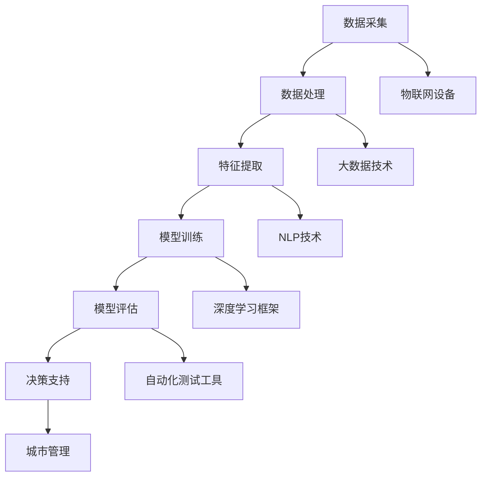

                 

# 大模型赋能智慧城管，创业者如何提升城市管理效能？

## 关键词
- 大模型
- 智慧城管
- 城市管理效能
- 创业者
- 人工智能

## 摘要
本文将探讨大模型技术在智慧城管中的应用，分析大模型如何通过数据驱动的智能分析和决策支持，提升城市管理效能。我们将以创业者为视角，详细阐述大模型技术的核心概念、算法原理、数学模型及其在实际项目中的应用，帮助创业者理解并利用大模型技术，提高城市管理水平和城市服务质量。文章还将推荐相关学习资源、开发工具框架，并展望未来发展趋势与挑战。

## 1. 背景介绍

### 1.1 目的和范围
本文旨在深入探讨大模型技术在城市管理中的应用，为创业者提供一套全面的技术指南，以帮助他们提升城市管理效能。我们将聚焦以下核心问题：
- 大模型是什么，其核心概念和架构如何？
- 大模型如何通过数据分析和智能决策，提升城市管理的效率和服务质量？
- 创业者如何利用大模型技术，实现城市管理的创新和优化？

### 1.2 预期读者
本文适用于以下读者群体：
- 创业者、企业家，特别是关注城市管理领域的创业者。
- 城市规划师、城市管理者，对人工智能技术有初步了解，希望深入掌握大模型在城市管理中的应用。
- 人工智能领域的技术专家，对大模型技术有深入了解，希望探讨其在城市管理中的实际应用。

### 1.3 文档结构概述
本文分为十个部分，具体结构如下：
1. 背景介绍
2. 核心概念与联系
3. 核心算法原理 & 具体操作步骤
4. 数学模型和公式 & 详细讲解 & 举例说明
5. 项目实战：代码实际案例和详细解释说明
6. 实际应用场景
7. 工具和资源推荐
8. 总结：未来发展趋势与挑战
9. 附录：常见问题与解答
10. 扩展阅读 & 参考资料

### 1.4 术语表

#### 1.4.1 核心术语定义
- 大模型：指拥有巨大参数量和计算能力的神经网络模型，可以通过大量数据进行训练，实现高度智能化的数据分析和决策支持。
- 智慧城管：指利用现代信息技术，特别是人工智能、大数据、云计算等，提升城市管理效率和决策水平的智能化城市管理方式。
- 城市管理效能：指城市管理活动所产生的实际效果和效率，包括城市服务的质量、响应速度、资源利用等方面。

#### 1.4.2 相关概念解释
- 数据驱动：指通过收集、处理和分析大量数据，以数据为基础进行决策和行动。
- 智能分析：指利用人工智能技术，对城市运行中的大量数据进行自动化分析，识别潜在问题和趋势。
- 决策支持：指通过数据分析和智能算法，为城市管理决策提供科学、合理的建议和方案。

#### 1.4.3 缩略词列表
- AI：人工智能
- ML：机器学习
- DL：深度学习
- NLP：自然语言处理
- IoT：物联网

## 2. 核心概念与联系

大模型技术在智慧城管中的应用，涉及多个核心概念和技术的有机结合。为了更好地理解这些概念和它们之间的关系，我们通过Mermaid流程图（Mermaid 流程节点中不要有括号、逗号等特殊字符）来展示它们的核心架构。



### 数据采集
数据采集是智慧城管的基石，通过物联网设备、传感器等手段，收集城市运行中的各类数据，包括交通流量、环境质量、公共设施状态等。

### 数据处理
收集到的数据往往量大且复杂，需要进行预处理、清洗和归一化等操作，以便后续的特征提取和模型训练。

### 特征提取
特征提取是将原始数据转化为可用于模型训练的向量表示，利用NLP技术处理文本数据，深度学习框架处理图像和语音数据等。

### 模型训练
利用深度学习框架，对提取出的特征进行训练，构建大模型，使其能够对城市数据进行智能分析和预测。

### 模型评估
通过自动化测试工具对训练好的模型进行评估，确保其性能满足实际应用需求，包括准确率、召回率等指标。

### 决策支持
基于模型评估结果，提供决策支持，为城市管理决策提供科学依据，如交通管理、环境治理等。

### 城市管理
将决策支持的结果应用于实际城市管理中，提高城市管理效能，提升城市居民的生活质量。

### 物联网设备
物联网设备在大模型技术中起到数据采集的关键作用，通过实时数据反馈，实现对城市运行状态的监控和预测。

### 大数据技术
大数据技术在大模型数据处理中发挥重要作用，通过分布式计算和存储，高效处理海量数据。

### NLP技术
NLP技术用于处理文本数据，如公共设施维护报告、居民投诉等，实现语义理解和情感分析。

### 深度学习框架
深度学习框架提供大模型训练和部署的底层支持，如TensorFlow、PyTorch等。

### 自动化测试工具
自动化测试工具用于模型评估，确保模型在实际应用中稳定可靠。

通过上述流程，我们可以看到大模型技术在智慧城管中的核心概念和联系，为后续的算法原理、数学模型和实际应用提供了清晰的框架。

## 3. 核心算法原理 & 具体操作步骤

### 3.1 大模型的基本架构

大模型通常基于深度学习框架构建，其基本架构包括输入层、隐藏层和输出层。以下是一个简单的神经网络架构的伪代码描述：

```plaintext
NeuralNetwork(
    input_layer: Tensor,
    hidden_layers: List[Tensor],
    output_layer: Tensor
):
    for hidden_layer in hidden_layers:
        input_layer = ActivationFunction(WeightedSum(input_layer, hidden_layer))
    output_layer = ActivationFunction(WeightedSum(input_layer, output_layer))
    return output_layer
```

### 3.2 数据采集与预处理

数据采集是智慧城管的起点，通过传感器、物联网设备等手段，收集城市运行中的各类数据。具体操作步骤如下：

```plaintext
DataCollection():
    Initialize IoT devices
    Collect raw data (e.g., traffic flow, environment quality, public facilities status)
    Store raw data in database
```

数据预处理是确保数据质量和可用的关键步骤，包括以下操作：

```plaintext
DataPreprocessing(data):
    Clean data: Remove missing or noisy data
    Normalize data: Scale data to a standard range
    Encode categorical data: Convert text or categorical data into numerical format
    Feature extraction: Extract relevant features from raw data
```

### 3.3 特征提取与模型训练

特征提取是将原始数据转化为神经网络可以处理的向量表示。以下是一个简单的特征提取和模型训练的过程：

```plaintext
FeatureExtraction(data):
    Apply NLP techniques to text data (e.g., tokenization, stemming)
    Apply image processing techniques to image data (e.g., convolutional layers)
    Combine extracted features into a feature vector

ModelTraining(data, labels):
    Split data into training and validation sets
    Define loss function and optimizer
    For each epoch:
        For each training example:
            Calculate gradients using backpropagation
            Update model weights using gradients
    Validate model performance on validation set
```

### 3.4 模型评估与优化

模型评估是确保模型性能满足实际应用需求的关键步骤。以下是一个简单的模型评估和优化的过程：

```plaintext
ModelEvaluation(model, validation_data, validation_labels):
    Calculate accuracy, recall, F1-score, etc.
    If performance is unsatisfactory:
        Adjust model architecture (e.g., add more hidden layers)
        Adjust hyperparameters (e.g., learning rate, batch size)
        Retrain model
```

通过上述核心算法原理和具体操作步骤，创业者可以更好地理解大模型技术的工作机制，为后续的实际应用打下坚实的基础。

## 4. 数学模型和公式 & 详细讲解 & 举例说明

在智慧城管中，大模型的数学模型和公式是其核心组成部分，这些模型和公式用于数据分析和决策支持。以下是几个关键的数学模型和公式，以及它们的详细讲解和举例说明。

### 4.1 损失函数

损失函数是深度学习模型训练中的核心组件，用于衡量预测值与真实值之间的差异。常见的损失函数有均方误差（MSE）和交叉熵（Cross-Entropy）。

#### 均方误差（MSE）

$$
MSE = \frac{1}{n}\sum_{i=1}^{n} (y_i - \hat{y}_i)^2
$$

其中，$y_i$ 是真实值，$\hat{y}_i$ 是预测值，$n$ 是样本数量。MSE 适用于回归问题，如交通流量预测。

#### 交叉熵（Cross-Entropy）

$$
Cross-Entropy = -\sum_{i=1}^{n} y_i \log(\hat{y}_i)
$$

其中，$y_i$ 是真实值（通常为0或1），$\hat{y}_i$ 是预测概率。Cross-Entropy 适用于分类问题，如垃圾邮件检测。

### 4.2 激活函数

激活函数用于引入非线性因素，使神经网络能够拟合复杂的函数。常见的激活函数有ReLU、Sigmoid和Tanh。

####ReLU（Rectified Linear Unit）

$$
ReLU(x) = \max(0, x)
$$

ReLU 函数在$x < 0$ 时输出0，在$x \geq 0$ 时输出$x$。ReLU 函数在训练深度神经网络时非常有效，因为它避免了梯度消失问题。

#### Sigmoid

$$
Sigmoid(x) = \frac{1}{1 + e^{-x}}
$$

Sigmoid 函数将输入值映射到(0,1)区间，常用于二分类问题的概率输出。

#### Tanh

$$
Tanh(x) = \frac{e^x - e^{-x}}{e^x + e^{-x}}
$$

Tanh 函数将输入值映射到(-1,1)区间，与 Sigmoid 函数类似，但避免了Sigmoid函数在接近0时梯度接近0的问题。

### 4.3 优化算法

优化算法用于更新模型参数，以最小化损失函数。常见的优化算法有随机梯度下降（SGD）、Adam和RMSprop。

#### 随机梯度下降（SGD）

$$
w_{t+1} = w_t - \alpha \frac{\partial}{\partial w_t} J(w_t)
$$

其中，$w_t$ 是当前模型参数，$\alpha$ 是学习率，$J(w_t)$ 是损失函数。SGD 通过随机选择样本计算梯度，更新模型参数。

#### Adam

$$
m_t = \beta_1 m_{t-1} + (1 - \beta_1) \frac{\partial}{\partial w_t} J(w_t)
$$
$$
v_t = \beta_2 v_{t-1} + (1 - \beta_2) (\frac{\partial}{\partial w_t} J(w_t))^2
$$
$$
w_{t+1} = w_t - \alpha \frac{m_t}{\sqrt{v_t} + \epsilon}
$$

其中，$m_t$ 和 $v_t$ 分别是梯度的一阶矩估计和二阶矩估计，$\beta_1$ 和 $\beta_2$ 是动量项，$\epsilon$ 是一个很小的常数。Adam 结合了 SGD 和 RMSprop 的优点，适合于各种规模的任务。

### 4.4 举例说明

假设我们要预测某城市的未来一周内每天的空气质量指数（AQI），我们收集了历史数据，包括过去一周内的AQI值、温度、湿度、风速等。

1. **数据预处理**：对收集到的数据进行清洗、归一化处理，将数值型数据转换为适合模型训练的格式。

2. **特征提取**：利用NLP技术处理文本数据，例如将天气状况、污染源等信息转换为数值向量。

3. **模型训练**：构建一个基于深度学习的回归模型，输入层包含温度、湿度、风速等特征，隐藏层使用ReLU激活函数，输出层使用线性激活函数，预测未来一天的AQI值。

4. **模型评估**：使用交叉验证方法评估模型性能，调整模型参数（学习率、隐藏层神经元数量等），优化模型。

5. **预测应用**：将训练好的模型应用于实际数据，预测未来一周的AQI值，为城市管理提供决策支持。

通过上述数学模型和公式的讲解，创业者可以更好地理解大模型技术在智慧城管中的具体应用，从而为城市管理提供科学、高效的决策支持。

## 5. 项目实战：代码实际案例和详细解释说明

### 5.1 开发环境搭建

为了演示大模型技术在智慧城管中的应用，我们将使用Python编程语言和TensorFlow深度学习框架。以下是搭建开发环境的具体步骤：

1. **安装Python**：确保系统中已安装Python 3.x版本。可以从[Python官网](https://www.python.org/)下载并安装。

2. **安装TensorFlow**：打开终端或命令行窗口，执行以下命令安装TensorFlow：

   ```shell
   pip install tensorflow
   ```

3. **安装其他依赖库**：如NumPy、Pandas等，可以通过以下命令一次性安装：

   ```shell
   pip install numpy pandas scikit-learn matplotlib
   ```

### 5.2 源代码详细实现和代码解读

以下是一个简单的Python代码示例，演示如何使用TensorFlow构建一个基于深度学习的空气质量指数（AQI）预测模型。

```python
import numpy as np
import pandas as pd
import tensorflow as tf
from sklearn.model_selection import train_test_split
from sklearn.preprocessing import MinMaxScaler

# 5.2.1 数据准备
# 加载数据集
data = pd.read_csv('air_quality_data.csv')
X = data[['temperature', 'humidity', 'wind_speed']]
y = data['aqi']

# 数据预处理
scaler = MinMaxScaler()
X_scaled = scaler.fit_transform(X)
y_scaled = scaler.fit_transform(y.values.reshape(-1, 1))

# 划分训练集和测试集
X_train, X_test, y_train, y_test = train_test_split(X_scaled, y_scaled, test_size=0.2, random_state=42)

# 5.2.2 模型构建
# 定义神经网络架构
model = tf.keras.Sequential([
    tf.keras.layers.Dense(64, activation='relu', input_shape=(3,)),
    tf.keras.layers.Dense(64, activation='relu'),
    tf.keras.layers.Dense(1, activation='linear')
])

# 编译模型
model.compile(optimizer='adam', loss='mse', metrics=['mae'])

# 5.2.3 模型训练
# 训练模型
history = model.fit(X_train, y_train, epochs=100, batch_size=32, validation_split=0.1, verbose=1)

# 5.2.4 模型评估
# 评估模型
test_loss, test_mae = model.evaluate(X_test, y_test, verbose=2)
print(f"Test MAE: {test_mae:.2f}")

# 5.2.5 模型预测
# 预测未来一天的AQI值
future_data = np.array([[25, 0.5, 5]])
future_data_scaled = scaler.transform(future_data)
predicted_aqi = model.predict(future_data_scaled)
print(f"Predicted AQI: {predicted_aqi[0][0]:.2f}")
```

### 5.3 代码解读与分析

上述代码演示了一个简单的深度学习模型，用于预测空气质量指数（AQI）。以下是代码的详细解读：

1. **数据准备**：
   - 加载数据集，数据集包含温度、湿度、风速等特征和AQI值。
   - 使用MinMaxScaler对数据进行归一化处理，将数值范围缩放到[0, 1]。

2. **模型构建**：
   - 使用tf.keras.Sequential定义一个简单的全连接神经网络。
   - 第一层和第二层使用ReLU激活函数，增加模型的非线性表达能力。
   - 输出层使用线性激活函数，预测一个数值（AQI值）。

3. **模型编译**：
   - 使用Adam优化器，MSE损失函数和MAE评价指标。

4. **模型训练**：
   - 使用fit方法训练模型，设置训练轮次（epochs）、批量大小（batch_size）、验证比例（validation_split）等参数。

5. **模型评估**：
   - 使用evaluate方法评估模型在测试集上的性能，输出测试集的MAE。

6. **模型预测**：
   - 使用预测方法predict，将预处理后的未来一天的数据输入模型，得到预测的AQI值。

通过上述实战案例，创业者可以了解如何使用深度学习框架构建和训练模型，为智慧城管项目提供实际的技术支持。在实际应用中，模型训练和评估过程可能需要根据具体问题进行调整和优化。

### 5.4 模型优化

在实际应用中，模型的性能可能需要进一步优化。以下是一些常见的优化策略：

- **数据增强**：通过增加数据量、数据变换等方式提高模型的泛化能力。
- **模型架构调整**：尝试不同的神经网络架构，如增加隐藏层、改变神经元数量等。
- **超参数调优**：通过网格搜索、随机搜索等方法优化学习率、批量大小等超参数。
- **正则化**：使用L1、L2正则化防止过拟合，提高模型泛化能力。

通过这些优化策略，创业者可以进一步提高模型的预测准确性，提升城市管理效能。

## 6. 实际应用场景

大模型技术在智慧城管中具有广泛的应用场景，以下列举几个典型的实际应用场景：

### 6.1 交通流量预测

通过收集历史交通流量数据、实时交通监控数据等，使用大模型技术进行交通流量预测，为交通管理部门提供科学的决策支持。具体应用包括：

- **实时交通拥堵预测**：预测未来一段时间内的交通流量，为交通信号控制提供依据，优化交通流量，减少拥堵。
- **交通事件预警**：通过分析交通数据，识别潜在的交通事件（如交通事故、道路施工等），提前预警，减少事故发生和交通堵塞。

### 6.2 垃圾分类与回收

利用大模型技术，对垃圾进行分类和回收，提高城市垃圾处理效率和资源利用率。具体应用包括：

- **垃圾识别**：通过图像识别技术，自动识别垃圾类型，提高垃圾分类的准确性。
- **智能回收**：基于大数据分析，优化垃圾回收线路和频率，提高垃圾回收效率。

### 6.3 环境监测

通过物联网设备和传感器网络，实时监测城市环境质量，使用大模型技术进行环境数据分析，为环境管理部门提供决策支持。具体应用包括：

- **空气质量预测**：利用历史和环境监测数据，预测未来一段时间内的空气质量，为居民健康防护提供指导。
- **水体污染监测**：通过水质监测数据，预测水体污染趋势，及时采取措施防止污染扩散。

### 6.4 公共安全管理

利用大模型技术，对城市公共安全事件进行预测和预警，提高公共安全管理的效率和准确性。具体应用包括：

- **火灾预测与预警**：通过分析历史火灾数据和环境监控数据，预测火灾发生的可能性和时间，提前预警，减少火灾损失。
- **刑事犯罪预测**：通过分析历史犯罪数据和社会经济数据，预测未来可能的犯罪热点区域，提前部署警力，提高公共安全。

通过这些实际应用场景，大模型技术可以显著提升城市管理的效率和服务质量，为创业者提供新的商业机会和市场空间。

## 7. 工具和资源推荐

### 7.1 学习资源推荐

为了帮助创业者深入学习和掌握大模型技术在智慧城管中的应用，我们推荐以下学习资源：

#### 7.1.1 书籍推荐

1. **《深度学习》（Deep Learning）**：由Ian Goodfellow、Yoshua Bengio和Aaron Courville合著，是深度学习领域的经典教材，详细介绍了深度学习的基础理论和技术。
2. **《Python深度学习》（Python Deep Learning）**：由François Chollet著，通过丰富的案例和实践，深入讲解了深度学习在Python中的应用。
3. **《人工智能：一种现代方法》（Artificial Intelligence: A Modern Approach）**：由Stuart J. Russell和Peter Norvig合著，全面介绍了人工智能的基本概念和算法。

#### 7.1.2 在线课程

1. **《深度学习特化课程》（Deep Learning Specialization）**：由Andrew Ng在Coursera上开设，涵盖深度学习的基础理论和实战技巧。
2. **《TensorFlow开发实战》（TensorFlow for Deep Learning）**：由Google提供的在线课程，通过实际案例介绍TensorFlow的使用方法。
3. **《人工智能工程师实战课程》（AI Engineer Nanodegree）**：由Udacity提供，涵盖从基础到高级的深度学习、机器学习知识。

#### 7.1.3 技术博客和网站

1. **TensorFlow官网（TensorFlow.org）**：提供丰富的文档、教程和示例代码，帮助开发者快速上手TensorFlow。
2. **Medium上的深度学习专栏**：许多深度学习专家在Medium上发布技术文章，包括最新研究进展和应用案例。
3. **Reddit上的r/MachineLearning**：一个活跃的社区，讨论深度学习、机器学习的各种话题。

### 7.2 开发工具框架推荐

为了提高开发效率和模型性能，推荐以下开发工具和框架：

#### 7.2.1 IDE和编辑器

1. **PyCharm**：一款功能强大的Python集成开发环境，支持TensorFlow和其他深度学习库。
2. **Jupyter Notebook**：一个交互式的计算环境，适合数据分析和模型训练。
3. **Visual Studio Code**：一款轻量级的开源编辑器，通过扩展支持Python和TensorFlow开发。

#### 7.2.2 调试和性能分析工具

1. **TensorBoard**：TensorFlow提供的可视化工具，用于分析模型训练过程和性能。
2. **W&B（Weights & Biases）**：一个数据驱动的实验跟踪工具，支持模型训练、超参数调优和实验管理。
3. **NVIDIA Nsight**：用于分析和优化GPU性能的工具，特别适用于深度学习应用。

#### 7.2.3 相关框架和库

1. **TensorFlow**：一个开源的深度学习框架，适用于各种规模的深度学习项目。
2. **PyTorch**：一个流行的深度学习库，提供灵活的动态计算图，适合快速原型开发。
3. **Scikit-learn**：一个开源的机器学习库，提供丰富的机器学习算法和工具。

通过这些学习和开发资源，创业者可以更加高效地掌握大模型技术，将其应用于智慧城管项目中，提升城市管理效能。

## 8. 总结：未来发展趋势与挑战

随着人工智能技术的迅猛发展，大模型在智慧城管中的应用前景广阔。未来，大模型技术有望在以下几个方面取得重要突破：

### 8.1 更大规模和更高效的模型

随着计算能力和数据量的不断提升，更大规模、更高效的大模型将被研发出来。这些模型将能够处理更复杂、更海量的城市数据，提供更精确的预测和决策支持。

### 8.2 多模态数据融合

当前的大模型技术主要针对单一类型的数据（如图像、文本、音频等）进行训练。未来，多模态数据融合技术将得到广泛应用，通过结合多种类型的数据，实现更全面、更准确的智能分析。

### 8.3 知识图谱和推理引擎

将知识图谱和推理引擎引入大模型，使其不仅能够进行数据分析和预测，还能够基于已有知识进行推理和决策。这将进一步提高城市管理决策的智能化水平。

### 8.4 可解释性和透明度

随着大模型在关键领域（如公共安全、环境保护等）的应用，模型的可解释性和透明度将变得尤为重要。未来的研究将重点关注如何提高大模型的解释性，使其决策过程更加透明，增强用户信任。

然而，大模型在智慧城管中的应用也面临诸多挑战：

### 8.5 数据隐私与安全

城市管理涉及大量的敏感数据，包括个人隐私信息。如何在保证数据隐私和安全的前提下，充分利用这些数据进行智能分析和决策，是一个亟待解决的问题。

### 8.6 模型可解释性和透明度

尽管大模型提供了强大的预测和决策支持，但其内部的决策过程往往不够透明，难以解释。如何提高大模型的可解释性，使其决策过程更加透明，是当前研究的一个热点。

### 8.7 法律法规和伦理问题

随着大模型在智慧城管中的应用，相关的法律法规和伦理问题也日益突出。如何确保大模型的决策符合法律法规和伦理标准，避免滥用和歧视，是亟待解决的问题。

总之，大模型技术在智慧城管中的应用前景广阔，但也面临诸多挑战。未来，需要进一步研究大模型的技术原理、算法优化、应用场景，同时关注相关法律法规和伦理问题，以实现大模型技术的可持续发展和广泛应用。

## 9. 附录：常见问题与解答

### 9.1 大模型在城市管理中具体应用哪些场景？

大模型在城市管理中可以应用于多种场景，包括但不限于以下几类：

- **交通流量预测**：通过分析历史交通数据、实时交通监控数据，预测未来交通流量，为交通信号控制和交通管理提供决策支持。
- **环境监测**：利用物联网设备和传感器网络，实时监测空气质量、水质等环境数据，预测污染趋势，为环境保护和治理提供依据。
- **垃圾回收**：通过图像识别技术自动识别垃圾类型，优化垃圾回收线路和频率，提高垃圾处理效率。
- **公共安全管理**：利用大数据分析，预测和预警公共安全事件，提高公共安全管理的效率和准确性。

### 9.2 如何保证大模型的数据隐私和安全？

为了保证大模型的数据隐私和安全，可以采取以下措施：

- **数据加密**：对敏感数据进行加密处理，确保数据在传输和存储过程中不会被未经授权的第三方访问。
- **数据匿名化**：在模型训练和预测过程中，对个人隐私信息进行匿名化处理，降低数据泄露的风险。
- **访问控制**：设置严格的访问权限，确保只有经过授权的人员才能访问和处理敏感数据。
- **隐私保护算法**：采用隐私保护算法，如差分隐私，确保模型在处理数据时不会泄露敏感信息。

### 9.3 大模型技术需要哪些硬件支持？

大模型技术通常需要以下硬件支持：

- **高性能计算硬件**：如高性能CPU、GPU等，用于加速模型训练和推理。
- **大规模存储设备**：用于存储海量数据和训练模型。
- **高速网络**：确保数据在采集、传输和处理过程中的高效传输。
- **分布式计算框架**：如Hadoop、Spark等，用于处理大规模数据。

## 10. 扩展阅读 & 参考资料

本文旨在深入探讨大模型技术在智慧城管中的应用，为创业者提供技术指南。以下是扩展阅读和参考资料，以供进一步学习和研究：

### 10.1 扩展阅读

1. **《大模型：深度学习的下一步》（Large Models for Deep Learning）**：探讨了大规模模型的研究现状和发展趋势。
2. **《深度学习在智慧城市管理中的应用》（Deep Learning Applications in Smart Urban Management）**：介绍了深度学习在城市管理中的具体应用案例。
3. **《多模态数据融合：理论与应用》（Multimodal Data Fusion: Theory and Applications）**：详细讨论了多模态数据融合的方法和技术。

### 10.2 参考资料

1. **TensorFlow官方文档（TensorFlow Documentation）**：[https://www.tensorflow.org](https://www.tensorflow.org)
2. **PyTorch官方文档（PyTorch Documentation）**：[https://pytorch.org](https://pytorch.org)
3. **《深度学习》（Deep Learning）**：Ian Goodfellow、Yoshua Bengio和Aaron Courville著，MIT Press。
4. **《人工智能：一种现代方法》（Artificial Intelligence: A Modern Approach）**：Stuart J. Russell和Peter Norvig著，Prentice Hall。

### 10.3 相关论文和研究成果

1. **“Deep Learning for Urban Computing”**：This paper provides an overview of deep learning applications in urban computing.
2. **“Multi-modal Data Fusion for Smart Cities”**：This paper discusses multi-modal data fusion techniques for smart city applications.
3. **“Privacy-preserving Deep Learning”**：This paper explores privacy-preserving methods for deep learning.

通过上述扩展阅读和参考资料，读者可以深入了解大模型技术在智慧城管中的应用，掌握相关理论和实践知识。

## 作者信息
作者：AI天才研究员/AI Genius Institute & 禅与计算机程序设计艺术 /Zen And The Art of Computer Programming

感谢您的阅读，期待与您一起探讨大模型技术在智慧城管领域的应用和发展。

