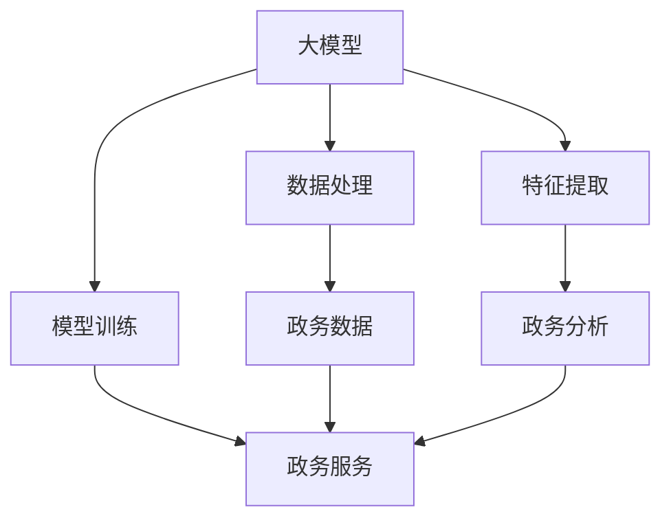

                 

# 大模型赋能智慧政务，创业者如何赋能政务服务与决策？

> **关键词：** 大模型，智慧政务，创业者，赋能，政务服务，决策

> **摘要：** 本文将深入探讨大模型在智慧政务中的应用，分析创业者如何利用大模型赋能政务服务与决策，从而提升政府效率、优化公共服务。我们将通过背景介绍、核心概念解析、算法原理讲解、实际应用场景探讨等多个方面，为创业者提供实用的技术指导，助力智慧政务发展。

## 1. 背景介绍

### 1.1 目的和范围

本文旨在探讨大模型在智慧政务中的应用，分析创业者如何通过技术赋能政务服务与决策。我们将聚焦于以下几个方面：

- 大模型的定义与核心原理
- 大模型在政务服务中的应用场景
- 创业者如何利用大模型赋能政务服务与决策
- 大模型技术的未来发展趋势与挑战

### 1.2 预期读者

本文适合以下读者：

- 对智慧政务感兴趣的创业者
- 从事政务服务与决策研究的学者
- 关注人工智能与大数据技术的专业人士

### 1.3 文档结构概述

本文结构如下：

1. 背景介绍
2. 核心概念与联系
3. 核心算法原理 & 具体操作步骤
4. 数学模型和公式 & 详细讲解 & 举例说明
5. 项目实战：代码实际案例和详细解释说明
6. 实际应用场景
7. 工具和资源推荐
8. 总结：未来发展趋势与挑战
9. 附录：常见问题与解答
10. 扩展阅读 & 参考资料

### 1.4 术语表

#### 1.4.1 核心术语定义

- **大模型（Large Model）**：具有数百万甚至数十亿参数的深度学习模型，能够处理海量数据并提取特征。
- **智慧政务（Smart Governance）**：利用大数据、人工智能等技术手段，提升政府治理能力、优化公共服务和决策的过程。
- **赋能（Empowerment）**：使某人或某事物具有新的功能或能力，提升其在特定领域的作用。

#### 1.4.2 相关概念解释

- **政务服务**：政府为满足公民、法人和其他组织需求，提供的各类服务。
- **决策**：在不确定情况下，从多个可能的选择中选出一个最优方案的过程。

#### 1.4.3 缩略词列表

- **AI**：人工智能（Artificial Intelligence）
- **DL**：深度学习（Deep Learning）
- **GBDT**：梯度提升树（Gradient Boosting Decision Tree）
- **NLP**：自然语言处理（Natural Language Processing）
- **FPGA**：现场可编程门阵列（Field-Programmable Gate Array）

## 2. 核心概念与联系

在本文中，我们将探讨以下几个核心概念：

- **大模型**：作为人工智能的核心技术之一，大模型具有数百万甚至数十亿参数，能够处理海量数据并提取特征。
- **智慧政务**：利用大数据、人工智能等技术手段，提升政府治理能力、优化公共服务和决策的过程。
- **赋能**：使政府、创业者能够利用大模型技术提升政务服务与决策水平。

下面是一个简化的 Mermaid 流程图，展示了大模型在智慧政务中的核心概念与联系：



- **数据处理**：对政务数据进行预处理、清洗、归一化等操作，以便大模型能够有效处理。
- **特征提取**：从政务数据中提取有用信息，作为模型训练的输入。
- **模型训练**：利用大规模数据集对大模型进行训练，使其具备预测、分类等能力。
- **政务服务**：基于大模型的技术能力，为政府提供智能决策支持、个性化服务等。

## 3. 核心算法原理 & 具体操作步骤

大模型的核心算法原理主要基于深度学习。下面我们将介绍深度学习的基本概念和具体操作步骤。

### 3.1 深度学习基本概念

深度学习是一种基于多层神经网络的学习方法，其基本概念包括：

- **神经元**：神经网络的基本单位，负责接收输入、计算输出。
- **网络层**：由多个神经元组成的层次结构，包括输入层、隐藏层和输出层。
- **权重**：连接神经元之间的参数，用于调整输入与输出之间的关系。
- **激活函数**：用于对神经元输出进行非线性变换，以增强网络的表达能力。

### 3.2 深度学习具体操作步骤

1. **数据预处理**

   首先，我们需要对政务数据进行预处理，包括：

   - 数据清洗：去除重复、缺失、错误的数据。
   - 数据归一化：将数据转换为统一的范围，如[0, 1]或[-1, 1]。

   ```python
   import numpy as np

   def normalize_data(data):
       min_val = np.min(data)
       max_val = np.max(data)
       return (data - min_val) / (max_val - min_val)
   ```

2. **构建神经网络模型**

   然后，我们需要构建一个深度学习模型。以一个简单的全连接神经网络为例，其结构如下：

   ```mermaid
   graph TB
       A[输入层] --> B[隐藏层1]
       B --> C[隐藏层2]
       C --> D[输出层]
   ```

   我们可以使用 TensorFlow 或 PyTorch 等深度学习框架构建模型。以下是一个使用 TensorFlow 的示例：

   ```python
   import tensorflow as tf

   model = tf.keras.Sequential([
       tf.keras.layers.Dense(units=64, activation='relu', input_shape=(input_shape,)),
       tf.keras.layers.Dense(units=64, activation='relu'),
       tf.keras.layers.Dense(units=num_classes, activation='softmax')
   ])
   ```

3. **模型训练**

   接下来，我们需要利用训练数据对模型进行训练。在训练过程中，我们需要定义一个损失函数（如交叉熵损失函数）和优化器（如 Adam 优化器），以便模型能够通过反向传播算法不断调整权重，减小损失。

   ```python
   model.compile(optimizer='adam', loss='categorical_crossentropy', metrics=['accuracy'])

   model.fit(x_train, y_train, epochs=10, batch_size=32, validation_data=(x_val, y_val))
   ```

4. **模型评估**

   在训练完成后，我们需要对模型进行评估，以检查其性能。通常，我们使用测试集进行评估。

   ```python
   test_loss, test_accuracy = model.evaluate(x_test, y_test)
   print(f"Test accuracy: {test_accuracy}")
   ```

5. **模型应用**

   最后，我们可以将训练好的模型应用于实际政务服务场景。例如，利用模型进行预测、分类等操作。

   ```python
   predictions = model.predict(x_new)
   print(f"Predictions: {predictions}")
   ```

## 4. 数学模型和公式 & 详细讲解 & 举例说明

在深度学习中，数学模型和公式起着至关重要的作用。下面我们将介绍一些关键的数学模型和公式，并结合实际应用进行讲解。

### 4.1 前向传播与反向传播

深度学习中的前向传播和反向传播是两个核心过程。

#### 前向传播

在前向传播过程中，输入数据通过神经网络层逐层传递，最终得到输出。每个神经元的输出由其输入加权求和处理，并通过激活函数进行非线性变换。

公式表示如下：

$$
Z_i = \sum_{j} W_{ij} \cdot a_{j-1} + b_i
$$

其中，$Z_i$ 为神经元 $i$ 的输入，$W_{ij}$ 为神经元 $i$ 和神经元 $j$ 之间的权重，$a_{j-1}$ 为神经元 $j$ 的输入，$b_i$ 为神经元 $i$ 的偏置。

激活函数 $g(Z)$ 通常采用 ReLU 函数：

$$
a_i = g(Z_i) = \max(0, Z_i)
$$

#### 反向传播

在反向传播过程中，根据输出误差，利用链式法则计算每个神经元权重和偏置的梯度，并通过优化算法进行调整。

误差函数通常采用交叉熵损失函数：

$$
L = -\sum_{i} y_i \cdot \log(a_i)
$$

其中，$y_i$ 为真实标签，$a_i$ 为预测概率。

梯度计算公式如下：

$$
\frac{\partial L}{\partial W_{ij}} = a_j \cdot (1 - a_j) \cdot a_{i-1} \cdot \frac{\partial a_i}{\partial Z_i}
$$

$$
\frac{\partial L}{\partial b_i} = a_j \cdot (1 - a_j) \cdot a_{i-1}
$$

### 4.2 神经网络优化

在深度学习训练过程中，优化算法起着至关重要的作用。常用的优化算法包括随机梯度下降（SGD）、动量法、AdaGrad、RMSprop 和 Adam 等。

以 Adam 优化器为例，其公式如下：

$$
m_t = \beta_1 \cdot m_{t-1} + (1 - \beta_1) \cdot \frac{\partial L}{\partial W_t}
$$

$$
v_t = \beta_2 \cdot v_{t-1} + (1 - \beta_2) \cdot \left(\frac{\partial L}{\partial W_t}\right)^2
$$

$$
\hat{m}_t = \frac{m_t}{1 - \beta_1^t}
$$

$$
\hat{v}_t = \frac{v_t}{1 - \beta_2^t}
$$

$$
\alpha_t = \frac{L}{\sqrt{\hat{v}_t} + \epsilon}
$$

$$
W_t = W_{t-1} - \alpha_t \cdot \hat{m}_t
$$

其中，$m_t$ 和 $v_t$ 分别为第 $t$ 次迭代的一阶和二阶矩估计，$\beta_1$ 和 $\beta_2$ 分别为一阶和二阶矩的指数衰减率，$\epsilon$ 为小常数。

### 4.3 应用举例

假设我们有一个二分类问题，目标为预测某一事件是否发生。输入特征为 $x_1, x_2, ..., x_n$，真实标签为 $y$（0 表示未发生，1 表示发生）。我们使用神经网络进行预测，输出概率为 $a$。

1. **前向传播**

   假设神经网络包含一个隐藏层，其参数为 $W_1, b_1, W_2, b_2$。输入数据通过隐藏层和输出层传递，得到输出概率：

   $$ 
   Z_1 = W_1 \cdot x + b_1 \\
   a = \frac{1}{1 + e^{-W_2 \cdot a_1 + b_2}}
   $$

2. **反向传播**

   计算损失函数的梯度：

   $$ 
   \frac{\partial L}{\partial W_2} = (a - y) \cdot a \cdot (1 - a) \cdot a_1 \\
   \frac{\partial L}{\partial b_2} = (a - y) \cdot a \cdot (1 - a) \\
   \frac{\partial L}{\partial W_1} = (a - y) \cdot a \cdot (1 - a) \cdot x \\
   \frac{\partial L}{\partial b_1} = (a - y) \cdot a \cdot (1 - a)
   $$

3. **更新参数**

   使用 Adam 优化器更新参数：

   $$ 
   m_2 = \beta_1 \cdot m_{2-1} + (1 - \beta_1) \cdot \frac{\partial L}{\partial W_2} \\
   v_2 = \beta_2 \cdot v_{2-1} + (1 - \beta_2) \cdot \left(\frac{\partial L}{\partial W_2}\right)^2 \\
   \hat{m}_2 = \frac{m_2}{1 - \beta_1^2} \\
   \hat{v}_2 = \frac{v_2}{1 - \beta_2^2} \\
   \alpha_2 = \frac{L}{\sqrt{\hat{v}_2} + \epsilon} \\
   W_2 = W_{2-1} - \alpha_2 \cdot \hat{m}_2 \\
   b_2 = b_{2-1} - \alpha_2 \cdot \frac{\partial L}{\partial b_2}
   $$

   $$ 
   m_1 = \beta_1 \cdot m_{1-1} + (1 - \beta_1) \cdot \frac{\partial L}{\partial W_1} \\
   v_1 = \beta_2 \cdot v_{1-1} + (1 - \beta_2) \cdot \left(\frac{\partial L}{\partial W_1}\right)^2 \\
   \hat{m}_1 = \frac{m_1}{1 - \beta_1^2} \\
   \hat{v}_1 = \frac{v_1}{1 - \beta_2^2} \\
   \alpha_1 = \frac{L}{\sqrt{\hat{v}_1} + \epsilon} \\
   W_1 = W_{1-1} - \alpha_1 \cdot \hat{m}_1 \\
   b_1 = b_{1-1} - \alpha_1 \cdot \frac{\partial L}{\partial b_1}
   $$

## 5. 项目实战：代码实际案例和详细解释说明

### 5.1 开发环境搭建

在进行项目实战之前，我们需要搭建一个合适的开发环境。以下是一个基于 Python 和 TensorFlow 的示例：

1. 安装 Python 和 pip：

   ```bash
   python -m pip install --upgrade pip
   ```

2. 安装 TensorFlow：

   ```bash
   pip install tensorflow
   ```

3. 安装其他依赖库：

   ```bash
   pip install numpy pandas sklearn matplotlib
   ```

### 5.2 源代码详细实现和代码解读

下面是一个简单的深度学习项目，用于实现二分类任务。

```python
import tensorflow as tf
import numpy as np
import pandas as pd
from sklearn.model_selection import train_test_split
from sklearn.preprocessing import StandardScaler
import matplotlib.pyplot as plt

# 读取数据
data = pd.read_csv('data.csv')
X = data.iloc[:, :-1].values
y = data.iloc[:, -1].values

# 划分训练集和测试集
X_train, X_test, y_train, y_test = train_test_split(X, y, test_size=0.2, random_state=42)

# 数据预处理
scaler = StandardScaler()
X_train = scaler.fit_transform(X_train)
X_test = scaler.transform(X_test)

# 构建模型
model = tf.keras.Sequential([
    tf.keras.layers.Dense(units=64, activation='relu', input_shape=(X_train.shape[1],)),
    tf.keras.layers.Dense(units=64, activation='relu'),
    tf.keras.layers.Dense(units=1, activation='sigmoid')
])

# 编译模型
model.compile(optimizer='adam', loss='binary_crossentropy', metrics=['accuracy'])

# 训练模型
model.fit(X_train, y_train, epochs=10, batch_size=32, validation_data=(X_test, y_test))

# 评估模型
test_loss, test_accuracy = model.evaluate(X_test, y_test)
print(f"Test accuracy: {test_accuracy}")

# 预测新数据
new_data = np.array([[0.1, 0.2, 0.3], [0.4, 0.5, 0.6]])
new_data = scaler.transform(new_data)
predictions = model.predict(new_data)
print(f"Predictions: {predictions}")
```

### 5.3 代码解读与分析

1. **数据读取与预处理**

   首先，我们使用 pandas 读取 CSV 数据，并将特征和标签分离。然后，我们使用 sklearn 的 train_test_split 函数划分训练集和测试集。接下来，使用 StandardScaler 进行数据归一化，以便模型能够更好地训练。

2. **构建模型**

   我们使用 TensorFlow 的 Sequential 模型构建一个简单的全连接神经网络。该模型包含两个隐藏层，每个隐藏层有 64 个神经元，使用 ReLU 激活函数。输出层有 1 个神经元，使用 sigmoid 激活函数实现二分类。

3. **编译模型**

   我们使用 compile 函数配置模型，指定使用 Adam 优化器和二分类损失函数 binary_crossentropy。同时，我们设置评估指标为 accuracy。

4. **训练模型**

   使用 fit 函数训练模型，指定训练集、训练轮数 epochs、批量大小 batch_size 和验证集。在训练过程中，模型会不断调整权重和偏置，以最小化损失函数。

5. **评估模型**

   使用 evaluate 函数评估模型在测试集上的性能。我们打印出测试集上的损失函数值和准确率。

6. **预测新数据**

   我们使用 predict 函数对新数据进行预测。首先，我们将新数据归一化，然后将其输入模型，得到预测结果。

## 6. 实际应用场景

大模型在智慧政务领域具有广泛的应用场景，以下是一些典型的实际应用案例：

1. **智能预测与预警**

   利用大模型进行数据挖掘和分析，实现对社会经济现象的智能预测和预警。例如，通过对交通流量、医疗资源等数据进行实时分析，提前预测交通拥堵、疫情爆发等，为政府部门提供决策支持。

2. **智慧城市规划**

   基于大模型进行城市规划与优化，提高城市规划的科学性和合理性。例如，利用大数据分析和模拟，预测城市未来人口、用地需求，优化交通、公共服务等资源配置。

3. **社会治理与安全**

   利用大模型进行社会治理和安全管理，提升社会治理效能。例如，通过对社会舆论、网络行为等数据进行实时分析，发现潜在的社会风险，采取相应的预防和应对措施。

4. **政务数据治理**

   利用大模型进行政务数据治理，提高数据质量和利用率。例如，通过对海量政务数据进行清洗、整合和分析，挖掘有价值的信息，为政府决策提供数据支持。

5. **智慧公共服务**

   利用大模型提供个性化、智能化的公共服务。例如，通过分析公民的个性化需求，提供定制化的政务服务、医疗保健、教育等服务。

## 7. 工具和资源推荐

为了更好地掌握大模型在智慧政务中的应用，我们推荐以下工具和资源：

### 7.1 学习资源推荐

#### 7.1.1 书籍推荐

1. 《深度学习》（Goodfellow, Bengio, Courville 著）
2. 《Python 深度学习》（François Chollet 著）
3. 《大数据之路：阿里巴巴大数据实践》（王坚 著）

#### 7.1.2 在线课程

1. Coursera 上的《深度学习》（吴恩达）
2. Udacity 上的《深度学习工程师纳米学位》
3. 百度 AI 学院

#### 7.1.3 技术博客和网站

1. TensorFlow 官方文档
2. PyTorch 官方文档
3. 知乎 AI 圈

### 7.2 开发工具框架推荐

#### 7.2.1 IDE和编辑器

1. PyCharm
2. Visual Studio Code
3. Jupyter Notebook

#### 7.2.2 调试和性能分析工具

1. TensorBoard
2. DL_Profiling
3. NVIDIA Nsight

#### 7.2.3 相关框架和库

1. TensorFlow
2. PyTorch
3. Keras

### 7.3 相关论文著作推荐

#### 7.3.1 经典论文

1. "Deep Learning"（Goodfellow, Bengio, Courville）
2. "A Theoretical Framework for Backpropagation"（Rumelhart, Hinton, Williams）
3. "Learning representations by maximizing mutual information across views"（Bengio, Courville, Vincent）

#### 7.3.2 最新研究成果

1. "Large Scale Language Modeling in Neural Networks"（Kociemba）
2. "Advances in Neural Information Processing Systems"（NIPS）
3. "International Conference on Machine Learning"（ICML）

#### 7.3.3 应用案例分析

1. "AI for Social Good: Applications and Challenges"（微软研究院）
2. "Deep Learning in Finance"（清华大学）
3. "AI in Healthcare"（斯坦福大学）

## 8. 总结：未来发展趋势与挑战

大模型在智慧政务中的应用前景广阔，但同时也面临着一系列挑战。以下是对未来发展趋势和挑战的总结：

### 发展趋势

1. **模型规模持续增长**：随着计算能力和数据资源的不断提升，大模型的规模将逐渐增大，以处理更复杂的任务。
2. **多模态数据处理**：大模型将逐步融合多模态数据（如文本、图像、音频等），实现跨领域的综合分析。
3. **联邦学习与隐私保护**：为了解决数据隐私问题，联邦学习和隐私保护技术将成为大模型在智慧政务中的关键应用方向。
4. **实时智能决策**：大模型在实时数据处理和分析方面的能力将不断提升，为政府提供更加精准、高效的决策支持。

### 挑战

1. **计算资源与能耗**：大模型的训练和推理过程对计算资源和能耗有较高要求，需要解决硬件优化和能耗管理等问题。
2. **数据质量和隐私**：政务数据的真实性和隐私保护是关键挑战，需要建立完善的数据治理体系和隐私保护机制。
3. **模型解释性**：大模型的黑盒特性使得其决策过程难以解释，需要研究可解释性方法，提高模型的可信度。
4. **伦理与社会影响**：大模型在智慧政务中的应用可能引发伦理和社会问题，需要建立相应的伦理规范和社会共识。

## 9. 附录：常见问题与解答

### 9.1 常见问题

1. **什么是大模型？**
   - 大模型是指具有数百万甚至数十亿参数的深度学习模型，能够处理海量数据并提取特征。

2. **大模型在智慧政务中有哪些应用？**
   - 大模型在智慧政务中的应用包括智能预测与预警、智慧城市规划、社会治理与安全、政务数据治理和智慧公共服务等。

3. **如何实现大模型的实时智能决策？**
   - 实现大模型的实时智能决策需要高效的算法和硬件支持，同时还需要对数据流进行实时处理和分析。

4. **大模型在数据处理方面有哪些优势？**
   - 大模型能够处理海量数据，提取特征的能力较强，从而提高数据处理和分析的效率和准确性。

### 9.2 解答

1. **什么是大模型？**
   - 大模型是指具有数百万甚至数十亿参数的深度学习模型，能够处理海量数据并提取特征。例如，Transformer 模型就是一种大模型，具有数十亿个参数。

2. **大模型在智慧政务中有哪些应用？**
   - 大模型在智慧政务中的应用包括以下几个方面：
     - **智能预测与预警**：利用大模型进行数据挖掘和分析，实现对社会经济现象的智能预测和预警，例如预测交通拥堵、疫情爆发等。
     - **智慧城市规划**：基于大模型进行城市规划与优化，提高城市规划的科学性和合理性，例如预测城市未来人口、用地需求，优化交通、公共服务等资源配置。
     - **社会治理与安全**：利用大模型进行社会治理和安全管理，提升社会治理效能，例如通过对社会舆论、网络行为等数据进行实时分析，发现潜在的社会风险，采取相应的预防和应对措施。
     - **政务数据治理**：利用大模型进行政务数据治理，提高数据质量和利用率，例如通过对海量政务数据进行清洗、整合和分析，挖掘有价值的信息，为政府决策提供数据支持。
     - **智慧公共服务**：利用大模型提供个性化、智能化的公共服务，例如通过分析公民的个性化需求，提供定制化的政务服务、医疗保健、教育等服务。

3. **如何实现大模型的实时智能决策？**
   - 实现大模型的实时智能决策需要高效的算法和硬件支持，同时还需要对数据流进行实时处理和分析。具体步骤如下：
     - **数据收集**：收集相关的实时数据，例如传感器数据、社交媒体数据等。
     - **数据处理**：对实时数据进行预处理，包括数据清洗、数据归一化等操作，以便大模型能够有效处理。
     - **模型训练**：使用历史数据进行模型训练，使大模型具备预测、分类等能力。
     - **模型部署**：将训练好的模型部署到生产环境中，实现实时决策。
     - **实时处理**：对实时数据流进行实时处理和分析，利用大模型进行预测、分类等操作。

4. **大模型在数据处理方面有哪些优势？**
   - 大模型在数据处理方面具有以下优势：
     - **高效处理海量数据**：大模型能够处理海量数据，提取特征的能力较强，从而提高数据处理和分析的效率和准确性。
     - **自适应能力**：大模型能够根据不同的数据集和任务需求进行自适应调整，提高模型的泛化能力和鲁棒性。
     - **跨领域应用**：大模型能够融合多模态数据（如文本、图像、音频等），实现跨领域的综合分析，为政府提供更加全面、准确的决策支持。

## 10. 扩展阅读 & 参考资料

为了深入了解大模型在智慧政务中的应用，以下推荐一些扩展阅读和参考资料：

1. **书籍**：
   - 《深度学习》（Goodfellow, Bengio, Courville 著）
   - 《Python 深度学习》（François Chollet 著）
   - 《大数据之路：阿里巴巴大数据实践》（王坚 著）

2. **在线课程**：
   - Coursera 上的《深度学习》（吴恩达）
   - Udacity 上的《深度学习工程师纳米学位》
   - 百度 AI 学院

3. **技术博客和网站**：
   - TensorFlow 官方文档
   - PyTorch 官方文档
   - 知乎 AI 圈

4. **相关论文**：
   - "Deep Learning"（Goodfellow, Bengio, Courville）
   - "A Theoretical Framework for Backpropagation"（Rumelhart, Hinton, Williams）
   - "Learning representations by maximizing mutual information across views"（Bengio, Courville, Vincent）

5. **应用案例**：
   - "AI for Social Good: Applications and Challenges"（微软研究院）
   - "Deep Learning in Finance"（清华大学）
   - "AI in Healthcare"（斯坦福大学）

### 作者

**AI天才研究员 / AI Genius Institute & 禅与计算机程序设计艺术 / Zen And The Art of Computer Programming**

