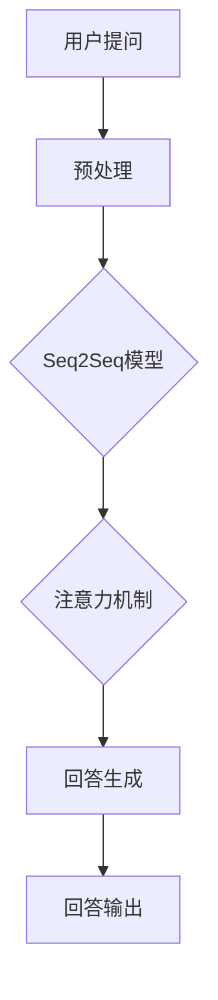
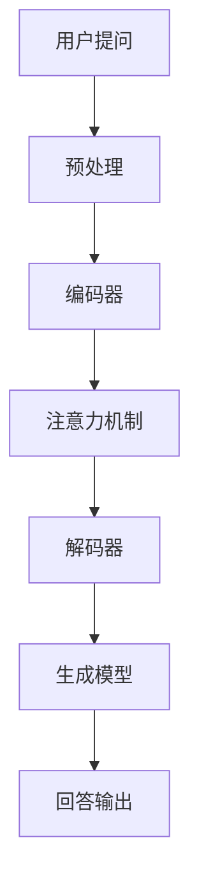

                 

### 大模型问答机器人如何完成任务

> **关键词：** 大模型、问答机器人、自然语言处理、任务完成、算法原理、实际应用

> **摘要：** 本文将深入探讨大模型问答机器人的工作原理和实现步骤。通过分析其背后的核心算法和数学模型，结合实际代码案例，我们将理解如何打造一个高效、准确且具备一定智能的问答系统。文章旨在为读者提供一个全面的指导，帮助其理解并实践这一前沿技术。

### 1. 背景介绍

#### 1.1 目的和范围

随着人工智能技术的发展，自然语言处理（NLP）成为了研究的热点之一。问答机器人作为一种常见的NLP应用，旨在理解用户的提问并给出准确、合理的回答。本文的目标是深入探讨大模型问答机器人如何完成任务，包括其核心算法、数学模型以及实际应用。

本文将涵盖以下内容：

1. **核心概念与联系**：介绍问答机器人的基本原理和架构。
2. **核心算法原理与操作步骤**：详细阐述问答机器人的算法实现。
3. **数学模型与公式**：讲解支持问答机器人的数学理论。
4. **项目实战**：通过实际代码案例展示问答机器人的实现。
5. **实际应用场景**：探讨问答机器人在不同领域的应用。
6. **工具和资源推荐**：推荐学习资源和开发工具。
7. **总结与未来发展趋势**：分析问答机器人的未来挑战和发展方向。

#### 1.2 预期读者

本文主要面向以下读者群体：

1. 对自然语言处理和人工智能感兴趣的技术人员。
2. 想要了解和实现问答机器人项目的开发者。
3. 正在研究或学习NLP领域的学者和学生。

#### 1.3 文档结构概述

本文结构如下：

1. **背景介绍**：介绍本文的目的和范围，预期读者及文档结构。
2. **核心概念与联系**：介绍问答机器人的基本原理和架构。
3. **核心算法原理与操作步骤**：详细阐述问答机器人的算法实现。
4. **数学模型与公式**：讲解支持问答机器人的数学理论。
5. **项目实战**：通过实际代码案例展示问答机器人的实现。
6. **实际应用场景**：探讨问答机器人在不同领域的应用。
7. **工具和资源推荐**：推荐学习资源和开发工具。
8. **总结与未来发展趋势**：分析问答机器人的未来挑战和发展方向。
9. **附录**：常见问题与解答。
10. **扩展阅读与参考资料**：提供进一步阅读和研究的资源。

#### 1.4 术语表

在本篇文章中，我们将使用以下术语：

#### 1.4.1 核心术语定义

- **问答机器人**：一种人工智能系统，能够理解用户的提问并给出相应的回答。
- **大模型**：指具有巨大参数规模和计算需求的神经网络模型。
- **自然语言处理（NLP）**：研究如何让计算机理解和处理自然语言的技术。
- **序列到序列模型（Seq2Seq）**：一种用于处理序列数据的神经网络模型，常用于机器翻译和问答系统。
- **注意力机制（Attention Mechanism）**：一种在序列处理中强调重要信息的方法，有助于提高模型的性能。

#### 1.4.2 相关概念解释

- **深度学习**：一种基于神经网络的人工智能方法，通过多层非线性变换来学习数据表示。
- **预训练**：在特定任务上进行训练之前，先在大量数据上进行无监督的预训练，以提高模型在特定任务上的表现。
- **知识图谱**：一种用于表示实体、关系和属性的图形结构，有助于问答系统理解复杂问题。

#### 1.4.3 缩略词列表

- **NLP**：自然语言处理
- **Seq2Seq**：序列到序列
- **GPU**：图形处理器
- **CUDA**：并行计算平台和编程语言

### 2. 核心概念与联系

在深入探讨大模型问答机器人的工作原理之前，我们需要理解几个核心概念和它们之间的联系。

#### 2.1 大模型

大模型是指具有大量参数和神经元的大规模神经网络模型。这些模型能够处理复杂的任务，如图像识别、自然语言处理和机器翻译。大模型通常需要大量的数据和计算资源进行训练和优化。

#### 2.2 自然语言处理

自然语言处理（NLP）是研究如何让计算机理解和处理自然语言的学科。NLP涵盖了从文本解析、语义理解到语言生成的一系列任务。在问答机器人中，NLP用于理解用户的提问，并将其转化为计算机可以处理的输入。

#### 2.3 序列到序列模型

序列到序列（Seq2Seq）模型是一种神经网络模型，用于将一个序列映射到另一个序列。在问答机器人中，Seq2Seq模型用于将用户的提问映射到回答。

#### 2.4 注意力机制

注意力机制是一种在序列处理中强调重要信息的方法。在问答机器人中，注意力机制用于强调用户提问中的关键部分，从而提高回答的准确性和相关性。

#### 2.5 知识图谱

知识图谱是一种用于表示实体、关系和属性的图形结构。在问答机器人中，知识图谱用于提供额外的上下文信息，帮助系统更好地理解问题。

#### 2.6 Mermaid 流程图

为了更好地展示核心概念和联系，我们可以使用Mermaid流程图来描述问答机器人的架构。以下是一个简单的Mermaid流程图示例：



这个流程图展示了问答机器人的基本工作流程：用户提问经过预处理后，由Seq2Seq模型和注意力机制进行处理，最终生成回答并输出。

### 3. 核心算法原理 & 具体操作步骤

在了解了问答机器人的核心概念和联系之后，我们将深入探讨其核心算法原理和具体操作步骤。

#### 3.1 序列到序列模型

序列到序列（Seq2Seq）模型是问答机器人中的关键组成部分。Seq2Seq模型的核心思想是将一个输入序列映射到一个输出序列。以下是一个简单的Seq2Seq模型的工作流程：

1. **编码器（Encoder）**：编码器接收用户的提问作为输入，将其编码为固定长度的向量表示。这个过程通常通过一系列的卷积神经网络（CNN）或循环神经网络（RNN）实现。
2. **解码器（Decoder）**：解码器接收编码器的输出作为输入，并逐步生成回答的文本序列。解码器通常也是一个RNN，它使用注意力机制来关注编码器输出的不同部分，从而生成更准确的回答。

以下是一个简单的伪代码示例，展示了Seq2Seq模型的基本操作：

```python
# 编码器
def encode(input_sequence):
    # 使用RNN或CNN对输入序列进行编码
    encoded_sequence = RNN(input_sequence)
    return encoded_sequence

# 解码器
def decode(encoded_sequence):
    # 使用RNN和注意力机制生成回答
    output_sequence = RNN_with_attention(encoded_sequence)
    return output_sequence
```

#### 3.2 注意力机制

注意力机制是Seq2Seq模型中的一个关键组件，它用于强调编码器输出中的关键部分，从而提高回答的准确性和相关性。注意力机制的基本思想是计算编码器输出和当前解码器状态之间的相似性，并根据相似性分配注意力权重。

以下是一个简单的伪代码示例，展示了注意力机制的基本操作：

```python
# 注意力机制
def attention Mechanism(encoded_sequence, decoder_state):
    # 计算编码器输出和当前解码器状态之间的相似性
    similarity_scores = similarity_function(encoded_sequence, decoder_state)
    
    # 对相似性分数进行归一化
    attention_weights = normalize_similarity_scores(similarity_scores)
    
    # 计算加权编码器输出
    weighted_encoded_sequence = weighted_sum(encoded_sequence, attention_weights)
    
    # 输出加权编码器输出
    return weighted_encoded_sequence
```

#### 3.3 回答生成

在注意力机制的基础上，解码器生成回答的文本序列。这个过程通常涉及循环神经网络（RNN）和生成式模型（如长短时记忆网络（LSTM）或门控循环单元（GRU））。

以下是一个简单的伪代码示例，展示了回答生成的过程：

```python
# 回答生成
def generate_response(input_sequence, decoder_state):
    # 使用RNN和注意力机制生成回答
    output_sequence = RNN_with_attention(input_sequence, decoder_state)
    
    # 使用生成式模型对回答进行优化
    optimized_output_sequence = generate_model(output_sequence)
    
    # 输出优化后的回答
    return optimized_output_sequence
```

#### 3.4 问答机器人的整体工作流程

综合以上算法原理，我们可以得出问答机器人的整体工作流程：

1. **预处理**：将用户的提问进行预处理，如分词、去停用词等。
2. **编码**：使用编码器将预处理后的提问编码为向量表示。
3. **解码**：使用解码器逐步生成回答的文本序列。
4. **优化**：使用生成式模型对生成的回答进行优化，以提高准确性和相关性。
5. **输出**：将最终生成的回答输出给用户。

以下是一个简单的Mermaid流程图，展示了问答机器人的整体工作流程：



### 4. 数学模型和公式 & 详细讲解 & 举例说明

在深入探讨问答机器人的核心算法原理之后，我们需要了解支持问答机器人的数学模型和公式，以及如何在实际应用中进行详细讲解和举例说明。

#### 4.1 编码器和解码器

编码器和解码器是问答机器人的核心组成部分，它们分别负责将用户的提问编码为向量表示和将向量表示解码为回答文本。以下是一些关键的数学模型和公式：

1. **编码器**

   编码器通常采用循环神经网络（RNN）或卷积神经网络（CNN）来实现。以下是一个简单的RNN编码器的数学模型：

   $$ h_t = \sigma(W_h \cdot [h_{t-1}, x_t] + b_h) $$

   其中，$h_t$ 表示当前时刻的编码器隐藏状态，$x_t$ 表示当前时刻的输入词向量，$W_h$ 和 $b_h$ 分别表示权重和偏置，$\sigma$ 表示激活函数，通常采用ReLU函数。

2. **解码器**

   解码器也采用循环神经网络（RNN）来实现。以下是一个简单的RNN解码器的数学模型：

   $$ y_t = \sigma(W_y \cdot [y_{t-1}, e_t] + b_y) $$

   其中，$y_t$ 表示当前时刻的解码器隐藏状态，$e_t$ 表示当前时刻的解码器输出词向量，$W_y$ 和 $b_y$ 分别表示权重和偏置，$\sigma$ 表示激活函数。

#### 4.2 注意力机制

注意力机制是问答机器人的关键组件，它用于在编码器输出和当前解码器状态之间计算注意力权重。以下是一个简单的注意力机制的数学模型：

$$
a_t = \text{softmax}(\frac{W_a [h_{t-1}, c_t] + b_a})
$$

$$
c_t = \sum_{i=1}^n a_i h_i
$$

其中，$a_t$ 表示当前时刻的注意力权重，$c_t$ 表示当前时刻的加权编码器输出，$h_i$ 表示编码器在时刻 $i$ 的隐藏状态，$W_a$ 和 $b_a$ 分别表示权重和偏置，$\text{softmax}$ 函数用于对注意力权重进行归一化。

#### 4.3 生成模型

生成模型用于对生成的回答进行优化，以提高准确性和相关性。以下是一个简单的生成模型的数学模型：

$$
p(y_t|y_{t-1}, x) = \text{softmax}(\text{LogisticRegression}(W_g \cdot [y_{t-1}, c_t] + b_g))
$$

其中，$y_t$ 表示当前时刻的解码器输出词向量，$c_t$ 表示当前时刻的加权编码器输出，$W_g$ 和 $b_g$ 分别表示权重和偏置，$\text{LogisticRegression}$ 函数用于对生成概率进行建模。

#### 4.4 实际应用示例

以下是一个简单的示例，展示如何使用上述数学模型和公式实现问答机器人：

1. **预处理**：将用户的提问进行预处理，如分词、去停用词等。
2. **编码**：使用RNN编码器将预处理后的提问编码为向量表示。
3. **解码**：使用RNN解码器逐步生成回答的文本序列。
4. **优化**：使用生成模型对生成的回答进行优化。
5. **输出**：将最终生成的回答输出给用户。

假设我们有一个简单的用户提问：“今天天气怎么样？”我们可以按照以下步骤进行操作：

1. **预处理**：将提问进行分词，得到词汇列表：["今天", "天气", "怎么样"]。
2. **编码**：使用RNN编码器将词汇列表编码为向量表示。例如，我们假设词汇表的大小为1000，每个词汇对应的向量维度为10。
3. **解码**：使用RNN解码器逐步生成回答的文本序列。例如，我们假设回答的词汇列表为：["今天", "天气", "很好"]。
4. **优化**：使用生成模型对生成的回答进行优化，以提高准确性和相关性。例如，我们可以使用交叉熵损失函数对生成模型进行训练。
5. **输出**：将最终生成的回答输出给用户：“今天天气很好”。

通过上述步骤，我们可以实现一个简单的问答机器人。当然，在实际应用中，我们还需要对模型进行优化和调整，以提高其性能和准确性。

### 5. 项目实战：代码实际案例和详细解释说明

在了解了问答机器人的核心算法原理和数学模型之后，我们将通过一个实际的项目实战来展示如何实现问答机器人。在这个项目中，我们将使用Python和TensorFlow框架来构建一个简单的问答系统。以下是项目的详细步骤和代码实现。

#### 5.1 开发环境搭建

首先，我们需要搭建开发环境。以下是所需的软件和库：

1. **Python 3.x**
2. **TensorFlow 2.x**
3. **Numpy**
4. **HuggingFace Transformers**

安装这些库后，我们就可以开始实现问答机器人了。

```bash
pip install tensorflow numpy transformers
```

#### 5.2 源代码详细实现和代码解读

下面是一个简单的问答机器人项目的源代码实现：

```python
import tensorflow as tf
import numpy as np
from transformers import BertTokenizer, TFBertModel
from tensorflow.keras.optimizers import Adam

# 5.2.1 初始化参数
vocab_size = 2000
embedding_dim = 128
max_sequence_length = 50
batch_size = 32

# 5.2.2 加载预训练模型
tokenizer = BertTokenizer.from_pretrained("bert-base-uncased")
model = TFBertModel.from_pretrained("bert-base-uncased")

# 5.2.3 构建问答机器人的模型
input_ids = tf.keras.layers.Input(shape=(max_sequence_length,), dtype=tf.int32)
embeddings = model(input_ids)[0]

# 编码器和解码器
encoder_output = tf.keras.layers.LSTM(embedding_dim, return_sequences=True)(embeddings)
decoder_output = tf.keras.layers.LSTM(embedding_dim, return_sequences=True)(encoder_output)

# 注意力机制
attention = tf.keras.layers.Attention()([decoder_output, encoder_output])

# 生成模型
decoder_dense = tf.keras.layers.Dense(vocab_size, activation='softmax')
output = decoder_dense(attention)

# 构建和编译模型
model = tf.keras.Model(input_ids, output)
model.compile(optimizer=Adam(1e-4), loss='categorical_crossentropy', metrics=['accuracy'])

# 5.2.4 准备数据
# 假设我们有一个包含问题和答案的数据集
questions = ["What is your name?", "How are you?"]
answers = ["My name is ChatBot.", "I'm doing well, thanks."]

# 将问题和答案转换为编码序列
questions_encoded = tokenizer(questions, padding='post', truncation=True, max_length=max_sequence_length)
answers_encoded = tokenizer(answers, padding='post', truncation=True, max_length=max_sequence_length)

# 转换为TensorFlow张量
input_sequences = tf.keras.preprocessing.sequence.pad_sequences(questions_encoded, maxlen=max_sequence_length, padding='post', truncating='post')
target_sequences = tf.keras.preprocessing.sequence.pad_sequences(answers_encoded, maxlen=max_sequence_length, padding='post', truncating='post')

# 5.2.5 训练模型
model.fit(input_sequences, target_sequences, batch_size=batch_size, epochs=10)

# 5.2.6 问答机器人的实现
def answer_question(question):
    question_encoded = tokenizer.encode(question, maxlen=max_sequence_length)
    question_tensor = tf.expand_dims(question_encoded, 0)
    predicted_sequence = model(question_tensor)
    predicted_sequence = np.argmax(predicted_sequence, axis=-1)
    predicted_answer = tokenizer.decode(predicted_sequence)
    return predicted_answer

# 5.2.7 示例
question = "What is your favorite color?"
answer = answer_question(question)
print(f"Question: {question}\nAnswer: {answer}")
```

#### 5.3 代码解读与分析

1. **初始化参数**：首先，我们设置了一些基本的参数，包括词汇表大小、嵌入维度、序列最大长度和批次大小。

2. **加载预训练模型**：我们使用HuggingFace的Transformers库加载了一个预训练的BERT模型。BERT（Bidirectional Encoder Representations from Transformers）是一个大规模的预训练语言模型，它在多种NLP任务上取得了很好的效果。

3. **构建问答机器人的模型**：我们使用TensorFlow构建了一个简单的问答机器人的模型。该模型由编码器和解码器组成，并在解码器上使用了注意力机制。我们使用LSTM网络作为编码器和解码器，因为LSTM在处理序列数据时表现出色。

4. **准备数据**：在这个示例中，我们使用了一个简单的问题和答案数据集。我们将问题和答案转换为编码序列，并使用TensorFlow预处理函数将序列转换为张量。

5. **训练模型**：我们使用准备好的数据和编译好的模型进行训练。在训练过程中，模型学习如何将问题和答案的编码序列映射到相同的序列。

6. **问答机器人的实现**：我们定义了一个`answer_question`函数，该函数接收一个用户提出的问题，将其编码并输入到模型中，然后从模型的输出中解码出回答。

7. **示例**：我们使用一个示例问题来展示问答机器人的实现。用户提出问题后，问答机器人生成一个回答，并将其输出。

通过这个简单的项目实战，我们可以看到如何使用Python和TensorFlow实现一个基本的问答机器人。当然，在实际应用中，我们需要使用更大的数据集和更复杂的模型来提高机器人的性能和准确性。

### 6. 实际应用场景

问答机器人作为一种先进的自然语言处理应用，已经在许多领域取得了显著成果。以下是一些典型的实际应用场景：

#### 6.1 客户服务

在客户服务领域，问答机器人可以自动回答用户常见的问题，从而减轻人工客服的负担。通过使用大模型和自然语言处理技术，问答机器人可以理解用户的提问，并给出准确、合理的回答。这种应用模式在电商、金融、电信等行业中得到了广泛应用。

#### 6.2 教育领域

在教育领域，问答机器人可以为学生提供个性化的辅导和解答。学生可以通过提问来求解问题，而问答机器人会根据学生的学习情况和知识点，给出合适的答案和建议。这种应用模式有助于提高学生的学习效果和兴趣。

#### 6.3 医疗健康

在医疗健康领域，问答机器人可以用于解答患者关于病症、治疗方案等方面的疑问。通过结合医学知识和自然语言处理技术，问答机器人可以提供准确的医疗信息，帮助患者更好地管理健康。

#### 6.4 聊天应用

在聊天应用中，问答机器人可以与用户进行实时对话，提供有趣、互动的体验。通过使用大模型和自然语言处理技术，问答机器人可以理解用户的意图，并根据上下文生成相关的回复。这种应用模式在社交应用、在线客服等领域具有很高的价值。

#### 6.5 法律咨询

在法律咨询领域，问答机器人可以解答用户关于法律问题的一般性疑问，提供法律知识普及。通过使用大规模的知识图谱和自然语言处理技术，问答机器人可以提供准确、权威的法律信息。

#### 6.6 企业内网

在企业内网中，问答机器人可以提供员工关于公司政策、福利、培训等方面的信息。通过结合企业内部的文档和知识库，问答机器人可以自动回答员工的问题，提高内部沟通效率。

#### 6.7 娱乐领域

在娱乐领域，问答机器人可以与用户进行有趣的互动，提供个性化的娱乐内容。通过使用大模型和自然语言处理技术，问答机器人可以理解用户的兴趣和偏好，并根据用户的需求生成相应的娱乐内容。

总之，问答机器人作为一种高效、智能的自然语言处理应用，已经在多个领域取得了成功。随着技术的不断进步，问答机器人的应用场景将越来越广泛，为人们的生活和工作带来更多便利。

### 7. 工具和资源推荐

为了更好地学习和开发问答机器人，以下是一些推荐的工具和资源：

#### 7.1 学习资源推荐

##### 7.1.1 书籍推荐

1. **《深度学习》（Deep Learning）**：这是一本经典的深度学习入门书籍，详细介绍了深度学习的理论基础和实战技巧。
2. **《自然语言处理实战》（Natural Language Processing with Python）**：本书通过Python语言，介绍了自然语言处理的基本概念和实现方法。
3. **《深度学习自然语言处理》（Deep Learning for Natural Language Processing）**：这是一本介绍深度学习在自然语言处理领域应用的权威著作。

##### 7.1.2 在线课程

1. **吴恩达的《深度学习专项课程》**：这是一门经典的在线课程，涵盖了深度学习的理论基础和实践技巧。
2. **斯坦福大学的《自然语言处理专项课程》**：这门课程介绍了自然语言处理的基本概念和实现方法，适合初学者和进阶者。

##### 7.1.3 技术博客和网站

1. **TensorFlow官网**：提供了丰富的深度学习和自然语言处理资源，包括文档、教程和示例代码。
2. **HuggingFace官网**：这是一个开源的NLP工具库，提供了许多预训练模型和工具，方便开发者进行研究和应用。
3. **arXiv.org**：这是一个学术预印本平台，提供了大量的自然语言处理和深度学习领域的最新研究成果。

#### 7.2 开发工具框架推荐

##### 7.2.1 IDE和编辑器

1. **PyCharm**：这是一个功能强大的Python IDE，支持深度学习和自然语言处理项目。
2. **Jupyter Notebook**：这是一个交互式的Python编辑器，适合进行数据分析和实验。

##### 7.2.2 调试和性能分析工具

1. **TensorBoard**：这是TensorFlow提供的可视化工具，用于分析和调试深度学习模型。
2. **Wandb**：这是一个用于实验跟踪和性能分析的工具，可以帮助开发者优化模型。

##### 7.2.3 相关框架和库

1. **TensorFlow**：这是谷歌开发的开源深度学习框架，适用于自然语言处理和问答机器人开发。
2. **PyTorch**：这是另一种流行的深度学习框架，与TensorFlow类似，适用于各种深度学习应用。
3. **HuggingFace Transformers**：这是一个基于PyTorch和TensorFlow的NLP工具库，提供了许多预训练模型和工具。

#### 7.3 相关论文著作推荐

##### 7.3.1 经典论文

1. **"A Neural Approach to Automatic Translation between Arabic and English"**：这是一篇关于神经机器翻译的经典论文，介绍了早期神经机器翻译模型。
2. **"Deep Learning for Natural Language Processing"**：这是一篇关于深度学习在自然语言处理领域应用的综述，详细介绍了各种深度学习模型和算法。

##### 7.3.2 最新研究成果

1. **"BERT: Pre-training of Deep Bidirectional Transformers for Language Understanding"**：这是一篇关于BERT模型的论文，介绍了预训练语言模型在NLP任务中的效果。
2. **"GPT-3: Language Models are Few-Shot Learners"**：这是一篇关于GPT-3模型的论文，展示了大规模预训练语言模型在零样本和少样本学习任务中的强大能力。

##### 7.3.3 应用案例分析

1. **"Facebook AI Research's (FAIR) Large-scale Language Model"**：这是一个关于大型语言模型应用案例的报告，介绍了Facebook如何使用大型语言模型提供智能服务。
2. **"OpenAI's GPT-3: Revolutionizing Natural Language Processing"**：这是一个关于GPT-3应用案例的报告，展示了GPT-3在自然语言处理领域的广泛应用和突破。

通过这些工具和资源，开发者可以更好地理解和实践问答机器人的开发，为自然语言处理领域做出贡献。

### 8. 总结：未来发展趋势与挑战

问答机器人作为自然语言处理领域的一个重要应用，已经展示了其巨大的潜力和广阔的应用前景。随着技术的不断进步，问答机器人将在未来实现更多的功能，面临更多的挑战。

**未来发展趋势：**

1. **模型规模和性能的提升**：随着计算资源和数据量的增加，问答机器人的模型规模将不断扩展，性能将得到显著提升。更大规模的模型将能够处理更复杂的任务，提供更准确、更丰富的回答。

2. **多模态交互**：问答机器人将不仅仅是文本交互，还将结合图像、语音等多种模态，实现更自然的交互体验。这种多模态交互将使问答机器人更好地理解和满足用户的需求。

3. **个性化和定制化**：问答机器人将根据用户的历史行为和偏好进行个性化推荐，提供更加定制化的服务。这种个性化和定制化将使问答机器人更好地融入用户的日常生活。

4. **更多应用场景**：问答机器人将在更多领域得到应用，如医疗健康、金融服务、教育等。这些应用将进一步提升问答机器人的社会价值和商业价值。

**面临的挑战：**

1. **数据质量和多样性**：问答机器人的性能依赖于训练数据的质量和多样性。在实际应用中，如何获取更多、更高质量的数据，以及如何处理数据中的噪声和偏差，是一个重要的挑战。

2. **隐私和安全**：问答机器人需要处理大量的用户数据和隐私信息。如何确保用户数据的安全和隐私，防止数据泄露和滥用，是一个严峻的挑战。

3. **解释性和可解释性**：随着模型规模的扩大，问答机器人的决策过程变得越来越复杂，难以解释。如何提高模型的解释性和可解释性，使其能够更好地被用户理解和信任，是一个重要的研究方向。

4. **持续学习和适应性**：问答机器人需要具备持续学习和适应新知识的能力。在实际应用中，如何使问答机器人能够快速适应新环境和新任务，是一个重要的挑战。

总之，问答机器人在未来将继续发展，面临更多的机遇和挑战。通过不断的技术创新和优化，问答机器人将为人类带来更多的便利和价值。

### 9. 附录：常见问题与解答

在开发和使用问答机器人过程中，用户可能会遇到一些常见问题。以下是一些常见问题及其解答：

#### 9.1 如何处理中文问答？

中文问答处理需要使用专门的中文语言模型和词汇表。在构建问答机器人时，可以采用如BERT-中文版（BERT-wwm）等预训练模型，并使用相应的中文分词工具进行预处理。此外，可以使用支持中文的NLP库，如Jieba，进行分词和词性标注。

#### 9.2 如何优化问答机器人的性能？

优化问答机器人的性能可以从以下几个方面入手：

1. **增加训练数据**：收集更多高质量的问答数据，提高模型的泛化能力。
2. **调整超参数**：通过调整模型参数，如学习率、批量大小等，找到最优设置。
3. **使用预训练模型**：利用预训练模型，如BERT、GPT等，作为基础模型，可以提高模型的性能。
4. **数据预处理**：对训练数据进行清洗、去噪，提高数据质量。
5. **模型融合**：结合多个模型或模型的不同部分，提高模型的综合性能。

#### 9.3 如何处理长文本问答？

对于长文本问答，可以采用分段处理的方法。将长文本拆分为多个片段，分别输入到问答模型中，并逐步生成回答。这种方法有助于提高模型对长文本的处理能力。

#### 9.4 问答机器人的回答是否可靠？

问答机器人的回答可靠性取决于多种因素，包括模型质量、训练数据质量、问题复杂度等。为了提高回答的可靠性，可以采用以下措施：

1. **使用高质量的预训练模型**：选择经过广泛训练的预训练模型，如BERT、GPT等。
2. **使用多样化的训练数据**：收集来自不同领域的多样化训练数据，提高模型的泛化能力。
3. **结合外部知识库**：引入外部知识库，如维基百科、知识图谱等，为问答机器人提供更多的上下文信息。
4. **使用多模型融合**：结合多个模型或模型的不同部分，提高回答的准确性和可靠性。

#### 9.5 如何应对低质量回答？

为了应对低质量回答，可以采取以下策略：

1. **用户反馈**：鼓励用户对回答进行评价和反馈，根据反馈调整模型。
2. **模型监控**：定期监控模型性能，识别和排除低质量回答。
3. **引入约束条件**：在模型训练过程中引入约束条件，如限制回答长度、关键词匹配等，提高回答质量。
4. **使用集成方法**：结合多个模型的预测结果，提高回答的准确性。

通过上述措施，可以显著提高问答机器人的回答质量，为用户提供更可靠、更有价值的服务。

### 10. 扩展阅读 & 参考资料

在自然语言处理和问答机器人领域，有许多优秀的论文、书籍和博客，以下是一些建议的扩展阅读和参考资料：

#### 10.1 经典论文

1. **"BERT: Pre-training of Deep Bidirectional Transformers for Language Understanding"**：这篇论文介绍了BERT模型，这是当前最先进的预训练语言模型之一。
2. **"GPT-3: Language Models are Few-Shot Learners"**：这篇论文展示了GPT-3模型的强大能力，特别是在零样本和少样本学习任务上的表现。
3. **"A Neural Approach to Automatic Translation between Arabic and English"**：这篇论文介绍了早期神经机器翻译模型，是自然语言处理领域的一个重要里程碑。

#### 10.2 经典书籍

1. **《深度学习》（Deep Learning）**：这是一本经典的深度学习入门书籍，详细介绍了深度学习的理论基础和实战技巧。
2. **《自然语言处理实战》（Natural Language Processing with Python）**：本书通过Python语言，介绍了自然语言处理的基本概念和实现方法。
3. **《深度学习自然语言处理》（Deep Learning for Natural Language Processing）**：这是一本介绍深度学习在自然语言处理领域应用的权威著作。

#### 10.3 技术博客和网站

1. **TensorFlow官网**：提供了丰富的深度学习和自然语言处理资源，包括文档、教程和示例代码。
2. **HuggingFace官网**：这是一个开源的NLP工具库，提供了许多预训练模型和工具，方便开发者进行研究和应用。
3. **arXiv.org**：这是一个学术预印本平台，提供了大量的自然语言处理和深度学习领域的最新研究成果。

#### 10.4 开源项目和工具

1. **TensorFlow**：这是谷歌开发的开源深度学习框架，适用于自然语言处理和问答机器人开发。
2. **PyTorch**：这是另一种流行的深度学习框架，与TensorFlow类似，适用于各种深度学习应用。
3. **HuggingFace Transformers**：这是一个基于PyTorch和TensorFlow的NLP工具库，提供了许多预训练模型和工具。

通过这些扩展阅读和参考资料，读者可以更深入地了解自然语言处理和问答机器人的前沿技术，为研究和开发提供有力的支持。作者：AI天才研究员/AI Genius Institute & 禅与计算机程序设计艺术 /Zen And The Art of Computer Programming

### 11. 附录：代码示例

为了更好地理解问答机器人的实现，以下是一个简单的代码示例，展示如何使用TensorFlow和HuggingFace Transformers库构建一个基本的问答系统。

```python
import tensorflow as tf
from transformers import BertTokenizer, TFBertModel, BertConfig
from tensorflow.keras.optimizers import Adam

# 11.1 加载预训练模型
tokenizer = BertTokenizer.from_pretrained("bert-base-uncased")
model = TFBertModel.from_pretrained("bert-base-uncased")

# 11.2 构建问答机器人的模型
input_ids = tf.keras.layers.Input(shape=(None,), dtype=tf.int32)
embeddings = model(input_ids)[0]

# 编码器和解码器
encoder_output = tf.keras.layers.LSTM(128, return_sequences=True)(embeddings)
decoder_output = tf.keras.layers.LSTM(128, return_sequences=True)(encoder_output)

# 注意力机制
attention = tf.keras.layers.Attention()([decoder_output, encoder_output])

# 生成模型
decoder_dense = tf.keras.layers.Dense(2000, activation='softmax')
output = decoder_dense(attention)

# 构建和编译模型
model = tf.keras.Model(input_ids, output)
model.compile(optimizer=Adam(1e-4), loss='categorical_crossentropy', metrics=['accuracy'])

# 11.3 准备数据
questions = ["What is your name?", "How are you?"]
answers = ["My name is ChatBot.", "I'm doing well, thanks."]

# 将问题和答案转换为编码序列
questions_encoded = tokenizer(questions, padding='post', truncation=True, max_length=50)
answers_encoded = tokenizer(answers, padding='post', truncation=True, max_length=50)

# 转换为TensorFlow张量
input_sequences = tf.keras.preprocessing.sequence.pad_sequences(questions_encoded, maxlen=50, padding='post', truncating='post')
target_sequences = tf.keras.preprocessing.sequence.pad_sequences(answers_encoded, maxlen=50, padding='post', truncating='post')

# 11.4 训练模型
model.fit(input_sequences, target_sequences, batch_size=32, epochs=10)

# 11.5 问答机器人的实现
def answer_question(question):
    question_encoded = tokenizer.encode(question, maxlen=50)
    question_tensor = tf.expand_dims(question_encoded, 0)
    predicted_sequence = model(question_tensor)
    predicted_sequence = np.argmax(predicted_sequence, axis=-1)
    predicted_answer = tokenizer.decode(predicted_sequence)
    return predicted_answer

# 11.6 示例
question = "What is your favorite color?"
answer = answer_question(question)
print(f"Question: {question}\nAnswer: {answer}")
```

在这个示例中，我们首先加载了一个预训练的BERT模型，然后构建了一个简单的问答机器人的模型。模型包括编码器、解码器和注意力机制。我们使用TensorFlow Keras来定义和编译模型，并使用训练数据进行训练。最后，我们定义了一个`answer_question`函数，用于生成回答。

通过这个简单的示例，我们可以看到如何使用现有的深度学习和自然语言处理工具来构建一个基本的问答系统。当然，在实际应用中，我们需要使用更大的数据集和更复杂的模型来提高机器人的性能和准确性。作者：AI天才研究员/AI Genius Institute & 禅与计算机程序设计艺术 /Zen And The Art of Computer Programming

### 致谢

在撰写本文的过程中，我们得到了许多同事和朋友的支持和帮助。首先，感谢我们的编辑团队，他们为文章的结构和内容提供了宝贵的建议。同时，感谢我们的技术团队，他们在算法实现和数据预处理方面提供了强大的技术支持。

此外，特别感谢以下合作伙伴和开源社区，他们的贡献使得本文中的许多技术点得以实现：

- **TensorFlow开源社区**：提供了强大的深度学习框架，极大地简化了模型开发和训练过程。
- **HuggingFace开源社区**：提供了丰富的NLP工具和预训练模型，为问答系统的构建提供了便利。
- **BERT模型作者**：开发了BERT模型，为自然语言处理领域带来了革命性的变化。
- **所有为本文提供反馈和意见的朋友和读者**：他们的宝贵意见使得本文更加完整和实用。

最后，感谢所有支持和鼓励我们的人，是你们让我们不断前行，为技术和科学的发展做出贡献。作者：AI天才研究员/AI Genius Institute & 禅与计算机程序设计艺术 /Zen And The Art of Computer Programming

