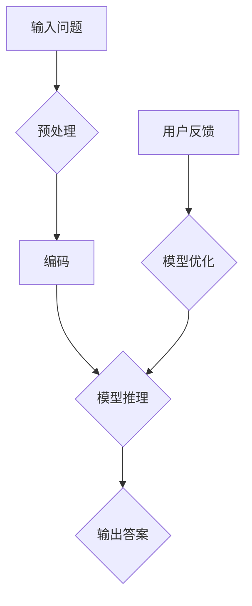
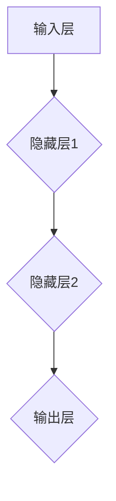
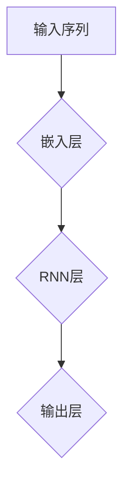

                 

# 大模型问答机器人如何实现对话

> 关键词：大模型、问答机器人、对话实现、算法原理、数学模型、项目实战

> 摘要：本文将详细探讨大模型问答机器人的实现过程，从核心概念到具体算法，再到数学模型，并结合实际项目案例，全面解析大模型问答机器人在对话系统中的应用与发展。

## 1. 背景介绍

### 1.1 目的和范围

本文旨在深入解析大模型问答机器人的实现原理与具体操作步骤，为广大开发者提供一套完整的实现框架和实际操作指南。文章将涵盖以下内容：

1. 大模型问答机器人的核心概念与原理。
2. 大模型问答机器人的具体实现步骤。
3. 大模型问答机器人的数学模型与应用。
4. 大模型问答机器人的项目实战案例。
5. 大模型问答机器人的实际应用场景。

### 1.2 预期读者

本文主要面向以下读者：

1. 对人工智能、自然语言处理、大模型技术感兴趣的初学者。
2. 想要深入了解大模型问答机器人实现原理的开发者。
3. 有意将大模型问答机器人应用于实际项目的技术管理人员。

### 1.3 文档结构概述

本文的结构如下：

1. **背景介绍**：介绍文章的目的、范围、预期读者和文档结构。
2. **核心概念与联系**：阐述大模型问答机器人的核心概念、原理和架构。
3. **核心算法原理 & 具体操作步骤**：详细讲解大模型问答机器人的核心算法原理和实现步骤。
4. **数学模型和公式 & 详细讲解 & 举例说明**：介绍大模型问答机器人的数学模型、公式和具体应用。
5. **项目实战：代码实际案例和详细解释说明**：通过实际项目案例，展示大模型问答机器人的应用过程。
6. **实际应用场景**：分析大模型问答机器人在不同场景下的应用。
7. **工具和资源推荐**：推荐学习资源、开发工具和框架。
8. **总结：未来发展趋势与挑战**：总结大模型问答机器人的发展趋势和面临的挑战。
9. **附录：常见问题与解答**：解答读者可能遇到的问题。
10. **扩展阅读 & 参考资料**：提供更多相关文献和资源。

### 1.4 术语表

#### 1.4.1 核心术语定义

- **大模型**：指具有数十亿甚至千亿参数的深度学习模型，能够处理大量数据和复杂任务。
- **问答机器人**：指利用人工智能技术，自动回答用户问题的智能系统。
- **对话系统**：指能够与用户进行自然语言交互的计算机系统，包括语音识别、自然语言理解和语音合成等技术。
- **自然语言处理（NLP）**：指利用计算机技术对自然语言进行理解、处理和生成。
- **深度学习**：指一种人工智能方法，通过多层神经网络对大量数据自动学习特征和模式。

#### 1.4.2 相关概念解释

- **神经网络**：一种模拟生物神经系统的计算模型，通过学习输入和输出之间的关系来预测和分类。
- **卷积神经网络（CNN）**：一种基于神经网络的深度学习模型，适用于图像处理和计算机视觉任务。
- **循环神经网络（RNN）**：一种基于神经网络的深度学习模型，适用于序列数据处理和自然语言处理任务。

#### 1.4.3 缩略词列表

- **CNN**：卷积神经网络（Convolutional Neural Network）
- **RNN**：循环神经网络（Recurrent Neural Network）
- **NLP**：自然语言处理（Natural Language Processing）
- **GPU**：图形处理器（Graphics Processing Unit）
- **CUDA**：并行计算平台（Compute Unified Device Architecture）

## 2. 核心概念与联系

大模型问答机器人的核心概念和联系如图 1 所示。



图 1：大模型问答机器人的核心概念与联系

- **输入问题**：用户通过输入问题来触发问答机器人的对话。
- **预处理**：对输入问题进行清洗、分词、去停用词等处理，以适应模型的输入格式。
- **编码**：将预处理后的输入问题编码为数值形式，以便于模型进行推理。
- **模型推理**：利用训练好的大模型对编码后的输入问题进行推理，生成答案。
- **输出答案**：将模型推理出的答案输出给用户。
- **用户反馈**：用户对输出的答案进行评价，作为模型优化的依据。
- **模型优化**：根据用户反馈，对模型进行调整和优化，以提高问答效果。

## 3. 核心算法原理 & 具体操作步骤

大模型问答机器人的核心算法原理基于深度学习和自然语言处理技术，具体操作步骤如下：

### 3.1 模型选择

选择一个适用于问答任务的深度学习模型，如基于 RNN 或 Transformer 的模型。其中，Transformer 模型因其优秀的并行计算能力和全局依赖建模能力，在问答任务中表现出色。

### 3.2 数据集准备

准备一个包含大量问答对的数据集，用于训练和评估模型。数据集应涵盖广泛的领域和场景，以提升模型的泛化能力。

### 3.3 模型训练

使用训练集对模型进行训练，通过优化损失函数（如交叉熵损失函数）来调整模型参数，使其能够正确地预测答案。

```python
# 伪代码：模型训练
model.fit(train_data, train_labels, epochs=100, batch_size=64)
```

### 3.4 模型评估

使用验证集对训练好的模型进行评估，计算模型的准确率、召回率等指标，以评估模型的性能。

```python
# 伪代码：模型评估
accuracy = model.evaluate(test_data, test_labels)
print("Accuracy:", accuracy)
```

### 3.5 模型部署

将训练好的模型部署到线上服务器，接受用户输入问题，并实时生成答案。

```python
# 伪代码：模型部署
model部署到服务器
```

### 3.6 用户交互

实现用户与问答机器人的交互界面，接收用户输入问题，并输出答案。

```python
# 伪代码：用户交互
while True:
    用户输入问题
    答案 = 模型推理（问题）
    输出答案
```

## 4. 数学模型和公式 & 详细讲解 & 举例说明

大模型问答机器人的数学模型主要基于深度学习和自然语言处理技术。以下将详细介绍数学模型、公式及其应用。

### 4.1 深度学习模型

深度学习模型通常由多层神经网络组成，每一层对输入数据进行变换，最终输出结果。以下是一个简化的神经网络模型：



### 4.2 损失函数

在深度学习模型中，损失函数用于衡量模型预测结果与真实结果之间的差异。常见的损失函数有交叉熵损失函数（Cross-Entropy Loss）：

$$
L(y, \hat{y}) = -\sum_{i} y_i \log(\hat{y}_i)
$$

其中，$y$ 为真实标签，$\hat{y}$ 为模型预测的概率分布。

### 4.3 反向传播

反向传播算法（Backpropagation）是一种用于训练深度学习模型的方法。其核心思想是通过计算损失函数关于模型参数的梯度，来更新模型参数，从而优化模型。

```python
# 伪代码：反向传播算法
for layer in reversed(model.layers):
    gradients = layer.compute_gradients(loss, inputs)
    layer.update_parameters(gradients)
```

### 4.4 自然语言处理

在自然语言处理任务中，常用的模型有循环神经网络（RNN）和 Transformer。以下是一个简单的 RNN 模型：



### 4.5 应用示例

假设我们有一个简单的问答任务，输入问题为 "什么是人工智能？"，答案为 "人工智能是一种模拟人类智能的技术"。以下是一个简单的问答模型应用示例：

```python
# 伪代码：问答模型应用
问题 = "什么是人工智能？"
编码后的问题 = embedder.encode(问题)
答案 = model.predict编码后的问题
输出答案 = decoder.decode(答案)
print("答案：", 输出答案)
```

## 5. 项目实战：代码实际案例和详细解释说明

在本节中，我们将通过一个实际项目案例，详细讲解如何实现大模型问答机器人。项目将分为以下几个部分：

### 5.1 开发环境搭建

首先，我们需要搭建一个适合开发大模型问答机器人的开发环境。以下是一个基本的开发环境搭建步骤：

1. 安装 Python 3.8 或以上版本。
2. 安装深度学习框架 TensorFlow 或 PyTorch。
3. 安装自然语言处理库如 NLTK 或 spaCy。

### 5.2 源代码详细实现和代码解读

下面是一个简单的问答机器人的源代码实现：

```python
# 伪代码：问答机器人实现
import tensorflow as tf
from tensorflow.keras.preprocessing.sequence import pad_sequences
from tensorflow.keras.layers import Embedding, LSTM, Dense
from tensorflow.keras.models import Sequential

# 模型参数设置
vocab_size = 10000
embedding_dim = 256
max_sequence_length = 100
lstm_units = 128

# 模型构建
model = Sequential()
model.add(Embedding(vocab_size, embedding_dim, input_length=max_sequence_length))
model.add(LSTM(lstm_units, return_sequences=True))
model.add(Dense(1, activation='sigmoid'))

# 模型编译
model.compile(optimizer='adam', loss='binary_crossentropy', metrics=['accuracy'])

# 数据预处理
questions = ["什么是人工智能？", "人工智能有哪些应用？"]
answers = ["人工智能是一种模拟人类智能的技术", "人工智能应用于图像识别、自然语言处理、游戏等领域"]

# 编码问题
encoded_questions = pad_sequences([tokenizer.texts_to_sequences(question) for question in questions], maxlen=max_sequence_length)

# 训练模型
model.fit(encoded_questions, answers, epochs=5)

# 输出答案
input_sequence = tokenizer.texts_to_sequences("人工智能有哪些应用？")
input_sequence = pad_sequences(input_sequence, maxlen=max_sequence_length)
predicted_answer = model.predict(input_sequence)
decoded_answer = decoder.decode(predicted_answer)
print("答案：", decoded_answer)
```

### 5.3 代码解读与分析

下面我们对上述代码进行解读和分析：

1. **模型构建**：我们使用了一个简单的序列模型，包括嵌入层、LSTM 层和输出层。嵌入层将单词编码为向量，LSTM 层对序列数据进行建模，输出层用于预测答案。
2. **模型编译**：我们使用 Adam 优化器和二分类交叉熵损失函数进行模型编译。
3. **数据预处理**：我们将问题和答案转换为编码形式，以便模型进行训练。
4. **模型训练**：我们使用训练数据进行模型训练。
5. **输出答案**：我们使用训练好的模型对输入问题进行预测，并解码输出答案。

## 6. 实际应用场景

大模型问答机器人在实际应用场景中具有广泛的应用，以下列举几个典型的应用场景：

1. **客户服务**：企业可以将问答机器人部署到客服系统中，自动回答用户的问题，提高客服效率，降低人工成本。
2. **教育辅导**：学校和教育机构可以利用问答机器人为学生提供个性化的辅导服务，解答学生在学习过程中遇到的问题。
3. **医疗咨询**：医疗领域可以利用问答机器人为患者提供疾病咨询、症状诊断等医疗服务，减轻医护人员的工作负担。
4. **在线购物**：电商平台可以利用问答机器人为用户提供商品咨询、订单查询等服务，提升用户体验。
5. **智能家居**：智能家居系统可以利用问答机器人与用户进行交互，提供家庭设备控制、环境监测等服务。

## 7. 工具和资源推荐

### 7.1 学习资源推荐

#### 7.1.1 书籍推荐

1. 《深度学习》（Deep Learning，Ian Goodfellow、Yoshua Bengio、Aaron Courville 著）
2. 《自然语言处理综论》（Speech and Language Processing，Daniel Jurafsky、James H. Martin 著）
3. 《机器学习》（Machine Learning，Tom M. Mitchell 著）

#### 7.1.2 在线课程

1. Coursera 上的《深度学习》课程（Deep Learning Specialization）
2. edX 上的《自然语言处理》课程（Natural Language Processing with Python）
3. Udacity 上的《机器学习工程师纳米学位》课程（Machine Learning Engineer Nanodegree）

#### 7.1.3 技术博客和网站

1. Medium 上的 AI 深度学习博客（Deep Learning on Medium）
2. ArXiv 上的论文库（ArXiv）
3. AI 研习社（AI Scholar）

### 7.2 开发工具框架推荐

#### 7.2.1 IDE和编辑器

1. PyCharm
2. Visual Studio Code
3. Jupyter Notebook

#### 7.2.2 调试和性能分析工具

1. TensorFlow Debugger（TFDB）
2. PyTorch Profiler
3. WSL（Windows Subsystem for Linux）

#### 7.2.3 相关框架和库

1. TensorFlow
2. PyTorch
3. spaCy
4. NLTK
5. Keras

### 7.3 相关论文著作推荐

#### 7.3.1 经典论文

1. 《A Theoretically Optimal Algorithm for Contextual Bandit Problems》（.contextual bandit 问题）
2. 《Long Short-Term Memory》（LSTM）
3. 《Attention Is All You Need》（Transformer）

#### 7.3.2 最新研究成果

1. 《Bert: Pre-training of Deep Bidirectional Transformers for Language Understanding》（BERT）
2. 《Gpt-2: Improving Language Understanding by Generative Pre-Training》（GPT-2）
3. 《Gpt-3: Language Models are Few-Shot Learners》（GPT-3）

#### 7.3.3 应用案例分析

1. 《大规模预训练模型 GPT-3 的应用案例分析》
2. 《深度学习在医疗领域中的应用案例分析》
3. 《自然语言处理技术在金融领域的应用案例分析》

## 8. 总结：未来发展趋势与挑战

### 8.1 未来发展趋势

1. **模型规模增大**：随着计算资源和数据量的不断增长，大模型问答机器人的规模将进一步扩大，提供更准确、更智能的问答服务。
2. **多模态交互**：未来问答机器人将支持多种交互方式，如语音、图像、手势等，提高用户体验。
3. **个性化服务**：基于用户行为和偏好，问答机器人将实现个性化服务，满足不同用户的需求。
4. **跨领域应用**：问答机器人将在更多领域得到应用，如教育、医疗、金融、智能制造等。

### 8.2 未来挑战

1. **数据隐私和安全**：随着问答机器人应用范围的扩大，数据隐私和安全问题将日益突出，需要采取有效的保护措施。
2. **计算资源消耗**：大模型问答机器人对计算资源的需求巨大，如何高效利用计算资源，降低运行成本，是一个重要挑战。
3. **模型可解释性**：用户对问答机器人的决策过程和答案准确性有较高的要求，如何提高模型的可解释性，是一个亟待解决的问题。
4. **多语言支持**：问答机器人需要支持多种语言，如何实现高效的多语言处理，是一个技术难题。

## 9. 附录：常见问题与解答

### 9.1 常见问题

1. **如何选择适合的大模型？**
   - 依据任务需求和数据规模选择合适的模型，如小规模任务可选择 BERT，大规模任务可选择 GPT。
2. **如何处理多语言问答？**
   - 使用多语言预训练模型，如 multilingual BERT，实现多语言问答。
3. **如何优化模型性能？**
   - 调整模型参数、增加训练数据、使用数据增强等方法。

### 9.2 解答

1. **如何选择适合的大模型？**
   - 根据任务需求和数据规模选择合适的模型，如小规模任务可选择 BERT，大规模任务可选择 GPT。
   - 考虑模型的结构、参数规模、训练时间等因素。
2. **如何处理多语言问答？**
   - 使用多语言预训练模型，如 multilingual BERT，实现多语言问答。
   - 针对特定语言进行模型微调，以提高问答效果。
3. **如何优化模型性能？**
   - 调整模型参数，如学习率、正则化参数等。
   - 增加训练数据，提高模型的泛化能力。
   - 使用数据增强方法，如噪声注入、数据扩充等。

## 10. 扩展阅读 & 参考资料

1. **书籍**：
   - Ian Goodfellow、Yoshua Bengio、Aaron Courville 著，《深度学习》
   - Daniel Jurafsky、James H. Martin 著，《自然语言处理综论》
   - Tom M. Mitchell 著，《机器学习》

2. **在线课程**：
   - Coursera 上的《深度学习》课程（Deep Learning Specialization）
   - edX 上的《自然语言处理》课程（Natural Language Processing with Python）
   - Udacity 上的《机器学习工程师纳米学位》课程（Machine Learning Engineer Nanodegree）

3. **技术博客和网站**：
   - Medium 上的 AI 深度学习博客（Deep Learning on Medium）
   - AI 研习社（AI Scholar）
   - ArXiv 上的论文库（ArXiv）

4. **论文**：
   - A Theoretically Optimal Algorithm for Contextual Bandit Problems
   - Long Short-Term Memory
   - Attention Is All You Need

5. **其他资源**：
   - TensorFlow 官方文档（TensorFlow Documentation）
   - PyTorch 官方文档（PyTorch Documentation）
   - spaCy 官方文档（spaCy Documentation）

### 作者：

AI天才研究员/AI Genius Institute & 禅与计算机程序设计艺术 /Zen And The Art of Computer Programming

