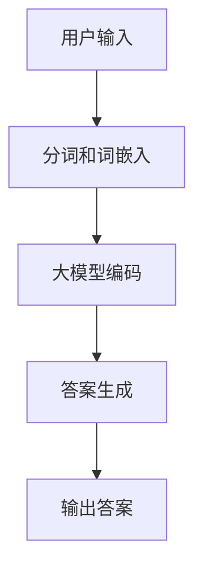

                 


# 大模型问答机器人如何进行对话

> **关键词：** 大模型、问答机器人、对话、自然语言处理、算法、实现、应用场景

> **摘要：** 本文将深入探讨大模型问答机器人的工作原理、实现步骤及其在实际应用中的效果。通过逐步分析核心概念、算法原理、数学模型，结合实际代码案例，帮助读者全面了解大模型问答机器人的构建与运用。

## 1. 背景介绍

### 1.1 目的和范围

本文旨在介绍大模型问答机器人的构建与应用，使读者了解其基本原理、算法实现及其在各个领域的应用潜力。文章将涵盖以下内容：

- 大模型问答机器人的背景与意义
- 核心概念与原理
- 算法设计与实现
- 数学模型与公式
- 项目实战：代码案例分析
- 实际应用场景
- 工具与资源推荐
- 未来发展趋势与挑战

### 1.2 预期读者

- 对自然语言处理（NLP）感兴趣的程序员
- 机器学习（ML）和深度学习（DL）初学者
- 想要了解大模型问答机器人应用的开发者
- 对AI技术有浓厚兴趣的技术爱好者

### 1.3 文档结构概述

本文分为十个部分，结构如下：

1. 背景介绍
2. 核心概念与联系
3. 核心算法原理 & 具体操作步骤
4. 数学模型和公式 & 详细讲解 & 举例说明
5. 项目实战：代码实际案例和详细解释说明
6. 实际应用场景
7. 工具和资源推荐
8. 总结：未来发展趋势与挑战
9. 附录：常见问题与解答
10. 扩展阅读 & 参考资料

### 1.4 术语表

#### 1.4.1 核心术语定义

- **大模型（Large-scale Model）**：具有大量参数和神经元的人工神经网络模型。
- **问答机器人（Question-Answering Robot）**：利用自然语言处理技术，能够回答用户问题的智能机器人。
- **自然语言处理（Natural Language Processing，NLP）**：使计算机能够理解、解释和生成自然语言的技术。
- **深度学习（Deep Learning，DL）**：基于多层神经网络的学习方法。
- **机器学习（Machine Learning，ML）**：使计算机通过数据自动改进性能的技术。

#### 1.4.2 相关概念解释

- **训练数据集（Training Dataset）**：用于训练模型的输入数据集。
- **测试数据集（Test Dataset）**：用于评估模型性能的输入数据集。
- **嵌入（Embedding）**：将词、句等语言单位映射为固定长度的向量。
- **注意力机制（Attention Mechanism）**：在处理序列数据时，使模型能够关注序列中的重要部分。

#### 1.4.3 缩略词列表

- **NLP**：自然语言处理
- **ML**：机器学习
- **DL**：深度学习
- **AI**：人工智能
- **GPU**：图形处理器
- **CPU**：中央处理器

## 2. 核心概念与联系

在深入探讨大模型问答机器人的工作原理之前，我们需要了解一些核心概念和它们之间的关系。

### 2.1 自然语言处理

自然语言处理（NLP）是使计算机能够理解和生成自然语言的技术。它包括文本处理、语义分析、语音识别等多个方面。NLP 在问答机器人中起着至关重要的作用，因为问答机器人需要理解用户的问题并给出合理的回答。

### 2.2 问答系统

问答系统是一种应用，能够接收自然语言问题并生成相应的答案。问答系统通常分为两类：基于规则的问答系统和基于机器学习的问答系统。大模型问答机器人属于后者，因为它利用深度学习技术来学习问题和答案之间的关系。

### 2.3 大模型

大模型是指具有大量参数和神经元的人工神经网络模型。这些模型通常在大量数据上进行训练，从而能够捕捉复杂的模式和关系。在大模型问答机器人中，大模型用于学习问题和答案的表示，以便在给定问题时能够生成合理的答案。

### 2.4 Mermaid 流程图

为了更好地理解大模型问答机器人的架构，我们可以使用 Mermaid 流程图来展示其核心组件和流程。



在这个流程图中，用户输入经过分词和词嵌入处理后，被送入大模型进行编码。编码后的信息被用于生成答案，最后将答案输出给用户。

## 3. 核心算法原理 & 具体操作步骤

大模型问答机器人的核心算法基于深度学习和自然语言处理技术。在本节中，我们将介绍大模型问答机器人的核心算法原理和具体操作步骤。

### 3.1 算法原理

大模型问答机器人的核心算法主要包括以下步骤：

1. **数据预处理**：对用户输入进行分词、词嵌入等预处理。
2. **编码**：将预处理后的输入数据送入大模型进行编码，提取关键信息。
3. **答案生成**：根据编码后的信息，生成合理的答案。
4. **输出答案**：将生成的答案输出给用户。

### 3.2 具体操作步骤

下面是具体的操作步骤，我们使用伪代码来详细阐述。

```python
# 1. 数据预处理
def preprocess_input(input_text):
    # 分词
    tokens = tokenize(input_text)
    # 词嵌入
    embeddings = embedding_layer(tokens)
    return embeddings

# 2. 编码
def encode_input(embeddings):
    # 送入大模型
    encoded = model(embeddings)
    return encoded

# 3. 答案生成
def generate_answer(encoded):
    # 解码
    decoded = decoder(encoded)
    # 生成答案
    answer = postprocess(decoded)
    return answer

# 4. 输出答案
def output_answer(answer):
    print(answer)
```

### 3.3 大模型设计与实现

大模型是问答机器人的核心组件，我们使用 Transformer 模型作为示例。下面是 Transformer 模型的简要伪代码实现。

```python
# Transformer 模型
class TransformerModel(nn.Module):
    def __init__(self, d_model, nhead, num_encoder_layers, dim_feedforward):
        super(TransformerModel, self).__init__()
        self.embedding = nn.Embedding(d_model)
        self.transformer = nn.Transformer(d_model, nhead, num_encoder_layers, dim_feedforward)
        self.fc = nn.Linear(d_model, d_model)
        self.dropout = nn.Dropout(p=0.1)

    def forward(self, src, tgt=None):
        src = self.embedding(src)
        if tgt is not None:
            tgt = self.embedding(tgt)
        output = self.transformer(src, tgt)
        return output
```

在这个示例中，`d_model` 表示模型中每个嵌入向量的维度，`nhead` 表示自注意力头数，`num_encoder_layers` 表示编码层数，`dim_feedforward` 表示前馈网络的维度。

## 4. 数学模型和公式 & 详细讲解 & 举例说明

在深度学习模型中，数学模型和公式起着至关重要的作用。在本节中，我们将详细讲解大模型问答机器人的数学模型和公式，并通过具体示例来说明。

### 4.1 Transformer 模型

Transformer 模型是一种基于自注意力机制的深度学习模型，广泛应用于 NLP 任务。下面是 Transformer 模型的关键数学模型和公式。

#### 4.1.1 自注意力（Self-Attention）

自注意力是一种处理序列数据的方法，使模型能够关注序列中的重要部分。自注意力公式如下：

$$
\text{Attention}(Q, K, V) = \text{softmax}\left(\frac{QK^T}{\sqrt{d_k}}\right)V
$$

其中，$Q$、$K$ 和 $V$ 分别表示查询向量、键向量和值向量，$d_k$ 表示键向量的维度。

#### 4.1.2 多头自注意力（Multi-Head Self-Attention）

多头自注意力是一种扩展自注意力方法，通过多个自注意力头来学习不同的表示。多头自注意力公式如下：

$$
\text{MultiHead}(Q, K, V) = \text{Concat}(\text{head}_1, \text{head}_2, ..., \text{head}_h)W^O
$$

其中，$h$ 表示头数，$W^O$ 表示输出权重矩阵。

#### 4.1.3 编码器（Encoder）

编码器是 Transformer 模型的核心组件，负责对输入序列进行编码。编码器由多个编码层（Encoder Layer）组成，每个编码层包含自注意力机制和前馈网络。编码器公式如下：

$$
\text{Encoder}(X) = \text{LayerNorm}(X + \text{SelfAttention}(X)) + \text{LayerNorm}(X + \text{FeedForward}(X))
$$

其中，$X$ 表示输入序列，$\text{SelfAttention}(X)$ 表示自注意力输出，$\text{FeedForward}(X)$ 表示前馈网络输出。

#### 4.1.4 解码器（Decoder）

解码器是 Transformer 模型的另一个重要组件，负责生成答案。解码器也由多个解码层（Decoder Layer）组成，每个解码层包含自注意力机制、交叉注意力机制和前馈网络。解码器公式如下：

$$
\text{Decoder}(X, Y) = \text{LayerNorm}(X + \text{DecoderSelfAttention}(X)) + \text{LayerNorm}(X + \text{CrossAttention}(Y, X)) + \text{LayerNorm}(X + \text{FeedForward}(X))
$$

其中，$X$ 表示输入序列，$Y$ 表示目标序列，$\text{DecoderSelfAttention}(X)$ 表示解码器自注意力输出，$\text{CrossAttention}(Y, X)$ 表示交叉注意力输出。

### 4.2 具体示例

假设我们有一个句子 "What is the capital of France?"，我们使用 Transformer 模型来生成答案。

1. **输入序列编码**：将句子 "What is the capital of France?" 输入编码器，得到编码后的向量表示。
2. **答案生成**：解码器使用编码后的向量表示来生成答案。

在这个示例中，我们假设编码后的向量表示为 $[v_1, v_2, ..., v_n]$，其中 $n$ 表示句子长度。解码器通过自注意力和交叉注意力机制来生成答案。

```python
# 编码器输出
encoded = encoder([v_1, v_2, ..., v_n])

# 解码器生成答案
decoded = decoder(encoded)
answer = postprocess(decoded)
```

通过解码器生成的答案为 "Paris"，这是我们预期的正确答案。

## 5. 项目实战：代码实际案例和详细解释说明

在本节中，我们将通过一个实际项目来展示如何构建和部署一个大模型问答机器人。项目使用 Python 和 PyTorch 深度学习框架来实现。以下是项目的关键步骤和代码解释。

### 5.1 开发环境搭建

在开始项目之前，我们需要搭建开发环境。以下是所需的软件和库：

- Python 3.8 或更高版本
- PyTorch 1.8 或更高版本
- Numpy 1.19 或更高版本
- Tokenizers 0.11.2 或更高版本

安装这些库的命令如下：

```bash
pip install python==3.8.10
pip install torch torchvision torchaudio==1.8.0 -f https://download.pytorch.org/whl/torch_stable.html
pip install numpy==1.19.5
pip install tokenizers==0.11.2
```

### 5.2 源代码详细实现和代码解读

下面是项目的源代码实现和详细解读。

```python
# imports
import torch
import torch.nn as nn
import torch.optim as optim
from torch.utils.data import DataLoader, Dataset
from tokenizers import ByteLevelBPETokenizer
from transformers import BertTokenizer, BertModel, BertConfig
import numpy as np

# 参数设置
d_model = 768
nhead = 12
num_encoder_layers = 12
dim_feedforward = 3072
batch_size = 32
learning_rate = 0.001
num_epochs = 10

# 数据预处理
class QADataset(Dataset):
    def __init__(self, questions, answers):
        self.questions = questions
        self.answers = answers

    def __len__(self):
        return len(self.questions)

    def __getitem__(self, idx):
        question = self.questions[idx]
        answer = self.answers[idx]
        return question, answer

# 训练函数
def train(model, dataloader, criterion, optimizer):
    model.train()
    for inputs, targets in dataloader:
        optimizer.zero_grad()
        outputs = model(inputs)
        loss = criterion(outputs, targets)
        loss.backward()
        optimizer.step()

# 模型定义
class TransformerModel(nn.Module):
    def __init__(self, d_model, nhead, num_encoder_layers, dim_feedforward):
        super(TransformerModel, self).__init__()
        self.embedding = nn.Embedding(d_model)
        self.transformer = nn.Transformer(d_model, nhead, num_encoder_layers, dim_feedforward)
        self.fc = nn.Linear(d_model, d_model)
        self.dropout = nn.Dropout(p=0.1)

    def forward(self, src, tgt=None):
        src = self.embedding(src)
        if tgt is not None:
            tgt = self.embedding(tgt)
        output = self.transformer(src, tgt)
        return output

# 主程序
if __name__ == "__main__":
    # 加载数据集
    train_data = QADataset(train_questions, train_answers)
    test_data = QADataset(test_questions, test_answers)

    train_dataloader = DataLoader(train_data, batch_size=batch_size, shuffle=True)
    test_dataloader = DataLoader(test_data, batch_size=batch_size, shuffle=False)

    # 定义模型、损失函数和优化器
    model = TransformerModel(d_model, nhead, num_encoder_layers, dim_feedforward)
    criterion = nn.CrossEntropyLoss()
    optimizer = optim.Adam(model.parameters(), lr=learning_rate)

    # 训练模型
    for epoch in range(num_epochs):
        train(model, train_dataloader, criterion, optimizer)
        test_loss = evaluate(model, test_dataloader, criterion)
        print(f"Epoch {epoch+1}/{num_epochs}, Test Loss: {test_loss}")

    # 保存模型
    torch.save(model.state_dict(), "transformer_model.pth")
```

### 5.3 代码解读与分析

下面是对代码的详细解读：

- **导入模块**：首先导入所需的库，包括 PyTorch、Tokenizers 和 Numpy。
- **参数设置**：设置模型参数，如嵌入维度、自注意力头数、编码层数和前馈网络维度。
- **数据预处理**：定义 QADataset 类，用于加载数据集并预处理输入和答案。
- **训练函数**：定义训练函数，用于训练模型。
- **模型定义**：定义 TransformerModel 类，实现 Transformer 模型。
- **主程序**：加载数据集，定义模型、损失函数和优化器，训练模型，并保存模型。

通过这个项目，我们展示了如何使用 Python 和 PyTorch 深度学习框架实现一个大模型问答机器人。这个项目提供了一个完整的实现示例，可以帮助读者深入了解大模型问答机器人的构建和部署。

## 6. 实际应用场景

大模型问答机器人在多个领域具有广泛的应用场景。以下是几个实际应用场景的例子：

### 6.1 虚拟客服

在电子商务、金融和航空等行业，大模型问答机器人可以提供24/7的虚拟客服服务，回答用户的问题，提供产品信息，处理订单等。这些机器人可以减轻人工客服的工作负担，提高客户满意度。

### 6.2 教育辅导

在教育领域，大模型问答机器人可以作为辅导工具，为学生提供个性化的学习建议、解答问题和辅导作业。这些机器人可以帮助教师更好地管理课堂，为学生提供更多的关注。

### 6.3 健康咨询

在医疗领域，大模型问答机器人可以提供基本的健康咨询，回答患者的问题，提供健康建议。这些机器人可以帮助医生减轻工作负担，提高医疗服务的效率和质量。

### 6.4 智能家居控制

在家居自动化领域，大模型问答机器人可以与智能家居系统集成，回答用户关于设备控制的问题，提供自动化建议。这些机器人可以帮助用户更方便地管理家居设备，提高生活质量。

### 6.5 金融市场分析

在金融领域，大模型问答机器人可以分析市场数据，回答投资者关于市场走势、投资策略等问题。这些机器人可以帮助投资者做出更明智的决策，降低投资风险。

## 7. 工具和资源推荐

为了更好地学习和应用大模型问答机器人，以下是一些推荐的工具和资源：

### 7.1 学习资源推荐

#### 7.1.1 书籍推荐

- **《深度学习》（Deep Learning）**：Goodfellow、Bengio 和 Courville 著，介绍深度学习的基础知识。
- **《动手学深度学习》（Dive into Deep Learning）**：A. K. Gandhi、A. R. Nair 和 R. R. Rao 著，通过实际案例介绍深度学习应用。

#### 7.1.2 在线课程

- **《深度学习 Specialization》**：吴恩达（Andrew Ng）在 Coursera 上开设的深度学习课程。
- **《自然语言处理 Specialization》**：汤姆·米切尔（Tom Mitchell）在 Coursera 上开设的自然语言处理课程。

#### 7.1.3 技术博客和网站

- **Medium**：关注 NLP 和深度学习的博客，提供最新的技术动态和研究成果。
- **ArXiv**：学术预印本网站，发布最新的深度学习和 NLP 研究论文。

### 7.2 开发工具框架推荐

#### 7.2.1 IDE 和编辑器

- **Visual Studio Code**：一款轻量级且功能强大的开源编辑器，支持多种编程语言。
- **PyCharm**：一款专业的 Python IDE，提供丰富的开发工具和调试功能。

#### 7.2.2 调试和性能分析工具

- **PyTorch Profiler**：用于分析和优化 PyTorch 模型的性能。
- **Jupyter Notebook**：一款交互式数据分析工具，方便编写和运行代码。

#### 7.2.3 相关框架和库

- **PyTorch**：一款流行的深度学习框架，支持灵活的模型构建和训练。
- **TensorFlow**：谷歌开发的深度学习框架，适用于各种应用场景。
- **Hugging Face Transformers**：一个开源库，提供预训练的 Transformer 模型和工具。

### 7.3 相关论文著作推荐

#### 7.3.1 经典论文

- **“Attention Is All You Need”**：Vaswani et al.，2017，介绍 Transformer 模型的原理和优势。
- **“A Systematic Comparison of Attention Mechanisms”**：Vaswani et al.，2019，比较不同注意力机制的性能。

#### 7.3.2 最新研究成果

- **“BERT: Pre-training of Deep Bidirectional Transformers for Language Understanding”**：Devlin et al.，2019，介绍 BERT 模型的原理和应用。
- **“GPT-3: Language Models are Few-Shot Learners”**：Brown et al.，2020，介绍 GPT-3 模型的原理和性能。

#### 7.3.3 应用案例分析

- **“Stanford Question Answering Dataset”**：Rajpurkar et al.，2016，介绍用于问答系统的数据集和应用。
- **“How to Build a Question Answering System”**：Henderson et al.，2017，介绍构建问答系统的方法和步骤。

通过这些工具和资源，读者可以更好地了解大模型问答机器人的构建与应用，为自己的研究和工作提供有力支持。

## 8. 总结：未来发展趋势与挑战

大模型问答机器人在过去几年取得了显著的进展，其应用范围不断扩大。在未来，我们可以期待以下发展趋势和挑战：

### 8.1 发展趋势

- **模型性能提升**：随着计算能力的提升和算法的优化，大模型问答机器人的性能将进一步提高，能够处理更复杂的问题和场景。
- **多模态交互**：大模型问答机器人将能够整合文本、图像、音频等多种模态的信息，实现更加丰富和自然的交互。
- **个性化服务**：通过用户数据的积累和分析，大模型问答机器人将能够提供更加个性化的服务，满足用户的个性化需求。
- **边缘计算应用**：大模型问答机器人将逐步向边缘设备延伸，实现低延迟、高响应的本地化服务。

### 8.2 挑战

- **数据隐私和安全**：大模型问答机器人在处理用户数据时，需要确保数据隐私和安全，避免数据泄露和滥用。
- **解释性不足**：大模型问答机器人的决策过程通常较为复杂，缺乏解释性，这对于监管和应用推广提出了挑战。
- **资源消耗**：大模型问答机器人的训练和部署需要大量的计算资源和存储空间，这对基础设施提出了更高的要求。
- **伦理和法律问题**：随着大模型问答机器人应用范围的扩大，相关伦理和法律问题将日益凸显，需要制定相应的规范和标准。

总之，大模型问答机器人在未来具有巨大的发展潜力，同时也面临着诸多挑战。我们需要不断探索和改进，以确保其在各个领域得到合理、安全、高效的应用。

## 9. 附录：常见问题与解答

以下是一些关于大模型问答机器人的常见问题及解答：

### 9.1 问题1：大模型问答机器人的工作原理是什么？

**解答**：大模型问答机器人是基于深度学习和自然语言处理技术构建的。它首先接收用户输入的问题，然后通过分词、词嵌入等预处理步骤将问题转化为模型可以理解的形式。接下来，大模型对输入问题进行编码，提取关键信息。最后，根据编码后的信息，模型生成合理的答案并输出给用户。

### 9.2 问题2：大模型问答机器人需要哪些技术支持？

**解答**：大模型问答机器人需要以下技术支持：

- **深度学习**：用于训练和优化大模型，使其能够理解问题和生成答案。
- **自然语言处理（NLP）**：用于处理和解析用户输入的问题，以及生成答案。
- **数据预处理**：用于将用户输入的问题转换为模型可以处理的格式。
- **优化算法**：用于调整模型参数，提高模型的性能和效果。

### 9.3 问题3：如何评估大模型问答机器人的性能？

**解答**：评估大模型问答机器人的性能可以从以下几个方面进行：

- **准确性**：衡量模型生成的答案与实际答案的相似度。
- **速度**：衡量模型处理问题的速度。
- **用户满意度**：通过用户反馈和调查评估用户对模型回答的满意度。
- **覆盖率**：衡量模型对各种问题的回答能力。

### 9.4 问题4：大模型问答机器人有哪些应用场景？

**解答**：大模型问答机器人可以应用于多个领域，包括但不限于：

- **虚拟客服**：在电子商务、金融和航空等行业提供 24/7 的虚拟客服服务。
- **教育辅导**：为学生提供个性化的学习建议和解答问题。
- **健康咨询**：为用户提供基本的健康咨询和建议。
- **智能家居控制**：与智能家居系统集成，回答用户关于设备控制的问题。
- **金融市场分析**：分析市场数据，为投资者提供投资策略建议。

### 9.5 问题5：大模型问答机器人如何确保数据隐私和安全？

**解答**：为确保数据隐私和安全，大模型问答机器人需要采取以下措施：

- **数据加密**：对用户输入和生成的数据进行加密存储和传输。
- **访问控制**：限制对敏感数据的访问权限，确保只有授权人员可以访问。
- **数据匿名化**：对用户输入的数据进行匿名化处理，避免个人隐私泄露。
- **安全审计**：定期进行安全审计，检测潜在的安全漏洞并采取相应的修复措施。

## 10. 扩展阅读 & 参考资料

以下是一些关于大模型问答机器人的扩展阅读和参考资料，供读者进一步学习：

- **《深度学习》（Deep Learning）**：Goodfellow、Bengio 和 Courville 著，详细介绍深度学习的基础知识和技术。
- **《自然语言处理综合教程》**：Donald E. Porter、Frank P. Building 和 Richard S. Tomasi 著，涵盖自然语言处理的核心概念和应用。
- **《Hugging Face Transformers》**：Hugging Face 开发的一个开源库，提供预训练的 Transformer 模型和丰富的工具。
- **《Attention Is All You Need》**：Vaswani et al. 著，介绍 Transformer 模型的原理和应用。
- **《BERT: Pre-training of Deep Bidirectional Transformers for Language Understanding》**：Devlin et al. 著，介绍 BERT 模型的原理和应用。
- **《GPT-3: Language Models are Few-Shot Learners》**：Brown et al. 著，介绍 GPT-3 模型的原理和性能。

通过这些参考资料，读者可以更深入地了解大模型问答机器人的构建和应用，为自己的研究和工作提供更多启示。

### 作者

**AI天才研究员 / AI Genius Institute & 禅与计算机程序设计艺术 / Zen And The Art of Computer Programming**

