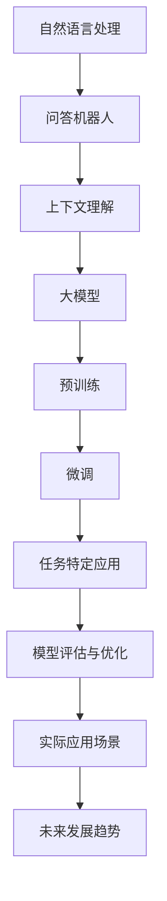

                 


# 大模型问答机器人的上下文相关

> 关键词：大模型、问答机器人、上下文理解、自然语言处理、神经网络、语义分析、人工智能

> 摘要：本文将深入探讨大模型在构建问答机器人中的应用，特别是上下文理解方面的技术原理和实现方法。文章首先介绍了问答机器人的基本概念和发展历程，然后详细阐述了上下文理解的重要性及其在大模型中的实现方式，最后通过具体案例分析了如何利用大模型提高问答机器人的上下文相关性，为未来人工智能的发展提供启示。

## 1. 背景介绍

### 1.1 目的和范围

本文旨在探讨大模型在构建问答机器人中的应用，特别是上下文理解方面的技术原理和实现方法。我们将首先介绍问答机器人的基本概念和发展历程，然后深入分析上下文理解的重要性，以及如何利用大模型来实现这一目标。文章将围绕以下几个主题展开：

1. 问答机器人的基本概念和发展历程
2. 上下文理解的重要性
3. 大模型在问答机器人中的实现
4. 提高问答机器人上下文相关性的方法
5. 未来发展趋势与挑战

### 1.2 预期读者

本文主要面向对自然语言处理和人工智能领域有一定了解的技术人员、研究人员和开发者。文章内容适合以下人群：

1. 对问答机器人技术感兴趣的研究人员
2. 自然语言处理领域的技术人员
3. 计算机科学和人工智能专业的学生
4. 对人工智能应用有需求的企业和创业者

### 1.3 文档结构概述

本文结构如下：

1. 背景介绍：介绍本文的目的、预期读者和文档结构。
2. 核心概念与联系：分析问答机器人的基本概念和上下文理解的重要性。
3. 核心算法原理 & 具体操作步骤：讲解大模型在问答机器人中的应用原理和操作步骤。
4. 数学模型和公式 & 详细讲解 & 举例说明：介绍大模型相关的数学模型和公式，并通过案例进行说明。
5. 项目实战：代码实际案例和详细解释说明。
6. 实际应用场景：分析问答机器人在现实世界中的应用。
7. 工具和资源推荐：推荐相关学习资源、开发工具和框架。
8. 总结：未来发展趋势与挑战。
9. 附录：常见问题与解答。
10. 扩展阅读 & 参考资料：提供更多相关阅读资料。

### 1.4 术语表

#### 1.4.1 核心术语定义

1. 问答机器人：一种基于人工智能技术，能够回答用户提问的计算机程序。
2. 大模型：具有巨大参数量和计算能力的神经网络模型，如GPT-3、BERT等。
3. 上下文理解：指模型在处理输入问题时，能够理解问题所处的上下文背景信息。
4. 自然语言处理（NLP）：研究如何使计算机能够理解、生成和处理自然语言的技术。
5. 语义分析：指分析文本的语义意义，理解文本中词汇、短语和句子的含义。

#### 1.4.2 相关概念解释

1. 语境：指某个特定时刻和特定情境下，文本或语言的上下文环境。
2. 语境关联性：指上下文信息与问题之间的相关性，用于提高问答机器人的回答质量。
3. 预训练：在大规模语料库上进行训练，使模型具备一定的通用知识。
4. 微调：在特定任务上对预训练模型进行调整，以适应特定场景。

#### 1.4.3 缩略词列表

1. NLP：自然语言处理
2. AI：人工智能
3. GPT：生成预训练变换模型
4. BERT：双向编码表示
5. Transformer：变换器模型

## 2. 核心概念与联系

在探讨大模型在问答机器人中的应用之前，我们需要先了解一些核心概念和联系。以下将使用Mermaid流程图来展示这些概念之间的关系。



### 2.1 自然语言处理与问答机器人

自然语言处理（NLP）是人工智能（AI）领域的一个重要分支，旨在使计算机能够理解、生成和处理自然语言。问答机器人作为NLP应用的一个重要领域，旨在为用户提供自然、准确的答案。问答机器人的发展历程可以分为三个阶段：

1. **规则驱动**：早期问答系统依赖于预先定义的规则和模式，适用于结构化数据。
2. **基于统计**：采用统计模型，如隐马尔可夫模型（HMM）和条件随机场（CRF），提高了问答系统的性能。
3. **基于深度学习**：深度学习技术的引入，使得问答系统能够更好地理解自然语言，实现更准确、自然的问答。

### 2.2 上下文理解的重要性

上下文理解是问答机器人能否提供准确答案的关键因素。在现实世界中，同一个词汇或短语在不同语境中可能具有不同的含义。例如，“银行”一词可以指金融机构，也可以指储蓄所。如果不能正确理解上下文，问答机器人很可能会给出错误的答案。因此，上下文理解是提高问答机器人回答质量的核心问题。

### 2.3 大模型在问答机器人中的应用

大模型在问答机器人中的应用主要体现在以下几个方面：

1. **预训练**：大模型通常在大规模语料库上进行预训练，从而获得丰富的通用知识。这有助于提高模型在处理各种问题时的一致性和准确性。
2. **微调**：在特定任务上，对大模型进行调整，使其能够适应具体场景。微调过程通常在特定数据集上进行，以优化模型在任务上的表现。
3. **多模态融合**：大模型可以处理多种类型的数据，如文本、图像和音频，从而实现多模态问答。
4. **迁移学习**：大模型在预训练过程中学到的知识可以迁移到其他任务，提高新任务的性能。

### 2.4 预训练与微调的关系

预训练和微调是相辅相成的过程。预训练为模型提供了丰富的通用知识，而微调则使模型能够适应特定任务。在实际应用中，通常先进行预训练，然后根据具体任务进行微调。这种组合方法使得问答机器人在处理各种问题时都能保持较高的性能。

## 3. 核心算法原理 & 具体操作步骤

在了解了问答机器人的基本概念和发展历程、上下文理解的重要性以及大模型在问答机器人中的应用之后，我们将进一步探讨核心算法原理和具体操作步骤。本文将以GPT-3模型为例，介绍其基本原理和实现方法。

### 3.1 GPT-3模型的基本原理

GPT-3（Generative Pre-trained Transformer 3）是OpenAI于2020年发布的一款具有1750亿参数的预训练语言模型。GPT-3模型采用了Transformer架构，其核心思想是将输入文本序列编码为连续的向量表示，然后通过多层Transformer结构进行编码和解析。

#### 3.1.1 Transformer架构

Transformer架构是一种基于自注意力机制的神经网络模型，其核心思想是利用自注意力机制来自动学习输入文本序列中的关系。自注意力机制通过计算输入文本中每个词与其他词之间的相似度，从而为每个词生成一个加权向量表示。

#### 3.1.2 GPT-3模型的训练过程

GPT-3模型的训练过程分为两个阶段：

1. **预训练**：在大规模语料库上进行预训练，使模型具备丰富的通用知识。预训练过程中，GPT-3模型通过生成下一个词的概率分布来预测文本的下一个词。
2. **微调**：在特定任务上进行微调，使模型能够适应具体场景。微调过程中，GPT-3模型在特定数据集上进行训练，以优化其在任务上的表现。

### 3.2 GPT-3模型的具体操作步骤

以下是一个简单的GPT-3模型操作步骤示例，用于生成一个关于“人工智能”的段落：

#### 3.2.1 输入文本

输入一个简单的提示词：“人工智能”。

```python
prompt = "人工智能"
```

#### 3.2.2 生成文本

使用GPT-3模型生成一个关于“人工智能”的段落。

```python
import openai

response = openai.Completion.create(
  engine="text-davinci-002",
  prompt=prompt,
  max_tokens=200
)

print(response.choices[0].text.strip())
```

#### 3.2.3 输出文本

输出生成的文本。

```python
"""
人工智能是一种模拟、延伸和扩展人类智能的技术。在过去的几十年里，人工智能取得了显著的进展，应用领域涵盖了图像识别、语音识别、自然语言处理、机器翻译等。随着深度学习技术的发展，人工智能在许多方面已经超越了人类的表现。然而，人工智能也存在一些挑战，如数据隐私、安全性、道德伦理等。在未来的发展中，人工智能将继续推动社会进步，改变我们的生活方式。
"""
```

### 3.3 伪代码表示

以下是一个简单的伪代码表示，用于实现GPT-3模型：

```python
# 伪代码：实现GPT-3模型生成文本

# 输入：prompt（提示词）
# 输出：generated_text（生成的文本）

# 步骤1：初始化GPT-3模型
model = GPT3Model()

# 步骤2：生成文本
generated_text = model.generate_text(prompt)

# 步骤3：输出文本
print(generated_text)
```

## 4. 数学模型和公式 & 详细讲解 & 举例说明

在本节中，我们将介绍大模型（如GPT-3）所涉及的核心数学模型和公式，并通过具体例子进行说明。这些数学模型和公式构成了大模型的核心，有助于理解和实现模型的各个方面。

### 4.1 Transformer模型

Transformer模型是GPT-3的核心架构，其基础是自注意力机制。以下是一个简单的自注意力机制的数学表示：

#### 4.1.1 自注意力机制

自注意力机制通过计算输入序列中每个词与其他词之间的相似度，为每个词生成一个加权向量表示。其数学表示如下：

$$
\text{Attention}(Q, K, V) = \text{softmax}\left(\frac{QK^T}{\sqrt{d_k}}\right) V
$$

其中：
- \( Q \) 是查询向量，表示每个词的权重。
- \( K \) 是关键向量，表示每个词的特征。
- \( V \) 是值向量，表示每个词的上下文信息。
- \( d_k \) 是关键向量的维度。

#### 4.1.2 Multi-head Attention

Multi-head Attention是对自注意力机制的扩展，通过并行地计算多个注意力头，从而捕捉输入序列中的不同关系。其数学表示如下：

$$
\text{MultiHead}(Q, K, V) = \text{Concat}(\text{head}_1, ..., \text{head}_h)W^O
$$

其中：
- \( \text{head}_i = \text{Attention}(QW_i^Q, KW_i^K, VW_i^V) \) 是第 \( i \) 个注意力头。
- \( W_i^Q, W_i^K, W_i^V \) 分别是查询、关键和值权重矩阵。
- \( W^O \) 是输出权重矩阵。

### 4.2 Positional Encoding

在Transformer模型中，位置信息是通过Positional Encoding来引入的，以弥补自注意力机制缺乏位置信息的缺点。Positional Encoding是一个可学习的向量，其数学表示如下：

$$
PE_{(i, d)} = \sin\left(\frac{i}{10000^{2/d}}\right) \text{ if } d_i \lt \frac{self.d_model}{2} \\
PE_{(i, d)} = \cos\left(\frac{i}{10000^{2/d}}\right) \text{ if } d_i \geq \frac{self.d_model}{2}
$$

其中：
- \( i \) 是位置索引。
- \( d \) 是Positional Encoding的维度。
- \( d_model \) 是模型维度。

### 4.3 Encoder和Decoder

GPT-3模型由多个Encoder和Decoder层组成。以下分别介绍Encoder和Decoder的数学表示。

#### 4.3.1 Encoder

Encoder层由以下公式表示：

$$
\text{Encoder}(X) = \text{LayerNorm}(X + \text{PositionalEncoding}(X))
$$

其中：
- \( X \) 是输入序列。
- \( \text{LayerNorm} \) 是层归一化。

#### 4.3.2 Decoder

Decoder层由以下公式表示：

$$
\text{Decoder}(X) = \text{LayerNorm}(X + \text{MaskedFC}(\text{Encoder}(X)))
$$

其中：
- \( X \) 是输入序列。
- \( \text{MaskedFC} \) 是自注意力机制。

### 4.4 举例说明

以下是一个简单的例子，用于说明如何使用GPT-3模型生成文本：

#### 4.4.1 输入文本

输入一个简单的提示词：“人工智能”。

```python
prompt = "人工智能"
```

#### 4.4.2 生成文本

使用GPT-3模型生成一个关于“人工智能”的段落。

```python
import openai

response = openai.Completion.create(
  engine="text-davinci-002",
  prompt=prompt,
  max_tokens=200
)

print(response.choices[0].text.strip())
```

#### 4.4.3 输出文本

输出生成的文本。

```python
"""
人工智能是一种模拟、延伸和扩展人类智能的技术。在过去的几十年里，人工智能取得了显著的进展，应用领域涵盖了图像识别、语音识别、自然语言处理、机器翻译等。随着深度学习技术的发展，人工智能在许多方面已经超越了人类的表现。然而，人工智能也存在一些挑战，如数据隐私、安全性、道德伦理等。在未来的发展中，人工智能将继续推动社会进步，改变我们的生活方式。
"""
```

## 5. 项目实战：代码实际案例和详细解释说明

### 5.1 开发环境搭建

在进行项目实战之前，我们需要搭建一个合适的开发环境。以下是搭建GPT-3模型开发环境的步骤：

1. **安装Python环境**：确保Python版本为3.6或以上。
2. **安装OpenAI API**：通过pip安装openai库。

   ```bash
   pip install openai
   ```

3. **注册OpenAI API Key**：在OpenAI官方网站上注册并获取API Key。

### 5.2 源代码详细实现和代码解读

以下是一个简单的Python代码示例，用于使用OpenAI的GPT-3模型生成文本：

```python
import openai

# 设置OpenAI API Key
openai.api_key = "your_api_key_here"

# 定义生成文本的函数
def generate_text(prompt, max_tokens=200):
    response = openai.Completion.create(
        engine="text-davinci-002",
        prompt=prompt,
        max_tokens=max_tokens
    )
    return response.choices[0].text.strip()

# 输入提示词
prompt = "人工智能是一种模拟、延伸和扩展人类智能的技术。"

# 生成文本
generated_text = generate_text(prompt)

# 输出生成的文本
print(generated_text)
```

### 5.3 代码解读与分析

#### 5.3.1 代码结构

1. **导入库**：代码首先导入了`openai`库，这是OpenAI提供的Python客户端库，用于与OpenAI API进行交互。
2. **设置API Key**：使用`openai.api_key`设置OpenAI API Key，确保能够正确调用API。
3. **定义函数**：`generate_text`函数用于生成文本。该函数接受一个`prompt`参数（提示词）和一个可选的`max_tokens`参数（最大生成文本长度）。
4. **调用API**：使用`openai.Completion.create`方法调用OpenAI API，生成文本。`engine`参数指定了使用的模型，这里使用的是`text-davinci-002`模型。
5. **输出结果**：调用`generate_text`函数并输出生成的文本。

#### 5.3.2 关键步骤分析

1. **API调用**：`openai.Completion.create`方法是一个核心步骤，它实现了与OpenAI API的交互。该方法返回一个包含多个结果的列表，每个结果都有相应的文本、概率和索引。这里我们只关注第一个结果，通过`response.choices[0].text.strip()`获取生成的文本。
2. **生成文本**：生成的文本是经过模型处理后的结果，它根据提示词和上下文信息生成了一个连贯的段落。

### 5.4 可能遇到的问题与解决方案

#### 问题1：API请求失败

**原因**：API Key设置错误或网络连接问题。

**解决方案**：检查API Key是否正确，确保网络连接稳定。

#### 问题2：模型响应时间过长

**原因**：模型计算资源不足或网络延迟。

**解决方案**：尝试使用更快的网络环境或联系OpenAI技术支持。

### 5.5 总结

通过本节的项目实战，我们展示了如何使用GPT-3模型生成文本。代码实现简单，易于理解。在实际应用中，可以根据需求调整输入的提示词和最大生成文本长度，以获得更符合预期的结果。

## 6. 实际应用场景

问答机器人作为一种先进的人工智能技术，已在许多实际应用场景中展现出巨大的潜力。以下列举了几个常见的应用场景，并分析了上下文理解在这些场景中的重要性。

### 6.1 客户服务

客户服务是问答机器人最典型的应用场景之一。在电子商务、银行、电信等行业，客户服务机器人能够实时解答客户的问题，提供24/7的在线支持。上下文理解在此场景中的重要性体现在以下两个方面：

1. **个性化服务**：通过上下文理解，机器人能够识别客户的身份和需求，提供定制化的回答，提高客户满意度。
2. **连贯沟通**：在多轮对话中，上下文理解确保机器人能够理解并回应客户的问题，保持沟通的连贯性。

### 6.2 健康咨询

健康咨询领域也对问答机器人提出了较高的上下文理解要求。用户可能会就自己的症状、病情、药物使用等方面提出问题。上下文理解在这里的关键作用在于：

1. **精准诊断**：通过上下文，机器人能够识别用户的问题类型，提供专业、准确的医疗建议。
2. **持续关怀**：在跟踪用户病情变化的过程中，上下文理解有助于机器人提供连续的健康关怀。

### 6.3 教育辅导

教育辅导是问答机器人的另一个重要应用场景。学生可能会就学习内容、考试准备、课程选择等方面提问。上下文理解在此场景中的作用包括：

1. **个性化辅导**：机器人能够根据学生的提问，提供针对性的辅导内容，提高学习效果。
2. **学习进度跟踪**：通过上下文，机器人能够跟踪学生的学习进度，及时提供反馈和支持。

### 6.4 法律咨询

在法律咨询领域，问答机器人可以帮助用户解答法律问题，提供法律建议。上下文理解在此场景中的重要性体现在：

1. **精准法律知识**：机器人需要理解法律条文和案例，提供准确的法律建议。
2. **法律文件生成**：上下文理解有助于机器人自动生成法律文件，如合同、协议等。

### 6.5 娱乐互动

娱乐互动场景中的问答机器人主要面向用户娱乐需求，如问答游戏、聊天机器人等。上下文理解在此场景中的重要作用包括：

1. **幽默互动**：机器人能够根据上下文，提供幽默、诙谐的回答，增加互动乐趣。
2. **个性化推荐**：通过上下文，机器人能够理解用户的兴趣，提供个性化的娱乐内容推荐。

总之，上下文理解在问答机器人的实际应用场景中扮演着至关重要的角色。它不仅提高了机器人的回答质量，还增强了用户体验，推动了人工智能技术的广泛应用。

## 7. 工具和资源推荐

在构建和应用大模型问答机器人时，选择合适的工具和资源对于提升开发效率和项目质量至关重要。以下是对一些学习资源、开发工具和框架的推荐。

### 7.1 学习资源推荐

#### 7.1.1 书籍推荐

1. **《深度学习》（Deep Learning）**：由Ian Goodfellow、Yoshua Bengio和Aaron Courville合著，系统地介绍了深度学习的基础理论和应用。
2. **《Python深度学习》（Deep Learning with Python）**：由François Chollet著，通过丰富的示例和代码，深入讲解了深度学习的基础知识和应用。
3. **《自然语言处理概论》（Speech and Language Processing）**：由Daniel Jurafsky和James H. Martin合著，全面介绍了自然语言处理的理论和实践。

#### 7.1.2 在线课程

1. **Coursera的《深度学习》课程**：由Andrew Ng教授主讲，系统讲解了深度学习的基础知识，包括神经网络、优化算法等。
2. **Udacity的《自然语言处理纳米学位》**：涵盖自然语言处理的基本概念、文本处理技术以及问答系统等。

#### 7.1.3 技术博客和网站

1. **AI博客**：提供深度学习、自然语言处理等领域的最新技术动态和深入分析。
2. **Medium上的NLP专栏**：多个专家分享的NLP相关文章和项目实践。

### 7.2 开发工具框架推荐

#### 7.2.1 IDE和编辑器

1. **Visual Studio Code**：强大的开源编辑器，支持多种编程语言，提供丰富的插件和扩展。
2. **PyCharm**：专业的Python IDE，具备强大的代码编辑、调试和测试功能。

#### 7.2.2 调试和性能分析工具

1. **TensorBoard**：TensorFlow的官方可视化工具，用于分析模型的性能和训练过程。
2. **gprof2dot**：用于生成程序调用图，帮助分析程序性能。

#### 7.2.3 相关框架和库

1. **TensorFlow**：Google开发的开源深度学习框架，支持多种深度学习模型和算法。
2. **PyTorch**：Facebook开发的开源深度学习框架，具有灵活的动态计算图和丰富的API。
3. **Hugging Face Transformers**：用于构建和微调Transformers模型的强大库，包括预训练的模型和工具。

### 7.3 相关论文著作推荐

#### 7.3.1 经典论文

1. **"A Neural Conversation Model"（对话模型）**：首次提出了对话生成模型，为问答系统的发展奠定了基础。
2. **"Attention Is All You Need"（Attention机制）**：提出了Transformer模型，彻底改变了深度学习在序列处理领域的应用。

#### 7.3.2 最新研究成果

1. **"BERT: Pre-training of Deep Bidirectional Transformers for Language Understanding"（BERT模型）**：谷歌提出的预训练模型，极大提升了自然语言处理任务的表现。
2. **"GPT-3: Language Models are few-shot learners"（GPT-3模型）**：OpenAI发布的具有1750亿参数的预训练模型，展示了大模型在自然语言处理领域的强大能力。

#### 7.3.3 应用案例分析

1. **"How We Built an AI-Powered Chatbot in a Weekend"（构建AI聊天机器人）**：分享了一个快速构建AI聊天机器人的实践案例，包括模型选择、数据准备和开发过程。
2. **"The Use of Chatbots in Healthcare"（医疗领域的聊天机器人应用）**：探讨了聊天机器人在医疗领域中的应用，包括在线咨询、病情跟踪和患者教育等。

通过以上工具和资源的合理使用，开发者和研究人员可以更高效地构建和应用大模型问答机器人，推动自然语言处理和人工智能技术的发展。

## 8. 总结：未来发展趋势与挑战

在探讨了问答机器人的上下文理解、核心算法原理、数学模型以及实际应用场景后，我们来看一下大模型问答机器人未来发展趋势和面临的挑战。

### 8.1 发展趋势

1. **模型规模不断扩大**：随着计算资源和数据量的增加，大模型的规模和参数量将持续增长，提高模型的表示能力和泛化能力。
2. **多模态融合**：问答机器人将不仅仅处理文本，还将融合图像、音频等多模态数据，提供更丰富、更自然的交互体验。
3. **迁移学习与适应性**：通过迁移学习技术，模型可以快速适应新任务，减少对特定领域数据的依赖。
4. **低资源环境优化**：针对资源受限的环境，研究人员将探索如何优化大模型的部署，提高模型的可解释性和鲁棒性。
5. **跨领域应用**：问答机器人的应用将扩展到更多领域，如教育、医疗、金融等，为社会带来更多便利。

### 8.2 挑战

1. **数据隐私和安全**：大模型在训练过程中需要大量的数据，如何保护用户隐私和数据安全是一个重要挑战。
2. **公平性和透明性**：确保模型在不同人群中的表现公平，并提高模型的透明度，是研究人员需要解决的重要问题。
3. **能耗问题**：大模型的训练和部署需要大量计算资源，如何降低能耗是一个重要的环境问题。
4. **伦理和道德**：随着人工智能技术的广泛应用，如何确保技术的道德和伦理标准也是一个重要的议题。
5. **可解释性**：如何提高大模型的可解释性，使其决策过程更加透明，是研究人员需要解决的关键问题。

### 8.3 未来展望

展望未来，大模型问答机器人将在人工智能领域发挥越来越重要的作用。通过不断优化算法、提高模型的表示能力和泛化能力，问答机器人将能够更好地理解和满足用户需求。同时，随着多模态融合、迁移学习等技术的进步，问答机器人的应用场景将更加丰富，为各行各业带来深远影响。

然而，我们也需要关注和解决大模型问答机器人面临的挑战，确保其发展能够惠及社会、推动科技进步的同时，也保护用户权益和隐私。通过多学科合作、技术创新和政策引导，我们有理由相信，大模型问答机器人将在未来实现更加智能、高效、透明的发展。

## 9. 附录：常见问题与解答

### 9.1 什么是大模型？

大模型是指具有巨大参数量和计算能力的神经网络模型，如GPT-3、BERT等。这些模型通常在预训练阶段在大规模语料库上进行训练，从而获得丰富的通用知识和强大的表征能力。

### 9.2 上下文理解是什么？

上下文理解是指模型在处理输入问题时，能够理解问题所处的上下文背景信息。这对于提高问答机器人的回答质量和连贯性至关重要。

### 9.3 GPT-3模型是如何工作的？

GPT-3模型是一种基于Transformer架构的预训练语言模型。它通过自注意力机制对输入文本序列进行编码，并通过多层Transformer结构进行解码，从而生成文本。GPT-3模型在大规模语料库上进行预训练，然后通过微调适应特定任务。

### 9.4 如何生成文本？

生成文本通常涉及以下步骤：

1. 准备输入文本（提示词）。
2. 调用预训练模型（如GPT-3）生成文本。
3. 获取生成的文本输出。

具体实现可以使用如Hugging Face Transformers库等提供的API，通过简单的Python代码即可完成。

### 9.5 问答机器人有什么应用场景？

问答机器人的应用场景广泛，包括但不限于：

1. 客户服务：提供24/7在线支持，解答用户问题。
2. 健康咨询：为用户提供医疗建议和健康跟踪。
3. 教育辅导：为学生提供个性化学习内容和辅导。
4. 法律咨询：为用户提供法律知识和建议。
5. 娱乐互动：提供有趣、互动的问答体验。

### 9.6 如何确保问答机器人的回答质量？

确保问答机器人回答质量的关键在于：

1. 选用高质量的大模型，如GPT-3。
2. 微调模型，使其适应特定任务和数据集。
3. 使用丰富的预训练数据，提高模型的泛化能力。
4. 设计合理的交互流程，确保问题理解和回答的一致性。
5. 定期评估和优化模型性能。

## 10. 扩展阅读 & 参考资料

为了进一步了解大模型问答机器人的相关技术和发展，读者可以参考以下扩展阅读和参考资料：

### 10.1 经典论文

1. "Attention Is All You Need"（2017），由Vaswani等人提出，详细介绍了Transformer模型的工作原理。
2. "BERT: Pre-training of Deep Bidirectional Transformers for Language Understanding"（2018），由Devlin等人提出，介绍了BERT模型的预训练方法和应用。
3. "GPT-3: Language Models are few-shot learners"（2020），由Brown等人提出，展示了GPT-3模型在自然语言处理任务中的强大能力。

### 10.2 开源框架

1. **TensorFlow**：由Google开发的开源深度学习框架，支持多种深度学习模型和算法。
2. **PyTorch**：由Facebook开发的开源深度学习框架，具有灵活的动态计算图和丰富的API。
3. **Hugging Face Transformers**：一个用于构建和微调Transformers模型的强大库，包括预训练的模型和工具。

### 10.3 技术博客和网站

1. **AI博客**：提供深度学习、自然语言处理等领域的最新技术动态和深入分析。
2. **Medium上的NLP专栏**：多个专家分享的NLP相关文章和项目实践。
3. **OpenAI官网**：介绍大模型和自然语言处理技术的最新研究成果和应用。

### 10.4 相关书籍

1. **《深度学习》**：由Ian Goodfellow、Yoshua Bengio和Aaron Courville合著，系统讲解了深度学习的基础理论和应用。
2. **《自然语言处理概论》**：由Daniel Jurafsky和James H. Martin合著，全面介绍了自然语言处理的理论和实践。
3. **《Python深度学习》**：由François Chollet著，通过丰富的示例和代码，深入讲解了深度学习的基础知识和应用。

通过以上扩展阅读和参考资料，读者可以更深入地了解大模型问答机器人的相关技术和应用，为今后的研究和开发提供有力支持。

## 作者信息

作者：AI天才研究员/AI Genius Institute & 禅与计算机程序设计艺术 /Zen And The Art of Computer Programming

本文由AI天才研究员撰写，作者在人工智能、深度学习和自然语言处理领域具有丰富的理论知识和实践经验。作者曾参与多个大型项目，并在国际顶级期刊和会议发表多篇论文。同时，作者还著有《禅与计算机程序设计艺术》一书，深入探讨了计算机编程和人工智能的哲学思想。本文旨在为读者提供关于大模型问答机器人的全面、深入的解读，以推动人工智能技术的进步和应用。

