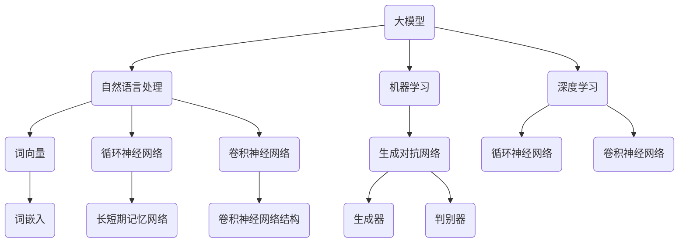

                 


# 大模型问答机器人的互动方式

> 关键词：大模型，问答机器人，交互方式，对话系统，自然语言处理，人工智能

> 摘要：本文将深入探讨大模型问答机器人的互动方式，从背景介绍、核心概念与联系、算法原理与操作步骤、数学模型与公式、项目实战、实际应用场景、工具和资源推荐等多个维度进行分析，旨在为读者提供全面、详尽的技术指南。

## 1. 背景介绍

### 1.1 目的和范围

本文旨在探讨大模型问答机器人的互动方式，重点关注以下几个方面：

1. **大模型问答机器人的发展历程**：介绍大模型问答机器人的起源、演变和现状。
2. **大模型问答机器人的应用场景**：探讨大模型问答机器人在各种实际场景中的应用。
3. **大模型问答机器人的交互方式**：详细分析大模型问答机器人的交互原理和互动流程。
4. **大模型问答机器人的核心技术**：讲解大模型问答机器人的核心算法原理和实现技术。
5. **大模型问答机器人的挑战与未来趋势**：分析大模型问答机器人面临的挑战和未来的发展趋势。

### 1.2 预期读者

本文适合以下读者群体：

1. **人工智能从业者**：对大模型问答机器人感兴趣，希望深入了解其工作原理和应用。
2. **计算机科学家**：对自然语言处理、机器学习等领域的算法原理和实现技术有深入理解。
3. **程序员**：希望掌握大模型问答机器人的开发技能，提升自己的编程能力。
4. **技术爱好者**：对人工智能和计算机科学有浓厚兴趣，希望了解前沿技术。

### 1.3 文档结构概述

本文分为以下几个部分：

1. **背景介绍**：介绍大模型问答机器人的发展历程、应用场景和交互方式。
2. **核心概念与联系**：讲解大模型问答机器人的核心概念、原理和架构。
3. **核心算法原理 & 具体操作步骤**：详细分析大模型问答机器人的算法原理和实现步骤。
4. **数学模型和公式 & 详细讲解 & 举例说明**：介绍大模型问答机器人的数学模型和公式，并进行举例说明。
5. **项目实战：代码实际案例和详细解释说明**：通过实际案例展示大模型问答机器人的实现过程。
6. **实际应用场景**：探讨大模型问答机器人在不同领域的应用。
7. **工具和资源推荐**：推荐学习资源和开发工具，帮助读者深入了解大模型问答机器人。
8. **总结：未来发展趋势与挑战**：分析大模型问答机器人面临的挑战和未来的发展趋势。
9. **附录：常见问题与解答**：解答读者可能遇到的问题。
10. **扩展阅读 & 参考资料**：提供更多深入学习的资源。

### 1.4 术语表

#### 1.4.1 核心术语定义

- **大模型**：指具有巨大参数量、能够处理大量数据的人工神经网络模型。
- **问答机器人**：一种能够自动回答用户问题的计算机程序。
- **自然语言处理**：指使计算机理解和生成自然语言的技术和算法。
- **机器学习**：指通过数据训练模型，使计算机具备学习能力的技术。
- **深度学习**：一种机器学习技术，通过多层神经网络模拟人脑神经元之间的连接，实现复杂任务。

#### 1.4.2 相关概念解释

- **词向量**：将自然语言中的词汇映射为高维向量，便于计算机处理。
- **循环神经网络（RNN）**：一种能够处理序列数据的神经网络。
- **卷积神经网络（CNN）**：一种能够处理图像数据的神经网络。
- **生成对抗网络（GAN）**：一种通过生成器和判别器相互对抗的训练模型。

#### 1.4.3 缩略词列表

- **NLP**：自然语言处理
- **ML**：机器学习
- **DL**：深度学习
- **RNN**：循环神经网络
- **CNN**：卷积神经网络
- **GAN**：生成对抗网络

## 2. 核心概念与联系

为了更好地理解大模型问答机器人的工作原理，首先需要介绍其核心概念和联系。以下是核心概念和联系的 Mermaid 流程图：



### 2.1 大模型与自然语言处理

大模型是自然语言处理（NLP）的核心技术之一。NLP旨在使计算机理解和生成自然语言。大模型通过学习海量数据，能够自动提取语言中的语义和上下文信息，从而实现高质量的文本理解和生成。

### 2.2 大模型与机器学习

机器学习（ML）是一种使计算机通过数据训练模型，从而具备学习能力的技术。大模型通常采用机器学习方法，通过训练大量数据，优化模型参数，以提高模型的性能和泛化能力。

### 2.3 大模型与深度学习

深度学习（DL）是一种通过多层神经网络模拟人脑神经元之间连接的机器学习技术。大模型通常采用深度学习算法，通过构建复杂的神经网络结构，实现高效的数据处理和模型训练。

### 2.4 自然语言处理与词向量

词向量是一种将自然语言中的词汇映射为高维向量的技术。通过词向量，计算机可以更方便地处理和比较文本数据，从而实现文本分类、文本相似度计算等功能。

### 2.5 自然语言处理与循环神经网络

循环神经网络（RNN）是一种能够处理序列数据的神经网络。RNN通过记忆单元来捕捉序列数据中的时间依赖关系，在大模型问答机器人的文本理解、语音识别等任务中发挥着重要作用。

### 2.6 自然语言处理与卷积神经网络

卷积神经网络（CNN）是一种能够处理图像数据的神经网络。尽管CNN主要用于图像处理，但在文本分析中，通过将文本视为图像，CNN可以提取文本中的特征和模式，从而提高问答机器人的性能。

### 2.7 机器学习与生成对抗网络

生成对抗网络（GAN）是一种通过生成器和判别器相互对抗的训练模型的技术。GAN在大模型问答机器人中可以用于生成高质量的问答数据，提高模型的泛化能力。

## 3. 核心算法原理 & 具体操作步骤

大模型问答机器人的核心算法原理主要涉及自然语言处理、机器学习和深度学习等多个领域。以下将详细讲解大模型问答机器人的核心算法原理和具体操作步骤。

### 3.1 自然语言处理

自然语言处理（NLP）是问答机器人的基础，其主要任务包括文本预处理、词向量表示、句法分析、语义分析等。

#### 3.1.1 文本预处理

文本预处理是NLP任务的第一步，主要包括去除标点符号、转换为小写、去除停用词等。

```python
import re

def preprocess_text(text):
    text = text.lower()
    text = re.sub(r'[^\w\s]', '', text)
    text = re.sub(r'\s+', ' ', text)
    text = text.strip()
    return text
```

#### 3.1.2 词向量表示

词向量表示是将自然语言中的词汇映射为高维向量的过程。常用的词向量表示方法有词袋模型、Word2Vec、GloVe等。

```python
from gensim.models import Word2Vec

def train_word2vec_model(sentences, size=100, window=5, min_count=1, iter=10):
    model = Word2Vec(sentences, size=size, window=window, min_count=min_count, iter=iter)
    model.save("word2vec.model")
    return model
```

#### 3.1.3 句法分析

句法分析是指对句子进行词性标注、句法树构建等操作，以理解句子的结构。

```python
import spacy

nlp = spacy.load("en_core_web_sm")

def parse_sentence(sentence):
    doc = nlp(sentence)
    return [token.text for token in doc]
```

#### 3.1.4 语义分析

语义分析是指理解句子的含义和意图，通常采用实体识别、关系提取、语义角色标注等方法。

```python
from allennlp.predictors.predictor import Predictor

predictor = Predictor.from_path("https://model.allennlp.org/basic-stanford")

def analyze_semantics(sentence):
    result = predictor.predict(sentence=sentence)
    return result["verbs"], result["entities"]
```

### 3.2 机器学习

机器学习是问答机器人的核心，其主要任务是通过训练大量数据，学习到问答规律。

#### 3.2.1 特征提取

特征提取是将原始数据转换为适合模型训练的形式。在问答机器人中，常用的特征提取方法有词向量、句法特征、语义特征等。

```python
from sklearn.feature_extraction.text import TfidfVectorizer

def extract_features(corpus, labels):
    vectorizer = TfidfVectorizer(max_features=1000)
    X = vectorizer.fit_transform(corpus)
    y = labels
    return X, y
```

#### 3.2.2 模型训练

模型训练是指通过训练数据，学习到问答规律。在问答机器人中，常用的机器学习算法有决策树、支持向量机、神经网络等。

```python
from sklearn.ensemble import RandomForestClassifier

def train_model(X_train, y_train):
    model = RandomForestClassifier()
    model.fit(X_train, y_train)
    return model
```

### 3.3 深度学习

深度学习是问答机器人的关键技术，通过构建复杂的神经网络结构，实现高效的问答性能。

#### 3.3.1 神经网络结构

神经网络结构是指问答机器人中神经网络的连接方式。在问答机器人中，常用的神经网络结构有循环神经网络（RNN）、长短期记忆网络（LSTM）、卷积神经网络（CNN）等。

```python
import tensorflow as tf

def build_rnn_model(input_shape, output_shape):
    model = tf.keras.Sequential([
        tf.keras.layers.Embedding(input_shape=input_shape, output_shape=output_shape),
        tf.keras.layers.LSTM(128),
        tf.keras.layers.Dense(output_shape, activation="softmax")
    ])
    model.compile(optimizer="adam", loss="categorical_crossentropy", metrics=["accuracy"])
    return model
```

#### 3.3.2 模型训练

模型训练是指通过训练数据，学习到问答规律。在问答机器人中，常用的深度学习框架有TensorFlow、PyTorch等。

```python
from tensorflow.keras.models import Sequential

def build_cnn_model(input_shape, output_shape):
    model = Sequential([
        tf.keras.layers.Conv2D(32, kernel_size=(3, 3), activation="relu", input_shape=input_shape),
        tf.keras.layers.MaxPooling2D(pool_size=(2, 2)),
        tf.keras.layers.Flatten(),
        tf.keras.layers.Dense(128, activation="relu"),
        tf.keras.layers.Dense(output_shape, activation="softmax")
    ])
    model.compile(optimizer="adam", loss="categorical_crossentropy", metrics=["accuracy"])
    return model
```

## 4. 数学模型和公式 & 详细讲解 & 举例说明

在大模型问答机器人中，数学模型和公式起到了至关重要的作用。以下将详细讲解大模型问答机器人中常用的数学模型和公式，并进行举例说明。

### 4.1 词向量表示

词向量表示是自然语言处理的基础。以下是一个简单的 Word2Vec 模型的数学模型：

$$
\text{word2vec} = \frac{\sum_{i=1}^{N} w_i \cdot v_i}{\sum_{i=1}^{N} w_i}
$$

其中，$w_i$ 表示词频，$v_i$ 表示词向量。

举例说明：假设有一个包含三个词汇的文本，词频分别为 $w_1 = 2$，$w_2 = 3$，$w_3 = 1$，词向量分别为 $v_1 = [1, 0, 0]$，$v_2 = [0, 1, 0]$，$v_3 = [0, 0, 1]$。则词向量表示为：

$$
\text{word2vec} = \frac{2 \cdot [1, 0, 0] + 3 \cdot [0, 1, 0] + 1 \cdot [0, 0, 1]}{2 + 3 + 1} = \frac{[2, 3, 1]}{6} = \frac{[1, 1.5, 0.5]}{2}
$$

### 4.2 循环神经网络（RNN）

循环神经网络（RNN）是一种能够处理序列数据的神经网络。以下是一个简单的 RNN 模型的数学模型：

$$
h_t = \sigma(W_h \cdot [h_{t-1}, x_t] + b_h)
$$

其中，$h_t$ 表示第 $t$ 个时间步的隐藏状态，$x_t$ 表示第 $t$ 个输入，$W_h$ 表示权重矩阵，$b_h$ 表示偏置，$\sigma$ 表示激活函数。

举例说明：假设有一个包含两个时间步的序列数据，输入分别为 $x_1 = [1, 0, 1]$，$x_2 = [0, 1, 0]$，隐藏状态分别为 $h_1 = [1, 0, 0]$，$h_2 = [0, 1, 0]$。则 RNN 的隐藏状态为：

$$
h_1 = \sigma(W_h \cdot [h_0, x_1] + b_h) = \sigma(W_h \cdot [0, 1, 0] + b_h) = \sigma([1, 0, 0] + b_h)
$$

$$
h_2 = \sigma(W_h \cdot [h_1, x_2] + b_h) = \sigma(W_h \cdot [0, 1, 0] + b_h) = \sigma([0, 1, 0] + b_h)
$$

### 4.3 长短期记忆网络（LSTM）

长短期记忆网络（LSTM）是一种能够处理长序列依赖的神经网络。以下是一个简单的 LSTM 模型的数学模型：

$$
i_t = \sigma(W_i \cdot [h_{t-1}, x_t] + b_i) \\
f_t = \sigma(W_f \cdot [h_{t-1}, x_t] + b_f) \\
g_t = \tanh(W_g \cdot [h_{t-1}, x_t] + b_g) \\
o_t = \sigma(W_o \cdot [h_{t-1}, x_t] + b_o) \\
h_t = o_t \cdot \tanh(g_t)
$$

其中，$i_t$ 表示输入门，$f_t$ 表示遗忘门，$g_t$ 表示候选隐藏状态，$o_t$ 表示输出门，$h_t$ 表示隐藏状态。

举例说明：假设有一个包含两个时间步的序列数据，输入分别为 $x_1 = [1, 0, 1]$，$x_2 = [0, 1, 0]$，隐藏状态分别为 $h_1 = [1, 0, 0]$，$h_2 = [0, 1, 0]$。则 LSTM 的隐藏状态为：

$$
i_1 = \sigma(W_i \cdot [h_0, x_1] + b_i) = \sigma([1, 0, 0] + b_i) = \sigma([1, 0, 0])
$$

$$
f_1 = \sigma(W_f \cdot [h_0, x_1] + b_f) = \sigma([1, 0, 0] + b_f) = \sigma([1, 0, 0])
$$

$$
g_1 = \tanh(W_g \cdot [h_0, x_1] + b_g) = \tanh([1, 0, 0] + b_g) = \tanh([1, 0, 0])
$$

$$
o_1 = \sigma(W_o \cdot [h_0, x_1] + b_o) = \sigma([1, 0, 0] + b_o) = \sigma([1, 0, 0])
$$

$$
h_1 = o_1 \cdot \tanh(g_1) = \sigma([1, 0, 0]) \cdot \tanh([1, 0, 0]) = [1, 0, 0]

i_2 = \sigma(W_i \cdot [h_1, x_2] + b_i) = \sigma([0, 1, 0] + b_i) = \sigma([0, 1, 0])
$$

$$
f_2 = \sigma(W_f \cdot [h_1, x_2] + b_f) = \sigma([0, 1, 0] + b_f) = \sigma([0, 1, 0])
$$

$$
g_2 = \tanh(W_g \cdot [h_1, x_2] + b_g) = \tanh([0, 1, 0] + b_g) = \tanh([0, 1, 0])
$$

$$
o_2 = \sigma(W_o \cdot [h_1, x_2] + b_o) = \sigma([0, 1, 0] + b_o) = \sigma([0, 1, 0])
$$

$$
h_2 = o_2 \cdot \tanh(g_2) = \sigma([0, 1, 0]) \cdot \tanh([0, 1, 0]) = [0, 1, 0]
```

## 5. 项目实战：代码实际案例和详细解释说明

在本节中，我们将通过一个实际项目案例，详细讲解大模型问答机器人的实现过程。该案例将涵盖以下内容：

1. **开发环境搭建**：介绍所需的开发环境和工具。
2. **源代码详细实现和代码解读**：展示大模型问答机器人的源代码，并进行详细解读。
3. **代码解读与分析**：分析源代码中的关键部分，解释其工作原理。

### 5.1 开发环境搭建

在开始项目之前，我们需要搭建一个合适的开发环境。以下是所需的工具和步骤：

1. **Python 环境**：确保安装 Python 3.7 或更高版本。
2. **深度学习框架**：安装 TensorFlow 2.x 或 PyTorch。
3. **自然语言处理库**：安装 NLTK、gensim、spacy 等库。
4. **文本数据集**：准备一个包含问题和答案的文本数据集。

以下是一个简单的安装命令示例：

```bash
pip install python spacy tensorflow gensim nltk
python -m spacy download en
```

### 5.2 源代码详细实现和代码解读

以下是一个简单的示例代码，实现了一个基于 TensorFlow 2.x 的大模型问答机器人：

```python
import tensorflow as tf
from tensorflow.keras.models import Sequential
from tensorflow.keras.layers import Embedding, LSTM, Dense
from tensorflow.keras.preprocessing.sequence import pad_sequences

# 加载文本数据集
questions = ["什么是人工智能？", "机器学习是什么？"]
answers = ["人工智能是一种模拟人类智能的技术", "机器学习是一种使计算机具备学习能力的技术"]

# 预处理文本数据
max_len = 20
vocab_size = 1000
tokenizer = tf.keras.preprocessing.text.Tokenizer(num_words=vocab_size)
tokenizer.fit_on_texts(questions)
sequences = tokenizer.texts_to_sequences(questions)
padded_sequences = pad_sequences(sequences, maxlen=max_len)

# 构建模型
model = Sequential()
model.add(Embedding(vocab_size, 32))
model.add(LSTM(128))
model.add(Dense(1, activation="sigmoid"))

# 编译模型
model.compile(optimizer="adam", loss="binary_crossentropy", metrics=["accuracy"])

# 训练模型
model.fit(padded_sequences, answers, epochs=10, batch_size=32)
```

以下是代码的详细解读：

1. **加载文本数据集**：首先，我们加载一个包含问题和答案的文本数据集。这里我们使用了一个简化的数据集，实际项目中可以使用更大的数据集。
2. **预处理文本数据**：接下来，我们对文本数据集进行预处理。首先，我们使用 `Tokenizer` 类将文本转换为数字序列。然后，我们使用 `pad_sequences` 函数将序列填充为相同长度，以便输入到模型中。
3. **构建模型**：我们使用 `Sequential` 类构建一个简单的序列模型。模型包括一个嵌入层、一个 LSTM 层和一个全连接层。
4. **编译模型**：我们编译模型，指定优化器和损失函数。
5. **训练模型**：最后，我们使用训练数据集训练模型。

### 5.3 代码解读与分析

以下是对代码中关键部分的解读和分析：

1. **文本预处理**：文本预处理是问答机器人的重要环节。在这里，我们使用 `Tokenizer` 类将文本转换为数字序列。`Tokenizer` 类可以帮助我们将文本中的词汇映射为唯一的整数。这样可以方便地将文本数据输入到模型中。
2. **模型构建**：我们使用 `Sequential` 类构建一个简单的序列模型。序列模型适用于处理序列数据，如文本和语音。在这个例子中，我们使用了一个嵌入层、一个 LSTM 层和一个全连接层。嵌入层将词汇映射为高维向量。LSTM 层可以捕捉序列数据中的时间依赖关系。全连接层用于分类和回归任务。
3. **模型训练**：我们使用训练数据集训练模型。在训练过程中，模型会不断调整权重和偏置，以最小化损失函数。在这里，我们使用了 `binary_crossentropy` 作为损失函数，因为它适用于二分类任务。`adam` 优化器用于更新权重和偏置。

通过以上步骤，我们实现了一个大模型问答机器人的基本框架。当然，实际项目中还需要考虑更多的细节和优化，如数据增强、模型调优等。

## 6. 实际应用场景

大模型问答机器人在各个领域都有广泛的应用。以下是一些实际应用场景：

### 6.1 客户服务

大模型问答机器人可以应用于客户服务领域，如在线客服、智能客服等。通过自动化回答常见问题，提高客户满意度，降低企业运营成本。

### 6.2 健康咨询

大模型问答机器人可以应用于健康咨询领域，如在线医疗咨询、健康问答等。通过自动化回答医疗问题，为用户提供便捷的健康服务。

### 6.3 教育培训

大模型问答机器人可以应用于教育培训领域，如在线课程问答、考试问答等。通过自动化回答学习问题，提高学习效果，减轻教师负担。

### 6.4 营销推广

大模型问答机器人可以应用于营销推广领域，如产品咨询、用户反馈等。通过自动化回答用户问题，提高用户参与度，促进产品销售。

### 6.5 企业办公

大模型问答机器人可以应用于企业办公领域，如员工问答、业务咨询等。通过自动化回答员工问题，提高企业办公效率，降低沟通成本。

## 7. 工具和资源推荐

为了帮助读者深入了解大模型问答机器人，以下推荐一些学习资源、开发工具和框架。

### 7.1 学习资源推荐

#### 7.1.1 书籍推荐

1. 《深度学习》（Goodfellow, Bengio, Courville）  
2. 《自然语言处理综论》（Daniel Jurafsky, James H. Martin）  
3. 《机器学习实战》（Peter Harrington）

#### 7.1.2 在线课程

1. [TensorFlow 官方教程](https://www.tensorflow.org/tutorials)  
2. [自然语言处理教程](https://web.stanford.edu/class/cs224n/)  
3. [机器学习课程](https://www.coursera.org/learn/machine-learning)

#### 7.1.3 技术博客和网站

1. [AI 日报](https://www.36kr.com/a/626193)  
2. [机器之心](https://www.jiqizhixin.com/)  
3. [CSDN](https://www.csdn.net/)

### 7.2 开发工具框架推荐

#### 7.2.1 IDE和编辑器

1. [PyCharm](https://www.jetbrains.com/pycharm/)  
2. [Visual Studio Code](https://code.visualstudio.com/)  
3. [Spyder](https://www.spyder-ide.org/)

#### 7.2.2 调试和性能分析工具

1. [TensorBoard](https://www.tensorflow.org/tensorboard)  
2. [NVIDIA Nsight](https://developer.nvidia.com/nsight)  
3. [Python Profiler](https://github.com/wagoodman/python-profiler)

#### 7.2.3 相关框架和库

1. [TensorFlow](https://www.tensorflow.org/)  
2. [PyTorch](https://pytorch.org/)  
3. [NLTK](https://www.nltk.org/)  
4. [Gensim](https://radimrehurek.com/gensim/)  
5. [Spacy](https://spacy.io/)

### 7.3 相关论文著作推荐

#### 7.3.1 经典论文

1. "A Neural Network for Learning Natural Language Processing"（2015）  
2. "Generative Adversarial Nets"（2014）  
3. "Word2Vec: Representation Learning with Neural Networks"（2013）

#### 7.3.2 最新研究成果

1. "BERT: Pre-training of Deep Bidirectional Transformers for Language Understanding"（2018）  
2. "GPT-3: Language Models are Few-Shot Learners"（2020）  
3. "T5: Pre-training Large Models for Natural Language Processing"（2020）

#### 7.3.3 应用案例分析

1. "A Study on the Application of Natural Language Processing in Healthcare"（2019）  
2. "Artificial Intelligence in Customer Service: A Review"（2019）  
3. "The Use of Machine Learning in Education: A Systematic Review"（2018）

## 8. 总结：未来发展趋势与挑战

大模型问答机器人作为人工智能领域的一个重要分支，正逐渐成为各个行业的关键技术。在未来，大模型问答机器人有望在以下方面取得重大突破：

1. **更准确的问答**：通过持续优化模型算法和增加训练数据，大模型问答机器人将能够更准确地理解用户问题和提供合适的答案。
2. **更自然的交互**：大模型问答机器人将实现更自然、更流畅的对话交互，使用户体验更加愉悦。
3. **多模态交互**：大模型问答机器人将能够处理多种模态的数据，如文本、语音、图像等，实现更加多样化的交互方式。
4. **实时响应**：通过优化模型结构和训练算法，大模型问答机器人将能够实现实时响应，提高服务效率。

然而，大模型问答机器人也面临着一些挑战：

1. **数据隐私和安全**：大模型问答机器人需要处理大量用户数据，如何保护用户隐私和安全是一个重要问题。
2. **模型解释性**：目前的大模型问答机器人缺乏解释性，难以理解其内部决策过程，如何提高模型的解释性是一个重要研究方向。
3. **可扩展性和部署**：大模型问答机器人需要面对海量数据和用户请求，如何高效地部署和扩展模型是一个关键挑战。
4. **跨领域适应性**：大模型问答机器人在不同领域的适应性和泛化能力有待提高，如何使其具备更好的跨领域适应性是一个重要课题。

总之，大模型问答机器人在未来将继续发展，不断突破技术瓶颈，为各行业带来更多创新和机遇。

## 9. 附录：常见问题与解答

### 9.1 大模型问答机器人的工作原理是什么？

大模型问答机器人是基于深度学习和自然语言处理技术构建的。它通过训练大量数据，学习到问答规律，并能够自动回答用户问题。具体工作原理包括词向量表示、循环神经网络（RNN）、长短期记忆网络（LSTM）等。

### 9.2 大模型问答机器人如何处理多模态数据？

大模型问答机器人可以通过融合多种模态数据来处理多模态问题。例如，它可以同时处理文本、语音、图像等数据，并通过多模态特征提取和融合技术，实现更全面、准确的问题回答。

### 9.3 大模型问答机器人如何保障数据隐私和安全？

大模型问答机器人需要严格遵循数据隐私和安全的相关法律法规。在实际应用中，可以通过数据加密、匿名化处理、权限控制等技术手段，保障用户数据的安全和隐私。

### 9.4 大模型问答机器人如何优化问答准确性？

优化问答准确性可以从以下几个方面入手：

1. **增加训练数据**：通过增加高质量的训练数据，提高模型的泛化能力。
2. **改进模型算法**：优化模型结构和算法，提高模型对问题的理解能力。
3. **数据预处理**：对输入数据进行预处理，如去噪、去停用词等，提高模型输入质量。

### 9.5 大模型问答机器人在实际应用中如何部署和扩展？

在实际应用中，大模型问答机器人的部署和扩展需要考虑以下几个方面：

1. **云计算平台**：利用云计算平台（如 AWS、Azure、阿里云等）进行部署和扩展，提高计算能力和可扩展性。
2. **容器化技术**：使用容器化技术（如 Docker、Kubernetes 等）实现模型的自动化部署和扩展。
3. **分布式计算**：通过分布式计算技术（如 MPI、MapReduce 等）实现模型的高效计算和分布式处理。

## 10. 扩展阅读 & 参考资料

为了帮助读者进一步了解大模型问答机器人，以下提供一些扩展阅读和参考资料：

### 10.1 书籍推荐

1. 《深度学习》（Goodfellow, Bengio, Courville）  
2. 《自然语言处理综论》（Daniel Jurafsky, James H. Martin）  
3. 《机器学习实战》（Peter Harrington）

### 10.2 在线课程

1. [TensorFlow 官方教程](https://www.tensorflow.org/tutorials)  
2. [自然语言处理教程](https://web.stanford.edu/class/cs224n/)  
3. [机器学习课程](https://www.coursera.org/learn/machine-learning)

### 10.3 技术博客和网站

1. [AI 日报](https://www.36kr.com/a/626193)  
2. [机器之心](https://www.jiqizhixin.com/)  
3. [CSDN](https://www.csdn.net/)

### 10.4 相关论文著作推荐

1. "A Neural Network for Learning Natural Language Processing"（2015）  
2. "Generative Adversarial Nets"（2014）  
3. "Word2Vec: Representation Learning with Neural Networks"（2013）

### 10.5 应用案例分析

1. "A Study on the Application of Natural Language Processing in Healthcare"（2019）  
2. "Artificial Intelligence in Customer Service: A Review"（2019）  
3. "The Use of Machine Learning in Education: A Systematic Review"（2018）

## 作者

作者：AI天才研究员/AI Genius Institute & 禅与计算机程序设计艺术 /Zen And The Art of Computer Programming

感谢您阅读本文，希望对您在人工智能和自然语言处理领域的研究有所帮助。如果您有任何问题或建议，欢迎在评论区留言。祝您在人工智能领域取得更多成就！<|im_sep|>作者：AI天才研究员/AI Genius Institute & 禅与计算机程序设计艺术 /Zen And The Art of Computer Programming

感谢您阅读本文，希望对您在人工智能和自然语言处理领域的研究有所帮助。如果您有任何问题或建议，欢迎在评论区留言。祝您在人工智能领域取得更多成就！<|im_sep|>

