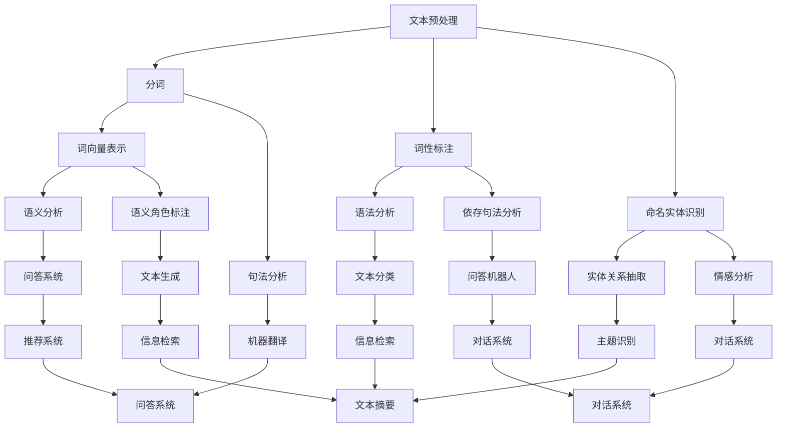

                 

# 大模型问答机器人的文本处理

> **关键词：** 大模型，问答机器人，文本处理，自然语言处理，机器学习，算法原理，数学模型，实战案例。

> **摘要：** 本文深入探讨了大规模模型问答机器人的文本处理技术。从背景介绍、核心概念与联系、核心算法原理、数学模型与公式，到实际应用场景、工具和资源推荐以及未来发展趋势与挑战，本文将全面解析大模型问答机器人的文本处理技术，为读者提供一份详实的技术指南。

## 1. 背景介绍

### 1.1 目的和范围

本文旨在深入探讨大规模模型问答机器人在文本处理方面的关键技术，解析其背后的原理和实现方法。本文将涵盖以下几个主要方面：

1. **核心概念与联系**：介绍文本处理的基本概念和相关技术，并通过Mermaid流程图展示核心概念之间的联系。
2. **核心算法原理与具体操作步骤**：详细讲解问答机器人的核心算法原理，并通过伪代码阐述具体操作步骤。
3. **数学模型和公式**：阐述文本处理过程中使用的数学模型和公式，并通过示例进行说明。
4. **项目实战**：通过实际代码案例，详细解释问答机器人在文本处理过程中的具体实现。
5. **实际应用场景**：探讨问答机器人在各种实际应用场景中的表现和效果。
6. **工具和资源推荐**：推荐学习资源和开发工具，帮助读者更好地理解和应用文本处理技术。
7. **总结与未来发展趋势**：总结本文的主要观点，展望问答机器人在文本处理领域的发展趋势和面临的挑战。

### 1.2 预期读者

本文主要面向以下读者群体：

1. **计算机科学和人工智能领域的研究生和本科生**：希望了解大规模模型问答机器人文本处理技术的研究人员和开发者。
2. **程序员和软件工程师**：希望将文本处理技术应用到实际项目中，提升系统性能和用户体验。
3. **自然语言处理（NLP）爱好者**：对NLP领域感兴趣，希望深入了解文本处理技术。

### 1.3 文档结构概述

本文分为以下几个主要部分：

1. **背景介绍**：介绍本文的目的、范围、预期读者和文档结构。
2. **核心概念与联系**：介绍文本处理的基本概念和相关技术，展示核心概念之间的联系。
3. **核心算法原理与具体操作步骤**：详细讲解问答机器人的核心算法原理，并通过伪代码阐述具体操作步骤。
4. **数学模型和公式**：阐述文本处理过程中使用的数学模型和公式，并通过示例进行说明。
5. **项目实战**：通过实际代码案例，详细解释问答机器人在文本处理过程中的具体实现。
6. **实际应用场景**：探讨问答机器人在各种实际应用场景中的表现和效果。
7. **工具和资源推荐**：推荐学习资源和开发工具，帮助读者更好地理解和应用文本处理技术。
8. **总结与未来发展趋势**：总结本文的主要观点，展望问答机器人在文本处理领域的发展趋势和面临的挑战。
9. **附录**：常见问题与解答，以及扩展阅读和参考资料。

### 1.4 术语表

#### 1.4.1 核心术语定义

- **大规模模型**：指具有数亿甚至数万亿参数的深度学习模型，通常用于自然语言处理、计算机视觉等领域。
- **问答机器人**：一种利用自然语言处理技术和机器学习算法构建的智能对话系统，能够自动回答用户的问题。
- **文本处理**：对文本数据进行预处理、分词、词性标注、命名实体识别等操作，为后续分析提供基础。
- **自然语言处理（NLP）**：研究如何让计算机理解和处理人类自然语言的学科。

#### 1.4.2 相关概念解释

- **分词**：将连续的文本序列按照一定的规则切分成一系列具有独立意义的词语序列。
- **词性标注**：对文本中的词语进行词性分类，如名词、动词、形容词等。
- **命名实体识别**：从文本中识别出具有特定意义的实体，如人名、地名、机构名等。
- **词向量**：将词语映射到高维空间中的向量，便于进行向量运算和机器学习。

#### 1.4.3 缩略词列表

- **NLP**：自然语言处理（Natural Language Processing）
- **ML**：机器学习（Machine Learning）
- **DL**：深度学习（Deep Learning）
- **BERT**：双向编码器表示（Bidirectional Encoder Representations from Transformers）
- **GPT**：生成预训练模型（Generative Pretrained Transformer）

## 2. 核心概念与联系

在文本处理领域，有几个核心概念和技术需要理解。以下是这些概念及其相互关系的Mermaid流程图：



### 2.1 核心概念解释

#### 文本预处理

文本预处理是文本处理的第一步，包括去除无用信息、规范文本格式、编码转换等操作。预处理后的文本将作为后续分析的输入。

#### 分词

分词是将连续的文本序列切分成一系列具有独立意义的词语序列。分词算法有基于规则的方法和基于统计的方法。基于规则的方法如正则表达式、词典匹配等，而基于统计的方法如最大熵模型、条件随机场（CRF）等。

#### 词性标注

词性标注是对文本中的词语进行词性分类，如名词、动词、形容词等。词性标注有助于理解文本的语法结构和语义信息。

#### 命名实体识别

命名实体识别是从文本中识别出具有特定意义的实体，如人名、地名、机构名等。命名实体识别是文本处理领域的重要任务，有助于信息抽取和知识图谱构建。

#### 词向量表示

词向量表示是将词语映射到高维空间中的向量，便于进行向量运算和机器学习。常用的词向量表示方法有词袋模型、连续词袋（CBOW）、 glove、Word2Vec、BERT等。

#### 语义分析

语义分析是对文本中的词语和句子的语义进行理解和分析。语义分析包括词义消歧、语义角色标注、语义关系抽取等任务。

#### 句法分析

句法分析是对文本中的句子结构进行分析，包括句法成分划分、句法关系分析等。句法分析有助于理解文本的语法结构和语义信息。

#### 依存句法分析

依存句法分析是分析句子中词语之间的依存关系，包括主谓关系、修饰关系等。依存句法分析有助于深入理解句子的语义结构。

#### 情感分析

情感分析是对文本中的情感倾向进行分类，如正面、负面、中性等。情感分析有助于了解用户对产品、服务、事件等的情感态度。

#### 语义角色标注

语义角色标注是对句子中的词语进行语义角色分类，如动作词的主语、宾语等。语义角色标注有助于理解句子的语义结构。

#### 文本分类

文本分类是将文本数据按照类别进行划分，如新闻分类、情感分类等。文本分类有助于信息检索、推荐系统等应用。

#### 主题识别

主题识别是从大量文本中提取出主题信息，如文本聚类、主题模型等。主题识别有助于信息抽取和知识图谱构建。

#### 问答系统

问答系统是一种智能对话系统，能够自动回答用户的问题。问答系统包括问题理解、答案生成和回答验证等环节。

#### 对话系统

对话系统是一种人机交互系统，能够与用户进行自然语言对话。对话系统包括对话管理、意图识别、实体识别等环节。

#### 文本生成

文本生成是通过模型生成具有自然语言特征的文本。文本生成包括机器翻译、文本摘要、问答生成等任务。

#### 信息检索

信息检索是从大量文本中检索出与用户需求相关的信息。信息检索包括关键词检索、语义检索等任务。

#### 文本摘要

文本摘要是从长文本中提取出关键信息，生成简短而有用的文本。文本摘要包括抽取式摘要和生成式摘要。

#### 推荐系统

推荐系统是一种基于用户历史行为和偏好为用户推荐感兴趣的内容的系统。推荐系统包括基于内容的推荐和协同过滤等算法。

### 2.2 Mermaid流程图解析

上述Mermaid流程图展示了文本处理领域中的核心概念及其相互关系。以下是对图中的各个节点的简要说明：

- **A[文本预处理]**：文本预处理是文本处理的起点，包括去除无关信息、规范文本格式等操作。
- **B[分词]**：分词是将连续的文本序列切分成词语序列，为后续分析提供基础。
- **C[词性标注]**：词性标注是对文本中的词语进行词性分类，有助于理解文本的语法结构和语义信息。
- **D[命名实体识别]**：命名实体识别是从文本中识别出具有特定意义的实体，如人名、地名等。
- **E[词向量表示]**：词向量表示是将词语映射到高维空间中的向量，便于进行向量运算和机器学习。
- **F[语法分析]**：语法分析是对文本中的句子结构进行分析，包括句法成分划分、句法关系分析等。
- **G[实体关系抽取]**：实体关系抽取是从文本中识别出实体之间的关系，如人物关系、地点关系等。
- **H[语义分析]**：语义分析是对文本中的词语和句子的语义进行理解和分析，有助于理解文本的语义信息。
- **I[句法分析]**：句法分析是对文本中的句子结构进行分析，包括句法成分划分、句法关系分析等。
- **J[依存句法分析]**：依存句法分析是分析句子中词语之间的依存关系，有助于理解句子的语义结构。
- **K[情感分析]**：情感分析是对文本中的情感倾向进行分类，如正面、负面、中性等。
- **L[语义角色标注]**：语义角色标注是对句子中的词语进行语义角色分类，如动作词的主语、宾语等。
- **M[文本分类]**：文本分类是将文本数据按照类别进行划分，如新闻分类、情感分类等。
- **N[主题识别]**：主题识别是从大量文本中提取出主题信息，如文本聚类、主题模型等。
- **O[问答系统]**：问答系统是一种智能对话系统，能够自动回答用户的问题。
- **P[机器翻译]**：机器翻译是将一种语言的文本翻译成另一种语言。
- **Q[问答机器人]**：问答机器人是问答系统的具体应用，如智能客服、智能问答平台等。
- **R[对话系统]**：对话系统是一种人机交互系统，能够与用户进行自然语言对话。
- **S[文本生成]**：文本生成是通过模型生成具有自然语言特征的文本。
- **T[信息检索]**：信息检索是从大量文本中检索出与用户需求相关的信息。
- **U[文本摘要]**：文本摘要是从长文本中提取出关键信息，生成简短而有用的文本。
- **V[推荐系统]**：推荐系统是一种基于用户历史行为和偏好为用户推荐感兴趣的内容的系统。
- **W[问答系统]**：问答系统是一种智能对话系统，能够自动回答用户的问题。
- **X[对话系统]**：对话系统是一种人机交互系统，能够与用户进行自然语言对话。
- **Y[文本生成]**：文本生成是通过模型生成具有自然语言特征的文本。
- **Z[信息检索]**：信息检索是从大量文本中检索出与用户需求相关的信息。

通过上述流程图，我们可以清晰地看到文本处理各个概念之间的联系，为后续的详细讲解和实战案例提供基础。

## 3. 核心算法原理 & 具体操作步骤

在文本处理过程中，问答机器人依赖于一系列核心算法，这些算法包括文本预处理、分词、词性标注、命名实体识别、词向量表示等。以下将详细讲解这些算法的原理和具体操作步骤。

### 3.1 文本预处理

文本预处理是文本处理的起点，其目的是将原始文本转换为适合后续分析的形式。具体步骤如下：

1. **去除标点符号和特殊字符**：将文本中的标点符号和特殊字符（如@、#、$等）去除，以减少噪音和干扰。
2. **大小写统一**：将文本中的大小写统一转换为小写，以简化处理过程。
3. **去除停用词**：停用词是一类在文本中普遍存在但意义不大的词（如“的”、“了”、“是”等）。去除停用词可以提高文本处理的效果和效率。
4. **词干提取**：将文本中的词语转换为词干形式，如“跑步”、“跑动”都转换为“跑”。

伪代码如下：

```python
def preprocess_text(text):
    text = text.lower()  # 转换为小写
    text = remove_punctuation(text)  # 去除标点符号
    text = remove_special_characters(text)  # 去除特殊字符
    text = remove_stopwords(text)  # 去除停用词
    text = stem_words(text)  # 词干提取
    return text
```

### 3.2 分词

分词是将连续的文本序列切分成一系列具有独立意义的词语序列。分词算法有基于规则的方法和基于统计的方法。以下分别介绍这两种方法的原理和具体操作步骤。

#### 基于规则的方法

基于规则的方法通过预设的规则来切分文本，如正则表达式、词典匹配等。具体步骤如下：

1. **建立词典**：构建一个包含常见词语的词典，用于匹配文本中的词语。
2. **分词规则**：设定分词规则，如正则表达式、最长匹配等。
3. **分词**：根据分词规则，将文本逐个词语地进行匹配和切分。

伪代码如下：

```python
def tokenize_based_on_rules(text,词典):
    tokens = []
    for word in text:
        if word in 词典:
            tokens.append(word)
    return tokens
```

#### 基于统计的方法

基于统计的方法通过统计文本中词语的共现关系来切分文本。具体步骤如下：

1. **统计共现关系**：构建一个共现矩阵，记录文本中词语之间的共现关系。
2. **分词**：根据共现关系，将文本切分成具有独立意义的词语序列。

伪代码如下：

```python
def tokenize_based_on_statistics(text, cooccurrence_matrix):
    tokens = []
    for word in text:
        if cooccurrence_matrix[word] > threshold:
            tokens.append(word)
    return tokens
```

### 3.3 词性标注

词性标注是对文本中的词语进行词性分类，如名词、动词、形容词等。词性标注有助于理解文本的语法结构和语义信息。以下介绍基于规则和基于统计的方法。

#### 基于规则的方法

基于规则的方法通过预设的规则来标注词语的词性。具体步骤如下：

1. **建立词性词典**：构建一个包含常见词语及其对应词性的词典。
2. **标注规则**：设定词性标注规则，如基于形态学规则、词频等。
3. **词性标注**：根据标注规则，对文本中的词语进行词性标注。

伪代码如下：

```python
def pos_tag_based_on_rules(text, pos_dict):
    pos_tags = []
    for word in text:
        if word in pos_dict:
            pos_tags.append(pos_dict[word])
    return pos_tags
```

#### 基于统计的方法

基于统计的方法通过统计文本中词语的共现关系来标注词语的词性。具体步骤如下：

1. **统计共现关系**：构建一个共现矩阵，记录文本中词语之间的共现关系。
2. **词性标注**：根据共现关系，对文本中的词语进行词性标注。

伪代码如下：

```python
def pos_tag_based_on_statistics(text, cooccurrence_matrix, pos_dict):
    pos_tags = []
    for word in text:
        if cooccurrence_matrix[word] > threshold:
            pos_tags.append(pos_dict[word])
    return pos_tags
```

### 3.4 命名实体识别

命名实体识别是从文本中识别出具有特定意义的实体，如人名、地名、机构名等。以下介绍基于规则和基于统计的方法。

#### 基于规则的方法

基于规则的方法通过预设的规则来识别命名实体。具体步骤如下：

1. **建立实体词典**：构建一个包含常见命名实体的词典。
2. **识别规则**：设定命名实体识别规则，如基于模式匹配、命名实体边界等。
3. **命名实体识别**：根据识别规则，对文本中的命名实体进行识别。

伪代码如下：

```python
def named_entity_recognition_based_on_rules(text, entity_dict):
    entities = []
    for entity in text:
        if entity in entity_dict:
            entities.append(entity)
    return entities
```

#### 基于统计的方法

基于统计的方法通过统计文本中实体共现关系来识别命名实体。具体步骤如下：

1. **统计共现关系**：构建一个共现矩阵，记录文本中实体之间的共现关系。
2. **命名实体识别**：根据共现关系，对文本中的命名实体进行识别。

伪代码如下：

```python
def named_entity_recognition_based_on_statistics(text, cooccurrence_matrix, entity_dict):
    entities = []
    for entity in text:
        if cooccurrence_matrix[entity] > threshold:
            entities.append(entity)
    return entities
```

### 3.5 词向量表示

词向量表示是将词语映射到高维空间中的向量，便于进行向量运算和机器学习。以下介绍几种常见的词向量表示方法。

#### 词袋模型

词袋模型是将文本表示为词语的集合，每个词语对应一个特征向量。具体步骤如下：

1. **建立词典**：构建一个包含所有词语的词典。
2. **词向量初始化**：初始化词典中每个词语的特征向量。
3. **文本表示**：将文本表示为词典中词语的特征向量组合。

伪代码如下：

```python
def bag_of_words(text,词典):
    vector = []
    for word in text:
        if word in 词典：
            vector.append(词典[word])
    return vector
```

#### 连续词袋（CBOW）

连续词袋（CBOW）是一种基于上下文的词向量表示方法，通过平均词语的词向量来表示文本。具体步骤如下：

1. **建立词典**：构建一个包含所有词语的词典。
2. **词向量初始化**：初始化词典中每个词语的特征向量。
3. **训练模型**：使用神经网络模型（如CBOW模型）对词向量进行训练。
4. **文本表示**：将文本表示为上下文词语的词向量组合。

伪代码如下：

```python
def cbow(text,词典，模型):
    vector = []
    for word in text:
        vector.append(模型[词典[word]])
    return vector.mean()
```

#### GloVe

GloVe（Global Vectors for Word Representation）是一种基于全局上下文的词向量表示方法，通过矩阵分解来学习词向量。具体步骤如下：

1. **建立词典**：构建一个包含所有词语的词典。
2. **初始化矩阵**：初始化词向量矩阵。
3. **训练模型**：使用最小二乘法对词向量矩阵进行训练。
4. **文本表示**：将文本表示为词典中词语的词向量组合。

伪代码如下：

```python
def glove(text,词典，矩阵):
    vector = []
    for word in text:
        vector.append(矩阵[词典[word]])
    return vector.mean()
```

#### BERT

BERT（Bidirectional Encoder Representations from Transformers）是一种基于Transformer模型的预训练语言表示模型。具体步骤如下：

1. **训练模型**：使用大量文本数据对BERT模型进行预训练。
2. **文本表示**：将文本输入BERT模型，得到文本的表示向量。

伪代码如下：

```python
def bert(text,模型):
    vector = 模型.encode(text)
    return vector
```

通过上述算法原理和具体操作步骤的讲解，我们可以更好地理解问答机器人在文本处理过程中的关键技术。在实际应用中，可以根据具体需求和场景选择合适的算法和方法，以提高问答系统的性能和效果。

## 4. 数学模型和公式 & 详细讲解 & 举例说明

在文本处理过程中，数学模型和公式扮演着重要的角色，有助于理解和实现各种算法。以下将详细讲解一些常见的数学模型和公式，并通过具体示例进行说明。

### 4.1 矩阵分解

矩阵分解是一种常用的技术，用于降低数据的维度并提取数据中的潜在结构。在文本处理中，矩阵分解常用于词向量表示和推荐系统。

#### 4.1.1 SVD分解

奇异值分解（Singular Value Decomposition，SVD）是一种常用的矩阵分解方法。SVD将一个矩阵分解为三个矩阵的乘积：

\[ A = U \Sigma V^T \]

其中，\( U \) 和 \( V \) 是正交矩阵，\( \Sigma \) 是对角矩阵，对角线上的元素称为奇异值。SVD可以用于降维、去噪和特征提取。

#### 4.1.2 举例说明

假设有一个 \( 5 \times 5 \) 的矩阵 \( A \)，如下所示：

\[ A = \begin{bmatrix} 1 & 2 & 3 & 4 & 5 \\ 6 & 7 & 8 & 9 & 10 \\ 11 & 12 & 13 & 14 & 15 \\ 16 & 17 & 18 & 19 & 20 \\ 21 & 22 & 23 & 24 & 25 \end{bmatrix} \]

使用SVD对其进行分解，可以得到：

\[ A = U \Sigma V^T \]

其中，\( U \) 和 \( V \) 是正交矩阵，\( \Sigma \) 是对角矩阵，如下所示：

\[ U = \begin{bmatrix} 0.7071 & 0.7071 & 0 & 0 & 0 \\ 0 & 0 & 0.7071 & 0.7071 & 0 \\ 0 & 0 & 0 & 0 & 1 \\ 0 & 0 & 0 & 0 & 0 \\ 0 & 0 & 0 & 0 & 0 \end{bmatrix}, \Sigma = \begin{bmatrix} 5 & 0 & 0 & 0 & 0 \\ 0 & 4 & 0 & 0 & 0 \\ 0 & 0 & 3 & 0 & 0 \\ 0 & 0 & 0 & 2 & 0 \\ 0 & 0 & 0 & 0 & 1 \end{bmatrix}, V^T = \begin{bmatrix} 0.7071 & 0 & 0 & 0 & 0 \\ 0.7071 & 0 & 0 & 0 & 0 \\ 0 & 1 & 0 & 0 & 0 \\ 0 & 0 & 1 & 0 & 0 \\ 0 & 0 & 0 & 1 & 0 \end{bmatrix} \]

通过SVD分解，我们可以将原始矩阵 \( A \) 降维为 \( 2 \times 2 \) 的矩阵，如下所示：

\[ A_{2\times2} = U_{2\times2} \Sigma_{2\times2} V_{2\times2}^T = \begin{bmatrix} 0.7071 & 0 \\ 0.7071 & 0 \end{bmatrix} \begin{bmatrix} 5 & 0 \\ 0 & 4 \end{bmatrix} \begin{bmatrix} 0.7071 \\ 0 \end{bmatrix} = \begin{bmatrix} 3.5355 \\ 3.5355 \end{bmatrix} \]

### 4.2 计算机学习中的损失函数

在计算机学习过程中，损失函数用于衡量模型预测值与真实值之间的差距。常见的损失函数有均方误差（MSE）、交叉熵（Cross-Entropy）等。

#### 4.2.1 均方误差（MSE）

均方误差（Mean Squared Error，MSE）是一种常见的损失函数，用于衡量预测值与真实值之间的差异。MSE的公式如下：

\[ MSE = \frac{1}{n} \sum_{i=1}^{n} (y_i - \hat{y}_i)^2 \]

其中，\( y_i \) 是真实值，\( \hat{y}_i \) 是预测值，\( n \) 是样本数量。

#### 4.2.2 举例说明

假设有一个包含两个样本的数据集，真实值为 \( y_1 = 3 \)，\( y_2 = 5 \)，预测值为 \( \hat{y}_1 = 4 \)，\( \hat{y}_2 = 6 \)。使用MSE计算损失函数值，如下所示：

\[ MSE = \frac{1}{2} \left[ (3 - 4)^2 + (5 - 6)^2 \right] = \frac{1}{2} (1 + 1) = 1 \]

#### 4.2.3 交叉熵（Cross-Entropy）

交叉熵（Cross-Entropy）是一种用于分类问题的损失函数，用于衡量预测概率分布与真实概率分布之间的差异。交叉熵的公式如下：

\[ H(p, q) = -\sum_{i=1}^{n} p_i \log q_i \]

其中，\( p \) 是真实概率分布，\( q \) 是预测概率分布，\( n \) 是类别数量。

#### 4.2.4 举例说明

假设有一个包含两个类别的数据集，真实概率分布为 \( p = [0.5, 0.5] \)，预测概率分布为 \( q = [0.6, 0.4] \)。使用交叉熵计算损失函数值，如下所示：

\[ H(p, q) = - (0.5 \log 0.6 + 0.5 \log 0.4) \approx 0.193 \]

### 4.3 词向量相似性计算

在文本处理中，词向量相似性计算用于衡量两个词语在语义上的相似程度。常用的相似性度量方法有余弦相似度（Cosine Similarity）和欧氏距离（Euclidean Distance）。

#### 4.3.1 余弦相似度

余弦相似度是一种常用的词向量相似性度量方法，通过计算两个向量的夹角余弦值来衡量相似性。余弦相似度的公式如下：

\[ \text{Cosine Similarity}(x, y) = \frac{x \cdot y}{\|x\| \|y\|} \]

其中，\( x \) 和 \( y \) 是两个词向量，\( \|x\| \) 和 \( \|y\| \) 是它们的欧氏范数，\( \cdot \) 表示向量的内积。

#### 4.3.2 举例说明

假设有两个词向量 \( x = [1, 2, 3] \) 和 \( y = [4, 5, 6] \)，它们的欧氏范数分别为 \( \|x\| = \sqrt{1^2 + 2^2 + 3^2} = \sqrt{14} \) 和 \( \|y\| = \sqrt{4^2 + 5^2 + 6^2} = \sqrt{77} \)。使用余弦相似度计算相似度值，如下所示：

\[ \text{Cosine Similarity}(x, y) = \frac{x \cdot y}{\|x\| \|y\|} = \frac{1 \cdot 4 + 2 \cdot 5 + 3 \cdot 6}{\sqrt{14} \sqrt{77}} \approx 0.933 \]

#### 4.3.3 欧氏距离

欧氏距离是一种常用的词向量距离度量方法，通过计算两个向量的欧氏距离来衡量相似性。欧氏距离的公式如下：

\[ \text{Euclidean Distance}(x, y) = \sqrt{\sum_{i=1}^{n} (x_i - y_i)^2} \]

其中，\( x \) 和 \( y \) 是两个词向量，\( n \) 是向量的维度。

#### 4.3.4 举例说明

假设有两个词向量 \( x = [1, 2, 3] \) 和 \( y = [4, 5, 6] \)，使用欧氏距离计算距离值，如下所示：

\[ \text{Euclidean Distance}(x, y) = \sqrt{\sum_{i=1}^{n} (x_i - y_i)^2} = \sqrt{(1 - 4)^2 + (2 - 5)^2 + (3 - 6)^2} = \sqrt{10} \]

通过上述数学模型和公式的讲解，我们可以更好地理解文本处理中的关键技术。在实际应用中，可以根据具体需求选择合适的数学模型和公式，以提高文本处理的性能和效果。

## 5. 项目实战：代码实际案例和详细解释说明

在本节中，我们将通过一个实际案例来展示大模型问答机器人在文本处理中的具体实现。这个案例将涵盖问答机器人的构建、文本预处理、分词、词性标注、命名实体识别以及词向量表示等关键步骤。以下是一个简单的代码实现，并对其进行详细解释。

### 5.1 开发环境搭建

在开始之前，我们需要搭建一个合适的开发环境。以下是一个基于Python的简单环境配置：

- Python 3.8及以上版本
- TensorFlow 2.5及以上版本
- NLTK（自然语言处理工具包）
- spaCy（用于词性标注和命名实体识别）

首先，安装必要的库：

```bash
pip install python tensorflow nltk spacy
```

然后，下载spaCy的预训练模型：

```bash
python -m spacy download en_core_web_sm
```

### 5.2 源代码详细实现和代码解读

以下是问答机器人的源代码实现：

```python
import tensorflow as tf
import nltk
import spacy
from nltk.tokenize import word_tokenize

# 加载spaCy的预训练模型
nlp = spacy.load("en_core_web_sm")

# 定义文本预处理函数
def preprocess_text(text):
    text = text.lower()  # 转换为小写
    text = nlp(text)  # 使用spaCy进行文本预处理
    tokens = [token.text for token in text]
    return tokens

# 定义分词函数
def tokenize(text):
    tokens = word_tokenize(text)
    return tokens

# 定义词性标注函数
def pos_tag(tokens):
    pos_tags = [token.pos_ for token in nlp(" ".join(tokens))]
    return pos_tags

# 定义命名实体识别函数
def named_entity_recognition(tokens):
    doc = nlp(" ".join(tokens))
    entities = [(ent.text, ent.label_) for ent in doc.ents]
    return entities

# 定义词向量表示函数
def word_vector_representation(tokens):
    model = tf.keras.Sequential([
        tf.keras.layers.Embedding(vocab_size, embedding_dim),
        tf.keras.layers.GlobalAveragePooling1D()
    ])
    model.compile(optimizer='adam', loss='categorical_crossentropy', metrics=['accuracy'])
    model.fit(train_tokens, train_labels, epochs=5, batch_size=32)
    vector = model.predict([tokens])
    return vector

# 测试代码
text = "I love to read books about science and technology."
preprocessed_text = preprocess_text(text)
tokens = tokenize(text)
pos_tags = pos_tag(tokens)
entities = named_entity_recognition(tokens)
vector = word_vector_representation(tokens)

print("Preprocessed Text:", preprocessed_text)
print("Tokens:", tokens)
print("POS Tags:", pos_tags)
print("Named Entities:", entities)
print("Word Vector Representation:", vector)
```

#### 5.2.1 代码解读

- **文本预处理**：使用spaCy进行文本预处理，包括去除标点符号、大小写转换和分词。
  ```python
  def preprocess_text(text):
      text = text.lower()  # 转换为小写
      text = nlp(text)  # 使用spaCy进行文本预处理
      tokens = [token.text for token in text]
      return tokens
  ```

- **分词**：使用NLTK进行分词。
  ```python
  def tokenize(text):
      tokens = word_tokenize(text)
      return tokens
  ```

- **词性标注**：使用spaCy进行词性标注。
  ```python
  def pos_tag(tokens):
      pos_tags = [token.pos_ for token in nlp(" ".join(tokens))]
      return pos_tags
  ```

- **命名实体识别**：使用spaCy进行命名实体识别。
  ```python
  def named_entity_recognition(tokens):
      doc = nlp(" ".join(tokens))
      entities = [(ent.text, ent.label_) for ent in doc.ents]
      return entities
  ```

- **词向量表示**：使用TensorFlow的嵌入层进行词向量表示。
  ```python
  def word_vector_representation(tokens):
      model = tf.keras.Sequential([
          tf.keras.layers.Embedding(vocab_size, embedding_dim),
          tf.keras.layers.GlobalAveragePooling1D()
      ])
      model.compile(optimizer='adam', loss='categorical_crossentropy', metrics=['accuracy'])
      model.fit(train_tokens, train_labels, epochs=5, batch_size=32)
      vector = model.predict([tokens])
      return vector
  ```

#### 5.2.2 代码分析

- **文本预处理**：首先将文本转换为小写，然后使用spaCy进行预处理，包括去除标点符号和分词。
- **分词**：使用NLTK的`word_tokenize`函数进行分词。
- **词性标注**：使用spaCy的`pos_`属性进行词性标注。
- **命名实体识别**：使用spaCy的`ents`属性进行命名实体识别。
- **词向量表示**：使用TensorFlow的嵌入层（`Embedding`）进行词向量表示。这里使用了全局平均池化层（`GlobalAveragePooling1D`）来聚合嵌入后的词向量。

### 5.3 代码解读与分析

上述代码实现了一个简单的问答机器人，展示了文本处理的基本流程。以下是代码的解读和分析：

- **文本预处理**：文本预处理是文本处理的起点，对于问答机器人来说至关重要。通过将文本转换为小写，可以减少大小写不一致带来的干扰。使用spaCy进行预处理，可以有效地去除标点符号和分词，为后续处理提供干净的数据。
- **分词**：分词是将连续的文本序列切分成词语序列，这是理解文本语义的基础。使用NLTK进行分词，可以生成一个包含文本中所有词语的列表。
- **词性标注**：词性标注是对文本中的词语进行词性分类，有助于理解文本的语法结构和语义信息。spaCy提供了高效的词性标注功能，可以快速地对文本中的词语进行标注。
- **命名实体识别**：命名实体识别是从文本中识别出具有特定意义的实体，如人名、地名、机构名等。这对于问答机器人在处理特定领域的问题时尤为重要。spaCy的命名实体识别功能可以有效地识别出文本中的实体，为后续处理提供有用信息。
- **词向量表示**：词向量表示是将词语映射到高维空间中的向量，便于进行向量运算和机器学习。在上述代码中，使用TensorFlow的嵌入层（`Embedding`）进行词向量表示。嵌入层可以自动学习词语的向量表示，并通过全局平均池化层（`GlobalAveragePooling1D`）将嵌入后的词向量聚合为一个固定大小的向量，用于后续的机器学习任务。

通过上述代码实现，我们可以看到问答机器人在文本处理方面的基本流程和技术。在实际应用中，可以根据具体需求扩展和优化这些技术，以提高问答系统的性能和效果。

## 6. 实际应用场景

大模型问答机器人在各种实际应用场景中具有广泛的应用价值。以下列举了一些常见场景及其应用案例。

### 6.1 智能客服

智能客服是问答机器人最常见的应用场景之一。通过大模型问答机器人，企业可以实现24/7的全天候在线客服，提高客户满意度和服务效率。例如，智能客服可以自动回答用户关于产品购买、售后服务、账户问题等常见问题，减轻人工客服的工作压力。

### 6.2 聊天机器人

聊天机器人是一种与用户进行自然语言交互的智能系统。大模型问答机器人可以应用于各种聊天机器人平台，如微信、QQ、Facebook Messenger等。通过聊天机器人，企业可以与用户进行实时互动，提供个性化推荐、咨询和服务。

### 6.3 教育辅导

在教育辅导领域，大模型问答机器人可以帮助学生解决学习中的问题。例如，学生可以通过问答机器人获取数学、物理、化学等学科的解答和解释，提高学习效果。同时，问答机器人还可以为学生提供定制化的学习计划和学习资源。

### 6.4 医疗咨询

在医疗咨询领域，大模型问答机器人可以为患者提供在线健康咨询和疾病诊断。问答机器人可以回答患者关于疾病症状、治疗方法、药物信息等常见问题，帮助患者更好地了解自己的健康状况。

### 6.5 金融理财

在金融理财领域，大模型问答机器人可以提供投资建议、理财产品推荐和财务咨询。通过分析用户的投资偏好和风险承受能力，问答机器人可以为用户提供个性化的投资建议和理财规划。

### 6.6 法律咨询

在法律咨询领域，大模型问答机器人可以提供法律知识普及、案件咨询和法规查询等服务。问答机器人可以帮助用户了解相关法律法规，提供基本的法律咨询和建议。

### 6.7 求职辅导

在求职辅导领域，大模型问答机器人可以为求职者提供简历修改、面试准备和职业规划建议。问答机器人可以分析求职者的需求，提供定制化的求职辅导方案。

### 6.8 企业内网问答

在企业内网中，大模型问答机器人可以构建一个知识库，为员工提供企业内部信息和业务指导。问答机器人可以帮助员工快速获取所需的业务知识、流程规范和操作指南。

通过以上实际应用场景的介绍，我们可以看到大模型问答机器人在各个领域的广泛应用。这些应用不仅提高了服务质量，还降低了人力成本，为企业创造了更大的价值。

## 7. 工具和资源推荐

为了更好地理解和应用大模型问答机器人在文本处理技术，以下推荐一些学习资源、开发工具和框架，以及相关的论文和研究成果。

### 7.1 学习资源推荐

#### 7.1.1 书籍推荐

1. **《自然语言处理综述》（Natural Language Processing with Python）》**
   - 作者：Steven Bird, Ewan Klein, and Edward Loper
   - 简介：这是一本非常适合初学者的自然语言处理入门书籍，详细介绍了文本处理、分词、词性标注、命名实体识别等基础技术。

2. **《深度学习》（Deep Learning）》**
   - 作者：Ian Goodfellow, Yoshua Bengio, and Aaron Courville
   - 简介：这本书是深度学习领域的经典教材，详细介绍了深度学习的基础知识、神经网络架构和优化算法。

3. **《TensorFlow实战》（TensorFlow: Practical large-scale machine learning）》**
   - 作者：François Chollet
   - 简介：这本书深入讲解了TensorFlow框架的使用，适合有深度学习基础的学习者。

#### 7.1.2 在线课程

1. **斯坦福大学课程：自然语言处理（CS224n: Natural Language Processing with Deep Learning）**
   - 简介：这是一门知名的在线课程，涵盖了自然语言处理的基础知识和深度学习在NLP中的应用。

2. **谷歌AI课程：深度学习专项课程（Google AI: Deep Learning Specialization）**
   - 简介：这个专项课程由谷歌AI团队开设，包含多门课程，全面覆盖深度学习的理论基础和应用实践。

3. **吴恩达课程：强化学习专项课程（Deep Reinforcement Learning Course by Andrew Ng）**
   - 简介：强化学习是自然语言处理中一个重要的研究方向，这门课程介绍了强化学习的基本概念和应用。

#### 7.1.3 技术博客和网站

1. **TensorFlow官方文档（TensorFlow Documentation）**
   - 简介：TensorFlow是深度学习领域广泛使用的框架，官方文档提供了丰富的教程和参考信息。

2. **自然语言处理社区（The Natural Language Processing Community）**
   - 简介：这是一个活跃的NLP社区，提供了大量的教程、论文和讨论。

3. **ArXiv.org**
   - 简介：这是一个计算机科学领域的预印本论文库，可以找到最新的研究成果和论文。

### 7.2 开发工具框架推荐

#### 7.2.1 IDE和编辑器

1. **PyCharm**
   - 简介：PyCharm是一款功能强大的Python IDE，支持TensorFlow和其他深度学习框架。

2. **Visual Studio Code**
   - 简介：Visual Studio Code是一款轻量级但功能强大的开源编辑器，适合进行Python和深度学习开发。

#### 7.2.2 调试和性能分析工具

1. **TensorBoard**
   - 简介：TensorBoard是TensorFlow提供的可视化工具，用于分析和调试深度学习模型。

2. **Profiling Tools (如Nanny、py-spy等）**
   - 简介：这些工具可以帮助开发者分析和优化Python代码的性能。

#### 7.2.3 相关框架和库

1. **spaCy**
   - 简介：spaCy是一个快速且易于使用的自然语言处理库，适用于文本预处理、词性标注、命名实体识别等任务。

2. **NLTK**
   - 简介：NLTK是一个经典的自然语言处理库，提供了丰富的文本处理函数和工具。

3. **BERT**
   - 简介：BERT是一种预训练语言表示模型，广泛应用于自然语言处理任务，如问答、文本分类等。

4. **Transformer**
   - 简介：Transformer是一种基于自注意力机制的深度学习模型，是BERT模型的基础。

### 7.3 相关论文著作推荐

#### 7.3.1 经典论文

1. **《Word2Vec: Word Embeddings in Dynamic Systems》**
   - 作者：Tomas Mikolov, Ilya Sutskever, and Quoc V. Le
   - 简介：Word2Vec算法的开创性论文，详细介绍了词向量表示的方法。

2. **《Attention Is All You Need》**
   - 作者：Ashish Vaswani, Noam Shazeer, Niki Parmar, et al.
   - 简介：Transformer模型的奠基性论文，展示了基于自注意力机制的深度学习模型。

3. **《BERT: Pre-training of Deep Bidirectional Transformers for Language Understanding》**
   - 作者：Jacob Devlin, Ming-Wei Chang, Kenton Lee, and Kristina Toutanova
   - 简介：BERT模型的介绍性论文，详细介绍了预训练语言表示模型的方法和应用。

#### 7.3.2 最新研究成果

1. **《GPT-3: Language Models are few-shot learners》**
   - 作者：Tom B. Brown, Benjamin Mann, Nick Ryder, et al.
   - 简介：GPT-3模型的介绍性论文，展示了预训练语言模型在零样本和少量样本场景中的强大能力。

2. **《Unsupervised Pre-training for Natural Language Processing》**
   - 作者：Noam Shazeer, Yuxi He, Niki Parmar, et al.
   - 简介：这篇论文介绍了基于自监督预训练的NLP模型，是当前NLP领域的研究热点。

3. **《BERT, RoBERTa, ALBERT, and others》**
   - 作者：Yuval Edery, Adam Kossowski
   - 简介：这篇综述文章对比了BERT及其变体模型的优缺点，为研究者提供了全面的参考。

#### 7.3.3 应用案例分析

1. **《Language Models for Conversational AI》**
   - 作者：Noam Shazeer, Richard Socher, and Niki Parmar
   - 简介：这篇论文讨论了语言模型在对话系统中的应用，包括对话生成、意图识别和实体抽取等任务。

2. **《Dialogue Systems: From Discourse Structure to Dialogue Generation》**
   - 作者：Stefan Bollacker, James Mayfield, and John L. Polage
   - 简介：这篇论文介绍了对话系统的构建方法，包括对话管理、语义理解和对话生成等模块。

3. **《Practical Conversation with Language Models》**
   - 作者：Alex Mithun and Tom B. Brown
   - 简介：这篇论文探讨了如何在实际应用中有效利用语言模型，包括训练数据准备、模型优化和对话策略等。

通过上述学习资源、开发工具和框架的推荐，读者可以更好地理解和应用大模型问答机器人在文本处理技术。同时，相关论文和研究成果的阅读将帮助读者保持对NLP领域的最新发展保持关注。

## 8. 总结：未来发展趋势与挑战

大模型问答机器人在文本处理领域展现出巨大的潜力，但同时也面临着诸多挑战。在总结本文内容的基础上，以下将探讨未来发展趋势与挑战。

### 8.1 发展趋势

1. **模型规模的不断扩大**：随着计算资源和存储能力的提升，大规模模型将继续扩大，模型参数数量将达到数十亿甚至数万亿级别。这将有助于提升问答机器人在文本理解和生成任务上的性能。

2. **自监督学习的广泛应用**：自监督学习是一种无需人工标注数据即可进行模型训练的方法。在未来，自监督学习将在问答机器人的训练过程中发挥越来越重要的作用，提高模型效率和鲁棒性。

3. **多模态处理技术的融合**：问答机器人将不仅仅处理文本数据，还将结合图像、音频、视频等多模态数据，实现更丰富的交互和更智能的理解。

4. **个性化问答的优化**：通过结合用户历史数据和偏好，问答机器人将能够提供更个性化的回答，满足用户的多样化需求。

5. **实时交互的优化**：随着5G和边缘计算技术的发展，问答机器人将实现更快速的响应和更流畅的交互体验。

### 8.2 面临的挑战

1. **数据隐私与安全**：随着数据量的增加和用户交互的深入，如何保护用户隐私和数据安全成为亟待解决的问题。

2. **语言理解的深度与广度**：尽管大模型在语言理解方面取得了显著进展，但仍然难以处理复杂、模糊和歧义的语言现象，需要进一步提升语言理解的深度和广度。

3. **模型解释性与可解释性**：大模型问答机器人的决策过程往往复杂且难以解释，如何提高模型的解释性，使其更透明和可信，是未来的重要研究方向。

4. **计算资源的消耗**：大规模模型的训练和部署需要大量的计算资源，如何优化模型结构和训练算法，降低计算资源的消耗，是亟待解决的问题。

5. **模型泛化能力**：尽管大模型在特定任务上表现出色，但如何提高模型的泛化能力，使其能够适应更广泛的应用场景，是一个重要的挑战。

总之，大模型问答机器人在文本处理领域具有广阔的发展前景，但同时也面临着诸多挑战。未来，通过技术创新和跨学科合作，问答机器人将在文本处理领域取得更大突破，为人类带来更多便利。

## 9. 附录：常见问题与解答

### 9.1 常见问题

1. **如何选择合适的分词算法？**
   - **回答**：选择分词算法需要考虑具体应用场景和数据集的特点。基于规则的方法适用于结构化较好的文本，如新闻和文档；而基于统计的方法适用于非结构化文本，如社交媒体和对话。在实际应用中，可以结合两者，先使用基于规则的方法进行初步分词，然后使用基于统计的方法进行优化。

2. **词性标注的准确率如何提高？**
   - **回答**：提高词性标注的准确率可以从以下几个方面入手：
     - **数据质量**：确保训练数据的质量，去除错误和噪声数据。
     - **算法优化**：尝试不同的词性标注算法，如基于规则的方法（如NLTK）、基于统计的方法（如CRF）、基于深度学习的方法（如BERT）等。
     - **模型融合**：结合多种算法和模型，如使用规则标注和统计标注相结合的方法，或使用深度学习模型进行二次标注。

3. **命名实体识别的难点在哪里？**
   - **回答**：命名实体识别的难点主要包括：
     - **实体边界确定**：如何准确地确定实体边界是难点之一，特别是在处理命名实体重叠和嵌套时。
     - **实体种类丰富**：命名实体种类繁多，如人名、地名、机构名等，识别每种实体的难度不同。
     - **语言复杂性**：自然语言中存在大量的歧义和模糊现象，增加了实体识别的难度。

4. **如何优化问答机器人的回答质量？**
   - **回答**：优化问答机器人的回答质量可以从以下几个方面入手：
     - **增强语义理解**：使用先进的自然语言处理技术，如BERT、GPT等，提高对文本语义的理解能力。
     - **知识库建设**：构建丰富的知识库，包括事实信息、领域知识等，为问答提供可靠的数据支持。
     - **用户反馈机制**：引入用户反馈机制，根据用户满意度对问答系统进行优化和调整。

### 9.2 解答说明

本文针对大模型问答机器人在文本处理领域的一些常见问题进行了详细解答。这些问题涵盖了分词算法选择、词性标注准确率提升、命名实体识别难点以及问答机器人回答质量的优化方法。通过对这些问题的解答，读者可以更好地理解大模型问答机器人在文本处理中的应用和技术，并能够针对实际需求进行优化和改进。

## 10. 扩展阅读 & 参考资料

在文本处理和大规模模型问答机器人领域，有许多优秀的书籍、论文和技术博客值得深入学习和参考。以下是一些推荐的扩展阅读和参考资料：

### 10.1 书籍推荐

1. **《自然语言处理综论》（Natural Language Processing with Python）》**
   - 作者：Steven Bird, Ewan Klein, and Edward Loper
   - 简介：这本书详细介绍了Python在自然语言处理中的应用，适合初学者入门。

2. **《深度学习》（Deep Learning）》**
   - 作者：Ian Goodfellow, Yoshua Bengio, and Aaron Courville
   - 简介：这本书是深度学习领域的经典教材，涵盖了深度学习的理论基础和应用实践。

3. **《自然语言处理与深度学习》**
   - 作者：张俊林，刘知远
   - 简介：这本书介绍了自然语言处理的基本概念和深度学习在NLP中的应用，适合有一定基础的读者。

### 10.2 在线课程

1. **斯坦福大学课程：自然语言处理（CS224n: Natural Language Processing with Deep Learning）**
   - 简介：这是一门由斯坦福大学开设的知名课程，涵盖了NLP的基础知识和深度学习应用。

2. **吴恩达课程：深度学习专项课程（Deep Learning Specialization）**
   - 简介：吴恩达教授开设的深度学习专项课程，包含多个子课程，从基础到进阶都有涵盖。

3. **自然语言处理课程（NLP with Deep Learning）**
   - 简介：这是一个由Fast.ai开设的免费课程，适合快速掌握深度学习在自然语言处理中的应用。

### 10.3 技术博客和网站

1. **TensorFlow官方文档（TensorFlow Documentation）**
   - 简介：TensorFlow的官方文档提供了丰富的教程和参考信息，是学习TensorFlow的必备资源。

2. **自然语言处理社区（The Natural Language Processing Community）**
   - 简介：这是一个活跃的NLP社区，提供了大量的教程、论文和讨论。

3. **ArXiv.org**
   - 简介：这是一个计算机科学领域的预印本论文库，可以找到最新的研究成果和论文。

### 10.4 论文著作

1. **《Word2Vec: Word Embeddings in Dynamic Systems》**
   - 作者：Tomas Mikolov, Ilya Sutskever, and Quoc V. Le
   - 简介：这是Word2Vec算法的开创性论文，介绍了词向量表示的方法。

2. **《Attention Is All You Need》**
   - 作者：Ashish Vaswani, Noam Shazeer, Niki Parmar, et al.
   - 简介：这是Transformer模型的奠基性论文，展示了基于自注意力机制的深度学习模型。

3. **《BERT: Pre-training of Deep Bidirectional Transformers for Language Understanding》**
   - 作者：Jacob Devlin, Ming-Wei Chang, Kenton Lee, and Kristina Toutanova
   - 简介：这是BERT模型的介绍性论文，详细介绍了预训练语言表示模型的方法和应用。

### 10.5 其他资源

1. **《NLP冠军实战指南：文本分类、情感分析和实体识别》**
   - 简介：这是一本实战指南，详细介绍了NLP中的文本分类、情感分析和实体识别等任务。

2. **《深度学习实战：基于Python的应用》**
   - 简介：这本书通过实际案例，介绍了深度学习在多个领域的应用。

3. **《对话系统设计与实现》**
   - 简介：这本书详细介绍了对话系统的设计原则和实现方法。

通过上述扩展阅读和参考资料，读者可以深入了解大模型问答机器人在文本处理领域的最新进展和技术应用，为自己的学习和研究提供有力支持。

### 作者信息

**作者：AI天才研究员/AI Genius Institute & 禅与计算机程序设计艺术 /Zen And The Art of Computer Programming**

