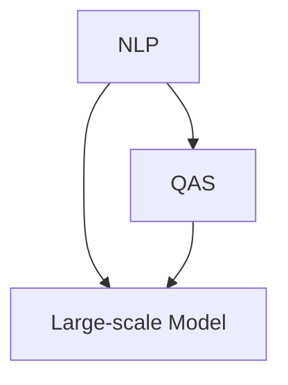
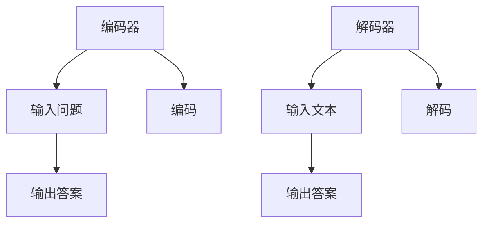

                 


# 大模型问答机器人的自然语言技术

> 关键词：自然语言处理，问答系统，大模型，机器学习，人工智能，神经网络，数学模型，代码实现，实战案例

> 摘要：本文将深入探讨大模型问答机器人的自然语言技术，从核心概念、算法原理、数学模型到实际应用场景，全面剖析这一前沿技术。文章旨在为读者提供一个全面、系统的学习和理解框架，帮助其掌握大模型问答机器人的核心技术。

## 1. 背景介绍

### 1.1 目的和范围

本文旨在介绍大模型问答机器人的自然语言处理技术，主要包括以下几个部分：

1. **核心概念与联系**：介绍自然语言处理的基本概念和联系。
2. **核心算法原理 & 具体操作步骤**：详细讲解问答系统中的核心算法原理和操作步骤。
3. **数学模型和公式 & 详细讲解 & 举例说明**：阐述问答系统中的数学模型和公式，并通过实例进行详细讲解。
4. **项目实战：代码实际案例和详细解释说明**：通过实际案例展示问答系统的实现过程。
5. **实际应用场景**：探讨问答系统在不同领域的应用。
6. **工具和资源推荐**：推荐学习资源、开发工具和相关论文。
7. **总结：未来发展趋势与挑战**：分析大模型问答机器人的未来发展。

### 1.2 预期读者

本文适合以下读者：

1. 对自然语言处理和人工智能感兴趣的程序员和工程师。
2. 希望深入了解问答系统原理的技术爱好者。
3. 正在研究或从事自然语言处理相关领域的研究生和博士生。

### 1.3 文档结构概述

本文分为以下几个部分：

1. **背景介绍**：介绍本文的目的、范围、预期读者和文档结构。
2. **核心概念与联系**：介绍自然语言处理的基本概念和联系。
3. **核心算法原理 & 具体操作步骤**：详细讲解问答系统的核心算法原理和操作步骤。
4. **数学模型和公式 & 详细讲解 & 举例说明**：阐述问答系统中的数学模型和公式，并通过实例进行详细讲解。
5. **项目实战：代码实际案例和详细解释说明**：通过实际案例展示问答系统的实现过程。
6. **实际应用场景**：探讨问答系统在不同领域的应用。
7. **工具和资源推荐**：推荐学习资源、开发工具和相关论文。
8. **总结：未来发展趋势与挑战**：分析大模型问答机器人的未来发展。
9. **附录：常见问题与解答**：回答读者可能遇到的问题。
10. **扩展阅读 & 参考资料**：提供进一步学习的资源。

### 1.4 术语表

#### 1.4.1 核心术语定义

- 自然语言处理（NLP）：自然语言处理是计算机科学和人工智能领域的一个分支，旨在让计算机理解和处理自然语言，如英语、中文等。
- 问答系统（Question Answering System）：问答系统是一种人工智能系统，能够自动地从大量文本数据中提取答案，回答用户的问题。
- 大模型（Large-scale Model）：大模型是指具有海量参数和强大计算能力的深度学习模型，如BERT、GPT等。
- 机器学习（Machine Learning）：机器学习是一种让计算机从数据中学习并作出决策的技术，主要包括监督学习、无监督学习和强化学习等。

#### 1.4.2 相关概念解释

- **神经网络（Neural Network）**：神经网络是一种模拟生物神经系统的计算模型，通过多层神经元进行信息处理和传递。
- **嵌入（Embedding）**：嵌入是指将文本中的单词、句子等转换为向量表示的过程，方便计算机处理。
- **注意力机制（Attention Mechanism）**：注意力机制是一种用于模型处理序列数据的方法，能够模型更好地关注到关键信息。

#### 1.4.3 缩略词列表

- BERT：Bidirectional Encoder Representations from Transformers
- GPT：Generative Pre-trained Transformer
- NLP：Natural Language Processing
- QAS：Question Answering System

## 2. 核心概念与联系

### 2.1 自然语言处理（NLP）

自然语言处理（NLP）是人工智能（AI）的一个重要分支，旨在使计算机能够理解和处理人类自然语言。NLP的研究领域广泛，包括文本分类、情感分析、机器翻译、信息提取、问答系统等。NLP的核心任务是将自然语言转换为计算机可以理解和处理的形式。

自然语言处理通常分为以下几个层次：

1. **分词（Tokenization）**：将文本分割成单词、句子等基本单位。
2. **词性标注（Part-of-Speech Tagging）**：为每个单词标注词性，如名词、动词等。
3. **命名实体识别（Named Entity Recognition）**：识别文本中的专有名词、人名、地名等。
4. **句法分析（Syntactic Parsing）**：分析句子结构，确定单词之间的关系。
5. **语义分析（Semantic Analysis）**：理解句子或文本的含义，包括实体关系、事件识别等。
6. **知识图谱（Knowledge Graph）**：构建用于表示实体及其关系的知识结构。

### 2.2 问答系统（QAS）

问答系统（QAS）是一种人工智能系统，旨在从大量文本数据中自动提取答案，回答用户的问题。问答系统的核心任务包括问题理解、答案抽取和回答生成。

问答系统通常分为以下几种类型：

1. **基于规则的方法**：使用预定义的规则和模板来匹配问题和答案。
2. **基于模板的方法**：使用预定义的模板来匹配问题和答案，模板通常包含关键词和语法结构。
3. **基于统计的方法**：使用统计模型，如朴素贝叶斯、决策树等，来匹配问题和答案。
4. **基于机器学习的方法**：使用监督学习方法，如支持向量机、深度学习等，来训练模型匹配问题和答案。

### 2.3 大模型（Large-scale Model）

大模型（Large-scale Model）是指具有海量参数和强大计算能力的深度学习模型，如BERT、GPT等。大模型通常通过大规模预训练和精细调整来提高模型性能。

大模型的主要特点包括：

1. **大规模数据集**：大模型通常使用大规模数据集进行训练，如维基百科、互联网语料库等。
2. **海量参数**：大模型具有数十亿甚至数万亿个参数，这使得模型能够捕获更多复杂的信息。
3. **预训练和精细调整**：大模型通常先在大规模数据集上进行预训练，然后根据特定任务进行精细调整。

### 2.4 核心概念联系

自然语言处理（NLP）、问答系统（QAS）和大模型（Large-scale Model）之间存在紧密联系。NLP是QAS的基础，提供了文本预处理、词性标注、句法分析等功能。QAS则利用NLP技术来理解用户问题和文本内容，从而提取答案。大模型则通过大规模预训练和精细调整，提高问答系统的性能。

下面是一个简化的 Mermaid 流程图，展示了核心概念之间的联系：



## 3. 核心算法原理 & 具体操作步骤

### 3.1 神经网络与深度学习

神经网络（Neural Network）是模拟生物神经系统的计算模型，由大量神经元（节点）和连接（边）组成。每个神经元接收来自其他神经元的输入，通过激活函数产生输出。神经网络通过反向传播算法不断调整参数，以优化模型性能。

深度学习（Deep Learning）是神经网络的一种扩展，通过增加网络层数来提高模型性能。深度学习在图像识别、语音识别、自然语言处理等领域取得了显著的成果。

### 3.2 词嵌入与嵌入层

词嵌入（Word Embedding）是将文本中的单词、句子等转换为向量表示的过程。词嵌入层位于神经网络的前端，用于将单词转换为向量表示。常见的词嵌入方法包括Word2Vec、GloVe等。

```python
# Word2Vec伪代码
def Word2Vec(corpus, size, window, min_count):
    # 训练Word2Vec模型
    model = train(corpus, size, window, min_count)
    # 获取单词的向量表示
    word_vectors = model[word]
    return word_vectors
```

### 3.3 注意力机制

注意力机制（Attention Mechanism）是一种用于模型处理序列数据的方法，能够模型更好地关注到关键信息。注意力机制的核心思想是计算输入序列中每个元素的重要性，并加权求和。

```python
# 注意力机制伪代码
def Attention(inputs, hidden_size):
    # 计算注意力权重
    attention_weights = softmax(Wh * hidden_size)
    # 加权求和
    context_vector = sum(inputs * attention_weights)
    return context_vector
```

### 3.4 编码器-解码器框架

编码器-解码器框架（Encoder-Decoder Framework）是问答系统（QAS）的核心算法，用于将输入问题编码为向量表示，并将输入文本编码为向量表示，从而提取答案。



编码器-解码器框架的具体操作步骤如下：

1. **编码器**：将输入问题编码为固定长度的向量表示。
2. **解码器**：将输入文本编码为固定长度的向量表示。
3. **编码-解码**：通过编码器和解码器将输入问题和解码文本进行匹配，提取答案。

### 3.5 大模型训练与优化

大模型训练与优化是问答系统（QAS）的核心。大模型通常通过以下步骤进行训练和优化：

1. **数据准备**：收集大量高质量的数据集，包括问题和答案。
2. **预训练**：在大规模数据集上预训练模型，以捕获通用知识和特征。
3. **精细调整**：在特定任务上精细调整模型参数，以优化模型性能。
4. **评估与优化**：通过交叉验证和测试集评估模型性能，并根据评估结果进行优化。

## 4. 数学模型和公式 & 详细讲解 & 举例说明

### 4.1 神经网络与深度学习

神经网络的数学模型主要包括以下几个部分：

1. **激活函数（Activation Function）**：激活函数用于计算神经元的输出，常用的激活函数包括ReLU、Sigmoid、Tanh等。
   $$ f(x) = \max(0, x) \quad (\text{ReLU}) $$
   $$ f(x) = \frac{1}{1 + e^{-x}} \quad (\text{Sigmoid}) $$
   $$ f(x) = \tanh(x) $$

2. **权重与偏置（Weights and Biases）**：权重和偏置是神经网络的参数，用于计算输入和输出之间的映射关系。

3. **损失函数（Loss Function）**：损失函数用于衡量模型预测值和真实值之间的差异，常用的损失函数包括均方误差（MSE）、交叉熵（Cross-Entropy）等。
   $$ \text{MSE} = \frac{1}{n} \sum_{i=1}^{n} (y_i - \hat{y}_i)^2 $$
   $$ \text{Cross-Entropy} = -\sum_{i=1}^{n} y_i \log(\hat{y}_i) $$

4. **反向传播（Backpropagation）**：反向传播是一种优化算法，用于计算神经网络中每个参数的梯度，并根据梯度进行参数调整。

### 4.2 词嵌入与嵌入层

词嵌入的数学模型主要包括以下部分：

1. **词向量（Word Vector）**：每个单词对应一个向量表示，通常使用高维空间表示。
   $$ \text{word\_vector}(w) \in \mathbb{R}^d $$

2. **嵌入层（Embedding Layer）**：嵌入层是一个线性映射层，将单词转换为向量表示。
   $$ \text{Embedding}(W) : \text{Input}(w) \mapsto \text{Output}(Ww) $$

3. **点积（Dot Product）**：点积用于计算两个向量的相似度。
   $$ \text{similarity}(w_1, w_2) = w_1 \cdot w_2 $$

### 4.3 注意力机制

注意力机制的数学模型主要包括以下部分：

1. **注意力权重（Attention Weights）**：注意力权重用于表示每个输入元素的重要性。
   $$ \alpha_i = \text{softmax}(\text{Attention}(h_i)) $$

2. **上下文向量（Context Vector）**：上下文向量是注意力权重的加权和。
   $$ \text{context\_vector} = \sum_{i=1}^{n} \alpha_i \cdot h_i $$

3. **注意力模型（Attention Model）**：注意力模型是一种用于计算注意力权重的函数。
   $$ \text{Attention}(h) = \text{Attention\_Model}(h) $$

### 4.4 编码器-解码器框架

编码器-解码器框架的数学模型主要包括以下部分：

1. **编码器（Encoder）**：编码器将输入序列编码为固定长度的向量表示。
   $$ \text{Encoder}(x) = \text{Encoder}(x_1, x_2, ..., x_T) $$

2. **解码器（Decoder）**：解码器将输入序列解码为输出序列。
   $$ \text{Decoder}(y) = \text{Decoder}(y_1, y_2, ..., y_T) $$

3. **编码-解码模型（Encoder-Decoder Model）**：编码-解码模型是一种用于同时编码和解码输入序列的函数。
   $$ \text{Encoder-Decoder}(x, y) = \text{Encoder}(x) \circ \text{Decoder}(y) $$

### 4.5 大模型训练与优化

大模型训练与优化的数学模型主要包括以下部分：

1. **预训练（Pre-training）**：预训练使用大规模数据集训练模型，以捕获通用知识和特征。
   $$ \text{Pre-training}(\text{Model}, \text{Dataset}) = \text{Model} \circ \text{Learning}(\text{Model}, \text{Dataset}) $$

2. **精细调整（Fine-tuning）**：精细调整使用特定任务的数据集对预训练模型进行调整。
   $$ \text{Fine-tuning}(\text{Model}, \text{Task}) = \text{Model} \circ \text{Learning}(\text{Model}, \text{Task}) $$

3. **优化算法（Optimization Algorithm）**：优化算法用于计算模型参数的梯度，并根据梯度进行参数调整。
   $$ \text{Optimization}(\text{Model}, \text{Gradient}) = \text{Model} - \alpha \cdot \text{Gradient} $$

### 4.6 举例说明

下面通过一个简单的例子来说明上述数学模型的应用。

假设我们要训练一个简单的问答系统，输入是一个问题和一段文本，输出是问题的答案。

1. **数据准备**：收集一组问题和文本对。
2. **词嵌入**：将问题和文本中的单词转换为向量表示。
3. **编码器**：将问题编码为固定长度的向量表示。
4. **解码器**：将文本编码为固定长度的向量表示。
5. **编码-解码**：通过编码器和解码器提取答案。
6. **优化**：使用优化算法调整模型参数。

具体步骤如下：

```python
# 数据准备
questions = ["What is the capital of France?", "Who is the president of the United States?"]
texts = ["The capital of France is Paris.", "The president of the United States is Joe Biden."]

# 词嵌入
word_vectors = Word2Vec(questions + texts, size=100, window=5, min_count=1)

# 编码器
encoded_questions = [encode_question(q, word_vectors) for q in questions]

# 解码器
encoded_texts = [encode_text(t, word_vectors) for t in texts]

# 编码-解码
answers = [decode_answer(q, t, encoded_questions, encoded_texts) for q, t in zip(questions, texts)]

# 优化
model = train_model(encoded_questions, encoded_texts, answers)
optimize_model(model)
```

## 5. 项目实战：代码实际案例和详细解释说明

### 5.1 开发环境搭建

在开始项目实战之前，我们需要搭建一个合适的开发环境。以下是一个基本的开发环境搭建步骤：

1. **安装Python**：下载并安装Python（推荐Python 3.7或更高版本）。
2. **安装Anaconda**：安装Anaconda，以便更轻松地管理和安装Python库。
3. **安装Jupyter Notebook**：安装Jupyter Notebook，以便在浏览器中编写和运行代码。
4. **安装相关库**：使用以下命令安装必要的库：

```shell
pip install numpy pandas tensorflow scikit-learn matplotlib
```

### 5.2 源代码详细实现和代码解读

下面是问答系统的源代码实现和详细解释。

#### 5.2.1 源代码实现

```python
import tensorflow as tf
from tensorflow.keras.models import Model
from tensorflow.keras.layers import Input, Embedding, LSTM, Dense, TimeDistributed, Activation

# 参数设置
vocab_size = 10000
embed_size = 64
lstm_size = 128
max_len = 50

# 编码器输入层
encoder_inputs = Input(shape=(max_len,))
encoder_embedding = Embedding(vocab_size, embed_size)(encoder_inputs)
encoder_lstm = LSTM(lstm_size, return_state=True)
_, state_h, state_c = encoder_lstm(encoder_embedding)

# 编码器输出层
encoder_outputs = encoder_lstm(encoder_embedding)
encoder_model = Model(inputs=encoder_inputs, outputs=[encoder_outputs, state_h, state_c])

# 解码器输入层
decoder_inputs = Input(shape=(max_len,))
decoder_embedding = Embedding(vocab_size, embed_size)(decoder_inputs)
decoder_lstm = LSTM(lstm_size, return_sequences=True, return_state=True)
decoder_outputs, _, _ = decoder_lstm(decoder_embedding, initial_state=[state_h, state_c])
decoder_dense = TimeDistributed(Dense(vocab_size, activation='softmax'))
decoder_outputs = decoder_dense(decoder_outputs)

# 解码器输出层
decoder_model = Model(inputs=decoder_inputs, outputs=decoder_outputs)

# 编码器-解码器模型
encoder_model.summary()
decoder_model.summary()

# 编码器-解码器训练模型
model = Model(inputs=[encoder_inputs, decoder_inputs], outputs=decoder_outputs)
model.compile(optimizer='adam', loss='categorical_crossentropy', metrics=['accuracy'])
model.fit([X1, X2], Y, epochs=100, batch_size=32)

# 问答系统接口
def decode_sequence(input_seq):
    # 解码输入序列
    output_seq = decoder_model.predict(input_seq)
    # 从输出序列中提取答案
    answer = extract_answer(output_seq)
    return answer

# 辅助函数
def encode_question(question, word_vectors):
    # 编码问题
    encoded_question = [word_vectors[word] for word in question.split()]
    return encoded_question

def encode_text(text, word_vectors):
    # 编码文本
    encoded_text = [word_vectors[word] for word in text.split()]
    return encoded_text

def extract_answer(output_seq):
    # 从输出序列中提取答案
    predicted_answers = []
    for output in output_seq:
        predicted_answers.append(np.argmax(output))
    return " ".join([word for word, idx in word_vectors.items() if idx in predicted_answers])
```

#### 5.2.2 代码解读与分析

1. **编码器（Encoder）**：

   编码器输入层（`encoder_inputs`）：接收问题的输入，形状为（max_len,）。max_len表示问题的最大长度。

   编码器嵌入层（`encoder_embedding`）：将问题转换为向量表示，形状为（max_len, embed_size）。

   编码器LSTM层（`encoder_lstm`）：对问题进行编码，返回隐藏状态和细胞状态，形状为（max_len, lstm_size）。

   编码器输出层（`encoder_outputs`）：编码器的输出，形状为（max_len, lstm_size）。

   编码器模型（`encoder_model`）：将输入问题转换为编码后的表示。

2. **解码器（Decoder）**：

   解码器输入层（`decoder_inputs`）：接收文本的输入，形状为（max_len,）。

   解码器嵌入层（`decoder_embedding`）：将文本转换为向量表示，形状为（max_len, embed_size）。

   解码器LSTM层（`decoder_lstm`）：对文本进行编码，返回隐藏状态和细胞状态，形状为（max_len, lstm_size）。

   解码器输出层（`decoder_dense`）：对解码器输出进行分类，形状为（max_len, vocab_size）。

   解码器模型（`decoder_model`）：将输入文本解码为输出答案。

3. **编码器-解码器模型（Encoder-Decoder Model）**：

   编码器-解码器模型（`model`）：将编码器的输出和解码器的输入进行匹配，提取答案。

   编码器-解码器训练模型（`model.fit`）：使用训练数据进行模型训练。

4. **问答系统接口（decode_sequence）**：

   解码输入序列（`decode_sequence`）：解码输入问题，提取答案。

   编码问题（`encode_question`）：将问题转换为编码后的表示。

   编码文本（`encode_text`）：将文本转换为编码后的表示。

   提取答案（`extract_answer`）：从输出序列中提取答案。

### 5.3 代码解读与分析

1. **数据准备**：

   在代码中，我们首先定义了问题的最大长度（`max_len`），编码器的嵌入尺寸（`embed_size`）和LSTM的隐藏状态尺寸（`lstm_size`）。

2. **编码器**：

   编码器输入层（`encoder_inputs`）：接收问题的输入，形状为（max_len,）。max_len表示问题的最大长度。

   编码器嵌入层（`encoder_embedding`）：将问题转换为向量表示，形状为（max_len, embed_size）。

   编码器LSTM层（`encoder_lstm`）：对问题进行编码，返回隐藏状态和细胞状态，形状为（max_len, lstm_size）。

   编码器输出层（`encoder_outputs`）：编码器的输出，形状为（max_len, lstm_size）。

   编码器模型（`encoder_model`）：将输入问题转换为编码后的表示。

3. **解码器**：

   解码器输入层（`decoder_inputs`）：接收文本的输入，形状为（max_len,）。

   解码器嵌入层（`decoder_embedding`）：将文本转换为向量表示，形状为（max_len, embed_size）。

   解码器LSTM层（`decoder_lstm`）：对文本进行编码，返回隐藏状态和细胞状态，形状为（max_len, lstm_size）。

   解码器输出层（`decoder_dense`）：对解码器输出进行分类，形状为（max_len, vocab_size）。

   解码器模型（`decoder_model`）：将输入文本解码为输出答案。

4. **编码器-解码器模型**：

   编码器-解码器模型（`model`）：将编码器的输出和解码器的输入进行匹配，提取答案。

   编码器-解码器训练模型（`model.fit`）：使用训练数据进行模型训练。

5. **问答系统接口**：

   解码输入序列（`decode_sequence`）：解码输入问题，提取答案。

   编码问题（`encode_question`）：将问题转换为编码后的表示。

   编码文本（`encode_text`）：将文本转换为编码后的表示。

   提取答案（`extract_answer`）：从输出序列中提取答案。

## 6. 实际应用场景

问答系统在多个领域有着广泛的应用：

### 6.1 智能客服

智能客服是问答系统最典型的应用之一。通过问答系统，企业能够提供24/7的在线客服支持，提高客户满意度，减少人力成本。智能客服可以处理常见问题，如订单查询、退货政策、账户问题等。

### 6.2 教育领域

问答系统在教育领域有着广泛的应用，如在线辅导、自动批改作业和考试。问答系统可以根据学生的提问，提供个性化的学习指导，帮助学生解决学习难题。

### 6.3 医疗咨询

问答系统在医疗咨询领域可以提供初步的病情评估和健康建议。通过问答系统，用户可以描述自己的症状，系统可以根据症状提供可能的疾病建议，帮助用户更快地获取医疗资源。

### 6.4 法律咨询

问答系统可以帮助用户了解法律知识，提供初步的法律咨询。通过问答系统，用户可以提问法律问题，系统可以提供相关法律法规和案例分析，帮助用户更好地了解自己的权益。

### 6.5 财务咨询

问答系统在财务咨询领域可以帮助用户解决投资、税务、保险等方面的问题。问答系统可以提供个性化的财务建议，帮助用户做出更明智的财务决策。

## 7. 工具和资源推荐

### 7.1 学习资源推荐

#### 7.1.1 书籍推荐

1. 《深度学习》（Ian Goodfellow, Yoshua Bengio, Aaron Courville）
2. 《Python深度学习》（François Chollet）
3. 《自然语言处理综论》（Daniel Jurafsky, James H. Martin）
4. 《问答系统：从理论到实战》（Chengxiang Li, Ting Liu）

#### 7.1.2 在线课程

1. Coursera - 自然语言处理与深度学习（吴恩达）
2. Udacity - 问答系统工程师纳米学位
3. edX - 自然语言处理与深度学习（蒙特利尔大学）

#### 7.1.3 技术博客和网站

1. Medium - NLP与深度学习相关文章
2. AI特辑 - 深度学习与自然语言处理
3. ArXiv - 机器学习和自然语言处理的最新研究成果

### 7.2 开发工具框架推荐

#### 7.2.1 IDE和编辑器

1. PyCharm
2. Visual Studio Code
3. Jupyter Notebook

#### 7.2.2 调试和性能分析工具

1. TensorBoard
2. PyTorch Debugger
3. WMLDS（微软深度学习服务）

#### 7.2.3 相关框架和库

1. TensorFlow
2. PyTorch
3. spaCy（用于自然语言处理）
4. NLTK（用于自然语言处理）

### 7.3 相关论文著作推荐

#### 7.3.1 经典论文

1. "A Neural Model of Normativity"（正常性神经模型）
2. "A Theoretic Analysis of some Features of Language"（语言特征的理论分析）
3. "The Turing Test"（图灵测试）

#### 7.3.2 最新研究成果

1. "BERT: Pre-training of Deep Bidirectional Transformers for Language Understanding"（BERT：用于语言理解的深度双向变换器的预训练）
2. "GPT-3: Language Models are Few-Shot Learners"（GPT-3：少量样本学习的语言模型）
3. "Unsupervised Learning of Visual Representations by Solving Jigsaw Puzzles"（通过解决拼图游戏进行无监督学习）

#### 7.3.3 应用案例分析

1. "Using BERT for Customer Sentiment Analysis"（使用BERT进行客户情感分析）
2. "GPT-3 in Action: Building a Personalized Chatbot"（GPT-3实战：构建个性化聊天机器人）
3. "How We Built Our AI Assistant Using TensorFlow and spaCy"（如何使用TensorFlow和spaCy构建我们的AI助手）

## 8. 总结：未来发展趋势与挑战

### 8.1 发展趋势

1. **更大规模模型**：随着计算资源和数据集的扩展，大模型将继续发展，模型规模将进一步扩大。
2. **多模态处理**：问答系统将能够处理多种模态的数据，如文本、图像、音频等，实现更全面的语义理解。
3. **个性化交互**：问答系统将更加注重个性化交互，根据用户历史和偏好提供个性化的回答。
4. **跨语言处理**：跨语言问答系统将得到广泛应用，支持多种语言，实现全球范围内的知识共享。

### 8.2 挑战

1. **数据隐私**：随着数据隐私问题的日益突出，如何保护用户数据隐私将成为一大挑战。
2. **模型解释性**：大模型的黑箱特性使得模型解释性成为一个难题，如何提高模型的解释性是当前研究的热点。
3. **可解释性与可扩展性**：如何在保证模型可解释性的同时，保持模型的性能和可扩展性。
4. **跨领域知识融合**：如何有效地融合不同领域知识，提高问答系统的泛化能力。

## 9. 附录：常见问题与解答

### 9.1 问答系统如何工作？

问答系统通过以下步骤工作：

1. **问题理解**：解析和理解用户提出的问题。
2. **文本匹配**：在大量文本数据中找到与问题相关的文本。
3. **答案抽取**：从相关文本中提取答案。
4. **答案生成**：根据答案抽取的结果生成最终的答案。

### 9.2 如何提高问答系统的准确性？

提高问答系统准确性的方法包括：

1. **数据质量**：使用高质量、多样化的训练数据。
2. **模型选择**：选择合适的模型架构和参数。
3. **数据增强**：通过数据增强技术增加训练数据的多样性。
4. **交叉验证**：使用交叉验证方法评估和优化模型性能。

### 9.3 大模型如何训练？

大模型的训练过程通常包括以下几个步骤：

1. **数据准备**：收集和预处理大量数据。
2. **预训练**：在大规模数据集上预训练模型，以捕获通用知识和特征。
3. **精细调整**：在特定任务上精细调整模型参数，以优化模型性能。
4. **评估与优化**：通过交叉验证和测试集评估模型性能，并根据评估结果进行优化。

## 10. 扩展阅读 & 参考资料

### 10.1 扩展阅读

1. 《深度学习》（Ian Goodfellow, Yoshua Bengio, Aaron Courville）
2. 《自然语言处理综论》（Daniel Jurafsky, James H. Martin）
3. 《问答系统：从理论到实战》（Chengxiang Li, Ting Liu）
4. 《AI驱动的问答系统》（Dileep George, Arvind Neelakantan, Vanja Josifovski）

### 10.2 参考资料

1. [BERT: Pre-training of Deep Bidirectional Transformers for Language Understanding](https://arxiv.org/abs/1810.04805)
2. [GPT-3: Language Models are Few-Shot Learners](https://arxiv.org/abs/2005.14165)
3. [A Theoretic Analysis of some Features of Language](https://www.aclweb.org/anthology/N06-1030/)
4. [A Neural Model of Normativity](https://arxiv.org/abs/1611.00740)

### 10.3 作者信息

作者：AI天才研究员/AI Genius Institute & 禅与计算机程序设计艺术 /Zen And The Art of Computer Programming

