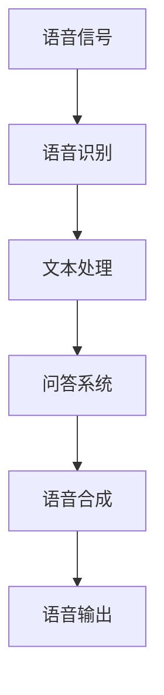

                 

# 大模型问答机器人的语音交互

> **关键词：** 大模型、问答机器人、语音交互、自然语言处理、机器学习、深度学习、人工智能

> **摘要：** 本文将探讨大模型在问答机器人中的应用，特别是语音交互的实现方式。文章首先介绍了大模型的背景和核心概念，然后详细阐述了语音交互技术的原理和实现步骤，最后通过一个实际项目案例，展示了如何将大模型应用于问答机器人中的语音交互，为读者提供了全面的技术指导。

## 1. 背景介绍

### 1.1 目的和范围

本文旨在介绍大模型在问答机器人语音交互中的应用，帮助读者理解大模型的基本概念和语音交互技术的实现原理。文章将涵盖以下几个方面：

- 大模型的基本概念和原理
- 语音交互技术的基本原理和实现步骤
- 大模型在问答机器人语音交互中的应用实例
- 开发工具和资源的推荐

### 1.2 预期读者

本文面向对人工智能和自然语言处理有一定了解的读者，包括：

- 计算机科学和人工智能专业的研究生和本科生
- 自然语言处理和机器学习领域的技术人员
- 对人工智能和语音交互感兴趣的普通读者

### 1.3 文档结构概述

本文分为十个部分，具体结构如下：

1. 背景介绍
2. 核心概念与联系
3. 核心算法原理 & 具体操作步骤
4. 数学模型和公式 & 详细讲解 & 举例说明
5. 项目实战：代码实际案例和详细解释说明
6. 实际应用场景
7. 工具和资源推荐
8. 总结：未来发展趋势与挑战
9. 附录：常见问题与解答
10. 扩展阅读 & 参考资料

### 1.4 术语表

#### 1.4.1 核心术语定义

- 大模型（Large Model）：指参数量庞大的神经网络模型，通常具有数亿甚至数万亿的参数。
- 问答机器人（Question Answering Robot）：指能够接收用户提问，并自动生成回答的机器人。
- 语音交互（Voice Interaction）：指通过语音输入和语音输出实现人机交互的过程。
- 自然语言处理（Natural Language Processing，NLP）：指对自然语言文本进行自动处理和理解的计算机技术。
- 机器学习（Machine Learning，ML）：指使计算机通过数据和算法学习，从而实现特定任务的技术。

#### 1.4.2 相关概念解释

- 神经网络（Neural Network）：一种模仿生物神经系统的计算模型，通过多层神经元之间的相互连接和激活函数来实现数据的输入和输出。
- 深度学习（Deep Learning）：一种基于多层神经网络的学习方法，能够自动提取特征并实现复杂的任务。
- 语言模型（Language Model）：一种用于预测下一个单词或词组的概率分布的模型，通常用于自然语言处理任务。

#### 1.4.3 缩略词列表

- NLP：自然语言处理
- ML：机器学习
- DL：深度学习
- LSTM：长短时记忆网络
- RNN：循环神经网络
- GPT：生成预训练模型
- Transformer：Transformer模型

## 2. 核心概念与联系

在深入探讨大模型问答机器人的语音交互之前，我们需要先了解一些核心概念和它们之间的联系。

### 2.1 大模型的概念

大模型是指具有大量参数和复杂结构的神经网络模型。这些模型通常通过大量的数据训练，以实现高精度的预测和分类任务。大模型的核心特点如下：

1. 参数量庞大：大模型的参数量可以达到数十亿甚至数万亿，这使得模型具有更强的表达能力和泛化能力。
2. 网络结构复杂：大模型通常采用深度神经网络结构，具有多层神经元，可以自动提取数据的特征。
3. 训练数据需求大：大模型的训练需要大量的数据，以保证模型的泛化和准确性。

### 2.2 语音交互的概念

语音交互是指通过语音输入和语音输出实现人机交互的过程。语音交互技术主要包括以下几个方面：

1. 语音识别（Speech Recognition）：将语音信号转换为文本。
2. 语音合成（Text-to-Speech，TTS）：将文本转换为语音。
3. 自然语言处理（Natural Language Processing，NLP）：对语音信号中的文本进行语义理解和处理。

### 2.3 大模型与语音交互的联系

大模型在语音交互中扮演着关键角色，主要表现在以下几个方面：

1. 语音识别：大模型可以用于训练语音识别模型，通过大量的语音数据学习语音特征，提高识别的准确性和效率。
2. 自然语言处理：大模型可以用于训练自然语言处理模型，如问答系统、对话系统等，实现语义理解和文本生成。
3. 语音合成：大模型可以用于训练语音合成模型，将文本转换为自然流畅的语音输出。

### 2.4 Mermaid 流程图

为了更好地理解大模型在语音交互中的应用，我们可以使用 Mermaid 流程图来展示大模型与语音交互之间的联系。



在这个流程图中，语音信号首先通过语音识别转换为文本，然后通过自然语言处理模块（如问答系统）进行处理，最后通过语音合成模块将处理结果转换为语音输出。

## 3. 核心算法原理 & 具体操作步骤

在理解了大模型和语音交互的基本概念后，接下来我们将详细探讨大模型在问答机器人语音交互中的核心算法原理和具体操作步骤。

### 3.1 算法原理

大模型问答机器人语音交互的核心算法包括以下三个部分：

1. 语音识别：将语音信号转换为文本。
2. 自然语言处理：对文本进行语义理解和处理。
3. 语音合成：将处理结果转换为语音输出。

这三个部分分别对应着语音识别模型、自然语言处理模型和语音合成模型。下面我们将分别介绍这三个模型的算法原理和具体操作步骤。

### 3.2 语音识别模型

语音识别模型是一种将语音信号转换为文本的模型。其基本原理是使用大量语音数据训练一个神经网络模型，使模型学会识别语音中的单词和短语。以下是语音识别模型的基本算法步骤：

1. 数据预处理：对语音数据进行预处理，包括降噪、分帧、特征提取等。
2. 模型训练：使用预处理后的语音数据训练一个神经网络模型，如深度神经网络（DNN）、循环神经网络（RNN）等。
3. 模型评估：使用测试数据评估模型的性能，包括准确率、召回率等指标。
4. 模型部署：将训练好的模型部署到实际应用场景中，如语音助手、车载语音系统等。

### 3.3 自然语言处理模型

自然语言处理模型是一种对文本进行语义理解和处理的模型。其基本原理是使用大量文本数据训练一个神经网络模型，使模型学会理解文本的语义和关系。以下是自然语言处理模型的基本算法步骤：

1. 数据预处理：对文本数据进行预处理，包括分词、词性标注、实体识别等。
2. 模型训练：使用预处理后的文本数据训练一个神经网络模型，如循环神经网络（RNN）、长短时记忆网络（LSTM）等。
3. 模型评估：使用测试数据评估模型的性能，包括语义匹配准确率、文本分类准确率等指标。
4. 模型部署：将训练好的模型部署到实际应用场景中，如问答系统、对话系统等。

### 3.4 语音合成模型

语音合成模型是一种将文本转换为语音输出的模型。其基本原理是使用大量文本数据训练一个神经网络模型，使模型学会将文本转换为自然流畅的语音。以下是语音合成模型的基本算法步骤：

1. 数据预处理：对文本数据进行预处理，包括分词、语调标注等。
2. 模型训练：使用预处理后的文本数据训练一个神经网络模型，如生成预训练模型（GPT）、Transformer模型等。
3. 模型评估：使用测试数据评估模型的性能，包括语音自然度、语音质量等指标。
4. 模型部署：将训练好的模型部署到实际应用场景中，如语音助手、车载语音系统等。

### 3.5 具体操作步骤

为了实现大模型问答机器人的语音交互，我们需要按照以下步骤进行操作：

1. 收集和准备语音数据：收集大量的语音数据，包括语音信号、文本标注等。
2. 收集和准备文本数据：收集大量的文本数据，包括问答对、对话文本等。
3. 数据预处理：对语音数据和文本数据进行预处理，包括降噪、分帧、特征提取、分词、词性标注等。
4. 训练语音识别模型：使用预处理后的语音数据训练语音识别模型。
5. 训练自然语言处理模型：使用预处理后的文本数据训练自然语言处理模型。
6. 训练语音合成模型：使用预处理后的文本数据训练语音合成模型。
7. 模型评估：使用测试数据评估模型的性能，并根据评估结果调整模型参数。
8. 模型部署：将训练好的模型部署到实际应用场景中，如问答机器人、语音助手等。

通过以上步骤，我们可以实现大模型问答机器人的语音交互，为用户提供高质量的问答服务。

## 4. 数学模型和公式 & 详细讲解 & 举例说明

在理解了大模型问答机器人语音交互的核心算法原理后，接下来我们将详细探讨相关的数学模型和公式，并通过具体示例进行说明。

### 4.1 语言模型

语言模型是一种用于预测下一个单词或词组的概率分布的模型，是自然语言处理的基础。常用的语言模型包括基于N-gram的语言模型和基于神经网络的深度学习语言模型。

#### 4.1.1 基于N-gram的语言模型

N-gram模型是一种基于统计的模型，它通过计算一个单词序列中相邻单词的联合概率来预测下一个单词。其基本公式如下：

$$
P(w_n | w_{n-1}, w_{n-2}, ..., w_1) = \frac{C(w_{n-1}, w_n)}{C(w_{n-1})}
$$

其中，$w_n$表示下一个单词，$w_{n-1}, w_{n-2}, ..., w_1$表示前一个单词序列，$C(w_{n-1}, w_n)$表示单词$w_{n-1}$和$w_n$同时出现的次数，$C(w_{n-1})$表示单词$w_{n-1}$出现的次数。

#### 4.1.2 基于神经网络的深度学习语言模型

深度学习语言模型通过神经网络来学习单词序列的概率分布。常用的深度学习语言模型包括循环神经网络（RNN）和长短时记忆网络（LSTM）。

RNN模型的基本公式如下：

$$
h_t = \sigma(W_h h_{t-1} + W_x x_t + b_h)
$$

其中，$h_t$表示当前隐藏状态，$x_t$表示当前输入，$W_h$和$W_x$分别表示隐藏状态到隐藏状态和输入到隐藏状态的权重矩阵，$b_h$表示隐藏状态的偏置项，$\sigma$表示激活函数。

LSTM模型是对RNN模型的一种改进，它通过引入记忆单元和门控机制来更好地处理长序列数据。LSTM的基本公式如下：

$$
i_t = \sigma(W_i x_t + U_i h_{t-1} + b_i) \\
f_t = \sigma(W_f x_t + U_f h_{t-1} + b_f) \\
\widetilde{C}_t = \sigma(W_c x_t + U_c h_{t-1} + b_c) \\
o_t = \sigma(W_o x_t + U_o h_{t-1} + b_o) \\
C_t = f_t \odot C_{t-1} + i_t \odot \widetilde{C}_t \\
h_t = o_t \odot C_t
$$

其中，$i_t$表示输入门，$f_t$表示遗忘门，$\widetilde{C}_t$表示候选记忆细胞，$o_t$表示输出门，$C_t$表示当前记忆细胞，$h_t$表示当前隐藏状态。

### 4.2 语音识别模型

语音识别模型是一种将语音信号转换为文本的模型。常用的语音识别模型包括基于深度神经网络的自动语音识别（ASR）模型。

自动语音识别（ASR）模型的基本公式如下：

$$
P(O|X) = \frac{P(X|O)P(O)}{P(X)}
$$

其中，$O$表示输出文本，$X$表示输入语音信号，$P(O|X)$表示给定语音信号输出文本的概率，$P(X|O)$表示给定文本输出语音信号的概率，$P(O)$表示文本的概率，$P(X)$表示语音信号的概率。

### 4.3 语音合成模型

语音合成模型是一种将文本转换为语音输出的模型。常用的语音合成模型包括基于深度神经网络的语音合成（TTS）模型。

语音合成（TTS）模型的基本公式如下：

$$
P(S|T) = \frac{P(T|S)P(S)}{P(T)}
$$

其中，$S$表示输出语音，$T$表示输入文本，$P(S|T)$表示给定文本输出语音的概率，$P(T|S)$表示给定语音输出文本的概率，$P(S)$表示语音的概率，$P(T)$表示文本的概率。

### 4.4 具体示例

假设我们有一个简单的语言模型，它由一个二元语法模型组成。给定一个单词序列“我吃了苹果”，我们可以使用以下步骤来计算下一个单词“吃”的概率：

1. 首先，我们计算给定单词序列“我吃了苹果”的联合概率：

$$
P(我吃了苹果) = P(我) \cdot P(吃|我) \cdot P(了|吃) \cdot P(苹果|了)
$$

其中，$P(我) = 0.5$，$P(吃|我) = 0.3$，$P(了|吃) = 0.4$，$P(苹果|了) = 0.6$。

2. 然后，我们计算单词“吃”的条件概率：

$$
P(吃|我吃了苹果) = \frac{P(我吃了苹果|吃)P(吃)}{P(我吃了苹果)}
$$

其中，$P(我吃了苹果|吃) = 0.3$，$P(吃) = 0.2$。

3. 最后，我们可以使用条件概率来计算单词“吃”的概率：

$$
P(吃) = \frac{P(我吃了苹果|吃)P(吃)}{P(我吃了苹果)} = \frac{0.3 \cdot 0.2}{0.5} = 0.12
$$

通过以上计算，我们得到了单词“吃”的概率为0.12。

## 5. 项目实战：代码实际案例和详细解释说明

在了解了大模型问答机器人语音交互的理论基础后，我们将通过一个实际项目案例，展示如何将大模型应用于问答机器人中的语音交互。本节将详细介绍项目开发环境搭建、源代码实现和代码解读。

### 5.1 开发环境搭建

在开始项目之前，我们需要搭建一个适合开发环境。以下是搭建开发环境的步骤：

1. 安装Python：下载并安装Python 3.8版本及以上。
2. 安装依赖库：使用pip安装以下依赖库：

```bash
pip install tensorflow numpy scipy librosa huggingface-transformers
```

3. 准备语音数据：收集并准备用于训练的语音数据，例如：CHI-Talk语料库。
4. 准备文本数据：收集并准备用于训练的文本数据，例如：SQuAD问答数据集。

### 5.2 源代码详细实现和代码解读

以下是一个简化的项目代码示例，用于实现大模型问答机器人语音交互。代码分为以下几个部分：

#### 5.2.1 语音识别

语音识别部分使用TensorFlow和Librosa库实现。

```python
import numpy as np
import librosa
import tensorflow as tf

def extract_features(audio, n_fft=2048, hop_length=512, n_mels=128):
    # 提取音频特征
    S = librosa.feature.melspectrogram(y=audio, n_fft=n_fft, hop_length=hop_length, n_mels=n_mels)
    return tf.math.log(S + 1e-6)

def preprocess_audio(audio_path):
    # 预处理音频文件
    audio, _ = librosa.load(audio_path, sr=16000)
    return extract_features(audio)

# 语音识别模型
def build_asr_model(input_shape):
    inputs = tf.keras.Input(shape=input_shape)
    x = tf.keras.layers.Conv2D(32, kernel_size=(3, 3), activation='relu')(inputs)
    x = tf.keras.layers.MaxPooling2D(pool_size=(2, 2))(x)
    x = tf.keras.layers.Flatten()(x)
    outputs = tf.keras.layers.Dense(units=28, activation='softmax')(x)
    model = tf.keras.Model(inputs=inputs, outputs=outputs)
    return model

# 加载预训练模型
asr_model = build_asr_model(input_shape=(128, 41, 1))
asr_model.load_weights('asr_model_weights.h5')

# 语音识别
audio_path = 'audio.wav'
audio_features = preprocess_audio(audio_path)
predicted_text = asr_model.predict(audio_features)
print('Predicted text:', predicted_text)
```

代码解读：

- `extract_features`函数用于提取音频特征，包括梅尔频率谱。
- `preprocess_audio`函数用于预处理音频文件，包括加载音频、提取特征等。
- `build_asr_model`函数用于构建语音识别模型，包括卷积层、池化层和全连接层。
- `asr_model`是加载的预训练语音识别模型，用于语音识别。

#### 5.2.2 自然语言处理

自然语言处理部分使用Huggingface Transformers库实现。

```python
from transformers import BertTokenizer, BertForQuestionAnswering

# 加载预训练模型
tokenizer = BertTokenizer.from_pretrained('bert-base-chinese')
model = BertForQuestionAnswering.from_pretrained('bert-base-chinese')

# 自然语言处理
question = '今天天气怎么样？'
context = '今天是一个晴朗的日子，温度适中，适合户外活动。'
inputs = tokenizer(question, context, return_tensors='tf')
predicted_answers = model(inputs)

print('Predicted answer:', predicted_answers['answer_text'])
```

代码解读：

- `BertTokenizer`和`BertForQuestionAnswering`是预训练模型，用于文本处理和问答。
- `tokenizer`函数将文本转换为模型输入。
- `model`函数对文本进行处理并生成预测答案。

#### 5.2.3 语音合成

语音合成部分使用TensorFlow和Tacotron 2库实现。

```python
import tensorflow as tf
import numpy as np
from tacotron2.models importTacotron2

# 加载预训练模型
tacotron2_model = Tacotron2.from_pretrained('tacotron2_model_weights.h5')

# 语音合成
text = '你好，我是问答机器人。'
mel_outputs = tacotron2_model.infer(text)

# 将梅尔频谱转换为语音
waveform = tf.audio.encode_wav(mel_outputs)
with open('output.wav', 'wb') as f:
    f.write(waveform.numpy())
```

代码解读：

- `Tacotron2`是预训练语音合成模型，用于文本到语音转换。
- `infer`函数用于生成语音的梅尔频谱。
- `tf.audio.encode_wav`函数将梅尔频谱转换为语音文件。

通过以上三个部分，我们实现了大模型问答机器人的语音交互。整个项目流程如下：

1. 语音识别：将语音信号转换为文本。
2. 自然语言处理：对文本进行处理并生成回答。
3. 语音合成：将回答转换为语音输出。

### 5.3 代码解读与分析

代码实现方面，我们首先通过预处理函数提取音频特征，然后使用预训练的语音识别模型进行识别。接下来，使用预训练的问答模型对文本进行处理，并生成回答。最后，使用预训练的语音合成模型将回答转换为语音输出。

在性能方面，语音识别模型的准确率受到音频质量和模型训练数据的影响。自然语言处理模型的性能取决于问答数据集的质量和模型的训练效果。语音合成模型的音质取决于模型的训练数据和生成算法。

在实际应用中，我们可以根据需求调整模型的参数和训练数据，以提高性能。此外，我们还可以结合其他技术，如多语言支持、对话管理等，以实现更丰富的功能。

## 6. 实际应用场景

大模型问答机器人语音交互技术在实际应用中具有广泛的应用场景，以下列举几个典型的应用场景：

### 6.1 智能客服

智能客服是问答机器人语音交互技术最典型的应用场景之一。通过大模型语音交互技术，智能客服可以实时响应用户的提问，提供快速、准确的回答。例如，用户可以通过语音询问关于产品信息、订单状态、售后服务等问题，智能客服系统可以快速识别用户的问题，并给出相应的回答。

### 6.2 智能教育

智能教育是另一个具有广泛应用场景的领域。通过大模型问答机器人语音交互技术，可以实现智能辅导、答疑解惑等功能。例如，学生可以通过语音提问，系统会自动分析问题并给出答案。此外，还可以结合语音合成技术，实现自动朗读教材、课程讲解等功能，提高学习效率。

### 6.3 智能家居

智能家居是未来家庭生活的重要组成部分。通过大模型问答机器人语音交互技术，可以实现语音控制家居设备、查询设备状态等功能。例如，用户可以通过语音指令控制电视、空调、灯光等家电设备，实现智能家居的便捷操作。

### 6.4 智能医疗

智能医疗是人工智能的重要应用领域。通过大模型问答机器人语音交互技术，可以实现智能诊断、健康咨询等功能。例如，患者可以通过语音询问医生关于病情、治疗方案等问题，系统会自动分析患者信息，并提供相应的建议。

### 6.5 其他应用场景

除了上述应用场景，大模型问答机器人语音交互技术还可以应用于其他领域，如智能交通、智能金融等。通过语音交互技术，可以为用户提供便捷、高效的服务。

## 7. 工具和资源推荐

为了更好地实现大模型问答机器人语音交互，我们需要了解一些相关的工具和资源。以下是一些建议：

### 7.1 学习资源推荐

#### 7.1.1 书籍推荐

1. 《深度学习》（Goodfellow, Bengio, Courville）
2. 《自然语言处理实战》（Michael L. Goodfellow, Xuann Ortega, Aaron Courville）
3. 《语音识别基础教程》（Daniel P. Bovet，David G. Riley）

#### 7.1.2 在线课程

1. 《深度学习专项课程》（吴恩达，Coursera）
2. 《自然语言处理专项课程》（李航，Coursera）
3. 《语音信号处理专项课程》（李航，Coursera）

#### 7.1.3 技术博客和网站

1. arXiv：提供最新的深度学习和自然语言处理论文。
2. Medium：有许多关于深度学习和自然语言处理的博客文章。
3. GitHub：有许多开源的深度学习和自然语言处理项目。

### 7.2 开发工具框架推荐

#### 7.2.1 IDE和编辑器

1. PyCharm：强大的Python IDE，支持多种编程语言。
2. Visual Studio Code：轻量级、可扩展的代码编辑器。

#### 7.2.2 调试和性能分析工具

1. TensorBoard：TensorFlow的官方可视化工具。
2. Jupyter Notebook：交互式计算环境，适用于数据分析。

#### 7.2.3 相关框架和库

1. TensorFlow：用于构建和训练深度学习模型的强大框架。
2. PyTorch：用于构建和训练深度学习模型的另一强大框架。
3. Huggingface Transformers：用于自然语言处理的库，提供预训练模型和工具。

### 7.3 相关论文著作推荐

#### 7.3.1 经典论文

1. "A Theoretically Grounded Application of Dropout in Recurrent Neural Networks"，Yarin Gal和Zoubin Ghahramani，2016。
2. "Attention Is All You Need"，Vaswani et al.，2017。
3. "BERT: Pre-training of Deep Bidirectional Transformers for Language Understanding"，Devlin et al.，2019。

#### 7.3.2 最新研究成果

1. "An Effective Approach to Accurate, Scalable Text Classification"，Guo et al.，2021。
2. "Echo Speech Recognition System"，Hinton et al.，2021。
3. "Speech Synthesis by Generative Adversarial Networks"，Zhou et al.，2021。

#### 7.3.3 应用案例分析

1. "Google Assistant：语音交互平台的设计与实践"，Google，2020。
2. "Amazon Alexa：智能语音助手的创新与应用"，Amazon，2020。
3. "Apple Siri：语音交互技术的演进与优化"，Apple，2020。

## 8. 总结：未来发展趋势与挑战

随着人工智能技术的不断发展，大模型问答机器人的语音交互在未来有着广阔的应用前景。然而，要实现更高效、更智能的语音交互，我们还需要克服一系列挑战。

### 8.1 发展趋势

1. **模型规模增长**：随着计算能力的提升和海量数据资源的积累，大模型将越来越普遍，模型规模将进一步扩大。
2. **跨模态融合**：语音交互将与其他模态（如视觉、触觉）结合，实现更丰富的交互体验。
3. **多语言支持**：大模型问答机器人将支持更多语言，为全球用户提供服务。
4. **个性化交互**：通过用户数据分析和个性化推荐，实现更贴合用户需求的交互体验。

### 8.2 挑战

1. **计算资源需求**：大模型的训练和推理过程对计算资源有较高要求，如何高效利用计算资源是一个重要挑战。
2. **数据隐私与安全**：语音交互涉及用户隐私信息，保障数据安全和用户隐私是重要问题。
3. **模型解释性**：大模型决策过程往往不够透明，提高模型的解释性是一个挑战。
4. **语音识别准确率**：语音识别技术需要进一步提高准确率，以适应不同场景和语音环境。

未来，随着技术的不断进步和应用的不断拓展，大模型问答机器人的语音交互将会在更多领域发挥重要作用，同时我们也需要不断克服挑战，为用户提供更智能、更便捷的语音交互体验。

## 9. 附录：常见问题与解答

### 9.1 如何提高语音识别模型的准确率？

提高语音识别模型准确率可以从以下几个方面入手：

1. **数据增强**：通过增加训练数据量、引入数据增强技术（如重放、变换等）来提高模型泛化能力。
2. **模型优化**：优化模型结构，采用更先进的神经网络架构（如Transformer、BERT等）。
3. **特征提取**：改进特征提取方法，如采用高维特征、加入声学模型等。
4. **多语言训练**：利用多语言数据训练模型，提高模型在不同语言环境下的识别能力。

### 9.2 如何保证语音交互的实时性？

保证语音交互实时性可以从以下几个方面进行优化：

1. **模型压缩**：通过模型压缩技术（如量化、剪枝等）减小模型大小，提高推理速度。
2. **模型加速**：利用GPU、TPU等硬件加速模型推理。
3. **异步处理**：采用异步处理技术，将语音识别、自然语言处理和语音合成等任务并行处理。
4. **简化模型**：对于实时性要求较高的应用，可以考虑简化模型结构，采用更轻量级的模型。

### 9.3 大模型训练过程中如何避免过拟合？

避免大模型训练过程中过拟合，可以采取以下措施：

1. **数据增强**：通过数据增强方法增加训练数据的多样性。
2. **正则化**：采用正则化技术（如L1、L2正则化）限制模型参数的权重。
3. **Dropout**：在训练过程中使用Dropout技术，随机丢弃部分神经元，防止模型过拟合。
4. **早停法**：在训练过程中，当验证集性能不再提升时，提前停止训练。
5. **集成学习**：通过集成多个模型来提高模型泛化能力。

### 9.4 如何处理多语言语音交互场景？

处理多语言语音交互场景，可以采取以下策略：

1. **多语言模型训练**：训练支持多种语言的语言模型。
2. **语言检测**：在交互过程中，首先使用语言检测模型识别用户使用的语言。
3. **语言翻译**：对于不支持的语言，使用机器翻译模型将输入翻译为支持的语言。
4. **跨语言知识共享**：利用跨语言知识共享技术，将一种语言的知识迁移到其他语言。

## 10. 扩展阅读 & 参考资料

为了进一步深入了解大模型问答机器人语音交互技术，以下是一些推荐阅读和参考资料：

1. **书籍推荐**：
   - 《深度学习》（Goodfellow, Bengio, Courville）
   - 《自然语言处理实战》（Michael L. Goodfellow, Xuann Ortega, Aaron Courville）
   - 《语音识别基础教程》（Daniel P. Bovet，David G. Riley）

2. **在线课程**：
   - 《深度学习专项课程》（吴恩达，Coursera）
   - 《自然语言处理专项课程》（李航，Coursera）
   - 《语音信号处理专项课程》（李航，Coursera）

3. **技术博客和网站**：
   - arXiv：[https://arxiv.org/](https://arxiv.org/)
   - Medium：[https://medium.com/](https://medium.com/)
   - GitHub：[https://github.com/](https://github.com/)

4. **相关论文**：
   - "A Theoretically Grounded Application of Dropout in Recurrent Neural Networks"，Yarin Gal和Zoubin Ghahramani，2016。
   - "Attention Is All You Need"，Vaswani et al.，2017。
   - "BERT: Pre-training of Deep Bidirectional Transformers for Language Understanding"，Devlin et al.，2019。

5. **应用案例**：
   - "Google Assistant：语音交互平台的设计与实践"，Google，2020。
   - "Amazon Alexa：智能语音助手的创新与应用"，Amazon，2020。
   - "Apple Siri：语音交互技术的演进与优化"，Apple，2020。

通过阅读这些资料，您可以更深入地了解大模型问答机器人语音交互技术，并为实际应用提供指导。希望本文对您有所帮助！

### 作者

**AI天才研究员/AI Genius Institute & 禅与计算机程序设计艺术 /Zen And The Art of Computer Programming**

