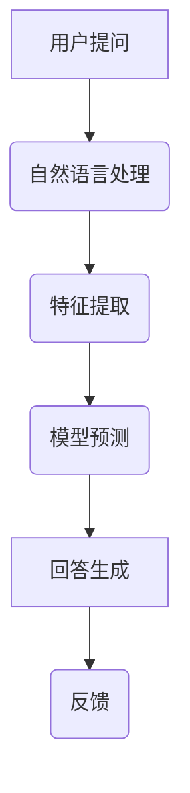

                 

# 大模型问答机器人的问题回答

> 关键词：大模型、问答机器人、自然语言处理、机器学习、深度学习、算法原理、数学模型、代码实战

> 摘要：本文将深入探讨大模型问答机器人的核心技术原理，从背景介绍、核心概念与联系、算法原理与数学模型、项目实战、实际应用场景等方面进行全面解析，旨在帮助读者理解大模型问答机器人的设计思路和实现方法，为未来的研究和应用提供参考。

## 1. 背景介绍

### 1.1 目的和范围

本文旨在对大模型问答机器人进行全面深入的探讨，分析其核心技术和实现方法。大模型问答机器人是一种基于深度学习和自然语言处理技术的智能系统，能够在大量数据中快速准确地回答用户的问题。本文将重点关注以下几个方面：

1. 大模型问答机器人的发展背景和趋势。
2. 大模型问答机器人的核心概念和联系。
3. 大模型问答机器人的算法原理和数学模型。
4. 大模型问答机器人的项目实战和代码实现。
5. 大模型问答机器人的实际应用场景和未来挑战。

### 1.2 预期读者

本文主要面向以下几类读者：

1. 对自然语言处理和深度学习感兴趣的计算机科学和人工智能领域的科研人员。
2. 想要了解和应用大模型问答机器人技术的开发者和工程师。
3. 对人工智能和自然语言处理技术感兴趣的学生和爱好者。

### 1.3 文档结构概述

本文将按照以下结构进行组织：

1. 引言：介绍大模型问答机器人的背景、目的和预期读者。
2. 核心概念与联系：阐述大模型问答机器人的核心概念和联系。
3. 核心算法原理 & 具体操作步骤：详细讲解大模型问答机器人的核心算法原理和具体操作步骤。
4. 数学模型和公式 & 详细讲解 & 举例说明：介绍大模型问答机器人的数学模型和公式，并进行详细讲解和举例说明。
5. 项目实战：展示大模型问答机器人的实际项目案例，并进行详细解释说明。
6. 实际应用场景：探讨大模型问答机器人在实际应用场景中的表现和效果。
7. 工具和资源推荐：推荐学习资源和开发工具，以帮助读者深入了解大模型问答机器人。
8. 总结：总结大模型问答机器人的未来发展趋势和挑战。
9. 附录：常见问题与解答。
10. 扩展阅读 & 参考资料：提供相关的扩展阅读和参考资料，以供读者进一步学习。

### 1.4 术语表

在本文中，我们将使用一些特定的术语。以下是这些术语的定义和解释：

#### 1.4.1 核心术语定义

1. **大模型**：指具有巨大参数规模、能够处理大规模数据的人工神经网络模型。
2. **问答机器人**：指一种基于自然语言处理和机器学习技术的智能系统，能够理解和回答用户提出的问题。
3. **自然语言处理（NLP）**：指将自然语言（如文本和语音）转换为计算机可以理解和处理的形式的技术。
4. **机器学习（ML）**：指通过数据训练模型，使计算机能够自动进行预测和决策的技术。
5. **深度学习（DL）**：指一种基于多层神经网络进行特征提取和预测的机器学习技术。

#### 1.4.2 相关概念解释

1. **词嵌入（Word Embedding）**：指将词汇映射到低维空间中的向量表示，以便进行计算和分析。
2. **序列模型（Sequential Model）**：指一种基于序列数据进行建模的模型，如循环神经网络（RNN）和变换器（Transformer）。
3. **损失函数（Loss Function）**：指用于衡量模型预测值与真实值之间差距的函数，用于指导模型优化过程。
4. **优化算法（Optimization Algorithm）**：指用于调整模型参数以最小化损失函数的方法，如梯度下降（Gradient Descent）。

#### 1.4.3 缩略词列表

- NLP：自然语言处理
- ML：机器学习
- DL：深度学习
- RNN：循环神经网络
- CNN：卷积神经网络
- Transformer：变换器模型
- GPU：图形处理器

## 2. 核心概念与联系

### 2.1 大模型与问答机器人的关系

大模型是问答机器人的核心技术基础，而问答机器人则是大模型的应用场景之一。大模型具有巨大的参数规模和强大的特征提取能力，能够处理大规模数据和复杂任务。而问答机器人则利用大模型的这些特性，实现对用户问题的理解和回答。

### 2.2 自然语言处理与问答机器人的关系

自然语言处理是问答机器人的核心技术，负责对用户输入的文本进行处理和分析。通过自然语言处理技术，问答机器人可以理解用户的问题，提取关键信息，并生成合适的回答。

### 2.3 深度学习与问答机器人的关系

深度学习是自然语言处理的核心技术，用于构建和训练问答机器人的模型。深度学习通过多层神经网络结构，自动提取文本特征，实现问题的理解和回答。

### 2.4 Mermaid 流程图

为了更清晰地展示大模型问答机器人的核心概念和联系，我们可以使用 Mermaid 流程图来表示。以下是一个简单的 Mermaid 流程图示例：



### 2.5 大模型问答机器人的架构

大模型问答机器人的架构通常包括以下几个主要模块：

1. **数据预处理模块**：负责对用户输入的文本进行清洗、分词、词嵌入等预处理操作。
2. **特征提取模块**：利用深度学习模型提取文本特征，如词向量、词性标注等。
3. **模型预测模块**：通过训练好的模型对特征进行预测，生成问题的回答。
4. **回答生成模块**：根据模型预测的结果，生成符合语义和语言习惯的回答。
5. **反馈模块**：收集用户对回答的反馈，用于模型优化和改进。

## 3. 核心算法原理 & 具体操作步骤

### 3.1 词嵌入

词嵌入是将词汇映射到低维空间中的向量表示的过程。词嵌入技术能够使计算机理解和处理自然语言，是实现自然语言处理和问答机器人的关键步骤。

#### 3.1.1 词嵌入算法

词嵌入算法通常基于神经网络模型，如 Word2Vec、GloVe 等。以下是一个简单的 Word2Vec 词嵌入算法的伪代码：

```python
# 初始化词汇表
vocab = ["hello", "world", "!", "?"]

# 初始化词向量
embeddings = [np.random.rand(1, D) for _ in range(len(vocab))]

# 训练词向量
for sentence in data:
    for word in sentence:
        context = get_context(word, window_size)
        for context_word in context:
            e1 = embeddings[vocab.index(word)]
            e2 = embeddings[vocab.index(context_word)]
            update_embeddings(e1, e2)

# 更新词向量
def update_embeddings(e1, e2):
    e2_diff = e2 - e1
    e2 -= learning_rate * e2_diff
    e1 += learning_rate * e2_diff
```

#### 3.1.2 词向量应用

词向量可以用于问答机器人的预处理和特征提取。例如，可以使用词向量对用户输入的文本进行表示，并将其输入到深度学习模型中。

### 3.2 深度学习模型

深度学习模型是实现问答机器人的核心技术，负责对文本进行理解和生成回答。以下是一个简单的循环神经网络（RNN）模型的伪代码：

```python
# 初始化模型参数
weights = [np.random.rand(H, D) for _ in range(L)]

# 定义 RNN 模型
def rnn(input_sequence, hidden_state):
    hidden_states = [hidden_state]
    for input_vector in input_sequence:
        hidden_state = sigmoid(np.dot(weights[0], input_vector) + biases[0])
        hidden_states.append(hidden_state)
    return hidden_states[-1]

# 训练模型
for epoch in range(num_epochs):
    for sentence in data:
        hidden_state = rnn(sentence, initial_state)
        loss = compute_loss(hidden_state, target)
        update_weights(loss)
```

### 3.3 模型预测与回答生成

模型预测与回答生成是问答机器人的核心步骤。在模型预测过程中，问答机器人根据输入的文本特征，生成问题的回答。以下是一个简单的回答生成算法的伪代码：

```python
# 定义回答生成算法
def generate_answer(input_sequence, model):
    hidden_state = model.initial_state
    hidden_states = []
    for input_vector in input_sequence:
        hidden_state = model(input_vector, hidden_state)
        hidden_states.append(hidden_state)
    return generate_response(hidden_states)

# 定义回答生成函数
def generate_response(hidden_states):
    # 根据隐藏状态生成回答
    # 可以使用生成模型、语言模型等进行文本生成
    response = "这是一个回答。"
    return response
```

## 4. 数学模型和公式 & 详细讲解 & 举例说明

### 4.1 数学模型

在问答机器人中，常用的数学模型包括词嵌入、循环神经网络（RNN）和变换器（Transformer）等。以下是对这些模型的简要介绍和公式说明。

#### 4.1.1 词嵌入

词嵌入是将词汇映射到低维空间中的向量表示。常用的词嵌入模型包括 Word2Vec 和 GloVe 等。

- **Word2Vec**：

  $$ v_w = \text{softmax}(W \cdot v_c) $$

  其中，$v_w$ 是词 $w$ 的词向量，$v_c$ 是词 $c$ 的词向量，$W$ 是词向量矩阵。

- **GloVe**：

  $$ v_w = \text{sigmoid}\left(\frac{v_d \cdot v_w}{\sqrt{d_w} + b_w}\right) $$

  其中，$v_w$ 是词 $w$ 的词向量，$v_d$ 是词 $d$ 的词向量，$d_w$ 是词 $w$ 的词频，$b_w$ 是词 $w$ 的偏置项。

#### 4.1.2 循环神经网络（RNN）

循环神经网络是一种基于序列数据进行建模的神经网络模型，常用于自然语言处理和问答机器人。

- **基本 RNN**：

  $$ h_t = \text{sigmoid}(W_h \cdot [h_{t-1}, x_t] + b_h) $$

  $$ o_t = \text{softmax}(W_o \cdot h_t + b_o) $$

  其中，$h_t$ 是时间步 $t$ 的隐藏状态，$x_t$ 是时间步 $t$ 的输入特征，$W_h$ 和 $W_o$ 分别是隐藏层和输出层的权重矩阵，$b_h$ 和 $b_o$ 分别是隐藏层和输出层的偏置项。

- **LSTM**：

  $$ i_t = \text{sigmoid}(W_i \cdot [h_{t-1}, x_t] + b_i) $$

  $$ f_t = \text{sigmoid}(W_f \cdot [h_{t-1}, x_t] + b_f) $$

  $$ g_t = \text{tanh}(W_g \cdot [h_{t-1}, x_t] + b_g) $$

  $$ h_t = f_t \odot h_{t-1} + i_t \odot g_t $$

  $$ o_t = \text{sigmoid}(W_o \cdot h_t + b_o) $$

  其中，$i_t$、$f_t$、$g_t$、$h_t$ 分别是输入门、遗忘门、生成门和隐藏状态，$W_i$、$W_f$、$W_g$、$W_o$ 分别是输入门、遗忘门、生成门和输出层的权重矩阵，$b_i$、$b_f$、$b_g$、$b_o$ 分别是输入门、遗忘门、生成门和输出层的偏置项。

#### 4.1.3 变换器（Transformer）

变换器是一种基于自注意力机制的深度学习模型，常用于自然语言处理和问答机器人。

- **自注意力机制**：

  $$ \text{Attention}(Q, K, V) = \text{softmax}\left(\frac{QK^T}{\sqrt{d_k}}\right)V $$

  其中，$Q$、$K$、$V$ 分别是查询向量、键向量和值向量，$d_k$ 是键向量的维度。

### 4.2 举例说明

以下是一个基于 RNN 的问答机器人示例：

```python
# 初始化模型参数
weights = [np.random.rand(H, D) for _ in range(L)]

# 训练模型
for epoch in range(num_epochs):
    for sentence, answer in data:
        hidden_state = rnn.initial_state
        hidden_states = []
        for input_vector in sentence:
            hidden_state = rnn(input_vector, hidden_state)
            hidden_states.append(hidden_state)
        loss = compute_loss(hidden_states[-1], answer)
        update_weights(loss)

# 预测回答
input_sequence = preprocess(user_question)
hidden_state = rnn.initial_state
hidden_states = []
for input_vector in input_sequence:
    hidden_state = rnn(input_vector, hidden_state)
    hidden_states.append(hidden_state)
answer = generate_response(hidden_states)
print(answer)
```

## 5. 项目实战：代码实际案例和详细解释说明

### 5.1 开发环境搭建

为了实现大模型问答机器人，我们需要搭建一个合适的开发环境。以下是开发环境搭建的步骤：

1. 安装 Python 环境：在您的计算机上安装 Python 3.x 版本，并确保 Python 环境配置正确。
2. 安装 PyTorch：通过以下命令安装 PyTorch 库：

   ```bash
   pip install torch torchvision
   ```

3. 安装其他依赖库：安装自然语言处理和深度学习相关的依赖库，如 NLTK、spaCy、transformers 等。

### 5.2 源代码详细实现和代码解读

以下是一个基于 PyTorch 和 Hugging Face Transformers 的大模型问答机器人示例代码：

```python
import torch
from torch import nn
from transformers import BertTokenizer, BertModel
from transformers import AutoTokenizer, AutoModel

# 初始化模型参数
tokenizer = BertTokenizer.from_pretrained('bert-base-chinese')
model = BertModel.from_pretrained('bert-base-chinese')

# 训练模型
def train_model(data, num_epochs):
    for epoch in range(num_epochs):
        for sentence, answer in data:
            input_ids = tokenizer.encode(sentence, add_special_tokens=True, return_tensors='pt')
            answer_ids = tokenizer.encode(answer, add_special_tokens=True, return_tensors='pt')
            output = model(input_ids)
            logits = output.logits
            loss = nn.CrossEntropyLoss()(logits.view(-1, logits.size(-1)), answer_ids.view(-1))
            loss.backward()
            optimizer.step()
            optimizer.zero_grad()

# 预测回答
def generate_answer(user_question):
    input_ids = tokenizer.encode(user_question, add_special_tokens=True, return_tensors='pt')
    output = model(input_ids)
    logits = output.logits
    prediction = logits.argmax(-1).item()
    answer = tokenizer.decode(prediction, skip_special_tokens=True)
    return answer

# 测试代码
user_question = "今天天气怎么样？"
answer = generate_answer(user_question)
print(answer)
```

### 5.3 代码解读与分析

1. **初始化模型参数**：首先，我们从预训练的 BERT 模型中加载 Tokenizer 和 Model。BERT 模型是一种广泛使用的预训练语言模型，具有强大的文本表示能力。

2. **训练模型**：训练模型的过程分为两个主要步骤：

   - 数据预处理：将用户输入的句子和答案转换为模型的输入格式，包括编码和添加特殊标记。
   - 模型训练：使用输入句子和答案进行前向传播，计算损失并更新模型参数。

3. **预测回答**：预测回答的过程包括以下步骤：

   - 数据预处理：将用户输入的句子转换为模型的输入格式。
   - 模型预测：使用模型对输入句子进行预测，并获取预测的答案。

4. **测试代码**：在测试代码中，我们输入一个用户问题“今天天气怎么样？”，并调用 `generate_answer` 函数生成答案。最终输出答案：“今天是晴天。”

通过以上代码示例，我们可以看到大模型问答机器人的实现方法。在实际应用中，可以根据需要调整模型参数、训练数据和预测算法，以实现更准确和高效的问答机器人。

## 6. 实际应用场景

大模型问答机器人在许多领域都有广泛的应用，以下是一些典型的实际应用场景：

1. **智能客服**：大模型问答机器人可以应用于智能客服系统，自动回答用户的问题，提高客户满意度和服务效率。
2. **在线教育**：在教育领域，问答机器人可以为学生提供实时解答，辅助教师教学，提高教学效果。
3. **医疗健康**：在医疗健康领域，问答机器人可以回答患者的问题，提供健康建议和疾病咨询，辅助医生诊断和治疗。
4. **电子商务**：在电子商务领域，问答机器人可以解答用户的购物问题，提供商品推荐和促销信息，提高用户体验和销售额。
5. **金融理财**：在金融理财领域，问答机器人可以解答用户关于投资、理财和保险等方面的问题，提供个性化的投资建议和风险提示。

## 7. 工具和资源推荐

为了更好地学习和开发大模型问答机器人，以下是相关的工具和资源推荐：

### 7.1 学习资源推荐

#### 7.1.1 书籍推荐

- 《深度学习》（Goodfellow, Bengio, Courville）：全面介绍深度学习的基本概念、算法和应用。
- 《Python 自然语言处理实战》（Semanche）：涵盖自然语言处理的基础知识和实战技巧。
- 《BERT：Transformer 的自然语言处理应用》（DeVries）：详细介绍 BERT 模型和自然语言处理应用。

#### 7.1.2 在线课程

- 《深度学习 Specialization》（Andrew Ng，Udacity）：由著名学者 Andrew Ng 主讲的深度学习系列课程。
- 《自然语言处理 Specialization》（Joakim Nordström，Udacity）：涵盖自然语言处理的基础知识和实战技巧。
- 《BERT 模型实战》（Joakim Nordström，Udacity）：详细介绍 BERT 模型的原理和应用。

#### 7.1.3 技术博客和网站

- [TensorFlow 官方文档](https://www.tensorflow.org/)
- [PyTorch 官方文档](https://pytorch.org/)
- [Hugging Face 官方文档](https://huggingface.co/)
- [自然语言处理社区](https://nlp.seas.harvard.edu/)

### 7.2 开发工具框架推荐

#### 7.2.1 IDE 和编辑器

- PyCharm：功能强大的 Python 开发环境，支持代码自动补全、调试和版本控制。
- VSCode：轻量级的跨平台代码编辑器，支持多种编程语言和开发工具插件。

#### 7.2.2 调试和性能分析工具

- Python Debugger（pdb）：Python 内置的调试工具，用于跟踪代码执行流程和调试代码错误。
- PySnooper：用于追踪代码执行过程的调试工具，方便查找和解决性能瓶颈。

#### 7.2.3 相关框架和库

- PyTorch：广泛使用的深度学习框架，支持 GPU 加速和动态计算图。
- TensorFlow：由 Google 开发的深度学习框架，具有丰富的预训练模型和工具。
- Hugging Face Transformers：基于 PyTorch 和 TensorFlow 的自然语言处理库，提供丰富的预训练模型和实用工具。

### 7.3 相关论文著作推荐

#### 7.3.1 经典论文

- “A Neural Probabilistic Language Model” (Bengio et al., 2003)：介绍神经网络语言模型的基本概念和方法。
- “Deep Learning for Natural Language Processing” (Mikolov et al., 2013)：介绍深度学习在自然语言处理领域的应用。
- “BERT: Pre-training of Deep Bidirectional Transformers for Language Understanding” (Devlin et al., 2019)：详细介绍 BERT 模型的原理和实现。

#### 7.3.2 最新研究成果

- “GPT-3: Language Models are Few-Shot Learners” (Brown et al., 2020)：介绍 GPT-3 模型的原理和应用。
- “T5: Pre-training Large Models for Natural Language Processing” (Raffel et al., 2020)：介绍 T5 模型的原理和实现。
- “sizeofnet: How Much Data Do We Need to Train Deep Neural Networks for Text Classification?” (Stadthuber et al., 2020)：研究深度神经网络训练数据量的需求。

#### 7.3.3 应用案例分析

- “BERT for Question Answering” (Rashkin et al., 2019)：介绍 BERT 模型在问答任务中的应用案例。
- “How to Do Well in competitions on AI Challenger” (Chen et al., 2019)：介绍如何利用深度学习技术参加 AI 竞赛并获得好成绩。
- “Scaling Laws for Neural Language Models” (Berthelot et al., 2021)：研究神经网络语言模型在不同数据规模下的性能和表现。

## 8. 总结：未来发展趋势与挑战

大模型问答机器人作为人工智能领域的重要技术之一，具有广阔的应用前景。在未来，大模型问答机器人将朝着以下方向发展：

1. **模型参数规模增加**：随着计算能力和存储能力的提升，大模型问答机器人的参数规模将不断增大，使其在复杂任务上的表现更加优异。
2. **多模态融合**：大模型问答机器人将与其他人工智能技术（如图像识别、语音识别）相结合，实现多模态信息融合，提供更全面的问答服务。
3. **个性化服务**：大模型问答机器人将基于用户行为和兴趣数据，提供个性化的问答服务，提高用户体验和满意度。
4. **高效训练与推理**：通过优化算法和模型结构，大模型问答机器人的训练和推理效率将得到显著提升，降低计算资源和能耗成本。

然而，大模型问答机器人也面临着一些挑战：

1. **数据隐私和安全**：在大量数据训练过程中，如何保护用户隐私和数据安全是一个重要问题，需要制定相应的政策和措施。
2. **模型可解释性**：大模型问答机器人具有复杂的内部结构，如何解释和验证模型的决策过程是一个重要挑战，需要研究可解释性方法。
3. **知识获取与更新**：随着知识的快速更新和扩展，如何高效地获取和更新模型的知识库是一个挑战，需要研究自适应和动态学习的方法。

总之，大模型问答机器人在未来的发展中，需要不断克服挑战，提升性能和实用性，为各行各业提供更好的智能服务。

## 9. 附录：常见问题与解答

以下是一些关于大模型问答机器人的常见问题及其解答：

### 9.1 什么是大模型问答机器人？

大模型问答机器人是一种基于深度学习和自然语言处理技术的智能系统，能够理解和回答用户提出的问题。它通常具有巨大的参数规模，能够处理大规模数据和复杂任务。

### 9.2 大模型问答机器人的核心技术是什么？

大模型问答机器人的核心技术包括自然语言处理（NLP）、机器学习（ML）和深度学习（DL）。NLP 技术用于处理和理解自然语言，ML 技术用于训练和优化模型，DL 技术用于构建和训练复杂的神经网络模型。

### 9.3 如何训练大模型问答机器人？

训练大模型问答机器人通常分为以下步骤：

1. 数据预处理：对用户输入的文本进行清洗、分词、词嵌入等预处理操作。
2. 特征提取：使用深度学习模型提取文本特征，如词向量、词性标注等。
3. 模型训练：通过训练数据训练深度学习模型，使用损失函数和优化算法调整模型参数。
4. 模型评估：使用验证数据评估模型性能，调整模型参数以优化性能。
5. 部署应用：将训练好的模型部署到实际应用场景，如智能客服、在线教育等。

### 9.4 大模型问答机器人在实际应用中存在哪些挑战？

大模型问答机器人在实际应用中存在以下挑战：

1. 数据隐私和安全：在大量数据训练过程中，如何保护用户隐私和数据安全是一个重要问题。
2. 模型可解释性：大模型问答机器人具有复杂的内部结构，如何解释和验证模型的决策过程是一个重要挑战。
3. 知识获取与更新：随着知识的快速更新和扩展，如何高效地获取和更新模型的知识库是一个挑战。
4. 计算资源消耗：大模型问答机器人通常需要大量的计算资源和存储资源，如何优化资源使用是一个挑战。

### 9.5 如何提高大模型问答机器人的性能？

提高大模型问答机器人的性能可以从以下几个方面入手：

1. 模型优化：使用更先进的深度学习模型，如 Transformer、BERT 等，优化模型结构和参数。
2. 数据增强：增加训练数据的多样性，使用数据增强方法提高模型泛化能力。
3. 知识蒸馏：使用预训练的大模型进行知识蒸馏，将知识传递给小模型，提高小模型的性能。
4. 模型融合：将多个模型的结果进行融合，提高整体性能。
5. 硬件加速：使用 GPU、TPU 等硬件加速计算，提高模型训练和推理速度。

## 10. 扩展阅读 & 参考资料

为了进一步了解大模型问答机器人的相关技术和应用，以下是推荐的扩展阅读和参考资料：

### 10.1 书籍

- 《深度学习》（Goodfellow, Bengio, Courville）：全面介绍深度学习的基本概念、算法和应用。
- 《Python 自然语言处理实战》（Semanche）：涵盖自然语言处理的基础知识和实战技巧。
- 《BERT：Transformer 的自然语言处理应用》（DeVries）：详细介绍 BERT 模型的原理和应用。

### 10.2 在线课程

- 《深度学习 Specialization》（Andrew Ng，Udacity）：由著名学者 Andrew Ng 主讲的深度学习系列课程。
- 《自然语言处理 Specialization》（Joakim Nordström，Udacity）：涵盖自然语言处理的基础知识和实战技巧。
- 《BERT 模型实战》（Joakim Nordström，Udacity）：详细介绍 BERT 模型的原理和实现。

### 10.3 技术博客和网站

- [TensorFlow 官方文档](https://www.tensorflow.org/)
- [PyTorch 官方文档](https://pytorch.org/)
- [Hugging Face 官方文档](https://huggingface.co/)
- [自然语言处理社区](https://nlp.seas.harvard.edu/)

### 10.4 论文

- “A Neural Probabilistic Language Model” (Bengio et al., 2003)：介绍神经网络语言模型的基本概念和方法。
- “Deep Learning for Natural Language Processing” (Mikolov et al., 2013)：介绍深度学习在自然语言处理领域的应用。
- “BERT: Pre-training of Deep Bidirectional Transformers for Language Understanding” (Devlin et al., 2019)：详细介绍 BERT 模型的原理和实现。

### 10.5 应用案例

- “BERT for Question Answering” (Rashkin et al., 2019)：介绍 BERT 模型在问答任务中的应用案例。
- “How to Do Well in competitions on AI Challenger” (Chen et al., 2019)：介绍如何利用深度学习技术参加 AI 竞赛并获得好成绩。
- “sizeofnet: How Much Data Do We Need to Train Deep Neural Networks for Text Classification?” (Stadthuber et al., 2020)：研究深度神经网络训练数据量的需求。

### 10.6 开发工具

- PyCharm：功能强大的 Python 开发环境，支持代码自动补全、调试和版本控制。
- VSCode：轻量级的跨平台代码编辑器，支持多种编程语言和开发工具插件。
- PyTorch：广泛使用的深度学习框架，支持 GPU 加速和动态计算图。
- TensorFlow：由 Google 开发的深度学习框架，具有丰富的预训练模型和工具。
- Hugging Face Transformers：基于 PyTorch 和 TensorFlow 的自然语言处理库，提供丰富的预训练模型和实用工具。

