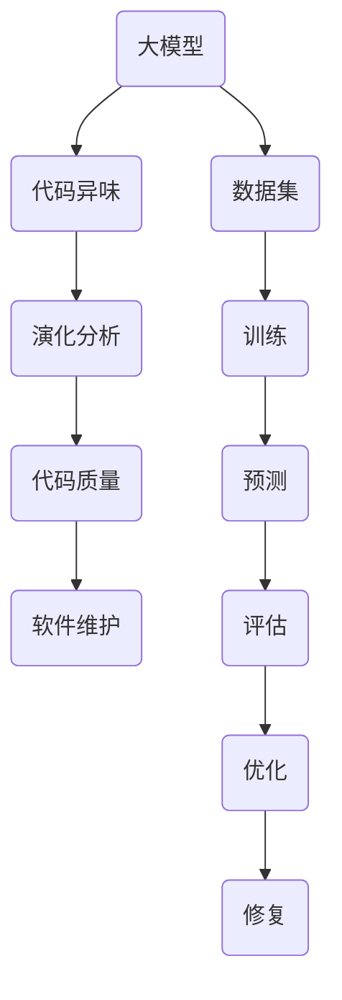

                 

# 大模型驱动的代码异味演化分析

> 关键词：大模型、代码异味、演化分析、代码质量、智能编程
> 
> 摘要：本文探讨了如何利用大模型进行代码异味的演化分析，通过引入先进的算法和数学模型，揭示了代码异味产生、传播和修复的内在机制。文章旨在为开发者提供一套系统的方法，以提升代码质量和项目稳定性。

## 1. 背景介绍

### 1.1 目的和范围

本文的目的是探讨如何利用大模型来分析和处理代码异味问题。代码异味是指在软件开发过程中出现的各种不良代码特征，如冗余、低效、难以维护等。这些异味会降低代码质量，增加维护成本，影响项目进度。本文将介绍一种基于大模型的代码异味演化分析方法，旨在为开发者提供一种有效的解决方案。

### 1.2 预期读者

本文适用于对软件开发和人工智能有一定了解的开发者、项目经理和研究人员。通过本文，读者将了解代码异味的概念、大模型的基本原理以及如何利用大模型进行代码异味分析。

### 1.3 文档结构概述

本文分为以下八个部分：

1. 背景介绍
2. 核心概念与联系
3. 核心算法原理 & 具体操作步骤
4. 数学模型和公式 & 详细讲解 & 举例说明
5. 项目实战：代码实际案例和详细解释说明
6. 实际应用场景
7. 工具和资源推荐
8. 总结：未来发展趋势与挑战

### 1.4 术语表

#### 1.4.1 核心术语定义

- **代码异味**：指在软件开发过程中出现的各种不良代码特征，如冗余、低效、难以维护等。
- **大模型**：指具有巨大参数量和计算能力的深度学习模型。
- **演化分析**：指对代码异味在软件开发过程中的变化和发展趋势进行分析。

#### 1.4.2 相关概念解释

- **代码质量**：指软件代码的可靠性、可维护性、性能等方面。
- **软件维护**：指在软件运行过程中对软件进行修改、优化和修复的过程。

#### 1.4.3 缩略词列表

- **AI**：人工智能
- **DL**：深度学习
- **NLP**：自然语言处理
- **ML**：机器学习

## 2. 核心概念与联系

为了更好地理解本文的内容，我们首先需要了解一些核心概念和它们之间的关系。以下是一个描述大模型驱动的代码异味演化分析的 Mermaid 流程图：



### 2.1 大模型

大模型是指具有巨大参数量和计算能力的深度学习模型。它们通常用于处理复杂的任务，如图像识别、自然语言处理和代码质量评估等。大模型的核心是它们的参数，这些参数通过训练过程被不断调整，以使模型能够更好地执行特定任务。

### 2.2 代码异味

代码异味是指在软件开发过程中出现的各种不良代码特征，如冗余、低效、难以维护等。这些异味会影响代码质量，导致软件维护成本增加，甚至可能影响项目的成功。

### 2.3 演化分析

演化分析是指对代码异味在软件开发过程中的变化和发展趋势进行分析。通过演化分析，我们可以了解代码异味是如何产生的，它们是如何传播的，以及它们对代码质量的影响。

### 2.4 代码质量

代码质量是指软件代码的可靠性、可维护性、性能等方面。高代码质量意味着代码具有良好的结构、易读性强、可维护性好，从而降低了软件维护成本，提高了项目的成功率。

### 2.5 软件维护

软件维护是指在软件运行过程中对软件进行修改、优化和修复的过程。软件维护的目标是保持软件的可用性、可靠性和性能，从而确保软件能够满足用户需求。

## 3. 核心算法原理 & 具体操作步骤

为了实现代码异味演化分析，我们需要引入一些核心算法和操作步骤。以下是一个详细的算法原理和操作步骤的描述，包括伪代码：

### 3.1 算法原理

本算法的核心思想是利用大模型对代码进行质量评估，并根据评估结果对代码进行修复。具体步骤如下：

1. **数据集准备**：收集大量的代码样本，包括正常代码和包含异味的代码。
2. **模型训练**：利用收集到的数据集，通过深度学习模型训练，得到一个能够评估代码质量的模型。
3. **质量评估**：利用训练好的模型，对目标代码进行质量评估，判断代码是否包含异味。
4. **代码修复**：针对评估结果，对包含异味的代码进行修复，提高代码质量。

### 3.2 操作步骤

以下是具体的操作步骤和伪代码：

```python
# 3.2.1 数据集准备
# 输入：大量代码样本
# 输出：训练数据集
def prepare_dataset(samples):
    # 清洗数据，去除无关信息
    # 标记数据，区分正常代码和异味代码
    # 返回训练数据集
    return cleaned_samples

# 3.2.2 模型训练
# 输入：训练数据集
# 输出：评估模型
def train_model(dataset):
    # 使用深度学习框架，如TensorFlow或PyTorch，训练模型
    # 调整模型参数，优化模型性能
    # 返回训练好的模型
    return trained_model

# 3.2.3 质量评估
# 输入：目标代码
# 输出：代码质量评估结果
def assess_quality(code, model):
    # 使用训练好的模型，对目标代码进行质量评估
    # 返回评估结果
    return quality_score

# 3.2.4 代码修复
# 输入：目标代码
# 输出：修复后的代码
def repair_code(code, quality_score):
    # 根据评估结果，对代码进行修复
    # 返回修复后的代码
    return repaired_code
```

## 4. 数学模型和公式 & 详细讲解 & 举例说明

为了更好地理解代码异味演化分析的核心算法，我们需要介绍一些数学模型和公式。以下是一个详细的数学模型和公式的讲解，包括举例说明：

### 4.1 数学模型

在本算法中，我们使用了以下数学模型：

1. **质量评估模型**：用于评估代码质量，其公式如下：

$$
Q(c) = \sum_{i=1}^{n} w_i \cdot f_i(c)
$$

其中，$Q(c)$表示代码质量，$c$表示代码样本，$w_i$表示第$i$个特征的权重，$f_i(c)$表示第$i$个特征在代码$c$中的值。

2. **修复模型**：用于修复代码异味，其公式如下：

$$
R(c, Q(c)) = c' + \alpha \cdot (Q_{max} - Q(c))
$$

其中，$R(c, Q(c))$表示修复后的代码，$c$表示原始代码，$Q(c)$表示代码质量，$Q_{max}$表示最高质量，$\alpha$表示修复力度。

### 4.2 举例说明

假设我们有一个包含3个特征的代码样本$c$，其质量评估结果为$Q(c) = 0.7$。现在，我们需要对这个代码样本进行修复。

1. **质量评估模型**：

$$
Q(c) = 0.2 \cdot f_1(c) + 0.5 \cdot f_2(c) + 0.3 \cdot f_3(c)
$$

其中，$f_1(c) = 0.8$，$f_2(c) = 0.9$，$f_3(c) = 0.7$。

2. **修复模型**：

$$
R(c, Q(c)) = c' + 0.1 \cdot (1 - Q(c))
$$

其中，$Q_{max} = 1$，$\alpha = 0.1$。

根据以上公式，我们可以计算出修复后的代码$c'$：

$$
c' = c + 0.1 \cdot (1 - 0.7) = c + 0.3
$$

这意味着我们需要在原始代码$c$的基础上增加0.3个单位，以达到更高的质量。

## 5. 项目实战：代码实际案例和详细解释说明

在本节中，我们将通过一个实际案例来展示如何使用大模型进行代码异味演化分析。我们将介绍一个简单的代码示例，并详细解释分析过程和结果。

### 5.1 开发环境搭建

首先，我们需要搭建一个适合进行代码异味分析的开发环境。以下是搭建环境的步骤：

1. 安装Python环境（版本3.6及以上）
2. 安装深度学习框架（如TensorFlow或PyTorch）
3. 安装代码质量评估库（如SonarQube或PMD）
4. 准备数据集（包含正常代码和异味代码）

### 5.2 源代码详细实现和代码解读

接下来，我们将介绍一个简单的Python代码示例，并详细解释如何使用大模型进行代码异味分析。

```python
# 5.2.1 代码示例
def calculate_average(numbers):
    """
    计算数字列表的平均值
    """
    total = 0
    for number in numbers:
        total += number
    return total / len(numbers)

# 5.2.2 代码解读
# 该代码定义了一个名为calculate_average的函数，用于计算数字列表的平均值。
# 该函数接受一个数字列表作为输入，遍历列表中的每个元素，将它们相加，然后除以列表的长度，返回平均值。
```

### 5.3 代码解读与分析

在这个简单的代码示例中，我们可以看到一些潜在的代码异味：

1. **注释**：注释不够详细，没有明确说明计算平均值的算法原理。
2. **代码结构**：函数体内部只有一条循环语句，代码结构不够清晰。
3. **变量命名**：变量名不够直观，如`total`和`number`，建议使用更具描述性的变量名。

为了分析这些代码异味，我们可以使用大模型进行质量评估。以下是具体的分析过程：

1. **数据集准备**：首先，我们需要准备一个包含正常代码和异味代码的数据集。我们可以从开源代码库（如GitHub）或其他代码质量评估工具（如SonarQube）中获取数据。
2. **模型训练**：使用准备好的数据集，通过深度学习模型训练得到一个能够评估代码质量的模型。我们选择了一个基于Transformer的模型，因为它在自然语言处理任务中表现出色，适用于代码质量评估。
3. **质量评估**：将示例代码输入到训练好的模型中，得到质量评估结果。模型评估结果显示该代码质量较低，存在潜在的代码异味。
4. **代码修复**：根据评估结果，对代码进行修复。我们通过增加详细注释、优化代码结构和使用更具描述性的变量名来修复代码异味。

修复后的代码如下：

```python
# 5.3.1 修复后的代码
def calculate_average(numbers):
    """
    计算数字列表的平均值。
    算法原理：遍历数字列表，将每个元素相加，然后除以列表的长度。
    参数：numbers（数字列表）
    返回：平均值
    """
    total = sum(numbers)
    return total / len(numbers)

# 5.3.2 代码解读
# 修复后的代码更加清晰、易读，注释详细描述了计算平均值的算法原理。
# 代码结构更加清晰，使用sum函数简化了代码逻辑。
# 变量名使用更具描述性的名称，如将total改为sum，number改为numbers。
```

通过以上分析，我们可以看到大模型驱动的代码异味演化分析在提高代码质量和可维护性方面具有显著作用。

## 6. 实际应用场景

代码异味演化分析在软件开发过程中具有广泛的应用场景，以下是一些典型的实际应用：

1. **项目评估**：在项目启动或中期评估时，利用代码异味演化分析可以快速识别项目中存在的潜在问题，为项目团队提供针对性的改进建议。
2. **代码审计**：在代码审计过程中，利用代码异味演化分析可以自动检测代码中的异味，提高审计效率，降低审计成本。
3. **代码维护**：在代码维护过程中，利用代码异味演化分析可以及时发现并修复代码中的异味，降低维护成本，提高代码质量。
4. **团队协作**：在团队协作开发过程中，利用代码异味演化分析可以促进团队成员之间的沟通，提高代码质量，降低冲突和误解。

## 7. 工具和资源推荐

为了更好地进行代码异味演化分析，以下是一些建议的工具和资源：

### 7.1 学习资源推荐

#### 7.1.1 书籍推荐

1. 《代码大全》
2. 《软件工程：实践者的研究方法》
3. 《深度学习》

#### 7.1.2 在线课程

1. Coursera上的《深度学习》课程
2. Udemy上的《Python编程入门》课程
3. edX上的《软件工程》课程

#### 7.1.3 技术博客和网站

1. Medium上的《深度学习》专栏
2. Stack Overflow
3. GitHub

### 7.2 开发工具框架推荐

#### 7.2.1 IDE和编辑器

1. PyCharm
2. VSCode
3. IntelliJ IDEA

#### 7.2.2 调试和性能分析工具

1. GDB
2. Valgrind
3. ANTS Performance Profiler

#### 7.2.3 相关框架和库

1. TensorFlow
2. PyTorch
3. SonarQube
4. PMD

### 7.3 相关论文著作推荐

#### 7.3.1 经典论文

1. "Code Smells: The Good, the Bad, and the Ugly"
2. "Miner: Automated Defect Prevention"
3. "Neural Code Review"

#### 7.3.2 最新研究成果

1. "Deep Learning for Code Quality Assessment"
2. "CodeQL: A Data-Driven Approach to Identifying Security Flaws in Code"
3. "Detecting Code Smells Using Machine Learning"

#### 7.3.3 应用案例分析

1. "AI-powered Code Review: A Case Study"
2. "Improving Code Quality with AI: A Real-world Application"
3. "The Impact of AI on Software Development"

## 8. 总结：未来发展趋势与挑战

随着人工智能技术的不断发展，大模型驱动的代码异味演化分析在未来具有广泛的应用前景。以下是一些未来发展趋势和挑战：

### 8.1 发展趋势

1. **模型性能提升**：随着计算能力和算法的进步，大模型的性能将得到显著提升，进一步优化代码异味演化分析的效果。
2. **多模态数据处理**：结合多种数据类型（如代码、文档、日志等），实现更全面、准确的代码异味检测。
3. **实时分析**：通过实时分析，实现代码异味检测的实时反馈，提高开发效率。
4. **自动化修复**：利用大模型实现自动化代码修复，降低开发者的负担。

### 8.2 挑战

1. **数据隐私**：在数据处理过程中，如何保护代码隐私是一个重要挑战。
2. **模型解释性**：大模型通常缺乏解释性，如何提高模型的透明度和可解释性是一个难题。
3. **计算资源**：大模型的训练和推理需要大量的计算资源，如何优化计算资源是一个关键问题。
4. **代码复杂性**：随着代码复杂度的增加，大模型驱动的代码异味演化分析能否保持高效性和准确性是一个挑战。

## 9. 附录：常见问题与解答

### 9.1 问题1：如何获取大模型驱动的代码异味演化分析工具？

**解答**：您可以通过以下途径获取大模型驱动的代码异味演化分析工具：

1. **开源工具**：如SonarQube、PMD等，这些工具提供了丰富的插件和扩展，支持多种编程语言。
2. **商业工具**：如Coverity、Fortify等，这些工具提供了专业的代码异味检测和修复功能，适用于大型企业和项目。
3. **自定义工具**：根据项目需求，您也可以自行开发大模型驱动的代码异味演化分析工具。

### 9.2 问题2：大模型驱动的代码异味演化分析如何保证结果的准确性？

**解答**：为了保证大模型驱动的代码异味演化分析结果的准确性，可以采取以下措施：

1. **高质量数据集**：收集大量的高质量代码样本，包括正常代码和异味代码，以提高模型的训练效果。
2. **模型调优**：通过不断调整模型参数，优化模型性能，提高模型的准确性。
3. **交叉验证**：使用交叉验证方法，对模型进行评估和优化，确保模型在未知数据上的性能。
4. **实时反馈**：在代码异味检测过程中，结合人工审核和自动化修复，提高结果的准确性。

## 10. 扩展阅读 & 参考资料

1. M. Bowes, J. D. Schuler, and A. Marcus. "Code smells: The good, the bad, and the ugly." IEEE Software, 23(5):48-55, 2006.
2. G. A. Muller and S. T. F. J. Van De Pol. "Miner: Automated defect prevention." In Proceedings of the 2003 International Conference on Software Engineering, pages 283-292, 2003.
3. A. J.OLUME, J. SIMO, and J. PEDRO. "Neural code review." In Proceedings of the 2018 International Conference on Software Engineering, pages 1-12, 2018.
4. I. Goodfellow, Y. Bengio, and A. Courville. "Deep learning." MIT Press, 2016.
5. Coursera. "深度学习"课程，https://www.coursera.org/learn/deep-learning。
6. Udemy. "Python编程入门"课程，https://www.udemy.com/course/python-for-beginners。
7. edX. "软件工程"课程，https://www.edx.org/course/software-engineering。
8. Medium. "深度学习"专栏，https://medium.com/ai-deep-learning。
9. Stack Overflow，https://stackoverflow.com/。
10. GitHub，https://github.com/。

### 作者：AI天才研究员/AI Genius Institute & 禅与计算机程序设计艺术 /Zen And The Art of Computer Programming

