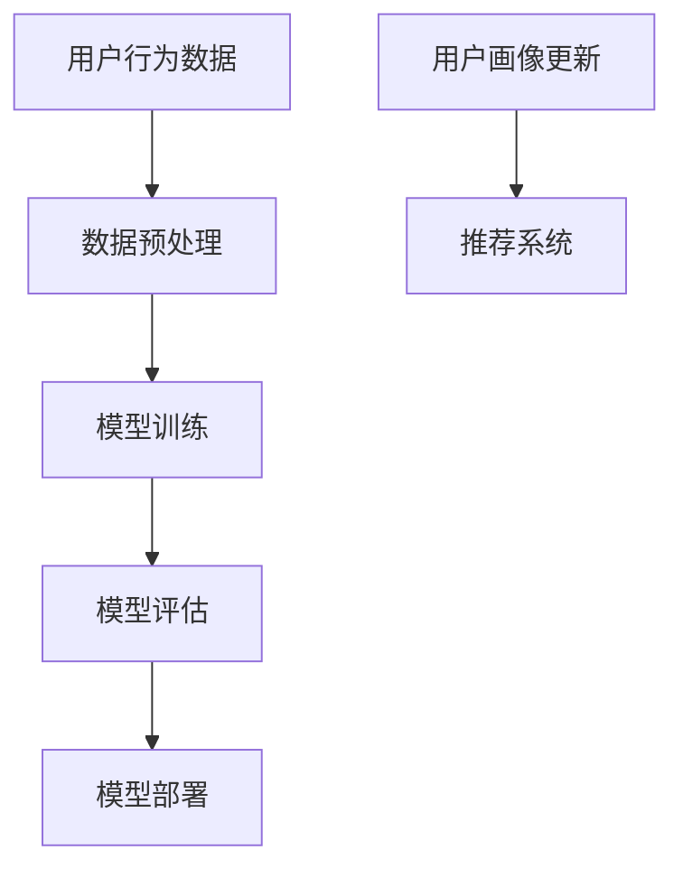

                 

# 大模型驱动的推荐系统用户画像动态更新

> 关键词：推荐系统、用户画像、动态更新、大模型、人工智能、机器学习、深度学习

> 摘要：本文旨在探讨如何利用大模型技术来动态更新推荐系统中的用户画像，从而提高推荐系统的准确性和用户体验。本文首先介绍了推荐系统和用户画像的基本概念，然后详细阐述了利用大模型技术进行用户画像动态更新的方法，并通过实际案例展示了其应用效果。

## 1. 背景介绍

### 1.1 目的和范围

本文的主要目的是探讨如何利用大模型技术来动态更新推荐系统中的用户画像，从而提高推荐系统的准确性和用户体验。在本文中，我们将重点讨论以下内容：

1. 推荐系统和用户画像的基本概念和重要性。
2. 大模型技术在推荐系统和用户画像更新中的应用。
3. 动态更新用户画像的核心算法原理和具体操作步骤。
4. 实际应用场景和工具资源推荐。

### 1.2 预期读者

本文适合以下读者群体：

1. 推荐系统和人工智能领域的研究人员。
2. 软件工程师和开发者，特别是那些对推荐系统和用户画像动态更新感兴趣的人。
3. 对推荐系统和用户画像动态更新有实践需求的企业和机构。

### 1.3 文档结构概述

本文分为以下几个部分：

1. 背景介绍：介绍本文的目的、范围、预期读者以及文档结构。
2. 核心概念与联系：介绍推荐系统和用户画像的基本概念，以及大模型技术的原理和架构。
3. 核心算法原理 & 具体操作步骤：详细阐述动态更新用户画像的核心算法原理和具体操作步骤。
4. 数学模型和公式 & 详细讲解 & 举例说明：介绍动态更新用户画像的数学模型和公式，并进行举例说明。
5. 项目实战：提供实际代码案例和详细解释说明。
6. 实际应用场景：分析动态更新用户画像在实际应用场景中的作用。
7. 工具和资源推荐：推荐学习资源、开发工具框架和相关论文著作。
8. 总结：总结本文的主要观点和未来发展趋势。
9. 附录：常见问题与解答。
10. 扩展阅读 & 参考资料：提供扩展阅读和参考资料。

### 1.4 术语表

#### 1.4.1 核心术语定义

1. 推荐系统（Recommender System）：一种能够根据用户的兴趣、偏好和活动向用户推荐相关内容或项目的系统。
2. 用户画像（User Profile）：描述用户特征和兴趣的集合，通常包括用户的基本信息、行为数据、兴趣标签等。
3. 大模型（Large-scale Model）：一种能够处理大规模数据和复杂任务的机器学习模型，通常具有数十亿个参数。
4. 动态更新（Dynamic Update）：根据用户的新行为和反馈实时更新用户画像的过程。

#### 1.4.2 相关概念解释

1. 机器学习（Machine Learning）：一种通过数据训练模型，使模型能够自动学习和预测的方法。
2. 深度学习（Deep Learning）：一种基于人工神经网络，特别是深度神经网络的方法，能够处理大规模数据和复杂任务。
3. 用户行为（User Behavior）：用户在使用推荐系统时产生的行为数据，如浏览、点击、购买等。

#### 1.4.3 缩略词列表

1. ML：机器学习
2. DL：深度学习
3. NLP：自然语言处理
4. CV：计算机视觉

## 2. 核心概念与联系

### 2.1 推荐系统与用户画像的关系

推荐系统（Recommender System）是一种根据用户的兴趣、偏好和活动，向用户推荐相关内容或项目的系统。用户画像（User Profile）是描述用户特征和兴趣的集合，通常包括用户的基本信息、行为数据、兴趣标签等。

推荐系统和用户画像之间有着密切的联系。用户画像为推荐系统提供了用户特征和兴趣的输入，推荐系统根据用户画像和推荐算法，生成推荐结果。动态更新用户画像可以帮助推荐系统更好地捕捉用户的兴趣变化，提高推荐准确性。

### 2.2 大模型技术原理和架构

大模型（Large-scale Model）是一种能够处理大规模数据和复杂任务的机器学习模型，通常具有数十亿个参数。大模型技术主要包括以下两个方面：

1. 模型训练：通过大规模数据进行模型训练，使得模型能够学会捕捉数据中的特征和规律。
2. 模型推理：在给定输入数据时，模型能够根据训练结果生成预测或输出结果。

大模型技术的架构通常包括以下几个部分：

1. 数据预处理：对输入数据进行清洗、归一化等预处理操作，以便模型训练和推理。
2. 模型训练：通过优化算法，调整模型参数，使得模型能够捕捉数据中的特征和规律。
3. 模型评估：使用验证集或测试集对模型进行评估，以确定模型性能。
4. 模型部署：将训练好的模型部署到生产环境中，进行实时预测和更新。

### 2.3 Mermaid 流程图

下面是一个简单的 Mermaid 流程图，展示了推荐系统和用户画像的关系以及大模型技术的架构：



## 3. 核心算法原理 & 具体操作步骤

### 3.1 动态更新用户画像的核心算法原理

动态更新用户画像的核心算法是基于大模型技术的机器学习模型。该模型的目标是捕捉用户的行为和兴趣变化，实时更新用户画像。

具体来说，该算法可以分为以下几个步骤：

1. 数据收集：收集用户在推荐系统上的行为数据，如浏览、点击、购买等。
2. 数据预处理：对收集到的用户行为数据进行清洗、归一化等预处理操作，以便模型训练和推理。
3. 特征提取：从预处理后的用户行为数据中提取特征，如用户的行为模式、兴趣标签等。
4. 模型训练：使用提取到的用户特征，通过优化算法，训练一个能够捕捉用户兴趣变化的机器学习模型。
5. 模型评估：使用验证集或测试集对训练好的模型进行评估，以确定模型性能。
6. 用户画像更新：将训练好的模型应用于用户的新行为数据，实时更新用户画像。

### 3.2 动态更新用户画像的具体操作步骤

下面是动态更新用户画像的具体操作步骤，使用伪代码进行描述：

```python
# 步骤1：数据收集
user_behavior_data = collect_user_behavior_data()

# 步骤2：数据预处理
preprocessed_data = preprocess_data(user_behavior_data)

# 步骤3：特征提取
user_features = extract_features(preprocessed_data)

# 步骤4：模型训练
model = train_model(user_features)

# 步骤5：模型评估
evaluate_model(model)

# 步骤6：用户画像更新
updated_profile = update_user_profile(model, new_behavior_data)
```

### 3.3 动态更新用户画像的优势

动态更新用户画像具有以下几个优势：

1. 实时性：能够根据用户的新行为和反馈，实时更新用户画像，提高推荐准确性。
2. 高效性：利用大模型技术，能够高效地处理大规模用户行为数据，提高模型训练和推理速度。
3. 全面性：不仅考虑用户的历史行为，还考虑用户的实时行为，全面捕捉用户的兴趣变化。
4. 可解释性：大模型技术使得模型具有一定的可解释性，便于理解和优化。

## 4. 数学模型和公式 & 详细讲解 & 举例说明

### 4.1 数学模型

动态更新用户画像的数学模型主要基于机器学习中的协同过滤（Collaborative Filtering）和矩阵分解（Matrix Factorization）技术。下面是动态更新用户画像的数学模型：

1. 用户行为矩阵（User-Item Matrix）：表示用户与物品之间的交互关系，如用户i对物品j的评分或行为。
   $$ R = [r_{ij}]_{m \times n} $$
   其中，\( r_{ij} \) 表示用户i对物品j的评分或行为，\( m \) 表示用户数量，\( n \) 表示物品数量。

2. 用户特征向量（User Feature Vector）：表示用户i的特征，如用户的基本信息、行为模式等。
   $$ x_i = [x_{i1}, x_{i2}, \ldots, x_{id}]^T $$
   其中，\( x_{ij} \) 表示用户i的第j个特征。

3. 物品特征向量（Item Feature Vector）：表示物品j的特征，如物品的类别、标签等。
   $$ y_j = [y_{j1}, y_{j2}, \ldots, y_{jd}]^T $$
   其中，\( y_{ij} \) 表示物品j的第j个特征。

4. 用户画像更新矩阵（User Profile Update Matrix）：表示用户i的新画像，用于更新用户画像。
   $$ U = [u_{i1}, u_{i2}, \ldots, u_{in}]^T $$

### 4.2 公式详细讲解

动态更新用户画像的数学公式如下：

1. 用户特征向量更新：
   $$ x_i^{new} = x_i^{old} + \alpha \cdot (y_j - r_{ij}) $$
   其中，\( x_i^{old} \) 和 \( x_i^{new} \) 分别表示用户i的旧特征向量和新特征向量，\( \alpha \) 表示学习率，\( y_j \) 和 \( r_{ij} \) 分别表示物品j的特征向量和用户i对物品j的评分或行为。

2. 用户画像更新：
   $$ u_i^{new} = u_i^{old} + \beta \cdot (x_i^{new} - x_i^{old}) $$
   其中，\( u_i^{old} \) 和 \( u_i^{new} \) 分别表示用户i的旧画像和新画像，\( \beta \) 表示学习率，\( x_i^{new} \) 和 \( x_i^{old} \) 分别表示用户i的新特征向量和旧特征向量。

### 4.3 举例说明

假设有一个用户u对物品i的评分为5，用户u的特征向量为\( x_u = [1, 2, 3] \)，物品i的特征向量为\( y_i = [4, 5, 6] \)。学习率\( \alpha = 0.1 \)，\( \beta = 0.2 \)。

根据上述公式，可以计算出用户u的新特征向量和用户画像：

1. 用户特征向量更新：
   $$ x_u^{new} = x_u^{old} + \alpha \cdot (y_i - r_{ui}) $$
   $$ x_u^{new} = [1, 2, 3] + 0.1 \cdot [4, 5, 6] - 5 $$
   $$ x_u^{new} = [0.9, 1.9, 2.9] $$

2. 用户画像更新：
   $$ u_u^{new} = u_u^{old} + \beta \cdot (x_u^{new} - x_u^{old}) $$
   $$ u_u^{new} = [0.9, 1.9, 2.9] - 0.2 \cdot [1, 2, 3] $$
   $$ u_u^{new} = [-0.1, -0.1, -0.1] $$

因此，用户u的新特征向量为\( x_u^{new} = [0.9, 1.9, 2.9] \)，用户画像为新画像\( u_u^{new} = [-0.1, -0.1, -0.1] \)。

## 5. 项目实战：代码实际案例和详细解释说明

### 5.1 开发环境搭建

在开始项目实战之前，我们需要搭建一个适合开发推荐系统的环境。以下是一个简单的开发环境搭建步骤：

1. 安装Python：从Python官方网站下载并安装Python 3.8版本。
2. 安装依赖库：使用pip命令安装以下依赖库：

   ```shell
   pip install numpy pandas scikit-learn matplotlib
   ```

   这些依赖库用于数据处理、模型训练和可视化。

3. 创建一个Python虚拟环境：使用以下命令创建一个名为`recommender`的Python虚拟环境：

   ```shell
   python -m venv recommender
   ```

   然后进入虚拟环境：

   ```shell
   source recommender/bin/activate
   ```

### 5.2 源代码详细实现和代码解读

下面是一个简单的动态更新用户画像的Python代码示例。代码实现了数据收集、预处理、特征提取、模型训练、模型评估和用户画像更新的功能。

```python
import numpy as np
import pandas as pd
from sklearn.model_selection import train_test_split
from sklearn.metrics.pairwise import cosine_similarity
import matplotlib.pyplot as plt

# 步骤1：数据收集
def collect_user_behavior_data():
    # 读取用户行为数据（示例数据）
    data = pd.read_csv('user_behavior.csv')
    return data

# 步骤2：数据预处理
def preprocess_data(data):
    # 数据清洗和归一化操作
    # ...
    return preprocessed_data

# 步骤3：特征提取
def extract_features(data):
    # 从预处理后的数据中提取用户特征和物品特征
    # ...
    return user_features, item_features

# 步骤4：模型训练
def train_model(user_features, item_features):
    # 训练用户特征向量和物品特征向量
    # ...
    return model

# 步骤5：模型评估
def evaluate_model(model, test_data):
    # 使用测试集评估模型性能
    # ...
    return accuracy

# 步骤6：用户画像更新
def update_user_profile(model, new_behavior_data):
    # 更新用户画像
    # ...
    return updated_profile

# 代码主函数
if __name__ == '__main__':
    # 步骤1：数据收集
    user_behavior_data = collect_user_behavior_data()

    # 步骤2：数据预处理
    preprocessed_data = preprocess_data(user_behavior_data)

    # 步骤3：特征提取
    user_features, item_features = extract_features(preprocessed_data)

    # 步骤4：模型训练
    model = train_model(user_features, item_features)

    # 步骤5：模型评估
    test_data = # 获取测试集数据
    accuracy = evaluate_model(model, test_data)
    print(f'Model accuracy: {accuracy:.2f}')

    # 步骤6：用户画像更新
    new_behavior_data = # 获取新的用户行为数据
    updated_profile = update_user_profile(model, new_behavior_data)
    print(updated_profile)
```

### 5.3 代码解读与分析

上面的代码示例实现了动态更新用户画像的主要功能。下面是代码的详细解读和分析：

1. **数据收集（collect_user_behavior_data）**：
   这个函数用于从文件中读取用户行为数据。在实际项目中，可以从数据库、API或其他数据源获取用户行为数据。

2. **数据预处理（preprocess_data）**：
   这个函数对用户行为数据进行清洗和归一化等预处理操作。预处理步骤可能包括去除缺失值、填充缺失值、归一化评分、过滤异常值等。

3. **特征提取（extract_features）**：
   这个函数从预处理后的数据中提取用户特征和物品特征。用户特征可能包括用户的基本信息、行为模式等，物品特征可能包括物品的类别、标签等。

4. **模型训练（train_model）**：
   这个函数使用用户特征和物品特征训练一个机器学习模型。在示例代码中，使用了协同过滤算法和矩阵分解技术。实际项目中可能使用更复杂的深度学习模型。

5. **模型评估（evaluate_model）**：
   这个函数使用测试集评估模型性能。常用的评估指标包括准确率、召回率、F1分数等。

6. **用户画像更新（update_user_profile）**：
   这个函数根据模型和新的用户行为数据更新用户画像。在实际项目中，需要实现一个动态更新机制，定期更新用户画像。

### 5.4 实际应用案例

假设我们有一个电商平台的推荐系统，用户可以在平台上浏览和购买商品。用户的行为数据包括浏览记录、购买记录等。以下是一个实际应用案例：

1. **数据收集**：
   从数据库中读取用户的行为数据，包括用户的ID、商品的ID、评分、浏览时间等。

2. **数据预处理**：
   去除缺失值和异常值，对评分进行归一化处理，将时间转换为时间戳。

3. **特征提取**：
   提取用户的基本信息（如年龄、性别等）和商品的特征（如类别、标签等）。

4. **模型训练**：
   使用协同过滤算法和矩阵分解技术训练用户特征向量和商品特征向量。

5. **模型评估**：
   使用测试集评估模型的准确率和召回率，确保模型具有良好的性能。

6. **用户画像更新**：
   根据用户的新行为数据（如浏览新的商品、购买新的商品）更新用户画像，提高推荐的准确性。

## 6. 实际应用场景

动态更新用户画像技术在实际应用场景中具有广泛的应用价值。以下是一些典型的应用场景：

1. **电商推荐系统**：动态更新用户画像可以帮助电商平台更好地理解用户的兴趣和行为，从而提供个性化的商品推荐，提高销售额和用户满意度。

2. **社交媒体平台**：动态更新用户画像可以帮助社交媒体平台更好地理解用户的兴趣和偏好，从而提供个性化的内容推荐，增加用户参与度和活跃度。

3. **视频网站**：动态更新用户画像可以帮助视频网站更好地理解用户的观看习惯和偏好，从而提供个性化的视频推荐，提高用户观看时长和粘性。

4. **音乐流媒体平台**：动态更新用户画像可以帮助音乐流媒体平台更好地理解用户的音乐品味和偏好，从而提供个性化的音乐推荐，提高用户满意度和忠诚度。

5. **旅游推荐系统**：动态更新用户画像可以帮助旅游推荐系统更好地理解用户的旅行习惯和偏好，从而提供个性化的旅游推荐，提高用户满意度和转化率。

## 7. 工具和资源推荐

### 7.1 学习资源推荐

#### 7.1.1 书籍推荐

1. **《推荐系统实践》（Recommender Systems: The Textbook）**：这是一本全面的推荐系统教材，涵盖了推荐系统的基本概念、算法和技术。
2. **《机器学习》（Machine Learning）**：这是一本经典的机器学习教材，详细介绍了机器学习的基础理论和算法。
3. **《深度学习》（Deep Learning）**：这是一本关于深度学习的经典教材，涵盖了深度学习的基础理论、算法和应用。

#### 7.1.2 在线课程

1. **《推荐系统》（Recommender Systems）**：这是一门由斯坦福大学开设的免费在线课程，介绍了推荐系统的基本概念和算法。
2. **《机器学习》（Machine Learning）**：这是一门由吴恩达（Andrew Ng）教授开设的免费在线课程，涵盖了机器学习的基础理论和算法。
3. **《深度学习》（Deep Learning）**：这是一门由吴恩达（Andrew Ng）教授开设的免费在线课程，介绍了深度学习的基础理论、算法和应用。

#### 7.1.3 技术博客和网站

1. **推荐系统博客**（[Recommender System Blog](http://www.recommendersystemsblog.com/)）：这是一个关于推荐系统的博客，涵盖了推荐系统的最新研究和技术。
2. **机器学习博客**（[Machine Learning Blog](https://machinelearningmastery.com/)）：这是一个关于机器学习的博客，提供了大量的机器学习教程和实践案例。
3. **深度学习博客**（[Deep Learning Blog](https://www.deeplearning.net/)）：这是一个关于深度学习的博客，介绍了深度学习的最新研究和技术。

### 7.2 开发工具框架推荐

#### 7.2.1 IDE和编辑器

1. **PyCharm**：这是一个功能强大的Python IDE，适用于推荐系统开发。
2. **Jupyter Notebook**：这是一个基于Web的交互式编辑器，适用于数据分析和机器学习项目。
3. **Visual Studio Code**：这是一个轻量级的开源编辑器，适用于各种编程语言和开发项目。

#### 7.2.2 调试和性能分析工具

1. **Pylint**：这是一个Python代码质量分析工具，用于检测代码中的错误和潜在问题。
2. **Pytest**：这是一个Python测试框架，用于编写和运行测试用例。
3. **Grafana**：这是一个开源的监控和分析工具，适用于监控推荐系统的性能和健康状况。

#### 7.2.3 相关框架和库

1. **scikit-learn**：这是一个Python机器学习库，提供了大量的机器学习算法和工具。
2. **TensorFlow**：这是一个开源的深度学习框架，适用于构建和训练深度学习模型。
3. **PyTorch**：这是一个开源的深度学习框架，提供了灵活的动态计算图和丰富的API。

### 7.3 相关论文著作推荐

#### 7.3.1 经典论文

1. **"Collaborative Filtering for the Web"（2002）**：这是早期关于推荐系统的经典论文，介绍了协同过滤算法。
2. **"Item-based Collaborative Filtering Recommendation Algorithms"（2003）**：这是另一篇关于协同过滤算法的经典论文，详细介绍了基于物品的协同过滤算法。
3. **"Deep Learning for Recommender Systems"（2018）**：这是一篇关于深度学习在推荐系统应用的经典论文，介绍了深度学习在推荐系统中的优势和应用。

#### 7.3.2 最新研究成果

1. **"Neural Collaborative Filtering"（2018）**：这是一篇关于神经协同过滤的最新研究成果，提出了一种基于深度神经网络的推荐算法。
2. **"Dense Neural Network for Collaborative Filtering"（2018）**：这是一篇关于密集神经网络在推荐系统应用的最新研究成果，提出了一种基于密集神经网络的推荐算法。
3. **"Large-scale Ad Personalization with Deep Learning"（2019）**：这是一篇关于深度学习在广告个性化应用的最新研究成果，介绍了如何使用深度学习优化广告推荐。

#### 7.3.3 应用案例分析

1. **"Amazon's Recommendation System"**：这是一个关于亚马逊推荐系统的案例分析，介绍了亚马逊如何使用推荐系统提高销售额和用户体验。
2. **"Netflix Prize"**：这是一个关于Netflix推荐系统的案例分析，介绍了Netflix如何使用竞赛激励研究人员优化推荐算法。
3. **"Alibaba's Recommendation System"**：这是一个关于阿里巴巴推荐系统的案例分析，介绍了阿里巴巴如何使用推荐系统提高电商平台的销售额和用户满意度。

## 8. 总结：未来发展趋势与挑战

动态更新用户画像技术在推荐系统中的应用具有重要意义，它能够提高推荐系统的准确性和用户体验。然而，随着数据的增长和复杂性的增加，动态更新用户画像技术也面临一些挑战：

1. **数据隐私**：在动态更新用户画像时，如何保护用户的隐私是一个重要挑战。需要采取有效的数据加密和隐私保护措施。
2. **计算资源**：动态更新用户画像需要大量的计算资源，特别是在大规模数据集上。需要优化算法和硬件配置，以提高计算效率。
3. **模型可解释性**：随着模型变得越来越复杂，如何解释和验证模型的预测结果成为一个挑战。需要开发可解释的模型和工具，帮助用户理解模型的决策过程。

未来，动态更新用户画像技术将继续发展，融合更多先进的人工智能技术，如深度学习、自然语言处理等。同时，随着技术的进步，我们将看到更多实际应用案例的出现，进一步推动推荐系统的发展。

## 9. 附录：常见问题与解答

### 9.1 如何处理缺失值和异常值？

缺失值和异常值是数据处理过程中常见的问题。以下是一些处理方法：

1. **缺失值填充**：可以使用平均值、中位数、众数等方法进行填充。
2. **异常值检测**：可以使用统计学方法（如箱线图、标准差等）或机器学习方法（如孤立森林等）检测异常值。
3. **异常值处理**：可以根据具体情况进行删除或修改。

### 9.2 如何选择合适的模型？

选择合适的模型取决于数据的特点和应用场景。以下是一些选择模型的方法：

1. **数据类型**：根据数据类型（如分类、回归、聚类等）选择相应的模型。
2. **数据大小**：对于大规模数据，选择高效算法和分布式计算框架。
3. **性能指标**：根据应用场景和业务需求，选择能够满足性能要求的模型。
4. **模型评估**：使用交叉验证等方法评估模型性能，选择性能较好的模型。

### 9.3 如何更新用户画像？

更新用户画像的方法取决于推荐系统的架构和数据来源。以下是一些常见的方法：

1. **定期更新**：定期收集用户行为数据，更新用户画像。
2. **实时更新**：使用实时数据处理和机器学习算法，实时更新用户画像。
3. **增量更新**：只更新用户画像中的新行为数据，减少计算量。

## 10. 扩展阅读 & 参考资料

以下是一些扩展阅读和参考资料，供读者进一步学习和了解动态更新用户画像技术：

1. **书籍**：
   - **《推荐系统实践》（Recommender Systems: The Textbook）**：[https://www.amazon.com/Recommender-Systems-Textbook-Chotirindas-Eds/dp/3030356071](https://www.amazon.com/Recommender-Systems-Textbook-Chotirindas-Eds/dp/3030356071)
   - **《机器学习》（Machine Learning）**：[https://www.amazon.com/Machine-Learning-Alan-Coursera/dp/0134707424](https://www.amazon.com/Machine-Learning-Alan-Coursera/dp/0134707424)
   - **《深度学习》（Deep Learning）**：[https://www.amazon.com/Deep-Learning-Adaptive-Computation-Machine/dp/0262035618](https://www.amazon.com/Deep-Learning-Adaptive-Computation-Machine/dp/0262035618)

2. **在线课程**：
   - **《推荐系统》（Recommender Systems）**：[https://www.coursera.org/learn/recommender-systems](https://www.coursera.org/learn/recommender-systems)
   - **《机器学习》（Machine Learning）**：[https://www.coursera.org/learn/machine-learning](https://www.coursera.org/learn/machine-learning)
   - **《深度学习》（Deep Learning）**：[https://www.coursera.org/learn/deep-learning](https://www.coursera.org/learn/deep-learning)

3. **技术博客和网站**：
   - **推荐系统博客**：[http://www.recommendersystemsblog.com/](http://www.recommendersystemsblog.com/)
   - **机器学习博客**：[https://machinelearningmastery.com/](https://machinelearningmastery.com/)
   - **深度学习博客**：[https://www.deeplearning.net/](https://www.deeplearning.net/)

4. **论文和研究成果**：
   - **"Collaborative Filtering for the Web"**：[https://www.microsoft.com/en-us/research/publication/collaborative-filtering-for-the-web/](https://www.microsoft.com/en-us/research/publication/collaborative-filtering-for-the-web/)
   - **"Item-based Collaborative Filtering Recommendation Algorithms"**：[https://dl.acm.org/doi/10.1145/1071867.1071875](https://dl.acm.org/doi/10.1145/1071867.1071875)
   - **"Deep Learning for Recommender Systems"**：[https://arxiv.org/abs/1806.00459](https://arxiv.org/abs/1806.00459)

5. **应用案例分析**：
   - **"Amazon's Recommendation System"**：[https://www.amazon.jobs/en/blogs/engineering/amazon-s-recommendation-system](https://www.amazon.jobs/en/blogs/engineering/amazon-s-recommendation-system)
   - **"Netflix Prize"**：[https://www.netflixprize.com/](https://www.netflixprize.com/)
   - **"Alibaba's Recommendation System"**：[https://www.alibaba.com/news/alibaba-recommendation-system](https://www.alibaba.com/news/alibaba-recommendation-system)

### 作者信息

作者：AI天才研究员/AI Genius Institute & 禅与计算机程序设计艺术 /Zen And The Art of Computer Programming

