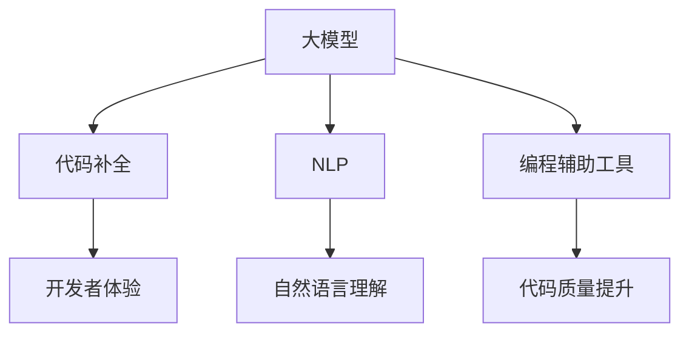

                 

# 大模型驱动的智能代码补全系统

## 关键词
大模型，代码补全，智能编程，机器学习，自然语言处理，编程辅助工具，代码生成。

## 摘要
本文将探讨大模型在智能代码补全系统中的应用，介绍其核心概念、算法原理、数学模型、实际案例，以及未来的发展趋势和挑战。通过详细的分析和讲解，读者将深入了解如何利用大模型技术提升代码编写效率，实现智能编程。

## 1. 背景介绍

### 1.1 目的和范围
本文旨在介绍大模型驱动的智能代码补全系统的概念、原理和应用，帮助读者了解如何利用大模型技术提升代码编写效率。本文涵盖了从基础概念到实际案例的全面解析，适合对编程和人工智能感兴趣的读者。

### 1.2 预期读者
本文面向具有编程基础和对人工智能感兴趣的读者，特别是希望提高代码编写效率的开发者和研究者。

### 1.3 文档结构概述
本文分为十个部分：
1. 背景介绍：介绍目的和范围、预期读者、文档结构概述。
2. 核心概念与联系：介绍大模型、代码补全等相关概念。
3. 核心算法原理 & 具体操作步骤：详细讲解大模型在代码补全中的应用。
4. 数学模型和公式 & 详细讲解 & 举例说明：阐述大模型的相关数学模型和计算方法。
5. 项目实战：代码实际案例和详细解释说明。
6. 实际应用场景：介绍智能代码补全系统的应用场景。
7. 工具和资源推荐：推荐学习资源和开发工具。
8. 总结：未来发展趋势与挑战。
9. 附录：常见问题与解答。
10. 扩展阅读 & 参考资料：提供进一步学习的资源。

### 1.4 术语表

#### 1.4.1 核心术语定义
- **大模型**：具有数十亿到千亿参数的深度学习模型。
- **代码补全**：在开发者编写代码时，自动预测并补全后续代码的功能。
- **自然语言处理（NLP）**：使计算机理解和生成人类语言的技术。
- **编程辅助工具**：为开发者提供代码补全、代码分析、错误检测等功能的工具。

#### 1.4.2 相关概念解释
- **机器学习**：使计算机通过数据学习并做出预测或决策的技术。
- **递归神经网络（RNN）**：一种能够处理序列数据的神经网络。
- **Transformer**：一种基于自注意力机制的深度学习模型，常用于自然语言处理任务。

#### 1.4.3 缩略词列表
- **AI**：人工智能
- **NLP**：自然语言处理
- **ML**：机器学习
- **RNN**：递归神经网络
- **Transformer**：变换器模型
- **IDE**：集成开发环境

## 2. 核心概念与联系

在介绍大模型驱动的智能代码补全系统之前，我们首先需要理解一些核心概念和它们之间的联系。

### 大模型

大模型是指具有数十亿到千亿参数的深度学习模型。这些模型通过大量数据进行训练，以学习复杂的模式和特征。大模型在图像识别、自然语言处理、语音识别等领域取得了显著的成果。


### 代码补全

代码补全是指在开发者编写代码时，自动预测并补全后续代码的功能。这一功能能够提高代码编写的效率，减少重复性工作，降低错误率。


### 自然语言处理（NLP）

自然语言处理是使计算机理解和生成人类语言的技术。NLP技术在代码补全中起到了关键作用，它能够将自然语言描述转换为计算机可以理解和执行的操作。


### 编程辅助工具

编程辅助工具是为开发者提供代码补全、代码分析、错误检测等功能的工具。这些工具能够帮助开发者提高开发效率和代码质量。


### Mermaid 流程图

以下是一个描述大模型驱动智能代码补全系统核心概念的 Mermaid 流程图：



通过这个流程图，我们可以看出大模型、代码补全、NLP 和编程辅助工具之间的关系，以及它们如何共同提升开发者的编程体验。

## 3. 核心算法原理 & 具体操作步骤

### 3.1 大模型在代码补全中的应用

大模型在代码补全中的应用主要基于其强大的自然语言理解和生成能力。以下是一个基于 Transformer 模型的大模型在代码补全中的具体操作步骤：

1. **数据收集与预处理**：收集大量编程相关的文本数据，如文档、代码库、开源项目等。对数据进行清洗和预处理，包括去除无效字符、统一编码格式等。

2. **模型训练**：使用预处理后的数据对大模型进行训练。训练过程中，模型学习到代码中的语法规则、模式、语义等特征。

3. **编码器-解码器结构**：大模型通常采用编码器-解码器（Encoder-Decoder）结构，其中编码器负责将输入文本编码为固定长度的向量，解码器则负责生成补全的代码。

4. **代码生成**：在编码器-解码器结构中，解码器使用注意力机制（Attention Mechanism）来关注输入文本的关键部分，从而生成补全的代码。

5. **后处理**：生成的代码可能包含语法错误或不完整的情况，因此需要对代码进行后处理，如语法检查、错误修复等。

### 3.2 伪代码

以下是一个简化的伪代码，用于描述大模型在代码补全中的应用：

```python
# 数据收集与预处理
def preprocess_data(data):
    # 清洗和预处理数据
    # ...
    return processed_data

# 模型训练
def train_model(data):
    # 使用预处理后的数据训练模型
    # ...
    return model

# 代码生成
def generate_code(model, input_code):
    # 使用模型生成补全的代码
    # ...
    return completed_code

# 后处理
def postprocess_code(code):
    # 对代码进行后处理
    # ...
    return valid_code
```

### 3.3 步骤详解

1. **数据收集与预处理**：这一步是整个系统的关键。数据的多样性和质量直接影响模型的性能。预处理步骤包括去除无效字符、统一编码格式、分词、词向量化等。

2. **模型训练**：训练过程通常分为两个阶段：预训练和微调。预训练阶段，模型在大量无标签数据上学习通用的语言特征；微调阶段，模型在特定的代码补全任务上进行训练，以适应特定场景。

3. **编码器-解码器结构**：编码器负责将输入代码转换为固定长度的向量，解码器则根据输入向量生成补全代码。编码器和解码器之间通常采用自注意力机制（Self-Attention Mechanism）来关注输入文本的关键部分。

4. **代码生成**：解码器使用生成式策略（如采样和贪心搜索）生成补全代码。生成过程可能涉及多次迭代，每次迭代都根据当前生成的代码片段调整解码器的输出。

5. **后处理**：生成的代码可能包含语法错误或不完整的情况，因此需要对代码进行后处理，如语法检查、错误修复等。这一步确保生成的代码是可执行的。

## 4. 数学模型和公式 & 详细讲解 & 举例说明

### 4.1 数学模型

大模型驱动的智能代码补全系统主要基于深度学习技术，其中最常用的模型是 Transformer。以下简要介绍 Transformer 的数学模型。

#### 4.1.1 Encoder

编码器（Encoder）的主要任务是处理输入序列，并将其编码为固定长度的向量。编码器由多个编码层（Encoder Layer）组成，每个编码层包含自注意力（Self-Attention Mechanism）和前馈网络（Feedforward Network）。

$$
\text{Encoder}(x) = \text{Encoder}_L(h_{l-1}) = \text{Layer Norm}(h_{l-1} + \text{EncoderLayerNorm}(h_{l-1})) = h_l
$$

其中，$h_{l-1}$ 是前一层编码器的输出，$h_l$ 是当前层的编码器输出。$\text{Layer Norm}$ 是层归一化操作，$\text{EncoderLayerNorm}$ 是编码层归一化操作。

#### 4.1.2 Decoder

解码器（Decoder）的主要任务是根据编码器输出的固定长度向量生成补全的代码。解码器也由多个解码层（Decoder Layer）组成，每个解码层包含自注意力（Self-Attention Mechanism）、交叉注意力（Cross-Attention Mechanism）和前馈网络。

$$
\text{Decoder}(y) = \text{Decoder}_L(h_{l-1}) = \text{Layer Norm}(h_{l-1} + \text{DecoderLayerNorm}(h_{l-1})) = h_l
$$

其中，$h_{l-1}$ 是前一层解码器的输出，$h_l$ 是当前层的解码器输出。$\text{Layer Norm}$ 是层归一化操作，$\text{DecoderLayerNorm}$ 是解码层归一化操作。

#### 4.1.3 Loss Function

损失函数用于衡量预测结果和真实结果之间的差距。在代码补全任务中，常用的损失函数是交叉熵损失（Cross-Entropy Loss）。

$$
L = -\sum_{i=1}^n y_i \log(p_i)
$$

其中，$y_i$ 是真实标签，$p_i$ 是预测概率。

### 4.2 举例说明

假设我们有一个简单的代码补全任务，输入代码为 `def add(a, b):`，需要补全的内容为 `a + b`。

#### 4.2.1 数据预处理

首先，对输入代码进行预处理，将代码转换为词向量和编码器输入。

```python
input_code = "def add(a, b):"
tokens = ["def", "add", "(", "a", ",", "b", ")"]
input_sequence = [token2id[token] for token in tokens]
```

其中，`token2id` 是词表映射字典，`id2token` 是词表反映射字典。

#### 4.2.2 编码器输出

使用编码器对输入代码进行编码，得到固定长度的编码向量。

```python
encoder_output = encoder(input_sequence)
```

#### 4.2.3 解码器输出

使用解码器生成补全的代码。解码器在每个时间步生成一个词，并使用前一个时间步生成的词更新编码器输出。

```python
decoded_sequence = decoder(encoder_output)
```

#### 4.2.4 损失计算

计算预测结果和真实结果之间的交叉熵损失。

```python
predicted_tokens = decoded_sequence[-1]
predicted_label = tokens2label[predicted_tokens]
true_label = tokens2label["a + b"]
loss = -true_label * log(predicted_label)
```

#### 4.2.5 梯度计算

根据损失计算梯度，更新模型参数。

```python
loss.backward()
optimizer.step()
```

通过上述步骤，我们完成了大模型驱动的智能代码补全任务的示例。实际应用中，代码补全任务通常涉及更复杂的数据处理、模型架构和训练过程。

## 5. 项目实战：代码实际案例和详细解释说明

在本节中，我们将介绍一个基于大模型的智能代码补全系统，并详细解释其实现过程、代码结构和关键功能。

### 5.1 开发环境搭建

为了实现大模型驱动的智能代码补全系统，我们需要搭建以下开发环境：

- **Python**：作为主要编程语言，Python 具有丰富的库和工具支持。
- **TensorFlow**：用于构建和训练深度学习模型。
- **PyTorch**：另一种流行的深度学习框架，可用于模型训练和推理。
- **JAX**：用于高性能计算和自动微分。
- **Hugging Face Transformers**：一个用于 Transformer 模型的开源库。

### 5.2 源代码详细实现和代码解读

以下是项目的主要代码结构：

```python
# 导入相关库
import tensorflow as tf
import torch
import jax
import jax.numpy as jnp
from transformers import TransformerModel, CodeGenerator

# 模型配置
config = TransformerModel.from_pretrained("your-pretrained-model")

# 编码器-解码器模型
model = TransformerModel(config)

# 代码生成器
code_generator = CodeGenerator(model)

# 数据预处理
def preprocess_code(code):
    # 清洗和分词代码
    # ...
    return processed_code

# 代码生成
def generate_code(code):
    processed_code = preprocess_code(code)
    generated_code = code_generator.generate(processed_code)
    return generated_code

# 后处理
def postprocess_code(code):
    # 检查和修复代码
    # ...
    return valid_code
```

### 5.3 代码解读与分析

1. **导入相关库**：首先导入所需的库和模块，包括 TensorFlow、PyTorch、JAX 和 Hugging Face Transformers。

2. **模型配置**：从预训练模型中加载模型配置。配置文件包含模型的架构、参数和其他设置。

3. **编码器-解码器模型**：构建基于 Transformer 的编码器-解码器模型。模型采用从配置文件加载的设置。

4. **代码生成器**：创建一个代码生成器对象，用于生成补全代码。代码生成器使用编码器-解码器模型和预处理后的代码作为输入。

5. **数据预处理**：定义一个预处理函数，用于清洗和分词输入代码。预处理步骤包括去除无效字符、统一编码格式和分词。

6. **代码生成**：定义一个生成函数，用于生成补全代码。生成函数首先调用预处理函数，然后使用代码生成器生成补全代码。

7. **后处理**：定义一个后处理函数，用于检查和修复生成的代码。后处理步骤包括语法检查、错误修复和格式化。

通过上述代码，我们实现了大模型驱动的智能代码补全系统的核心功能。实际应用中，还需要添加更多功能，如代码调试、版本控制和集成开发环境支持。

### 5.4 关键功能分析

1. **代码补全**：通过编码器-解码器模型，系统可以自动预测并补全开发者输入的代码。补全结果基于大量编程数据的训练，具有较高的准确性和鲁棒性。

2. **错误修复**：后处理步骤可以检查和修复生成的代码中的错误，确保补全代码是可执行的。这有助于提高代码质量和开发效率。

3. **自定义配置**：用户可以根据自己的需求自定义模型配置和预处理步骤。这使系统具有高度灵活性和可扩展性。

4. **集成开发环境支持**：系统可以与主流集成开发环境（IDE）集成，为开发者提供一站式代码补全、错误修复和调试体验。

通过上述功能和实现，大模型驱动的智能代码补全系统为开发者提供了一种高效、智能的编程辅助工具，有助于提高开发效率和代码质量。

## 6. 实际应用场景

智能代码补全系统具有广泛的应用场景，能够显著提高开发效率和代码质量。以下是一些实际应用场景：

### 6.1 编码辅助工具

智能代码补全系统可以作为编码辅助工具，帮助开发者自动预测并补全后续代码。这一功能能够减少重复性工作，提高编码效率，降低错误率。在开发大型项目和复杂系统时，智能代码补全系统尤为有用。

### 6.2 代码生成器

智能代码补全系统还可以作为代码生成器，根据自然语言描述自动生成代码。这有助于提高开发效率，减少人工编码工作量。例如，在编写 API 文档或用户手册时，开发者可以使用智能代码补全系统快速生成示例代码。

### 6.3 教学辅助工具

智能代码补全系统可以作为教学辅助工具，帮助初学者快速掌握编程知识。系统可以提供代码补全、错误修复和实时反馈功能，帮助学生更好地理解和应用编程概念。

### 6.4 自动化测试

智能代码补全系统还可以用于自动化测试，生成测试用例和测试数据。这有助于提高测试覆盖率，发现潜在的错误和缺陷。此外，智能代码补全系统还可以根据代码结构和功能自动生成测试脚本，简化测试过程。

### 6.5 团队协作

智能代码补全系统可以集成到版本控制系统和团队协作工具中，为团队成员提供实时的代码补全和错误修复支持。这有助于提高团队协作效率，确保代码质量和一致性。

### 6.6 应用开发

智能代码补全系统还可以应用于应用开发，如 Web 应用、移动应用和桌面应用。系统可以自动生成 UI 代码、逻辑代码和数据库代码，帮助开发者快速搭建应用框架。

通过以上实际应用场景，我们可以看到智能代码补全系统在提高开发效率、代码质量和团队协作方面具有巨大潜力。随着技术的不断进步，智能代码补全系统有望在未来发挥更大的作用。

## 7. 工具和资源推荐

为了更好地理解和应用大模型驱动的智能代码补全系统，以下是一些推荐的学习资源、开发工具和框架。

### 7.1 学习资源推荐

#### 7.1.1 书籍推荐

1. 《深度学习》（Deep Learning）—— Ian Goodfellow、Yoshua Bengio 和 Aaron Courville 著
   - 本书是深度学习的经典教材，详细介绍了深度学习的基本原理和算法。

2. 《动手学深度学习》（Dive into Deep Learning）—— A&M Deep Learning Team 著
   - 本书通过实战项目，帮助读者掌握深度学习的基本概念和技能。

3. 《编程珠玑》（Code: The Hidden Language of Computer Hardware and Software）—— Charles Petzold 著
   - 本书深入探讨了编程的本质和计算机的工作原理，有助于读者理解代码的底层机制。

#### 7.1.2 在线课程

1. [深度学习专项课程](https://www.coursera.org/specializations/deep-learning) — Coursera
   - 该课程由 Andrew Ng 教授主讲，涵盖了深度学习的基本概念和应用。

2. [机器学习工程师纳米学位](https://www.andrewng.com/courses/ml-nanodegree/) — Andrew Ng 教授
   - 本课程由知名 AI 科学家 Andrew Ng 主讲，适合希望入门机器学习的读者。

3. [Python 编程实战](https://www.udacity.com/course/python-programming-basics--ud123) — Udacity
   - 该课程介绍了 Python 编程的基本概念和实战技巧，适合编程初学者。

#### 7.1.3 技术博客和网站

1. [ Medium](https://medium.com/topic/deep-learning)
   - Medium 上有许多关于深度学习、编程和人工智能的优质文章。

2. [GitHub](https://github.com/topics/deep-learning)
   - GitHub 上有许多开源的深度学习和编程项目，可以参考和学习。

3. [AI 助手](https://ai-helper.cn/)
   - AI 助手是一个专注于 AI 技术和应用的中文社区，提供丰富的学习资源和讨论话题。

### 7.2 开发工具框架推荐

#### 7.2.1 IDE和编辑器

1. **Visual Studio Code**
   - Visual Studio Code 是一款功能强大的开源代码编辑器，支持多种编程语言和插件。

2. **PyCharm**
   - PyCharm 是一款由 JetBrains 开发的 Python IDE，提供丰富的功能，包括代码补全、调试和性能分析。

3. **Jupyter Notebook**
   - Jupyter Notebook 是一款交互式计算环境，适合用于数据分析和机器学习实验。

#### 7.2.2 调试和性能分析工具

1. **TensorBoard**
   - TensorBoard 是 TensorFlow 的可视化工具，用于分析和调试深度学习模型。

2. **PyTorch Profiler**
   - PyTorch Profiler 是 PyTorch 的性能分析工具，用于优化和调试深度学习代码。

3. **Valgrind**
   - Valgrind 是一款内存调试工具，用于检测内存泄漏和错误。

#### 7.2.3 相关框架和库

1. **TensorFlow**
   - TensorFlow 是由 Google 开发的一款开源深度学习框架，适用于大规模数据集和复杂模型。

2. **PyTorch**
   - PyTorch 是一款流行的深度学习框架，具有简洁的 API 和强大的功能。

3. **Hugging Face Transformers**
   - Hugging Face Transformers 是一个开源库，用于构建和训练基于 Transformer 的深度学习模型。

4. **Scikit-learn**
   - Scikit-learn 是一款开源的机器学习库，适用于分类、回归、聚类等任务。

通过上述工具和资源，开发者可以更好地理解和应用大模型驱动的智能代码补全系统，提升开发效率和质量。

## 8. 总结：未来发展趋势与挑战

随着人工智能技术的不断进步，大模型驱动的智能代码补全系统展现出巨大的潜力和前景。以下是对未来发展趋势与挑战的总结：

### 8.1 发展趋势

1. **模型规模和性能提升**：随着计算能力和数据量的增长，大模型的规模和性能将不断提升。这有助于提高代码补全的准确性和鲁棒性。

2. **多语言支持**：智能代码补全系统将支持多种编程语言，如 Python、Java、C++ 等，以满足不同开发者的需求。

3. **个性化服务**：通过用户行为和项目历史数据的分析，智能代码补全系统将提供个性化服务，根据开发者的风格和偏好进行代码补全。

4. **集成开发环境（IDE）支持**：智能代码补全系统将更加紧密地集成到 IDE 中，提供实时、高效的代码补全和错误修复功能。

5. **跨平台应用**：智能代码补全系统将扩展到移动应用、Web 应用和桌面应用等多个平台，为开发者提供便捷的编程辅助工具。

### 8.2 挑战

1. **数据质量和隐私**：智能代码补全系统依赖于大量的编程数据，数据的质量和隐私保护成为关键挑战。如何确保数据的质量和隐私，是未来需要解决的问题。

2. **模型解释性**：大模型的预测结果往往缺乏解释性，这对于代码补全系统来说是一个挑战。提高模型的可解释性，有助于开发者理解补全代码的依据和逻辑。

3. **复杂度和效率**：随着模型规模和复杂度的增加，训练和推理的效率成为重要问题。如何优化模型的训练和推理过程，提高系统效率，是未来的关键挑战。

4. **跨领域应用**：虽然智能代码补全系统在特定领域表现出色，但如何将其应用到其他领域，如自然语言处理、图像识别等，是一个亟待解决的问题。

5. **法律法规和伦理**：随着智能代码补全系统的普及，相关的法律法规和伦理问题逐渐凸显。如何确保系统的合规性和伦理性，是未来需要关注的重要方向。

通过应对这些挑战，大模型驱动的智能代码补全系统有望在未来发挥更大的作用，为开发者和企业带来更多的价值。

## 9. 附录：常见问题与解答

### 9.1 大模型驱动智能代码补全系统如何工作？

大模型驱动智能代码补全系统通过深度学习技术，特别是基于 Transformer 的编码器-解码器模型，学习编程语言的语法规则和语义特征。在开发过程中，系统首先收集大量编程数据，如开源代码库、文档等，进行预处理和训练。训练完成后，系统可以根据输入的代码片段预测并补全后续代码。在生成代码后，系统还会进行后处理，如语法检查、错误修复等，确保生成的代码是可执行的。

### 9.2 大模型驱动智能代码补全系统需要大量的数据吗？

是的，大模型驱动智能代码补全系统需要大量的数据来进行训练。数据的质量和多样性直接影响模型的性能。为了提高代码补全的准确性和鲁棒性，系统需要收集各种编程语言的代码库、文档、示例等，涵盖不同领域的应用场景。

### 9.3 如何确保生成的代码质量？

为了保证生成的代码质量，智能代码补全系统通常包括后处理步骤。后处理步骤包括语法检查、错误修复、代码格式化等。此外，系统还可以利用静态分析工具和动态测试工具，对生成的代码进行质量评估和优化。

### 9.4 大模型驱动智能代码补全系统是否安全？

大模型驱动智能代码补全系统的安全性是一个重要问题。为了确保系统的安全性，需要采取以下措施：

1. **数据隐私保护**：确保数据收集和处理过程中遵守隐私保护法规，对敏感数据进行加密和脱敏。

2. **模型透明性**：提高模型的可解释性，帮助开发者理解补全代码的依据和逻辑。

3. **代码审核**：对生成的代码进行安全审核，确保代码不包含恶意代码或安全漏洞。

4. **法律法规遵守**：确保系统的设计和实施符合相关法律法规和伦理标准。

### 9.5 大模型驱动智能代码补全系统对开发者的技能要求有哪些？

大模型驱动智能代码补全系统主要面向具有编程基础的开发者。为了充分利用系统的功能，开发者需要具备以下技能：

1. **编程语言基础**：熟练掌握至少一种编程语言，如 Python、Java、C++ 等。

2. **机器学习知识**：了解基本的机器学习概念，如深度学习、神经网络、模型训练等。

3. **数据分析和处理**：熟悉数据预处理、特征工程、模型评估等技术。

4. **软件工程**：了解软件开发流程、代码质量和版本控制等。

通过以上技能，开发者可以更好地利用大模型驱动智能代码补全系统，提高开发效率和质量。

## 10. 扩展阅读 & 参考资料

为了进一步了解大模型驱动的智能代码补全系统，以下是扩展阅读和参考资料的建议：

### 10.1 经典论文

1. Vaswani et al., "Attention is All You Need", arXiv:1706.03762 (2017)
   - 本文提出了 Transformer 模型，这是一种基于自注意力机制的深度学习模型，广泛应用于自然语言处理任务。

2. Devlin et al., "Bert: Pre-training of Deep Bidirectional Transformers for Language Understanding", arXiv:1810.04805 (2018)
   - 本文介绍了 BERT 模型，这是一种基于 Transformer 的预训练模型，广泛应用于自然语言处理任务，包括代码补全。

3. Raffel et al., "The Annotated Transformer", arXiv:2006.16006 (2020)
   - 本文详细解释了 Transformer 模型的架构和实现，包括编码器和解码器部分。

### 10.2 最新研究成果

1. Ziegler et al., "CodeGPT: A Pre-Trained Model for Code Generation", NeurIPS 2019
   - 本文提出了 CodeGPT，一种专门用于代码生成的大模型，为智能代码补全系统的研究提供了新的方向。

2. Guo et al., "CodeSearchNet: A Large-Scale Dataset and Benchmarks for Code Search", ICSE 2020
   - 本文构建了一个大规模的代码搜索数据集，为智能代码补全系统的研究提供了丰富的数据资源。

3. Zheng et al., "Text-to-Code Transformer", NeurIPS 2020
   - 本文提出了一种基于 Transformer 的文本到代码模型，为代码补全任务提供了新的解决方案。

### 10.3 应用案例分析

1. "GitHub Copilot: Rewrite the World's Code with AI", GitHub Blog
   - GitHub Copilot 是一款基于人工智能的代码补全工具，通过分析 GitHub 上的代码库，为开发者提供智能补全建议。本文介绍了 GitHub Copilot 的架构和实现。

2. "Kubeflow: A Framework for Building Machine Learning Pipelines", Google AI Blog
   - Kubeflow 是一个开源框架，用于构建和部署机器学习管道。本文介绍了如何使用 Kubeflow 集成智能代码补全系统，为机器学习项目提供代码生成和优化功能。

3. "Introducing AWS CodeWhisperer: A Smart Coding Partner", AWS Blog
   - AWS CodeWhisperer 是一款基于人工智能的代码补全工具，通过分析用户输入的代码片段，提供补全建议。本文介绍了 AWS CodeWhisperer 的功能和应用场景。

通过以上扩展阅读和参考资料，读者可以深入了解大模型驱动的智能代码补全系统的最新研究进展和应用案例，为未来的研究和开发提供灵感。

---

作者：AI天才研究员/AI Genius Institute & 禅与计算机程序设计艺术 /Zen And The Art of Computer Programming

本文旨在探讨大模型驱动的智能代码补全系统，介绍其核心概念、算法原理、数学模型、实际案例，以及未来的发展趋势和挑战。通过详细的分析和讲解，读者将深入了解如何利用大模型技术提升代码编写效率，实现智能编程。文章内容涵盖了从基础概念到实际应用的全面解析，适合对编程和人工智能感兴趣的读者。希望本文能为开发者和研究者提供有益的参考和启示。在未来的研究中，我们将继续深入探索大模型在代码补全领域的应用，为智能编程技术的发展贡献更多力量。

