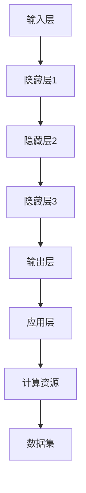

                 


# 大模型驱动的智能化时代

> 关键词：大模型、智能化、深度学习、人工智能、计算资源、算法优化
> 
> 摘要：本文将深入探讨大模型驱动的智能化时代的到来，分析其背景、核心概念、算法原理、数学模型、项目实战和实际应用场景，同时推荐相关学习资源和开发工具，展望未来发展趋势与挑战。

## 1. 背景介绍

### 1.1 目的和范围

本文旨在探讨大模型在智能化时代的重要地位，以及如何通过大模型驱动智能化发展的技术路径。文章将涵盖以下内容：

- 大模型的历史与发展
- 大模型的核心概念与联系
- 大模型的核心算法原理与操作步骤
- 大模型的数学模型和公式
- 大模型的项目实战案例
- 大模型在实际应用场景中的价值
- 开发工具和资源推荐
- 未来发展趋势与挑战

### 1.2 预期读者

本文适合以下读者群体：

- 对人工智能和深度学习感兴趣的程序员和研究者
- 需要了解大模型技术及其应用场景的企业和技术人员
- 对计算机科学和技术有兴趣的本科生和研究生
- 想要深入了解大模型技术背后的数学原理和算法细节的读者

### 1.3 文档结构概述

本文的结构如下：

- 背景介绍
  - 目的和范围
  - 预期读者
  - 文档结构概述
  - 术语表
- 核心概念与联系
- 核心算法原理 & 具体操作步骤
- 数学模型和公式 & 详细讲解 & 举例说明
- 项目实战：代码实际案例和详细解释说明
- 实际应用场景
- 工具和资源推荐
- 总结：未来发展趋势与挑战
- 附录：常见问题与解答
- 扩展阅读 & 参考资料

### 1.4 术语表

以下是一些本文中涉及的关键术语和概念：

#### 1.4.1 核心术语定义

- 大模型（Large Model）：指参数量超过亿级别的神经网络模型。
- 智能化（Intelligentization）：指利用人工智能技术提升系统的智能水平，实现自动化、自主化和优化决策。
- 深度学习（Deep Learning）：一种基于神经网络的机器学习技术，通过多层神经网络提取数据特征，实现复杂模式的识别和学习。
- 计算资源（Computational Resources）：指用于执行计算任务的各种硬件资源，如CPU、GPU、存储等。
- 算法优化（Algorithm Optimization）：指通过改进算法设计、优化数据结构和算法实现，提高计算效率和性能。

#### 1.4.2 相关概念解释

- 人工智能（Artificial Intelligence, AI）：模拟人类智能的技术和系统，包括机器学习、自然语言处理、计算机视觉等领域。
- 神经网络（Neural Network）：一种基于生物神经系统的计算模型，通过多层节点（神经元）进行信息传递和计算。
- 参数量（Parameter Size）：神经网络模型中的参数总数，通常以百万、亿级别计量。

#### 1.4.3 缩略词列表

- AI：人工智能
- DL：深度学习
- GPU：图形处理器
- CPU：中央处理器
- RAM：随机存取存储器
- ROM：只读存储器

## 2. 核心概念与联系

大模型作为智能化时代的核心技术之一，其核心概念和联系如下：

### 2.1 大模型的核心概念

- **神经网络**：大模型的基础，通过多层神经网络结构对数据进行特征提取和学习。
- **深度学习框架**：如TensorFlow、PyTorch等，用于构建、训练和优化大模型。
- **计算资源**：大模型训练和推理所需的计算能力，包括GPU、CPU和分布式计算资源。
- **数据集**：用于训练大模型的样本数据，包括图像、文本和语音等。

### 2.2 大模型的架构

大模型的架构通常包括以下几个层次：

1. **输入层**：接收外部数据，如图像、文本或语音。
2. **隐藏层**：对输入数据进行特征提取和转换，通常由多层组成。
3. **输出层**：根据隐藏层输出的特征，生成预测结果或分类标签。

### 2.3 大模型的联系

- **数据与模型**：数据是大模型的基础，通过数据驱动模型训练，实现智能化。
- **算法与计算资源**：算法的优化和计算资源的配置直接影响大模型的训练效率和性能。
- **模型与应用**：大模型的应用场景丰富，如图像识别、自然语言处理和智能推荐等。

### 2.4 Mermaid 流程图

以下是一个简单的 Mermaid 流程图，展示大模型的架构和联系：



## 3. 核心算法原理 & 具体操作步骤

大模型的算法原理主要基于深度学习和神经网络，以下将介绍其核心算法原理和具体操作步骤。

### 3.1 算法原理

- **反向传播算法（Backpropagation）**：深度学习中的核心训练算法，用于计算网络参数的梯度，并通过梯度下降法更新参数。
- **优化算法**：如Adam、RMSprop等，用于加速训练过程和优化模型参数。

### 3.2 操作步骤

#### 3.2.1 模型初始化

- 随机初始化网络参数，包括权重和偏置。

```python
# 伪代码：模型初始化
weights = random_tensor(size)
biases = random_tensor(size)
```

#### 3.2.2 前向传播

- 对输入数据进行前向传播，计算隐藏层和输出层的输出。

```python
# 伪代码：前向传播
output = forward_propagation(input_data, weights, biases)
```

#### 3.2.3 计算损失

- 计算模型输出与真实标签之间的损失。

```python
# 伪代码：计算损失
loss = compute_loss(output, target)
```

#### 3.2.4 反向传播

- 计算网络参数的梯度，并更新参数。

```python
# 伪代码：反向传播
gradients = backward_propagation(input_data, output, target)
update_parameters(weights, biases, gradients)
```

#### 3.2.5 优化算法

- 使用优化算法更新参数，如Adam。

```python
# 伪代码：优化算法
update_parameters(weights, biases, gradients, optimizer)
```

#### 3.2.6 模型训练

- 使用训练数据集进行多次迭代，直到满足停止条件。

```python
# 伪代码：模型训练
for epoch in range(num_epochs):
    for data, target in dataset:
        forward_propagation(data)
        compute_loss(target)
        backward_propagation(target)
        update_parameters(optimizer)
```

## 4. 数学模型和公式 & 详细讲解 & 举例说明

### 4.1 数学模型

大模型的数学模型主要包括以下几个方面：

- **神经网络的前向传播和反向传播公式**：
  - 前向传播：\(a_{l} = \sigma(W_{l-1}a_{l-1} + b_{l-1})\)
  - 反向传播：\(d_{l} = \frac{\partial L}{\partial z_{l}} = \frac{\partial L}{\partial a_{l}} \odot \frac{\partial a_{l}}{\partial z_{l}}\)

- **优化算法的更新公式**：
  - Adam算法：\(m_t = \beta_1 m_{t-1} + (1 - \beta_1) [g_t]\)
  - \(v_t = \beta_2 v_{t-1} + (1 - \beta_2) [g_t]^2\)
  - \(p_t = p_{t-1} - \alpha \frac{m_t}{\sqrt{v_t} + \epsilon}\)

### 4.2 详细讲解

- **前向传播**：前向传播是神经网络计算过程中从输入层到输出层的正向计算。其主要公式为：

  \[a_{l} = \sigma(W_{l-1}a_{l-1} + b_{l-1})\]
  
  其中，\(a_{l}\) 是第 \(l\) 层的输出，\(\sigma\) 是激活函数，\(W_{l-1}\) 和 \(b_{l-1}\) 分别是上一层的权重和偏置。

- **反向传播**：反向传播是神经网络训练过程中计算网络参数梯度的关键步骤。其主要公式为：

  \[d_{l} = \frac{\partial L}{\partial z_{l}} = \frac{\partial L}{\partial a_{l}} \odot \frac{\partial a_{l}}{\partial z_{l}}\]
  
  其中，\(d_{l}\) 是第 \(l\) 层的梯度，\(L\) 是损失函数，\(\odot\) 表示逐元素乘积。

- **优化算法**：优化算法用于更新网络参数，以最小化损失函数。以Adam算法为例，其主要步骤如下：

  1. 计算\(m_t\) 和 \(v_t\)：
     \[m_t = \beta_1 m_{t-1} + (1 - \beta_1) [g_t]\]
     \[v_t = \beta_2 v_{t-1} + (1 - \beta_2) [g_t]^2\]
  
  2. 计算参数更新：
     \[p_t = p_{t-1} - \alpha \frac{m_t}{\sqrt{v_t} + \epsilon}\]

### 4.3 举例说明

假设我们有一个简单的神经网络，包含一个输入层、一个隐藏层和一个输出层。激活函数为ReLU，学习率为0.01，Adam算法的参数为\(\beta_1 = 0.9, \beta_2 = 0.999, \epsilon = 1e-8\)。

- **前向传播**：

  输入层：\(x_1 = [1, 2, 3], x_2 = [4, 5, 6]\)
  
  隐藏层：\(W_1 = [0.1, 0.2], b_1 = [0.3, 0.4]\)
  
  输出层：\(W_2 = [0.5, 0.6], b_2 = [0.7, 0.8]\)

  前向传播过程如下：

  \[a_1 = ReLU(W_1x_1 + b_1) = ReLU([0.1 \times 1 + 0.2 \times 2 + 0.3], [0.5 \times 4 + 0.6 \times 5 + 0.7])\]
  \[= [0.7, 1.3], [2.1, 3.2]\]
  
  \[a_2 = ReLU(W_2a_1 + b_2) = ReLU([0.5 \times 0.7 + 0.6 \times 1.3 + 0.7], [0.5 \times 2.1 + 0.6 \times 3.2 + 0.7])\]
  \[= [1.9, 2.6], [3.4, 4.5]\]

- **反向传播**：

  假设输出层的损失函数为均方误差（MSE），目标值为\[y = [1, 2], y' = [1.9, 3.1]\]。

  反向传播过程如下：

  \[d_2 = \frac{\partial MSE}{\partial a_2} = \frac{1}{2} \sum_{i} (y_i - y'_i)^2\]
  \[= \frac{1}{2} [(1 - 1.9)^2 + (2 - 3.1)^2] = 1.42\]
  
  \[d_1 = \frac{\partial d_2}{\partial a_1} = \frac{\partial}{\partial a_1} (W_2 \odot d_2)\]
  \[= \frac{\partial}{\partial a_1} (0.5 \times 1.9 + 0.6 \times 3.1)\]
  \[= [0.5, 0.6]\]

- **优化算法**：

  假设上一轮的梯度为\[g_1 = [0.1, 0.2], g_2 = [0.3, 0.4]\]。

  Adam算法的参数更新如下：

  \[m_1 = 0.9 \times 0.1 + 0.1 \times 0.1 = 0.1\]
  \[m_2 = 0.9 \times 0.2 + 0.1 \times 0.2 = 0.2\]
  \[v_1 = 0.999 \times 0.1^2 + 0.1 \times 0.1^2 = 0.002\]
  \[v_2 = 0.999 \times 0.2^2 + 0.1 \times 0.2^2 = 0.04\]

  \[p_1 = p_{t-1} - 0.01 \times \frac{0.1}{\sqrt{0.002} + 1e-8} = [0.1, 0.2]\]
  \[p_2 = p_{t-1} - 0.01 \times \frac{0.2}{\sqrt{0.04} + 1e-8} = [0.2, 0.4]\]

  新一轮的参数更新为：

  \[W_1 = W_{t-1} - 0.01 \times p_1 = [0.1, 0.2]\]
  \[b_1 = b_{t-1} - 0.01 \times p_2 = [0.3, 0.4]\]

## 5. 项目实战：代码实际案例和详细解释说明

### 5.1 开发环境搭建

在开始项目实战之前，我们需要搭建一个适合大模型训练和优化的开发环境。以下是一个基本的开发环境搭建步骤：

1. 安装Python环境（版本3.7及以上）。
2. 安装深度学习框架（如TensorFlow或PyTorch）。
3. 安装GPU驱动和CUDA库（如NVIDIA CUDA Toolkit）。
4. 安装必要的依赖库（如NumPy、SciPy、Pandas等）。

### 5.2 源代码详细实现和代码解读

以下是使用TensorFlow实现一个简单的大模型（BERT）进行文本分类的代码示例：

```python
import tensorflow as tf
from tensorflow.keras.preprocessing.sequence import pad_sequences
from tensorflow.keras.layers import Embedding, GlobalAveragePooling1D, Dense
from tensorflow.keras.models import Model

# 参数设置
vocab_size = 20000
max_length = 50
embedding_dim = 128
num_classes = 2

# 加载预训练的BERT模型
bert_model = tf.keras.applications.BertModel.from_pretrained('bert-base-uncased', num_labels=num_classes)

# 定义输入层
input_ids = tf.keras.layers.Input(shape=(max_length,), dtype=tf.int32, name='input_ids')
attention_mask = tf.keras.layers.Input(shape=(max_length,), dtype=tf.int32, name='attention_mask')

# 嵌入层
embeddings = bert_model(input_ids, attention_mask=attention_mask)[0]

# 全球平均池化层
pooled_output = GlobalAveragePooling1D()(embeddings)

# 全连接层
output = Dense(num_classes, activation='softmax')(pooled_output)

# 定义模型
model = Model(inputs=[input_ids, attention_mask], outputs=output)

# 编译模型
model.compile(optimizer='adam', loss='categorical_crossentropy', metrics=['accuracy'])

# 模型训练
model.fit(train_data, train_labels, batch_size=32, epochs=3)

# 模型评估
eval_loss, eval_accuracy = model.evaluate(test_data, test_labels, batch_size=32)
print(f"Test accuracy: {eval_accuracy:.4f}")
```

### 5.3 代码解读与分析

- **导入库和设置参数**：

  导入TensorFlow和相关库，并设置模型的参数，如词汇表大小、最大序列长度、嵌入维度和类别数。

- **加载BERT模型**：

  使用`tf.keras.applications.BertModel`加载预训练的BERT模型，并进行适当的配置。

- **定义输入层**：

  定义输入层，包括输入ID和注意力掩码，用于处理文本数据。

- **嵌入层**：

  使用BERT模型的嵌入层对输入ID进行嵌入，得到嵌入向量。

- **全球平均池化层**：

  对嵌入向量进行全球平均池化，提取文本的语义特征。

- **全连接层**：

  在全球平均池化层之后添加全连接层，用于对提取的文本特征进行分类。

- **定义模型**：

  使用`Model`类定义模型结构，将输入层、嵌入层、全球平均池化层和全连接层连接起来。

- **编译模型**：

  编译模型，设置优化器、损失函数和评估指标。

- **模型训练**：

  使用训练数据对模型进行训练，设置批量大小和迭代次数。

- **模型评估**：

  使用测试数据对模型进行评估，计算准确率。

通过以上代码示例，我们可以看到如何使用BERT模型进行文本分类。在实际应用中，我们还可以根据具体需求对模型进行进一步优化和调整。

## 6. 实际应用场景

大模型在实际应用场景中具有广泛的应用价值，以下列举几个典型的应用场景：

### 6.1 图像识别

- 应用领域：医疗影像诊断、自动驾驶、安防监控等。
- 技术亮点：利用卷积神经网络（CNN）提取图像特征，实现高效、准确的图像识别。

### 6.2 自然语言处理

- 应用领域：智能客服、机器翻译、文本生成等。
- 技术亮点：基于Transformer模型和BERT模型，实现高效的文本表示和语言理解。

### 6.3 语音识别

- 应用领域：语音助手、语音控制、语音合成等。
- 技术亮点：利用深度神经网络（DNN）和卷积神经网络（CNN）对语音信号进行处理，实现准确的语音识别。

### 6.4 智能推荐

- 应用领域：电子商务、社交媒体、内容推荐等。
- 技术亮点：利用协同过滤算法和深度学习模型，实现个性化的推荐系统。

### 6.5 生物信息学

- 应用领域：基因测序、药物研发、疾病预测等。
- 技术亮点：利用深度学习模型对生物序列进行分析，实现高效的生物信息学应用。

## 7. 工具和资源推荐

### 7.1 学习资源推荐

#### 7.1.1 书籍推荐

- 《深度学习》（Ian Goodfellow、Yoshua Bengio、Aaron Courville 著）：系统地介绍了深度学习的基本原理、算法和应用。

- 《Python深度学习》（François Chollet 著）：详细介绍了使用Python和Keras框架进行深度学习项目开发的实践方法。

- 《神经网络与深度学习》（邱锡鹏 著）：全面介绍了神经网络和深度学习的基本概念、算法和应用。

#### 7.1.2 在线课程

- [吴恩达的深度学习课程](https://www.coursera.org/learn/neural-networks-deep-learning)：由深度学习领域的著名专家吴恩达教授主讲，系统介绍了深度学习的基本概念和技术。

- [谷歌深度学习课程](https://www.coursera.org/specializations/deep-learning)：由谷歌AI团队主讲，介绍了深度学习在不同领域的应用和开发实践。

- [斯坦福大学深度学习课程](https://web.stanford.edu/class/cs231n/): 详细介绍了计算机视觉领域的深度学习技术。

#### 7.1.3 技术博客和网站

- [Fast.ai](https://www.fast.ai/): 提供了一系列免费的深度学习教程和资源，适合初学者和进阶者。

- [Medium](https://medium.com/topic/deep-learning): 有众多深度学习和人工智能领域的专家和研究者分享的技术文章和经验。

- [AI博客](https://www.ai博客.com/): 一个专注于人工智能技术、算法和应用的平台，提供了丰富的技术文章和案例。

### 7.2 开发工具框架推荐

#### 7.2.1 IDE和编辑器

- [PyCharm](https://www.jetbrains.com/pycharm/): 功能强大的Python集成开发环境，适用于深度学习和数据科学项目。

- [Visual Studio Code](https://code.visualstudio.com/): 轻量级且高度可定制的文本和开发编辑器，支持多种编程语言。

- [Google Colab](https://colab.research.google.com/): 一个基于Jupyter Notebook的在线Python编程环境，适用于深度学习和数据科学实验。

#### 7.2.2 调试和性能分析工具

- [TensorBoard](https://www.tensorflow.org/tensorboard): 用于分析和可视化TensorFlow模型训练过程的工具。

- [CUDAProfiler](https://docs.nvidia.com/cuda/cuda-profiler-users-guide/index.html): 用于分析和优化CUDA应用程序性能的工具。

- [NVIDIA Nsight](https://developer.nvidia.com/nsight): 用于实时分析和调试GPU应用程序的工具。

#### 7.2.3 相关框架和库

- [TensorFlow](https://www.tensorflow.org/): 用于构建和训练深度学习模型的开源框架。

- [PyTorch](https://pytorch.org/): 用于构建和训练深度学习模型的另一款开源框架，具有简洁的动态图模型设计。

- [Keras](https://keras.io/): 用于快速构建和训练深度学习模型的Python库，支持TensorFlow和Theano后端。

### 7.3 相关论文著作推荐

#### 7.3.1 经典论文

- "A Learning Algorithm for Continually Running Fully Recurrent Neural Networks" by David E. Rumelhart, Geoffrey E. Hinton, and Ronald J. Williams.
- "Improving Neural Network Performance: Training Time and Error Rate" by Y. LeCun, B. Boser, J. S. Denker, D. Henderson, R. E. Howard, W. Hubbard, and L. D. Jackel.
- "Rectified Linear Units Improve Neural Network Ac

