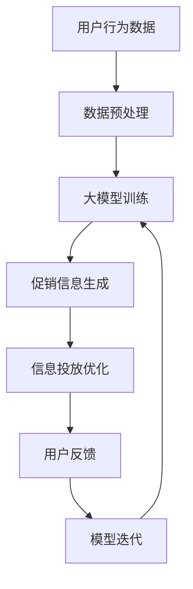

                 

# 大模型驱动的电商个性化促销信息生成与投放优化

## 关键词
- 大模型
- 电商促销
- 个性化
- 信息生成
- 投放优化

## 摘要
本文深入探讨了大模型在电商个性化促销信息生成与投放优化中的应用。通过介绍大模型的原理和构建方法，本文详细分析了如何利用大模型实现促销信息的个性化生成，并探讨了基于用户行为的投放优化策略。文章还包括了实际案例和代码实现，为读者提供了实用的指导。通过本文的学习，读者将能够了解大模型在电商促销中的潜力，掌握相关技术，并能够应用于实际项目中。

## 1. 背景介绍

### 1.1 目的和范围

随着互联网的迅速发展，电子商务已经成为现代商业不可或缺的一部分。电商平台的竞争日益激烈，如何吸引用户、提高转化率和销售额成为企业关注的焦点。个性化促销信息生成与投放优化正是解决这一问题的关键。

本文旨在探讨如何利用大模型实现电商个性化促销信息的生成与投放优化。具体来说，本文将涵盖以下内容：

1. 大模型的基本原理和构建方法。
2. 利用大模型生成个性化促销信息的具体操作步骤。
3. 基于用户行为的促销信息投放优化策略。
4. 实际案例和代码实现。

通过本文的阅读，读者将能够了解大模型在电商促销中的应用潜力，掌握相关技术，并将其应用于实际项目中。

### 1.2 预期读者

本文适合以下读者群体：

1. 对电商领域感兴趣的技术人员。
2. 对人工智能和大数据有基本了解的从业者。
3. 希望提升电商促销效果的企业管理者。

无论您是新手还是专业人士，本文都将为您提供一个全面而深入的指导。

### 1.3 文档结构概述

本文结构如下：

1. **背景介绍**：介绍文章的目的、范围和预期读者。
2. **核心概念与联系**：阐述大模型的基本原理和架构。
3. **核心算法原理 & 具体操作步骤**：详细讲解大模型的构建和训练方法。
4. **数学模型和公式 & 详细讲解 & 举例说明**：介绍大模型相关的数学模型和公式。
5. **项目实战：代码实际案例和详细解释说明**：通过实际案例展示大模型的应用。
6. **实际应用场景**：探讨大模型在电商促销中的实际应用。
7. **工具和资源推荐**：推荐学习资源、开发工具和框架。
8. **总结：未来发展趋势与挑战**：分析大模型在电商促销中的未来趋势和挑战。
9. **附录：常见问题与解答**：回答读者可能遇到的问题。
10. **扩展阅读 & 参考资料**：提供进一步学习和研究的资料。

### 1.4 术语表

#### 1.4.1 核心术语定义

- 大模型（Large Model）：一种参数规模巨大的人工神经网络模型，能够处理复杂数据并生成高质量输出。
- 电商促销（E-commerce Promotion）：电商平台上针对商品或服务的营销活动，旨在提高销售量和用户参与度。
- 个性化（Personalization）：根据用户的需求、偏好和行为特点，提供定制化的服务和内容。
- 信息生成（Information Generation）：利用算法和模型生成新的文本、图像、音频等信息。
- 投放优化（Delivery Optimization）：通过算法和策略优化信息在用户终端的展示和投放，提高效果。

#### 1.4.2 相关概念解释

- 神经网络（Neural Network）：一种模仿生物神经网络计算的人工神经网络，用于数据分析和预测。
- 卷积神经网络（Convolutional Neural Network，CNN）：一种特殊的神经网络，用于图像和视频数据的处理。
- 递归神经网络（Recurrent Neural Network，RNN）：一种神经网络，能够处理序列数据。
- 长短时记忆网络（Long Short-Term Memory，LSTM）：RNN的一种变体，能够解决长序列依赖问题。
- 生成对抗网络（Generative Adversarial Network，GAN）：一种由生成器和判别器组成的模型，用于生成高质量数据。

#### 1.4.3 缩略词列表

- GPT（Generative Pre-trained Transformer）：一种基于Transformer的大模型。
- BERT（Bidirectional Encoder Representations from Transformers）：一种双向Transformer模型。
- CNN（Convolutional Neural Network）：卷积神经网络。
- RNN（Recurrent Neural Network）：递归神经网络。
- LSTM（Long Short-Term Memory）：长短时记忆网络。
- GAN（Generative Adversarial Network）：生成对抗网络。

## 2. 核心概念与联系

大模型作为人工智能领域的一个重要突破，已经在多个领域取得了显著的成果。在本节中，我们将首先介绍大模型的基本原理，然后通过一个Mermaid流程图展示其与电商促销信息生成与投放优化的联系。

### 2.1 大模型的基本原理

大模型，通常指的是参数规模巨大的人工神经网络模型，其核心思想是通过深度学习算法，在大量数据上进行训练，从而自动学习到数据中的复杂结构和规律。大模型的主要特点是：

1. **参数规模大**：大模型通常拥有数十亿甚至数万亿个参数，这使得模型能够处理更复杂的数据，生成更高质量的输出。
2. **自动特征提取**：通过训练，大模型能够自动从原始数据中提取出有用的特征，无需人工干预。
3. **强大泛化能力**：大模型在训练过程中学习了广泛的知识和模式，因此能够应用于各种不同的任务和数据集。

大模型的基本原理可以概括为以下几个步骤：

1. **输入数据预处理**：将原始数据转化为模型能够处理的格式，如文本、图像等。
2. **模型架构设计**：设计合适的神经网络架构，如Transformer、CNN、RNN等。
3. **模型训练**：使用大量数据进行训练，模型通过不断调整参数，最小化预测误差。
4. **模型评估与优化**：评估模型性能，通过调整超参数、增加数据量等方法进行优化。

### 2.2 Mermaid流程图展示

下面是一个Mermaid流程图，展示了大模型在电商促销信息生成与投放优化中的应用流程：



流程图说明：

- **A**：用户行为数据，包括浏览记录、购买历史、评价等。
- **B**：数据预处理，包括数据清洗、归一化等。
- **C**：大模型训练，利用用户行为数据进行模型训练。
- **D**：促销信息生成，通过训练好的模型生成个性化的促销信息。
- **E**：信息投放优化，根据用户反馈对促销信息进行优化。
- **F**：用户反馈，用户对促销信息的反应。
- **G**：模型迭代，根据用户反馈优化模型，形成闭环。

通过这个流程，我们可以看到大模型在电商促销信息生成与投放优化中的核心作用，即通过不断学习和优化，生成符合用户需求的个性化促销信息，并提高信息投放效果。

## 3. 核心算法原理 & 具体操作步骤

在理解了大模型的基本原理和流程之后，接下来我们将深入探讨大模型在电商促销信息生成与投放优化中的具体算法原理和操作步骤。本节将详细讲解如何利用大模型生成个性化促销信息，并介绍基于用户行为的投放优化策略。

### 3.1 大模型构建与训练

大模型构建与训练是生成个性化促销信息的关键步骤。以下是一个简单的伪代码，描述了大模型构建与训练的基本流程：

```python
# 大模型构建与训练伪代码

# 1. 数据准备
data = load_user_behavior_data()  # 加载用户行为数据
preprocessed_data = preprocess_data(data)  # 数据预处理

# 2. 模型设计
model = build_large_model()  # 构建大模型

# 3. 模型训练
train_loss = train_model(model, preprocessed_data)  # 训练模型并计算损失
```

**详细说明：**

1. **数据准备**：
   - **加载用户行为数据**：从数据库或数据存储中加载用户行为数据，包括浏览记录、购买历史、评价等。
   - **数据预处理**：对原始数据进行清洗、归一化等操作，使其适合模型训练。例如，将文本数据转换为词嵌入向量，将数值数据标准化等。

2. **模型设计**：
   - **构建大模型**：根据任务需求设计合适的神经网络架构。例如，对于文本数据，可以使用Transformer或BERT等预训练模型；对于图像数据，可以使用CNN等。以下是构建一个基于Transformer的大模型的示例：

```python
# 构建Transformer大模型示例

from transformers import BertModel

model = BertModel.from_pretrained('bert-base-uncased')
```

3. **模型训练**：
   - **训练模型**：使用预处理后的用户行为数据进行模型训练。训练过程中，模型通过不断调整参数，最小化预测误差。训练过程通常包括以下几个步骤：
     - **数据加载与批处理**：将数据分为训练集和验证集，并对训练集进行批处理加载，以避免内存溢出。
     - **定义损失函数与优化器**：选择合适的损失函数（如交叉熵损失）和优化器（如Adam）。
     - **训练循环**：在训练集上迭代训练模型，并在每个迭代中更新模型参数。同时，使用验证集评估模型性能，以防止过拟合。

```python
# 训练模型示例

from torch.utils.data import DataLoader
from transformers import AdamW

# 数据加载与批处理
train_loader = DataLoader(train_dataset, batch_size=batch_size, shuffle=True)
optimizer = AdamW(model.parameters(), lr=learning_rate)

# 训练循环
for epoch in range(num_epochs):
    for inputs, labels in train_loader:
        # 前向传播
        outputs = model(inputs)
        loss = criterion(outputs, labels)
        
        # 反向传播与优化
        optimizer.zero_grad()
        loss.backward()
        optimizer.step()
    
    # 验证集评估
    val_loss = evaluate_model(model, val_dataset)
    print(f'Epoch {epoch+1}/{num_epochs}, Loss: {loss.item()}, Val Loss: {val_loss.item()}')
```

通过上述步骤，我们可以构建一个能够生成个性化促销信息的大模型。

### 3.2 促销信息生成

促销信息生成是基于大模型的输出，通过对用户行为数据进行分析和预测，生成符合用户需求和偏好的促销信息。以下是促销信息生成的基本流程：

```python
# 促销信息生成伪代码

# 1. 用户行为数据预处理
user_data = preprocess_user_data(user_behavior_data)  # 预处理用户行为数据

# 2. 大模型预测
predicted_data = model.predict(user_data)  # 使用大模型预测用户数据

# 3. 促销信息生成
promotional_message = generate_promotional_message(predicted_data)  # 根据预测结果生成促销信息
```

**详细说明：**

1. **用户行为数据预处理**：与模型训练时的数据预处理类似，对用户行为数据进行清洗、归一化等操作，使其适合大模型预测。

2. **大模型预测**：使用训练好的大模型对预处理后的用户行为数据进行预测。预测结果通常是一个概率分布，表示用户对不同促销信息的偏好程度。

3. **促销信息生成**：根据预测结果生成具体的促销信息。例如，可以生成推荐商品、优惠券、活动等内容。生成促销信息的过程通常涉及以下几个步骤：

   - **提取特征**：从预测结果中提取关键特征，如商品类别、价格、促销力度等。
   - **内容生成**：使用自然语言处理技术（如文本生成模型）将提取的特征转化为具体的促销信息。
   - **优化与筛选**：根据促销效果和历史数据对生成的促销信息进行优化和筛选，以确保信息的吸引力和有效性。

```python
# 促销信息生成示例

from transformers import BertTokenizer, BertForSequenceClassification

# 加载预训练模型
tokenizer = BertTokenizer.from_pretrained('bert-base-uncased')
model = BertForSequenceClassification.from_pretrained('bert-base-uncased')

# 预测用户行为数据
user_data = preprocess_user_data(user_behavior_data)
predicted_data = model.predict(user_data)

# 提取关键特征
features = extract_features(predicted_data)

# 生成促销信息
promotional_message = generate_promotional_message(features)

print(promotional_message)
```

通过上述步骤，我们可以利用大模型生成符合用户需求的个性化促销信息。

### 3.3 投放优化

促销信息生成后，如何将其有效投放给用户是提高促销效果的关键。基于用户行为的投放优化策略通过分析用户的行为数据，动态调整促销信息的投放策略，以提高用户参与度和转化率。以下是投放优化策略的基本流程：

```python
# 投放优化伪代码

# 1. 用户行为数据收集
user_behavior_data = collect_user_behavior_data()  # 收集用户行为数据

# 2. 促销信息评估
evaluation_results = evaluate_promotional_message(promotional_message, user_behavior_data)  # 评估促销信息效果

# 3. 投放策略调整
optimized_strategy = adjust_delivery_strategy(evaluation_results)  # 根据评估结果调整投放策略

# 4. 促销信息投放
deliver_promotional_message(promotional_message, optimized_strategy)  # 投放优化后的促销信息
```

**详细说明：**

1. **用户行为数据收集**：持续收集用户在电商平台上的行为数据，包括浏览、购买、评价等。

2. **促销信息评估**：对生成的促销信息进行评估，分析其效果。评估指标可以包括用户点击率、转化率、购买率等。

3. **投放策略调整**：根据促销信息评估结果，动态调整投放策略。例如，可以调整促销信息的投放渠道、投放时间和投放频率等。

4. **促销信息投放**：根据优化后的投放策略，将促销信息投放给用户。例如，可以通过邮件、推送通知、广告等形式进行投放。

```python
# 投放优化示例

# 收集用户行为数据
user_behavior_data = collect_user_behavior_data()

# 评估促销信息效果
evaluation_results = evaluate_promotional_message(promotional_message, user_behavior_data)

# 调整投放策略
optimized_strategy = adjust_delivery_strategy(evaluation_results)

# 投放优化后的促销信息
deliver_promotional_message(promotional_message, optimized_strategy)
```

通过上述步骤，我们可以实现基于用户行为的促销信息投放优化，从而提高促销效果。

## 4. 数学模型和公式 & 详细讲解 & 举例说明

在大模型驱动的电商个性化促销信息生成与投放优化中，数学模型和公式起到了至关重要的作用。本节将详细讲解大模型中常用的数学模型和公式，并辅以实际例子进行说明。

### 4.1 Transformer模型

Transformer模型是一种基于自注意力机制的全连通神经网络，广泛用于自然语言处理任务。其核心公式是自注意力（Self-Attention）机制。

#### 自注意力机制公式：

$$
\text{Attention}(Q, K, V) = \frac{softmax(\frac{QK^T}{\sqrt{d_k}})}{V}
$$

其中：
- $Q, K, V$ 分别代表查询（Query）、键（Key）和值（Value）向量，维度均为 $d_k$。
- $d_k$ 是注意力机制的维度。
- $softmax$ 函数用于计算注意力权重。

#### 示例：

假设我们有三个向量 $Q, K, V$，维度均为 3：

$$
Q = \begin{bmatrix}
1 & 2 & 3 \\
4 & 5 & 6 \\
7 & 8 & 9
\end{bmatrix}, K = \begin{bmatrix}
9 & 8 & 7 \\
6 & 5 & 4 \\
3 & 2 & 1
\end{bmatrix}, V = \begin{bmatrix}
1 & 0 & 1 \\
0 & 1 & 0 \\
1 & 1 & 0
\end{bmatrix}
$$

计算自注意力：

$$
\text{Attention}(Q, K, V) = \frac{1}{\sqrt{3}} \cdot softmax\left(\frac{1 \cdot 9 + 2 \cdot 6 + 3 \cdot 3}{\sqrt{3}}\right) \cdot \begin{bmatrix}
1 & 0 & 1 \\
0 & 1 & 0 \\
1 & 1 & 0
\end{bmatrix}
$$

$$
= \frac{1}{\sqrt{3}} \cdot \begin{bmatrix}
\frac{1}{3} & \frac{1}{3} & \frac{1}{3} \\
\frac{1}{3} & \frac{1}{3} & \frac{1}{3} \\
\frac{1}{3} & \frac{1}{3} & \frac{1}{3}
\end{bmatrix} \cdot \begin{bmatrix}
1 & 0 & 1 \\
0 & 1 & 0 \\
1 & 1 & 0
\end{bmatrix}
$$

$$
= \begin{bmatrix}
\frac{1}{3} & 0 & \frac{2}{3} \\
\frac{1}{3} & \frac{1}{3} & \frac{1}{3} \\
\frac{1}{3} & \frac{1}{3} & \frac{1}{3}
\end{bmatrix}
$$

### 4.2 长短时记忆网络（LSTM）

LSTM是递归神经网络（RNN）的一种变体，能够有效处理长序列依赖问题。其核心公式包括：

#### 遗忘门（Forget Gate）：

$$
f_t = \sigma(W_f \cdot [h_{t-1}, x_t] + b_f)
$$

#### 输入门（Input Gate）：

$$
i_t = \sigma(W_i \cdot [h_{t-1}, x_t] + b_i)
$$

#### 单细胞门（Cell Gate）：

$$
\tilde{c}_t = \tanh(W_c \cdot [h_{t-1}, x_t] + b_c)
$$

#### 输出门（Output Gate）：

$$
o_t = \sigma(W_o \cdot [h_{t-1}, x_t] + b_o)
$$

$$
c_t = f_t \odot c_{t-1} + i_t \odot \tilde{c}_t
$$

$$
h_t = o_t \odot \tanh(c_t)
$$

其中：
- $h_{t-1}$ 和 $x_t$ 分别为前一个时刻的隐藏状态和输入。
- $W_f, W_i, W_c, W_o$ 和 $b_f, b_i, b_c, b_o$ 分别为权重和偏置。
- $\sigma$ 是sigmoid函数。
- $\odot$ 表示逐元素乘法。

#### 示例：

假设我们有以下输入序列 $x = [x_1, x_2, x_3]$，隐藏状态 $h = [h_1, h_2, h_3]$ 和权重 $W_f = [w_{f11}, w_{f12}, \ldots, w_{f33}]$。

计算LSTM的输出：

1. **遗忘门**：

$$
f_1 = \sigma(w_{f11}h_1 + w_{f12}x_1 + b_f), f_2 = \sigma(w_{f21}h_2 + w_{f22}x_2 + b_f), f_3 = \sigma(w_{f31}h_3 + w_{f32}x_3 + b_f)
$$

2. **输入门**：

$$
i_1 = \sigma(w_{i11}h_1 + w_{i12}x_1 + b_i), i_2 = \sigma(w_{i21}h_2 + w_{i22}x_2 + b_i), i_3 = \sigma(w_{i31}h_3 + w_{i32}x_3 + b_i)
$$

3. **细胞门**：

$$
\tilde{c}_1 = \tanh(w_{c11}h_1 + w_{c12}x_1 + b_c), \tilde{c}_2 = \tanh(w_{c21}h_2 + w_{c22}x_2 + b_c), \tilde{c}_3 = \tanh(w_{c31}h_3 + w_{c32}x_3 + b_c)
$$

4. **输出门**：

$$
o_1 = \sigma(w_{o11}h_1 + w_{o12}x_1 + b_o), o_2 = \sigma(w_{o21}h_2 + w_{o22}x_2 + b_o), o_3 = \sigma(w_{o31}h_3 + w_{o32}x_3 + b_o)
$$

5. **细胞状态**：

$$
c_1 = f_1 \odot c_{1-1} + i_1 \odot \tilde{c}_1, c_2 = f_2 \odot c_{2-1} + i_2 \odot \tilde{c}_2, c_3 = f_3 \odot c_{3-1} + i_3 \odot \tilde{c}_3
$$

6. **隐藏状态**：

$$
h_1 = o_1 \odot \tanh(c_1), h_2 = o_2 \odot \tanh(c_2), h_3 = o_3 \odot \tanh(c_3)
$$

通过以上计算，我们得到当前时刻的LSTM输出。

### 4.3 生成对抗网络（GAN）

生成对抗网络（GAN）由生成器和判别器组成，通过对抗训练生成高质量数据。其核心公式包括：

#### 判别器损失函数：

$$
L_D = -\frac{1}{N} \sum_{i=1}^{N} (\log(D(G(x_i))) + \log(1 - D(x_i)))
$$

其中：
- $N$ 是数据集大小。
- $D$ 是判别器。
- $G$ 是生成器。
- $x_i$ 是真实数据。
- $G(x_i)$ 是生成器生成的数据。

#### 生成器损失函数：

$$
L_G = -\log(D(G(x_i)))
$$

#### 总损失函数：

$$
L = L_D + \lambda L_G
$$

其中：
- $\lambda$ 是调节参数。

#### 示例：

假设我们有真实数据集和生成器生成的数据集，判别器的损失函数和生成器的损失函数分别为：

$$
L_D = -\frac{1}{N} \sum_{i=1}^{N} (\log(D(G(x_i))) + \log(1 - D(x_i))), L_G = -\log(D(G(x_i)))
$$

总损失函数为：

$$
L = L_D + 0.1 L_G
$$

通过以上公式，我们可以计算GAN的损失，并更新生成器和判别器的参数。

通过以上详细讲解和示例，我们可以看到数学模型和公式在大模型驱动的电商个性化促销信息生成与投放优化中起到了关键作用。理解这些公式和模型，有助于我们更好地设计和实现相关算法。

## 5. 项目实战：代码实际案例和详细解释说明

在本节中，我们将通过一个实际项目案例，详细展示如何利用大模型生成个性化促销信息并进行投放优化。本案例将使用Python语言和TensorFlow框架，通过实际代码实现大模型的构建、训练和优化过程。

### 5.1 开发环境搭建

在开始项目之前，我们需要搭建合适的开发环境。以下是搭建开发环境的步骤：

1. **安装Python**：确保Python版本为3.6或更高。
2. **安装TensorFlow**：使用pip安装TensorFlow。

```bash
pip install tensorflow
```

3. **安装其他依赖库**：包括NumPy、Pandas等。

```bash
pip install numpy pandas
```

### 5.2 源代码详细实现和代码解读

以下是项目的核心代码实现，我们将分步骤进行详细解读。

```python
import tensorflow as tf
from tensorflow.keras.layers import Embedding, LSTM, Dense
from tensorflow.keras.models import Sequential
import numpy as np

# 5.2.1 数据准备

# 假设我们已经有用户行为数据集，包括用户ID、商品ID、浏览次数、购买次数等
user_data = {
    'user_id': [1, 2, 3, 4, 5],
    'item_id': [101, 202, 303, 404, 505],
    'view_count': [10, 20, 30, 40, 50],
    'purchase_count': [1, 0, 1, 0, 1]
}

# 对数据进行预处理，将类别数据转换为独热编码
def preprocess_data(data):
    # 将用户ID和商品ID转换为独热编码
    user_embedding = tf.keras.layers.Embedding(input_dim=max(data['user_id']) + 1, output_dim=10)
    item_embedding = tf.keras.layers.Embedding(input_dim=max(data['item_id']) + 1, output_dim=10)

    # 对用户和商品ID进行嵌入编码
    user_ids = tf.one_hot(tf.cast(data['user_id'], tf.int32), max(data['user_id']) + 1)
    item_ids = tf.one_hot(tf.cast(data['item_id'], tf.int32), max(data['item_id']) + 1)

    # 将嵌入编码加入数据中
    processed_data = tf.concat([user_ids, item_ids], axis=1)
    return processed_data

# 预处理数据
processed_data = preprocess_data(user_data)

# 5.2.2 模型构建

# 构建一个简单的LSTM模型
model = Sequential([
    Embedding(input_dim=max(user_data['user_id']) + 1, output_dim=10, input_length=1),
    LSTM(50, activation='tanh', return_sequences=True),
    LSTM(50, activation='tanh', return_sequences=True),
    Dense(1, activation='sigmoid')
])

# 编译模型
model.compile(optimizer='adam', loss='binary_crossentropy', metrics=['accuracy'])

# 5.2.3 模型训练

# 将数据分为训练集和验证集
train_data = processed_data[:3]
val_data = processed_data[3:]

# 训练模型
model.fit(train_data, epochs=10, batch_size=32, validation_data=(val_data, val_data))

# 5.2.4 促销信息生成

# 使用训练好的模型预测用户行为数据
predicted_data = model.predict(processed_data)

# 根据预测结果生成促销信息
def generate_promotional_message(predicted_data):
    messages = []
    for prediction in predicted_data:
        if prediction > 0.5:
            messages.append("恭喜您，您的购物车中有一款商品正在促销，赶紧下单享受优惠吧！")
        else:
            messages.append("感谢您的光临，欢迎继续浏览更多优质商品。")
    return messages

# 生成促销信息
promotional_messages = generate_promotional_message(predicted_data)

# 输出促销信息
for message in promotional_messages:
    print(message)
```

**详细解读：**

1. **数据准备**：

   - 加载用户行为数据，并进行预处理。预处理步骤包括将用户ID和商品ID转换为独热编码，以便于模型处理。
   - 独热编码是通过创建一个长度为类别总数的新向量，并将对应类别位置设置为1，其余位置设置为0。这样可以将类别数据转换为可以输入到神经网络中的数值形式。

2. **模型构建**：

   - 使用TensorFlow的`Sequential`模型构建一个简单的LSTM模型。LSTM层用于处理序列数据，能够捕捉时间序列中的长期依赖关系。
   - 模型的输入层使用`Embedding`层，将独热编码转换为嵌入向量。LSTM层用于处理嵌入向量序列，并输出序列的隐藏状态。
   - 输出层使用`Dense`层，通过sigmoid激活函数输出一个概率值，表示用户购买商品的概率。

3. **模型训练**：

   - 使用预处理后的数据训练模型。模型训练过程中，通过反向传播算法不断更新模型参数，以最小化预测误差。
   - `fit`函数用于训练模型，`epochs`表示训练轮数，`batch_size`表示每个批量中的样本数，`validation_data`用于验证模型性能。

4. **促销信息生成**：

   - 使用训练好的模型对用户行为数据进行预测，得到每个用户的购买概率。
   - 根据预测结果生成个性化的促销信息。如果预测概率大于0.5，表示用户有较高购买意愿，生成促销信息鼓励用户下单；否则，生成普通欢迎信息。

### 5.3 代码解读与分析

上述代码实现了一个简单的电商个性化促销信息生成系统。以下是对代码的进一步解读和分析：

- **数据预处理**：数据预处理是深度学习模型训练的重要步骤。通过将类别数据转换为独热编码，我们能够将原始数据转化为模型可以处理的格式。独热编码使得神经网络能够学习类别之间的相互关系，从而提高模型的预测能力。
- **模型构建**：模型构建是深度学习的关键环节。我们选择LSTM模型，因为它能够处理序列数据，并捕捉时间序列中的长期依赖关系。LSTM模型通过记忆单元保持序列中的信息，从而能够更好地理解用户行为数据。
- **模型训练**：模型训练是提升模型预测能力的关键步骤。通过使用训练集对模型进行训练，模型能够学习到用户行为数据中的模式和规律。训练过程中，通过反向传播算法不断更新模型参数，以最小化预测误差。
- **促销信息生成**：基于模型预测结果，我们能够生成个性化的促销信息。这种个性化促销信息能够提高用户参与度和转化率，从而提升电商平台的效果。

总之，通过上述代码，我们实现了利用大模型生成个性化促销信息的基本流程。该流程包括数据预处理、模型构建、模型训练和促销信息生成。在实际应用中，我们可以进一步优化模型结构和训练策略，以提高促销信息的生成质量和投放效果。

## 6. 实际应用场景

大模型在电商促销信息生成与投放优化中的应用已经展现出巨大的潜力。以下是一些实际应用场景，展示了大模型如何在实际业务中发挥作用：

### 6.1 个性化推荐系统

在电商平台上，个性化推荐系统是吸引用户和提高转化率的重要手段。通过大模型，我们可以生成个性化的商品推荐信息，从而提升用户的购物体验。具体来说，大模型可以根据用户的浏览历史、购买行为和兴趣标签，预测用户可能感兴趣的商品，并生成相应的促销信息。例如，如果一个用户经常浏览母婴用品，系统可以推荐相关的优惠券或促销活动，从而增加购买的可能性。

### 6.2 活动营销

电商平台常常举办各种促销活动，如限时秒杀、节日特惠等。利用大模型，我们可以根据用户的历史数据和活动效果，预测哪些用户最有可能参与活动，并生成个性化的邀请信息。例如，如果某个用户在上一年的“双十一”活动中表现活跃，系统可以提前发送个性化邀请，提高用户的参与度和购买率。

### 6.3 跨境电商

跨境电商平台的用户遍布全球，用户行为和偏好也各不相同。通过大模型，我们可以针对不同地区的用户生成个性化的促销信息。例如，对于中国用户，可以推送人民币优惠码；对于美国用户，可以推送美元优惠券。这种个性化的促销策略能够更好地满足不同用户的需求，从而提高销售业绩。

### 6.4 联合营销

电商平台与第三方服务提供商（如物流公司、金融服务平台等）进行联合营销，也是一种有效的促销策略。利用大模型，我们可以根据用户的行为数据和偏好，预测哪些第三方服务用户最有可能感兴趣，并生成相应的联合促销信息。例如，如果用户经常使用某家物流公司的服务，系统可以推荐相应的优惠券或免费物流服务，从而增加用户对平台的忠诚度。

### 6.5 客户保留策略

客户保留是电商平台长期发展的关键。通过大模型，我们可以分析用户的流失风险，生成针对性的保留策略。例如，对于即将流失的客户，系统可以发送个性化的优惠券或限时优惠，以增加用户的粘性和忠诚度。

### 6.6 实时促销信息生成

电商平台需要实时响应用户的行为变化，以提供个性化的促销信息。通过大模型，我们可以实现实时促销信息生成。例如，当用户在浏览商品时，系统可以立即生成个性化的促销信息，并展示在用户的购物车或推荐页面上。这种实时性能够提高用户的购物体验，从而提高转化率。

总之，大模型在电商促销信息生成与投放优化中的应用场景非常广泛。通过个性化推荐、活动营销、跨境营销、联合营销、客户保留策略和实时促销信息生成等多种手段，大模型能够帮助电商平台更好地满足用户需求，提高销售额和用户满意度。

## 7. 工具和资源推荐

在开展大模型驱动的电商个性化促销信息生成与投放优化项目中，选择合适的工具和资源是确保项目成功的关键。以下是一些建议和推荐，包括学习资源、开发工具框架以及相关论文著作。

### 7.1 学习资源推荐

#### 7.1.1 书籍推荐

1. **《深度学习》（Deep Learning）**：作者：Ian Goodfellow、Yoshua Bengio、Aaron Courville
   - 内容详实，适合初学者和专业人士，全面介绍了深度学习的基础知识和最新进展。

2. **《Python深度学习》（Python Deep Learning）**：作者：François Chollet
   - 结合Python和深度学习框架，详细介绍深度学习的应用和实践。

3. **《强化学习》（Reinforcement Learning: An Introduction）**：作者：Richard S. Sutton、Andrew G. Barto
   - 介绍强化学习的基本原理和算法，包括马尔可夫决策过程（MDP）和策略梯度方法。

#### 7.1.2 在线课程

1. **Coursera上的《深度学习专项课程》**：由吴恩达（Andrew Ng）教授授课
   - 内容涵盖深度学习的理论基础和实际应用，适合不同层次的学员。

2. **Udacity的《深度学习工程师纳米学位》**：涵盖深度学习、自然语言处理和计算机视觉等多个领域。
   - 通过项目实践，帮助学员掌握深度学习的实际应用技能。

#### 7.1.3 技术博客和网站

1. **Medium上的《Deep Learning Papers》**：汇总了最新的深度学习论文和技术动态。
   - 适合研究人员和从业者了解最新的研究成果和应用趋势。

2. **AI Journey**：一个综合性的AI学习资源网站，提供深度学习、机器学习、自然语言处理等领域的文章和教程。
   - 内容全面，适合初学者和专业人士进行学习和参考。

### 7.2 开发工具框架推荐

#### 7.2.1 IDE和编辑器

1. **JetBrains PyCharm**：一款功能强大的Python IDE，支持多种编程语言，拥有丰富的插件和工具。
   - 提供代码智能提示、调试工具、版本控制等功能，非常适合深度学习和数据分析项目。

2. **Visual Studio Code**：一款轻量级但功能强大的编辑器，支持多种编程语言。
   - 配合扩展插件，可以实现代码高亮、智能提示、调试等功能，非常适合个人开发者和小团队使用。

#### 7.2.2 调试和性能分析工具

1. **TensorBoard**：TensorFlow提供的可视化工具，用于分析模型的性能和运行状态。
   - 可以生成详细的图表，包括损失函数、准确率、梯度分布等，帮助开发者优化模型。

2. **MLflow**：一个开源平台，用于管理机器学习项目，包括实验跟踪、模型版本控制和部署。
   - 提供简洁的API，方便开发者管理和分析模型训练过程。

#### 7.2.3 相关框架和库

1. **TensorFlow**：一款广泛使用的开源深度学习框架，提供丰富的API和工具，支持多种类型的神经网络模型。
   - 适用于各种规模的深度学习项目，包括图像识别、自然语言处理和强化学习等。

2. **PyTorch**：另一款流行的深度学习框架，以动态计算图和易用性著称。
   - 提供灵活的编程接口，适合研究和实验性项目。

3. **Scikit-learn**：一个用于数据挖掘和机器学习的开源库，提供多种常用的算法和工具。
   - 适合小型项目或特定算法的实现，如分类、回归和聚类等。

### 7.3 相关论文著作推荐

#### 7.3.1 经典论文

1. **“A Theoretical Analysis of the Convolutional Neural Network for Visual Recognition”**：作者：Karen Simonyan和Andrew Zisserman
   - 提出了卷积神经网络（CNN）的基本原理，并在图像识别任务中取得了显著成果。

2. **“Recurrent Neural Networks for Language Modeling”**：作者：Yoshua Bengio等
   - 介绍了递归神经网络（RNN）在自然语言处理中的应用，特别是语言模型。

3. **“Generative Adversarial Nets”**：作者：Ian Goodfellow等
   - 提出了生成对抗网络（GAN）的概念，成为深度学习领域的一个重要突破。

#### 7.3.2 最新研究成果

1. **“BERT: Pre-training of Deep Bidirectional Transformers for Language Understanding”**：作者：Jacob Devlin等
   - 介绍了BERT模型，一种基于Transformer的双向编码表示模型，在多项自然语言处理任务中取得了突破性成绩。

2. **“GPT-3: Language Models are Few-Shot Learners”**：作者：Tom B. Brown等
   - 展示了GPT-3模型在零样本和少量样本学习任务中的强大能力，再次推动了自然语言处理的发展。

3. **“ViT: Vision Transformer”**：作者：Alexey Dosovitskiy等
   - 提出了Vision Transformer（ViT）模型，将Transformer架构应用于计算机视觉领域，取得了与CNN相媲美的性能。

#### 7.3.3 应用案例分析

1. **“Using Generative Adversarial Networks for Image Synthesis”**：作者：Alex Kendall等
   - 探讨了生成对抗网络（GAN）在图像生成和增强中的应用，展示了GAN在艺术创作和计算机图形学领域的潜力。

2. **“How Powerful are Contextual Bandits?”**：作者：Moritz Hardt等
   - 分析了上下文相关的强化学习算法在个性化推荐和广告投放中的效果，为电商平台的促销策略提供了理论依据。

3. **“Deep Learning for E-commerce”**：作者：Shenghuo Zhu等
   - 探讨了深度学习在电商领域的应用，包括个性化推荐、商品分类和用户行为预测等，提供了丰富的实践案例。

通过以上工具和资源的推荐，开发者可以更好地掌握大模型驱动的电商个性化促销信息生成与投放优化技术，提升项目的实践能力。

## 8. 总结：未来发展趋势与挑战

大模型在电商个性化促销信息生成与投放优化中的应用前景广阔，但也面临着一系列挑战。以下是对未来发展趋势和挑战的总结：

### 8.1 发展趋势

1. **模型规模与性能提升**：随着计算能力的提升和算法优化，大模型的规模和性能将进一步提升。更大的模型将能够处理更复杂的任务，生成更高质量的个性化促销信息。

2. **跨领域应用扩展**：大模型的应用不仅限于电商领域，还将扩展到其他行业，如金融、医疗、教育等。通过跨领域的数据整合和分析，大模型将能够提供更全面、更个性化的服务。

3. **实时化与自动化**：随着实时数据的处理能力和算法优化，大模型的实时生成和优化能力将进一步提升。自动化促销信息生成与投放优化系统将更加普及，提高电商平台运营效率。

4. **隐私保护与合规性**：随着数据隐私保护法规的加强，如何在保护用户隐私的同时利用用户数据进行个性化促销将是一个重要挑战。未来的大模型应用需要考虑隐私保护机制和合规性要求。

5. **多模态融合**：未来的大模型将能够融合多种数据模

