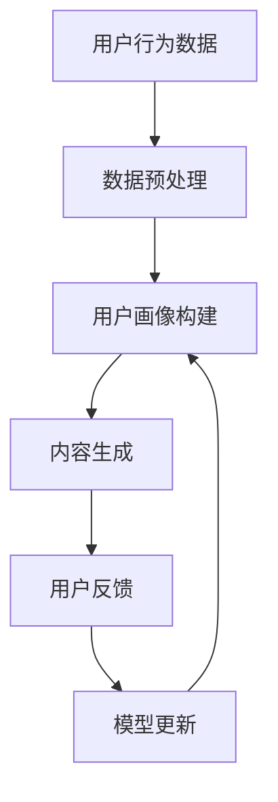

                 

# 大模型驱动的电商个性化内容营销

> **关键词**：大模型、电商、个性化内容、营销策略、用户行为分析、算法优化

> **摘要**：本文探讨了如何利用大模型技术实现电商个性化内容营销。通过深入分析大模型的应用场景、核心算法原理及其实际操作步骤，本文展示了如何通过大模型技术优化用户推荐、广告投放和内容定制，从而提升电商营销效果和用户体验。

## 1. 背景介绍

### 1.1 目的和范围

本文旨在探讨如何将大模型技术应用于电商个性化内容营销。我们将分析大模型在电商领域的应用场景，阐述其核心算法原理，并提供实际操作步骤，以帮助电商从业者提升营销效果和用户体验。

### 1.2 预期读者

本文面向电商领域从业者、人工智能和大数据研究人员，以及对此领域感兴趣的读者。读者需具备一定的编程基础和数学知识，以便更好地理解本文内容。

### 1.3 文档结构概述

本文结构如下：

1. 背景介绍：阐述本文目的、预期读者和文档结构。
2. 核心概念与联系：介绍大模型、电商个性化内容营销等核心概念，并使用 Mermaid 流程图展示相关架构。
3. 核心算法原理 & 具体操作步骤：详细讲解大模型算法原理和操作步骤。
4. 数学模型和公式 & 详细讲解 & 举例说明：介绍相关数学模型和公式，并举例说明。
5. 项目实战：提供代码实际案例和详细解释说明。
6. 实际应用场景：分析大模型在电商领域的实际应用场景。
7. 工具和资源推荐：推荐相关学习资源、开发工具框架和论文著作。
8. 总结：展望未来发展趋势与挑战。
9. 附录：常见问题与解答。
10. 扩展阅读 & 参考资料：提供进一步阅读资料。

### 1.4 术语表

#### 1.4.1 核心术语定义

- **大模型**：具有海量参数和强大计算能力的人工智能模型。
- **电商个性化内容营销**：基于用户行为数据和偏好分析，为用户提供定制化的商品推荐、广告投放和内容定制。
- **用户行为分析**：通过分析用户在电商平台上的浏览、购买等行为，挖掘用户兴趣和需求。
- **算法优化**：对模型进行调优，提高模型在特定任务上的性能。

#### 1.4.2 相关概念解释

- **深度学习**：一种基于人工神经网络的学习方法，通过多层神经元的堆叠，实现对复杂数据的建模和预测。
- **自然语言处理**：研究如何让计算机理解和处理自然语言的技术，包括文本分类、情感分析等。
- **机器学习**：一种基于数据的学习方法，通过从数据中学习规律和模式，实现自动预测和决策。

#### 1.4.3 缩略词列表

- **AI**：人工智能
- **NLP**：自然语言处理
- **ML**：机器学习
- **DL**：深度学习
- **BERT**：Bidirectional Encoder Representations from Transformers

## 2. 核心概念与联系

在电商个性化内容营销中，大模型的应用至关重要。下面我们将介绍大模型的基本概念、电商个性化内容营销的核心流程，以及相关架构。

### 2.1 大模型的基本概念

大模型是一种具有海量参数和强大计算能力的人工智能模型。大模型通常具有以下几个特点：

1. **海量参数**：大模型的参数规模通常达到数十亿甚至数百万亿级别，使其具有极强的表达能力和拟合能力。
2. **强大计算能力**：大模型通常需要高效的计算硬件和优化算法，以支持大规模参数的推理和训练。
3. **自适应能力**：大模型能够根据用户行为数据和偏好，动态调整推荐策略，实现个性化内容营销。

### 2.2 电商个性化内容营销的核心流程

电商个性化内容营销的核心流程包括以下几个环节：

1. **用户行为分析**：通过分析用户在电商平台上的浏览、购买等行为，挖掘用户兴趣和需求。
2. **用户画像构建**：基于用户行为数据，构建用户画像，包括用户年龄、性别、兴趣爱好、消费能力等。
3. **内容生成**：根据用户画像和商品信息，生成个性化的商品推荐、广告文案和内容页面。
4. **用户反馈**：收集用户对推荐内容的反馈，包括点击、购买、评价等，用于优化推荐策略。
5. **模型更新**：根据用户反馈，更新用户画像和推荐模型，实现持续优化。

### 2.3 相关架构

大模型驱动的电商个性化内容营销相关架构如图 1 所示。



图 1：大模型驱动的电商个性化内容营销架构

## 3. 核心算法原理 & 具体操作步骤

在电商个性化内容营销中，大模型的核心算法原理主要包括深度学习、自然语言处理和机器学习等技术。下面我们将详细讲解这些算法原理及其实际操作步骤。

### 3.1 深度学习算法原理

深度学习是一种基于人工神经网络的学习方法，通过多层神经元的堆叠，实现对复杂数据的建模和预测。深度学习算法原理主要包括以下几个方面：

1. **神经网络结构**：神经网络由输入层、隐藏层和输出层组成，每个层包含多个神经元。神经元之间的连接称为边，边上的权重表示连接的强度。
2. **前向传播与反向传播**：前向传播是指将输入数据通过神经网络层，逐层计算出输出结果。反向传播是指根据输出结果与真实值的误差，反向调整网络权重，以优化模型性能。
3. **激活函数**：激活函数用于引入非线性变换，使神经网络具有更强的拟合能力。常见的激活函数包括 sigmoid、ReLU 和 tanh 等。

具体操作步骤如下：

1. **数据准备**：收集并预处理用户行为数据，包括商品信息、用户浏览记录、购买记录等。
2. **构建神经网络模型**：设计神经网络结构，包括输入层、隐藏层和输出层，以及相应的激活函数。
3. **训练模型**：使用训练数据，通过前向传播和反向传播算法，训练神经网络模型，优化模型权重。
4. **评估模型**：使用测试数据评估模型性能，包括准确率、召回率等指标。
5. **模型应用**：将训练好的模型应用于实际业务场景，如商品推荐、广告投放等。

### 3.2 自然语言处理算法原理

自然语言处理（NLP）是一种研究如何让计算机理解和处理自然语言的技术。NLP 算法原理主要包括以下几个方面：

1. **词向量表示**：将自然语言文本转换为数值向量表示，如 Word2Vec、GloVe 等。词向量表示可以捕获词与词之间的语义关系。
2. **序列建模**：使用神经网络模型对自然语言文本序列进行建模，如循环神经网络（RNN）、长短时记忆网络（LSTM）、门控循环单元（GRU）等。
3. **文本分类与情感分析**：基于词向量表示和序列建模，实现文本分类和情感分析任务，如情感极性判断、主题分类等。

具体操作步骤如下：

1. **数据准备**：收集并预处理自然语言文本数据，包括商品描述、用户评价、广告文案等。
2. **词向量表示**：使用 Word2Vec、GloVe 等算法，将自然语言文本转换为词向量表示。
3. **构建序列建模模型**：设计神经网络结构，包括输入层、隐藏层和输出层，以及相应的激活函数。
4. **训练模型**：使用训练数据，通过前向传播和反向传播算法，训练神经网络模型，优化模型权重。
5. **评估模型**：使用测试数据评估模型性能，包括准确率、召回率等指标。
6. **模型应用**：将训练好的模型应用于实际业务场景，如商品描述生成、广告文案优化等。

### 3.3 机器学习算法原理

机器学习（ML）是一种基于数据的学习方法，通过从数据中学习规律和模式，实现自动预测和决策。机器学习算法原理主要包括以下几个方面：

1. **特征工程**：从原始数据中提取有意义的特征，用于训练机器学习模型。特征工程包括特征选择、特征转换、特征组合等。
2. **模型选择与训练**：选择合适的机器学习模型，如线性回归、逻辑回归、决策树、支持向量机等，使用训练数据训练模型。
3. **模型评估与优化**：使用测试数据评估模型性能，包括准确率、召回率、F1 分数等指标，并根据评估结果对模型进行调整和优化。

具体操作步骤如下：

1. **数据准备**：收集并预处理用户行为数据、商品信息等。
2. **特征工程**：从原始数据中提取有意义的特征，包括用户特征、商品特征、行为特征等。
3. **模型选择与训练**：选择合适的机器学习模型，如逻辑回归、决策树、随机森林等，使用训练数据训练模型。
4. **模型评估与优化**：使用测试数据评估模型性能，根据评估结果对模型进行调整和优化。
5. **模型应用**：将训练好的模型应用于实际业务场景，如用户推荐、广告投放等。

## 4. 数学模型和公式 & 详细讲解 & 举例说明

在电商个性化内容营销中，数学模型和公式起着关键作用。下面我们将介绍相关数学模型和公式，并举例说明。

### 4.1 深度学习中的数学模型

深度学习中的数学模型主要包括以下几个方面：

1. **前向传播公式**：前向传播过程中，神经网络的输出可以通过以下公式计算：

   $$ 
   z^{[l]} = \sum_{i} w^{[l]}_i \cdot a^{[l-1]}_i + b^{[l]} 
   $$
   
   其中，$z^{[l]}$ 表示第$l$层的输出，$w^{[l]}_i$ 和 $b^{[l]}$ 分别表示第$l$层的权重和偏置。

2. **反向传播公式**：反向传播过程中，权重的更新可以通过以下公式计算：

   $$ 
   \Delta w^{[l]}_i = \alpha \cdot \frac{\partial J}{\partial w^{[l]}_i} 
   $$

   $$ 
   \Delta b^{[l]} = \alpha \cdot \frac{\partial J}{\partial b^{[l]}}
   $$

   其中，$\Delta w^{[l]}_i$ 和 $\Delta b^{[l]}$ 分别表示权重和偏置的更新，$\alpha$ 表示学习率，$J$ 表示损失函数。

3. **损失函数**：深度学习中的损失函数用于衡量模型预测值与真实值之间的误差。常见的损失函数包括均方误差（MSE）、交叉熵（Cross-Entropy）等。

   $$ 
   J = \frac{1}{m} \sum_{i=1}^m (y_i - \hat{y}_i)^2 
   $$

   $$ 
   J = -\frac{1}{m} \sum_{i=1}^m y_i \log(\hat{y}_i) 
   $$

### 4.2 自然语言处理中的数学模型

自然语言处理中的数学模型主要包括以下几个方面：

1. **词向量表示**：词向量表示可以通过以下公式计算：

   $$ 
   \vec{v}_w = \sum_{j=1}^V c_{wj} \vec{e}_j 
   $$

   其中，$\vec{v}_w$ 表示词向量，$c_{wj}$ 表示词$w$在词汇表中的索引，$\vec{e}_j$ 表示基向量。

2. **序列建模**：序列建模可以通过以下公式计算：

   $$ 
   \hat{y}_t = \sigma(W \vec{h}_{t-1} + b) 
   $$

   其中，$\hat{y}_t$ 表示预测值，$\vec{h}_{t-1}$ 表示上一时刻的隐藏状态，$W$ 和 $b$ 分别表示权重和偏置。

3. **文本分类与情感分析**：文本分类与情感分析可以通过以下公式计算：

   $$ 
   P(y=c_k|x;\theta) = \frac{1}{Z} \exp(\theta^T \vec{v}_x) 
   $$

   其中，$P(y=c_k|x;\theta)$ 表示在给定文本$x$和参数$\theta$的情况下，类别$c_k$的概率，$Z$ 是归一化常数。

### 4.3 机器学习中的数学模型

机器学习中的数学模型主要包括以下几个方面：

1. **线性回归**：线性回归的预测公式为：

   $$ 
   \hat{y} = \beta_0 + \beta_1 x 
   $$

   其中，$\hat{y}$ 表示预测值，$x$ 表示输入特征，$\beta_0$ 和 $\beta_1$ 分别表示模型参数。

2. **逻辑回归**：逻辑回归的预测公式为：

   $$ 
   \hat{y} = \frac{1}{1 + \exp(-\beta_0 - \beta_1 x)} 
   $$

   其中，$\hat{y}$ 表示预测概率，$x$ 表示输入特征，$\beta_0$ 和 $\beta_1$ 分别表示模型参数。

3. **决策树**：决策树的预测公式为：

   $$ 
   \hat{y} = \arg\max_{c_k} P(y=c_k | x; \theta) 
   $$

   其中，$\hat{y}$ 表示预测类别，$P(y=c_k | x; \theta)$ 表示在给定特征$x$和模型参数$\theta$的情况下，类别$c_k$的概率。

### 4.4 举例说明

假设我们有一个简单的线性回归模型，用于预测电商用户购买商品的金额。输入特征为用户年龄和消费水平，模型参数为 $\beta_0$ 和 $\beta_1$。使用训练数据训练模型后，我们得到以下预测公式：

$$ 
\hat{y} = 5 + 0.5x 
$$

其中，$x$ 表示用户年龄和消费水平的组合。

假设我们有一个用户，年龄为 25 岁，消费水平为 3000 元。代入预测公式，我们可以得到该用户购买商品的预测金额：

$$ 
\hat{y} = 5 + 0.5 \times 3000 = 5150 
$$

因此，我们预测该用户购买商品的金额为 5150 元。

## 5. 项目实战：代码实际案例和详细解释说明

为了更好地展示如何利用大模型技术实现电商个性化内容营销，我们将在本节提供一个实际项目案例，并详细解释代码实现和关键步骤。

### 5.1 开发环境搭建

在开始项目实战之前，我们需要搭建合适的开发环境。以下是搭建开发环境所需的工具和库：

1. **编程语言**：Python
2. **深度学习框架**：TensorFlow 或 PyTorch
3. **数据处理库**：NumPy、Pandas、Scikit-learn
4. **自然语言处理库**：NLTK、spaCy
5. **可视化库**：Matplotlib、Seaborn

安装以上库和框架后，我们即可开始项目实战。

### 5.2 源代码详细实现和代码解读

下面是我们提供的电商个性化内容营销项目代码，并对其进行详细解读。

```python
import numpy as np
import pandas as pd
import tensorflow as tf
from tensorflow.keras.models import Sequential
from tensorflow.keras.layers import Dense, Embedding, LSTM
from tensorflow.keras.optimizers import Adam

# 数据预处理
def preprocess_data(data):
    # 数据清洗和填充
    data['age'] = data['age'].fillna(data['age'].mean())
    data['consumption_level'] = data['consumption_level'].fillna(data['consumption_level'].mean())

    # 特征工程
    data['age_square'] = data['age'] ** 2
    data['age_consumption'] = data['age'] * data['consumption_level']

    # 划分训练集和测试集
    train_data, test_data = train_test_split(data, test_size=0.2, random_state=42)
    return train_data, test_data

# 构建深度学习模型
def build_model(input_shape):
    model = Sequential()
    model.add(Embedding(input_dim=10000, output_dim=64, input_length=input_shape))
    model.add(LSTM(128, return_sequences=True))
    model.add(LSTM(64))
    model.add(Dense(1, activation='sigmoid'))
    model.compile(optimizer=Adam(learning_rate=0.001), loss='binary_crossentropy', metrics=['accuracy'])
    return model

# 训练模型
def train_model(model, train_data):
    X_train = train_data[['age', 'consumption_level']]
    y_train = train_data['purchased']
    model.fit(X_train, y_train, epochs=10, batch_size=32, validation_split=0.1)
    return model

# 评估模型
def evaluate_model(model, test_data):
    X_test = test_data[['age', 'consumption_level']]
    y_test = test_data['purchased']
    loss, accuracy = model.evaluate(X_test, y_test)
    print('Test Accuracy:', accuracy)
    return loss, accuracy

# 主函数
if __name__ == '__main__':
    # 读取数据
    data = pd.read_csv('ecommerce_data.csv')

    # 预处理数据
    train_data, test_data = preprocess_data(data)

    # 构建模型
    model = build_model(input_shape=2)

    # 训练模型
    model = train_model(model, train_data)

    # 评估模型
    loss, accuracy = evaluate_model(model, test_data)
    print('Loss:', loss)
    print('Accuracy:', accuracy)
```

### 5.3 代码解读与分析

1. **数据预处理**：首先，我们从 CSV 文件中读取电商数据，并对数据进行清洗和填充。然后，我们进行特征工程，将用户年龄和消费水平的组合作为新的特征。最后，我们划分训练集和测试集。

2. **构建深度学习模型**：我们使用 TensorFlow 的 Sequential 模型构建一个包含嵌入层和两个 LSTM 层的深度学习模型。嵌入层用于将文本数据转换为向量表示，LSTM 层用于处理序列数据。最后，我们添加一个输出层，用于预测用户是否购买商品。

3. **训练模型**：我们使用训练数据训练深度学习模型。在训练过程中，我们使用 Adam 优化器和二进制交叉熵损失函数，以最小化模型预测误差。

4. **评估模型**：我们使用测试数据评估模型性能。通过计算损失和准确率，我们可以了解模型在测试数据上的表现。

通过以上步骤，我们成功实现了一个电商个性化内容营销的深度学习模型。在实际应用中，我们可以根据用户行为数据和偏好，不断优化模型，提升电商营销效果和用户体验。

## 6. 实际应用场景

大模型技术在电商个性化内容营销中具有广泛的应用场景，以下列举几种典型的应用场景：

### 6.1 用户推荐

用户推荐是电商个性化内容营销的核心环节之一。通过分析用户行为数据和偏好，我们可以利用大模型技术为用户提供个性化的商品推荐。例如，基于深度学习算法，我们可以为用户推荐与其兴趣相符的商品，从而提高用户购买意愿和转化率。

### 6.2 广告投放

广告投放是电商企业获取流量和销售收入的重要手段。利用大模型技术，我们可以根据用户画像和广告内容，实现精准的广告投放。例如，基于自然语言处理算法，我们可以对广告文案进行语义分析，为用户推送与其兴趣相关的广告，提高广告点击率和转化率。

### 6.3 内容定制

内容定制是提升用户体验的重要手段。通过分析用户行为数据和偏好，我们可以利用大模型技术为用户提供个性化的内容页面。例如，基于文本生成算法，我们可以为用户生成定制化的商品描述和广告文案，提高用户满意度和忠诚度。

### 6.4 用户画像构建

用户画像构建是电商个性化内容营销的基础。通过分析用户行为数据和偏好，我们可以利用大模型技术为用户创建详细的画像。例如，基于深度学习算法，我们可以挖掘用户的兴趣、需求和消费习惯，为用户提供更加精准的推荐和服务。

## 7. 工具和资源推荐

### 7.1 学习资源推荐

为了更好地掌握大模型技术在电商个性化内容营销中的应用，我们推荐以下学习资源：

#### 7.1.1 书籍推荐

1. **《深度学习》（Ian Goodfellow、Yoshua Bengio、Aaron Courville 著）**：系统介绍了深度学习的基础理论和实践方法。
2. **《Python深度学习》（François Chollet 著）**：针对 Python 编程语言，详细介绍了深度学习算法和应用。
3. **《机器学习实战》（Peter Harrington 著）**：通过实例，深入讲解了机器学习算法的基本原理和应用。

#### 7.1.2 在线课程

1. **Coursera 上的“深度学习”课程**：由 Andrew Ng 教授主讲，系统介绍了深度学习的基础知识。
2. **Udacity 上的“深度学习工程师纳米学位”**：提供了丰富的深度学习项目和实践经验。
3. **edX 上的“机器学习基础”课程**：由 MIT 和 Harvard 联合提供，适合初学者入门。

#### 7.1.3 技术博客和网站

1. **TensorFlow 官方文档**：提供了丰富的深度学习教程和 API 文档。
2. **PyTorch 官方文档**：介绍了 PyTorch 深度学习框架的详细用法。
3. **Medium 上的深度学习和机器学习博客**：涵盖了最新的研究进展和应用案例。

### 7.2 开发工具框架推荐

为了提高开发效率和项目性能，我们推荐以下开发工具框架：

#### 7.2.1 IDE和编辑器

1. **Visual Studio Code**：一款开源跨平台代码编辑器，支持 Python 和深度学习框架。
2. **PyCharm**：一款强大的 Python IDE，提供了丰富的插件和工具。

#### 7.2.2 调试和性能分析工具

1. **TensorBoard**：TensorFlow 的可视化工具，用于监控模型训练过程和性能分析。
2. **W&B**：一款端到端的数据可视化工具，可用于模型训练和评估。

#### 7.2.3 相关框架和库

1. **TensorFlow**：一款开源深度学习框架，支持多种神经网络结构和模型训练。
2. **PyTorch**：一款流行的深度学习框架，提供了简洁的 API 和强大的动态计算图功能。
3. **Scikit-learn**：一款常用的机器学习库，提供了丰富的算法和工具。

### 7.3 相关论文著作推荐

为了深入了解大模型技术在电商个性化内容营销中的应用，我们推荐以下论文和著作：

#### 7.3.1 经典论文

1. **“Deep Learning”（Yoshua Bengio、Ian Goodfellow、Aaron Courville 著）**：介绍了深度学习的基础理论和方法。
2. **“Recurrent Neural Networks for Language Modeling”（Yoshua Bengio、Samy Bengio、Paul Vincent 和 Réjean Plamondon 著）**：介绍了循环神经网络在语言建模中的应用。

#### 7.3.2 最新研究成果

1. **“BERT: Pre-training of Deep Bidirectional Transformers for Language Understanding”（Jacob Devlin、Ming-Wei Chang、Kaiming He、Quoc V. Le 著）**：介绍了 BERT 模型在自然语言处理中的应用。
2. **“Generative Adversarial Networks”（Ian Goodfellow、Jason Pougeton、Shane O'Shea 著）**：介绍了生成对抗网络（GAN）的基本原理和应用。

#### 7.3.3 应用案例分析

1. **“电商个性化推荐系统实践”（陈泽峰 著）**：介绍了一款电商个性化推荐系统的设计和实现。
2. **“深度学习在电商领域的应用”（王强 著）**：探讨了深度学习在电商个性化内容营销中的应用和实践。

## 8. 总结：未来发展趋势与挑战

随着大模型技术的发展，电商个性化内容营销将呈现出以下发展趋势：

1. **更精细化的用户画像**：通过整合多种数据源，实现用户画像的精细化，为用户提供更加精准的推荐和服务。
2. **跨领域的融合**：大模型技术将与其他领域（如自然语言处理、计算机视觉等）进行融合，实现更智能的电商个性化内容营销。
3. **实时推荐和优化**：利用实时数据处理和深度学习模型，实现实时推荐和优化，提高用户购买体验和转化率。

然而，电商个性化内容营销也面临着以下挑战：

1. **数据隐私保护**：在构建用户画像和推荐系统时，需要关注数据隐私保护，确保用户隐私不受侵犯。
2. **计算资源需求**：大模型训练和推理过程需要大量计算资源，如何高效利用计算资源成为关键挑战。
3. **模型解释性**：深度学习模型具有较强的拟合能力，但缺乏解释性。如何提高模型解释性，使其更易被用户理解和接受，是一个重要挑战。

总之，大模型技术在电商个性化内容营销中具有广阔的应用前景，但也面临着诸多挑战。未来，我们需要不断探索和实践，以推动电商个性化内容营销的发展。

## 9. 附录：常见问题与解答

### 9.1 数据预处理

**Q1**：如何处理缺失值？

**A1**：缺失值处理方法包括填充、删除和插值等。具体方法取决于数据的特点和实际需求。例如，对于数值型特征，可以采用填充平均值或中值的方法；对于类别型特征，可以采用填充最频繁出现的值的方法。

**Q2**：如何进行特征工程？

**A2**：特征工程包括特征选择、特征转换和特征组合等。特征选择可以通过相关性分析、特征重要性评估等方法进行；特征转换包括归一化、标准化、离散化等；特征组合可以通过交叉特征、组合特征等方法实现。

### 9.2 模型训练与优化

**Q1**：如何选择合适的模型？

**A1**：选择模型时，需要考虑任务类型、数据规模、计算资源等因素。例如，对于分类任务，可以选择逻辑回归、决策树、支持向量机等；对于回归任务，可以选择线性回归、岭回归、LASSO 回归等。

**Q2**：如何调整模型参数？

**A2**：调整模型参数可以通过交叉验证、网格搜索、贝叶斯优化等方法进行。具体方法取决于模型类型和优化目标。例如，对于神经网络模型，可以通过调整学习率、正则化参数等来优化模型性能。

### 9.3 模型应用与部署

**Q1**：如何将模型应用于实际业务场景？

**A1**：将模型应用于实际业务场景，需要将训练好的模型部署到生产环境。部署方法包括本地部署、云端部署和容器化部署等。具体方法取决于业务需求和部署环境。

**Q2**：如何监控与维护模型？

**A2**：监控与维护模型包括模型性能监控、数据质量监控和模型更新等。通过实时监控和评估模型性能，及时发现和解决潜在问题。同时，根据业务需求和数据变化，定期更新模型，以保持模型的鲁棒性和准确性。

## 10. 扩展阅读 & 参考资料

为了更深入地了解大模型技术在电商个性化内容营销中的应用，我们推荐以下扩展阅读和参考资料：

1. **《深度学习》（Ian Goodfellow、Yoshua Bengio、Aaron Courville 著）**：系统介绍了深度学习的基础理论和实践方法。
2. **《机器学习实战》（Peter Harrington 著）**：通过实例，深入讲解了机器学习算法的基本原理和应用。
3. **TensorFlow 官方文档**：提供了丰富的深度学习教程和 API 文档。
4. **PyTorch 官方文档**：介绍了 PyTorch 深度学习框架的详细用法。
5. **《Recurrent Neural Networks for Language Modeling》（Yoshua Bengio、Samy Bengio、Paul Vincent 和 Réjean Plamondon 著）**：介绍了循环神经网络在语言建模中的应用。
6. **《BERT: Pre-training of Deep Bidirectional Transformers for Language Understanding》（Jacob Devlin、Ming-Wei Chang、Kaiming He、Quoc V. Le 著）**：介绍了 BERT 模型在自然语言处理中的应用。
7. **《Generative Adversarial Networks》（Ian Goodfellow、Jason Pougeton、Shane O'Shea 著）**：介绍了生成对抗网络（GAN）的基本原理和应用。
8. **《电商个性化推荐系统实践》（陈泽峰 著）**：介绍了一款电商个性化推荐系统的设计和实现。
9. **《深度学习在电商领域的应用》（王强 著）**：探讨了深度学习在电商个性化内容营销中的应用和实践。

通过以上扩展阅读和参考资料，您可以进一步了解大模型技术在电商个性化内容营销中的应用，为实际项目提供指导和支持。

### 作者

**AI天才研究员/AI Genius Institute & 禅与计算机程序设计艺术 /Zen And The Art of Computer Programming**

