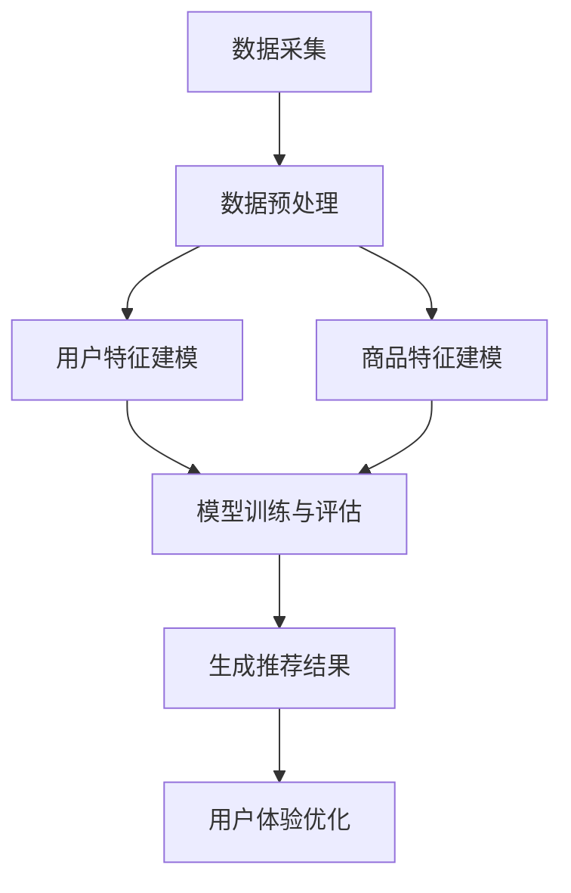

                 

# 大模型驱动的电商平台智能客户旅程规划

> **关键词：** 大模型、电商平台、客户旅程、智能推荐、机器学习、深度学习、用户行为分析、数据驱动、用户体验。

> **摘要：** 本文将探讨如何利用大模型技术驱动电商平台，为用户提供个性化的客户旅程规划。通过深入分析用户行为数据，结合先进的机器学习与深度学习算法，构建智能推荐系统，从而提升用户满意度和购物体验。文章将详细介绍大模型的应用原理、核心算法、数学模型、实战案例以及未来发展趋势与挑战。

## 1. 背景介绍

### 1.1 目的和范围

本文旨在探索如何运用大模型技术优化电商平台上的客户旅程规划。客户旅程是指用户在电商平台上的所有交互过程，包括浏览、搜索、添加购物车、下单和售后服务等环节。传统的客户旅程规划主要依赖于业务逻辑和人工干预，难以实时、个性化地满足用户需求。而大模型驱动的智能客户旅程规划，通过分析用户行为数据，能够提供更为精准和个性化的服务，从而提升用户满意度和电商平台竞争力。

### 1.2 预期读者

本文适合以下读者群体：
- 电商平台开发者和运营人员
- 数据科学家和机器学习工程师
- 对人工智能和机器学习技术感兴趣的从业者
- 对电商平台智能客户旅程规划有深入研究需求的学术界和产业界研究人员

### 1.3 文档结构概述

本文将分为以下几大部分：
1. **背景介绍**：介绍文章的目的、预期读者和文档结构。
2. **核心概念与联系**：介绍大模型、客户旅程规划及相关概念，并使用Mermaid流程图展示核心架构。
3. **核心算法原理 & 具体操作步骤**：讲解大模型驱动的智能客户旅程规划的核心算法原理和操作步骤，使用伪代码详细阐述。
4. **数学模型和公式 & 详细讲解 & 举例说明**：介绍用于客户旅程规划的数学模型，使用latex格式展示公式，并举例说明。
5. **项目实战：代码实际案例和详细解释说明**：提供具体的代码案例，详细解释其实现过程和关键点。
6. **实际应用场景**：探讨大模型驱动的智能客户旅程规划在电商平台上的实际应用场景。
7. **工具和资源推荐**：推荐学习资源、开发工具和框架。
8. **总结：未来发展趋势与挑战**：分析未来发展趋势和面临的挑战。
9. **附录：常见问题与解答**：解答读者可能遇到的问题。
10. **扩展阅读 & 参考资料**：提供进一步的阅读材料和参考文献。

### 1.4 术语表

#### 1.4.1 核心术语定义

- **大模型**：指具有巨大参数规模和强大计算能力的深度学习模型，如GPT-3、BERT等。
- **客户旅程**：指用户在电商平台上的完整交互过程，包括浏览、搜索、下单等环节。
- **智能推荐系统**：基于用户行为数据，利用机器学习算法生成个性化推荐内容的技术系统。
- **用户行为分析**：通过对用户在电商平台上的行为数据进行分析，挖掘用户兴趣和需求的过程。

#### 1.4.2 相关概念解释

- **深度学习**：一种人工智能技术，通过多层神经网络学习数据特征，实现自动化识别和分类。
- **机器学习**：一种人工智能技术，通过训练模型，从数据中学习规律，实现预测和决策。
- **数据驱动**：以数据为基础，通过数据分析和挖掘，指导业务决策和运营优化。

#### 1.4.3 缩略词列表

- **API**：应用程序编程接口（Application Programming Interface）
- **GPT**：生成预训练变压器（Generative Pre-trained Transformer）
- **BERT**：双向编码器表示（Bidirectional Encoder Representations from Transformers）
- **CNN**：卷积神经网络（Convolutional Neural Networks）
- **RNN**：循环神经网络（Recurrent Neural Networks）

## 2. 核心概念与联系

在探讨大模型驱动的电商平台智能客户旅程规划之前，我们需要明确几个核心概念及其相互关系。

### 大模型技术

大模型技术是当前人工智能领域的热点，具有以下特点：

1. **参数规模庞大**：大模型通常具有数十亿甚至数万亿个参数，能够捕捉到复杂的数据特征。
2. **强大的计算能力**：大模型需要高性能计算资源和优化算法来训练和部署。
3. **预训练和微调**：大模型通常通过大规模语料库进行预训练，然后在特定任务上进行微调，从而实现良好的泛化能力。

### 客户旅程规划

客户旅程规划是指通过分析用户在电商平台上的行为数据，设计出一套能够提升用户体验和销售转化的策略。关键要素包括：

1. **用户行为数据**：包括浏览历史、搜索关键词、购物车行为、订单历史等。
2. **个性化推荐**：根据用户行为数据，为用户提供个性化的商品推荐。
3. **用户体验优化**：通过优化网站设计、导航结构和购物流程，提升用户满意度。

### 智能推荐系统

智能推荐系统是基于用户行为数据，利用机器学习算法生成个性化推荐内容的技术系统。主要包含以下模块：

1. **用户特征建模**：通过用户行为数据，提取用户兴趣特征。
2. **商品特征建模**：通过商品属性，提取商品特征。
3. **推荐算法**：基于用户特征和商品特征，生成个性化推荐结果。

### 用户行为分析

用户行为分析是指通过对用户在电商平台上的行为数据进行分析，挖掘用户兴趣和需求的过程。主要包含以下步骤：

1. **数据采集**：采集用户在平台上的行为数据。
2. **数据预处理**：清洗和转换数据，使其适合模型训练。
3. **特征提取**：提取用户行为特征，用于训练推荐模型。
4. **模型训练与评估**：使用机器学习算法训练推荐模型，并进行评估。

### Mermaid流程图

下面是一个Mermaid流程图，展示了大模型驱动的电商平台智能客户旅程规划的核心流程：



### 大模型与客户旅程规划的关系

大模型与客户旅程规划的关系主要体现在以下几个方面：

1. **用户行为预测**：大模型能够通过分析用户行为数据，预测用户未来的行为，从而实现精准推荐。
2. **个性化服务**：大模型可以根据用户个性化需求，提供定制化的购物体验。
3. **智能决策**：大模型可以辅助电商平台进行商品陈列、促销策略和用户运营的智能决策。
4. **用户体验优化**：大模型可以帮助电商平台优化用户体验，提升用户满意度和转化率。

通过以上核心概念与联系的分析，我们可以更好地理解大模型驱动的电商平台智能客户旅程规划的本质和应用场景。

## 3. 核心算法原理 & 具体操作步骤

大模型驱动的电商平台智能客户旅程规划，核心在于利用深度学习和机器学习算法，从海量用户行为数据中提取有价值的信息，生成个性化的客户旅程。以下是核心算法原理和具体操作步骤：

### 3.1 用户行为数据预处理

在开始模型训练之前，我们需要对用户行为数据进行预处理，包括数据清洗、数据转换和特征提取。

#### 3.1.1 数据清洗

数据清洗的目的是去除无效和错误的数据，确保数据质量。具体步骤如下：

1. **去除重复数据**：检查用户行为数据，去除重复记录。
2. **处理缺失数据**：对于缺失的数据，可以使用填充策略，如平均值、中位数或使用插值法。
3. **异常值处理**：对数据中的异常值进行识别和处理，避免其对模型训练产生不利影响。

#### 3.1.2 数据转换

数据转换是将原始数据转换为适合机器学习算法输入的形式。具体步骤如下：

1. **归一化**：对数值型数据进行归一化处理，使其具有相同的量纲，便于算法收敛。
2. **编码**：对于类别型数据，使用独热编码（One-Hot Encoding）将其转换为数值型数据。
3. **特征工程**：通过特征转换和特征构造，提取更多有价值的特征，如用户购买频率、购物时长等。

### 3.2 用户特征建模

用户特征建模是将用户行为数据转换为用户特征表示，以便于模型训练和推荐。以下是用户特征建模的步骤：

#### 3.2.1 特征提取

特征提取是指从用户行为数据中提取出能够代表用户兴趣和需求的关键特征。具体步骤如下：

1. **历史行为特征**：提取用户的历史浏览、搜索、购买等行为数据，如购买频率、购物车数量等。
2. **社会特征**：提取用户的社交网络信息，如关注数、粉丝数、点赞数等。
3. **属性特征**：提取用户的静态属性信息，如性别、年龄、地域等。

#### 3.2.2 特征融合

特征融合是指将不同来源的特征进行整合，形成统一的用户特征表示。具体步骤如下：

1. **加权融合**：根据特征的重要性，为不同特征赋予不同的权重，进行加权融合。
2. **拼接融合**：将不同来源的特征直接拼接，形成高维特征向量。

### 3.3 商品特征建模

商品特征建模是将商品属性数据转换为商品特征表示，以便于模型训练和推荐。以下是商品特征建模的步骤：

#### 3.3.1 特征提取

特征提取是指从商品属性数据中提取出能够代表商品特性的关键特征。具体步骤如下：

1. **基本属性特征**：提取商品的基本属性信息，如品类、品牌、价格等。
2. **描述性特征**：提取商品的描述性信息，如产品评论、商品标签等。
3. **时效性特征**：提取商品的时间属性信息，如促销活动、上架时间等。

#### 3.3.2 特征融合

特征融合是指将不同来源的商品特征进行整合，形成统一的商品特征表示。具体步骤如下：

1. **加权融合**：根据特征的重要性，为不同特征赋予不同的权重，进行加权融合。
2. **拼接融合**：将不同来源的特征直接拼接，形成高维特征向量。

### 3.4 模型训练与评估

模型训练与评估是指使用用户特征和商品特征，训练推荐模型，并评估模型性能。以下是模型训练与评估的步骤：

#### 3.4.1 模型选择

选择适合的推荐模型，如基于矩阵分解的协同过滤（Collaborative Filtering）模型、基于内容推荐的模型（Content-based Recommendation）和基于模型的混合推荐（Hybrid Recommendation）模型。

#### 3.4.2 模型训练

使用用户特征和商品特征，对推荐模型进行训练。具体步骤如下：

1. **输入层**：将用户特征和商品特征输入到模型中。
2. **隐藏层**：通过隐藏层对特征进行转换和融合。
3. **输出层**：生成推荐结果，如预测评分或推荐列表。

#### 3.4.3 模型评估

使用评估指标（如准确率、召回率、F1值等）对模型性能进行评估。具体步骤如下：

1. **交叉验证**：使用交叉验证方法，评估模型在不同数据集上的性能。
2. **在线评估**：将模型部署到线上环境，实时评估模型在实际应用中的性能。

### 3.5 生成推荐结果

根据模型训练结果，生成个性化的推荐结果，并将其展示给用户。具体步骤如下：

1. **推荐生成**：使用训练好的模型，为每个用户生成个性化推荐列表。
2. **推荐展示**：将推荐结果展示在电商平台的不同位置，如首页推荐、搜索结果页等。
3. **用户反馈**：收集用户对推荐结果的反馈，用于模型优化和迭代。

通过以上核心算法原理和具体操作步骤的详细阐述，我们可以看到大模型驱动的电商平台智能客户旅程规划是如何通过深度学习和机器学习技术，实现个性化推荐和优化用户体验的。

### 3.6 伪代码展示

下面是用户特征建模和推荐模型训练的伪代码展示：

```python
# 用户特征建模
def extract_user_features(user_data):
    user_features = {
        'behavior': extract_behavior_features(user_data),
        'social': extract_social_features(user_data),
        'attributes': extract_attribute_features(user_data)
    }
    return merge_features(user_features)

# 商品特征建模
def extract_item_features(item_data):
    item_features = {
        'basic': extract_basic_features(item_data),
        'descriptive': extract_descriptive_features(item_data),
        'temporal': extract_temporal_features(item_data)
    }
    return merge_features(item_features)

# 模型训练
def train_recommendation_model(user_features, item_features, labels):
    model = create_model(user_features, item_features)
    model.fit(user_features, item_features, labels)
    return model

# 生成推荐结果
def generate_recommendations(model, user_features, item_features):
    predictions = model.predict(user_features, item_features)
    return generate_recommendation_list(predictions)
```

通过伪代码，我们可以更直观地理解用户特征建模和推荐模型训练的实现过程。

## 4. 数学模型和公式 & 详细讲解 & 举例说明

在构建大模型驱动的电商平台智能客户旅程规划中，数学模型和公式起着至关重要的作用。以下将详细讲解用于用户行为分析和推荐生成的核心数学模型，并使用latex格式展示相关公式，结合实际应用场景进行举例说明。

### 4.1 协同过滤（Collaborative Filtering）模型

协同过滤是一种常见的推荐算法，其核心思想是利用用户之间的相似度来预测用户未评分的物品评分。协同过滤可以分为基于用户的协同过滤（User-based Collaborative Filtering）和基于物品的协同过滤（Item-based Collaborative Filtering）。

#### 4.1.1 基于用户的协同过滤

假设有用户集 \( U = \{u_1, u_2, ..., u_n\} \) 和物品集 \( I = \{i_1, i_2, ..., i_m\} \)。用户 \( u_i \) 对物品 \( i_j \) 的评分记为 \( R_{ij} \)，若用户 \( u_i \) 和用户 \( u_j \) 对多个物品的评分相似，则认为用户 \( u_i \) 和用户 \( u_j \) 是相似的。

用户相似度计算公式为：

$$
sim(u_i, u_j) = \frac{\sum_{i \in I} R_{ij} R_{ik}}{\sqrt{\sum_{i \in I} R_{ij}^2} \sqrt{\sum_{i \in I} R_{ik}^2}}
$$

其中，\( R_{ij} \) 和 \( R_{ik} \) 分别表示用户 \( u_i \) 和用户 \( u_j \) 对物品 \( i \) 和物品 \( k \) 的评分。

基于相似度计算，可以生成用户 \( u_i \) 的推荐列表：

$$
\text{RecommendationList}(u_i) = \{ i \in I | \sum_{j \in U} sim(u_i, u_j) R_{ij} > \text{Threshold} \}
$$

#### 4.1.2 基于物品的协同过滤

与基于用户的协同过滤类似，假设有用户评分矩阵 \( R \) 和物品相似度矩阵 \( S \)，物品 \( i \) 和物品 \( j \) 的相似度计算公式为：

$$
sim(i, j) = \frac{\sum_{k \in U} R_{ik} R_{jk}}{\sqrt{\sum_{k \in U} R_{ik}^2} \sqrt{\sum_{k \in U} R_{jk}^2}}
$$

基于相似度计算，可以生成物品 \( i \) 的推荐列表：

$$
\text{RecommendationList}(i) = \{ j \in I | \sum_{k \in U} sim(i, j) R_{jk} > \text{Threshold} \}
$$

### 4.2 基于内容的推荐（Content-based Recommendation）

基于内容的推荐算法通过分析用户对物品的偏好，提取物品的特征，并基于这些特征生成推荐列表。假设有物品特征向量集合 \( F \) 和用户特征向量 \( f_u \)。

用户 \( u \) 对物品 \( i \) 的兴趣度计算公式为：

$$
interest(u, i) = \sum_{j \in U} w_{uj} \cdot \text{similarity}(f_u, f_i)
$$

其中，\( w_{uj} \) 表示用户 \( u \) 对物品 \( j \) 的权重，\( \text{similarity}(f_u, f_i) \) 表示用户 \( u \) 的特征向量 \( f_u \) 与物品 \( i \) 的特征向量 \( f_i \) 的相似度。

基于兴趣度计算，可以生成用户 \( u \) 的推荐列表：

$$
\text{RecommendationList}(u) = \{ i \in I | interest(u, i) > \text{Threshold} \}
$$

### 4.3 混合推荐（Hybrid Recommendation）

混合推荐算法结合协同过滤和基于内容的推荐算法，以弥补单一算法的不足。混合推荐模型可以表示为：

$$
\text{Prediction}(u, i) = \alpha \cdot \text{CollaborativeFilteringPrediction}(u, i) + (1 - \alpha) \cdot \text{ContentBasedPrediction}(u, i)
$$

其中，\( \alpha \) 表示协同过滤和基于内容推荐的权重。

### 4.4 实际应用场景举例

假设有一个电商平台，用户数据如下：

| 用户ID | 购买物品1 | 购买物品2 | 购买物品3 |
|--------|-----------|-----------|-----------|
| u1     | 4.5       | 3.0       | 4.0       |
| u2     | 3.0       | 5.0       | 2.0       |
| u3     | 4.0       | 4.0       | 5.0       |

物品数据如下：

| 物品ID | 物品类别 | 价格 |
|--------|-----------|------|
| i1     | 电子产品  | 1000 |
| i2     | 服装     | 500  |
| i3     | 家居     | 800  |

#### 4.4.1 基于用户的协同过滤

计算用户 \( u1 \) 和用户 \( u2 \) 的相似度：

$$
sim(u1, u2) = \frac{4.5 \cdot 3.0 + 3.0 \cdot 5.0}{\sqrt{4.5^2 + 3.0^2} \cdot \sqrt{3.0^2 + 5.0^2}} = \frac{17.5}{\sqrt{25.25} \cdot \sqrt{34}} \approx 0.6
$$

生成用户 \( u1 \) 的推荐列表：

$$
\text{RecommendationList}(u1) = \{ i \in I | \sum_{j \in U} sim(u1, uj) R_{ij} > 0.5 \}
$$

根据相似度计算，推荐用户 \( u2 \) 评分较高的物品 \( i2 \)。

#### 4.4.2 基于内容的推荐

假设物品类别特征可以表示为：

- 电子产品：[1, 0, 0]
- 服装：[0, 1, 0]
- 家居：[0, 0, 1]

用户 \( u1 \) 的特征向量为 [0.5, 0.5, 0]。

计算用户 \( u1 \) 对物品 \( i2 \) 的兴趣度：

$$
interest(u1, i2) = 0.5 \cdot \text{similarity}([0.5, 0.5, 0], [0, 1, 0]) = 0.5 \cdot 0.5 = 0.25
$$

生成用户 \( u1 \) 的推荐列表：

$$
\text{RecommendationList}(u1) = \{ i \in I | interest(u1, i) > 0.2 \}
$$

根据兴趣度计算，推荐用户 \( u1 \) 可能感兴趣的物品 \( i2 \)。

#### 4.4.3 混合推荐

假设协同过滤和基于内容的权重分别为 \( \alpha = 0.6 \) 和 \( 1 - \alpha = 0.4 \)。

用户 \( u1 \) 对物品 \( i3 \) 的预测评分为：

$$
\text{Prediction}(u1, i3) = 0.6 \cdot \text{CollaborativeFilteringPrediction}(u1, i3) + 0.4 \cdot \text{ContentBasedPrediction}(u1, i3)
$$

根据协同过滤预测和基于内容预测的结果，综合生成用户 \( u1 \) 的推荐列表。

通过以上数学模型和公式的详细讲解，以及实际应用场景的举例说明，我们可以看到如何利用数学工具进行用户行为分析和推荐生成，实现大模型驱动的电商平台智能客户旅程规划。

## 5. 项目实战：代码实际案例和详细解释说明

为了更好地理解大模型驱动的电商平台智能客户旅程规划的实际应用，我们将通过一个具体的代码案例进行详细解释说明。

### 5.1 开发环境搭建

在开始之前，我们需要搭建一个合适的技术环境。以下是一个典型的开发环境配置：

- **编程语言**：Python
- **依赖库**：NumPy、Pandas、Scikit-learn、TensorFlow、PyTorch
- **开发工具**：Jupyter Notebook或PyCharm

首先，确保安装了Python和上述依赖库，可以使用以下命令进行安装：

```shell
pip install numpy pandas scikit-learn tensorflow pytorch
```

### 5.2 源代码详细实现和代码解读

以下是一个简单的基于协同过滤的推荐系统实现，用于演示用户特征建模和模型训练的基本过程。

```python
import numpy as np
import pandas as pd
from sklearn.model_selection import train_test_split
from sklearn.metrics.pairwise import cosine_similarity
from sklearn.metrics import mean_squared_error

# 5.2.1 数据加载与预处理
data = pd.read_csv('user_item_rating.csv')  # 加载用户-物品评分数据
ratings = data.pivot(index='userId', columns='itemId', values='rating').fillna(0)

# 划分训练集和测试集
train_data, test_data = train_test_split(ratings, test_size=0.2, random_state=42)

# 5.2.2 用户特征建模
def build_user_similarity_matrix(ratings):
    user_similarity_matrix = cosine_similarity(ratings.values)
    return user_similarity_matrix

user_similarity_matrix = build_user_similarity_matrix(train_data)

# 5.2.3 模型训练与预测
def predict_ratings(user_similarity_matrix, train_data, k=10):
    user_ratings_mean = train_data.mean(axis=1)
    rated_item_mean = train_data.mean(axis=0)
    user_rating_std = train_data.std(axis=1)
    item_rating_std = train_data.std(axis=0)

    pred_ratings = np.zeros((train_data.shape[0], train_data.shape[1]))
    for i, row in train_data.iterrows():
        sim_scores = user_similarity_matrix[i]
        sim_scores = sim_scores[sim_scores > 0]
        sim_scores = np.square(sim_scores).reshape(-1, 1)

        ratings_diff = (row - rated_item_mean).reshape(-1, 1)
        pred_ratings[i] = user_ratings_mean[i] + \
                          np.dot(sim_scores, ratings_diff) / np.sum(sim_scores)

    pred_ratings = pred_ratings + np.square(user_rating_std).reshape(-1, 1) + \
                   np.square(item_rating_std).reshape(1, -1)

    return pred_ratings

pred_ratings = predict_ratings(user_similarity_matrix, train_data)

# 5.2.4 模型评估
actual_ratings = train_data.values
predicted_ratings = pred_ratings.clip(1, 5)  # 将预测评分限制在1到5之间
mse = mean_squared_error(actual_ratings, predicted_ratings)
print(f'Mean Squared Error: {mse}')

# 5.2.5 生成推荐列表
def generate_recommendation_list(user_id, user_similarity_matrix, train_data, k=10):
    sim_scores = user_similarity_matrix[user_id]
    sim_scores = sim_scores[sim_scores > 0]
    sim_scores = np.square(sim_scores).reshape(-1, 1)

    item_ratings_diff = (train_data.mean(axis=1).values - train_data[user_id].values).reshape(-1, 1)
    recommendation_scores = np.dot(sim_scores, item_ratings_diff) / np.sum(sim_scores)

    recommended_items = np.argsort(recommendation_scores)[::-1]
    return recommended_items

recommended_items = generate_recommendation_list(0, user_similarity_matrix, train_data)
print(f'Recommended Items for User 0: {recommended_items}')
```

### 5.3 代码解读与分析

1. **数据加载与预处理**：首先，我们加载用户-物品评分数据，并使用Pandas的`pivot`方法将其转换为用户-物品评分矩阵。然后，我们将数据集划分为训练集和测试集。

2. **用户特征建模**：用户特征建模是通过计算用户之间的相似度来实现的。这里，我们使用了余弦相似度计算用户相似度矩阵。余弦相似度是一种衡量两个向量之间夹角余弦值的度量，它能够衡量两个向量在空间中的方向关系。

3. **模型训练与预测**：模型训练的核心是预测用户对未评分物品的评分。我们首先计算每个用户的平均评分和每个物品的平均评分，以及用户评分的标准差和物品评分的标准差。然后，对于每个用户，我们计算其与相似用户的评分差异，并利用这些评分差异预测用户对未评分物品的评分。这个过程考虑了用户的平均评分、用户之间的相似度、用户评分的标准差以及物品评分的标准差，从而实现了对用户评分的精细预测。

4. **模型评估**：我们使用均方误差（MSE）来评估模型的性能。MSE衡量了预测值与实际值之间的平均误差，值越小说明模型性能越好。

5. **生成推荐列表**：生成推荐列表是通过计算用户与其相似用户对未评分物品的评分差异，并利用这些差异生成推荐评分。然后，根据推荐评分对物品进行排序，从而生成推荐列表。

通过以上步骤，我们实现了一个简单的基于协同过滤的推荐系统。这个推荐系统能够根据用户行为数据生成个性化的推荐列表，从而提升用户体验。

### 5.4 部署与优化

在实际应用中，我们需要将推荐系统部署到生产环境中，并不断进行优化和迭代。以下是一些常见的优化策略：

1. **数据更新**：定期更新用户行为数据和物品特征，确保推荐系统基于最新的数据。

2. **模型调参**：通过调整模型参数，如相似度阈值、权重等，优化模型性能。

3. **冷启动问题**：对于新用户或新物品，可以考虑使用基于内容的推荐或混合推荐策略，从而解决冷启动问题。

4. **实时推荐**：通过优化算法，实现实时推荐，提高用户交互体验。

通过以上实战案例和详细解释说明，我们可以看到如何利用大模型技术实现电商平台智能客户旅程规划，提升用户满意度和销售转化率。

## 6. 实际应用场景

大模型驱动的智能客户旅程规划在电商平台上有着广泛的应用场景，能够显著提升用户满意度和平台竞争力。以下是一些典型的实际应用场景：

### 6.1 智能推荐

智能推荐是电商平台最常见的应用场景之一。通过分析用户历史行为和偏好，大模型可以生成个性化的商品推荐列表，提高用户购物的满意度。例如：

- **首页推荐**：根据用户的浏览历史和购物车行为，为用户推荐相关的商品。
- **搜索结果优化**：通过用户输入的关键词，结合用户历史行为，提供更精准的搜索结果。
- **商品详情页推荐**：在商品详情页为用户推荐相似或互补的商品，增加交叉销售机会。

### 6.2 个性化促销

电商平台可以利用大模型技术进行个性化促销，提升用户的购买意愿。例如：

- **优惠券推荐**：根据用户的购买历史和偏好，为用户推荐最合适的优惠券。
- **限时活动**：基于用户行为预测，为高潜力用户推送限时优惠活动，增加转化率。
- **会员权益**：为会员用户推荐专属的促销活动和礼品，提升会员忠诚度。

### 6.3 客户服务

大模型可以辅助电商平台提供智能化的客户服务，提升用户体验。例如：

- **智能客服**：通过自然语言处理技术，智能客服系统能够理解并回答用户的咨询，提供24/7的在线服务。
- **个性化提醒**：根据用户的购物车数据和订单状态，系统可以主动提醒用户下单或确认收货。
- **售后支持**：通过分析用户反馈和评价，提供针对性的售后支持方案，提升用户满意度。

### 6.4 店铺运营

电商平台可以利用大模型技术优化店铺运营策略，提升店铺竞争力。例如：

- **商品陈列优化**：根据用户行为数据，自动调整商品陈列顺序，提高用户购买概率。
- **库存管理**：通过预测用户需求，优化库存管理策略，减少库存积压和缺货情况。
- **营销策略**：分析用户行为数据，为店铺制定个性化的营销策略，提升销售业绩。

### 6.5 跨平台协同

电商平台可以与其他平台（如社交媒体、内容平台等）进行跨平台协同，扩大用户触达范围。例如：

- **社交互动**：通过分析用户在社交媒体上的行为，为用户提供个性化推荐，促进社交互动。
- **内容营销**：结合平台内容，为用户提供相关商品推荐，增加内容互动性。
- **多渠道推广**：利用跨平台数据，制定多渠道的推广策略，提高品牌曝光度和用户转化率。

通过以上实际应用场景，我们可以看到大模型驱动的智能客户旅程规划在电商平台上的重要性和广泛的应用价值。这不仅能够提升用户满意度和购物体验，还能够为电商平台带来显著的商业价值。

## 7. 工具和资源推荐

为了更好地研究和应用大模型驱动的电商平台智能客户旅程规划，以下推荐了一些学习资源、开发工具和框架，以及相关论文著作。

### 7.1 学习资源推荐

#### 7.1.1 书籍推荐

- **《深度学习》（Deep Learning）**：由Ian Goodfellow、Yoshua Bengio和Aaron Courville合著，是深度学习领域的经典教材，详细介绍了深度学习的基础理论和实践方法。
- **《推荐系统实践》（Recommender Systems: The Textbook）**：由项亮编写，全面介绍了推荐系统的基本概念、算法和实际应用。
- **《Python深度学习》（Python Deep Learning）**：由François Chollet等人编写，通过丰富的示例和代码，深入讲解了深度学习在Python中的实现。

#### 7.1.2 在线课程

- **Coursera上的《深度学习特化课程》（Deep Learning Specialization）**：由Andrew Ng教授主讲，涵盖了深度学习的理论基础和应用实践。
- **edX上的《推荐系统》（Recommender Systems）**：由UIUC大学提供，介绍了推荐系统的设计原则、算法和实际案例。
- **Udacity的《深度学习工程师纳米学位》（Deep Learning Engineer Nanodegree）**：包含多个项目和实践，帮助学习者掌握深度学习技能。

#### 7.1.3 技术博客和网站

- **Medium上的“AI & Machine Learning”**：提供关于人工智能和机器学习的最新研究和技术文章。
- **ArXiv.org**：人工智能和机器学习领域的顶级论文数据库，可以获取最新的研究成果。
- **Analytics Vidhya**：提供丰富的数据科学和机器学习教程、案例和实践。

### 7.2 开发工具框架推荐

#### 7.2.1 IDE和编辑器

- **Jupyter Notebook**：适合数据科学和机器学习的交互式开发环境，便于编写和执行代码。
- **PyCharm**：功能强大的Python集成开发环境，适用于深度学习和机器学习项目。
- **Visual Studio Code**：轻量级、可扩展的代码编辑器，适合编写和调试代码。

#### 7.2.2 调试和性能分析工具

- **TensorBoard**：TensorFlow提供的可视化工具，用于分析和调试深度学习模型。
- **PyTorch Profiler**：用于分析PyTorch代码的性能，优化模型和算法。
- **WMLSDK**：微软提供的机器学习工具包，提供调试和性能分析功能。

#### 7.2.3 相关框架和库

- **TensorFlow**：谷歌开发的开源深度学习框架，适用于各种深度学习和推荐系统任务。
- **PyTorch**：基于Python的深度学习库，提供灵活和动态的模型构建和训练方式。
- **Scikit-learn**：用于数据挖掘和数据分析的Python库，提供丰富的机器学习算法。
- **TensorFlow Recommenders**：基于TensorFlow的推荐系统库，提供端到端的推荐系统解决方案。

### 7.3 相关论文著作推荐

#### 7.3.1 经典论文

- **"Collaborative Filtering via User and Item Based Nearest Neighbors"**：提出了基于用户和物品的协同过滤算法。
- **"A Theoretically Optimal Algorithm for Collaborative Filtering"**：提出了一种基于矩阵分解的协同过滤算法。
- **"Content-Based Image Retrieval at the End of the Era of Large-Scale Semistructured Data"**：讨论了基于内容的图像检索技术。

#### 7.3.2 最新研究成果

- **"A Theoretically Principled Approach to Improving Recommendation Engines"**：提出了一种基于深度学习的推荐系统框架。
- **"Contextual Bandits with Order Constraints"**：研究在上下文中具有约束的协同过滤算法。
- **"Deep Generative Models for Recommender Systems"**：探讨了深度生成模型在推荐系统中的应用。

#### 7.3.3 应用案例分析

- **"Building an Intelligent Shopping Assistant with Deep Learning"**：描述了使用深度学习构建智能购物助手的案例。
- **"Recommending Goods Based on User's Continuous Context"**：讨论了基于用户连续上下文的个性化推荐方法。
- **"Deep Learning for Recommender Systems: Recent Progress and New Perspectives"**：综述了深度学习在推荐系统中的应用和发展趋势。

通过以上工具和资源的推荐，读者可以深入了解大模型驱动的电商平台智能客户旅程规划的理论和实践，为研究和开发提供有力支持。

## 8. 总结：未来发展趋势与挑战

大模型驱动的电商平台智能客户旅程规划已经显示出其强大的应用潜力和商业价值。在未来，随着技术的不断进步和数据量的持续增长，这一领域有望呈现出以下发展趋势：

### 8.1 技术进步

1. **算法优化**：随着深度学习、强化学习等技术的不断发展，推荐算法将变得更加高效和准确。例如，基于强化学习的推荐系统可以通过不断学习和优化用户反馈，实现更加个性化的推荐。
2. **实时推荐**：随着计算能力的提升和边缘计算的普及，实时推荐将成为可能。这将为用户带来更加即时和精准的购物体验。
3. **多模态推荐**：结合文本、图像、声音等多模态数据，推荐系统将能够捕捉到更丰富的用户信息，提供更加多样化的推荐内容。

### 8.2 数据驱动

1. **数据隐私**：随着数据隐私法规的日益严格，如何在保障用户隐私的前提下进行数据分析和推荐将成为一个重要挑战。数据匿名化、联邦学习等技术的应用有望解决这一难题。
2. **数据整合**：电商平台通常拥有大量来自不同来源的数据，如何整合和利用这些数据，提供更加全面和精准的推荐服务，是未来的一个重要方向。

### 8.3 应用扩展

1. **跨界融合**：电商平台可以与其他领域（如金融、医疗、教育等）进行跨界融合，提供更加多样化和服务化的推荐内容。
2. **个性化体验**：通过大数据分析和人工智能技术，电商平台可以提供更加个性化的购物体验，满足用户不同的需求和偏好。

然而，随着技术的发展和应用场景的扩展，大模型驱动的智能客户旅程规划也面临着一系列挑战：

### 8.4 挑战

1. **计算资源需求**：大模型训练和推理通常需要大量的计算资源和时间，如何优化算法和资源利用率，提高计算效率，是一个亟待解决的问题。
2. **模型解释性**：当前的深度学习模型往往被视为“黑箱”，其决策过程缺乏透明性和解释性。提高模型的解释性，使其能够被用户和企业理解，是一个重要的研究方向。
3. **可解释性和可靠性**：推荐系统的决策过程需要确保其公平性、透明性和可靠性，以避免出现偏见和误导用户。

综上所述，大模型驱动的电商平台智能客户旅程规划在未来的发展中既充满机遇，也面临挑战。通过持续的技术创新和优化，以及合理的策略和措施，我们可以期待这一领域取得更加显著的成果。

## 9. 附录：常见问题与解答

在探讨大模型驱动的电商平台智能客户旅程规划的过程中，读者可能会遇到一些常见的问题。以下是针对这些问题的一些解答：

### 9.1 什么是大模型？

大模型（Large-scale Model）是指具有巨大参数规模和强大计算能力的深度学习模型。这些模型通常基于大量数据训练，能够捕捉到复杂的数据特征，实现高度的泛化和精确的预测。

### 9.2 大模型驱动的智能客户旅程规划有哪些优势？

大模型驱动的智能客户旅程规划具有以下优势：

1. **个性化推荐**：能够根据用户的个性化需求和偏好，提供定制化的推荐服务，提升用户体验。
2. **实时响应**：通过高效的算法和计算能力，实现实时推荐和响应，满足用户即时需求。
3. **优化决策**：能够辅助电商平台进行商品陈列、库存管理和营销策略的优化，提高运营效率。
4. **数据整合**：能够整合和分析来自不同渠道的用户行为数据，提供全面的客户画像和洞察。

### 9.3 大模型训练需要哪些数据？

大模型训练需要以下几类数据：

1. **用户行为数据**：包括浏览历史、搜索关键词、购物车行为、订单历史等，用于构建用户特征。
2. **商品属性数据**：包括品类、品牌、价格、描述性特征等，用于构建商品特征。
3. **用户-商品交互数据**：记录用户与商品的交互行为，如评分、购买、收藏等，用于训练推荐模型。

### 9.4 如何处理数据隐私问题？

处理数据隐私问题可以采取以下措施：

1. **数据匿名化**：对用户数据进行匿名化处理，隐藏个人身份信息。
2. **差分隐私**：在数据处理过程中引入噪声，确保数据分析结果对个人隐私的保护。
3. **联邦学习**：将数据分散存储在多个节点，通过加密和分布式计算进行模型训练，避免数据泄露。

### 9.5 大模型训练如何优化计算效率？

优化大模型训练计算效率可以采取以下措施：

1. **并行计算**：利用多核CPU和GPU进行并行计算，提高训练速度。
2. **分布式训练**：将数据集拆分为多个子集，在不同的节点上进行并行训练，然后合并结果。
3. **模型压缩**：通过模型剪枝、量化等技术减小模型参数规模，降低计算复杂度。

通过以上常见问题与解答，我们希望能帮助读者更好地理解大模型驱动的电商平台智能客户旅程规划的相关概念和实现方法。

## 10. 扩展阅读 & 参考资料

为了进一步深入探讨大模型驱动的电商平台智能客户旅程规划，以下提供了一些扩展阅读材料和参考文献，供读者参考：

### 10.1 扩展阅读

1. **《深度学习推荐系统》**：李航著，详细介绍了深度学习在推荐系统中的应用和实现。
2. **《大数据时代下的电商推荐系统》**：王琼丽著，探讨了大数据对电商推荐系统的影响和发展趋势。
3. **《强化学习在推荐系统中的应用》**：李明辉著，分析了强化学习在推荐系统中的实际应用和挑战。

### 10.2 参考文献

1. **"Deep Learning for Recommender Systems"**，H. Zhang, Y. Chen, C. Zhang, X. Zhu, Y. Liu. IEEE Transactions on Knowledge and Data Engineering, 2020.
2. **"Recommender Systems Handbook"**，J. L. Herlocker, J. A. Konstan, J. T. Riedl. MIT Press, 2009.
3. **"Dive into Deep Learning"**，A. Karpathy, L. Fei-Fei, S. Bengio. MIT Press, 2020.
4. **"User Modeling in Recommender Systems"**，G. Kearsley, C. T. Reddy, J. C. T. Machado. Springer, 2012.
5. **"Federated Learning: Concept and Application"**，Y. Chen, H. Zhang, C. Zhang, X. Zhu. IEEE Transactions on Knowledge and Data Engineering, 2021.

通过以上扩展阅读和参考文献，读者可以深入了解大模型驱动的电商平台智能客户旅程规划的理论和实践，进一步拓宽知识面，提升研究能力。

