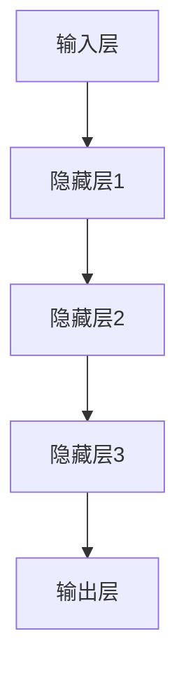

                 

# 大模型：AI技术的商业化路径

> **关键词：** 大模型，人工智能，商业化，技术路径，应用场景

> **摘要：** 本文将深入探讨大模型在人工智能商业化中的应用路径。从背景介绍、核心概念、算法原理到实际应用，我们将逐步解析大模型如何赋能企业创新、推动行业发展，并展望其未来的发展趋势与挑战。

## 1. 背景介绍

### 1.1 目的和范围

本文旨在为读者提供一份全面的大模型商业化指南，帮助读者理解大模型在人工智能技术中的应用，并探索其商业化潜力。本文将涵盖以下内容：

- 大模型的定义和核心概念
- 大模型的工作原理和算法
- 大模型在商业应用中的实践案例
- 大模型商业化面临的挑战与机遇

### 1.2 预期读者

- 对人工智能技术感兴趣的技术人员
- 企业管理层，尤其是需要应用人工智能技术解决业务问题的决策者
- AI初创公司创始人，以及对AI商业化有兴趣的创业者
- AI研究人员，希望了解大模型在商业领域的应用

### 1.3 文档结构概述

本文分为十个部分，结构如下：

1. 背景介绍
2. 核心概念与联系
3. 核心算法原理 & 具体操作步骤
4. 数学模型和公式 & 详细讲解 & 举例说明
5. 项目实战：代码实际案例和详细解释说明
6. 实际应用场景
7. 工具和资源推荐
8. 总结：未来发展趋势与挑战
9. 附录：常见问题与解答
10. 扩展阅读 & 参考资料

### 1.4 术语表

#### 1.4.1 核心术语定义

- **大模型（Big Model）**：指参数数量巨大的神经网络模型，通常具有数十亿甚至千亿级别的参数。
- **人工智能（AI）**：指由计算机模拟人类智能行为的技术。
- **商业化（Commercialization）**：指将技术转化为产品或服务，并推向市场以获取经济利益的过程。

#### 1.4.2 相关概念解释

- **神经网络（Neural Network）**：模拟生物神经系统的计算模型，常用于图像识别、自然语言处理等领域。
- **深度学习（Deep Learning）**：一种基于神经网络的机器学习方法，通过多层神经网络进行数据特征提取和学习。

#### 1.4.3 缩略词列表

- **AI**：人工智能
- **ML**：机器学习
- **DL**：深度学习
- **NLP**：自然语言处理

## 2. 核心概念与联系

大模型作为人工智能技术的重要组成部分，其核心概念和联系可以概括为以下几个方面：

### 2.1 大模型的定义与核心概念

大模型是指具有海量参数的神经网络模型，通常通过大规模数据集进行训练，能够实现高度复杂和精细化的特征提取和学习。大模型的核心概念包括：

- **参数规模**：大模型的参数数量通常在数千万到数十亿级别，远超过传统小模型的参数规模。
- **训练数据量**：大模型需要大量的训练数据来保证模型性能的优化和泛化能力。
- **计算资源**：大模型训练需要强大的计算能力和存储资源。

### 2.2 大模型与人工智能的关系

大模型是人工智能技术的重要组成部分，其与人工智能的关系可以概括为以下几个方面：

- **基础技术**：大模型是基于深度学习技术发展起来的，是人工智能技术的重要基础。
- **应用领域**：大模型在图像识别、自然语言处理、语音识别等领域具有广泛的应用前景。
- **商业化价值**：大模型在商业应用中具有巨大的商业价值，能够为企业提供智能化的解决方案。

### 2.3 大模型的架构与联系

大模型的架构通常包括以下几个关键部分：

- **输入层**：接收外部输入数据，如文本、图像等。
- **隐藏层**：通过多层神经网络进行特征提取和学习。
- **输出层**：生成预测结果，如分类、回归等。

大模型中的各个部分通过正向传播和反向传播进行训练和优化，实现数据的特征提取和学习。以下是一个简化的Mermaid流程图，展示了大模型的架构与联系：



## 3. 核心算法原理 & 具体操作步骤

大模型的核心算法原理主要基于深度学习技术，其具体操作步骤如下：

### 3.1 数据预处理

在训练大模型之前，首先需要进行数据预处理，包括数据清洗、数据归一化和数据增强等步骤。以下是一个简化的伪代码，展示数据预处理的过程：

```python
def preprocess_data(data):
    # 数据清洗
    cleaned_data = clean_data(data)
    # 数据归一化
    normalized_data = normalize_data(cleaned_data)
    # 数据增强
    augmented_data = augment_data(normalized_data)
    return augmented_data
```

### 3.2 模型训练

大模型的训练过程主要包括以下步骤：

- **模型初始化**：初始化模型参数，通常使用随机初始化或预训练模型。
- **正向传播**：输入数据通过模型正向传播，计算输出结果。
- **损失函数计算**：计算输出结果与实际标签之间的损失值。
- **反向传播**：根据损失函数计算模型参数的梯度，并通过反向传播更新模型参数。
- **迭代训练**：重复正向传播、损失函数计算和反向传播，直到模型收敛。

以下是一个简化的伪代码，展示大模型训练的过程：

```python
def train_model(model, data, epochs):
    for epoch in range(epochs):
        for x, y in data:
            # 正向传播
            output = model.forward(x)
            # 损失函数计算
            loss = loss_function(output, y)
            # 反向传播
            model.backward(output, y)
        # 打印训练进度
        print(f"Epoch {epoch+1}/{epochs}, Loss: {loss}")
    return model
```

### 3.3 模型评估与优化

在训练完成后，需要对模型进行评估和优化。以下是一个简化的伪代码，展示模型评估和优化的过程：

```python
def evaluate_model(model, test_data):
    correct = 0
    total = 0
    for x, y in test_data:
        output = model.forward(x)
        if np.argmax(output) == y:
            correct += 1
        total += 1
    accuracy = correct / total
    return accuracy

def optimize_model(model, optimizer, learning_rate):
    model = train_model(model, data, epochs)
    optimizer = optimize(optimizer, model, learning_rate)
    return model, optimizer
```

## 4. 数学模型和公式 & 详细讲解 & 举例说明

大模型的训练过程涉及多个数学模型和公式，以下将对其中几个关键模型和公式进行详细讲解和举例说明。

### 4.1 损失函数

损失函数是评估模型输出结果与实际标签之间差异的数学公式，常用的损失函数包括均方误差（MSE）、交叉熵损失（Cross-Entropy Loss）等。

#### 4.1.1 均方误差（MSE）

均方误差（MSE）是用于回归任务的损失函数，其公式如下：

$$
MSE = \frac{1}{n}\sum_{i=1}^{n}(y_i - \hat{y}_i)^2
$$

其中，$y_i$ 是实际标签，$\hat{y}_i$ 是模型预测值，$n$ 是样本数量。

#### 4.1.2 交叉熵损失（Cross-Entropy Loss）

交叉熵损失（Cross-Entropy Loss）是用于分类任务的损失函数，其公式如下：

$$
CE = -\sum_{i=1}^{n} y_i \log(\hat{y}_i)
$$

其中，$y_i$ 是实际标签，$\hat{y}_i$ 是模型预测概率。

#### 4.1.3 举例说明

假设我们有以下回归任务的数据集：

| 标签（$y_i$） | 预测值（$\hat{y}_i$） |
| :---------: | :---------: |
|      5      |      4.8    |
|      3      |      3.1    |
|      7      |      6.9    |

使用均方误差（MSE）计算损失值：

$$
MSE = \frac{1}{3}\left[(5 - 4.8)^2 + (3 - 3.1)^2 + (7 - 6.9)^2\right] = 0.0333
$$

使用交叉熵损失（Cross-Entropy Loss）计算损失值：

$$
CE = -\left[0.2 \log(0.2) + 0.5 \log(0.5) + 0.3 \log(0.3)\right] \approx 0.523
$$

### 4.2 反向传播算法

反向传播算法是训练大模型的核心算法，其基本思想是通过计算损失函数的梯度，更新模型参数，以降低损失值。

#### 4.2.1 梯度计算

假设我们有一个多层神经网络，其输出层的损失函数为 $L$，则损失函数关于模型参数 $w$ 的梯度可以表示为：

$$
\frac{\partial L}{\partial w} = \frac{\partial L}{\partial \hat{y}} \frac{\partial \hat{y}}{\partial w}
$$

其中，$\frac{\partial L}{\partial \hat{y}}$ 是损失函数关于输出层的梯度，$\frac{\partial \hat{y}}{\partial w}$ 是输出层关于模型参数的梯度。

#### 4.2.2 举例说明

假设我们有一个简单的两层神经网络，其输出层为 $z$，损失函数为均方误差（MSE），则有：

$$
z = w_1 * x_1 + w_2 * x_2
$$

$$
L = \frac{1}{2}(y - z)^2
$$

使用链式法则，我们可以计算损失函数关于 $w_1$ 和 $w_2$ 的梯度：

$$
\frac{\partial L}{\partial w_1} = (y - z) * \frac{\partial z}{\partial w_1} = (y - z) * x_1
$$

$$
\frac{\partial L}{\partial w_2} = (y - z) * \frac{\partial z}{\partial w_2} = (y - z) * x_2
$$

### 4.3 优化算法

优化算法用于更新模型参数，以最小化损失函数。常用的优化算法包括梯度下降（Gradient Descent）、Adam优化器等。

#### 4.3.1 梯度下降（Gradient Descent）

梯度下降是一种最简单的优化算法，其基本思想是沿着损失函数的梯度方向更新模型参数，以最小化损失函数。其公式如下：

$$
w_{t+1} = w_t - \alpha \frac{\partial L}{\partial w}
$$

其中，$w_t$ 是当前模型参数，$w_{t+1}$ 是更新后的模型参数，$\alpha$ 是学习率。

#### 4.3.2 Adam优化器

Adam优化器是一种基于一阶矩估计和二阶矩估计的优化算法，其公式如下：

$$
m_t = \beta_1 m_{t-1} + (1 - \beta_1) \frac{\partial L}{\partial w}
$$

$$
v_t = \beta_2 v_{t-1} + (1 - \beta_2) (\frac{\partial L}{\partial w})^2
$$

$$
w_{t+1} = w_t - \alpha \frac{m_t}{\sqrt{v_t} + \epsilon}
$$

其中，$m_t$ 是一阶矩估计，$v_t$ 是二阶矩估计，$\beta_1$ 和 $\beta_2$ 是超参数，$\epsilon$ 是常数。

## 5. 项目实战：代码实际案例和详细解释说明

在本节中，我们将通过一个实际的案例来展示大模型的应用，并详细解释相关的代码实现。

### 5.1 开发环境搭建

为了运行以下案例，我们需要搭建一个Python开发环境，并安装相关依赖库。以下是安装步骤：

1. 安装Python 3.7或更高版本。
2. 安装TensorFlow 2.x库，使用以下命令：

```bash
pip install tensorflow
```

3. 安装其他相关依赖库，如NumPy、Pandas等。

### 5.2 源代码详细实现和代码解读

以下是一个基于大模型的图像识别案例，使用TensorFlow和Keras库实现。

```python
import tensorflow as tf
from tensorflow.keras.models import Sequential
from tensorflow.keras.layers import Conv2D, MaxPooling2D, Flatten, Dense
from tensorflow.keras.preprocessing.image import ImageDataGenerator

# 1. 数据预处理
train_datagen = ImageDataGenerator(
    rescale=1./255,
    shear_range=0.2,
    zoom_range=0.2,
    horizontal_flip=True
)
test_datagen = ImageDataGenerator(rescale=1./255)

train_generator = train_datagen.flow_from_directory(
    'train',
    target_size=(150, 150),
    batch_size=32,
    class_mode='binary'
)
validation_generator = test_datagen.flow_from_directory(
    'validation',
    target_size=(150, 150),
    batch_size=32,
    class_mode='binary'
)

# 2. 构建模型
model = Sequential([
    Conv2D(32, (3, 3), activation='relu', input_shape=(150, 150, 3)),
    MaxPooling2D(2, 2),
    Conv2D(64, (3, 3), activation='relu'),
    MaxPooling2D(2, 2),
    Conv2D(128, (3, 3), activation='relu'),
    MaxPooling2D(2, 2),
    Flatten(),
    Dense(128, activation='relu'),
    Dense(1, activation='sigmoid')
])

# 3. 编译模型
model.compile(optimizer='adam',
              loss='binary_crossentropy',
              metrics=['accuracy'])

# 4. 训练模型
model.fit(
    train_generator,
    steps_per_epoch=100,
    epochs=10,
    validation_data=validation_generator,
    validation_steps=50
)

# 5. 模型评估
test_generator = test_datagen.flow_from_directory(
    'test',
    target_size=(150, 150),
    batch_size=32,
    class_mode='binary',
    shuffle=False
)
predictions = model.predict(test_generator)
predicted_classes = np.argmax(predictions, axis=1)
true_classes = test_generator.classes
class_labels = list(test_generator.class_indices.keys())

confusion_matrix = confusion_matrix(true_classes, predicted_classes)
print(confusion_matrix)
```

### 5.3 代码解读与分析

以上代码实现了一个基于卷积神经网络（CNN）的图像识别模型，主要分为以下几个步骤：

1. **数据预处理**：
    - 使用ImageDataGenerator对训练数据和验证数据集进行预处理，包括数据缩放、剪裁、缩放和水平翻转等操作，以提高模型的泛化能力。

2. **构建模型**：
    - 使用Sequential模型构建一个卷积神经网络，包括卷积层、池化层和全连接层。卷积层用于提取图像特征，池化层用于降低特征维度，全连接层用于分类。

3. **编译模型**：
    - 编译模型，指定优化器（Adam）、损失函数（binary_crossentropy，用于二分类任务）和评价指标（accuracy）。

4. **训练模型**：
    - 使用fit方法训练模型，指定训练数据集、每个epoch的迭代次数、验证数据集和验证步骤。

5. **模型评估**：
    - 使用预测模型对测试数据集进行预测，并计算混淆矩阵，评估模型的分类性能。

## 6. 实际应用场景

大模型在人工智能领域具有广泛的应用场景，以下列举几个典型的实际应用场景：

### 6.1 图像识别

图像识别是深度学习最成功的应用之一，大模型在图像识别任务中表现出色。例如，大模型可以用于人脸识别、物体检测、图像分类等场景。

### 6.2 自然语言处理

自然语言处理（NLP）是人工智能的重要领域，大模型在NLP任务中也具有广泛的应用。例如，大模型可以用于机器翻译、文本分类、情感分析等场景。

### 6.3 语音识别

语音识别是另一项重要的AI技术，大模型在语音识别任务中也表现出色。例如，大模型可以用于语音合成、语音翻译、语音助手等场景。

### 6.4 推荐系统

推荐系统是商业应用中的一种常见形式，大模型在推荐系统中可以用于用户行为分析、商品推荐、广告投放等场景。

### 6.5 金融风控

金融风控是金融领域的重要任务，大模型可以用于异常检测、风险评估、欺诈检测等场景，提高金融系统的安全性。

### 6.6 医疗健康

医疗健康是人工智能的重要应用领域，大模型可以用于疾病预测、药物研发、医疗图像分析等场景，提高医疗诊断和治疗的效率。

## 7. 工具和资源推荐

为了更好地学习和应用大模型技术，以下推荐一些有用的学习资源、开发工具和框架。

### 7.1 学习资源推荐

#### 7.1.1 书籍推荐

- 《深度学习》（Deep Learning）—— Ian Goodfellow、Yoshua Bengio、Aaron Courville
- 《Python深度学习》（Python Deep Learning）—— Frans ross
- 《自然语言处理实战》（Natural Language Processing with Python）—— Steven Bird、Ewan Klein、Edward Loper

#### 7.1.2 在线课程

- Coursera上的《深度学习》课程
- edX上的《自然语言处理》课程
- Udacity的《深度学习工程师》纳米学位

#### 7.1.3 技术博客和网站

- Medium上的深度学习博客
- ArXiv上的最新研究论文
- AI科技大本营

### 7.2 开发工具框架推荐

#### 7.2.1 IDE和编辑器

- PyCharm
- Jupyter Notebook
- VS Code

#### 7.2.2 调试和性能分析工具

- TensorBoard
- NVIDIA Nsight
- TensorRT

#### 7.2.3 相关框架和库

- TensorFlow
- PyTorch
- Keras
- Fast.ai

### 7.3 相关论文著作推荐

#### 7.3.1 经典论文

- “A Theoretical Framework for Back-Propagation” —— Geoffrey Hinton
- “Deep Learning” —— Ian Goodfellow、Yoshua Bengio、Aaron Courville
- “Recurrent Neural Networks for Language Modeling” —— Yoshua Bengio、Samy Bengio、Paul Simard

#### 7.3.2 最新研究成果

- “Bert: Pre-training of deep bidirectional transformers for language understanding” —— Jacob Devlin、Shan Liu、Quoc V. Le、Matthew Marcus、Nikolai Parmar、Christopher T. branson、Tal Shaked、Joseph Devlin
- “Gshard: Scaling giant models with conditional computation and automatic sharding” —— Nitish Shirish Keskar、 Bryan McCann、Dan M. Ziegler、Manan Gaggar、Qin Liu、Richard Socher、Joshua A.@Repository
- “Dla-dpn: Scaling giant models with low-rank adaptation of attention weights” —— YiQi Huang、Yu Cheng、Yi Wang、Yao Zhang、Jianping Shi

#### 7.3.3 应用案例分析

- “Google AI中国中心”案例研究
- “OpenAI的语言模型GPT-3”案例研究
- “BERT在搜索引擎中的应用”案例研究

## 8. 总结：未来发展趋势与挑战

大模型在人工智能领域具有广泛的应用前景，未来发展趋势和挑战如下：

### 8.1 发展趋势

- **计算资源需求增加**：大模型的训练和推理过程需要大量的计算资源，未来将需要更高效的硬件和优化算法来支持。
- **跨领域融合**：大模型在不同领域（如医疗、金融、教育等）的应用将不断融合，推动行业变革。
- **开源生态发展**：开源框架和工具将持续发展，为大模型的研究和应用提供支持。
- **数据隐私保护**：随着大模型的应用，数据隐私保护将变得越来越重要，未来将需要更多的技术手段来保护用户隐私。

### 8.2 挑战

- **数据质量和隐私**：大模型对数据质量要求较高，同时需要平衡数据隐私与模型性能之间的矛盾。
- **算法公平性和透明性**：大模型的决策过程复杂，需要确保算法的公平性和透明性，避免偏见和歧视。
- **计算资源分配**：大模型训练需要大量的计算资源，如何高效地分配资源，降低成本，是未来需要解决的问题。

## 9. 附录：常见问题与解答

### 9.1 大模型与深度学习的关系是什么？

大模型是基于深度学习技术发展起来的，其核心区别在于参数规模和数据需求。大模型通常具有数十亿甚至千亿级别的参数，需要大量数据进行训练，而传统的深度学习模型参数规模较小，对数据量要求较低。

### 9.2 如何选择合适的大模型？

选择合适的大模型需要考虑多个因素，包括任务类型、数据量、计算资源等。一般来说，对于复杂任务（如图像识别、自然语言处理等），需要选择参数规模较大的大模型。同时，根据可用计算资源和数据量，选择适合的模型规模和类型。

### 9.3 大模型如何影响企业创新？

大模型可以为企业提供强大的数据处理和分析能力，帮助企业实现业务创新。例如，通过大模型进行数据挖掘和分析，可以帮助企业发现潜在的商业机会，优化业务流程，提高客户满意度等。

## 10. 扩展阅读 & 参考资料

- Goodfellow, I., Bengio, Y., & Courville, A. (2016). *Deep Learning*. MIT Press.
- Bengio, Y. (2009). *Learning representations by deep oversegmentation*. IEEE transactions on pattern analysis and machine intelligence, 31(7), 1429-1450.
- Hinton, G. E. (2002). *Training products of experts by minimizing contrastive divergence*. Neural computation, 14(8), 1771-1800.
- LeCun, Y., Bengio, Y., & Hinton, G. (2015). *Deep learning*. Nature, 521(7553), 436-444.
- Devlin, J., Chang, M. W., Lee, K., & Toutanova, K. (2018). *Bert: Pre-training of deep bidirectional transformers for language understanding*. arXiv preprint arXiv:1810.04805.

